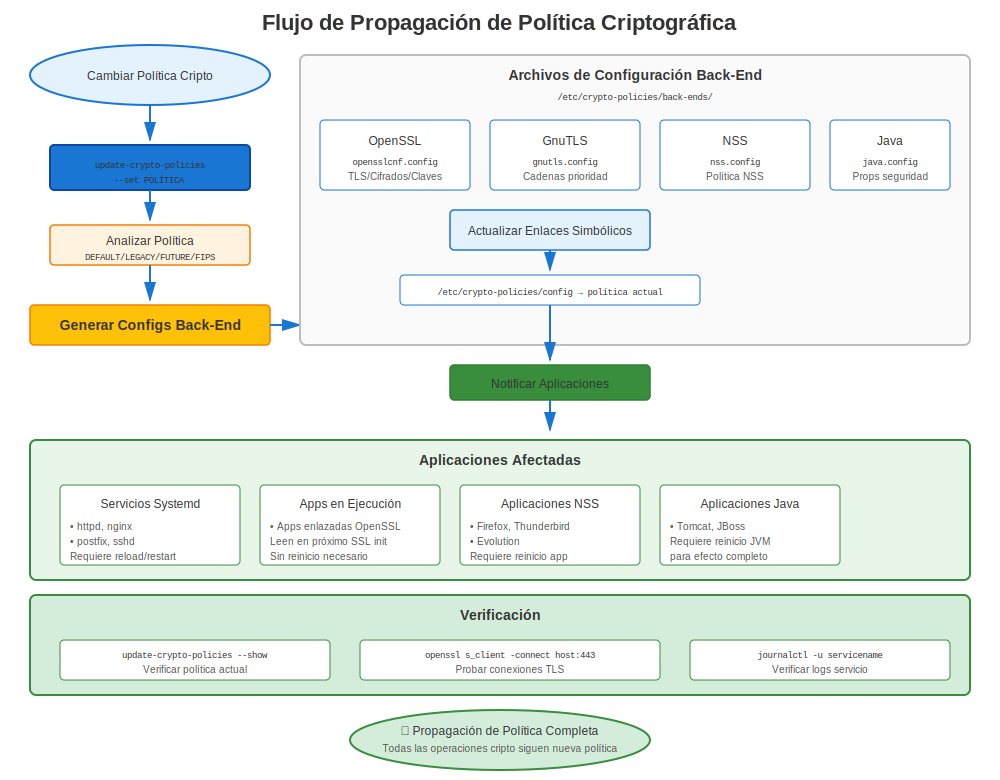

# Capítulo 23: Inmersión Profunda en Crypto-Policies

> **Característica Revolucionaria:** Las crypto-policies de RHEL 8+ proporcionan configuración criptográfica en todo el sistema. Domina esto y controlarás la seguridad en todas las aplicaciones con un solo comando.

---

## 23.1 El Problema que crypto-policies Resuelve

### Antes de Crypto-Policies (RHEL 7)

```
Configurar seguridad individualmente para CADA aplicación:

Apache:      /etc/httpd/conf.d/ssl.conf
             SSLProtocol, SSLCipherSuite

NGINX:       /etc/nginx/nginx.conf
             ssl_protocols, ssl_ciphers

Postfix:     /etc/postfix/main.cf
             smtpd_tls_protocols, smtpd_tls_mandatory_ciphers

OpenLDAP:    olcTLSProtocolMin, olcTLSCipherSuite

PostgreSQL:  ssl_min_protocol_version

OpenSSH:     /etc/ssh/sshd_config
             Ciphers, MACs, KexAlgorithms

... ¡y más de 20 aplicaciones!

Resultado: Seguridad inconsistente, pesadilla de configuración
```

### Después de Crypto-Policies (RHEL 8/9/10)

```
✅ Establecer UNA política en todo el sistema
✅ Todas las aplicaciones cumplen automáticamente
✅ Seguridad consistente en todo el sistema
✅ Cambiar política en segundos, no horas
```

**¡Cambio de juego para gestión empresarial!**

---

## 23.2 Cómo Funcionan las Crypto-Policies



### Arquitectura

```
┌──────────────────────────────────────────────────┐
│       update-crypto-policies --set DEFAULT       │
│            (Comando del administrador)           │
└───────────────────────┬──────────────────────────┘
                        │
                        ▼
┌──────────────────────────────────────────────────┐
│  /etc/crypto-policies/back-ends/                 │
│  (Archivos de configuración generados para cada  │
│  biblioteca)                                     │
│  ├─ opensslcnf.config                            │
│  ├─ gnutls.config                                │
│  ├─ nss.config                                   │
│  ├─ bind.config                                  │
│  └─ ... más ...                                  │
└───────────────────────┬──────────────────────────┘
                        │
            ┌───────────┼───────────┐
            ▼           ▼           ▼
         OpenSSL     GnuTLS        NSS
            ↓           ↓           ↓
         Apache      NGINX       Firefox
         Postfix     vsftpd      Thunderbird
         OpenSSH     wget        Java apps
```

**Concepto Clave:** ¡Las aplicaciones leen de archivos back-end, no directamente de la política!

---

## 23.3 Las Cuatro Políticas Principales

### Comparación de Políticas

| Política | Versiones TLS | RSA Mín | SHA-1 | 3DES | DH Mín | Caso de Uso |
|----------|---------------|---------|-------|------|--------|-------------|
| **DEFAULT** | 1.2, 1.3 | 2048 | ❌ | ❌ | 2048 | ✅ Recomendado |
| **LEGACY** | 1.0+ | 1024 | ⚠️ | ⚠️ | 1024 | Solo compatibilidad |
| **FUTURE** | 1.2, 1.3 | 3072 | ❌ | ❌ | 3072 | Alta seguridad |
| **FIPS** | 1.2, 1.3 | 2048 | ❌ | ❌ | 2048 | Cumplimiento federal |

### Detalles de Política DEFAULT

```yaml
# Seguridad y compatibilidad equilibradas
Protocolos:
  - TLS 1.2
  - TLS 1.3

Tamaños Mínimos de Clave:
  - RSA: 2048 bits
  - DH: 2048 bits
  - ECC: secp256r1 (P-256)

Cifrados Permitidos:
  - AES-128-GCM
  - AES-256-GCM
  - ChaCha20-Poly1305
  - AES-128-CBC
  - AES-256-CBC

Algoritmos de Firma:
  - SHA-256
  - SHA-384
  - SHA-512

Bloqueados:
  - TLS 1.0, 1.1
  - MD5
  - Firmas SHA-1
  - 3DES, RC4, DES
  - RSA < 2048 bits
  - Cifrados de exportación
```

---

## 23.4 Ver y Cambiar Políticas

### Comandos Básicos

```bash
#============================================#
# OPERACIONES BÁSICAS CRYPTO-POLICY
#============================================#

# Ver política actual
update-crypto-policies --show
# Salida: DEFAULT

# Listar políticas disponibles
ls /usr/share/crypto-policies/policies/
# DEFAULT.pol  FUTURE.pol  LEGACY.pol  FIPS.pol

# Establecer política
sudo update-crypto-policies --set FUTURE

# ¡DEBES reiniciar servicios para que los cambios tengan efecto!
sudo systemctl restart httpd nginx postfix slapd

# O reiniciar (asegura que todo recoja los cambios)
sudo reboot
```

### Qué Sucede Cuando Cambias la Política

```bash
#============================================#
# DETRÁS DE ESCENA
#============================================#

# Antes
update-crypto-policies --show
# DEFAULT

# Cambiar
sudo update-crypto-policies --set FUTURE

# Actualizaciones generadas:
ls -l /etc/crypto-policies/back-ends/
# -rw-r--r--. opensslcnf.config    ← ¡Actualizado!
# -rw-r--r--. gnutls.config        ← ¡Actualizado!
# -rw-r--r--. nss.config           ← ¡Actualizado!
# -rw-r--r--. bind.config          ← ¡Actualizado!
# ... todos los back-ends actualizados ...

# Ver configuración de OpenSSL
cat /etc/crypto-policies/back-ends/opensslcnf.config
# Muestra configuración real de OpenSSL aplicada
```

---

## 23.5 Subpolíticas (RHEL 9+)

### Modificadores de Política

**RHEL 9 introdujo subpolíticas** - ¡afinar políticas existentes!

```bash
#============================================#
# SUBPOLÍTICAS CRYPTO-POLICY (RHEL 9+)
#============================================#

# Política base con modificador
sudo update-crypto-policies --set DEFAULT:NO-SHA1

# Múltiples modificadores
sudo update-crypto-policies --set DEFAULT:NO-SHA1:GOST

# Módulos de subpolítica disponibles
ls /usr/share/crypto-policies/policies/modules/
# AD-SUPPORT.pmod
# GOST.pmod
# NO-CAMELLIA.pmod
# NO-SHA1.pmod
# NO-ENFORCE-EMS.pmod
# ...y más

# Ver detalles del módulo
cat /usr/share/crypto-policies/policies/modules/NO-SHA1.pmod
```

**Subpolíticas Comunes:**

| Subpolítica | Efecto | Caso de Uso |
|-------------|--------|-------------|
| `NO-SHA1` | Deshabilitar completamente SHA-1 | Seguridad extra |
| `AD-SUPPORT` | Habilitar compatibilidad AD | Mixto Windows/Linux |
| `GOST` | Habilitar algoritmos GOST | Requisitos rusos |
| `NO-CAMELLIA` | Deshabilitar cifrado Camellia | Cumplimiento específico |
| `NO-ENFORCE-EMS` | Deshabilitar Extended Master Secret | Compatibilidad |

---

## 23.6 Crear Módulos de Política Personalizados

### Ejemplo de Módulo Personalizado

```bash
#============================================#
# CREAR MÓDULO DE POLÍTICA PERSONALIZADO
#============================================#

# Crear módulo personalizado
sudo vi /etc/crypto-policies/policies/modules/CUSTOM-SECURITY.pmod

# Contenido de ejemplo:
min_rsa_size = 4096
min_dh_size = 3072
min_dsa_size = 3072
sha1_in_certs = 0
arbitrary_dh_groups = 0
ssh_certs = 0

# Aplicar
sudo update-crypto-policies --set DEFAULT:CUSTOM-SECURITY

# Reiniciar servicios
sudo systemctl restart httpd nginx postfix

# Verificar
openssl ciphers -v | grep -E "RSA|DH"
```

---

## 23.7 Sobrescrituras por Aplicación

### Cuándo Sobrescribir

A veces UNA aplicación necesita ajustes diferentes de la política del sistema:

**Ejemplo:** La aplicación legacy necesita TLS 1.1, pero el sistema usa DEFAULT

### Sobrescritura de Apache

```apache
#============================================#
# SOBRESCRITURA CRYPTO-POLICY DE APACHE
#============================================#

# /etc/httpd/conf.d/ssl.conf

# Opción 1: Incluir crypto-policy, luego sobrescribir
Include /etc/crypto-policies/back-ends/httpd.config

# Luego agregar sobrescrituras:
SSLProtocol all -SSLv3  # Re-habilitar TLS 1.0/1.1

# Opción 2: Optar completamente por no usar
# No incluir archivo crypto-policy
# Configurar manualmente todo:
SSLProtocol TLSv1.1 TLSv1.2 TLSv1.3
SSLCipherSuite HIGH:!aNULL:!MD5

# ⚠️ Advertencia: Ahora gestionas TLS de Apache manualmente
# Los cambios de crypto-policy del sistema no afectarán Apache
```

**Mejor Enfoque:** ¡Crear módulo de política personalizado en lugar de sobrescrituras por app!

---

## 23.8 Probar Impacto de Política

### Antes de Cambiar Política

```bash
#============================================#
# PROBAR IMPACTO DE CAMBIO DE POLÍTICA
#============================================#

# 1. Documentar estado actual
update-crypto-policies --show > /tmp/current-policy.txt
systemctl list-units --type=service --state=running > /tmp/running-services.txt

# 2. Probar aplicaciones
curl https://localhost/
psql -h localhost  # etc.

# 3. Cambiar política en sistema de prueba primero
sudo update-crypto-policies --set FUTURE

# 4. Reiniciar servicios
sudo systemctl restart httpd nginx postfix

# 5. Probar exhaustivamente
./test-all-services.sh

# 6. Si hay problemas: Revertir
sudo update-crypto-policies --set DEFAULT

# 7. Si exitoso: Documentar y desplegar a producción
```

---

## 23.9 Impacto de Política en Certificados

### Qué Controlan las Políticas

**Crypto-policies afectan:**
- ✅ Versiones de protocolo TLS permitidas
- ✅ Suites de cifrado disponibles
- ✅ Tamaños mínimos de clave aceptados
- ✅ Algoritmos de firma permitidos
- ✅ Parámetros Diffie-Hellman
- ✅ Rigurosidad de validación de certificado

**Crypto-policies NO afectan:**
- ❌ Qué certificados usar (aún configurado por servicio)
- ❌ Ubicaciones de archivos de certificado
- ❌ Almacén de confianza CA (eso es update-ca-trust)
- ❌ Emisión de certificados

### Matriz de Compatibilidad de Certificados

| Tipo de Certificado | DEFAULT | LEGACY | FUTURE | FIPS |
|---------------------|---------|--------|--------|------|
| RSA 1024 bit | ❌ | ⚠️ | ❌ | ❌ |
| RSA 2048 bit | ✅ | ✅ | ❌ | ✅ |
| RSA 3072 bit | ✅ | ✅ | ✅ | ✅ |
| RSA 4096 bit | ✅ | ✅ | ✅ | ✅ |
| EC P-256 | ✅ | ✅ | ❌ | ✅ |
| EC P-384 | ✅ | ✅ | ✅ | ✅ |
| Firma SHA-1 | ❌ | ⚠️ | ❌ | ❌ |
| Firma SHA-256 | ✅ | ✅ | ✅ | ✅ |

---

## 23.10 Solución de Problemas Crypto-Policies

### Problemas Comunes

**Problema 1: La Aplicación Falla Después de Cambio de Política**

```bash
# Síntoma
sudo update-crypto-policies --set FUTURE
sudo systemctl restart httpd
# httpd falla al iniciar

# Diagnóstico
sudo journalctl -xe -u httpd | grep -i cipher

# Causa común: La aplicación tiene cifrados débiles codificados

# Solución 1: Revertir política
sudo update-crypto-policies --set DEFAULT

# Solución 2: Actualizar configuración de aplicación
# Eliminar especificaciones de cifrado codificadas

# Solución 3: Crear módulo de política personalizado
```

**Problema 2: "No Shared Cipher"**

```bash
# Síntoma: Los clientes no pueden conectar

# Probar
openssl s_client -connect server:443

# Si muestra "no shared cipher":

# Verificar política
update-crypto-policies --show

# Probar capacidades del cliente
openssl s_client -connect server:443 -cipher 'ALL' -tls1_2

# Solución temporal (no recomendada a largo plazo):
sudo update-crypto-policies --set LEGACY

# Solución apropiada: Actualizar cliente para soportar TLS 1.2+ y cifrados modernos
```

**Problema 3: La Política No Parece Aplicarse**

```bash
# Verificar si la aplicación está sobrescribiendo la política

# Apache
grep -r "SSLProtocol\|SSLCipherSuite" /etc/httpd/
# Si se encuentra: La app está sobrescribiendo la política

# NGINX
grep -r "ssl_protocols\|ssl_ciphers" /etc/nginx/
# Si se encuentra: La app está sobrescribiendo la política

# Solución: Eliminar sobrescrituras, dejar que crypto-policy lo maneje
# O: Documentar por qué la sobrescritura es necesaria
```

---

## 23.11 Mejores Prácticas

### Recomendaciones

```markdown
✅ **Usar política DEFAULT** para la mayoría de entornos
✅ **Probar antes de desplegar** nuevas políticas
✅ **Documentar elecciones de política** y razones
✅ **Reiniciar servicios** después de cambios de política
✅ **Evitar sobrescrituras por app** cuando sea posible
✅ **Usar subpolíticas** (RHEL 9+) para ajuste fino
✅ **Monitorear problemas** de compatibilidad
✅ **Mantener LEGACY temporal** si se usa
✅ **Planificar migraciones** al cambiar políticas
✅ **Actualizar clientes** en lugar de debilitar política
```

### Cuándo Usar Cada Política

**DEFAULT:**
- ✅ La mayoría de entornos de producción
- ✅ Seguridad/compatibilidad equilibrada
- ✅ Punto de partida recomendado
- ✅ Probada y mantenida por Red Hat

**LEGACY:**
- ⚠️ ¡Solo temporal durante migraciones!
- ⚠️ Soportar clientes muy antiguos
- ⚠️ Probar problemas de compatibilidad
- ❌ ¡Nunca a largo plazo!

**FUTURE:**
- ✅ Entornos de alta seguridad
- ✅ Todos los clientes son modernos
- ✅ Quieres los ajustes más fuertes
- ✅ Planificación para estándares futuros

**FIPS:**
- ✅ Cumplimiento federal requerido
- ✅ Contratos gubernamentales
- ✅ Industrias reguladas
- ✅ Requisitos de certificación

---

## 23.12 Inmersión Profunda en Política FIPS

### Habilitar Modo FIPS

```bash
#============================================#
# HABILITAR MODO FIPS
#============================================#

# Verificar estado actual
fips-mode-setup --check
# FIPS mode is disabled.

# Habilitar modo FIPS
sudo fips-mode-setup --enable

# SE DEBE reiniciar
sudo reboot

# Verificar después de reiniciar
fips-mode-setup --check
# FIPS mode is enabled.

# Crypto-policy automáticamente establecida a FIPS
update-crypto-policies --show
# FIPS
```

**Requisitos del Modo FIPS:**
- Debe habilitarse en instalación O con fips-mode-setup
- Requiere reinicio
- Afecta todo el sistema
- Solo algoritmos aprobados por FIPS disponibles
- Impacto en rendimiento (~10-20% más lento)

### Especificaciones de Política FIPS

```bash
# Qué permite la política FIPS:
✅ TLS 1.2, 1.3
✅ RSA 2048+ bits
✅ AES-128, AES-256 (modo GCM)
✅ SHA-256, SHA-384, SHA-512
✅ Intercambio de clave ECDHE

# Qué bloquea FIPS:
❌ TLS 1.0, 1.1
❌ RSA < 2048 bits
❌ 3DES, RC4, DES
❌ MD5, SHA-1
❌ Algoritmos no aprobados
❌ Cifrados modo CBC (en algunos casos)
```

---

## 23.13 Monitoreo y Auditoría

### Verificar Cumplimiento de Política

```bash
#============================================#
# VERIFICAR CUMPLIMIENTO CRYPTO-POLICY
#============================================#

# Política actual
update-crypto-policies --show

# ¿Qué aplicaciones usan crypto-policies?
ls -l /etc/crypto-policies/back-ends/

# Verificar que OpenSSL sigue la política
openssl ciphers -v | head -20

# Verificar configuración específica de aplicación
# Apache
cat /etc/crypto-policies/back-ends/httpd.config

# Probar conexión real
openssl s_client -connect localhost:443 -tls1_3

# Verificar que no haya sobrescrituras
grep -r "SSLProtocol\|SSLCipherSuite" /etc/httpd/ | grep -v crypto-policies
# Debería estar vacío o comentado
```

---

## 23.14 Flujo de Trabajo de Solución de Problemas

### Enfoque Sistemático

```
¿La aplicación falla después de cambio de política?
    │
    ├─ Paso 1: Identificar error
    │   └─ Verificar logs: journalctl -xe
    │
    ├─ Paso 2: Verificar política activa
    │   └─ update-crypto-policies --show
    │
    ├─ Paso 3: Probar con LEGACY
    │   └─ sudo update-crypto-policies --set LEGACY
    │   └─ Si funciona → problema de cifrado/protocolo
    │
    ├─ Paso 4: Identificar incompatibilidad
    │   └─ openssl s_client -cipher 'ALL' -tls1
    │   └─ Encontrar qué necesita cliente/servidor
    │
    ├─ Paso 5: Elegir solución
    │   ├─ A) Actualizar cliente (mejor)
    │   ├─ B) Crear módulo personalizado (bueno)
    │   └─ C) Sobrescritura por app (último recurso)
    │
    └─ Paso 6: Documentar y desplegar
        └─ Por qué se necesita sobrescritura, plan para eliminar
```

---

## 23.15 Conclusiones Clave

1. **Crypto-policies son solo RHEL 8+** (no en RHEL 7)
2. **Política DEFAULT es recomendada** para la mayoría de casos
3. **Los cambios requieren reinicios de servicio** para tener efecto
4. **Afecta TODAS las aplicaciones crypto** en todo el sistema
5. **Las subpolíticas proporcionan ajuste fino** (RHEL 9+)
6. **Evitar sobrescrituras por app** cuando sea posible
7. **Probar antes de desplegar** nuevas políticas
8. **¡LEGACY es solo temporal!**

---

## Tarjeta de Referencia Rápida

```
┌──────────────────────────────────────────────────────────────┐
│ REFERENCIA RÁPIDA CRYPTO-POLICIES                            │
├──────────────────────────────────────────────────────────────┤
│ Disponible:     Solo RHEL 8, 9, 10 (no RHEL 7)               │
│                                                              │
│ Ver:            update-crypto-policies --show                │
│ Establecer:     sudo update-crypto-policies --set <POLICY>   │
│ Políticas:      DEFAULT, LEGACY, FUTURE, FIPS                │
│                                                              │
│ Subpolítica:    update-crypto-policies --set DEFAULT:NO-SHA1 │
│                 (solo RHEL 9+)                               │
│                                                              │
│ Back-ends:      /etc/crypto-policies/back-ends/              │
│ Módulos:        /usr/share/crypto-policies/policies/modules/ │
│                                                              │
│ Después cambio: systemctl restart <servicios>                │
│                 O reboot                                     │
│                                                              │
│ DEFAULT:        TLS 1.2+, RSA 2048+, Sin SHA-1               │
│ LEGACY:         TLS 1.0+, permite débiles (¡solo temporal!)  │
│ FUTURE:         TLS 1.2+, RSA 3072+, más estricto            │
│ FIPS:           Cumplimiento federal (requiere modo FIPS)    │
└──────────────────────────────────────────────────────────────┘

⚠️ RHEL 7 no tiene crypto-policies (solo config manual)
✅ DEFAULT funciona para 95% de entornos
```

---

## 🧪 Laboratorio Práctico

**Lab 12: Crypto-Policies**

Comprende y configura crypto-policies a nivel de sistema

- 📁 **Ubicación:** `labs/es_ES/12-crypto-policies/`
- ⏱️ **Tiempo:** 25-30 minutos
- 🎯 **Nivel:** Intermedio

---

**Navegación del Capítulo**

| [← Anterior: Capítulo 22 - Dominio de certmonger](22-certmonger-mastery.md) | [Siguiente: Capítulo 24 - Let's Encrypt y certbot →](24-letsencrypt-certbot.md) |
|:---|---:|
