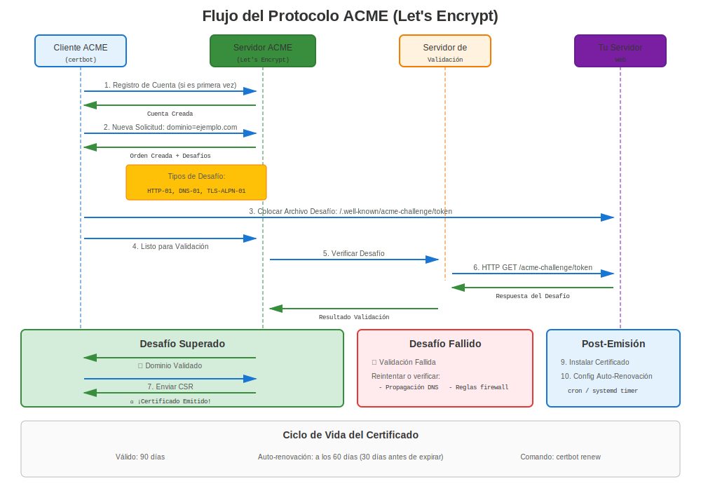
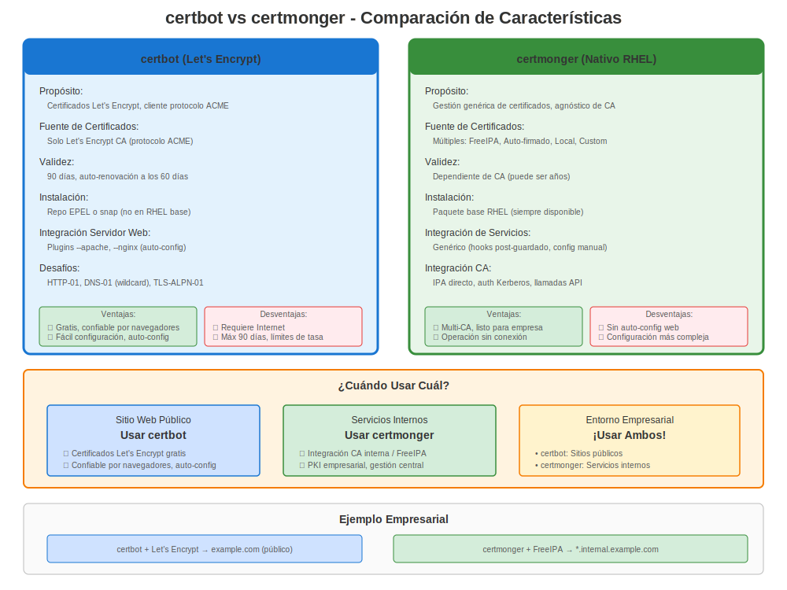

# Capítulo 24: Let's Encrypt y certbot

> **Certificados Públicos Gratuitos:** Let's Encrypt proporciona certificados gratuitos y automatizados para sitios web públicos. Aprende cómo usarlo en RHEL con certbot.

---

## 24.1 ¿Qué es Let's Encrypt?



**Let's Encrypt** es una Autoridad Certificadora gratuita, automatizada y abierta.

**Características Clave:**
- ✅ **Certificados gratuitos** (sin costo)
- ✅ **Emisión automatizada** (vía protocolo ACME)
- ✅ **Renovación automática** (cada 60-90 días)
- ✅ **Ampliamente confiable** (en todos los navegadores principales)
- ✅ **Validación de dominio** (certificados DV)

**Limitaciones:**
- ❌ **Solo dominios públicos** (debe ser accesible por internet para validación)
- ❌ **Validez de 90 días** (corta duración, requiere automatización)
- ❌ **Solo Validación de Dominio** (no Organization o Extended Validation)
- ❌ **Sin comodín con HTTP-01** (requiere desafío DNS-01)

---

## 24.2 Let's Encrypt en RHEL: ACME público y alternativas nativas



### Método 1: certbot (Tradicional)

> **⚠️ CRÍTICO: EPEL Requerido**
>
> **certbot NO está disponible en repositorios oficiales de RHEL.**
>
> Requiere **EPEL** (Extra Packages for Enterprise Linux), un repositorio **mantenido por la comunidad** que **NO está oficialmente soportado por Red Hat**.
>
> **Para Entornos de Producción Empresarial:**
> - Considera FreeIPA con certmonger (Capítulo 19)
> - O CA comercial con certmonger (Capítulo 22)
> - O gestión manual de certificados
>
> **EPEL es adecuado para:**
> - Entornos de desarrollo/prueba
> - Despliegues pequeños donde el riesgo de EPEL es aceptable
> - Situaciones donde certificados gratuitos superan preocupaciones de soporte

**Herramienta certbot:**
- Automatización completa
- Plugins Apache/NGINX
- Configuración automática
- Temporizadores de renovación
- ⚠️ Requiere EPEL

### Método 2: certmonger para CAs internas/privadas

**Solución Nativa RHEL:**
- ✅ No se necesita EPEL
- ✅ Soportado por Red Hat
- ✅ Mejor encaje para flujos de FreeIPA / IdM y CA local
- ⏸️ Config manual de servidor web (sin plugins Apache/NGINX)
- ❌ No es un reemplazo directo de certbot para Let's Encrypt público

**Usaremos certbot para Let's Encrypt público y certmonger para flujos internos nativos.**

---

## 24.3 Instalación de certbot

### RHEL 7

```bash
#============================================#
# INSTALAR CERTBOT EN RHEL 7 (¡REQUIERE EPEL!)
#============================================#

# ⚠️ ADVERTENCIA: Habilitando repositorio de terceros

# Paso 1: Habilitar EPEL
sudo yum install https://dl.fedoraproject.org/pub/epel/epel-release-latest-7.noarch.rpm -y

# Verificar EPEL habilitado
yum repolist | grep epel

# Paso 2: Instalar certbot
sudo yum install certbot python2-certbot-apache python2-certbot-nginx -y

# Verificar
certbot --version
```

### RHEL 8

```bash
#============================================#
# INSTALAR CERTBOT EN RHEL 8 (¡REQUIERE EPEL!)
#============================================#

# ⚠️ ADVERTENCIA: Habilitando repositorio de terceros

# Paso 1: Habilitar EPEL
sudo dnf install https://dl.fedoraproject.org/pub/epel/epel-release-latest-8.noarch.rpm -y

# O si tienes suscripción:
sudo dnf install epel-release -y

# Paso 2: Instalar certbot
sudo dnf install certbot python3-certbot-apache python3-certbot-nginx -y

# Verificar
certbot --version
```

### RHEL 9/10

```bash
#============================================#
# INSTALAR CERTBOT EN RHEL 9/10 (¡REQUIERE EPEL!)
#============================================#

# ⚠️ ADVERTENCIA: Habilitando repositorio de terceros

# Paso 1: Habilitar EPEL
sudo dnf install epel-release -y

# Paso 2: Instalar certbot
sudo dnf install certbot python3-certbot-apache python3-certbot-nginx -y

# Verificar
certbot --version
```

> **Recuerda:** EPEL tiene soporte comunitario. Para producción empresarial, considera FreeIPA + certmonger (solución nativa RHEL).

---

## 24.4 Uso de certbot - Apache

### Configuración Automática de Apache

```bash
#============================================#
# CERTBOT CON APACHE (¡AUTOMATIZADO!)
#============================================#

# Prerrequisitos:
# - Apache instalado y ejecutándose
# - Puerto 80 accesible desde internet
# - Dominio resuelve a este servidor
# - Repositorio EPEL habilitado

# Obtener certificado y auto-configurar Apache
sudo certbot --apache -d www.example.com -d example.com

# certbot hará:
# 1. Generar certificado de Let's Encrypt
# 2. Configurar automáticamente Apache SSL
# 3. Configurar redirección HTTP→HTTPS
# 4. Configurar renovación automática

# Prompts interactivos:
# - Dirección de email (para avisos de renovación)
# - Aceptar ToS
# - ¿Redirigir HTTP a HTTPS? (elegir sí)

# No interactivo (automatización):
sudo certbot --apache \
  -d www.example.com \
  -d example.com \
  --non-interactive \
  --agree-tos \
  --email admin@example.com \
  --redirect

# Ubicación del certificado:
# /etc/letsencrypt/live/www.example.com/fullchain.pem
# /etc/letsencrypt/live/www.example.com/privkey.pem
```

---

## 24.5 Uso de certbot - NGINX

### Configuración Automática de NGINX

```bash
#============================================#
# CERTBOT CON NGINX (¡AUTOMATIZADO!)
#============================================#

# Prerrequisitos:
# - NGINX instalado y ejecutándose
# - Puerto 80 accesible
# - Dominio resuelve al servidor

# Obtener y configurar
sudo certbot --nginx -d api.example.com

# No interactivo
sudo certbot --nginx \
  -d api.example.com \
  --non-interactive \
  --agree-tos \
  --email admin@example.com \
  --redirect

# ¡certbot actualiza configuración de NGINX automáticamente!
# No se necesita configuración SSL manual
```

---

## 24.6 Modo Manual certbot (Standalone)

### Sin Plugin de Servidor Web

```bash
#============================================#
# CERTBOT STANDALONE (SIN PLUGIN)
#============================================#

# Usar cuando:
# - El servidor web no es Apache/NGINX
# - Quieres control manual sobre configuración
# - Usas servidor web personalizado

# Obtener solo certificado (no configura servidor)
sudo certbot certonly --standalone \
  -d app.example.com \
  --non-interactive \
  --agree-tos \
  --email admin@example.com

# Certificado guardado en:
# /etc/letsencrypt/live/app.example.com/fullchain.pem
# /etc/letsencrypt/live/app.example.com/privkey.pem

# Configurar manualmente tu servicio para usarlo
# Ejemplo Apache:
# SSLCertificateFile /etc/letsencrypt/live/app.example.com/fullchain.pem
# SSLCertificateKeyFile /etc/letsencrypt/live/app.example.com/privkey.pem
```

---

## 24.7 Renovación

### Renovación Automática

```bash
#============================================#
# RENOVACIÓN AUTOMÁTICA CERTBOT
#============================================#

# certbot configura automáticamente temporizador de renovación
systemctl list-timers | grep certbot
# Debería mostrar: certbot-renew.timer

# Ver detalles del temporizador
systemctl status certbot-renew.timer

# Probar renovación (simulación - no renueva realmente)
sudo certbot renew --dry-run

# Forzar renovación real (si es necesario)
sudo certbot renew --force-renewal

# Verificar expiración de certificado
sudo certbot certificates

# La renovación se ejecuta dos veces al día
# Renueva certificados expirando dentro de 30 días
```

### Hooks de Renovación

```bash
#============================================#
# HOOKS DE RENOVACIÓN (COMANDOS DE DESPLIEGUE)
#============================================#

# Agregar hook para recargar servicio después de renovación
sudo certbot renew --deploy-hook "systemctl reload nginx"

# O crear script de hook
sudo vi /etc/letsencrypt/renewal-hooks/deploy/reload-services.sh

#!/bin/bash
systemctl reload httpd
systemctl reload nginx
systemctl reload postfix

sudo chmod +x /etc/letsencrypt/renewal-hooks/deploy/reload-services.sh

# Hooks en /etc/letsencrypt/renewal-hooks/:
# - pre/: Ejecutar antes de renovación
# - post/: Ejecutar después de renovación (incluso si falló)
# - deploy/: Ejecutar después solo de renovación exitosa
```

---

## 24.8 Certificados Comodín

### Desafío DNS-01 Requerido

```bash
#============================================#
# CERTIFICADO COMODÍN (DESAFÍO DNS)
#============================================#

# Comodín requiere desafío DNS-01
# (no puede usar HTTP-01 para *.example.com)

# Desafío DNS manual
sudo certbot certonly --manual \
  --preferred-challenges dns \
  -d "*.example.com" \
  -d "example.com"

# certbot te pedirá que:
# 1. Crees registro TXT en DNS
# 2. Esperes a propagación
# 3. Presiones Enter para continuar

# Automatización DNS con plugins (si está disponible)
# sudo certbot certonly --dns-route53 -d "*.example.com"
# (requiere plugin de proveedor DNS)
```

---

## 24.9 Dónde encaja certmonger

### Usa certmonger para flujos de CA interna o privada

```bash
#============================================#
# CERTMONGER PARA FLUJOS IPA / CA INTERNA
#============================================#

# Instalar certmonger (incluido en RHEL)
sudo dnf install certmonger -y
sudo systemctl enable --now certmonger

# Solicitar un certificado interno de FreeIPA / IdM
sudo ipa-getcert request \
  -f /etc/pki/tls/certs/internal.example.com.crt \
  -k /etc/pki/tls/private/internal.example.com.key \
  -K HTTP/internal.example.com@REALM \
  -D internal.example.com \
  -C "systemctl reload httpd"

# Verificar estado
sudo getcert list

# Certmonger hace el seguimiento y la renovación del certificado interno
```

**Mantén separados estos flujos:**

| Caso de uso | Herramienta recomendada |
|----------|------------------|
| Certificado público de internet de Let's Encrypt | `certbot` |
| Certificado interno de FreeIPA / IdM | `certmonger` con `ipa-getcert` |
| ACME contra tu propio endpoint IdM ACME | `certbot` u otro cliente ACME |

> **Importante:** IdM ACME, cuando está habilitado, es tu propia CA FreeIPA / IdM exponiendo un endpoint ACME. No es Let's Encrypt.

---

## 24.10 Solución de Problemas certbot

### Problemas Comunes

**Problema 1: Falló Validación de Desafío**

```bash
# Síntoma
sudo certbot --apache -d example.com
# Error: Challenge validation failed

# Causas comunes:
# 1. Puerto 80 no accesible
curl http://example.com/.well-known/acme-challenge/test
# Debería ser accesible desde internet

# 2. Firewall bloqueando
sudo firewall-cmd --list-services | grep http

# 3. DNS no resolviendo
nslookup example.com

# 4. Otro servicio en puerto 80
ss -tlnp | grep :80
```

**Problema 2: Falló Renovación**

```bash
# Verificar logs de renovación
sudo cat /var/log/letsencrypt/letsencrypt.log

# Causas comunes:
# - Puerto 80 bloqueado
# - DNS cambió
# - Límite de tasa alcanzado

# Probar renovación manualmente
sudo certbot renew --dry-run
```

**Problema 3: Errores de Permisos**

```bash
# Corregir permisos de certbot
sudo chmod 0755 /etc/letsencrypt/{live,archive}
sudo chmod 0644 /etc/letsencrypt/live/*/fullchain.pem
sudo chmod 0600 /etc/letsencrypt/live/*/privkey.pem
```

---

## 24.11 Mejores Prácticas

### Mejores Prácticas de certbot

```markdown
✅ **Usar certbot solo para sitios públicos**
✅ **Asegurar puerto 80 accesible** (desafío HTTP-01)
✅ **Probar renovación regularmente** (certbot renew --dry-run)
✅ **Monitorear temporizador de renovación** (systemctl status certbot-renew.timer)
✅ **Configurar notificaciones por email** para fallos
✅ **Usar hooks de renovación** para recargar servicios
✅ **Respaldar /etc/letsencrypt/** directorio
✅ **Documentar dependencia de EPEL** en runbooks
✅ **Tener plan de respaldo** si EPEL no disponible
✅ **Para servicios internos, usar certmonger + FreeIPA/CA local**
```

### Cuándo Usar certbot

**✅ Buenos Casos de Uso:**
- Sitios web públicos
- Entornos de desarrollo/staging
- Despliegues pequeños
- Proyectos sensibles al costo
- Configuración HTTPS rápida

**❌ Considerar Alternativas:**
- Producción empresarial (usar FreeIPA)
- Servicios solo internos (usar FreeIPA)
- Soporte de vendor estricto requerido (sin EPEL)
- Entornos air-gapped (sin internet)
- Cumplimiento requiriendo CA comercial

---

## 24.12 Alternativa: FreeIPA para Interno

### Comparación

**Para servicios INTERNOS:**

```bash
# En lugar de Let's Encrypt (CA pública)
# Usar FreeIPA (CA interna)

# Ventajas de FreeIPA para interno:
✅ Sin dependencia de internet
✅ Soportado por Red Hat
✅ Funciona offline
✅ No se necesita EPEL
✅ Integrado con RHEL
✅ Perfiles de certificados
✅ Gestión centralizada

# Configuración:
sudo ipa-getcert request \
  -f /etc/pki/tls/certs/internal.crt \
  -k /etc/pki/tls/private/internal.key \
  -K HTTP/$(hostname -f)@REALM \
  -C "systemctl reload httpd"

# Ver Capítulo 19 para detalles de FreeIPA
```

---

## 24.13 Migración de certbot a certmonger

### Al mover servicios internos a FreeIPA / IdM

Si vas a reemplazar certificados públicos de Let's Encrypt por PKI interna para servicios no públicos, mueve el servicio a FreeIPA / IdM en lugar de intentar hacer que `certmonger` hable directamente con Let's Encrypt.

```bash
#============================================#
# MIGRAR CERTBOT → CERTMONGER PARA PKI INTERNA
#============================================#

# Paso 1: Inventariar los certificados gestionados por certbot
sudo certbot certificates

# Paso 2: Solicitar el certificado interno de reemplazo desde IPA
sudo ipa-getcert request \
  -f /etc/pki/tls/certs/internal.example.com.crt \
  -k /etc/pki/tls/private/internal.example.com.key \
  -K HTTP/internal.example.com@REALM \
  -D internal.example.com \
  -C "systemctl reload httpd"

# Paso 3: Actualizar la configuración de Apache/NGINX
# Cambiar de /etc/letsencrypt/live/... a /etc/pki/tls/...

# Paso 4: Recargar y verificar
sudo systemctl reload httpd
sudo getcert list

# Paso 5: Deshabilitar renovaciones de certbot solo después de quitar todos los certificados públicos
sudo systemctl disable --now certbot-renew.timer
```

---

## 24.14 Límites de Tasa

### Límites de Let's Encrypt

**Ten en cuenta los límites de tasa:**

| Tipo de Límite | Valor | Período |
|----------------|-------|---------|
| Certificados por dominio | 50 | por semana |
| Certificados duplicados | 5 | por semana |
| Validaciones fallidas | 5 | por hora |
| Nuevas cuentas | 10 | por IP por 3 horas |

**Evitar alcanzar límites:**
- ✅ Usar --dry-run para pruebas
- ✅ Usar entorno de staging primero
- ✅ No solicitar mismo cert repetidamente
- ✅ Planificar despliegues cuidadosamente

**Entorno de Staging:**
```bash
# Probar contra staging (no cuenta contra límites)
sudo certbot --apache \
  -d test.example.com \
  --test-cert  # Usa entorno de staging

# Cuando esté listo, obtener cert de producción:
sudo certbot --apache -d test.example.com
```

---

## 24.15 Ejemplos Completos

### Ejemplo 1: Apache con certbot

```bash
#!/bin/bash
# setup-apache-letsencrypt.sh

DOMAIN="www.example.com"
EMAIL="admin@example.com"

echo "=== Configuración Apache + Let's Encrypt ==="
echo "⚠️ Requiere repositorio EPEL"

# 1. Instalar Apache
sudo dnf install -y httpd

# 2. Habilitar EPEL
sudo dnf install -y epel-release

# 3. Instalar certbot
sudo dnf install -y certbot python3-certbot-apache

# 4. Asegurar puerto 80 abierto
sudo firewall-cmd --add-service=http --permanent
sudo firewall-cmd --add-service=https --permanent
sudo firewall-cmd --reload

# 5. Iniciar Apache
sudo systemctl enable --now httpd

# 6. Obtener certificado
sudo certbot --apache \
  -d "$DOMAIN" \
  --non-interactive \
  --agree-tos \
  --email "$EMAIL" \
  --redirect

# 7. Verificar
sudo certbot certificates

# 8. Probar
curl -I https://$DOMAIN/

echo "✅ ¡Apache + Let's Encrypt configurado!"
echo "⚠️ Recuerda: certbot requiere EPEL (soporte comunitario)"
```

### Ejemplo 2: NGINX con certbot

```bash
#!/bin/bash
# setup-nginx-letsencrypt.sh

DOMAIN="api.example.com"
EMAIL="admin@example.com"

echo "=== Configuración NGINX + Let's Encrypt ==="

# 1. Instalar NGINX
sudo dnf install -y nginx

# 2. Instalar certbot
sudo dnf install -y epel-release
sudo dnf install -y certbot python3-certbot-nginx

# 3. Crear configuración básica de NGINX
sudo tee /etc/nginx/conf.d/$DOMAIN.conf << EOF
server {
    listen 80;
    server_name $DOMAIN;
    root /usr/share/nginx/html;
}
EOF

# 4. Iniciar NGINX
sudo systemctl enable --now nginx

# 5. Obtener certificado
sudo certbot --nginx \
  -d "$DOMAIN" \
  --non-interactive \
  --agree-tos \
  --email "$EMAIL"

# 6. ¡certbot actualiza configuración de NGINX automáticamente!

# 7. Verificar
curl -I https://$DOMAIN/

echo "✅ ¡NGINX + Let's Encrypt configurado!"
```

---

## 24.16 Respaldo y Restauración

### Respaldar Certificados de Let's Encrypt

```bash
#============================================#
# RESPALDAR CERTBOT/LETSENCRYPT
#============================================#

# Respaldar directorio completo de letsencrypt
sudo tar czf letsencrypt-backup-$(date +%Y%m%d).tar.gz \
  /etc/letsencrypt/

# Almacenar respaldo de forma segura (¡contiene claves privadas!)

# Restaurar
sudo tar xzf letsencrypt-backup-YYYYMMDD.tar.gz -C /

# Verificar
sudo certbot certificates
```

---

## 24.17 Conclusiones Clave

1. **Let's Encrypt proporciona certificados gratuitos** para dominios públicos
2. **certbot requiere EPEL** en TODAS las versiones RHEL (no soportado oficialmente)
3. **certbot automatiza** configuración de Apache/NGINX
4. **Validez de 90 días** requiere renovación automática
5. **certmonger sigue siendo la opción nativa** para flujos de FreeIPA y CA interna
6. **Para servicios internos:** Usar FreeIPA en su lugar
7. **Probar con --dry-run** para evitar límites de tasa
8. **Monitorear temporizador de renovación** - verificar que esté ejecutándose

---

## Tarjeta de Referencia Rápida

```
┌──────────────────────────────────────────────────────────────┐
│ REFERENCIA RÁPIDA LET'S ENCRYPT & CERTBOT                    │
├──────────────────────────────────────────────────────────────┤
│ ⚠️ REQUIERE EPEL (repositorio comunitario, ¡no Red Hat!)     │
│                                                              │
│ Instalar:     dnf install epel-release                       │
│               dnf install certbot python3-certbot-apache     │
│                                                              │
│ Apache:       certbot --apache -d example.com                │
│ NGINX:        certbot --nginx -d example.com                 │
│ Standalone:   certbot certonly --standalone -d example.com   │
│                                                              │
│ Probar:       certbot renew --dry-run                        │
│ Renovar:      certbot renew (automático vía temporizador)    │
│ Listar:       certbot certificates                           │
│                                                              │
│ Certs:        /etc/letsencrypt/live/<domain>/                │
│               fullchain.pem, privkey.pem                     │
│                                                              │
│ Timer:        systemctl status certbot-renew.timer           │
│ Logs:         /var/log/letsencrypt/letsencrypt.log           │
│                                                              │
│ Alternativa:  certmonger + FreeIPA / CA interna              │
│               ipa-getcert request ...                        │
└──────────────────────────────────────────────────────────────┘

⚠️ certbot NO disponible en repos oficiales RHEL
⚠️ EPEL tiene soporte comunitario, no soportado por Red Hat
✅ Para empresa: Considerar FreeIPA + certmonger (Capítulo 19)
✅ Usa certmonger para renovaciones de FreeIPA / CA interna
```

---

## 🧪 Laboratorio Práctico

**Lab 13: Let's Encrypt y Certbot**

Obtén y renueva automáticamente certificados de Let's Encrypt

- 📁 **Ubicación:** `labs/es_ES/13-letsencrypt-certbot/`
- ⏱️ **Tiempo:** 30-40 minutos
- 🎯 **Nivel:** Intermedio

---

**Navegación del Capítulo**

| [← Anterior: Capítulo 23 - Inmersión Profunda en Crypto-Policies](23-crypto-policies-deep-dive.md) | [Siguiente: Capítulo 25 - Automatización Ansible para Certificados →](25-ansible-automation.md) |
|:---|---:|
