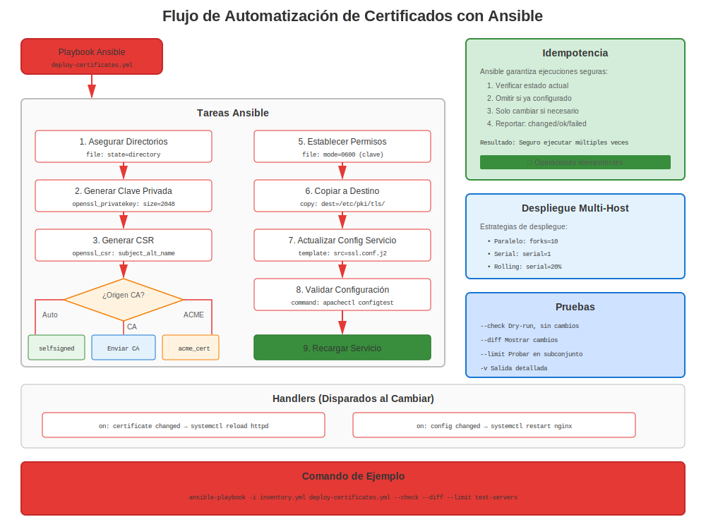

# Capítulo 25: Automatización Ansible para Certificados

> **Escalar:** Gestiona certificados en cientos de sistemas RHEL con Ansible. Automatiza despliegue, renovación y monitoreo a escala empresarial.

---

## 25.1 ¿Por Qué Ansible para Certificados?



**Gestión Manual:**
```
❌ SSH a 100 servidores individualmente
❌ Copiar certificados uno por uno
❌ Configurar servicios manualmente
❌ Rastrear renovaciones por servidor
❌ Esperar no haber perdido ninguno
```

**Automatización Ansible:**
```
✅ Desplegar certificados a 100 servidores en minutos
✅ Configuración consistente
✅ Idempotente (seguro ejecutar repetidamente)
✅ Control de versiones (Git)
✅ Auditable (quién cambió qué cuándo)
✅ Capaz de rollback
```

---

## 25.2 Prerrequisitos

### Instalar Ansible en RHEL

```bash
#============================================#
# INSTALAR ANSIBLE
#============================================#

# RHEL 8/9/10
sudo dnf install ansible-core -y

# O desde repositorio Ansible para lo último
sudo dnf install epel-release  # Si usas EPEL
sudo dnf install ansible -y

# Verificar
ansible --version

# Instalar colección community.crypto (¡ESENCIAL!)
ansible-galaxy collection install community.crypto
```

---

## 25.3 Inventario Ansible para Gestión de Certificados

### Ejemplo de Inventario

```ini
#============================================#
# inventory/hosts.ini
#============================================#

[webservers]
web01.example.com
web02.example.com
web03.example.com

[mailservers]
mail01.example.com

[databases]
db01.example.com
db02.example.com

[all:vars]
ansible_user=ansible
ansible_become=yes
ansible_python_interpreter=/usr/bin/python3
```

---

## 25.4 Generar Certificados con Ansible

### Playbook: Generar Claves Privadas

```yaml
#============================================#
# playbooks/generate-keys.yml
#============================================#

---
- name: Generar Claves Privadas para Servidores RHEL
  hosts: webservers
  become: yes

  tasks:
    - name: Instalar OpenSSL
      dnf:
        name: openssl
        state: present

    - name: Generar clave privada
      community.crypto.openssl_privatekey:
        path: "/etc/pki/tls/private/{{ inventory_hostname }}.key"
        size: 2048
        type: RSA
        mode: '0600'
        owner: root
        group: root

    - name: Verificar clave generada
      stat:
        path: "/etc/pki/tls/private/{{ inventory_hostname }}.key"
      register: key_file

    - name: Mostrar resultado
      debug:
        msg: "Clave generada: {{ key_file.stat.exists }}"
```

### Playbook: Generar CSRs

```yaml
#============================================#
# playbooks/generate-csrs.yml
#============================================#

---
- name: Generar Solicitudes de Firma de Certificado
  hosts: webservers
  become: yes

  tasks:
    - name: Generar CSR
      community.crypto.openssl_csr:
        path: "/tmp/{{ inventory_hostname }}.csr"
        privatekey_path: "/etc/pki/tls/private/{{ inventory_hostname }}.key"
        common_name: "{{ inventory_hostname }}"
        subject_alt_name:
          - "DNS:{{ inventory_hostname }}"
          - "DNS:{{ inventory_hostname_short }}"
        key_usage:
          - digitalSignature
          - keyEncipherment
        extended_key_usage:
          - serverAuth
        organization_name: "Example Company"
        country_name: "US"

    - name: Obtener CSR a nodo de control
      fetch:
        src: "/tmp/{{ inventory_hostname }}.csr"
        dest: "csrs/{{ inventory_hostname }}.csr"
        flat: yes
```

---

## 25.5 Desplegar Certificados con Ansible

### Playbook: Desplegar Certificados a Apache

```yaml
#============================================#
# playbooks/deploy-apache-certs.yml
#============================================#

---
- name: Desplegar Certificados a Servidores Apache
  hosts: webservers
  become: yes

  vars:
    cert_source_dir: "/path/to/certificates"

  tasks:
    - name: Instalar Apache y mod_ssl
      dnf:
        name:
          - httpd
          - mod_ssl
        state: present

    - name: Desplegar certificado
      copy:
        src: "{{ cert_source_dir }}/{{ inventory_hostname }}.crt"
        dest: "/etc/pki/tls/certs/{{ inventory_hostname }}.crt"
        mode: '0644'
        owner: root
        group: root
      notify: reload apache

    - name: Desplegar clave privada
      copy:
        src: "{{ cert_source_dir }}/{{ inventory_hostname }}.key"
        dest: "/etc/pki/tls/private/{{ inventory_hostname }}.key"
        mode: '0600'
        owner: root
        group: root
        no_log: yes  # No registrar clave privada
      notify: reload apache

    - name: Configurar Apache SSL
      template:
        src: templates/ssl.conf.j2
        dest: /etc/httpd/conf.d/ssl.conf
        mode: '0644'
      notify: reload apache

    - name: Asegurar que Apache está ejecutándose
      service:
        name: httpd
        state: started
        enabled: yes

  handlers:
    - name: reload apache
      service:
        name: httpd
        state: reloaded
```

---

## 25.6 Validación de Certificados con Ansible

### Playbook: Validar Certificados

```yaml
#============================================#
# playbooks/validate-certificates.yml
#============================================#

---
- name: Validar Certificados en Servidores RHEL
  hosts: all
  become: yes

  tasks:
    - name: Encontrar todos los certificados
      find:
        paths: /etc/pki/tls/certs/
        patterns: '*.crt'
      register: certificates

    - name: Verificar expiración de certificado
      community.crypto.x509_certificate_info:
        path: "{{ item.path }}"
      register: cert_info
      loop: "{{ certificates.files }}"
      loop_control:
        label: "{{ item.path }}"

    - name: Identificar certificados expirando (30 días)
      set_fact:
        expiring_certs: "{{ expiring_certs | default([]) + [item.item.path] }}"
      when:
        - (item.not_after | to_datetime('%Y%m%d%H%M%SZ')) - (ansible_date_time.iso8601 | to_datetime) < '30 days'
      loop: "{{ cert_info.results }}"
      loop_control:
        label: "{{ item.item.path }}"

    - name: Reportar certificados expirando
      debug:
        msg: "⚠️ Certificado expirando pronto: {{ item }}"
      loop: "{{ expiring_certs | default([]) }}"
      when: expiring_certs is defined
```

---

## 25.7 Gestión de certmonger con Ansible

### Playbook: Configurar Rastreo certmonger

```yaml
#============================================#
# playbooks/setup-certmonger.yml
#============================================#

---
- name: Configurar Rastreo certmonger
  hosts: webservers
  become: yes

  tasks:
    - name: Instalar certmonger
      dnf:
        name: certmonger
        state: present

    - name: Asegurar que certmonger está ejecutándose
      service:
        name: certmonger
        state: started
        enabled: yes

    - name: Solicitar certificado de FreeIPA
      command: >
        ipa-getcert request
        -f /etc/pki/tls/certs/{{ inventory_hostname }}.crt
        -k /etc/pki/tls/private/{{ inventory_hostname }}.key
        -K HTTP/{{ inventory_hostname }}@EXAMPLE.COM
        -D {{ inventory_hostname }}
        -C "systemctl reload httpd"
      args:
        creates: /etc/pki/tls/certs/{{ inventory_hostname }}.crt

    - name: Verificar estado de certmonger
      command: getcert list
      register: cert_status
      changed_when: false

    - name: Mostrar estado
      debug:
        var: cert_status.stdout_lines
```

---

## 25.8 Monitoreo de Certificados con Ansible

### Playbook: Reporte de Expiración de Certificados

```yaml
#============================================#
# playbooks/cert-expiration-report.yml
#============================================#

---
- name: Generar Reporte de Expiración de Certificados
  hosts: all
  become: yes
  gather_facts: yes

  tasks:
    - name: Obtener expiración de certificado para Apache
      shell: |
        if [ -f /etc/pki/tls/certs/{{ inventory_hostname }}.crt ]; then
          openssl x509 -in /etc/pki/tls/certs/{{ inventory_hostname }}.crt -noout -enddate | cut -d= -f2
        else
          echo "No se encontró certificado"
        fi
      register: cert_expiry
      changed_when: false

    - name: Calcular días hasta expiración
      set_fact:
        days_left: "{{ ((cert_expiry.stdout | to_datetime('%b %d %H:%M:%S %Y %Z')) - (ansible_date_time.iso8601 | to_datetime)).days }}"
      when: cert_expiry.stdout != "No se encontró certificado"

    - name: Agregar a reporte
      set_fact:
        cert_report: |
          {{ inventory_hostname }},{{ cert_expiry.stdout }},{{ days_left | default('N/A') }}
      delegate_to: localhost
      delegate_facts: yes

    - name: Guardar reporte
      copy:
        content: "{{ hostvars | dict2items | map(attribute='value.cert_report') | join('\n') }}"
        dest: "/tmp/cert-expiration-report.csv"
      delegate_to: localhost
      run_once: yes
```

---

## 25.9 Flujo de Trabajo Completo de Despliegue de Certificados

### Automatización de Extremo a Extremo

```yaml
#============================================#
# playbooks/full-cert-deployment.yml
#============================================#

---
- name: Despliegue Completo de Certificados
  hosts: webservers
  become: yes

  vars:
    cert_domain: "example.com"
    cert_base_path: "/etc/pki/tls"

  pre_tasks:
    - name: Recopilar hechos
      setup:

  tasks:
    # 1. Asegurar que existan directorios
    - name: Asegurar que existan directorios de certificados
      file:
        path: "{{ item }}"
        state: directory
        mode: '0755'
      loop:
        - "{{ cert_base_path }}/certs"
        - "{{ cert_base_path }}/private"

    # 2. Generar clave privada (si no existe)
    - name: Generar clave privada
      community.crypto.openssl_privatekey:
        path: "{{ cert_base_path }}/private/{{ inventory_hostname }}.key"
        size: 2048
        mode: '0600'

    # 3. Desplegar certificado (desde controlador)
    - name: Desplegar certificado
      copy:
        src: "files/certs/{{ inventory_hostname }}.crt"
        dest: "{{ cert_base_path }}/certs/{{ inventory_hostname }}.crt"
        mode: '0644'
      notify: reload httpd

    # 4. Desplegar paquete CA
    - name: Desplegar paquete CA
      copy:
        src: "files/ca-bundle.crt"
        dest: "{{ cert_base_path }}/certs/ca-bundle.crt"
        mode: '0644'

    # 5. Configurar Apache
    - name: Desplegar configuración SSL de Apache
      template:
        src: templates/apache-ssl.conf.j2
        dest: /etc/httpd/conf.d/ssl.conf
        mode: '0644'
      notify: reload httpd

    # 6. Validar configuración
    - name: Probar configuración de Apache
      command: apachectl configtest
      changed_when: false

    # 7. Asegurar firewall abierto
    - name: Abrir HTTPS en firewall
      firewalld:
        service: https
        permanent: yes
        state: enabled
        immediate: yes

    # 8. Asegurar que Apache está ejecutándose
    - name: Asegurar que Apache está ejecutándose
      service:
        name: httpd
        state: started
        enabled: yes

  handlers:
    - name: reload httpd
      service:
        name: httpd
        state: reloaded
```

---

## 25.10 Roles Ansible para Certificados

### Crear Rol Reutilizable

```bash
#============================================#
# CREAR ROL ANSIBLE PARA CERTIFICADOS
#============================================#

# Crear estructura de rol
ansible-galaxy role init certificates

# Estructura de directorio:
certificates/
├── defaults/
│   └── main.yml          # Variables predeterminadas
├── files/
│   └── ca-bundle.crt     # Certificados CA
├── handlers/
│   └── main.yml          # Handlers de recarga de servicio
├── tasks/
│   └── main.yml          # Tareas principales
├── templates/
│   └── ssl.conf.j2       # Plantillas de configuración
└── vars/
    └── main.yml          # Variables
```

### Ejemplo de Tareas de Rol

```yaml
#============================================#
# roles/certificates/tasks/main.yml
#============================================#

---
- name: Instalar herramientas de gestión de certificados
  dnf:
    name:
      - openssl
      - certmonger
    state: present

- name: Asegurar directorios de certificados
  file:
    path: "{{ item }}"
    state: directory
    mode: '0755'
  loop:
    - /etc/pki/tls/certs
    - /etc/pki/tls/private

- name: Desplegar certificados
  include_tasks: deploy-cert.yml
  loop: "{{ certificates }}"
  loop_control:
    loop_var: cert

- name: Configurar rastreo certmonger
  include_tasks: setup-certmonger.yml
  when: use_certmonger | default(false)
```

### Usar el Rol

```yaml
#============================================#
# playbook.yml
#============================================#

---
- name: Desplegar Certificados
  hosts: webservers
  become: yes

  roles:
    - role: certificates
      vars:
        certificates:
          - name: "{{ inventory_hostname }}"
            service: httpd
            principal: "HTTP/{{ inventory_hostname }}@REALM"
```

---

## 25.11 Mejores Prácticas

### Mejores Prácticas de Gestión de Certificados Ansible

```markdown
✅ **Usar colección community.crypto** para tareas de certificados
✅ **Cifrar claves privadas con vault** (ansible-vault)
✅ **Usar no_log para datos sensibles** (claves, contraseñas)
✅ **Probar en staging primero** antes de producción
✅ **Usar handlers** para recargas de servicio (evitar reinicios innecesarios)
✅ **Hacer playbooks idempotentes** (seguros para ejecutar múltiples veces)
✅ **Control de versiones** playbooks en Git
✅ **Documentar variables** y requisitos
✅ **Etiquetar tareas** para ejecución selectiva
✅ **Usar roles** para reutilización
```

### Consideraciones de Seguridad

```yaml
# Cifrar claves privadas con ansible-vault
ansible-vault encrypt files/private-keys/*.key

# Usar no_log para tareas sensibles
- name: Desplegar clave privada
  copy:
    src: "{{ key_file }}"
    dest: "/etc/pki/tls/private/server.key"
  no_log: yes

# Usar vault para contraseñas
# group_vars/all/vault.yml (cifrado)
admin_password: !vault |
          $ANSIBLE_VAULT;1.1;AES256
          ...
```

---

## 25.12 Ejemplos Completos

### Ejemplo 1: Desplegar CA a Todos los Servidores

```yaml
---
- name: Desplegar CA Corporativa a Todos los Servidores RHEL
  hosts: all
  become: yes

  tasks:
    - name: Copiar certificado CA
      copy:
        src: files/corporate-ca.crt
        dest: /etc/pki/ca-trust/source/anchors/corporate-ca.crt
        mode: '0644'

    - name: Actualizar confianza CA
      command: update-ca-trust extract
      changed_when: true

    - name: Verificar CA instalada
      command: trust list
      register: trust_list
      changed_when: false

    - name: Confirmar CA presente
      assert:
        that:
          - "'Corporate CA' in trust_list.stdout"
        fail_msg: "¡CA Corporativa no está en almacén de confianza!"
```

### Ejemplo 2: Verificación Masiva de Renovación de Certificados

```yaml
---
- name: Verificar Expiración de Certificados en Toda la Flota
  hosts: all
  become: yes

  tasks:
    - name: Verificar estado de certmonger
      command: getcert list
      register: certmonger_status
      changed_when: false
      failed_when: false

    - name: Verificar CA_UNREACHABLE
      set_fact:
        has_issue: true
      when: "'CA_UNREACHABLE' in certmonger_status.stdout"

    - name: Reportar problemas
      debug:
        msg: "⚠️ ¡{{ inventory_hostname }} tiene certificados CA_UNREACHABLE!"
      when: has_issue | default(false)

    - name: Crear reporte de problemas
      lineinfile:
        path: "/tmp/cert-problems.txt"
        line: "{{ inventory_hostname }}: CA_UNREACHABLE"
        create: yes
      delegate_to: localhost
      when: has_issue | default(false)
```

---

## 25.13 Conclusiones Clave

1. **Ansible habilita despliegue masivo de certificados**
2. **Colección community.crypto esencial** para tareas de certificados
3. **Usar ansible-vault** para claves privadas
4. **Playbooks idempotentes** son críticos
5. **Probar en staging** antes de producción
6. **Combinar con certmonger** para mejores resultados
7. **Versionar** todo en Git

---

## Tarjeta de Referencia Rápida

```
┌─────────────────────────────────────────────────────────────────────┐
│ REFERENCIA RÁPIDA AUTOMATIZACIÓN CERTIFICADOS ANSIBLE               │
├─────────────────────────────────────────────────────────────────────┤
│ Instalar:        dnf install ansible-core                           │
│ Colección:       ansible-galaxy collection install community.crypto │
│                                                                     │
│ Generar clave:   community.crypto.openssl_privatekey                │
│ Generar CSR:     community.crypto.openssl_csr                       │
│ Info cert:       community.crypto.x509_certificate_info             │
│                                                                     │
│ Desplegar cert:  copy module (con mode: '0644')                     │
│ Desplegar key:   copy module (con mode: '0600', no_log: yes)        │
│                                                                     │
│ Vault:           ansible-vault encrypt <file>                       │
│                  ansible-vault decrypt <file>                       │
│                                                                     │
│ Ejecutar:        ansible-playbook playbook.yml                      │
│ Simulación:      ansible-playbook playbook.yml --check              │
│ Específico:      ansible-playbook playbook.yml --tags certs         │
└─────────────────────────────────────────────────────────────────────┘

✅ Usar colección community.crypto
✅ Cifrar claves privadas con ansible-vault
✅ Usar no_log para datos sensibles
```

---

## 🧪 Laboratorio Práctico

**Lab 14: Automatización con Ansible**

Automatiza la implementación de certificados con Ansible

- 📁 **Ubicación:** `labs/es_ES/14-ansible-automation/`
- ⏱️ **Tiempo:** 40-50 minutos
- 🎯 **Nivel:** Avanzado

---

**Navegación del Capítulo**

| [← Anterior: Capítulo 24 - Let's Encrypt y certbot](24-letsencrypt-certbot.md) | [Siguiente: Capítulo 26 - Monitoreo y Alertas en RHEL →](26-monitoring-alerting.md) |
|:---|---:|
