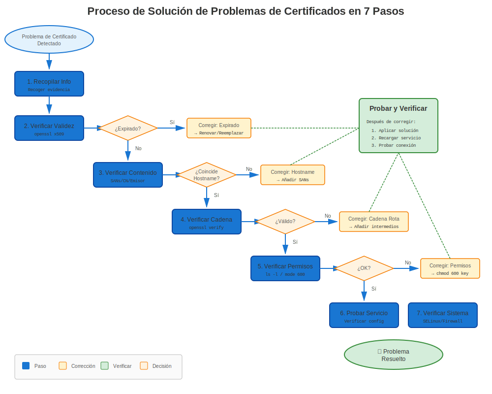
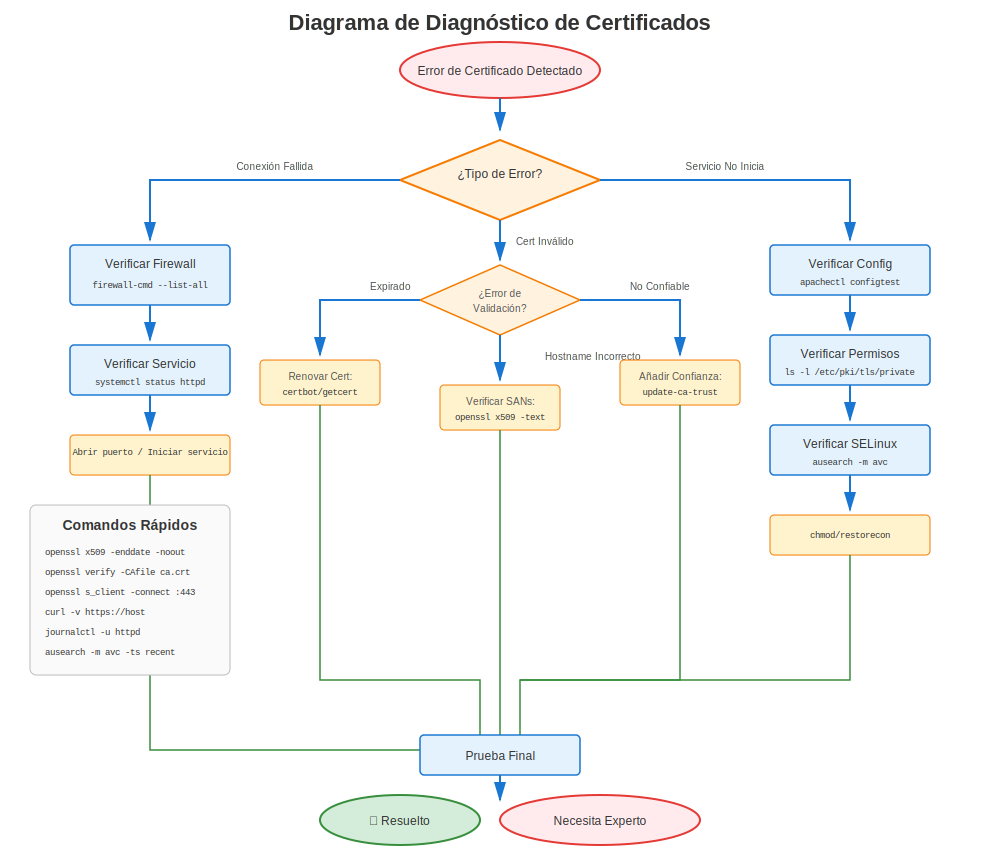

# Capítulo 27: Metodología de Solución de Problemas de Certificados RHEL

> **Habilidad Crítica:** Este capítulo te enseña un enfoque sistemático para resolver CUALQUIER problema de certificado en sistemas RHEL. Domina esta metodología y resolverás problemas en minutos en lugar de horas.

---

## 27.1 El Problema





Los problemas de certificados son frustrantes:
- Los mensajes de error son crípticos
- Las causas raíz están ocultas
- Múltiples capas involucradas (OpenSSL, config de servicio, SELinux, crypto-policies)
- Varía según versión de RHEL

**La solución de problemas aleatoria no funciona.** Necesitas un sistema.

---

## 27.2 El Enfoque Sistemático

Sigue esta metodología de 7 pasos para CADA problema de certificado:

```
Paso 1: Identificar Versión de RHEL y Entorno
Paso 2: Verificar Propiedades Básicas del Certificado
Paso 3: Verificar Cadena de Confianza y Validación CA
Paso 4: Verificar Configuración del Servicio
Paso 5: Verificar Ajustes a Nivel del Sistema
Paso 6: Probar Funcionalidad del Certificado
Paso 7: Revisar Logs y Detalles de Errores
```

**Regla:** Nunca saltar pasos. Cada uno proporciona información de diagnóstico crítica.

---

## 27.3 Paso 1: Identificar Versión de RHEL y Entorno

### Por Qué Importa
El comportamiento de certificados difiere significativamente entre versiones de RHEL.

### Verificaciones Rápidas

```bash
#============================================#
# VERIFICACIÓN DE VERSIÓN RHEL
#============================================#

# 1. Verificar versión de RHEL
cat /etc/redhat-release
# Salida ejemplo: Red Hat Enterprise Linux release 9.8 (Plow)

# 2. Verificar versión de OpenSSL
openssl version
# RHEL 7: OpenSSL 1.0.2k
# RHEL 8: OpenSSL 1.1.1k
# RHEL 9/10: OpenSSL 3.5.5

# 3. Verificar crypto-policy (RHEL 8+)
update-crypto-policies --show 2>/dev/null
# DEFAULT, LEGACY, FUTURE, o FIPS

# 4. Verificar modo FIPS
fips-mode-setup --check 2>/dev/null
# FIPS mode is enabled/disabled

# 5. Verificar estado de SELinux
getenforce
# Enforcing, Permissive, o Disabled
```

### Qué Documentar

Crear una nota de solución de problemas con:
```
Versión RHEL: _______
Versión OpenSSL: _______
Crypto-Policy: _______ (si RHEL 8+)
Modo FIPS: _______
SELinux: _______
Servicio: _______ (Apache, NGINX, Postfix, etc.)
```

---

## 27.4 Paso 2: Verificar Propiedades Básicas del Certificado

### Las Cinco Verificaciones Esenciales

```bash
#============================================#
# VERIFICACIÓN 1: Expiración del Certificado
#============================================#

# Ver fechas del certificado
openssl x509 -in /path/to/cert.crt -noout -dates

# Salida:
# notBefore=Jan 1 00:00:00 2024 GMT
# notAfter=Jan 1 23:59:59 2025 GMT   ← ¡Debe estar en el futuro!

# Verificación rápida si expiró
openssl x509 -in /path/to/cert.crt -noout -checkend 0
# Exit 0 = válido, Exit 1 = expirado

# Verificar expiración en X días
openssl x509 -in /path/to/cert.crt -noout -checkend $((86400*30))
# Verificar si expira en los próximos 30 días


#============================================#
# VERIFICACIÓN 2: Sujeto/Hostname del Certificado
#============================================#

# Ver sujeto (para quién es el certificado)
openssl x509 -in /path/to/cert.crt -noout -subject
# subject=CN=server.example.com

# Ver Subject Alternative Names (SANs) - ¡CRÍTICO!
openssl x509 -in /path/to/cert.crt -noout -ext subjectAltName
# X509v3 Subject Alternative Name:
#     DNS:server.example.com, DNS:www.example.com

# ⚠️ Los navegadores modernos REQUIEREN SANs (CN solo es insuficiente)


#============================================#
# VERIFICACIÓN 3: Coincidencia Par Certificado/Clave
#============================================#

# Obtener módulo del certificado
openssl x509 -noout -modulus -in /path/to/cert.crt | openssl md5

# Obtener módulo de la clave
openssl rsa -noout -modulus -in /path/to/cert.key | openssl md5

# ✅ Si los hashes MD5 coinciden → cert y clave están emparejados
# ❌ Si diferentes → ¡CLAVE INCORRECTA!


#============================================#
# VERIFICACIÓN 4: Emisor del Certificado
#============================================#

# Ver quién firmó este certificado
openssl x509 -in /path/to/cert.crt -noout -issuer
# issuer=C=US, O=Let's Encrypt, CN=R3

# ¿Autofirmado? (sujeto == emisor)
openssl x509 -in /path/to/cert.crt -noout -subject -issuer | sort | uniq -d
# Si la salida no está vacía → autofirmado


#============================================#
# VERIFICACIÓN 5: Algoritmo de Certificado y Tamaño de Clave
#============================================#

# Ver algoritmo de firma
openssl x509 -in /path/to/cert.crt -noout -text | grep "Signature Algorithm"
# Signature Algorithm: sha256WithRSAEncryption   ← Bueno
# Signature Algorithm: sha1WithRSAEncryption     ← Malo (obsoleto)

# Ver tamaño de clave pública
openssl x509 -in /path/to/cert.crt -noout -text | grep "Public-Key"
# Public-Key: (2048 bit)   ← Mínimo
# Public-Key: (4096 bit)   ← Mejor

# ⚠️ RHEL 8+ rechaza claves < 2048 bits por defecto
# ⚠️ RHEL 9+ rechaza firmas SHA-1 por defecto
```

### Script de Validación Rápida

```bash
#!/bin/bash
# quick-cert-check.sh
CERT=$1

echo "=== Verificación Rápida de Certificado ==="
echo ""
echo "Archivo: $CERT"
echo ""

echo "1. Expiración:"
openssl x509 -in "$CERT" -noout -dates

echo ""
echo "2. Sujeto:"
openssl x509 -in "$CERT" -noout -subject

echo ""
echo "3. SANs:"
openssl x509 -in "$CERT" -noout -ext subjectAltName 2>/dev/null || echo "No se encontraron SANs"

echo ""
echo "4. Emisor:"
openssl x509 -in "$CERT" -noout -issuer

echo ""
echo "5. Algoritmo y Clave:"
openssl x509 -in "$CERT" -noout -text | grep -E "(Signature Algorithm|Public-Key)"

echo ""
echo "6. ¿Aún válido?"
if openssl x509 -in "$CERT" -noout -checkend 0 >/dev/null 2>&1; then
    echo "✅ El certificado es válido"
else
    echo "❌ ¡El certificado ha expirado!"
fi
```

Uso:
```bash
bash quick-cert-check.sh /etc/pki/tls/certs/server.crt
```

---

## 27.5 Paso 3: Verificar Cadena de Confianza y Validación CA

### Entender la Cadena

```
CA Raíz (debe ser confiable para el sistema)
  └─ CA(s) Intermedia(s)
      └─ Certificado del Servidor (tu certificado)
```

### Verificar Cadena de Confianza

```bash
#============================================#
# VERIFICAR CADENA COMPLETA DE CERTIFICADO
#============================================#

# Método 1: Verificar contra paquete CA del sistema
openssl verify /path/to/cert.crt
# /path/to/cert.crt: OK   ← ¡Bueno!
# error 20: unable to get local issuer certificate   ← ¡Falta CA!

# Método 2: Verificar con archivo CA específico
openssl verify -CAfile /etc/pki/tls/certs/ca-bundle.crt /path/to/cert.crt

# Método 3: Mostrar cadena completa
openssl s_client -connect server.example.com:443 -showcerts


#============================================#
# VERIFICAR SI CA ES CONFIABLE POR RHEL
#============================================#

# Listar todas las CAs confiables
trust list | grep -i "certificate-authority"

# Buscar CA específica
trust list | grep -i "Let's Encrypt"

# Verificar si archivo CA específico es confiable
trust list --filter=ca-anchors | grep -A5 "pkcs11"


#============================================#
# VER CADENA DE CERTIFICADO
#============================================#

# Extraer y ver cadena completa desde servidor
openssl s_client -connect server.example.com:443 -showcerts 2>/dev/null | \
  awk '/BEGIN CERT/,/END CERT/ {print}'

# Ver cadena desde archivo (si está en paquete)
openssl crl2pkcs7 -nocrl -certfile /path/to/chain.crt | \
  openssl pkcs7 -print_certs -text -noout


#============================================#
# VERIFICAR CERTIFICADOS INTERMEDIOS
#============================================#

# Problema común: ¡Falta certificado intermedio!
# Servidor debería enviar: [Cert Servidor] → [Intermedio] → [Raíz]
# Pero solo envía: [Cert Servidor]
# Resultado: ¡El cliente no puede validar cadena!

# Probar desde otra máquina
echo | openssl s_client -connect server.example.com:443 -servername server.example.com 2>&1 | \
  grep -E "(verify return code|Verify return code)"
# Verify return code: 0 (ok)   ← Bueno
# Verify return code: 21 (unable to verify the first certificate)   ← ¡Falta intermedio!
```

### Problemas Comunes de Confianza

| Código Error | Significado | Solución |
|--------------|-------------|----------|
| 0 | OK | ✅ Sin problemas |
| 19 | Certificado autofirmado en cadena | Agregar CA al almacén de confianza |
| 20 | No se puede obtener cert emisor local | Falta CA o intermedio |
| 21 | No se puede verificar primer certificado | Falta cert intermedio |
| 27 | Certificado no confiable | CA no en almacén de confianza del sistema |

---

## 27.6 Paso 4: Verificar Configuración del Servicio

### Verificaciones Específicas por Servicio

```bash
#============================================#
# APACHE (httpd)
#============================================#

# Verificar configuración SSL
sudo apachectl -t -D DUMP_VHOSTS | grep -A5 ":443"

# Ver rutas de cert SSL
sudo grep -r "SSLCertificateFile\|SSLCertificateKeyFile" /etc/httpd/

# Probar sintaxis de configuración
sudo apachectl configtest

# Verificar módulos SSL cargados
sudo httpd -M | grep ssl


#============================================#
# NGINX
#============================================#

# Probar configuración
sudo nginx -t

# Ver rutas SSL
sudo grep -r "ssl_certificate\|ssl_certificate_key" /etc/nginx/

# Verificar archivos de certificado referenciados
sudo nginx -T | grep "ssl_certificate"


#============================================#
# POSTFIX (Correo)
#============================================#

# Ver ajustes TLS
sudo postconf | grep -i tls

# Verificar rutas cert/clave
sudo postconf smtpd_tls_cert_file smtpd_tls_key_file

# Probar TLS
openssl s_client -connect localhost:25 -starttls smtp


#============================================#
# OPENLDAP
#============================================#

# Verificar ajustes TLS
sudo grep -i "TLSCert\|TLSKey" /etc/openldap/slapd.conf /etc/openldap/slapd.d/* 2>/dev/null

# Probar LDAPS
openssl s_client -connect localhost:636


#============================================#
# POSTGRESQL
#============================================#

# Verificar ajustes SSL
sudo -u postgres psql -c "SHOW ssl_cert_file; SHOW ssl_key_file;"

# Probar conexión SSL
psql "host=localhost sslmode=require"
```

### Verificación de Permisos de Archivo

```bash
#============================================#
# VERIFICAR PERMISOS (¡CRÍTICO!)
#============================================#

# Archivos de certificado (públicos) deberían ser legibles
ls -l /etc/pki/tls/certs/*.crt
# -rw-r--r-- (644)   ← Bueno

# Archivos de clave (privados) deberían estar protegidos
ls -l /etc/pki/tls/private/*.key
# -rw------- (600) o -rw-r----- (640)   ← Bueno
# -rw-r--r-- (644)   ← ¡MALO! ¡Muy permisivo!

# Verificar ownership
ls -l /etc/pki/tls/private/*.key
# Debería ser propiedad del usuario del servicio o root

# Corregir permisos si es necesario
sudo chmod 600 /etc/pki/tls/private/server.key
sudo chown root:root /etc/pki/tls/private/server.key
```

---

## 27.7 Paso 5: Verificar Ajustes a Nivel del Sistema

### Específico por Versión de RHEL

```bash
#============================================#
# RHEL 8/9/10: VERIFICAR CRYPTO-POLICIES
#============================================#

# Política actual
update-crypto-policies --show
# DEFAULT, LEGACY, FUTURE, o FIPS

# Si el servicio falla con "no shared cipher" o similar:
# Probar temporalmente con política LEGACY
sudo update-crypto-policies --set LEGACY
sudo systemctl restart <servicio>

# Probar si funciona ahora
# Si SÍ → incompatibilidad de cifrado/versión TLS
# Si NO → problema diferente

# Revertir a DEFAULT
sudo update-crypto-policies --set DEFAULT


#============================================#
# VERIFICAR MODO FIPS (Todas las Versiones)
#============================================#

fips-mode-setup --check
# FIPS mode is enabled.

# En modo FIPS, se aplican restricciones adicionales:
# - Solo algoritmos aprobados
# - Requisitos de clave más estrictos
# - Algunos cifrados deshabilitados


#============================================#
# VERIFICAR SELINUX (¡Crítico!)
#============================================#

# Estado de SELinux
getenforce
# Enforcing, Permissive, o Disabled

# Verificar denegaciones relacionadas con certificados
sudo ausearch -m avc -ts recent | grep -i cert

# Verificar contexto SELinux de archivos cert
ls -Z /etc/pki/tls/certs/server.crt
# system_u:object_r:cert_t:s0   ← Correcto

# Si está mal, reetiquetar
sudo restorecon -v /etc/pki/tls/certs/server.crt
sudo restorecon -v /etc/pki/tls/private/server.key


#============================================#
# VERIFICAR FIREWALL
#============================================#

# Verificar que el puerto del servicio está abierto
sudo firewall-cmd --list-all | grep -E "(https|443|ldaps|636)"

# Si no está abierto
sudo firewall-cmd --add-service=https --permanent
sudo firewall-cmd --reload
```

---

## 27.8 Paso 6: Probar Funcionalidad del Certificado

### Pruebas de Conexión en Vivo

```bash
#============================================#
# PROBAR CONEXIÓN HTTPS/TLS
#============================================#

# Método 1: openssl s_client (más detallado)
openssl s_client -connect server.example.com:443 -servername server.example.com

# Buscar:
# - "Verify return code: 0 (ok)"   ← Bueno
# - Visualización de cadena de certificado
# - Cifrado negociado
# - Versión de protocolo (TLS 1.2/1.3)

# Método 2: curl (prueba rápida)
curl -v https://server.example.com/
# Buscar:
# * SSL connection using TLSv1.3
# * Server certificate:
# *  subject: CN=server.example.com
# *  issuer: CN=Let's Encrypt Authority

# Método 3: Probar con versión TLS específica
openssl s_client -connect server.example.com:443 -tls1_2
openssl s_client -connect server.example.com:443 -tls1_3


#============================================#
# PROBAR DESDE PERSPECTIVA DE CLIENTE
#============================================#

# Probar resolución DNS
nslookup server.example.com
# Debe resolver a IP correcta

# Probar conectividad de red
telnet server.example.com 443
nc -zv server.example.com 443

# Probar con diferentes clientes
curl --insecure https://server.example.com/   # Saltar verificación cert
wget --no-check-certificate https://server.example.com/
```

### Pruebas de Validación de Certificado

```bash
#============================================#
# VALIDAR ASPECTOS ESPECÍFICOS
#============================================#

# Probar coincidencia de hostname
openssl s_client -connect server.example.com:443 -servername server.example.com 2>&1 | \
  grep "verify return"

# Probar con hostname incorrecto (debería fallar)
openssl s_client -connect server.example.com:443 -servername wrong.example.com 2>&1 | \
  grep "verify return"

# Probar expiración
openssl s_client -connect server.example.com:443 2>&1 | openssl x509 -noout -dates

# Probar fortaleza de cifrado
openssl s_client -connect server.example.com:443 -cipher 'HIGH:!aNULL:!MD5'
```

---

## 27.9 Paso 7: Revisar Logs y Detalles de Errores

### Dónde Buscar

```bash
#============================================#
# LOGS DE SERVICIO
#============================================#

# Apache
sudo tail -f /var/log/httpd/error_log
sudo tail -f /var/log/httpd/ssl_error_log

# NGINX
sudo tail -f /var/log/nginx/error.log

# Postfix
sudo tail -f /var/log/maillog

# Journal del sistema (todos los servicios)
sudo journalctl -u httpd.service -f
sudo journalctl -u nginx.service -f
sudo journalctl -xe | grep -i cert


#============================================#
# LOGS DE CERTMONGER (Renovación Auto)
#============================================#

# Estado de certmonger
sudo getcert list

# Logs de certmonger
sudo journalctl -u certmonger.service -f

# Estado detallado para cert específico
sudo getcert list -i <request-id>


#============================================#
# DENEGACIONES SELINUX
#============================================#

# Denegaciones AVC recientes
sudo ausearch -m avc -ts recent

# Denegaciones relacionadas con certificados
sudo ausearch -m avc -ts today | grep -i cert


#============================================#
# ERRORES OPENSSL/TLS
#============================================#

# Comunes en logs:
# - "SSL_CTX_use_certificate:ca md too weak" → Algoritmo de firma débil
# - "unable to get local issuer certificate" → Falta CA
# - "certificate has expired" → Cert expirado
# - "certificate verify failed" → Fallo validación de cadena
# - "no shared cipher" → Desajuste de cifrado
# - "wrong version number" → Desajuste de protocolo
```

---

## 27.10 Árboles de Decisión

### Diagrama de Flujo de Diagnóstico Rápido

```
Problema de Certificado
    │
    ├─ ¿El servicio no inicia?
    │   ├─ Verificar rutas de archivo en config
    │   ├─ Verificar permisos de archivo (600 para claves)
    │   ├─ Verificar coincidencia par cert/clave
    │   └─ Verificar contexto SELinux
    │
    ├─ ¿La conexión falla con "certificate verify failed"?
    │   ├─ Verificar confianza CA (Paso 3)
    │   ├─ Verificar certificados intermedios
    │   └─ Verificar crypto-policy (RHEL 8+)
    │
    ├─ ¿"Certificate has expired"?
    │   ├─ Verificar con: openssl x509 -noout -dates
    │   ├─ Verificar estado de certmonger
    │   └─ Renovar certificado
    │
    ├─ ¿"Hostname does not match"?
    │   ├─ Verificar SANs: openssl x509 -noout -ext subjectAltName
    │   ├─ Verificar resolución DNS
    │   └─ Verificar directiva server_name/ServerName
    │
    └─ ¿"No shared cipher" / "wrong version number"?
        ├─ Verificar crypto-policy (RHEL 8+)
        ├─ Verificar compatibilidad versión TLS
        └─ Probar con: openssl s_client -tls1_2
```

---

## 27.11 Kit de Herramientas de Solución de Problemas

### Comandos Esenciales

```bash
# Tarjeta de referencia rápida para solución de problemas

# 1. IDENTIFICAR
cat /etc/redhat-release
openssl version
update-crypto-policies --show

# 2. VERIFICAR CERTIFICADO
openssl x509 -in cert.crt -noout -text
openssl x509 -in cert.crt -noout -dates
openssl x509 -in cert.crt -noout -subject

# 3. VERIFICAR CONFIANZA
openssl verify cert.crt
trust list | grep -i "authority"

# 4. PROBAR CONEXIÓN
openssl s_client -connect host:443 -servername host
curl -v https://host/

# 5. VERIFICAR PERMISOS
ls -lZ /etc/pki/tls/certs/cert.crt
ls -lZ /etc/pki/tls/private/key.key

# 6. VERIFICAR LOGS
sudo journalctl -xe | grep -i cert
sudo tail -f /var/log/httpd/ssl_error_log
```

### Crear Tu Lista de Verificación de Solución de Problemas

```markdown
## Lista de Verificación de Problemas de Certificado

### Entorno
- [ ] Versión RHEL: _______
- [ ] Versión OpenSSL: _______
- [ ] Crypto-Policy (RHEL 8+): _______
- [ ] Modo FIPS: _______
- [ ] SELinux: _______
- [ ] Servicio: _______

### Verificaciones de Certificado
- [ ] Fecha de expiración del certificado
- [ ] Sujeto/hostname coincide
- [ ] SANs presentes y correctos
- [ ] Par certificado/clave coincide
- [ ] Algoritmo de firma (SHA-256 o superior; sin SHA-1 ni MD5)
- [ ] Tamaño de clave (>= 2048 bits)

### Cadena de Confianza
- [ ] Certificado valida con paquete CA del sistema
- [ ] Certificados intermedios presentes
- [ ] CA raíz confiable para el sistema

### Configuración de Servicio
- [ ] Rutas de archivo correctas en config
- [ ] Permisos de archivo correctos (600 para claves)
- [ ] Contextos SELinux correctos
- [ ] Sintaxis de config de servicio válida

### Ajustes del Sistema
- [ ] Crypto-policy compatible (RHEL 8+)
- [ ] Requisitos FIPS cumplidos (si aplica)
- [ ] Firewall permite conexiones
- [ ] Sin denegaciones SELinux

### Pruebas
- [ ] Prueba de conexión con openssl s_client
- [ ] Prueba de conexión con curl
- [ ] Verificación de hostname pasa

### Logs
- [ ] Logs de servicio revisados
- [ ] Journal del sistema verificado
- [ ] Log de auditoría SELinux verificado
```

---

## 27.12 Conclusiones Clave

1. **Siempre seguir la metodología de 7 pasos** - no saltar pasos
2. **Verificar versión RHEL primero** - el comportamiento varía significativamente
3. **Verificar propiedades básicas del certificado** antes de solución de problemas compleja
4. **Problemas de cadena de confianza** son el problema más común
5. **Permisos de archivo** causan muchos fallos "misteriosos"
6. **Crypto-policies** (RHEL 8+) afectan todo
7. **SELinux** puede bloquear acceso a certificados
8. **Los logs cuentan la historia** - siempre verificarlos

---

## 27.13 Escenarios de Práctica

Ver próximos capítulos para solución de problemas detallada de:
- **Capítulo 28:** Errores Comunes de Certificados en RHEL
- **Capítulo 29:** Solución de Problemas Específica por Servicio
- **Capítulo 30:** Solución de Problemas de certmonger
- **Capítulo 31:** Solución de Problemas de Crypto-Policy
- **Capítulo 32:** Análisis de Informes SOS
- **Capítulo 33:** Procedimientos de Emergencia

---

## Referencia Rápida

```
┌───────────────────────────────────────────────────────────────────┐
│ MÉTODO DE SOLUCIÓN DE PROBLEMAS DE 7 PASOS                        │
├───────────────────────────────────────────────────────────────────┤
│ 1. Identificar: Versión RHEL, OpenSSL, crypto-policy              │
│ 2. Verificar: Expiración, hostname, coincidencia clave, algoritmo │
│ 3. Confianza: Validación CA, cadena, intermedios                  │
│ 4. Config: Archivos servicio, rutas, permisos                     │
│ 5. Sistema: Crypto-policy, FIPS, SELinux, firewall                │
│ 6. Probar: Conexiones en vivo, curl, openssl s_client             │
│ 7. Logs: Logs servicio, journal, auditoría SELinux                │
└───────────────────────────────────────────────────────────────────┘
```

---

## 🧪 Laboratorio Práctico

**Lab 15: Escenarios de Solución de Problemas**

Practicar el diagnóstico y la corrección de un problema de certificado expirado (un escenario implementado)

- 📁 **Ubicación:** `labs/es_ES/15-troubleshooting-scenarios/`
- ⏱️ **Tiempo:** 15-20 minutos
- 🎯 **Nivel:** Avanzado

---

**Navegación del Capítulo**

| [← Anterior: Capítulo 26 - Monitoreo y Alertas en RHEL](../part-04-automation/26-monitoring-alerting.md) | [Siguiente: Capítulo 28 - Errores Comunes de Certificados en RHEL →](28-common-errors.md) |
|:---|---:|
