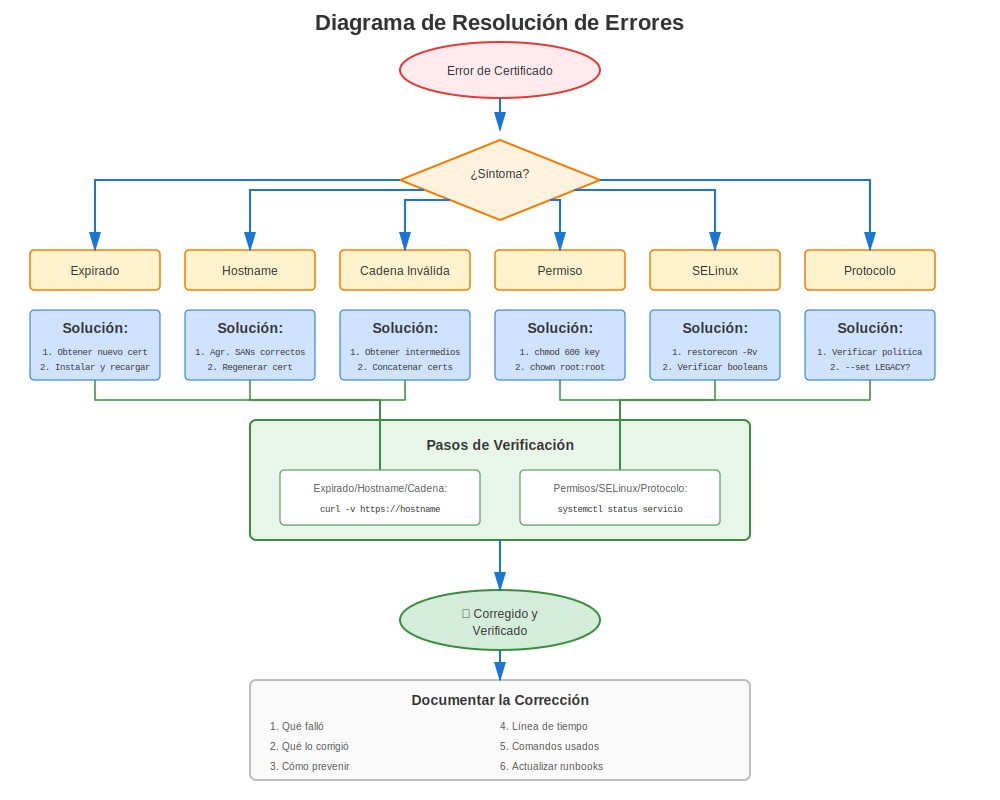

# Capítulo 28: Errores Comunes de Certificados en RHEL

> **Aprende del Dolor de Otros:** Este capítulo cataloga los errores de certificados más comunes en RHEL, organizados por tipo y versión. ¡Cuando encuentres un error, busca aquí primero!

---

## 28.1 Usar Este Capítulo




**Cómo usar esta guía de solución de problemas:**

1. **¿Ves un error?** Busca en este capítulo el mensaje de error
2. **¿El servicio no inicia?** Verifica Sección 28.3 (Errores de Configuración)
3. **¿La conexión falla?** Verifica Sección 28.4 (Errores de Validación)
4. **¿Después de actualización RHEL?** Verifica Sección 28.7 (Específico por Versión)
5. **¿No estás seguro?** Usa la metodología del Capítulo 27

---

## 28.2 Errores Más Comunes (Top 10)

### Tabla de Referencia Rápida

| #  | Error | Causa Común | Solución Rápida |
|----|-------|-------------|-----------------|
| 1 | Certificado expirado | Olvidó renovar | Renovar certificado |
| 2 | unable to get local issuer | Falta CA en almacén confianza | Agregar CA a `/etc/pki/ca-trust/source/anchors/` |
| 3 | certificate verify failed | Cadena incompleta | Instalar certs intermedios |
| 4 | Permission denied | Permisos de archivo incorrectos | `chmod 600` en archivo de clave |
| 5 | hostname does not match | Desajuste CN/SAN | Reemitir con SANs correctos |
| 6 | no shared cipher | Incompatibilidad de cifrado | Verificar crypto-policy (RHEL 8+) |
| 7 | ca md too weak | Firma SHA-1 (RHEL 9+) | Reemitir con SHA-256+ |
| 8 | wrong version number | Desajuste versión TLS | Verificar soporte TLS del cliente |
| 9 | CA_UNREACHABLE | certmonger no puede alcanzar IPA | Verificar conectividad IPA |
| 10 | SELinux denying access | Contexto SELinux incorrecto | `restorecon` en archivos cert |

---

## 28.3 Errores de Configuración

### Error: "SSLCertificateFile: file does not exist or is empty"

**Servicios:** Apache

**Síntoma:**
```
AH00526: Syntax error on line 100 of /etc/httpd/conf.d/ssl.conf:
SSLCertificateFile: file '/etc/pki/tls/certs/server.crt' does not exist or is empty
```

**Diagnóstico:**
```bash
ls -l /etc/pki/tls/certs/server.crt
# ls: cannot access '/etc/pki/tls/certs/server.crt': No such file or directory
```

**Soluciones:**
```bash
# Solución 1: Corregir ruta en configuración
sudo vi /etc/httpd/conf.d/ssl.conf
# Corregir la ruta SSLCertificateFile

# Solución 2: Instalar certificado en ubicación esperada
sudo cp server.crt /etc/pki/tls/certs/

# Solución 3: Restaurar desde respaldo
sudo cp /var/backups/certificates/latest/server.crt /etc/pki/tls/certs/
```

### Error: "Private key does not match this certificate"

**Servicios:** Apache, NGINX, Postfix

**Síntoma:**
```
SSL Library Error: error:0B080074:x509 certificate routines:
X509_check_private_key:key values mismatch
```

**Diagnóstico:**
```bash
# Verificar si cert y clave coinciden
CERT_MOD=$(openssl x509 -noout -modulus -in /etc/pki/tls/certs/server.crt | openssl md5)
KEY_MOD=$(openssl rsa -noout -modulus -in /etc/pki/tls/private/server.key | openssl md5)

echo "Cert: $CERT_MOD"
echo "Key:  $KEY_MOD"
# Si diferentes → ¡desajuste!
```

**Causa:** El certificado fue emitido para una clave privada diferente

**Solución:**
```bash
# Regenerar CSR con la clave CORRECTA
openssl req -new -key /etc/pki/tls/private/server.key -out server.csr \
  -subj "/CN=server.example.com"

# Enviar CSR a CA, obtener nuevo certificado
# Instalar nuevo certificado
```

### Error: "Permission denied" en Clave Privada

**Servicios:** Todos

**Síntoma:**
```
Permission denied: Can't open PEM file '/etc/pki/tls/private/server.key'
```

**Diagnóstico:**
```bash
ls -l /etc/pki/tls/private/server.key
# -rw-r--r--. 1 root root  ← ¡Muy permisivo!

# Verificar si usuario del servicio puede leerlo
sudo -u apache cat /etc/pki/tls/private/server.key >/dev/null
# Permission denied
```

**Solución:**
```bash
# Establecer permisos correctos
sudo chmod 600 /etc/pki/tls/private/server.key
sudo chown apache:apache /etc/pki/tls/private/server.key

# Para servicios que necesitan ownership específico:
# OpenLDAP:
sudo chown ldap:ldap /etc/openldap/certs/ldap.key

# PostgreSQL:
sudo chown postgres:postgres /var/lib/pgsql/data/server.key

# MySQL:
sudo chown mysql:mysql /etc/mysql/certs/server.key
```

---

## 28.4 Errores de Validación

### Error: "certificate verify failed"

**Servicios:** Todos

**Error Completo:**
```
SSL_connect: error:14090086:SSL routines:ssl3_get_server_certificate:certificate verify failed
```

**Causas Comunes:**

**Causa 1: Certificado autofirmado no confiable**
```bash
# Diagnóstico
openssl verify /etc/pki/tls/certs/server.crt
# error 18: self signed certificate

# Solución: Agregar al almacén de confianza
sudo cp server.crt /etc/pki/ca-trust/source/anchors/
sudo update-ca-trust
```

**Causa 2: Falta certificado CA**
```bash
# Diagnóstico
openssl verify /etc/pki/tls/certs/server.crt
# error 20: unable to get local issuer certificate

# Solución: Agregar certificado CA
sudo cp ca.crt /etc/pki/ca-trust/source/anchors/
sudo update-ca-trust
```

**Causa 3: Falta certificado intermedio**
```bash
# Diagnóstico
openssl s_client -connect server.example.com:443 -showcerts
# Verify return code: 21 (unable to verify the first certificate)

# Solución: Incluir intermedio en archivo cert
cat server.crt intermediate.crt > /etc/pki/tls/certs/server-chain.crt
# Actualizar configuración de servicio para usar server-chain.crt
```

### Error: "certificate has expired"

**Servicios:** Todos

**Síntoma:**
```
SSL_connect: error:14090086:SSL routines:ssl3_get_server_certificate:certificate has expired
```

**Diagnóstico:**
```bash
# Verificar expiración
openssl x509 -in /etc/pki/tls/certs/server.crt -noout -dates
# notAfter=Jan 15 23:59:59 2024 GMT  ← ¡En el pasado!
```

**Soluciones:**
```bash
# Solución 1: Si rastreo con certmonger
sudo ipa-getcert resubmit -f /etc/pki/tls/certs/server.crt

# Solución 2: Renovación manual
# Generar nuevo CSR, enviar a CA, instalar nuevo cert

# Solución 3: Emergencia - autofirmado temporal
sudo /usr/local/bin/emergency-self-signed-cert.sh $(hostname -f)
# Ver Capítulo 33 para procedimientos de emergencia
```

### Error: "hostname (or IP address) does not match certificate"

**Servicios:** Todos (especialmente navegadores)

**Error Completo:**
```
SSL: certificate subject name 'server.example.com' does not match target host name 'www.example.com'
```

**Diagnóstico:**
```bash
# Verificar CN y SANs del certificado
openssl x509 -in /etc/pki/tls/certs/server.crt -noout -subject -ext subjectAltName

# Salida:
# subject=CN=server.example.com
# X509v3 Subject Alternative Name:
#     DNS:server.example.com
#
# Problema: Accediendo www.example.com pero cert solo tiene server.example.com
```

**Solución:**
```bash
# Reemitir certificado con SANs correctos
openssl req -new -key server.key -out server.csr \
  -subj "/CN=www.example.com" \
  -addext "subjectAltName=DNS:www.example.com,DNS:server.example.com,DNS:example.com"

# O usar comodín: *.example.com
```

---

## 28.5 Errores de Cadena de Confianza

### Error: "unable to get local issuer certificate"

**Código de Error:** 20

**Síntoma:**
```bash
openssl verify /etc/pki/tls/certs/server.crt
# error 20 at 0 depth lookup: unable to get local issuer certificate
```

**Causa:** La CA que firmó el certificado no está en el almacén de confianza del sistema

**Solución:**
```bash
# Obtener certificado CA (de CA o extraer de cadena)
# Agregar al almacén de confianza
sudo cp issuing-ca.crt /etc/pki/ca-trust/source/anchors/
sudo update-ca-trust

# Verificar
openssl verify /etc/pki/tls/certs/server.crt
# /etc/pki/tls/certs/server.crt: OK
```

### Error: "unable to verify the first certificate"

**Código de Error:** 21

**Síntoma:**
```bash
openssl s_client -connect server.example.com:443
# Verify return code: 21 (unable to verify the first certificate)
```

**Causa:** El servidor envía certificado sin intermedio(s)

**Diagnóstico:**
```bash
# Contar certificados en cadena
openssl s_client -connect server.example.com:443 -showcerts 2>&1 | \
  grep -c "BEGIN CERTIFICATE"
# Si muestra 1: Solo cert servidor (¡falta intermedio!)
# Debería mostrar 2+: Servidor + intermedio(s)
```

**Solución:**
```bash
# Crear paquete de certificado con intermedio
cat server.crt intermediate.crt > /etc/pki/tls/certs/server-bundle.crt

# Actualizar configuración de servicio
# Apache:
SSLCertificateFile /etc/pki/tls/certs/server-bundle.crt

# O usar SSLCertificateChainFile (Apache):
SSLCertificateChainFile /etc/pki/tls/certs/intermediate.crt

# NGINX:
ssl_certificate /etc/pki/tls/certs/server-bundle.crt;

# Recargar servicio
```

---

## 28.6 Errores de Crypto-Policy (RHEL 8/9/10)

### Error: "no shared cipher"

**Servicios:** Todos (RHEL 8/9/10)

**Síntoma:**
```
SSL routines:SSL23_GET_SERVER_HELLO:sslv3 alert handshake failure
```

**Diagnóstico:**
```bash
# Verificar política actual
update-crypto-policies --show
# DEFAULT

# Probar conexión mostrando cifrados
openssl s_client -connect server:443 -cipher 'ALL'

# Verificar qué cifrados están disponibles bajo política actual
openssl ciphers -v | head -20
```

**Causas Comunes y Soluciones:**

**Causa 1: Cliente muy antiguo (necesita TLS 1.0)**
```bash
# Prueba temporal con LEGACY
sudo update-crypto-policies --set LEGACY
sudo systemctl restart httpd

# Si funciona → problema de compatibilidad de cliente
# Solución apropiada: Actualizar cliente o crear módulo de política personalizado
```

**Causa 2: Crypto-policy del servidor muy estricta**
```bash
# Si usas política FUTURE con clientes antiguos
update-crypto-policies --show
# FUTURE

# Temporal: Usar DEFAULT
sudo update-crypto-policies --set DEFAULT
sudo systemctl restart services
```

### Error: "SSL routines:tls_post_process_client_hello:no shared cipher"

**Servicios:** Todos (RHEL 9+)

**Síntoma:** El cliente no puede negociar cifrado con el servidor

**Solución:**
```bash
# RHEL 9: Verificar si cliente usa cifrados muy antiguos
# Puede necesitar política LEGACY temporalmente

# Verificar configuración del servidor para sobrescrituras
grep -r "SSLCipherSuite\|ssl_ciphers" /etc/httpd/ /etc/nginx/

# Si se encuentran cifrados codificados, eliminarlos
# Dejar que crypto-policy lo maneje
```

---

## 28.7 Errores Específicos por Versión RHEL

### Errores Específicos RHEL 7

**Error: "dh key too small"**
```
SSL routines:ssl3_check_cert_and_algorithm:dh key too small
```

**Causa:** Parámetros DH predeterminados muy pequeños para clientes modernos

**Solución:**
```bash
# Generar parámetros DH más fuertes
openssl dhparam -out /etc/pki/tls/dhparams.pem 2048

# Apache: Agregar a ssl.conf
SSLOpenSSLConfCmd DHParameters "/etc/pki/tls/dhparams.pem"

# NGINX: Agregar a config
ssl_dhparam /etc/pki/tls/dhparams.pem;
```

### Errores Específicos RHEL 8/9/10

**Error: "ca md too weak" (RHEL 9+)**
```
error 3 at 0 depth lookup: CA md too weak
```

**Causa:** El certificado tiene firma SHA-1 (bloqueada en RHEL 9+)

**Diagnóstico:**
```bash
openssl x509 -in server.crt -noout -text | grep "Signature Algorithm"
# Signature Algorithm: sha1WithRSAEncryption  ← ¡Problema!
```

**Solución:**
```bash
# Reemitir certificado con SHA-256 o mejor
# No hay solución alternativa - SHA-1 está bloqueado por seguridad

# Solicitar nuevo certificado
openssl req -new -key server.key -out server.csr -sha256 \
  -subj "/CN=server.example.com"
```

**Error: "Provider 'legacy' could not be loaded" (RHEL 9+)**
```
openssl: error while loading shared libraries: Provider 'legacy' could not be loaded
```

**Causa:** Intentando usar algoritmo legacy sin proveedor

**Solución:**
```bash
# Usar proveedor legacy explícitamente
openssl md5 -provider legacy file.txt

# O actualizar para usar algoritmo moderno
openssl sha256 file.txt
```

---

## 28.8 Errores SELinux

### Error: SELinux impide el acceso al certificado

**Síntoma:**
```
audit: type=1400 audit(timestamp): avc: denied { read } for pid=1234 comm="httpd"
name="server.key" dev="sda1" ino=12345 scontext=system_u:system_r:httpd_t:s0
tcontext=unconfined_u:object_r:admin_home_t:s0 tclass=file permissive=0
```

**Diagnóstico:**
```bash
# Verificar denegaciones AVC
sudo ausearch -m avc -ts recent | grep cert

# Verificar contexto SELinux
ls -Z /etc/pki/tls/certs/server.crt
ls -Z /etc/pki/tls/private/server.key
```

**Solución:**
```bash
# Corregir contexto SELinux
sudo restorecon -Rv /etc/pki/tls/

# Verificar
ls -Z /etc/pki/tls/certs/server.crt
# system_u:object_r:cert_t:s0  ← Correcto

# Si aún hay problemas, verificar si SELinux está bloqueando
sudo ausearch -m avc -ts recent

# Generar política si es necesario
sudo ausearch -m avc -ts recent | audit2allow -M mycert
sudo semodule -i mycert.pp
```

---

## 28.9 Errores de certmonger

### Error: CA_UNREACHABLE

**Síntoma:**
```bash
sudo getcert list
# status: CA_UNREACHABLE
```

**Diagnóstico:**
```bash
# Verificar conectividad IPA
ipa ping

# Verificar ticket Kerberos
klist

# Verificar servicios IPA
ssh ipa-server "sudo ipactl status"
```

**Soluciones:**
```bash
# Solución 1: Renovar ticket Kerberos
kinit -k host/$(hostname -f)@REALM

# Solución 2: Verificar conectividad de red
ping ipa.example.com

# Solución 3: Reiniciar certmonger
sudo systemctl restart certmonger

# Solución 4: Reenviar solicitud
sudo ipa-getcert resubmit -f /etc/pki/tls/certs/server.crt
```

### Error: CA_REJECTED

**Síntoma:**
```bash
sudo getcert list
# status: CA_REJECTED
# ca-error: Server unwilling to issue certificate
```

**Causas Comunes:**

**Causa 1: Principal de servicio no existe**
```bash
# Verificar si principal existe
ipa service-show HTTP/$(hostname -f)

# Si no se encuentra, agregarlo
ipa service-add HTTP/$(hostname -f)

# Reenviar
sudo ipa-getcert resubmit -f /etc/pki/tls/certs/server.crt
```

**Causa 2: Host no inscrito a IPA**
```bash
# Verificar inscripción
ipa host-show $(hostname -f)

# Si no inscrito
sudo ipa-client-install
```

---

## 28.10 Errores de Claves GPG/PGP Heredadas

### Error: "skipped PGP-2 keys" al Importar

**Herramienta:** GnuPG (gpg)

**Síntoma:**
```
$ gpg --allow-old-cipher-algos --import keyfile.asc
gpg: Total number processed: 2
gpg:     skipped PGP-2 keys: 2
```

La clave es rechazada silenciosamente — incluso con `--allow-old-cipher-algos`.

**Causa:** El archivo de clave contiene claves **OpenPGP versión 3** (era PGP 2.x). GnuPG moderno (2.2+) rechaza completamente la importación de paquetes de clave v3. Estas claves típicamente usan RSA con firmas MD5, ambos criptográficamente obsoletos.

**Diagnóstico — Inspeccionar los paquetes de clave:**
```bash
gpg --list-packets keyfile.asc
```

Salida de ejemplo:
```
# off=0 ctb=95 tag=5 hlen=3 plen=930
:key packet: [obsolete version 3]
# off=933 ctb=b4 tag=13 hlen=2 plen=27
:user ID packet: "User Name <user@example.org>"
# off=962 ctb=89 tag=2 hlen=3 plen=277
:signature packet: algo 1, keyid A1B2C3D4E5F60789
        version 3, created 1034280585, md5len 5, sigclass 0x10
        digest algo 1, begin of digest a1 26
        data: [2047 bits]
```

Los indicadores críticos son:
- `:key packet: [obsolete version 3]` — formato v3, rechazado por GnuPG moderno
- `algo 1` — RSA (cifrar o firmar)
- `digest algo 1` — MD5 (criptográficamente roto)
- `version 3` en la firma — formato de firma antiguo
- `sigclass 0x10` — certificación genérica de un ID de usuario

**Solución:** No hay forma de "actualizar" una clave v3. Debe generar una clave moderna nueva y retirar la antigua:

```bash
# 1. Generar una clave moderna (Ed25519 + Curve25519)
gpg --full-generate-key
#    Elegir: (9) ECC (firmar y cifrar)
#    Curva:  ed25519 (firma), cv25519 (cifrado)

# 2. Verificar la nueva clave
gpg --list-keys --keyid-format long

# 3. Si aún controla la clave antigua, firmar cruzado para continuidad de confianza
gpg --default-key OLDKEYID --sign-key NEWKEYID

# 4. Generar un certificado de revocación para la clave antigua
gpg --output revoke-old.asc --gen-revoke OLDKEYID

# 5. Publicar la nueva clave
gpg --send-keys NEWKEYID

# 6. Revocar la clave antigua
gpg --import revoke-old.asc
gpg --send-keys OLDKEYID
```

Después de la migración, actualice todos los sistemas que hacen referencia a la clave antigua (CI/CD, firma de paquetes, cifrado de correo electrónico).

---

### Entendiendo la Salida de `gpg --list-packets`

Al depurar problemas de claves GPG, `gpg --list-packets` muestra la estructura de paquetes OpenPGP en bruto. Aquí hay una referencia completa para interpretar la salida.

#### Campos del Encabezado de Paquete

Cada línea de paquete comienza con:
```
# off=0 ctb=95 tag=5 hlen=3 plen=930
```

| Campo | Significado |
|-------|-------------|
| `off` | Desplazamiento en bytes en el archivo (posición de inicio de este paquete) |
| `ctb` | Cipher Type Byte (byte de encabezado en hex, codifica formato + tag) |
| `tag` | Tipo de paquete (decodificado — ver tabla abajo) |
| `hlen` | Longitud del encabezado en bytes |
| `plen` | Longitud del contenido en bytes |

#### Tags de Paquete (tag=)

| Tag | Tipo de Paquete |
|-----|-----------------|
| 1 | Clave de Sesión Cifrada con Clave Pública |
| 2 | Firma |
| 3 | Clave de Sesión Cifrada con Clave Simétrica |
| 4 | Firma One-Pass |
| 5 | Clave Pública |
| 6 | Clave Secreta |
| 7 | Subclave Secreta |
| 8 | Datos Comprimidos |
| 9 | Datos Cifrados Simétricamente |
| 10 | Marcador |
| 11 | Datos Literales |
| 12 | Confianza |
| 13 | ID de Usuario |
| 14 | Subclave Pública |
| 17 | Atributo de Usuario |
| 18 | Datos Cifrados + Protección de Integridad |
| 19 | Código de Detección de Modificación |

#### IDs de Algoritmo de Clave Pública (algo)

| ID | Algoritmo |
|----|-----------|
| 1 | RSA (cifrar o firmar) |
| 2 | RSA (solo cifrar) |
| 3 | RSA (solo firmar) |
| 16 | Elgamal (solo cifrar) |
| 17 | DSA |
| 18 | ECDH |
| 19 | ECDSA |
| 21 | Diffie-Hellman |
| 22 | EdDSA (Ed25519, etc.) |

#### IDs de Algoritmo de Digest (Hash) (digest algo)

| ID | Algoritmo | Estado |
|----|-----------|--------|
| 1 | MD5 | **Roto** — no usar |
| 2 | SHA-1 | **Obsoleto** — bloqueado en RHEL 9+ |
| 3 | RIPEMD-160 | Heredado |
| 8 | SHA-256 | **Recomendado** |
| 9 | SHA-384 | Fuerte |
| 10 | SHA-512 | Fuerte |
| 11 | SHA-224 | Aceptable |

#### Clases de Firma (sigclass)

| Código | Significado |
|--------|-------------|
| 0x00 | Firma de documento binario |
| 0x01 | Firma de texto canónico |
| 0x02 | Firma independiente |
| 0x10 | Certificación genérica de clave |
| 0x11 | Certificación de persona |
| 0x12 | Certificación casual |
| 0x13 | Certificación positiva |
| 0x18 | Vinculación de subclave |
| 0x19 | Vinculación de clave primaria |
| 0x1F | Firma directa de clave |
| 0x20 | Revocación de clave |
| 0x28 | Revocación de subclave |
| 0x30 | Revocación de certificación |
| 0x40 | Marca de tiempo |
| 0x50 | Confirmación de terceros |

#### Versiones de Paquete de Clave

| Versión | Era | Estado |
|---------|-----|--------|
| 3 | PGP 2.x (1990s) | **Obsoleto** — usa MD5 internamente, rechazado por GnuPG moderno |
| 4 | OpenPGP RFC 4880 (2007) | Estándar actual |
| 5 | Borrador (crypto-refresh) | Emergente |

#### Campos del Paquete de Firma

Para una firma como:
```
:signature packet: algo 1, keyid A1B2C3D4E5F60789
        version 3, created 1034280585, md5len 5, sigclass 0x10
        digest algo 1, begin of digest a1 26
        data: [2047 bits]
```

| Campo | Significado |
|-------|-------------|
| `algo 1` | Algoritmo de clave pública utilizado (RSA) |
| `keyid` | Identificador corto de la clave firmante |
| `version 3` | Versión del formato de firma (v3 = heredado) |
| `created` | Marca de tiempo Unix de creación de firma |
| `md5len` | Longitud del prefijo MD5 (artefacto heredado v3) |
| `sigclass 0x10` | Tipo de firma (certificación genérica de clave) |
| `digest algo 1` | Algoritmo de hash (MD5) |
| `begin of digest` | Primeros 2 bytes del hash (para verificación rápida) |
| `data: [2047 bits]` | Datos de firma RSA (~clave de 2048 bits) |

---

## 28.11 Errores de Firma RPM Después de Actualización RHEL

### Error: "Certificate invalid: policy violation — SHA1 is not considered secure"

**Herramientas:** RPM, DNF

**Síntoma:**

Tras actualizar a RHEL 9+ o RHEL 10, los comandos RPM muestran errores de verificación de firma para paquetes de terceros:

```
$ rpm -qa
error: Verifying a signature using certificate
  D4E7A923F10B82C6459831AE5F6C0D9BA47E31D2
  (Third-Party Vendor (Release signing) <security@vendor.example.com>):
  1. Certificate 5F6C0D9BA47E31D2 invalid: policy violation
      because: No binding signature at time 2024-08-12T10:44:42Z
      because: Policy rejected non-revocation signature
               (PositiveCertification) requiring second pre-image resistance
      because: SHA1 is not considered secure
  2. Certificate 5F6C0D9BA47E31D2 invalid: policy violation
      because: No binding signature at time 2026-04-16T19:46:38Z
      because: Policy rejected non-revocation signature
               (PositiveCertification) requiring second pre-image resistance
      because: SHA1 is not considered secure
```

Los comandos RPM siguen funcionando, pero generan salida de error excesiva por cada paquete firmado con la clave afectada.

**Causa:** Las claves GPG de firma de terceros que usan SHA-1 en sus firmas de vinculación (autocertificaciones) son rechazadas por las crypto-policies de RHEL 9+ (SHA-1 bloqueado por defecto) y RHEL 10 (soporte de SHA-1 eliminado por completo). Los paquetes instalados antes de la actualización conservan en la base de datos RPM sus firmas antiguas con SHA-1.

**Diagnóstico:**

```bash
# Listar todas las claves GPG importadas en la base de datos RPM
rpm -q gpg-pubkey --qf '%{NAME}-%{VERSION}-%{RELEASE}\t%{SUMMARY}\n'
```

**Solución:**

```bash
# 1. Eliminar la clave de firma antigua de terceros
#    El ID de certificado 5F6C0D9BA47E31D2 corresponde a la versión a47e31d2 en RPM
rpm -e --allmatches gpg-pubkey-a47e31d2-6142699d

# 2. Importar la clave actualizada del proveedor
rpm --import https://vendor.example.com/keys/signing.asc

# 3. Comprobar que los errores han desaparecido
rpm -qa > /dev/null
```

> **Correspondencia de ID de clave:** El ID de certificado del error (p. ej., `5F6C0D9BA47E31D2`) corresponde a la versión del `gpg-pubkey` de RPM en hexadecimal minúscula (`a47e31d2`). Si `rpm -e` indica «not installed», liste todas las claves con `rpm -q gpg-pubkey --qf '...'` para encontrar la cadena exacta versión-release.

---

## 28.12 Corrupción de Base de Datos RPM Después de Actualización RHEL

### Error: "Malformed MPI" / "non-conformant OpenPGP implementation"

**Herramientas:** RPM

**Síntoma:**

Tras actualizar a RHEL 9+ o RHEL 10, RPM informa de una firma corrupta en cada consulta a la base de datos:

```
error: rpmdbNextIterator: skipping h#       9
Header RSA signature: BAD (header tag 268: invalid OpenPGP signature:
  Parsing an OpenPGP packet:
  Failed to parse Signature Packet
      because: Signature appears to be created by a non-conformant
               OpenPGP implementation, see
               <https://github.com/rpm-software-management/rpm/issues/2351>.
      because: Malformed MPI: leading bit is not set: expected bit 8 to
               be set in   110010 (32))
Header SHA256 digest: OK
Header SHA1 digest: OK
```

**Causa:** Algunos paquetes de terceros se firmaron con implementaciones OpenPGP no estándar que producen valores MPI (entero de precisión múltiple) mal formados en las firmas RSA. El RPM más antiguo de RHEL 7/8 toleraba estos casos, pero el analizador basado en Sequoia-PGP de RHEL 9+/10 los rechaza.

**Diagnóstico:**

```bash
# Identificar el paquete defectuoso usando el número de cabecera del error (h# 9)
rpm -q --nosignature --querybynumber 9
```

**Solución:**

```bash
# 1. Hacer copia de seguridad de la base de datos RPM
tar zcvf /var/preserve/rpmdb-$(date +"%d%m%Y").tar.gz /usr/lib/sysimage/rpm/
# Nota: en RHEL 8/9, la base de datos está en /var/lib/rpm/

# 2. Identificar el paquete dañado
rpm -q --nosignature --querybynumber <NUMBER_FROM_ERROR>

# 3. Eliminar el paquete con la firma rota
rpm -e --nosignature --nodigest <package-name>
# Si la eliminación falla, eliminar solo la entrada de la base de datos:
rpm -e --justdb --nodeps <package-name>

# 4. Reconstruir la base de datos RPM
rpm --rebuilddb

# 5. Comprobar que los errores se han resuelto
rpm -qa > /dev/null

# 6. Reinstalar desde un repositorio actualizado
dnf install <package-name>
```

> **Nota:** En RHEL 10, la base de datos RPM está en `/usr/lib/sysimage/rpm/`. En RHEL 8/9, está en `/var/lib/rpm/`.

> **Referencia:** El [issue #2351 de RPM](https://github.com/rpm-software-management/rpm/issues/2351) documenta el análisis MPI más estricto introducido con el backend Sequoia-PGP.

---

### Escenario combinado: ambos errores tras la actualización

Al actualizar de RHEL 7/8 a RHEL 9+/10, ambos errores suelen aparecer a la vez. Resuélvalos en este orden:

1. **Eliminar las claves de firma antiguas con SHA-1** e importar las claves actualizadas del proveedor
2. **Reconstruir la base de datos RPM** con `rpm --rebuilddb`
3. **Si persisten errores de MPI mal formado**, identifique los paquetes afectados por el número de cabecera (`rpm -q --nosignature --querybynumber <N>`), elimínelos y reinstálelos desde repositorios actualizados

---

## 28.13 Errores de Navegador/Cliente

### Error: "NET::ERR_CERT_COMMON_NAME_INVALID"

**Síntoma:** El navegador muestra "Tu conexión no es privada"

**Causa:** El hostname no coincide con CN o SANs del certificado

**Diagnóstico:**
```bash
# Verificar qué estás accediendo
echo "Accediendo: www.example.com"

# Verificar SANs del certificado
openssl s_client -connect www.example.com:443 2>&1 | \
  openssl x509 -noout -ext subjectAltName
# X509v3 Subject Alternative Name:
#     DNS:server.example.com  ← ¡No incluye www.example.com!
```

**Solución:**
```bash
# Reemitir certificado con SANs correctos
openssl req -new -key server.key -out server.csr \
  -subj "/CN=www.example.com" \
  -addext "subjectAltName=DNS:www.example.com,DNS:server.example.com,DNS:example.com"
```

### Error: "NET::ERR_CERT_AUTHORITY_INVALID"

**Síntoma:** El navegador no confía en el certificado

**Causa:** La CA no está en el almacén de confianza del navegador (autofirmada o CA interna)

**Para CA Interna:**
```bash
# Distribuir certificado CA a clientes
# Los usuarios necesitan instalar CA en su navegador

# O agregar a confianza del sistema (clientes Linux)
sudo cp corporate-ca.crt /etc/pki/ca-trust/source/anchors/
sudo update-ca-trust
```

**Para Autofirmado (Solo Pruebas):**
```bash
# ¡No usar autofirmado en producción!
# Obtener certificado apropiado de CA
```

---

## 28.14 Errores de Firewall/Red

### Error: Connection Timeout

**Síntoma:** No se puede conectar al puerto HTTPS

**Diagnóstico:**
```bash
# Verificar si servicio está escuchando
ss -tlnp | grep :443

# Verificar firewall
sudo firewall-cmd --list-services | grep https

# Probar localmente
curl -vk https://localhost/

# Probar remotamente
telnet server.example.com 443
```

**Solución:**
```bash
# Abrir firewall
sudo firewall-cmd --add-service=https --permanent
sudo firewall-cmd --reload

# Verificar
sudo firewall-cmd --list-all
```

---

## 28.15 Diccionario de Mensajes de Error

### Tabla de Búsqueda Rápida

| Mensaje de Error | Código Error | Causa | Capítulo |
|------------------|--------------|-------|----------|
| "certificate has expired" | - | Cert expirado | 28.4 |
| "unable to get local issuer" | 20 | Falta CA | 28.4 |
| "unable to verify first cert" | 21 | Falta intermedio | 28.4 |
| "self signed certificate" | 18 | Autofirmado no confiable | 28.4 |
| "certificate verify failed" | - | Validación general | 28.4 |
| "ca md too weak" | 3 | Firma SHA-1 | 28.7 |
| "no shared cipher" | - | Desajuste de cifrado | 28.6 |
| "wrong version number" | - | Desajuste versión TLS | 28.6 |
| "Permission denied" | - | Permisos de archivo | 28.3 |
| "key values mismatch" | - | Cert/clave no emparejan | 28.3 |
| "hostname does not match" | - | Desajuste CN/SAN | 28.4 |
| "CA_UNREACHABLE" | - | certmonger no alcanza IPA | 28.9 |
| "CA_REJECTED" | - | IPA rechazó solicitud | 28.9 |
| "skipped PGP-2 keys" | - | Importación GPG clave v3 rechazada | 28.10 |
| "SHA1 is not considered secure" | - | Clave GPG de terceros usa SHA-1 | 28.11 |
| "Malformed MPI" | - | Firma OpenPGP no conforme | 28.12 |

---

## 28.16 Comandos de Diagnóstico Rápido

### Comandos Universales de Solución de Problemas

```bash
#============================================#
# EJECUTAR ESTOS PARA CUALQUIER ERROR DE CERTIFICADO
#============================================#

# 1. Verificar versión RHEL
cat /etc/redhat-release

# 2. Verificar archivo de certificado
openssl x509 -in /path/to/cert.crt -noout -text

# 3. Verificar expiración
openssl x509 -in /path/to/cert.crt -noout -dates

# 4. Verificar confianza
openssl verify /path/to/cert.crt

# 5. Verificar permisos
ls -lZ /path/to/cert.crt
ls -lZ /path/to/key.key

# 6. Verificar coincidencia cert/clave
openssl x509 -noout -modulus -in cert.crt | openssl md5
openssl rsa -noout -modulus -in key.key | openssl md5

# 7. Probar conexión
openssl s_client -connect server:443

# 8. Verificar logs
sudo journalctl -xe | grep -i cert
sudo tail -f /var/log/httpd/ssl_error_log

# 9. Verificar SELinux
sudo ausearch -m avc -ts recent | grep cert

# 10. Verificar crypto-policy (RHEL 8+)
update-crypto-policies --show
```

---

## 28.17 Diagrama de Flujo de Resolución de Errores

```
Ocurrió Error de Certificado
    │
    ├─ ¿El servicio no inicia?
    │   ├─ Verificar sintaxis de config
    │   ├─ Verificar rutas de archivo
    │   ├─ Verificar permisos (600 para claves)
    │   └─ Verificar contexto SELinux
    │
    ├─ ¿La conexión falla?
    │   ├─ Verificar firewall
    │   ├─ Verificar servicio escuchando
    │   ├─ Probar con openssl s_client
    │   └─ Verificar enrutamiento de red
    │
    ├─ ¿Error de validación de certificado?
    │   ├─ Verificar expiración
    │   ├─ Verificar cadena de confianza
    │   ├─ Verificar coincidencia de hostname
    │   └─ Verificar certs intermedios
    │
    ├─ ¿Error de cifrado/protocolo?
    │   ├─ Verificar crypto-policy (RHEL 8+)
    │   ├─ Verificar versiones TLS
    │   └─ Probar con versión TLS diferente
    │
    └─ ¿Error de certmonger?
        ├─ CA_UNREACHABLE → Verificar conectividad IPA
        ├─ CA_REJECTED → Verificar que principal existe
        └─ Ver Capítulo 30
```

---

## 28.18 Conclusiones Clave

1. **La mayoría de errores son predecibles** - Patrones comunes
2. **Siempre verificar expiración primero** - Causa #1 de problemas
3. **Los permisos importan** - 600 para claves, 644 para certs
4. **Cadena de confianza crítica** - Falta CA o intermedio
5. **La versión RHEL importa** - Errores diferentes por versión
6. **crypto-policies afectan todo** (RHEL 8+)
7. **SELinux puede bloquear** - Verificar contextos
8. **Referencia Capítulo 27** para enfoque sistemático

---

## Tarjeta de Referencia Rápida

```
┌─────────────────────────────────────────────────────────────────┐
│ REFERENCIA RÁPIDA ERRORES COMUNES DE CERTIFICADOS               │
├─────────────────────────────────────────────────────────────────┤
│ Expirado:          Ver: openssl x509 -noout -dates              │
│                    Solución: Renovar certificado                │
│                                                                 │
│ Confianza:         Ver: openssl verify cert.crt                 │
│                    Solución: Agregar CA a /etc/pki/ca-trust/... │
│                                                                 │
│ Hostname:          Ver: openssl x509 -noout -ext subjectAltName │
│                    Solución: Reemitir con SANs correctos        │
│                                                                 │
│ Permisos:          Ver: ls -lZ cert.crt key.key                 │
│                    Solución: chmod 600 key.key                  │
│                                                                 │
│ Coincidencia:      Ver: Comparar MD5 de módulo                  │
│                    Solución: Regenerar CSR con clave correcta   │
│                                                                 │
│ No shared cipher:  Ver: update-crypto-policies --show           │
│                    Solución: Actualizar política o cliente      │
│                                                                 │
│ SELinux:           Ver: ausearch -m avc | grep cert             │
│                    Solución: restorecon -Rv /etc/pki/tls/       │
└─────────────────────────────────────────────────────────────────┘

Siempre comenzar con: Capítulo 27 (metodología de 7 pasos)
```

---

**Navegación del Capítulo**

| [← Anterior: Capítulo 27 - Metodología de Solución de Problemas de Certificados RHEL](27-troubleshooting-methodology.md) | [Siguiente: Capítulo 29 - Solución de Problemas Específica por Servicio →](29-service-troubleshooting.md) |
|:---|---:|
