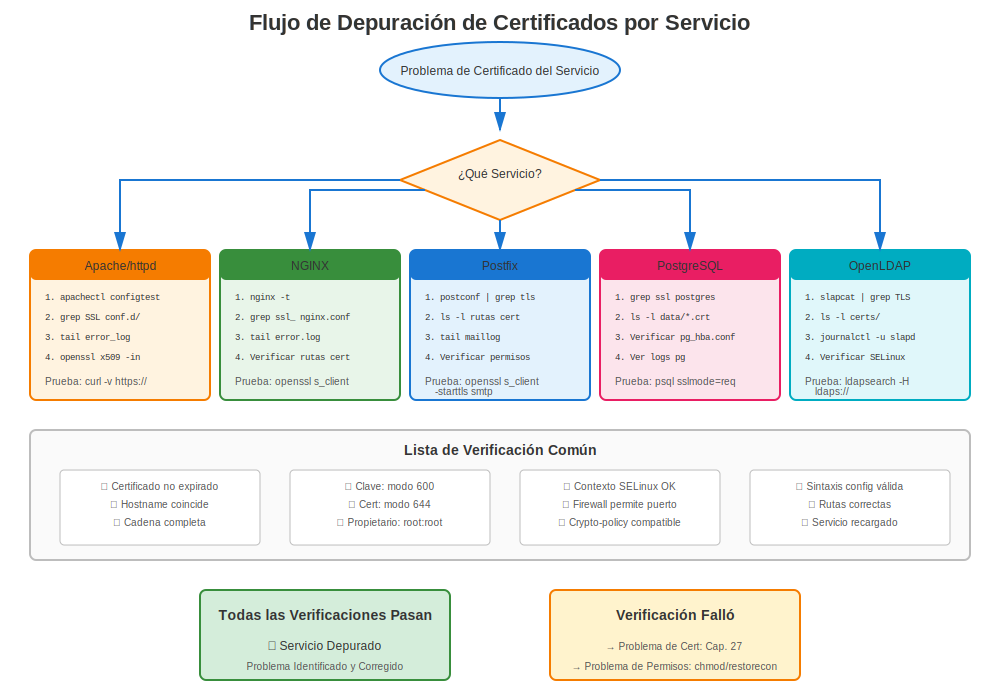

# Capítulo 29: Solución de Problemas Específica por Servicio

> **Servicio por Servicio:** Cada servicio RHEL tiene requisitos únicos de certificados y modos de fallo. Este capítulo proporciona solución de problemas dirigida para cada servicio principal.

---

## 29.1 Solución de Problemas de Apache httpd



### Apache No Inicia

**Pasos de Diagnóstico:**
```bash
#============================================#
# SOLUCIÓN DE PROBLEMAS CERTIFICADOS APACHE
#============================================#

# Paso 1: Verificar estado de Apache
systemctl status httpd
sudo journalctl -xe -u httpd

# Paso 2: Probar configuración
sudo apachectl configtest
# Buscar errores relacionados con SSL

# Paso 3: Verificar si mod_ssl está cargado
sudo httpd -M | grep ssl
# Debería mostrar: ssl_module (shared)

# Paso 4: Verificar archivos de certificado
ls -l /etc/pki/tls/certs/*.crt
ls -l /etc/pki/tls/private/*.key

# Paso 5: Verificar permisos
ls -l /etc/pki/tls/private/server.key
# Debería ser: -rw------- (600)

# Paso 6: Verificar coincidencia cert/clave
CERT_MOD=$(openssl x509 -noout -modulus -in /etc/pki/tls/certs/server.crt | openssl md5)
KEY_MOD=$(openssl rsa -noout -modulus -in /etc/pki/tls/private/server.key | openssl md5)
[ "$CERT_MOD" = "$KEY_MOD" ] && echo "✅ Coincide" || echo "❌ ¡Desajuste!"

# Paso 7: Verificar SELinux
sudo ausearch -m avc -ts recent | grep httpd | grep cert
```

### Errores SSL Comunes de Apache

| Error | Causa | Solución |
|-------|-------|----------|
| "SSLCertificateFile: file does not exist" | Ruta incorrecta | Corregir ruta en ssl.conf |
| "key values mismatch" | Cert/clave no emparejan | Regenerar con clave correcta |
| "unable to load certificate" | Problema formato archivo | Asegurar formato PEM |
| "Syntax error" en ssl.conf | Error de tipeo en config | Ejecutar `apachectl configtest` |
| "unable to verify certificate" | Problema de cadena | Agregar cert intermedio |

---

## 29.2 Solución de Problemas de NGINX

### Problemas SSL/TLS de NGINX

**Pasos de Diagnóstico:**
```bash
#============================================#
# SOLUCIÓN DE PROBLEMAS CERTIFICADOS NGINX
#============================================#

# Paso 1: Probar configuración
sudo nginx -t

# Paso 2: Mostrar configuración completa
sudo nginx -T | grep ssl_certificate

# Paso 3: Verificar archivos de certificado
ls -l /etc/pki/tls/certs/nginx.crt
ls -l /etc/pki/tls/private/nginx.key

# Paso 4: Verificar par cert/clave
openssl x509 -noout -modulus -in /etc/pki/tls/certs/nginx.crt | openssl md5
openssl rsa -noout -modulus -in /etc/pki/tls/private/nginx.key | openssl md5

# Paso 5: Verificar log de errores de NGINX
sudo tail -50 /var/log/nginx/error.log | grep -i ssl

# Paso 6: Verificar si NGINX está ejecutándose
systemctl status nginx
ss -tlnp | grep nginx
```

### Errores SSL Comunes de NGINX

| Error | Causa | Solución |
|-------|-------|----------|
| "SSL: error:0200100D" | Permission denied en clave | `chmod 600` en clave |
| "no \"ssl\" is defined" | Falta ssl en listen | Agregar `listen 443 ssl;` |
| "cannot load certificate" | Archivo no encontrado | Verificar ruta |
| "PEM_read_bio:no start line" | Formato incorrecto | Asegurar formato PEM |
| "nginx: [emerg] bind() failed" | Puerto en uso | Verificar qué está en puerto 443 |

---

## 29.3 Solución de Problemas de Postfix

### Problemas TLS de Postfix

**Pasos de Diagnóstico:**
```bash
#============================================#
# SOLUCIÓN DE PROBLEMAS TLS POSTFIX
#============================================#

# Paso 1: Verificar configuración TLS de Postfix
sudo postconf | grep -i tls

# Paso 2: Ver ajustes específicos
sudo postconf smtpd_tls_cert_file smtpd_tls_key_file

# Paso 3: Probar configuración
sudo postfix check

# Paso 4: Verificar archivos de certificado
ls -l $(sudo postconf -h smtpd_tls_cert_file)
ls -l $(sudo postconf -h smtpd_tls_key_file)

# Paso 5: Probar SMTP TLS
openssl s_client -starttls smtp -connect localhost:25

# Paso 6: Verificar logs de correo
sudo tail -f /var/log/maillog | grep -i tls

# Paso 7: Verificar si se ofrece STARTTLS
telnet localhost 25
# Escribir: EHLO test
# Debería mostrar: 250-STARTTLS
```

### Errores TLS Comunes de Postfix

| Error | Causa | Solución |
|-------|-------|----------|
| "SSL_accept error" | Problema cert/clave | Verificar par cert/clave |
| "TLS is required but not available" | TLS no habilitado | Establecer security_level = may |
| "no shared cipher" | Desajuste de cifrado | Verificar crypto-policy |
| "certificate verify failed" | Problema de cadena | Instalar intermedio |
| "Permission denied" | Permisos de clave | `chmod 600` en clave |

---

## 29.4 Solución de Problemas de OpenLDAP

### Problemas LDAPS

**Pasos de Diagnóstico:**
```bash
#============================================#
# SOLUCIÓN DE PROBLEMAS TLS OPENLDAP
#============================================#

# Paso 1: Verificar si slapd escucha en 636
ss -tlnp | grep 636

# Paso 2: Verificar configuración TLS
sudo slapcat -b "cn=config" | grep -i tls

# Paso 3: Verificar archivos de certificado
ls -l /etc/openldap/certs/ldap.{crt,key}

# Paso 4: Verificar ownership
# ¡CRÍTICO: Debe ser propiedad del usuario ldap!
ls -l /etc/openldap/certs/
# Debería mostrar: ldap:ldap

# Paso 5: Probar conexión LDAPS
openssl s_client -connect localhost:636

# Paso 6: Probar con ldapsearch
ldapsearch -H ldaps://localhost:636 -x -b "" -s base

# Paso 7: Verificar logs de slapd
sudo journalctl -u slapd | grep -i tls
```

### Errores TLS Comunes de OpenLDAP

| Error | Causa | Solución |
|-------|-------|----------|
| "TLS: can't accept" | Clave no legible | `chown ldap:ldap` en clave |
| "TLS: hostname does not match" | Desajuste CN/SAN | Reemitir con hostname correcto |
| "certificate verify failed" | CA no confiable | Agregar CA al almacén de confianza |
| "Permission denied" | Ownership incorrecto | `chown ldap:ldap` |
| "TLS engine not initialized" | TLS no configurado | Agregar directivas TLS |

---

## 29.5 Solución de Problemas de PostgreSQL

### Problemas SSL de PostgreSQL

**Pasos de Diagnóstico:**
```bash
#============================================#
# SOLUCIÓN DE PROBLEMAS SSL POSTGRESQL
#============================================#

# Paso 1: Verificar si SSL está habilitado
sudo -u postgres psql -c "SHOW ssl;"

# Paso 2: Ver ajustes SSL
sudo -u postgres psql -c "SHOW ssl_cert_file; SHOW ssl_key_file;"

# Paso 3: Verificar archivos de certificado
ls -l /var/lib/pgsql/data/server.{crt,key}

# Paso 4: Verificar ownership
# Debe ser propiedad del usuario postgres
ls -l /var/lib/pgsql/data/server.key
# -rw------- postgres postgres

# Paso 5: Probar conexión SSL
psql "host=localhost sslmode=require"

# Paso 6: Verificar logs de PostgreSQL
sudo tail -f /var/lib/pgsql/data/log/postgresql-*.log | grep -i ssl

# Paso 7: Verificar permisos
sudo -u postgres stat /var/lib/pgsql/data/server.key
```

### Errores SSL Comunes de PostgreSQL

| Error | Causa | Solución |
|-------|-------|----------|
| "could not load server certificate" | Permission denied | `chown postgres:postgres`, `chmod 600` |
| "private key file has wrong permissions" | Muy permisivo | `chmod 600` en clave |
| "SSL connection has been closed unexpectedly" | Problema de confianza | Verificar confianza CA del cliente |
| "SSL is not enabled" | SSL off en config | Establecer `ssl = on` |

---

## 29.6 Solución de Problemas de MySQL/MariaDB

### Problemas SSL de Base de Datos

**Pasos de Diagnóstico:**
```bash
#============================================#
# SOLUCIÓN DE PROBLEMAS SSL MYSQL/MARIADB
#============================================#

# Paso 1: Verificar si SSL está disponible
mysql -u root -p -e "SHOW VARIABLES LIKE 'have_ssl';"
# Debería mostrar: YES

# Paso 2: Ver variables SSL
mysql -u root -p -e "SHOW VARIABLES LIKE '%ssl%';"

# Paso 3: Verificar archivos de certificado
ls -l /etc/mysql/certs/{ca,server}.{crt,key}

# Paso 4: Verificar ownership
# Debe ser legible por usuario mysql
ls -l /etc/mysql/certs/
# mysql:mysql

# Paso 5: Probar conexión SSL
mysql --ssl-mode=REQUIRED -h localhost -u root -p

# Paso 6: Verificar estado de conexión
mysql -u root -p -e "STATUS" | grep SSL

# Paso 7: Verificar log de errores
sudo tail -f /var/log/mariadb/mariadb.log | grep -i ssl
```

---

## 29.7 Problemas entre Servicios

### El Certificado Funciona en Un Servicio, Falla en Otro

**Escenario:** El mismo certificado funciona en Apache pero falla en Postfix

**Diagnóstico:**
```bash
# Apache funciona
curl -v https://localhost/
# ✅ OK

# Postfix falla
openssl s_client -starttls smtp -connect localhost:25
# ❌ Error

# ¿Por qué? ¡Requisitos diferentes!
```

**Causas Comunes:**

**Causa 1: Ownership de archivo**
- Apache: Se ejecuta como root (puede leer claves propiedad de root)
- Postfix: Se ejecuta como postfix (necesita clave legible)
- OpenLDAP: Se ejecuta como ldap (necesita clave propiedad de ldap)

**Causa 2: Ubicaciones de archivo**
- Apache: /etc/pki/tls/
- PostgreSQL: /var/lib/pgsql/data/
- OpenLDAP: /etc/openldap/certs/

**Causa 3: Requisitos de formato**
- La mayoría de servicios: Archivos cert y clave separados
- HAProxy: Archivo PEM combinado
- Cockpit: Cert+clave combinados

---

## 29.8 Kit de Herramientas de Solución de Problemas

### Comandos de Prueba Específicos por Servicio

```bash
#============================================#
# PROBAR CADA SERVICIO
#============================================#

# Apache HTTPS
curl -v https://localhost/
openssl s_client -connect localhost:443

# NGINX HTTPS
curl -v https://localhost:8443/  # Si puerto personalizado
openssl s_client -connect localhost:443

# Postfix SMTP
openssl s_client -starttls smtp -connect localhost:25
openssl s_client -connect localhost:465  # SMTPS

# Dovecot IMAP
openssl s_client -connect localhost:993  # IMAPS
openssl s_client -connect localhost:995  # POP3S

# OpenLDAP
openssl s_client -connect localhost:636  # LDAPS
ldapsearch -H ldaps://localhost:636 -x -b ""

# PostgreSQL
psql "host=localhost sslmode=require"

# MySQL/MariaDB
mysql --ssl-mode=REQUIRED -h localhost -u root -p

# Cockpit
openssl s_client -connect localhost:9090
```

---

## 29.9 Conclusiones Clave

1. **Cada servicio tiene requisitos únicos** - Ownership, ubicación, formato
2. **Siempre verificar logs específicos del servicio** primero
3. **Probar con comandos específicos del servicio** (no solo openssl)
4. **Permisos críticos** - Usuarios diferentes para servicios diferentes
5. **Las ubicaciones de archivo importan** - Rutas dependientes del servicio
6. **Sintaxis de configuración** varía por servicio
7. **Referencia capítulos de servicio** (Cap 14-21) para config detallada

---

## Tarjeta de Referencia Rápida

```
┌─────────────────────────────────────────────────────────────┐
│ SOLUCIÓN DE PROBLEMAS ESPECÍFICO POR SERVICIO               │
├─────────────────────────────────────────────────────────────┤
│ Apache:      apachectl configtest                           │
│              tail -f /var/log/httpd/ssl_error_log           │
│                                                             │
│ NGINX:       nginx -t                                       │
│              tail -f /var/log/nginx/error.log               │
│                                                             │
│ Postfix:     postfix check                                  │
│              tail -f /var/log/maillog | grep TLS            │
│                                                             │
│ OpenLDAP:    slapcat -b "cn=config" | grep TLS              │
│              journalctl -u slapd | grep TLS                 │
│              chown ldap:ldap (¡CRÍTICO!)                    │
│                                                             │
│ PostgreSQL:  psql -c "SHOW ssl;"                            │
│              chown postgres:postgres (¡CRÍTICO!)            │
│                                                             │
│ MySQL:       mysql -e "SHOW VARIABLES LIKE '%ssl%';"        │
│              chown mysql:mysql (¡CRÍTICO!)                  │
└─────────────────────────────────────────────────────────────┘

⚠️ ¡El ownership de archivo es específico del servicio!
✅ Siempre verificar logs para cada servicio
```
---

**Navegación del Capítulo**

| [← Anterior: Capítulo 28 - Errores Comunes de Certificados en RHEL](28-common-errors.md) | [Siguiente: Capítulo 30 - Solución de Problemas de certmonger →](30-certmonger-issues.md) |
|:---|---:|
