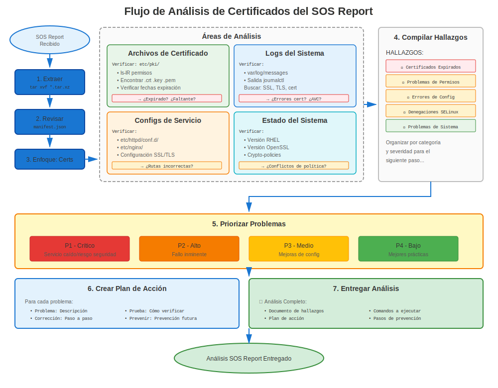

# Capítulo 32: Análisis de Informes SOS

> **Esencial para Soporte:** Los informes SOS son la herramienta de diagnóstico del sistema de RHEL. Aprende cómo extraer información de certificados de informes SOS para solución de problemas.

---

## 32.1 ¿Qué es un Informe SOS?



**sosreport** es la herramienta de recopilación de datos de diagnóstico de Red Hat.

**Contiene:**
- ✅ Archivos de configuración del sistema
- ✅ Archivos de log
- ✅ Salidas de comandos
- ✅ Listas de paquetes
- ✅ Información de certificados
- ✅ Ajustes de seguridad
- ❌ Claves privadas (¡excluidas por seguridad!)

**Casos de Uso:**
- Abrir casos de soporte Red Hat
- Análisis post-incidente
- Auditorías pre-migración
- Verificaciones de cumplimiento de seguridad

---

## 32.2 Generar un Informe SOS

### Generación Básica de Informe SOS

```bash
#============================================#
# GENERAR INFORME SOS
#============================================#

# Instalar sos (usualmente pre-instalado)
sudo dnf install sos -y

# Generar informe
sudo sos report

# Prompts interactivos:
# - ID de caso (opcional)
# - Descripción
# - Confirmar

# Salida:
# /var/tmp/sosreport-hostname-YYYYMMDDHHMMSS.tar.xz

# Extraer
tar xf /var/tmp/sosreport-*.tar.xz
cd sosreport-*/
```

### Informe SOS Enfocado en Certificados

```bash
#============================================#
# INFORME SOS CON ENFOQUE EN CERTIFICADOS
#============================================#

# Generar con plugins específicos
sudo sos report \
  --batch \
  --enable-plugins crypto,openssl,certmonger,freeipa \
  --case-id "CASE12345"

# O especificar qué incluir
sudo sos report \
  --batch \
  -o crypto \
  -o openssl \
  -o certmonger \
  -o pki
```

---

## 32.3 Encontrar Información de Certificados en SOS

### Ubicaciones Clave en Informe SOS

```bash
#============================================#
# ARCHIVOS RELACIONADOS CON CERTIFICADOS EN INFORME SOS
#============================================#

# Después de extraer sosreport-*.tar.xz:
cd sosreport-*/

# Archivos de certificado (¡solo públicos, sin claves privadas!)
ls -la etc/pki/tls/certs/
ls -la etc/pki/ca-trust/source/anchors/

# Rastreo de certmonger
cat sos_commands/certmonger/getcert_list

# Versión de OpenSSL
cat sos_commands/crypto/openssl_version

# Crypto-policy (RHEL 8+)
cat sos_commands/crypto/update-crypto-policies_--show

# Almacén de confianza
ls -la etc/pki/ca-trust/extracted/

# Configuraciones de servicios
cat etc/httpd/conf.d/ssl.conf
cat etc/nginx/nginx.conf
cat etc/postfix/main.cf | grep tls

# Verificación de expiración de certificado
cat sos_commands/crypto/openssl_x509_-in_*

# Información del sistema
cat etc/redhat-release
cat sos_commands/kernel/uname_-a
```

---

## 32.4 Analizar Problemas de Certificados desde SOS

### Análisis de Expiración de Certificados

```bash
#============================================#
# VERIFICAR EXPIRACIÓN DE CERTIFICADOS EN SOS
#============================================#

# Navegar a directorio de informe SOS
cd sosreport-hostname-*/

# Encontrar todas las salidas de inspección de certificados
find sos_commands/crypto/ -name "*x509*" -type f

# Verificar cada certificado
for cert_output in sos_commands/crypto/openssl_x509_*.txt; do
  echo "=== $cert_output ==="
  grep -E "(Subject:|Not After)" "$cert_output"
  echo ""
done

# O extraer fechas de expiración
grep -r "Not After" sos_commands/crypto/ | sort
```

### Análisis de Estado de certmonger

```bash
#============================================#
# ANALIZAR CERTMONGER DESDE SOS
#============================================#

# Salida de lista de certmonger
cat sos_commands/certmonger/getcert_list

# Buscar:
# - status: CA_UNREACHABLE  ← ¡Problema!
# - status: CA_REJECTED     ← ¡Problema!
# - expires: <date>         ← Verificar si pronto

# Contar certificados por estado
grep "status:" sos_commands/certmonger/getcert_list | sort | uniq -c

# Encontrar certificados problemáticos
grep -B10 "CA_UNREACHABLE\|CA_REJECTED" sos_commands/certmonger/getcert_list
```

### Análisis de Crypto-Policy (RHEL 8+)

```bash
#============================================#
# VERIFICAR CRYPTO-POLICY EN SOS
#============================================#

# Política actual
cat sos_commands/crypto/update-crypto-policies_--show

# Verificar sobrescrituras
grep -r "SSLProtocol\|SSLCipherSuite" etc/httpd/
grep -r "ssl_protocols\|ssl_ciphers" etc/nginx/
grep -r "tls_protocols" etc/postfix/main.cf

# Si se encuentran sobrescrituras: Documentar que servicio opta por no usar crypto-policy
```

---

## 32.5 Hallazgos Comunes en Informes SOS

### Hallazgo 1: Certificados Expirados

**En Informe SOS:**
```bash
# Verificar expiraciones de certificados
grep "Not After" sos_commands/crypto/* | \
  while read line; do
    # Parsear y verificar si expiró
    echo "$line"
  done
```

**Señales de Alerta:**
- Certificados expirados antes de generación del informe SOS
- Certificados expirando dentro de 30 días
- Múltiples certificados expirados

### Hallazgo 2: Problemas de certmonger

**En Informe SOS:**
```bash
# Verificar estado de certmonger
cat sos_commands/certmonger/getcert_list | grep -A15 "Request ID"

# Problemas comunes:
# - Múltiples CA_UNREACHABLE (problema conectividad IPA)
# - CA_REJECTED (problema permisos/principal)
# - Fechas de expiración antiguas sin renovación (certmonger no funcionando)
```

### Hallazgo 3: Certificados Intermedios Faltantes

**En Informe SOS:**
```bash
# Verificar cadena de certificado
# Si configuración de servicio apunta a cert sin intermedio:
grep "SSLCertificateFile" etc/httpd/conf.d/ssl.conf
# /etc/pki/tls/certs/server.crt  ← Verificar si esto incluye cadena

# Verificar certificado real
openssl x509 -in etc/pki/tls/certs/server.crt -noout -text
# Buscar: Issuer (si no es conocido, necesita intermedio)
```

---

## 32.6 Lista de Verificación de Informe SOS para Certificados

### Análisis Sistemático

```markdown
## Lista de Verificación Análisis de Certificados en Informe SOS

### Información del Sistema
- [ ] Versión RHEL (`cat etc/redhat-release`)
- [ ] Versión OpenSSL (`cat sos_commands/crypto/openssl_version`)
- [ ] Crypto-policy (`cat sos_commands/crypto/update-crypto-policies*`)
- [ ] Modo FIPS (`grep FIPS sos_commands/crypto/*`)

### Archivos de Certificado
- [ ] Listar certificados (`ls etc/pki/tls/certs/`)
- [ ] Verificar permisos (`ls -la etc/pki/tls/private/`)
- [ ] Verificar ownership
- [ ] Verificar contextos SELinux (`ls -Z etc/pki/tls/`)

### Validez de Certificado
- [ ] Verificar expiraciones (`grep "Not After" sos_commands/crypto/*`)
- [ ] Identificar certificados expirados
- [ ] Identificar certificados expirando pronto (< 30 días)
- [ ] Verificar algoritmos de firma (SHA-1 = problema en RHEL 9+)

### Estado de certmonger (si se usa)
- [ ] ¿certmonger ejecutándose? (`cat sos_commands/systemd/systemctl_list-units`)
- [ ] Certificados rastreados (`cat sos_commands/certmonger/getcert_list`)
- [ ] ¿Algún CA_UNREACHABLE o CA_REJECTED?
- [ ] ¿Calendario de renovación apropiado?

### Configuraciones de Servicios
- [ ] Config SSL Apache (`cat etc/httpd/conf.d/ssl.conf`)
- [ ] Config SSL NGINX (`cat etc/nginx/nginx.conf`)
- [ ] Config TLS Postfix (`grep tls etc/postfix/main.cf`)
- [ ] Config TLS OpenLDAP
- [ ] ¿Rutas de certificado correctas?

### Almacén de Confianza
- [ ] CAs personalizadas (`ls etc/pki/ca-trust/source/anchors/`)
- [ ] Paquete de confianza actualizado
- [ ] Certs en lista negra (RHEL 8+)

### Logs
- [ ] Errores recientes de certificado (`grep -i cert var/log/messages`)
- [ ] Errores SSL/TLS en logs de servicio
- [ ] Denegaciones SELinux (`grep AVC var/log/audit/audit.log | grep cert`)

### Recomendaciones
- [ ] Listar problemas de certificados encontrados
- [ ] Priorizar por severidad
- [ ] Sugerir pasos de remediación
```

---

## 32.7 Script Automatizado de Análisis SOS

### Buscador de Problemas de Certificados

```bash
#!/bin/bash
# analyze-sos-certificates.sh
# Detección automatizada de problemas de certificados en informes SOS

SOS_DIR=$1

if [ -z "$SOS_DIR" ] || [ ! -d "$SOS_DIR" ]; then
  echo "Uso: $0 /path/to/sosreport-directory"
  exit 1
fi

cd "$SOS_DIR"

echo "=== Análisis de Certificados en Informe SOS ==="
echo "Informe: $(basename $SOS_DIR)"
echo ""

# Info del sistema
echo "Información del Sistema:"
echo "  Versión RHEL: $(cat etc/redhat-release 2>/dev/null)"
echo "  OpenSSL: $(cat sos_commands/crypto/openssl_version 2>/dev/null | head -2)"
if [ -f sos_commands/crypto/update-crypto-policies_--show ]; then
  echo "  Crypto-Policy: $(cat sos_commands/crypto/update-crypto-policies_--show)"
fi
echo ""

# Expiración de certificados
echo "Expiración de Certificados:"
if [ -d sos_commands/crypto ]; then
  grep -h "Not After" sos_commands/crypto/openssl_x509_* 2>/dev/null | \
    while read line; do
      echo "  $line"
    done
else
  echo "  No se encontraron datos de certificados"
fi
echo ""

# Estado de certmonger
echo "Estado de certmonger:"
if [ -f sos_commands/certmonger/getcert_list ]; then
  STATUS_COUNT=$(grep "status:" sos_commands/certmonger/getcert_list | sort | uniq -c)
  echo "$STATUS_COUNT"

  # Resaltar problemas
  if grep -q "CA_UNREACHABLE\|CA_REJECTED" sos_commands/certmonger/getcert_list; then
    echo "  ⚠️ Problemas encontrados:"
    grep -B5 "CA_UNREACHABLE\|CA_REJECTED" sos_commands/certmonger/getcert_list | \
      grep -E "(Request ID|status:)" | head -20
  fi
else
  echo "  certmonger no instalado o sin datos"
fi
echo ""

# Verificar problemas comunes
echo "Problemas Potenciales:"
ISSUES=0

# Certs expirados (verificación básica)
if grep -q "Not After.*202[0-3]" sos_commands/crypto/* 2>/dev/null; then
  echo "  ⚠️ Certificados potencialmente expirados encontrados"
  ((ISSUES++))
fi

# Problemas de certmonger
if grep -q "CA_UNREACHABLE" sos_commands/certmonger/getcert_list 2>/dev/null; then
  echo "  ⚠️ Estado CA_UNREACHABLE de certmonger encontrado"
  ((ISSUES++))
fi

# Denegaciones SELinux
if grep -q "avc.*denied.*cert" var/log/audit/audit.log 2>/dev/null; then
  echo "  ⚠️ Denegaciones SELinux relacionadas con certificados"
  ((ISSUES++))
fi

if [ $ISSUES -eq 0 ]; then
  echo "  ✅ No se detectaron problemas obvios"
fi

echo ""
echo "=== Análisis Completo ==="
```

---

## 32.8 Archivos Clave a Verificar en SOS

### Archivos Críticos de Certificados

```
sosreport-hostname-YYYYMMDDHHMMSS/
├── etc/
│   ├── pki/
│   │   ├── tls/certs/                     ← Certificados (públicos)
│   │   ├── ca-trust/                      ← Almacén de confianza
│   │   └── nssdb/                         ← Bases de datos NSS
│   ├── httpd/conf.d/ssl.conf              ← Config Apache
│   ├── nginx/nginx.conf                   ← Config NGINX
│   └── postfix/main.cf                    ← Config Postfix
│
├── sos_commands/
│   ├── crypto/
│   │   ├── openssl_version                ← Versión OpenSSL
│   │   ├── openssl_x509_*                 ← Inspecciones de certificados
│   │   └── update-crypto-policies_--show  ← Política
│   │
│   ├── certmonger/
│   │   └── getcert_list                   ← Estado certmonger
│   │
│   ├── systemd/
│   │   └── systemctl_list-units           ← Estado de servicios
│   │
│   └── networking/
│       └── ss_-tulpn                      ← Puertos escuchando
│
└── var/log/
    ├── messages                           ← Log del sistema
    ├── httpd/ssl_error_log                ← Errores SSL Apache
    └── audit/audit.log                    ← Denegaciones SELinux
```

---

## 32.9 Escenarios Comunes en Informes SOS

### Escenario 1: Sitio Web Caído - ¿Problema de Certificado?

**Pasos de Análisis:**
```bash
# 1. Verificar si httpd estaba ejecutándose
grep "httpd.service" sos_commands/systemd/systemctl_list-units
# active (running) ← Servicio estaba activo

# 2. Verificar log de errores SSL
tail var/log/httpd/ssl_error_log
# Buscar errores relacionados con certificados

# 3. Verificar expiración de certificado
cat sos_commands/crypto/openssl_x509_*server.crt* | grep "Not After"

# 4. Verificar configuración de Apache
cat etc/httpd/conf.d/ssl.conf | grep -E "SSLCertificate"

# 5. Verificar si existían archivos
ls -l etc/pki/tls/certs/ | grep server
```

### Escenario 2: Fallos de Renovación de certmonger

**Pasos de Análisis:**
```bash
# 1. Verificar estado de certmonger
cat sos_commands/certmonger/getcert_list

# 2. Buscar CA_UNREACHABLE
grep "CA_UNREACHABLE" sos_commands/certmonger/getcert_list

# 3. Verificar conectividad IPA (si usa FreeIPA)
grep "ipa" var/log/messages | tail -50

# 4. Verificar tickets Kerberos
cat sos_commands/kerberos/klist* 2>/dev/null

# 5. Identificar cuándo debería haber ocurrido renovación
# Buscar fechas de expiración, calcular 2/3 del tiempo de vida
```

---

## 32.10 Conclusiones Clave

1. **Los informes SOS son invaluables** para solución de problemas remota
2. **No incluyen claves privadas** (¡seguridad!)
3. **SÍ incluyen información de certificados** (certs públicos, config, logs)
4. **Estado de certmonger preservado** en salida getcert_list
5. **Crypto-policy registrada** (RHEL 8+)
6. **Usar para análisis post-incidente** y auditorías
7. **Automatizar análisis** con scripts

---

## Tarjeta de Referencia Rápida

```
┌──────────────────────────────────────────────────────────────┐
│ ANÁLISIS DE CERTIFICADOS EN INFORME SOS                      │
├──────────────────────────────────────────────────────────────┤
│ Generar:         sudo sos report                             │
│ Extraer:         tar xf sosreport-*.tar.xz                   │
│                                                              │
│ Archivos clave:  etc/pki/tls/certs/                          │
│                  etc/httpd/conf.d/ssl.conf                   │
│                  sos_commands/certmonger/getcert_list        │
│                  sos_commands/crypto/openssl_version         │
│                  sos_commands/crypto/update-crypto-policies* │
│                  var/log/httpd/ssl_error_log                 │
│                                                              │
│ Verificaciones comunes:                                      │
│   - Fechas de expiración de certificados                     │
│   - Estado de certmonger                                     │
│   - Configuraciones de servicios                             │
│   - Ajuste de crypto-policy                                  │
│   - Denegaciones SELinux                                     │
└──────────────────────────────────────────────────────────────┘

⚠️ Claves privadas NO incluidas (seguridad)
✅ Perfecto para solución de problemas remota
```
---

**Navegación del Capítulo**

| [← Anterior: Capítulo 31 - Solución de Problemas de Crypto-Policy](31-crypto-policy-issues.md) | [Siguiente: Capítulo 33 - Procedimientos de Emergencia →](33-emergency-procedures.md) |
|:---|---:|
