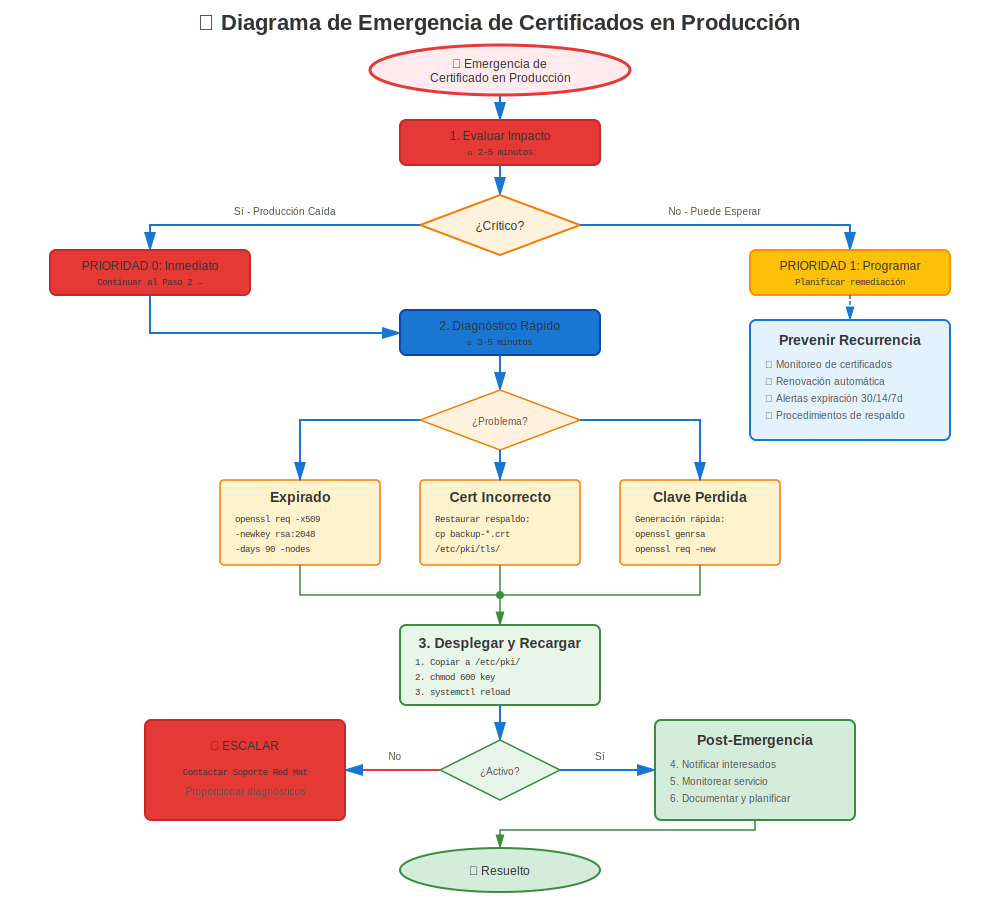

# Capítulo 33: Procedimientos de Emergencia

> **Producción Caída:** Cuando los certificados fallan y los servicios están fuera de línea, necesitas procedimientos rápidos y confiables. Este capítulo es tu manual de emergencia.

---

## 33.1 Filosofía de Respuesta a Emergencias



**Cuando la producción está caída:**
- ⏰ **La velocidad importa** - Cada minuto cuenta
- 🎯 **Corregir primero, investigar después** - Poner servicios en funcionamiento
- 📝 **Documentar todo** - Para post-mortem
- 🔄 **Temporal está OK** - La solución apropiada viene después de la recuperación

**Este capítulo proporciona:**
- Procedimientos de diagnóstico rápido
- Soluciones alternativas de emergencia
- Certificados temporales
- Procedimientos de rollback
- Plantillas de comunicación

---

## 33.2 Diagnóstico Rápido (Primeros 60 Segundos)

### Preguntas de Triaje

```bash
#============================================#
# TRIAJE DE EMERGENCIA - 60 SEGUNDOS
#============================================#

# P1: ¿Qué está roto?
systemctl status httpd nginx postfix

# P2: ¿Cuándo se rompió?
journalctl -xe --since "10 minutos ago" | grep -i cert

# P3: ¿Certificado expirado?
openssl x509 -in /etc/pki/tls/certs/server.crt -noout -dates

# P4: ¿Cambios recientes?
rpm -qa --last | head -20        # Actualizaciones recientes de paquetes
ausearch -m SYSCALL --start recent | grep cert  # Acceso reciente a archivo cert

# P5: ¿Disco lleno?
df -h /etc/pki

# P6: ¿SELinux bloqueando?
ausearch -m avc -ts recent | grep cert
```

### Árbol de Decisión (Primera Respuesta)

```
Problema de Certificado Detectado
    │
    ├─ ¿El servicio no inicia?
    │   ├─ Archivo no encontrado → Solución Rápida #1: Restaurar desde respaldo
    │   ├─ Permission denied → Solución Rápida #2: Corregir permisos
    │   └─ Cert inválido → Solución Rápida #3: Usar cert temporal
    │
    ├─ ¿Certificado expirado?
    │   └─ Solución Rápida #4: Generar autofirmado temp O restaurar respaldo
    │
    ├─ ¿Fallo validación de cadena?
    │   └─ Solución Rápida #5: Agregar CA faltante O usar política LEGACY
    │
    └─ ¿Desconocido/Complejo?
        └─ Escalar + Aplicar Solución Rápida #6: Rollback al último bueno conocido
```

---

## 33.3 Solución Rápida #1: Restaurar desde Respaldo

**Escenario:** Archivo de certificado/clave faltante o corrupto

**Tiempo:** 2-5 minutos

```bash
#!/bin/bash
# emergency-restore-cert.sh

SERVICE=$1  # apache, nginx, postfix, etc.
BACKUP_DIR="/var/backups/certificates"

echo "=== EMERGENCIA: Restaurando Certificado $SERVICE ==="

# Detener servicio
systemctl stop $SERVICE

# Encontrar respaldo más reciente
LATEST=$(ls -dt $BACKUP_DIR/*/ | head -2)
echo "Usando respaldo de: $LATEST"

# Restaurar certificado
if [ -f "$LATEST/${SERVICE}.crt" ]; then
  cp "$LATEST/${SERVICE}.crt" /etc/pki/tls/certs/
  chmod 644 /etc/pki/tls/certs/${SERVICE}.crt
  echo "✅ Certificado restaurado"
else
  echo "❌ No se encontró respaldo para $SERVICE"
  exit 1
fi

# Restaurar clave
if [ -f "$LATEST/${SERVICE}.key" ]; then
  cp "$LATEST/${SERVICE}.key" /etc/pki/tls/private/
  chmod 600 /etc/pki/tls/private/${SERVICE}.key
  echo "✅ Clave privada restaurada"
fi

# Iniciar servicio
systemctl start $SERVICE

# Verificar
sleep 2
systemctl status $SERVICE

if systemctl is-active --quiet $SERVICE; then
  echo "✅ ÉXITO: $SERVICE está ejecutándose"
  exit 0
else
  echo "❌ FALLÓ: $SERVICE no inició"
  journalctl -xe -u $SERVICE | tail -20
  exit 1
fi
```

---

## 33.4 Solución Rápida #2: Emergencia de Permisos

**Escenario:** El servicio falla con "permission denied" en archivos de certificado

**Tiempo:** 30 segundos

```bash
#!/bin/bash
# emergency-fix-permissions.sh

echo "=== EMERGENCIA: Corrigiendo Permisos de Certificados ==="

# Corregir directorio de certificados
chmod 755 /etc/pki/tls/certs/
chmod 644 /etc/pki/tls/certs/*.crt 2>/dev/null

# Corregir directorio de clave privada
chmod 711 /etc/pki/tls/private/
chmod 600 /etc/pki/tls/private/*.key 2>/dev/null

# Corregir ownership (ajustar para tu servicio)
chown root:root /etc/pki/tls/certs/*.crt 2>/dev/null
chown root:root /etc/pki/tls/private/*.key 2>/dev/null

# Corregir contextos SELinux
restorecon -Rv /etc/pki/tls/

echo "✅ Permisos corregidos"

# Mostrar resultados
echo ""
echo "Permisos de certificados:"
ls -lZ /etc/pki/tls/certs/*.crt 2>/dev/null | head -5

echo ""
echo "Permisos de claves:"
ls -lZ /etc/pki/tls/private/*.key 2>/dev/null | head -5
```

---

## 33.5 Solución Rápida #3: Generar Certificado Autofirmado Temporal

**Escenario:** Certificado expirado o inválido, necesita solución inmediata

**Tiempo:** 1-2 minutos

**⚠️ ADVERTENCIA:** ¡Los certs autofirmados causan advertencias en navegador! ¡Solo para uso interno de emergencia!

```bash
#!/bin/bash
# emergency-self-signed-cert.sh

HOSTNAME=${1:-$(hostname -f)}
DAYS=${2:-30}
CERT_PATH="/etc/pki/tls/certs/${HOSTNAME}-temp.crt"
KEY_PATH="/etc/pki/tls/private/${HOSTNAME}-temp.key"

echo "=== EMERGENCIA: Generando Certificado Autofirmado Temporal ==="
echo "Hostname: $HOSTNAME"
echo "Válido por: $DAYS días"

# Generar certificado autofirmado
openssl req -x509 -nodes -days $DAYS \
  -newkey rsa:2048 \
  -keyout "$KEY_PATH" \
  -out "$CERT_PATH" \
  -subj "/C=US/ST=Emergency/L=Emergency/O=Emergency/CN=$HOSTNAME" \
  -addext "subjectAltName=DNS:$HOSTNAME,DNS:$(hostname -s)"

if [ $? -eq 0 ]; then
  # Establecer permisos
  chmod 600 "$KEY_PATH"
  chmod 644 "$CERT_PATH"

  echo "✅ Certificado temporal generado"
  echo "   Certificado: $CERT_PATH"
  echo "   Clave: $KEY_PATH"
  echo ""
  echo "⚠️ CRÍTICO: ¡Esta es una solución TEMPORAL!"
  echo "   - Solicitar certificado apropiado inmediatamente"
  echo "   - Documentar esta acción de emergencia"
  echo "   - Planificar reemplazo apropiado dentro de $DAYS días"
  echo ""
  echo "Para usar con Apache:"
  echo "  SSLCertificateFile $CERT_PATH"
  echo "  SSLCertificateKeyFile $KEY_PATH"

  # Mostrar certificado
  openssl x509 -in "$CERT_PATH" -noout -text | grep -E "(Subject:|Not After)"
else
  echo "❌ FALLÓ al generar certificado"
  exit 1
fi
```

---

## 33.6 Solución Rápida #4: Renovación de Certificado de Emergencia

**Escenario:** Certificado expirado, necesita renovación apropiada LO ANTES POSIBLE

**Tiempo:** 5-15 minutos (depende de CA)

```bash
#!/bin/bash
# emergency-renew-cert.sh

CERT_PATH=$1
KEY_PATH=$2
HOSTNAME=$3

echo "=== EMERGENCIA: Renovando Certificado Expirado ==="

# Generar nuevo CSR
CSR_PATH="/tmp/emergency-$(date +%s).csr"

openssl req -new -key "$KEY_PATH" -out "$CSR_PATH" \
  -subj "/CN=$HOSTNAME" \
  -addext "subjectAltName=DNS:$HOSTNAME"

if [ $? -eq 0 ]; then
  echo "✅ CSR generado: $CSR_PATH"
  echo ""
  echo "SIGUIENTES PASOS:"
  echo "1. Enviar CSR a CA inmediatamente:"
  echo "   cat $CSR_PATH"
  echo ""
  echo "2. Mientras esperas a CA:"
  echo "   - Usar cert autofirmado temporal (ver Solución Rápida #3)"
  echo "   - O restaurar desde respaldo (ver Solución Rápida #1)"
  echo ""
  echo "3. Una vez que CA retorne certificado:"
  echo "   cp new-cert.crt $CERT_PATH"
  echo "   systemctl reload <service>"

  # Si usas FreeIPA
  if command -v ipa-getcert &>/dev/null; then
    echo ""
    echo "4. Si usas FreeIPA, intenta renovación automática:"
    echo "   sudo ipa-getcert resubmit -f $CERT_PATH"
  fi
else
  echo "❌ FALLÓ al generar CSR"
  exit 1
fi
```

---

## 33.7 Solución Rápida #5: Emergencia de Cadena de Confianza

**Escenario:** Error "Unable to get local issuer certificate"

**Tiempo:** 1-2 minutos

```bash
#!/bin/bash
# emergency-fix-trust.sh

CA_CERT=$1  # Ruta a certificado CA

if [ -z "$CA_CERT" ] || [ ! -f "$CA_CERT" ]; then
  echo "❌ Uso: $0 /path/to/ca-cert.crt"
  exit 1
fi

echo "=== EMERGENCIA: Agregando CA al Almacén de Confianza ==="

# Copiar CA a anchors de confianza
cp "$CA_CERT" /etc/pki/ca-trust/source/anchors/

# Actualizar almacén de confianza
update-ca-trust extract

echo "✅ CA agregada al almacén de confianza del sistema"

# Verificar
if trust list | grep -q "$(basename "$CA_CERT" .crt)"; then
  echo "✅ VERIFICADO: CA ahora es confiable"
else
  echo "⚠️ Advertencia: No se pudo verificar que CA fue agregada"
fi

# Probar validación de certificado
echo ""
echo "Prueba tu certificado ahora:"
echo "  openssl verify /path/to/your/cert.crt"
```

**Alternativa: Política LEGACY Temporal (RHEL 8+)**

```bash
# Si problema de confianza es debido a algoritmos débiles
# ¡TEMPORAL - revertir después de solución apropiada!

echo "=== EMERGENCIA: Estableciendo Crypto Policy LEGACY ==="
update-crypto-policies --show  # Guardar actual
sudo update-crypto-policies --set LEGACY
systemctl restart <service>

echo "⚠️ CRÍTICO: ¡Esto es temporal!"
echo "Solución apropiada requerida dentro de 24 horas"
```

---

## 33.8 Solución Rápida #6: Rollback al Último Bueno Conocido

**Escenario:** Cambio reciente rompió todo, necesita revertir

**Tiempo:** 2-5 minutos

```bash
#!/bin/bash
# emergency-rollback.sh

echo "=== EMERGENCIA: Rollback a Última Configuración Buena Conocida ==="

# Detener servicio
systemctl stop httpd

# Respaldar estado actual (roto)
TIMESTAMP=$(date +%Y%m%d-%H%M%S)
mkdir -p /var/backups/emergency/$TIMESTAMP
cp -a /etc/pki/tls/certs/*.crt /var/backups/emergency/$TIMESTAMP/ 2>/dev/null
cp -a /etc/pki/tls/private/*.key /var/backups/emergency/$TIMESTAMP/ 2>/dev/null
cp -a /etc/httpd/conf.d/ssl.conf /var/backups/emergency/$TIMESTAMP/ 2>/dev/null

# Restaurar desde último respaldo
LAST_GOOD="/var/backups/certificates/last-known-good"
if [ -d "$LAST_GOOD" ]; then
  cp -a "$LAST_GOOD"/*.crt /etc/pki/tls/certs/
  cp -a "$LAST_GOOD"/*.key /etc/pki/tls/private/
  cp -a "$LAST_GOOD"/ssl.conf /etc/httpd/conf.d/ 2>/dev/null

  # Corregir permisos
  chmod 644 /etc/pki/tls/certs/*.crt
  chmod 600 /etc/pki/tls/private/*.key

  echo "✅ Rollback al último bueno conocido"
else
  echo "❌ ¡No se encontró respaldo last-known-good!"
  echo "Buscando cualquier respaldo reciente..."
  ls -ldt /var/backups/certificates/*/ | head -5
  exit 1
fi

# Iniciar servicio
systemctl start httpd

# Verificar
sleep 2
if systemctl is-active --quiet httpd; then
  echo "✅ ÉXITO: Servicio restaurado"
else
  echo "❌ Servicio aún no inicia"
  journalctl -xe -u httpd | tail -20
  exit 1
fi
```

---

## 33.9 Procedimientos de Emergencia Específicos por Servicio

### Recuperación de Emergencia Apache (httpd)

```bash
#============================================#
# RECUPERACIÓN DE EMERGENCIA APACHE
#============================================#

# 1. Detener Apache
systemctl stop httpd

# 2. Verificar sintaxis de configuración
apachectl configtest
# Si falla, corregir o restaurar ssl.conf desde respaldo

# 3. Verificar que existan archivos de certificado
ls -l /etc/pki/tls/certs/server.crt
ls -l /etc/pki/tls/private/server.key

# 4. Emergencia: Deshabilitar SSL temporalmente
mv /etc/httpd/conf.d/ssl.conf /etc/httpd/conf.d/ssl.conf.disabled
systemctl start httpd
# Servicio ahora se ejecuta solo en HTTP (puerto 80)

# 5. Corregir certificados, luego re-habilitar SSL
mv /etc/httpd/conf.d/ssl.conf.disabled /etc/httpd/conf.d/ssl.conf
systemctl reload httpd
```

### Recuperación de Emergencia NGINX

```bash
#============================================#
# RECUPERACIÓN DE EMERGENCIA NGINX
#============================================#

# 1. Detener NGINX
systemctl stop nginx

# 2. Probar configuración
nginx -t
# Si falla, verificar qué línea/archivo tiene problema

# 3. Emergencia: Comentar configuración SSL
sed -i 's/^\(\s*ssl_certificate\)/# \1/' /etc/nginx/nginx.conf
sed -i 's/^\(\s*listen.*443\)/# \1/' /etc/nginx/nginx.conf
sed -i 's/^\(\s*listen.*ssl\)/# \1/' /etc/nginx/nginx.conf

# 4. Iniciar solo en HTTP
systemctl start nginx

# 5. Corregir certificados, restaurar configuración SSL
# Descomentar líneas o restaurar desde respaldo
systemctl reload nginx
```

### Emergencia certmonger

```bash
#============================================#
# RECUPERACIÓN DE EMERGENCIA CERTMONGER
#============================================#

# 1. Verificar estado de certmonger
systemctl status certmonger
getcert list

# 2. Si cert muestra CA_UNREACHABLE
# Verificar conectividad IPA
ipa ping

# 3. Emergencia: Dejar de rastrear, renovación manual
REQUEST_ID=$(getcert list | grep "Request ID" | head -1 | awk -F"'" '{print $2}')
getcert stop-tracking -i $REQUEST_ID

# 4. Renovación manual con IPA
ipa-getcert request -f /etc/pki/tls/certs/server.crt \
  -k /etc/pki/tls/private/server.key \
  -D $(hostname -f) \
  -K host/$(hostname -f)@REALM

# 5. Si IPA no disponible, usar autofirmado temporal
./emergency-self-signed-cert.sh
```

---

## 33.10 Plantillas de Comunicación

### Notificación de Incidente (Interna)

```
Asunto: [URGENTE] Problema de Certificado - <Servicio> Caído

RESUMEN DEL INCIDENTE:
- Servicio: <Apache/NGINX/etc>
- Impacto: Sitio web <Producción/Staging> caído
- Inicio: <Hora>
- Estado: Investigando / Aplicando solución / Resuelto

CAUSA RAÍZ:
- Certificado expiró el <Fecha>
- O: Permisos de archivo de certificado incorrectos
- O: Cadena de confianza CA faltante

ACCIÓN INMEDIATA TOMADA:
- Certificado autofirmado temporal aplicado
- Servicio restaurado a las <Hora>

SIGUIENTES PASOS:
- Solicitar certificado apropiado de CA
- Reemplazar cert temporal antes del <Fecha/Hora>
- Post-mortem programado para <Fecha>

SOLUCIÓN ALTERNATIVA:
- Los usuarios pueden ver advertencias de seguridad (esperado)
- El servicio es funcional a pesar de advertencias
```

### Comunicación al Cliente (Externa)

```
Asunto: Restauración de Servicio - Breve Interrupción

Estimados Clientes,

Experimentamos una breve interrupción de servicio entre <Hora Inicio> y
<Hora Fin> debido a un problema de configuración de certificado. El servicio
ha sido completamente restaurado.

Pueden notar una advertencia de seguridad temporal. Esto es esperado y
seguro para continuar. Estamos trabajando para reemplazar el certificado
temporal con uno permanente dentro de las próximas horas.

Nos disculpamos por cualquier inconveniente.

Actualizaciones de estado: <URL>
Soporte: <Email/Teléfono>
```

---

## 33.11 Lista de Verificación Post-Emergencia

Después de recuperación de emergencia:

```markdown
## Lista de Verificación Post-Emergencia

### Inmediato (Dentro de 1 Hora)
- [ ] Servicio confirmado ejecutándose
- [ ] Monitoreo restaurado
- [ ] Stakeholders notificados
- [ ] Solución temporal documentada

### Corto Plazo (Dentro de 24 Horas)
- [ ] Certificado apropiado obtenido
- [ ] Cert temporal reemplazado
- [ ] Configuración validada
- [ ] Respaldos verificados funcionando

### Seguimiento (Dentro de 1 Semana)
- [ ] Análisis de causa raíz completado
- [ ] Documento post-mortem creado
- [ ] Medidas de prevención identificadas
- [ ] Monitoreo/alertas mejoradas
- [ ] Documentación actualizada
- [ ] Equipo debriefing realizado

### Prevención
- [ ] Agregar monitoreo para este escenario
- [ ] Actualizar runbooks
- [ ] Programar renovaciones más tempranas
- [ ] Automatizar si es posible
- [ ] Probar procedimientos de recuperación
```

---

## 33.12 Contactos y Recursos de Emergencia

### Mantén Esto a Mano

```markdown
## Tarjeta de Respuesta a Emergencia de Certificado

### Comandos Rápidos
openssl x509 -in cert.crt -noout -dates      # Verificar expiración
systemctl status <service>                    # Estado servicio
journalctl -xe -u <service>                   # Logs recientes
getcert list                                  # Estado certmonger

### Ubicación Scripts de Emergencia
/usr/local/bin/emergency-*.sh

### Ubicación de Respaldo
/var/backups/certificates/

### Último Bueno Conocido
/var/backups/certificates/last-known-good/

### Información CA
URL CA: <URL>
Contacto CA: <Email/Teléfono>
Servidor FreeIPA: <Hostname>

### Escalación
Líder de Equipo: <Nombre> <Teléfono>
Gerente: <Nombre> <Teléfono>
De Guardia: <Pager/Teléfono>

### Documentación
Runbooks: <URL Wiki>
Incidentes Previos: <Sistema de Tickets>
```

---

## 33.13 Manual de Escenarios de Emergencia

### Escenario 1: Certificado Expirado (Producción Caída)

**Impacto:** ALTO - Servicio no disponible
**Presión de Tiempo:** Crítica
**Respuesta:**

1. **Evaluar (30 segundos)**
   ```bash
   openssl x509 -in /etc/pki/tls/certs/server.crt -noout -dates
   ```

2. **Solución Rápida (2 minutos)**
   ```bash
   ./emergency-self-signed-cert.sh $(hostname -f) 30
   # Actualizar configuración de servicio para usar cert temp
   systemctl restart <service>
   ```

3. **Comunicar (5 minutos)**
   - Notificar stakeholders
   - Actualizar página de estado

4. **Solución Apropiada (15-60 minutos)**
   ```bash
   # Solicitar nuevo cert de CA
   # O usar certmonger
   ipa-getcert resubmit -f /etc/pki/tls/certs/server.crt
   ```

5. **Reemplazar cert temp, verificar, documentar**

### Escenario 2: Certificado Incorrecto Desplegado

**Impacto:** MEDIO - Servicio activo pero con errores
**Presión de Tiempo:** Moderada
**Respuesta:**

1. **Detener el sangrado** - Rollback
   ```bash
   ./emergency-rollback.sh
   ```

2. **Verificar servicio restaurado**

3. **Identificar certificado correcto**

4. **Desplegar cert correcto con validación**

5. **Documentar qué salió mal**

### Escenario 3: Servidor CA Caído (No Se Puede Renovar)

**Impacto:** MEDIO - Renovaciones futuras bloqueadas
**Presión de Tiempo:** Depende de expiración cert
**Respuesta:**

1. **Verificar cronología de expiración de cert**
   ```bash
   openssl x509 -in cert.crt -noout -checkend $((86400*7))
   ```

2. **Si > 7 días:** Esperar recuperación de CA, monitorear

3. **Si < 7 días:**
   - Generar autofirmado temporal
   - Contactar soporte CA
   - Escalar a gestión

4. **Alternativa:** Usar CA diferente temporalmente

### Escenario 4: SELinux Bloqueando Certificados

**Impacto:** BAJO-MEDIO - Servicio no inicia
**Presión de Tiempo:** Moderada
**Respuesta:**

1. **Verificar denegaciones**
   ```bash
   ausearch -m avc -ts recent | grep cert
   ```

2. **Solución rápida - Reetiquetar**
   ```bash
   restorecon -Rv /etc/pki/tls/
   ```

3. **Si persiste - Permissive temporal**
   ```bash
   setenforce 0  # ¡TEMPORAL!
   systemctl restart <service>
   ```

4. **Solución apropiada - Generar política**
   ```bash
   audit2allow -a -M mycert
   semodule -i mycert.pp
   setenforce 1
   ```

---

## 33.14 Kit de Herramientas de Emergencia

### Crear Kit de Respuesta a Emergencias

```bash
#!/bin/bash
# create-emergency-kit.sh
# Crea un kit de respuesta a emergencias portátil

KIT_DIR="/root/cert-emergency-kit"
mkdir -p "$KIT_DIR"

# Copiar scripts de emergencia
cp emergency-*.sh "$KIT_DIR/"

# Crear referencia rápida
cat > "$KIT_DIR/QUICK_REFERENCE.txt" << 'EOF'
=== REFERENCIA RÁPIDA EMERGENCIA DE CERTIFICADO ===

1. VERIFICAR ESTADO
   systemctl status <service>
   openssl x509 -in cert.crt -noout -dates

2. CERT EXPIRADO
   ./emergency-self-signed-cert.sh $(hostname -f)

3. ARCHIVOS FALTANTES
   ./emergency-restore-cert.sh <service>

4. PERMISOS
   ./emergency-fix-permissions.sh

5. ROLLBACK
   ./emergency-rollback.sh

6. LOGS
   journalctl -xe -u <service>
   tail -f /var/log/httpd/ssl_error_log

===========================
Última Actualización: $(date)
EOF

# Establecer permisos
chmod 700 "$KIT_DIR"
chmod 755 "$KIT_DIR"/*.sh

echo "✅ Kit de emergencia creado: $KIT_DIR"
ls -lh "$KIT_DIR"
```

---

## 33.15 Conclusiones Clave

1. **Velocidad sobre perfección** en emergencias
2. **Las soluciones temporales están OK** - Corregir apropiadamente después
3. **La comunicación es crítica** - Mantener informados a stakeholders
4. **Documentar todo** - Para post-mortem
5. **Practicar procedimientos de emergencia** - No esperar a incidente real
6. **Tener respaldos listos** - Probarlos regularmente
7. **Conocer tu ruta de escalación** - Cuándo pedir ayuda
8. **Post-mortem es obligatorio** - Aprender y mejorar

---

## Tarjeta de Referencia Rápida

```
┌──────────────────────────────────────────────────────────────┐
│ RESPUESTA A EMERGENCIA DE CERTIFICADO                        │
├──────────────────────────────────────────────────────────────┤
│ CERT EXPIRADO:   ./emergency-self-signed-cert.sh $(hostname) │
│ ARCHIVO FALTA:   ./emergency-restore-cert.sh <service>       │
│ PERMISOS:        ./emergency-fix-permissions.sh              │
│ PROB CONFIANZA:  ./emergency-fix-trust.sh /path/to/ca.crt    │
│ ROLLBACK:        ./emergency-rollback.sh                     │
│                                                              │
│ DESHAB SSL:      mv ssl.conf ssl.conf.disabled               │
│                  systemctl restart <service>                 │
│                                                              │
│ VER EXPIRACIÓN:  openssl x509 -in cert.crt -noout -dates     │
│ LOGS SERVICIO:   journalctl -xe -u <service>                 │
└──────────────────────────────────────────────────────────────┘

⚠️ RECORDAR: ¡Corregir primero, investigar después!
```

---

## 🧪 Laboratorio Práctico

**Lab 16: Procedimientos de Emergencia**

Aprenda técnicas rápidas de recuperación de certificados para emergencias en producción

- 📁 **Ubicación:** `labs/es_ES/16-emergency-procedures/`
- ⏱️ **Tiempo:** 30-40 minutos
- 🎯 **Nivel:** Avanzado

---

**Navegación del Capítulo**

| [← Anterior: Capítulo 32 - Análisis de Informes SOS](32-sos-report-analysis.md) | [Siguiente: Capítulo 34 - Planificación y Preparación de Migración RHEL →](../part-06-migration/34-migration-planning.md) |
|:---|---:|
