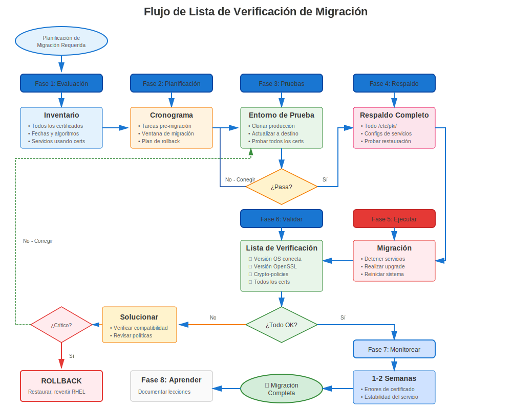

# Capítulo 34: Planificación y Preparación de Migración RHEL

> **Planificar para el Éxito:** Las migraciones de RHEL requieren planificación cuidadosa de certificados. Aprende cómo auditar, preparar y planificar la migración de certificados para evitar interrupciones.

---

## 34.1 Por Qué Importa la Planificación de Certificados



**Sin Planificación:**
```
❌ Actualizar RHEL → Los certificados fallan validación
❌ Los servicios no inician
❌ Interrupción de producción
❌ Rollback requerido
❌ Migración fallida
```

**Con Planificación:**
```
✅ Pre-auditoría identifica problemas
✅ Certificados preparados con anticipación
✅ Migración de prueba exitosa
✅ Migración de producción suave
✅ Sin interrupciones relacionadas con certificados
```

---

## 34.2 Auditoría de Certificados Pre-Migración

### Inventario Completo de Certificados

```bash
#!/bin/bash
# pre-migration-cert-audit.sh
# Auditoría completa de certificados antes de migración RHEL

echo "=== Auditoría de Certificados Pre-Migración ==="
echo "Sistema: $(hostname)"
echo "RHEL Actual: $(cat /etc/redhat-release)"
echo "Fecha: $(date)"
echo ""

# Encontrar todos los certificados
echo "=== Inventario de Certificados ==="
find /etc/pki/tls/certs/ /etc/httpd/ /etc/nginx/ /etc/postfix/ /etc/openldap/ \
  -name "*.crt" -o -name "*.pem" 2>/dev/null | \
  while read cert; do
    if openssl x509 -in "$cert" -noout 2>/dev/null; then
      echo "Certificado: $cert"
      echo "  Sujeto: $(openssl x509 -in "$cert" -noout -subject)"
      echo "  Emisor: $(openssl x509 -in "$cert" -noout -issuer)"
      echo "  Expira: $(openssl x509 -in "$cert" -noout -enddate | cut -d= -f2)"

      # Verificar algoritmo de firma
      SIG_ALG=$(openssl x509 -in "$cert" -noout -text | grep "Signature Algorithm" | head -2)
      echo "  Firma: $SIG_ALG"

      # Verificar tamaño de clave
      KEY_SIZE=$(openssl x509 -in "$cert" -noout -text | grep "Public-Key" | grep -oP '\d+')
      echo "  Tamaño Clave: $KEY_SIZE bits"

      # Marcar problemas
      if echo "$SIG_ALG" | grep -qi "sha1"; then
        echo "  ⚠️ ADVERTENCIA: Firma SHA-1 (fallará en RHEL 9+)"
      fi

      if [ "$KEY_SIZE" -lt 2048 ]; then
        echo "  ⚠️ ADVERTENCIA: Clave < 2048 bits (puede fallar en RHEL 8+)"
      fi

      if ! openssl x509 -in "$cert" -noout -ext subjectAltName 2>/dev/null | grep -q "DNS:"; then
        echo "  ⚠️ ADVERTENCIA: Certificato no tiene SAN"
      fi

      # Verificar expiración
      if ! openssl x509 -in "$cert" -noout -checkend $((86400*90)); then
        echo "  ⚠️ ADVERTENCIA: Expira dentro de 90 días"
      fi

      echo ""
    fi
  done

# Rastreo de certmonger
echo "=== Certificados Rastreados por certmonger ==="
if command -v getcert &>/dev/null; then
  sudo getcert list | grep -E "(Request ID|certificate:|status:)"
else
  echo "certmonger no instalado"
fi

# CAs personalizadas
echo ""
echo "=== CAs Personalizadas en Almacén de Confianza ==="
ls -la /etc/pki/ca-trust/source/anchors/

# Configuraciones de servicios
echo ""
echo "=== Configuraciones de Certificados de Servicio ==="
echo "Apache:"
grep -h "SSLCertificate" /etc/httpd/conf.d/*.conf 2>/dev/null | grep -v "^#"

echo ""
echo "NGINX:"
grep -rh "ssl_certificate" /etc/nginx/ 2>/dev/null | grep -v "^#"

echo ""
echo "Postfix:"
sudo postconf | grep -E "smtpd_tls_cert|smtp_tls_cert"

echo ""
echo "=== Auditoría Completa ==="
echo "¡Guarda esta salida para referencia de migración!"
```

---

## 34.3 Problemas de Certificados a Corregir Antes de Migración

### Correcciones Críticas Pre-Migración

**Corrección 1: Firmas SHA-1 (RHEL 8→9)**
```bash
# Encontrar certificados firmados con SHA-1
for cert in /etc/pki/tls/certs/*.crt; do
  if openssl x509 -in "$cert" -noout -text 2>/dev/null | \
     grep -qi "Signature Algorithm.*sha1"; then
    echo "⚠️ SHA-1: $cert"
  fi
done

# Acción: Reemitir TODOS los certificados SHA-1 antes de migrar a RHEL 9
```

**Corrección 2: Claves Pequeñas (< 2048 bits)**
```bash
# Encontrar claves pequeñas
for cert in /etc/pki/tls/certs/*.crt; do
  SIZE=$(openssl x509 -in "$cert" -noout -text 2>/dev/null | \
         grep "Public-Key" | grep -oP '\d+')
  if [ "$SIZE" -lt 2048 ] 2>/dev/null; then
    echo "⚠️ Clave pequeña ($SIZE): $cert"
  fi
done

# Acción: Reemitir con claves de 2048+ bits
```

**Corrección 3: SANs Faltantes**
```bash
# Encontrar certificados sin SANs
for cert in /etc/pki/tls/certs/*.crt; do
  if ! openssl x509 -in "$cert" -noout -ext subjectAltName 2>/dev/null | grep -q "DNS:"; then
    echo "⚠️ Sin SANs: $cert"
  fi
done

# Acción: Reemitir con SANs apropiados (requerido para navegadores modernos)
```

**Corrección 4: Expirando Pronto**
```bash
# Encontrar certificados expirando dentro de ventana de migración
for cert in /etc/pki/tls/certs/*.crt; do
  if ! openssl x509 -in "$cert" -noout -checkend $((86400*90)) 2>/dev/null; then
    echo "⚠️ Expirando pronto: $cert"
    openssl x509 -in "$cert" -noout -enddate
  fi
done

# Acción: Renovar antes de migración para evitar expiración durante migración
```

---

## 34.4 Estrategia de Respaldo

### Qué Respaldar

```bash
#============================================#
# RESPALDO DE CERTIFICADOS PRE-MIGRACIÓN
#============================================#

BACKUP_DIR="/var/backups/pre-migration-$(date +%Y%m%d)"
mkdir -p "$BACKUP_DIR"

# Respaldar certificados y claves
sudo tar czf "$BACKUP_DIR/certificates.tar.gz" \
  /etc/pki/tls/ \
  /etc/pki/ca-trust/source/anchors/ \
  /etc/pki/nssdb/

# Respaldar configuraciones de servicio
sudo tar czf "$BACKUP_DIR/service-configs.tar.gz" \
  /etc/httpd/conf.d/*.conf \
  /etc/nginx/nginx.conf \
  /etc/nginx/conf.d/ \
  /etc/postfix/main.cf \
  /etc/openldap/ \
  /var/lib/pgsql/data/postgresql.conf \
  /var/lib/pgsql/data/pg_hba.conf \
  2>/dev/null

# Respaldar base de datos certmonger
sudo tar czf "$BACKUP_DIR/certmonger.tar.gz" \
  /var/lib/certmonger/

# Guardar lista de certmonger
sudo getcert list > "$BACKUP_DIR/certmonger-list.txt" 2>/dev/null

# Guardar crypto-policy (RHEL 8+)
update-crypto-policies --show > "$BACKUP_DIR/crypto-policy.txt" 2>/dev/null

# Crear CSV de inventario
./pre-migration-cert-audit.sh > "$BACKUP_DIR/certificate-inventory.txt"

# Establecer permisos
sudo chmod 700 "$BACKUP_DIR"

echo "✅ Respaldo completo: $BACKUP_DIR"
ls -lh "$BACKUP_DIR"
```

---

## 34.5 Plan de Pruebas

### Configuración de Entorno de Prueba

```markdown
## Lista de Verificación de Pruebas de Migración

### Entorno de Prueba
- [ ] Clonar producción a VM/contenedor de prueba
- [ ] Misma versión RHEL que producción
- [ ] Mismos certificados (copias, ¡no originales!)
- [ ] Mismas configuraciones de servicio
- [ ] Red aislada de producción

### Migración de Prueba
- [ ] Ejecutar migración en sistema de prueba
- [ ] Verificar que todos los servicios inicien
- [ ] Probar validación de certificado
- [ ] Verificar crypto-policy (RHEL 7→8/9)
- [ ] Probar conexiones de cliente
- [ ] Verificar rastreo de certmonger (si se usa)
- [ ] Documentar cualquier problema

### Solución de Problemas
- [ ] Corregir problemas encontrados en prueba
- [ ] Actualizar plan de migración
- [ ] Re-probar
- [ ] Documentar soluciones alternativas

### Preparación para Producción
- [ ] Migración de prueba exitosa
- [ ] Problemas documentados y resueltos
- [ ] Plan de rollback listo
- [ ] Equipo capacitado
- [ ] Ventana de mantenimiento programada
```

---

## 34.6 Cronología de Migración

### Calendario de Migración de Ejemplo

```
Semana 1-2: Planificación y Auditoría
├─ Completar inventario de certificados
├─ Identificar problemas (SHA-1, claves pequeñas, etc.)
├─ Planificar remediación
└─ Configurar entorno de prueba

Semana 3-4: Remediación
├─ Reemitir certificados problemáticos
├─ Actualizar configuraciones
├─ Probar en entorno actual
└─ Verificar que automatización funciona

Semana 5-6: Pruebas
├─ Clonar producción a prueba
├─ Realizar migración de prueba
├─ Validar certificados post-migración
├─ Documentar problemas y soluciones
└─ Actualizar runbook de migración

Semana 7: Preparación Pre-Migración
├─ Auditoría final de certificados
├─ Renovar certificados expirando
├─ Completar respaldos
├─ Briefing al equipo
└─ Verificar plan de rollback

Semana 8: Migración
├─ Ventana de mantenimiento
├─ Ejecutar migración
├─ Validar certificados
├─ Monitorear por 24-48 horas
└─ Documentar lecciones aprendidas
```

---

## 34.7 Planificación de Rollback

### Procedimiento de Rollback de Certificados

```bash
#============================================#
# PLAN DE ROLLBACK DE CERTIFICADOS
#============================================#

# Si la migración falla debido a problemas de certificados:

# Paso 1: Rollback de RHEL (usando leapp o snapshots)
# Ver documentación de migración RHEL

# Paso 2: Restaurar certificados (si es necesario)
sudo tar xzf /var/backups/pre-migration-YYYYMMDD/certificates.tar.gz -C /

# Paso 3: Restaurar configuraciones de servicio
sudo tar xzf /var/backups/pre-migration-YYYYMMDD/service-configs.tar.gz -C /

# Paso 4: Restaurar certmonger
sudo tar xzf /var/backups/pre-migration-YYYYMMDD/certmonger.tar.gz -C /

# Paso 5: Reiniciar servicios
sudo systemctl restart httpd nginx postfix slapd

# Paso 6: Verificar
curl -v https://localhost/
sudo getcert list
```

---

## 34.8 Plan de Comunicación

### Plantilla de Comunicación a Stakeholders

```markdown
## Migración RHEL - Evaluación de Impacto en Certificados

### Detalles de Migración
- **De:** RHEL X.Y
- **A:** RHEL X.Y
- **Fecha:** YYYY-MM-DD
- **Ventana:** XX:00 - XX:00 UTC

### Análisis de Impacto en Certificados
- **Total Certificados:** XX
- **Certificados Requiriendo Acción:** XX
- **Servicios Afectados:** Apache, NGINX, Postfix, LDAP, etc.

### Acciones Pre-Migración Requeridas
- [ ] Reemitir XX certificados SHA-1
- [ ] Renovar XX certificados expirando
- [ ] Actualizar XX configuraciones de servicio
- [ ] Probar compatibilidad crypto-policy (RHEL 8+)

### Durante la Migración
- **Tiempo de Inactividad Esperado:** X horas
- **Validación de Certificados:** Post-migración
- **Plan de Rollback:** Disponible si es necesario

### Validación Post-Migración
- [ ] Todos los servicios inician exitosamente
- [ ] Validación de certificado funcionando
- [ ] crypto-policy aplicada (RHEL 8+)
- [ ] Rastreo de certmonger mantenido
- [ ] Conexiones de cliente exitosas

### Mitigación de Riesgos
- Respaldos completos completados
- Migración de prueba exitosa
- Procedimiento de rollback documentado
- Equipo en espera

### Contacto
- **Líder de Migración:** Nombre <email>
- **Escalación:** Gerente <email>
```

---

## 34.9 Lista de Verificación de Migración

### Lista de Verificación Completa Pre-Migración

```markdown
## Lista de Verificación Preparación para Migración de Certificados

### Auditoría e Inventario (Semana 1-3)
- [ ] Inventario completo de certificados
- [ ] Documentar todas las ubicaciones de certificados
- [ ] Identificar todos los servicios usando certificados
- [ ] Mapear dependencias de certificado a servicio
- [ ] Documentar CAs personalizadas en uso

### Identificación de Problemas (Semana 2-4)
- [ ] Identificar certificados firmados con SHA-1
- [ ] Identificar claves pequeñas (< 2048 bits)
- [ ] Identificar certificados sin SANs
- [ ] Identificar certificados expirando (< 180 días)
- [ ] Identificar configs TLS codificadas (vs crypto-policy)

### Remediación (Semana 3-6)
- [ ] Reemitir todos los certificados SHA-1
- [ ] Reemitir certificados de clave pequeña
- [ ] Agregar SANs a todos los certificados
- [ ] Renovar certificados expirando
- [ ] Eliminar configs TLS codificadas (preparar para crypto-policy)

### Pruebas (Semana 5-7)
- [ ] Configurar entorno de prueba
- [ ] Clonar certificados de producción a prueba
- [ ] Realizar migración de prueba
- [ ] Validar que todos los servicios inicien
- [ ] Probar conexiones de cliente
- [ ] Probar crypto-policy (RHEL 7→8/9)
- [ ] Documentar problemas encontrados
- [ ] Resolver problemas en prueba
- [ ] Re-probar hasta limpio

### Respaldo (Semana 7)
- [ ] Respaldo completo del sistema
- [ ] Respaldo específico de certificados
- [ ] Respaldo de configuración de servicio
- [ ] Respaldo de base de datos certmonger
- [ ] Probar procedimiento de restauración

### Documentación (Semana 7)
- [ ] Runbook de migración completo
- [ ] Procedimiento de rollback documentado
- [ ] Soluciones alternativas de problemas documentadas
- [ ] Equipo briefing realizado
- [ ] Stakeholders notificados

### Preparación Final (Día anterior)
- [ ] Verificar respaldos
- [ ] Verificar entorno de prueba
- [ ] Revisar runbook
- [ ] Confirmar ventana de mantenimiento
- [ ] Roles del equipo asignados
```

---

## 34.10 Conclusiones Clave

1. **Planificar con anticipación** - Comenzar 6-8 semanas antes de migración
2. **Auditar exhaustivamente** - Conocer cada certificado
3. **Corregir problemas temprano** - No esperar hasta el día de migración
4. **Probar extensivamente** - Múltiples ejecuciones de prueba
5. **Respaldar todo** - Certificados, configuraciones, DB certmonger
6. **Documentar claramente** - Runbook, rollback, problemas
7. **Comunicar proactivamente** - Mantener informados a stakeholders

---

## Tarjeta de Referencia Rápida

```
┌──────────────────────────────────────────────────────────────┐
│ REFERENCIA RÁPIDA PLANIFICACIÓN DE MIGRACIÓN                 │
├──────────────────────────────────────────────────────────────┤
│ Cronología:    6-8 semanas antes de migración                │
│                                                              │
│ Pre-auditoría: Encontrar todos los certificados              │
│                Verificar firmas (SHA-1 → SHA-256)            │
│                Verificar tamaños clave (< 2048 → 2048+)      │
│                Verificar SANs (faltantes → agregar)          │
│                Verificar expiración (< 180 días → renovar)   │
│                                                              │
│ Respaldo:      tar czf certs.tar.gz /etc/pki/tls/            │
│                getcert list > certmonger-list.txt            │
│                update-crypto-policies --show > policy.txt    │
│                                                              │
│ Probar:        Clonar a entorno de prueba                    │
│                Realizar migración de prueba                  │
│                Validar que certificados funcionan            │
│                Documentar y corregir problemas               │
└──────────────────────────────────────────────────────────────┘

⚠️ Certificados SHA-1 FALLARÁN en RHEL 9+
⚠️ crypto-policies introducidas en RHEL 8
✅ Probar múltiples veces antes de producción
```
---

**Navegación del Capítulo**

| [← Anterior: Capítulo 33 - Procedimientos de Emergencia](../part-05-troubleshooting/33-emergency-procedures.md) | [Siguiente: Capítulo 35 - Migración RHEL 7→8 →](35-rhel7-to-8.md) |
|:---|---:|
