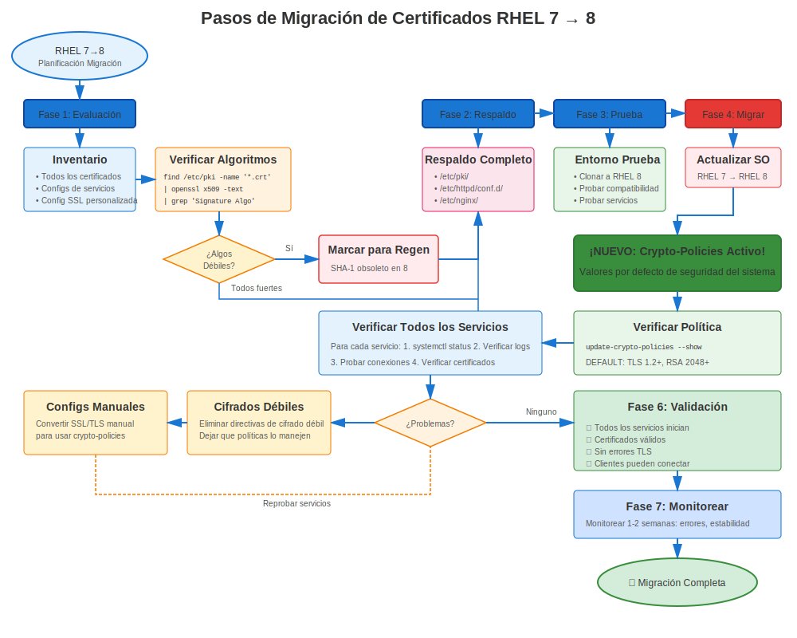

# Capítulo 35: Migración RHEL 7→8

> **Gran Salto:** Migrar de RHEL 7 a RHEL 8 introduce crypto-policies - un cambio revolucionario en la gestión de certificados. ¡Planifica cuidadosamente!

---

## 35.1 Impacto en Certificados: MODERADO-ALTO



### Qué Cambia

| Característica | RHEL 7 | RHEL 8 | Impacto |
|----------------|--------|--------|---------|
| **OpenSSL** | 1.0.2k | 1.1.1k | Moderado |
| **Versiones TLS** | 1.0/1.1/1.2 | 1.2/1.3 (DEFAULT) | **ALTO** |
| **Crypto-Policies** | Ninguna | **¡NUEVO!** | **ALTO** |
| **Cifrados Predeterminados** | Mixtos | Más Estrictos | Moderado |
| **certmonger** | Básico | Mejorado | Bajo |
| **Gestión** | Manual | Automatizada (crypto-policies) | **ALTO** |

**Cambio Clave:** **¡crypto-policies revolucionan la gestión TLS!**

---

## 35.2 Preparación Pre-Migración

### Tareas Específicas de Certificados Pre-Migración

```bash
#============================================#
# PREPARACIÓN DE CERTIFICADOS RHEL 7→8
#============================================#

# Tarea 1: Auditar todos los certificados (ver Cap 34)
./pre-migration-cert-audit.sh > rhel7-cert-audit.txt

# Tarea 2: Verificar dependencias TLS 1.0/1.1
# Revisar configuraciones de servicio
grep -r "TLSv1\|TLSv1.1" /etc/httpd/ /etc/nginx/ /etc/postfix/

# Tarea 3: Identificar configuraciones manuales de cifrado
# ¡Estas serán sobrescritas por crypto-policies!
grep -r "SSLCipherSuite\|ssl_ciphers\|smtp.*ciphers" /etc/httpd/ /etc/nginx/ /etc/postfix/

# Tarea 4: Probar compatibilidad TLS 1.2
# Asegurar que todos los clientes soporten TLS 1.2+

# Tarea 5: Respaldar todo
sudo tar czf rhel7-complete-backup-$(date +%Y%m%d).tar.gz \
  /etc/pki/ \
  /etc/httpd/ \
  /etc/nginx/ \
  /etc/postfix/ \
  /var/lib/certmonger/
```

---

## 35.3 Migración Usando leapp

### La Utilidad leapp

**IMPORTANTE:** Usa `leapp` para migración RHEL 7→8 (¡NO `redhat-upgrade-tool`!)

**leapp** es la utilidad de actualización soportada de Red Hat para RHEL 7→8 y 8→9.

```bash
#============================================#
# MIGRACIÓN RHEL 7→8 CON LEAPP
#============================================#

# Prerrequisitos
# - RHEL 7.9 (última versión)
# - Suscripción Red Hat válida
# - Todas las actualizaciones aplicadas
# - Respaldos completos

# Paso 1: Actualizar RHEL 7 a última versión
sudo yum update -y
sudo reboot

# Paso 2: Instalar leapp
sudo yum install leapp-upgrade -y

# Paso 3: Ejecutar verificación pre-actualización
sudo leapp preupgrade

# Revisar reporte:
cat /var/log/leapp/leapp-report.txt

# Inhibidores comunes relacionados con certificados:
# - Certificados SHA-1
# - Configuraciones de cifrado débiles
# - Paquetes no soportados

# Paso 4: Corregir problemas identificados
# Reemitir certificados SHA-1
# Actualizar configuraciones

# Paso 5: Realizar actualización
sudo leapp upgrade

# El sistema descarga RHEL 8, prepara actualización
# Reinicia automáticamente

# Paso 6: Después de reiniciar, ¡el sistema es RHEL 8!
cat /etc/redhat-release
# Red Hat Enterprise Linux release 8.X (Ootpa)
```

---

## 35.4 Validación de Certificados Post-Migración

### Verificaciones Inmediatas Post-Migración

```bash
#============================================#
# VALIDACIÓN DE CERTIFICADOS POST-MIGRACIÓN
#============================================#

# Verificación 1: Verificar RHEL 8
cat /etc/redhat-release
openssl version
# Debería mostrar: OpenSSL 1.1.1k

# Verificación 2: Verificar crypto-policy
update-crypto-policies --show
# DEFAULT (debería establecerse automáticamente)

# Verificación 3: Verificar que archivos de certificado aún estén presentes
ls -la /etc/pki/tls/certs/
ls -la /etc/pki/tls/private/

# Verificación 4: Verificar permisos sin cambios
ls -l /etc/pki/tls/private/*.key
# Aún debería ser 600

# Verificación 5: Verificar CAs personalizadas
ls -la /etc/pki/ca-trust/source/anchors/

# Verificación 6: Actualizar almacén de confianza (por si acaso)
sudo update-ca-trust

# Verificación 7: Verificar rastreo de certmonger
sudo getcert list
# Todos los certificados aún deberían estar rastreados

# Verificación 8: Verificar configuraciones de servicio
# crypto-policies pueden haberlas actualizado
cat /etc/crypto-policies/back-ends/httpd.config
```

---

## 35.5 Reinicio y Prueba de Servicios

### Reiniciar Todos los Servicios

```bash
#============================================#
# REINICIAR SERVICIOS DESPUÉS DE MIGRACIÓN
#============================================#

# Reiniciar servicios que usan certificados
sudo systemctl restart httpd
sudo systemctl restart nginx
sudo systemctl restart postfix
sudo systemctl restart slapd
sudo systemctl restart postgresql
sudo systemctl restart mariadb

# Verificar estado de servicios
systemctl status httpd nginx postfix | grep "Active:"

# Probar cada servicio
curl -v https://localhost/                             # Apache/NGINX
openssl s_client -connect localhost:443                # HTTPS
openssl s_client -starttls smtp -connect localhost:25  # Postfix
openssl s_client -connect localhost:636                # LDAPS
```

---

## 35.6 Problemas Comunes de Certificados RHEL 7→8

### Problema 1: Clientes TLS 1.0/1.1 No Pueden Conectar

**Síntoma:** Clientes antiguos fallan después de migración

**Causa:** Crypto-policy DEFAULT bloquea TLS 1.0/1.1

**Solución Rápida (Temporal):**
```bash
sudo update-crypto-policies --set LEGACY
sudo systemctl restart httpd nginx postfix
```

**Solución Apropiada:**
```bash
# Actualizar clientes para soportar TLS 1.2+
# O crear módulo de política personalizado
```

### Problema 2: Cifrados Codificados Conflictúan con crypto-policy

**Síntoma:** El servicio no inicia o se comporta inesperadamente

**Causa:** Configuración antigua tiene SSLCipherSuite que conflictúa

**Solución:**
```bash
# Eliminar configuraciones de cifrado codificadas
# Dejar que crypto-policy lo maneje

# Apache: Eliminar de ssl.conf
# SSLProtocol ...
# SSLCipherSuite ...

# NGINX: Eliminar de nginx.conf
# ssl_protocols ...
# ssl_ciphers ...

# Postfix: Eliminar de main.cf
# smtpd_tls_protocols ...
# smtpd_tls_mandatory_ciphers ...
```

### Problema 3: Rastreo de certmonger Perdido

**Síntoma:** `getcert list` muestra vacío o certificados faltantes

**Raro pero posible si la migración tuvo problemas**

**Solución:**
```bash
# Restaurar base de datos certmonger desde respaldo
sudo systemctl stop certmonger
sudo tar xzf /var/backups/pre-migration-*/certmonger.tar.gz -C /
sudo systemctl start certmonger

# Verificar
sudo getcert list
```

---

## 35.7 Transición de Crypto-Policy

### Adoptar Crypto-Policies

**RHEL 7:** Sin crypto-policies, configuración manual por servicio
**RHEL 8:** crypto-policies gestionan TLS en todo el sistema

```bash
#============================================#
# TRANSICIÓN A CRYPTO-POLICIES
#============================================#

# Después de migración a RHEL 8:

# Paso 1: Verificar política actual
update-crypto-policies --show
# DEFAULT

# Paso 2: Eliminar configuraciones TLS manuales de servicios
# (Dejar que crypto-policy lo maneje)

# Paso 3: Probar con política DEFAULT
sudo systemctl restart httpd nginx postfix

# Paso 4: Si clientes antiguos necesitan TLS 1.0/1.1 (¡temporal!)
sudo update-crypto-policies --set LEGACY

# Paso 5: Planificar volver a DEFAULT
# Actualizar clientes, luego:
sudo update-crypto-policies --set DEFAULT
```

---

## 35.8 Ejemplo de Runbook de Migración

### Ejecución Paso a Paso

```markdown
## Runbook Migración RHEL 7→8 - Sección Certificados

### Pre-Migración (T-24 horas)
- [ ] Verificar respaldos completos y probados
- [ ] Verificar todos los certificados válidos > 90 días
- [ ] Sin certificados SHA-1 restantes
- [ ] Migración de entorno de prueba exitosa

### Inicio de Ventana de Migración (T=0)
- [ ] Anunciar ventana de mantenimiento
- [ ] Tomar respaldo final
- [ ] Ejecutar: `sudo leapp upgrade`
- [ ] El sistema reinicia automáticamente

### Post-Reinicio (T+30 min)
- [ ] Verificar RHEL 8: `cat /etc/redhat-release`
- [ ] Verificar crypto-policy: `update-crypto-policies --show`
- [ ] Verificar certificados presentes: `ls /etc/pki/tls/certs/`
- [ ] Verificar certmonger: `sudo getcert list`

### Validación de Servicios (T+45 min)
- [ ] Reiniciar todos los servicios
- [ ] Probar Apache: `curl -v https://localhost/`
- [ ] Probar NGINX: `curl -v https://localhost:8443/`
- [ ] Probar Postfix: `openssl s_client -starttls smtp -connect localhost:25`
- [ ] Probar LDAP: `ldapsearch -H ldaps://localhost:636 -x -b ""`
- [ ] Probar bases de datos (si aplica)

### Pruebas de Cliente (T+60 min)
- [ ] Probar desde clientes Windows
- [ ] Probar desde clientes Linux
- [ ] Probar desde clientes de aplicación
- [ ] Verificar que no haya errores TLS

### Monitoreo (T+2 horas a T+48 horas)
- [ ] Monitorear logs para errores de certificados
- [ ] Monitorear salud de servicios
- [ ] Verificar renovaciones de certmonger
- [ ] Verificar que no haya problemas de crypto-policy

### Finalización
- [ ] Documentar cualquier problema encontrado
- [ ] Actualizar runbook con lecciones aprendidas
- [ ] Cerrar ventana de mantenimiento
- [ ] Notificar a stakeholders de migración exitosa
```

---

## 35.9 Conclusiones Clave

1. **Usar utilidad leapp** para migración RHEL 7→8 (método soportado)
2. **crypto-policies son NUEVAS** en RHEL 8 - ¡Cambio mayor!
3. **TLS 1.0/1.1 deshabilitado por defecto** - Probar compatibilidad de cliente
4. **Eliminar configuraciones TLS manuales** - Dejar que crypto-policy gestione
5. **Probar extensivamente** antes de migración de producción
6. **Política LEGACY disponible** para compatibilidad (¡temporal!)
7. **Rastreo de certmonger debería sobrevivir** migración

---

## Tarjeta de Referencia Rápida

```
┌──────────────────────────────────────────────────────────────────────┐
│ LISTA DE VERIFICACIÓN CERTIFICADOS MIGRACIÓN RHEL 7→8                │
├──────────────────────────────────────────────────────────────────────┤
│ Antes:                 Auditar todos los certificados                │
│                        Reemitir certificados SHA-1                   │
│                        Probar compatibilidad TLS 1.2                 │
│                        Respaldar todo                                │
│                                                                      │
│ Migración:             Usar leapp upgrade (¡NO redhat-upgrade-tool!) │
│                        El sistema reinicia automáticamente           │
│                                                                      │
│ Después:               Verificar RHEL 8                              │
│                        Verificar crypto-policy (DEFAULT)             │
│                        Reiniciar todos los servicios                 │
│                        Probar conexiones de cliente                  │
│                        Monitorear por 48 horas                       │
│                                                                      │
│ Nueva Característica:  crypto-policies (control TLS sistema)         │
│ Bloqueado:             TLS 1.0/1.1 (en política DEFAULT)             │
│ Fallback:              Política LEGACY (si necesario, ¡temporal!)    │
└──────────────────────────────────────────────────────────────────────┘

✅ Usar leapp (oficialmente soportado)
⚠️ Cambio mayor: crypto-policies introducidas
⚠️ Probar soporte TLS 1.2 de cliente antes de migración
```

---

## 🧪 Laboratorio Práctico

**Lab 17: Migración RHEL 7→8**

Migre certificados durante actualización del SO a RHEL 8

- 📁 **Ubicación:** `labs/es_ES/17-rhel7to8-migration/`
- ⏱️ **Tiempo:** 40-50 minutos
- 🎯 **Nivel:** Avanzado

---

**Navegación del Capítulo**

| [← Anterior: Capítulo 34 - Planificación y Preparación de Migración RHEL](34-migration-planning.md) | [Siguiente: Capítulo 36 - Migración RHEL 8→9 →](36-rhel8-to-9.md) |
|:---|---:|
