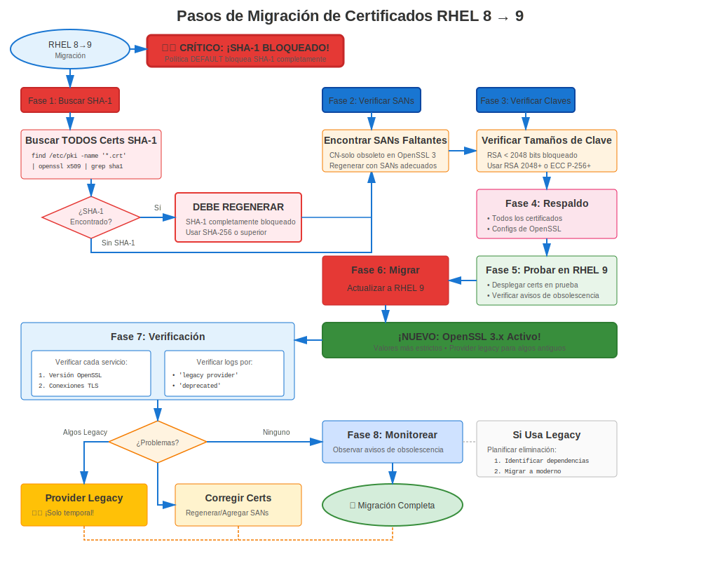

# Capítulo 36: Migración RHEL 8→9

> **Transición OpenSSL 3.x:** RHEL 8→9 trae OpenSSL 3.x con arquitectura de proveedores y validación más estricta. ¡Planifica cuidadosamente este cambio significativo!

---

## 36.1 Impacto en Certificados: ALTO



### Qué Cambia

| Característica | RHEL 8 | RHEL 9 | Impacto |
|----------------|--------|--------|---------|
| **OpenSSL** | 1.1.1k | **3.5.5** | **ALTO** |
| **Arquitectura** | Tradicional | **Basada en proveedores** | **ALTO** |
| **TLS 1.0/1.1** | Política LEGACY | **Completamente eliminado** | **ALTO** |
| **SHA-1** | Obsoleto | **Bloqueado** | **ALTO** |
| **Validación** | Estándar | **Más Estricta** | Moderado |
| **Crypto-Policies** | Básicas | **Subpolíticas** | Bajo |
| **certmonger** | Mejorado | **Soporte ACME** | Bajo |

**Cambio Clave:** **¡OpenSSL 3.x es un cambio arquitectónico mayor!**

---

## 36.2 Requisitos Pre-Migración

### Correcciones Críticas de Certificados

**Requisito 1: NO Firmas SHA-1**
```bash
#============================================#
# VERIFICAR SHA-1 (¡FALLARÁ EN RHEL 9!)
#============================================#

# Encontrar certificados firmados con SHA-1
for cert in /etc/pki/tls/certs/*.crt; do
  SIG=$(openssl x509 -in "$cert" -noout -text 2>/dev/null | \
        grep "Signature Algorithm" | head -2)
  if echo "$SIG" | grep -qi "sha1"; then
    echo "🚨 CRÍTICO: Firma SHA-1: $cert"
    echo "   $SIG"
    echo "   ⚠️ ¡DEBE reemitirse antes de migración a RHEL 9!"
  fi
done

# Acción: Reemitir TODOS los certificados SHA-1 antes de migración
# Sin excepciones - FALLARÁN en RHEL 9
```

**Requisito 2: Todos los Certificados Válidos**
```bash
# Asegurar que no haya certificados expirados
for cert in /etc/pki/tls/certs/*.crt; do
  if ! openssl x509 -in "$cert" -noout -checkend 0 2>/dev/null; then
    echo "❌ Expirado: $cert"
  fi
done
```

**Requisito 3: Probar Aplicaciones Personalizadas**
```bash
# Si tienes aplicaciones personalizadas usando OpenSSL
# Pueden necesitar actualizaciones para API de OpenSSL 3.x
rpm -qa | grep -E "custom|local"

# Probar estas aplicaciones en entorno RHEL 9 antes de migración
```

---

## 36.3 Migración Usando leapp

### Proceso de Actualización RHEL 8→9

```bash
#============================================#
# MIGRACIÓN RHEL 8→9 CON LEAPP
#============================================#

# Prerrequisitos
# - RHEL 8.10 (última versión recomendada)
# - Suscripción válida
# - Todas las actualizaciones aplicadas
# - Respaldos completos
# - ¡Certificados SHA-1 reemitidos!

# Paso 1: Actualizar RHEL 8 completamente
sudo dnf update -y
sudo reboot

# Paso 2: Instalar leapp
sudo dnf install leapp-upgrade -y

# Paso 3: Ejecutar verificación pre-actualización
sudo leapp preupgrade

# Revisar reporte
cat /var/log/leapp/leapp-report.txt

# Verificaciones relacionadas con certificados:
# - Advertencias de certificados SHA-1
# - Compatibilidad OpenSSL
# - Compatibilidad de app personalizada

# Paso 4: Abordar inhibidores
# Corregir cualquier problema bloqueante

# Paso 5: Realizar actualización
sudo leapp upgrade

# Descarga RHEL 9, prepara actualización
# Reinicia para realizar actualización
# Reinicia nuevamente en RHEL 9

# Paso 6: Verificar RHEL 9
cat /etc/redhat-release
# Red Hat Enterprise Linux release 9.X (Plow)

openssl version
# OpenSSL 3.5.5
```

---

## 36.4 Validación Post-Migración

### Validación Específica de Certificados

```bash
#============================================#
# VALIDACIÓN DE CERTIFICADOS POST-MIGRACIÓN (RHEL 9)
#============================================#

# Verificación 1: Versión de OpenSSL
openssl version
# OpenSSL 3.5.5  ← Confirmar

# Verificación 2: Verificar proveedores
openssl list -providers
# Debería mostrar: default, fips, legacy, base

# Verificación 3: Verificar que certificados aún estén presentes
ls -la /etc/pki/tls/certs/
ls -la /etc/pki/tls/private/

# Verificación 4: Probar validación de certificado
for cert in /etc/pki/tls/certs/*.crt; do
  openssl verify "$cert" 2>&1 | grep -v "OK" && echo "Problema: $cert"
done

# Verificación 5: Verificar crypto-policy
update-crypto-policies --show
# DEFAULT (debería mantenerse)

# Verificación 6: Probar operaciones de certificado
openssl x509 -in /etc/pki/tls/certs/server.crt -noout -text

# Verificación 7: Verificar rastreo de certmonger
sudo getcert list
# Todos los certificados aún deberían estar rastreados

# Verificación 8: Verificar almacén de confianza
trust list | head -20
```

---

## 36.5 Validación de Servicios

### Probar Todos los Servicios

```bash
#============================================#
# VALIDACIÓN DE SERVICIOS POST-MIGRACIÓN
#============================================#

# Reiniciar servicios
sudo systemctl restart httpd nginx postfix slapd postgresql mariadb 2>/dev/null

# Probar cada servicio
echo "Probando Apache..."
curl -v https://localhost/ 2>&1 | grep -E "(SSL connection|subject:)"

echo "Probando con OpenSSL 3.x..."
openssl s_client -connect localhost:443 -tls1_3

echo "Probando Postfix..."
openssl s_client -starttls smtp -connect localhost:25 </dev/null

echo "Probando LDAPS..."
openssl s_client -connect localhost:636 </dev/null

# Verificar errores de proveedor
sudo journalctl --since "1 hour ago" | grep -i "provider\|unsupported"
```

---

## 36.6 Problemas Comunes RHEL 8→9

### Problema 1: Certificados SHA-1 Rechazados

**Síntoma:**
```
openssl verify server.crt
# error 3 at 0 depth lookup: CA md too weak
```

**Causa:** El certificado tiene firma SHA-1 (bloqueada en RHEL 9)

**Solución:**
```bash
# SIN SOLUCIÓN ALTERNATIVA - Debe reemitirse
# ¡Esto debería haberse hecho pre-migración!

# Emergencia: Reemitir inmediatamente
openssl req -new -key server.key -out server.csr -sha256
# Enviar a CA, instalar nuevo certificado
```

### Problema 2: Errores de Algoritmo Legacy

**Síntoma:**
```
openssl md5 file.txt
# Error: unsupported
```

**Causa:** MD5 y otros algoritmos legacy requieren proveedor explícito

**Solución:**
```bash
# Usar proveedor legacy
openssl md5 -provider legacy file.txt

# Mejor: Actualizar para usar SHA-256
openssl sha256 file.txt
```

### Problema 3: Incompatibilidad OpenSSL 3.x en Aplicación Personalizada

**Síntoma:** La aplicación personalizada falla con errores OpenSSL

**Causa:** Aplicación compilada contra OpenSSL 1.1.1, API cambió en 3.x

**Solución:**
```bash
# Recompilar aplicación contra OpenSSL 3.x
# O actualizar código de aplicación para nueva API

# Solución alternativa temporal (si está disponible):
# Usar biblioteca compat (si se proporciona)
```

---

## 36.7 Consideraciones de crypto-policy

### Crypto-Policy Después de Migración

```bash
#============================================#
# CRYPTO-POLICY POST-MIGRACIÓN
#============================================#

# Verificar política actual (debería mantenerse)
update-crypto-policies --show

# ¡RHEL 9 soporta subpolíticas!
# Ejemplo: Deshabilitar completamente SHA-1
sudo update-crypto-policies --set DEFAULT:NO-SHA1

# Listar módulos disponibles
ls /usr/share/crypto-policies/policies/modules/

# Probar política
sudo systemctl restart httpd
curl -v https://localhost/
```

---

## 36.8 certmonger Después de Migración

### Verificar Funcionalidad de certmonger

```bash
#============================================#
# CERTMONGER POST-MIGRACIÓN
#============================================#

# Verificar estado de certmonger
systemctl status certmonger

# Listar certificados rastreados
sudo getcert list

# Verificar problemas
sudo getcert list | grep "status:" | grep -v "MONITORING"

# Si usas FreeIPA, probar conectividad
ipa ping

# Forzar prueba de renovación
sudo ipa-getcert resubmit -f /etc/pki/tls/certs/test.crt

# RHEL 9 NUEVO: Soporte ACME disponible
# ¡Ahora puede usar certmonger con Let's Encrypt nativamente!
```

---

## 36.9 Runbook de Migración

### Runbook Enfocado en Certificados

```markdown
## Migración RHEL 8→9 - Sección Certificados

### Pre-Migración (T-24 horas)
- [ ] Verificar SIN certificados SHA-1 (¡crítico!)
- [ ] Todos los certificados válidos > 90 días
- [ ] Respaldos completos y probados
- [ ] Migración de prueba exitosa
- [ ] Apps personalizadas probadas en RHEL 9

### Inicio de Ventana de Migración (T=0)
- [ ] Respaldo final
- [ ] Ejecutar: `sudo leapp upgrade`
- [ ] Sistema reinicia (dos veces)

### Validación Post-Reinicio (T+45 min)
- [ ] Verificar RHEL 9: `cat /etc/redhat-release`
- [ ] Verificar OpenSSL 3.5.5: `openssl version`
- [ ] Verificar proveedores: `openssl list -providers`
- [ ] Verificar certificados: `ls /etc/pki/tls/certs/`
- [ ] Verificar crypto-policy: `update-crypto-policies --show`
- [ ] Verificar certmonger: `sudo getcert list`

### Reinicio de Servicios (T+60 min)
- [ ] Reiniciar todos los servicios que usan certificados
- [ ] Probar Apache/NGINX
- [ ] Probar Postfix
- [ ] Probar LDAP
- [ ] Probar bases de datos

### Validación de Certificados (T+90 min)
- [ ] Sin rechazos SHA-1
- [ ] Todos los certificados validan: `openssl verify`
- [ ] TLS 1.3 funcionando: `openssl s_client -tls1_3`
- [ ] Sin errores de proveedor en logs
- [ ] Estado certmonger todo MONITORING

### Pruebas de Cliente (T+2 horas)
- [ ] Probar desde todos los tipos de cliente
- [ ] Verificar que no haya problemas de compatibilidad
- [ ] Verificar funcionalidad de aplicación

### Post-Migración (24-48 horas)
- [ ] Monitorear problemas OpenSSL 3.x
- [ ] Verificar renovaciones de certmonger
- [ ] Monitorear logs de servicio
- [ ] Documentar cualquier problema
```

---

## 36.10 Conclusiones Clave

1. **OpenSSL 3.x es cambio mayor** - La arquitectura de proveedores es nueva
2. **SHA-1 DEBE eliminarse** antes de migración - ¡Sin excepciones!
3. **Usar leapp para migración** (oficialmente soportado)
4. **Probar aplicaciones personalizadas** en RHEL 9 primero
5. **Validación más estricta** captura más problemas (¡bueno para seguridad!)
6. **certmonger gana soporte ACME** en RHEL 9
7. **Subpolíticas disponibles** para ajuste fino

---

## Tarjeta de Referencia Rápida

```
┌──────────────────────────────────────────────────────────────────┐
│ LISTA DE VERIFICACIÓN CERTIFICADOS MIGRACIÓN RHEL 8→9            │
├──────────────────────────────────────────────────────────────────┤
│ CRÍTICO:    ¡SIN certificados SHA-1! (serán rechazados)          │
│             Reemitir todos los certs SHA-1 antes de migración    │
│                                                                  │
│ Antes:      Verificar SIN firmas SHA-1                           │
│             Probar apps personalizadas en RHEL 9                 │
│             Respaldar todo                                       │
│                                                                  │
│ Migración:  Usar leapp upgrade                                   │
│             El sistema reinicia dos veces                        │
│                                                                  │
│ Después:    Verificar OpenSSL 3.5.5                              │
│             Verificar proveedores: openssl list -providers       │
│             Probar algoritmos legacy necesitan -provider legacy  │
│             Reiniciar todos los servicios                        │
│             Verificar rastreo certmonger mantenido               │
│                                                                  │
│ Nuevo:      Arquitectura de proveedores                          │
│             Subpolíticas (DEFAULT:NO-SHA1)                       │
│             Soporte ACME de certmonger                           │
└──────────────────────────────────────────────────────────────────┘

🚨 SHA-1 está BLOQUEADO - ¡reemitir antes de migración!
✅ OpenSSL 3.x trae seguridad más estricta
✅ certmonger funciona con Let's Encrypt nativamente
```

---

## 🧪 Laboratorio Práctico

**Lab 18: Migración RHEL 8→9**

Maneje OpenSSL 3.x y seguridad más estricta en RHEL 9

- 📁 **Ubicación:** `labs/es_ES/18-rhel8to9-migration/`
- ⏱️ **Tiempo:** 40-50 minutos
- 🎯 **Nivel:** Avanzado

---

**Navegación del Capítulo**

| [← Anterior: Capítulo 35 - Migración RHEL 7→8](35-rhel7-to-8.md) | [Siguiente: Capítulo 37 - Solución de Problemas y Recuperación de Migración →](37-migration-troubleshooting.md) |
|:---|---:|
