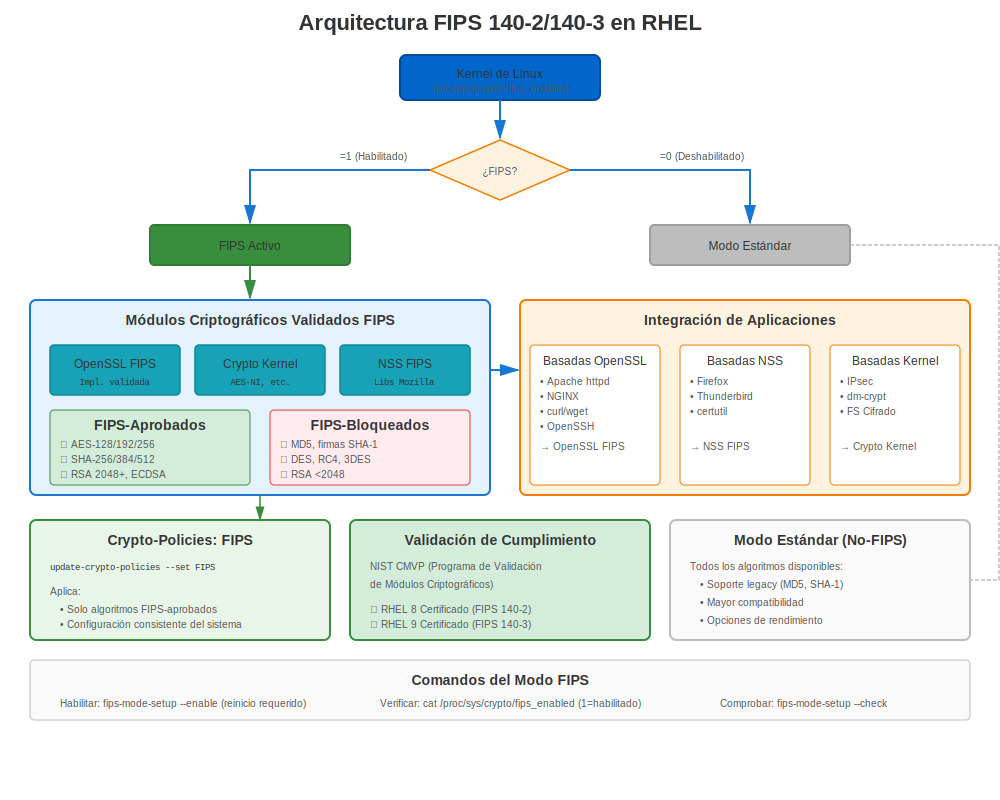
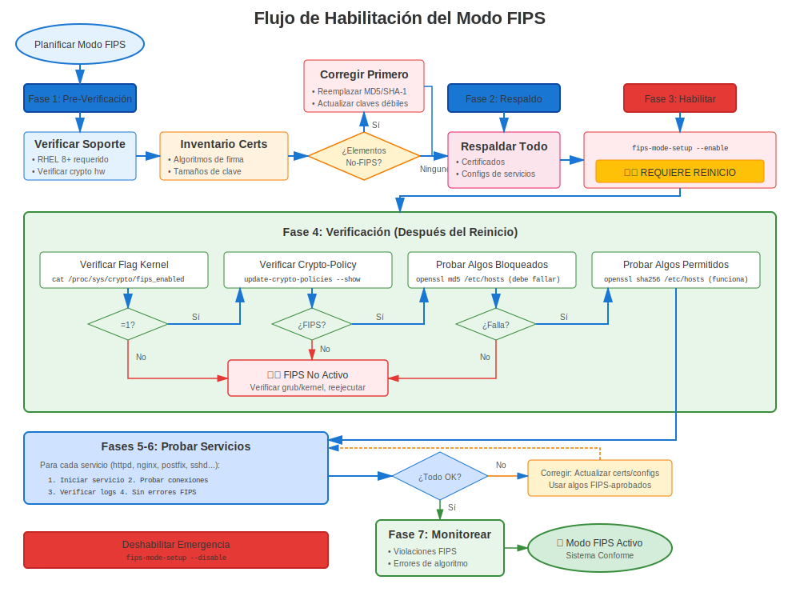

# Capítulo 38: Guía Completa del Modo FIPS

> **Cumplimiento Federal:** El cumplimiento FIPS 140-2/140-3 es requerido para sistemas federales de EE.UU. y muchas industrias reguladas. Aprende cómo habilitar y gestionar el modo FIPS en RHEL.

---

## 38.1 ¿Qué es FIPS?





**FIPS** = Federal Information Processing Standards (Estándares Federales de Procesamiento de Información)

**FIPS 140-2/140-3** = Programa de Validación de Módulos Criptográficos

**Propósito:**
- ✅ Validar que módulos criptográficos cumplan requisitos de seguridad
- ✅ Asegurar implementación apropiada de algoritmos aprobados
- ✅ Requerido para sistemas del gobierno federal de EE.UU.
- ✅ A menudo requerido para: Banca, salud, contratistas de defensa

### Estado de Validación FIPS por Versión RHEL

| Versión RHEL | Estado FIPS | Estándar | Notas |
|--------------|-------------|----------|-------|
| **RHEL 7** | Validado | **FIPS 140-2** | Módulos OpenSSL 1.0.2 validados |
| **RHEL 8** | Validado | **FIPS 140-2** | OpenSSL 1.1.1, NSS, libgcrypt validados |
| **RHEL 9** | Validado | **FIPS 140-2** | Proveedor OpenSSL 3.x, transición a 140-3 en progreso |
| **RHEL 10** | En proceso | **FIPS 140-2/140-3** | Transición en curso, verificar estado actual |

> **Importante:** A partir de 2025, RHEL 9 usa módulos validados FIPS 140-2. La transición a FIPS 140-3 está en progreso pero aún no completa. Siempre verifica el estado actual de validación en https://csrc.nist.gov/projects/cryptographic-module-validation-program

---

## 38.2 Habilitar Modo FIPS

### FIPS en Tiempo de Instalación (Recomendado)

**Mejor Práctica:** Habilitar FIPS durante instalación de RHEL

```bash
# En el prompt de arranque de instalación, agregar:
fips=1

# El sistema se instala en modo FIPS desde el inicio
# Todas las operaciones criptográficas son conformes a FIPS desde arranque
```

**Por Qué Tiempo de Instalación es Mejor:**
- Kernel configurado apropiadamente
- Todos los paquetes instalados en modo FIPS
- No se necesita migración post-instalación
- Estado FIPS más limpio

### FIPS Post-Instalación (RHEL 8/9/10)

```bash
#============================================#
# HABILITAR MODO FIPS POST-INSTALACIÓN
#============================================#

# Verificar estado FIPS actual
fips-mode-setup --check
# FIPS mode is disabled.

# Habilitar modo FIPS
sudo fips-mode-setup --enable

# La salida muestra qué cambiará:
# - Parámetros de arranque del kernel
# - Crypto policy
# - Reconfiguración del sistema

# ¡SE DEBE REINICIAR!
sudo reboot

# Después de reiniciar, verificar
fips-mode-setup --check
# FIPS mode is enabled.

# Verificar crypto-policy
update-crypto-policies --show
# FIPS

# Verificar proveedor FIPS cargado (RHEL 9+)
openssl list -providers | grep fips
#   fips
#     name: OpenSSL FIPS Provider
#     version: 3.5.5
#     status: active
```

---

## 38.3 Requisitos FIPS para Certificados

### Algoritmos Aprobados

**Aprobados por FIPS para Certificados:**
```
✅ RSA: 2048, 3072, 4096 bits
✅ ECC: P-256 (secp256r1), P-384 (secp384r1), P-521 (secp521r1)
✅ Firmas: SHA-256, SHA-384, SHA-512
✅ TLS: Solo 1.2, 1.3
```

**Bloqueados en Modo FIPS:**
```
❌ RSA < 2048 bits
❌ MD5, SHA-1
❌ TLS 1.0, 1.1
❌ 3DES, RC4, DES
❌ Claves DSA
❌ Curvas elípticas no aprobadas
```

---

## 38.4 Generar Certificados Conformes a FIPS

### Generación de Claves Conformes a FIPS

```bash
#============================================#
# GENERAR CLAVES CONFORMES A FIPS
#============================================#

# Verificar modo FIPS habilitado
fips-mode-setup --check

# Generar clave RSA 2048 (conforme a FIPS)
openssl genpkey -algorithm RSA -out fips-server.key \
  -pkeyopt rsa_keygen_bits:2048

# RSA 3072 (más fuerte, aún conforme a FIPS)
openssl genpkey -algorithm RSA -out fips-server.key \
  -pkeyopt rsa_keygen_bits:3072

# EC P-256 (curva aprobada por FIPS)
openssl genpkey -algorithm EC -out fips-ec.key \
  -pkeyopt ec_paramgen_curve:P-256

# EC P-384 (más fuerte, aprobada por FIPS)
openssl genpkey -algorithm EC -out fips-ec.key \
  -pkeyopt ec_paramgen_curve:P-384

# Verificar clave generada en modo FIPS
openssl pkey -in fips-server.key -check
```

### CSR Conforme a FIPS

```bash
#============================================#
# GENERAR CSR CONFORME A FIPS
#============================================#

# CSR con SHA-256 (aprobado por FIPS)
openssl req -new -key fips-server.key -out fips-server.csr \
  -sha256 \
  -subj "/C=US/O=Federal Agency/CN=secure.example.gov" \
  -addext "subjectAltName=DNS:secure.example.gov"

# SHA-384 (más fuerte, aprobado por FIPS)
openssl req -new -key fips-server.key -out fips-server.csr \
  -sha384 \
  -subj "/C=US/O=Federal Agency/CN=secure.example.gov"

# ❌ NUNCA usar SHA-1 o MD5 en modo FIPS
# ¡Serán rechazados!
```

---

## 38.5 Verificación del Modo FIPS

### Verificación Completa de FIPS

```bash
#============================================#
# VERIFICAR QUE MODO FIPS ESTÁ ACTIVO
#============================================#

# Verificación 1: fips-mode-setup
fips-mode-setup --check
# FIPS mode is enabled.

# Verificación 2: Parámetro del kernel
cat /proc/cmdline | grep fips
# Debería mostrar: fips=1

# Verificación 3: Crypto-policy
update-crypto-policies --show
# FIPS

# Verificación 4: Proveedor FIPS de OpenSSL (RHEL 9+)
openssl list -providers
# Debería mostrar proveedor fips como activo

# Verificación 5: Probar operación solo-FIPS
# Intentar algoritmo no-FIPS (debería fallar)
echo "test" | openssl md5
# Error: disabled for FIPS  ← ¡Bueno!

# Verificación 6: Verificar que operaciones de certificado usan FIPS
openssl version -a | grep FIPS
```

---

## 38.6 Crypto-Policy FIPS

### Entender Política FIPS

```bash
#============================================#
# DETALLES DE CRYPTO-POLICY FIPS
#============================================#

# La política se establece automáticamente a FIPS cuando se habilita modo FIPS
update-crypto-policies --show
# FIPS

# Qué fuerza la política FIPS:
cat /etc/crypto-policies/back-ends/opensslcnf.config

# Ajustes clave:
# - TLS 1.2 mínimo
# - Solo cifrados aprobados por FIPS
# - Solo algoritmos de firma aprobados por FIPS
# - Claves mínimo 2048 bits
```

**¡No se puede cambiar de política FIPS mientras está en modo FIPS!**

---

## 38.7 Servicios en Modo FIPS

### Apache en Modo FIPS

```bash
#============================================#
# APACHE EN MODO FIPS
#============================================#

# Apache usa automáticamente política FIPS
# ¡No se necesita configuración manual!

# Verificar
sudo systemctl restart httpd

# Probar
openssl s_client -connect localhost:443

# Debería mostrar:
# - TLS 1.2 o 1.3
# - Cifrado aprobado por FIPS
# - Sin algoritmos débiles

# Ver configuración FIPS real de Apache
cat /etc/crypto-policies/back-ends/httpd.config
```

### Otros Servicios

**Todos los servicios cumplen automáticamente con política FIPS:**
- NGINX → Usa cifrados/protocolos FIPS
- Postfix → TLS conforme a FIPS
- OpenSSH → Solo algoritmos FIPS
- Bases de datos → SSL aprobado por FIPS

---

## 38.8 Problemas Comunes de FIPS

### Problema 1: Algoritmo No-FIPS Intentado

**Síntoma:**
```
Error: disabled for FIPS
```

**Ejemplos:**
```bash
# MD5 (no aprobado por FIPS)
openssl md5 file.txt
# Error: digital envelope routines:EVP_DigestInit_ex:disabled for fips

# Firma SHA-1 (no aprobada por FIPS para firmar)
openssl dgst -sha1 -sign key.pem file.txt
# Error: disabled for fips
```

**Solución:**
```bash
# Usar algoritmos aprobados por FIPS
openssl sha256 file.txt  # Usar SHA-256 en lugar de MD5
openssl dgst -sha256 -sign key.pem file.txt  # Usar SHA-256 para firmar
```

### Problema 2: Aplicación Legacy Incompatible

**Síntoma:** La aplicación falla en modo FIPS

**Causa:** La aplicación usa algoritmos no-FIPS (MD5, SHA-1, cifrados débiles)

**Soluciones:**
```bash
# Solución 1: Actualizar aplicación para usar algoritmos FIPS

# Solución 2: Si la aplicación no puede actualizarse:
# Puede no poder ejecutarse en modo FIPS
# Considerar si FIPS es realmente requerido

# Solución 3: Aislamiento de contenedor (avanzado)
# Ejecutar app no-FIPS en contenedor sin FIPS
```

---

## 38.9 Deshabilitar Modo FIPS

### Cuándo y Cómo Deshabilitar

```bash
#============================================#
# DESHABILITAR MODO FIPS (si es necesario)
#============================================#

# Verificar estado actual
fips-mode-setup --check

# Deshabilitar FIPS
sudo fips-mode-setup --disable

# SE DEBE REINICIAR
sudo reboot

# Después de reiniciar
fips-mode-setup --check
# FIPS mode is disabled.

# Crypto-policy revierte a DEFAULT
update-crypto-policies --show
# DEFAULT
```

**Nota:** ¡Deshabilitar FIPS puede tener implicaciones de cumplimiento!

---

## 38.10 Conclusiones Clave

1. **FIPS 140-2 es el estándar actual** en RHEL (transición 140-3 en progreso)
2. **Habilitar en instalación** para estado FIPS más limpio
3. **Habilitación post-instalación requiere reinicio**
4. **Solo algoritmos aprobados por FIPS** permitidos
5. **Crypto-policy automáticamente establecida a FIPS**
6. **Los servicios cumplen automáticamente**
7. **Probar aplicaciones** antes de habilitar FIPS en producción

---

## Tarjeta de Referencia Rápida

```
┌──────────────────────────────────────────────────────────────┐
│ REFERENCIA RÁPIDA MODO FIPS                                  │
├──────────────────────────────────────────────────────────────┤
│ Estado:       fips-mode-setup --check                        │
│ Habilitar:    sudo fips-mode-setup --enable && reboot        │
│ Deshabilitar: sudo fips-mode-setup --disable && reboot       │
│                                                              │
│ Estándar:     FIPS 140-2 (validado)                          │
│               FIPS 140-3 (transición en progreso)            │
│                                                              │
│ Aprobados:    RSA 2048+, ECC P-256/384/521                   │
│               SHA-256/384/512                                │
│               TLS 1.2/1.3                                    │
│                                                              │
│ Bloqueados:   MD5, SHA-1, TLS 1.0/1.1                        │
│               RSA < 2048, 3DES, RC4                          │
│                                                              │
│ Política:     Automáticamente establecida a FIPS             │
│ Verificar:    openssl list -providers | grep fips            │
└──────────────────────────────────────────────────────────────┘

⚠️ FIPS 140-2 es actual (transición 140-3 en curso)
⚠️ Requiere reinicio para habilitar/deshabilitar
✅ Todos los servicios RHEL cumplen automáticamente
```

---

## 🧪 Laboratorio Práctico

**Lab 19: Configuración del Modo FIPS**

Habilita y configura modo de cumplimiento FIPS 140-2

- 📁 **Ubicación:** `labs/es_ES/19-fips-mode/`
- ⏱️ **Tiempo:** 40-50 minutos
- 🎯 **Nivel:** Avanzado

---

**Navegación del Capítulo**

| [← Anterior: Capítulo 37 - Solución de Problemas y Recuperación de Migración](../part-06-migration/37-migration-troubleshooting.md) | [Siguiente: Capítulo 39 - Certificados Compatibles con FIPS →](39-fips-certificates.md) |
|:---|---:|
