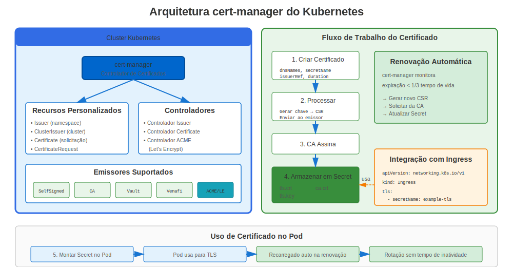
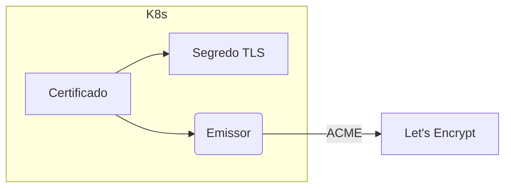

# Apêndice A: cert-manager do Kubernetes

`cert-manager` é um projeto CNCF que automatiza emissão de certificados dentro de clusters Kubernetes.

## 1. Arquitetura



* **Emissor / EmissorCluster** – Define CA ou servidor ACME.
* **Certificado** – Estado desejado para um cert (nomes DNS, duração).
* **Controlador** – Reconcilia recursos, armazena segredos.



## 2. Instalação

```bash
kubectl apply -f https://github.com/cert-manager/cert-manager/releases/download/v1.14.1/cert-manager.yaml
```

## 3. Exemplo: TLS Ingress

```yaml
apiVersion: cert-manager.io/v1
kind: ClusterIssuer
metadata:
  name: letsencrypt-prod
spec:
  acme:
    server: https://acme-v02.api.letsencrypt.org/directory
    email: admin@example.com
    privateKeySecretRef:
      name: le-key
    solvers:
    - http01:
        ingress:
          class: nginx
---
apiVersion: cert-manager.io/v1
kind: Certificate
metadata:
  name: web-tls
  namespace: default
spec:
  secretName: web-tls
  issuerRef:
    name: letsencrypt-prod
    kind: ClusterIssuer
  commonName: example.com
  dnsNames:
  - example.com
  - www.example.com
```

## 4. Renovação e Status

`kubectl describe certificate web-tls` mostra condição Ready e próximo tempo de renovação.


---

## 🧪 Laboratório Prático

**Lab 21: cert-manager do Kubernetes**

Automatize gerenciamento de certificados no Kubernetes

- 📁 **Localização:** `labs/pt_BR/21-kubernetes-cert-manager/`
- ⏱️ **Tempo:** 50-60 minutos
- 🎯 **Nível:** Avançado
