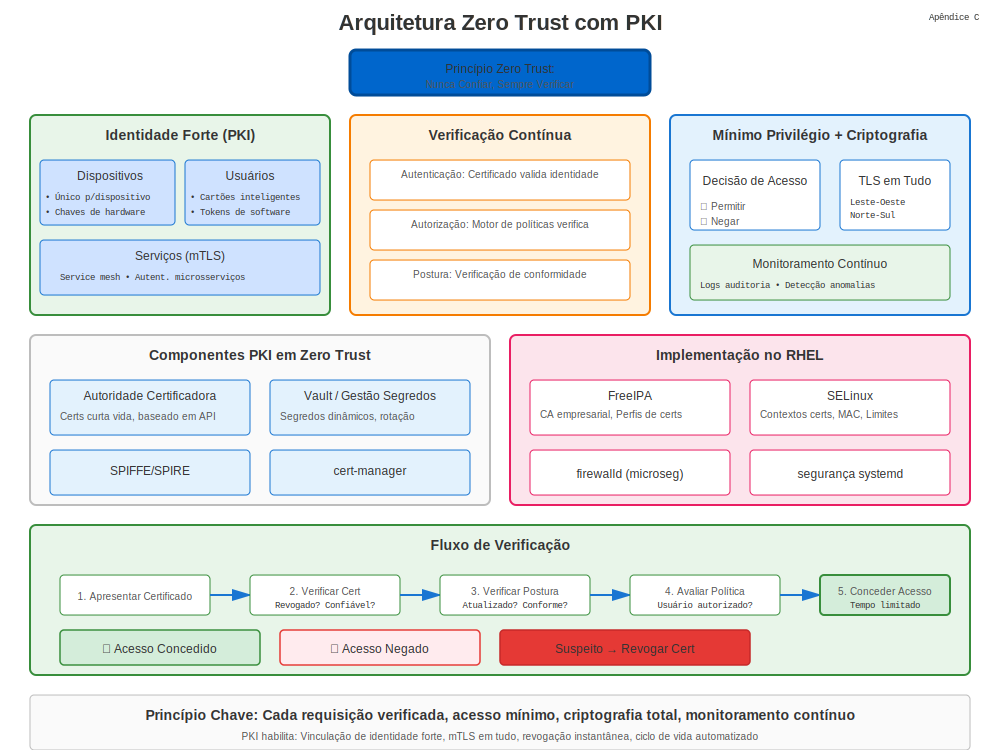

# Apêndice C: Arquitetura Zero Trust

## PKI em Arquitetura Zero Trust



Zero Trust (ZT) assume nenhuma confiança implícita baseada em localização de rede. Cada solicitação deve ser autenticada e autorizada.

## 1. Google BeyondCorp e NIST SP 800-207

Estes frameworks recomendam identidade forte, criptografia de transporte e avaliação contínua.

## 2. Papel da PKI

* Identidade de dispositivo via certificados.
* mTLS para tráfego leste-oeste.
* Credenciais de curta duração auto-rotacionadas.

## 3. Perfil de Certificado para ZT

| Extensão | Propósito |
|----------|-----------|
| SAN: URI:spiffe:// | ID de Carga Trabalho |
| Key Usage: digitalSignature | AuthN |
| EKU: clientAuth, serverAuth | TLS Mútuo |
| Validity ≤ 24h | Limitar raio de explosão |

## 4. Pontos de Aplicação de Política

1. **Gateways** terminam TLS e verificam certs de cliente.
2. **Service Mesh** sidecars realizam mTLS transparentemente.
3. **Agentes de Endpoint** mantêm certificados de dispositivo.

## 5. Lab: Emitir Certificados SPIFFE com cert-manager

```yaml
apiVersion: cert-manager.io/v1
kind: Certificate
metadata:
  name: spiffe-workload
spec:
  duration: 24h
  commonName: spiffe://prod/web/api
  uriSANs:
  - spiffe://prod/web/api
  issuerRef:
    name: mesh-issuer
    kind: ClusterIssuer
```
