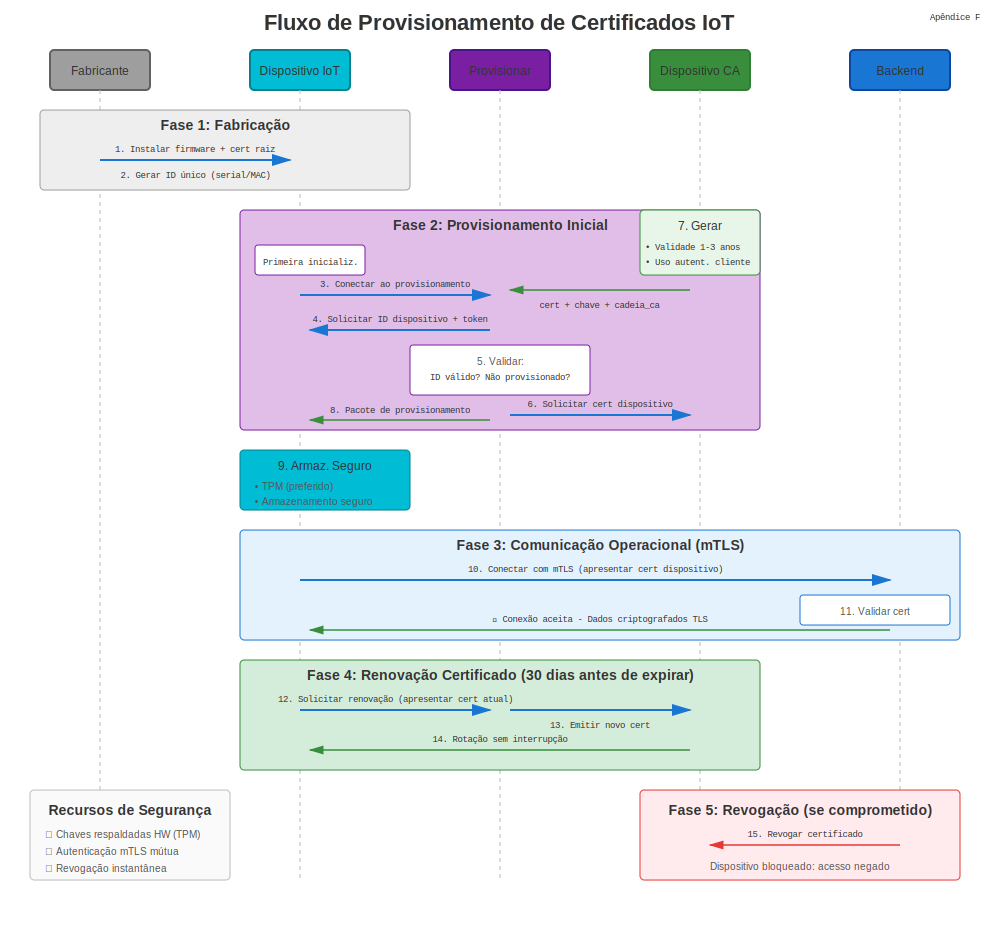
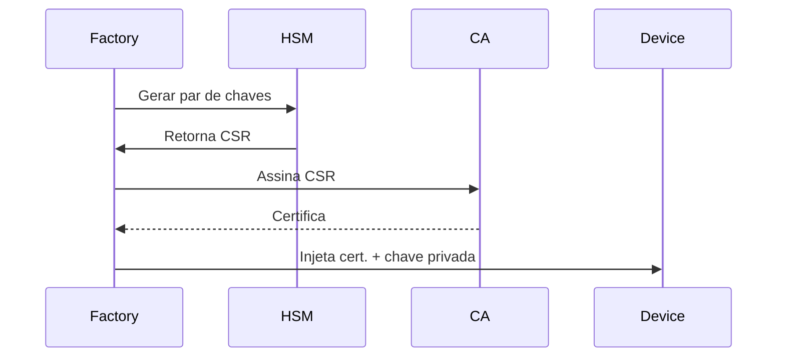

# Apêndice F: Certificados IoT

## Certificados de Dispositivos IoT



Dispositivos Internet das Coisas requerem identidades únicas para comunicação segura. Certificados fornecem prova criptográfica de autenticidade dispositivo.

## 1. Por Que Certificados para IoT?

* **Identidade Dispositivo** – Cada sensor, gateway ou atuador recebe cert único.
* **Redes Zero-Trust** – Dispositivos autenticam mutuamente com nuvem/borda.
* **Segurança Cadeia Fornecimento** – Certificados provisionados na fabricação previnem clonagem.
* **Atualizações OTA** – Code-signing garante integridade firmware.

## 2. Modelos Provisionamento Certificado

### Provisionamento Fábrica

Certificados gravados em armazenamento seguro dispositivo (TPM, elemento seguro) antes envio.



### Provisionamento Just-in-Time

Dispositivo gera chave no primeiro boot, submete CSR para serviço registro.

```bash
# Dispositivo gera chave
openssl ecparam -genkey -name prime256v1 -out device.key

# Criar CSR com serial dispositivo
openssl req -new -key device.key -out device.csr -subj "/CN=device-12345/serialNumber=12345"

# Submeter para API enrollment
curl -X POST https://enroll.iot.example.com/csr \
  -H "Authorization: Bearer $ENROLL_TOKEN" \
  --data-binary @device.csr -o device.crt
```

## 3. AWS IoT Core

### Registrar Certificado Dispositivo

```bash
# Gerar chave e CSR
openssl ecparam -genkey -name prime256v1 -out iot-device.key
openssl req -new -key iot-device.key -out iot-device.csr -subj "/CN=iot-device-001"

# Usar AWS CLI para assinar
aws iot create-certificate-from-csr --certificate-signing-request file://iot-device.csr \
  --set-as-active > cert-response.json

# Extrair certificado
jq -r '.certificatePem' cert-response.json > iot-device.crt
```

### Anexar Política

```bash
aws iot attach-policy --policy-name IoTDevicePolicy --target arn:aws:iot:region:account:cert/certId
```

### Conectar MQTT

```python
import paho.mqtt.client as mqtt
import ssl

client = mqtt.Client()
client.tls_set(
    ca_certs="AmazonRootCA1.pem",
    certfile="iot-device.crt",
    keyfile="iot-device.key",
    tls_version=ssl.PROTOCOL_TLSv1_2
)
client.connect("xxxxxx.iot.us-east-1.amazonaws.com", 8883)
client.publish("device/telemetry", "{'temp': 22.5}")
```

## 4. Azure IoT Hub

### Autenticação Dispositivo X.509

```bash
# Gerar cert dispositivo assinado por CA customizada
openssl req -new -key device.key -out device.csr -subj "/CN=device-001"
openssl x509 -req -in device.csr -CA ca.crt -CAkey ca.key -CAcreateserial \
  -out device.crt -days 365 -sha256

# Upload CA para Azure IoT Hub (portal ou CLI)
az iot hub certificate create --hub-name MyIoTHub --name MyCACert --path ca.crt

# Conectar dispositivo
from azure.iot.device import IoTHubDeviceClient

device_client = IoTHubDeviceClient.create_from_x509_certificate(
    hostname="MyIoTHub.azure-devices.net",
    device_id="device-001",
    x509=X509(cert_file="device.crt", key_file="device.key")
)
device_client.connect()
device_client.send_message("Hello from device-001")
```

## 5. Microchip ATECC608 Elemento Seguro

Chip crypto hardware armazena chaves privadas que nunca saem do silício.

### Fluxo Provisionamento

1. Dispositivo gera par chaves dentro ATECC608.
2. CSR criado usando chave on-chip.
3. CA assina CSR, certificado armazenado em EEPROM dispositivo.

```c
// Exemplo Arduino com biblioteca ATECC
#include <ArduinoECCX08.h>

void setup() {
  ECCX08.begin();

  // Gerar CSR
  byte csr[256];
  ECCX08.getCSR(csr);

  // Enviar CSR para CA via HTTP/MQTT
  // Receber certificado assinado
  // Armazenar em EEPROM
}
```

## 6. Rotação Certificado para Dispositivos Restritos

### Certificados Vida-Curta

Emitir certs 7 dias com renovação automatizada via protocolos leves como EST (RFC 7030).

```bash
# EST simple enroll
curl --cacert ca.crt --cert current-device.crt --key device.key \
  https://est.example.com/.well-known/est/simpleenroll \
  --data-binary @new-device.csr -o renewed-device.crt
```

### Certificados Bootstrap

Cert inicial longa-vida usado apenas para enrollment, então substituído por certs operacionais vida-curta.

## 7. LoRaWAN e Secure Join

LoRaWAN 1.1+ suporta secure join com chaves específicas dispositivo derivadas de certificados:

```text
Device → JoinRequest (assinado com cert DevEUI)
Network Server → JoinAccept (chaves sessão criptografadas)
```

## 8. Resumo Melhores Práticas

| Prática | Justificativa |
|---------|---------------|
| Usar ECC (P-256, P-384) | Chaves menores, menor consumo energia |
| Hardware Root of Trust | TPM, ATECC ou TrustZone previnem extração chave |
| Validade Certificado ≤ 1 ano | Limitar raio explosão de compromisso |
| Revogação via OCSP/CRL | Desabilitar dispositivos comprometidos remotamente |
| PKI Separada para IoT | Isolar CA dispositivo de TI empresarial |

## 9. Implantações Mundo Real

* **Automotivo** – ECUs veículo usam certificados para comunicação V2X (IEEE 1609.2).
* **IoT Industrial** – PLCs e dispositivos SCADA autenticados via IEC 62351.
* **Smart Home** – Protocolo Matter exige certificados X.509 para comissionamento dispositivo.

> **Dica Segurança:** Nunca embuta mesma chave privada em múltiplos dispositivos. Cada dispositivo deve ter certificado único para habilitar revogação seletiva.
