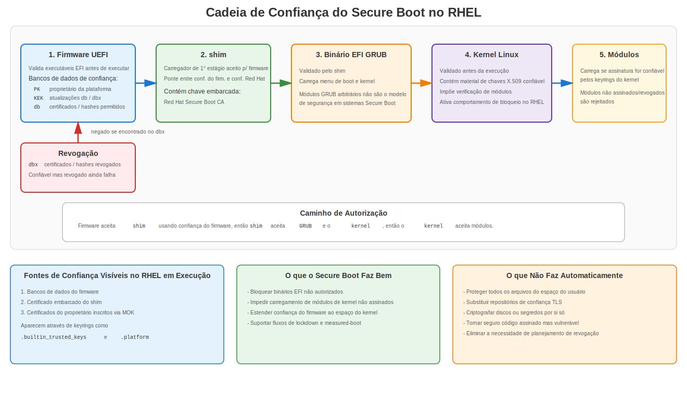
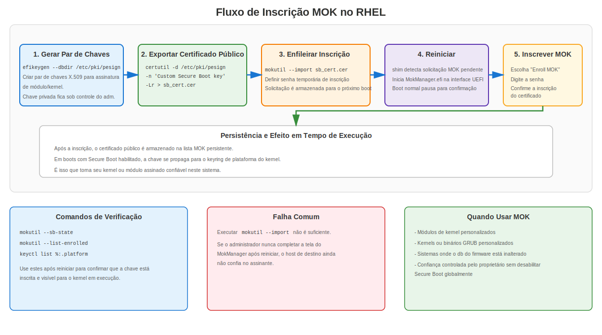
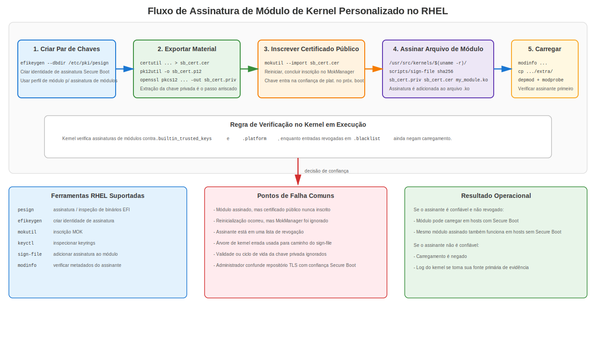

# Apêndice H: Secure Boot e Uso de Certificados

## Secure Boot, Cadeias de Confiança e Operações com Certificados no RHEL

Secure Boot é onde firmware, carregadores de inicialização, kernels e código carregado pelo kernel deixam de ser "apenas arquivos em disco" e se tornam objetos de código autenticados. Se você entende certificados TLS, mas não entende Secure Boot, está ignorando uma grande parte de como a confiança realmente começa em um sistema moderno.

Este apêndice foca em três pontos:

1. O que o Secure Boot realmente faz.
2. Onde certificados e chaves são usados na cadeia de inicialização.
3. Como o RHEL usa `shim`, `GRUB`, `mokutil`, `pesign`, keyrings do kernel e assinatura de módulos em implantações reais.

## 1. O Que é Secure Boot

UEFI Secure Boot é um modelo de verificação de assinatura respaldado por firmware para o caminho de inicialização. O firmware verifica se um executável EFI foi assinado por uma chave ou certificado confiável antes de permitir sua execução.

Isso significa que Secure Boot não é a mesma coisa que:

- Criptografia de disco completo
- Segredos selados por TPM
- Measured Boot
- Monitoramento de integridade de arquivos
- Controle de execução de aplicações em espaço de usuário
- Confiança TLS para serviços web

Secure Boot é especificamente sobre autorizar código durante o caminho de inicialização e para extensões do espaço do kernel, como módulos de kernel carregáveis.

Em termos simples, a pergunta que o Secure Boot faz é:

> "Este componente de firmware, binário EFI, carregador de inicialização, kernel ou módulo deve ser confiável para execução?"

## 2. Por Que Certificados São Importantes no Secure Boot

Certificados são o mecanismo de transporte da confiança. Eles vinculam uma chave pública a uma identidade ou contexto de política, para que um verificador possa decidir se uma assinatura deve ser aceita.

No ecossistema do Secure Boot, certificados e chaves são usados em diferentes lugares:

| Localização | Finalidade |
|-------------|-----------|
| Variáveis de firmware UEFI | Armazenam âncoras de confiança da plataforma e revogações |
| `shim` | Carrega confiança embarcada do fornecedor para verificação do próximo estágio |
| Keyrings do kernel | Mantêm chaves confiáveis usadas para autenticar módulos e artefatos relacionados |
| Lista MOK | Adiciona confiança controlada pelo proprietário sem reescrever bancos de dados de firmware |
| Blocos de assinatura em binários EFI | Provam que componentes de inicialização foram assinados por uma chave privada confiável |

Este é um domínio de confiança diferente do repositório de confiança TLS do RHEL em `/etc/pki/ca-trust/`. Esse repositório é para operações PKI de espaço de usuário, como HTTPS, LDAPS, SMTP TLS, obtenção de pacotes e validação de aplicações. Ele não decide qual binário EFI o firmware inicializa.

## 3. O Modelo de Confiança do UEFI Secure Boot

### 3.1 Bancos de Dados Centrais do Firmware

O UEFI Secure Boot comumente gira em torno de quatro bancos de dados importantes respaldados por variáveis:

| Banco de Dados | Significado | Função Típica |
|----------------|-------------|---------------|
| `PK` | Platform Key | Proprietário de nível superior da política de Secure Boot da plataforma |
| `KEK` | Key Exchange Key database | Autoriza atualizações nos bancos de dados de assinaturas permitidas e revogadas |
| `db` | Assinaturas / certificados permitidos | Lista de confiança para executáveis e drivers EFI |
| `dbx` | Assinaturas / certificados / hashes proibidos | Lista de revogação usada para bloquear binários ou certificados reconhecidamente problemáticos |

Esses são conceitualmente simples, mas administradores rotineiramente os confundem:

- `PK` controla a autoridade do Secure Boot da plataforma.
- `KEK` controla atualizações na lista de permissões e na lista de negações.
- `db` define o que é permitido inicializar.
- `dbx` define o que nunca deve ser aceito, mesmo que já tenha sido confiável no passado.

### 3.2 Modo de Configuração vs Modo de Usuário

O firmware UEFI geralmente possui diferentes estados operacionais:

- **Modo de Configuração (Setup Mode)**: a propriedade da plataforma não está finalizada; alterações no registro de chaves são possíveis.
- **Modo de Usuário (User Mode)**: a política de Secure Boot é ativamente aplicada usando as chaves instaladas.
- **Modo Personalizado (Custom Mode)**: modo específico do fornecedor que pode permitir gerenciamento manual de chaves.

Isso importa porque as pessoas frequentemente confundem "Secure Boot habilitado nos menus de firmware" com "Secure Boot totalmente aplicado com a política de confiança esperada." Esses nem sempre são o mesmo estado.

## 4. O Que Realmente é Assinado

Secure Boot não é uma única assinatura sobre "o sistema." É uma cadeia de objetos assinados separadamente ou confiáveis separadamente.

Objetos autenticados comuns incluem:

- Aplicações EFI
- Carregadores de inicialização EFI
- Binários EFI do GRUB
- Kernels Linux
- Módulos de kernel carregáveis
- Às vezes, executáveis de atualização de firmware do fornecedor

O simples fato de um componente participar da inicialização não significa que ele é assinado independentemente da mesma forma. Por exemplo:

- Binários EFI são tipicamente autenticados como executáveis PE/COFF com assinaturas embarcadas.
- Módulos de kernel são assinados de uma forma específica do Linux e verificados pelo kernel contra chaves X.509 confiáveis.
- O initramfs faz parte do fluxo de inicialização, mas no modelo clássico de Secure Boot do RHEL ele não é simplesmente "outro executável EFI assinado independentemente no formato PE."

Essa distinção importa. Documentações descuidadas misturam tudo em "toda a cadeia de inicialização é assinada." Isso não é preciso o suficiente para solucionar problemas ou projetar políticas.

## 5. Cadeia de Confiança do Secure Boot no RHEL



### 5.1 Fluxo de Alto Nível

Em um sistema RHEL típico com UEFI Secure Boot habilitado:

1. O firmware valida o carregador de inicialização EFI de primeiro estágio contra chaves confiáveis nos bancos de dados de firmware.
2. O carregador de primeiro estágio é tipicamente o `shim`.
3. O `shim` carrega uma âncora de confiança embarcada da Red Hat usada para autenticar o próximo estágio.
4. O `shim` valida o binário EFI do GRUB do RHEL.
5. O GRUB valida o kernel que carrega usando a chave pública embarcada no `shim` (o GRUB não carrega suas próprias chaves de confiança).
6. O kernel usa seus keyrings confiáveis para validar módulos de kernel carregáveis e código relacionado ao espaço do kernel.

Isso fornece uma cadeia de autorização do firmware até a extensibilidade do espaço do kernel.

### 5.2 Por Que o `shim` Existe

O `shim` existe porque fabricantes de hardware amplamente distribuem sistemas com raízes de assinatura UEFI confiáveis pela Microsoft já registradas. A Red Hat pode, portanto, ter o carregador de primeiro estágio assinado de forma que seja aceito por hardware comum, sem pedir a cada fabricante de hardware que pré-instale uma âncora de confiança de firmware exclusiva da Red Hat.

Depois que o firmware aceita o `shim`, o `shim` se torna a ponte entre a confiança do firmware e a confiança do sistema operacional do fornecedor.

Na prática no RHEL:

- O firmware confia no caminho de assinatura reconhecido pela Microsoft para o `shim`.
- O `shim` contém um certificado CA de Secure Boot da Red Hat embarcado.
- Esse certificado embarcado da Red Hat é usado para validar o GRUB e o kernel.

### 5.3 Por Que o RHEL Não Depende de Carregamento Arbitrário de Módulos do GRUB

Sob Secure Boot, o RHEL não quer que código arbitrário não assinado seja carregado dentro do perímetro de segurança do carregador de inicialização. A documentação da Red Hat explica que o carregamento de módulos do GRUB é desabilitado em contextos de Secure Boot porque não existe um modelo amplo de assinatura e verificação para módulos arbitrários do GRUB equivalente ao caminho assinado controlado que a Red Hat distribui.

O ponto operacional é simples:

- Se você está em um sistema com Secure Boot, não assuma que "o GRUB pode simplesmente carregar qualquer coisa do disco."
- Todo o design está tentando manter código não assinado fora do caminho de inicialização.

## 6. Certificados e Chaves Usados pelo Secure Boot do RHEL

### 6.1 Certificados do Firmware

A confiança do firmware vem de chaves e certificados armazenados em variáveis UEFI (`PK`, `KEK`, `db`, `dbx`) conforme descrito na seção 3.1. Esses não são gerenciados com `update-ca-trust`.

### 6.2 Certificado Embarcado do `shim`

A documentação da Red Hat para RHEL 8/9/10 descreve o `shim` como contendo um certificado público da Red Hat usado para autenticar o GRUB e o kernel. Essa confiança embarcada é uma das razões pelas quais o `shim` é central no design do Secure Boot do RHEL.

### 6.3 Machine Owner Key (MOK)

O recurso **Machine Owner Key** é a válvula de escape prática que mantém o Secure Boot utilizável no mundo real.

Sem MOK, você ficaria preso entre duas opções ruins:

1. Desabilitar o Secure Boot sempre que precisar de código personalizado.
2. Convencer o fabricante do seu hardware a adicionar permanentemente o seu certificado público aos bancos de dados de firmware.

O MOK fornece uma terceira opção:

- Você registra seu próprio certificado público no sistema.
- O `shim` e o `MokManager` gerenciam esse registro.
- Na inicialização, a chave é propagada para um keyring confiável do kernel para que seus componentes personalizados assinados possam ser aceitos.

### 6.4 Keyrings do Kernel

No RHEL moderno, a verificação de assinatura de módulos de kernel depende de keyrings do kernel, principalmente:

| Keyring | Função |
|---------|--------|
| `.builtin_trusted_keys` | Chaves confiáveis embutidas no kernel ou carregadas como parte do caminho de inicialização confiável |
| `.platform` | Confiança derivada da plataforma, incluindo chaves provenientes de bancos de dados do Secure Boot e MOK |
| `.blacklist` | Chaves e hashes revogados que devem ser rejeitados |

A documentação do RHEL para assinatura de módulos observa explicitamente:

- assinaturas de módulos são verificadas contra chaves X.509 confiáveis de `.builtin_trusted_keys` e `.platform`
- entradas revogadas da blacklist são excluídas da verificação
- chaves MOK são propagadas para `.platform` em inicializações com Secure Boot habilitado

Isso significa que a confiança é aditiva, mas a revogação ainda prevalece.

## 7. O Que o Secure Boot Protege e o Que Não Protege

### 7.1 O Que Ele Protege

O Secure Boot é projetado para reduzir a chance de que o sistema execute código não autorizado no caminho de inicialização, como:

- binários EFI adulterados
- carregadores de inicialização maliciosos
- kernels modificados
- módulos de kernel não assinados ou não confiáveis

### 7.2 O Que Ele Não Resolve Automaticamente

O Secure Boot não protege automaticamente:

- binários de espaço de usuário
- scripts de shell
- arquivos de configuração
- segredos em repouso
- adulteração de memória em tempo de execução após o sistema já ter sido comprometido
- identidade de servidor TLS para serviços
- escalação de privilégios local por meio de código assinado mas vulnerável

Secure Boot é um controle de autorização de inicialização. Não é um framework completo de integridade do host.

### 7.3 Secure Boot vs Measured Boot vs TPM

As pessoas misturam esses conceitos porque todos tocam a confiança na inicialização. Isso é pensamento preguiçoso.

Eles estão relacionados, mas são diferentes:

| Recurso | Função Principal |
|---------|-----------------|
| Secure Boot | Bloqueia execução de código não autorizado no caminho de inicialização |
| Measured Boot | Registra medições de inicialização em PCRs do TPM |
| TPM | Armazena segredos protegidos e medições; pode selar dados ao estado de inicialização |
| IMA appraisal | Estende a política de integridade além da inicialização para decisões de avaliação de arquivos e carregamento em tempo de execução |

Uma implicação prática no RHEL:

- O Secure Boot decide se o código é aceito para inicializar ou carregar.
- Fluxos de trabalho baseados em TPM podem depender de valores de PCR que refletem a política de Secure Boot e o estado do banco de dados de firmware.

Se chaves de firmware ou bancos de dados de revogação mudarem, medições do TPM também podem mudar. Isso importa para desbloqueio automático de LUKS, atestação e fluxos de trabalho com segredos selados.

## 8. Kernel Lockdown no RHEL

No RHEL, inicializar no modo EFI Secure Boot ativa o comportamento de kernel lockdown. Isso é importante porque o Secure Boot sozinho não é suficiente se o kernel em execução ainda expõe interfaces que permitem a usuários privilegiados adulterar a memória do kernel ou contornar decisões de confiança.

O lockdown tem como objetivo fechar essa lacuna.

Restrições típicas incluem limites ou bloqueios completos em coisas como:

- carregamento de módulos não assinados
- caminhos de modificação direta da imagem do kernel
- interfaces de acesso direto como `/dev/mem`
- alguns caminhos de `kexec` não assinados
- interfaces que poderiam enfraquecer o limite de confiança da inicialização

É por isso que administradores às vezes veem mensagens como:

```text
Lockdown: X: Y is restricted; see man kernel_lockdown.7
```

Isso não é drama aleatório do kernel. É a política de Secure Boot se estendendo para aplicação em tempo de execução.

## 9. O Modelo Mental do Administrador RHEL

Se você for manter apenas um modelo na cabeça, mantenha este:

1. O firmware confia em chaves no `db` e rejeita chaves ou hashes no `dbx`.
2. O firmware autoriza o `shim`.
3. O `shim` autoriza os componentes de inicialização de próximo estágio da Red Hat e também suporta operações MOK.
4. O MOK permite adicionar certificados públicos controlados pelo proprietário.
5. O kernel confia em chaves embutidas e derivadas da plataforma/MOK para verificação de módulos.
6. O lockdown previne contornos óbvios em tempo de execução.

Se qualquer um desses passos estiver quebrado, seu fluxo de trabalho personalizado de inicialização ou módulo falha.

## 10. Secure Boot no RHEL: Verificações Operacionais Diárias

### 10.1 Verificar se o Secure Boot Está Habilitado

```bash
sudo mokutil --sb-state
```

A saída típica é algo como:

```text
SecureBoot enabled
```

### 10.2 Verificar Mensagens de Secure Boot e Integridade no Log do Kernel

```bash
sudo dmesg | grep -Ei 'secure boot|integrity|lockdown|EFI: Loaded cert'
```

Em sistemas RHEL, mensagens de log de integridade frequentemente mostram de onde as chaves vieram, como:

- `UEFI:db`
- `shim` embarcado
- `UEFI:MokListRT`

### 10.3 Listar Chaves Confiáveis da Plataforma

```bash
sudo keyctl list %:.platform
sudo keyctl list %:.builtin_trusted_keys
sudo keyctl list %:.blacklist
```

O que você deve procurar:

- certificados derivados do firmware
- certificados registrados via MOK
- hashes ou chaves revogados em `.blacklist`

### 10.4 Inspecionar Assinaturas em Binários EFI

No RHEL, `pesign` é o caminho de ferramenta suportado para inspecionar e adicionar assinaturas a binários EFI relevantes:

```bash
sudo pesign --show-signature --in /boot/efi/EFI/redhat/shimx64.efi
sudo pesign --show-signature --in /boot/efi/EFI/redhat/grubx64.efi
```

Em sistemas AArch64, os nomes comumente mudam para `shimaa64.efi` e `grubaa64.efi`.

## 11. Pacotes e Ferramentas Principais do RHEL

Ao trabalhar com assinatura personalizada de Secure Boot no RHEL 8/9/10, a documentação da Red Hat se concentra nestas ferramentas:

```bash
sudo dnf install pesign openssl kernel-devel mokutil keyutils
```

Funções principais:

| Ferramenta | Finalidade |
|------------|-----------|
| `pesign` | Assinar e inspecionar binários EFI e kernels |
| `efikeygen` | Gerar um par de chaves X.509 orientado a Secure Boot no banco de dados do `pesign` |
| `mokutil` | Registrar e inspecionar Machine Owner Keys e o estado do Secure Boot |
| `keyctl` | Inspecionar keyrings do kernel |
| `sign-file` | Anexar assinaturas a módulos de kernel Linux |
| `certutil` / `pk12util` | Exportar chaves e certificados do banco de dados NSS usado pelo `pesign` |
| `openssl` | Extrair ou transformar material de chave quando necessário |

## 12. Gerando uma Chave de Secure Boot Personalizada no RHEL

### 12.1 Gerar uma Chave para Assinatura de Módulos

A documentação da Red Hat descreve o `efikeygen` como a forma padrão de criar um par X.509 autoassinado para fluxos de trabalho de Secure Boot:

```bash
sudo efikeygen \
  --dbdir /etc/pki/pesign \
  --self-sign \
  --module \
  --common-name 'CN=Organization signing key' \
  --nickname 'Custom Secure Boot key'
```

### 12.2 Gerar uma Chave para Assinatura de Kernel

```bash
sudo efikeygen \
  --dbdir /etc/pki/pesign \
  --self-sign \
  --kernel \
  --common-name 'CN=Organization signing key' \
  --nickname 'Custom Secure Boot key'
```

### 12.3 Observação Sobre FIPS

A documentação da Red Hat observa que no modo FIPS pode ser necessário especificar o token NSS explicitamente:

```bash
sudo efikeygen \
  --dbdir /etc/pki/pesign \
  --self-sign \
  --kernel \
  --common-name 'CN=Organization signing key' \
  --nickname 'Custom Secure Boot key' \
  --token 'NSS FIPS 140-2 Certificate DB'
```

O material gerado é armazenado em `/etc/pki/pesign/`.

## 13. Registrando o Certificado Público com MOK



Este é o passo que as pessoas pulam, e depois perdem horas culpando o Secure Boot ao invés de seu próprio processo.

Gerar uma chave não é suficiente. O sistema de destino deve confiar no certificado público correspondente.

### 13.1 Exportar o Certificado Público

```bash
sudo certutil -d /etc/pki/pesign \
  -n 'Custom Secure Boot key' \
  -Lr > sb_cert.cer
```

### 13.2 Importá-lo no MOK

```bash
sudo mokutil --import sb_cert.cer
```

Será solicitada a definição de uma senha temporária de registro.

### 13.3 Reiniciar e Completar o Registro

Na próxima inicialização:

1. O `shim` detecta o registro pendente.
2. O `MokManager.efi` inicia.
3. Você escolhe `Enroll MOK`.
4. Você insere a senha definida durante o `mokutil --import`.
5. O certificado é adicionado à lista MOK persistente.

Uma vez registrado em um sistema com Secure Boot habilitado, a chave é propagada para o keyring `.platform` nas inicializações subsequentes.

## 14. Assinando Módulos de Kernel Personalizados no RHEL



Esta é uma das tarefas de Secure Boot mais comuns no mundo real. Drivers fora da árvore, módulos de fornecedores, agentes HBA, probes de monitoramento ou produtos de segurança frequentemente falham aqui.

### 14.1 Exportar o Certificado Público

Exporte o certificado público conforme descrito na seção 13.1 para produzir `sb_cert.cer`.

### 14.2 Exportar a Chave Privada do Banco de Dados NSS

```bash
sudo pk12util -o sb_cert.p12 \
  -n 'Custom Secure Boot key' \
  -d /etc/pki/pesign
```

Em seguida, extraia a chave privada:

```bash
openssl pkcs12 \
  -in sb_cert.p12 \
  -out sb_cert.priv \
  -nocerts \
  -noenc
```

Isso produz uma chave privada não criptografada. Trate esse arquivo como uma arma carregada, porque é exatamente isso que ele é.

### 14.3 Assinar o Módulo

```bash
sudo /usr/src/kernels/$(uname -r)/scripts/sign-file \
  sha256 \
  sb_cert.priv \
  sb_cert.cer \
  my_module.ko
```

Isso anexa a assinatura do módulo diretamente ao arquivo do módulo de kernel.

### 14.4 Verificar o Assinante

```bash
modinfo my_module.ko | grep signer
```

### 14.5 Carregar o Módulo

```bash
sudo insmod my_module.ko
```

ou após colocá-lo na árvore de módulos:

```bash
sudo cp my_module.ko /lib/modules/$(uname -r)/extra/
sudo depmod -a
sudo modprobe my_module
```

### 14.6 Aviso Operacional sobre Data de Validade

A documentação da Red Hat alerta os administradores a assinarem kernels e módulos dentro do período de validade do certificado e também observa que o `sign-file` não avisa sobre decisões de temporização inadequadas. Não trate a ausência de um aviso da ferramenta como prova de que seu fluxo de trabalho de assinatura está correto.

## 15. Assinando Kernels e Binários EFI no RHEL

### 15.1 Assinar um Kernel em x86_64

```bash
sudo pesign \
  --certificate 'Custom Secure Boot key' \
  --in vmlinuz-version \
  --sign \
  --out vmlinuz-version.signed
```

Inspecione o resultado:

```bash
sudo pesign --show-signature --in vmlinuz-version.signed
```

Substitua a imagem não assinada pela assinada:

```bash
sudo mv vmlinuz-version.signed vmlinuz-version
```

Se você pular este passo, o sistema ainda inicializa o original não assinado.

### 15.2 Assinar um Binário EFI do GRUB em x86_64

```bash
sudo pesign \
  --in /boot/efi/EFI/redhat/grubx64.efi \
  --out /boot/efi/EFI/redhat/grubx64.efi.signed \
  --certificate 'Custom Secure Boot key' \
  --sign
```

Inspecione o resultado:

```bash
sudo pesign --in /boot/efi/EFI/redhat/grubx64.efi.signed --show-signature
```

Substitua o binário não assinado pelo assinado:

```bash
sudo mv /boot/efi/EFI/redhat/grubx64.efi.signed /boot/efi/EFI/redhat/grubx64.efi
```

### 15.3 Observação sobre AArch64

Em sistemas AArch64, você normalmente trabalhará com:

- `/boot/efi/EFI/redhat/shimaa64.efi`
- `/boot/efi/EFI/redhat/grubaa64.efi`

A documentação do RHEL também cobre o fluxo de trabalho de descompressão/recompressão para assinar imagens de kernel em ARM de 64 bits.

## 16. Onde a Confiança do Secure Boot Aparece Dentro do Kernel RHEL em Execução

A documentação do RHEL mostra que um sistema com Secure Boot habilitado pode expor evidências de fontes de confiança carregadas tanto em logs do kernel quanto em keyrings.

Exemplos do que você pode ver:

- Entradas de certificados Microsoft provenientes do UEFI `db`
- Chaves de Secure Boot da Red Hat provenientes do `shim` embarcado
- Chaves registradas pelo proprietário provenientes do `MokListRT`
- Revogações refletidas em `.blacklist`

Isso fornece três fontes de confiança diferentes em jogo:

1. Confiança do firmware
2. Confiança embarcada do fornecedor
3. Confiança adicionada pelo proprietário

Se você não sabe qual das três o seu sistema está usando para um determinado módulo ou binário EFI, você está solucionando problemas às cegas.

## 17. Revogação do Secure Boot e `dbx`

A revogação é de onde vêm muitos incidentes do tipo "mas costumava funcionar."

O banco de dados `dbx` contém assinaturas, certificados ou hashes revogados. Se um objeto encadeia a uma entrada revogada, o sistema o rejeita mesmo que tenha sido confiável anteriormente.

Consequências operacionais:

- carregadores de inicialização antigos podem parar de funcionar após atualizações de revogação
- assinaturas vulneráveis ou obsoletas podem se tornar inaceitáveis
- sistemas de laboratório que nunca recebem atualizações de firmware se desviam para estados de compatibilidade estranhos
- cadeias de inicialização personalizadas quebram se você as ancorou em algo que posteriormente foi incluído em dados de revogação

Dentro do Linux, entradas revogadas são representadas através do keyring blacklist. É por isso que confiança sozinha não é suficiente; o objeto também não pode estar revogado.

## 18. Expiração do Certificado de Secure Boot Microsoft 2011

O certificado de assinatura Microsoft UEFI CA 2011, que tem sido a principal âncora de confiança usada pelo firmware para validar o `shim` em virtualmente todo hardware commodity x86_64, está programado para expirar em 27 de junho de 2026.

Isso não significa que sistemas existentes param de inicializar imediatamente. Sistemas que já possuem o certificado de 2011 registrado no firmware `db` continuarão a aceitar binários assinados com esse certificado após a data de expiração. No entanto, a Microsoft não assinará mais novos binários com a chave de 2011 após a expiração, então futuras atualizações do `shim` devem ser assinadas com o certificado de substituição Microsoft UEFI CA 2023.

### 18.1 O Que a Red Hat Fez

A Red Hat lançou novos binários `shim` para todas as versões suportadas do RHEL 8, RHEL 9 e RHEL 10 em x86_64 que são duplamente assinados com ambos os certificados de assinatura de Secure Boot Microsoft 2011 e Microsoft 2023. Isso significa que o novo `shim` inicializará em sistemas que tenham um ou ambos os certificados registrados no firmware.

Em AArch64, a partir do RHEL 9.7 e RHEL 10.0, o binário `shim` é assinado apenas com o certificado Microsoft 2023.

### 18.2 Verificando Qual Certificado Assinou Seu shim

```bash
sudo pesign -S -i /boot/efi/EFI/redhat/shimx64.efi
```

Se você vir `Microsoft Windows UEFI Driver Publisher`, esse é o caminho do certificado de 2011. Se você vir referências ao certificado de 2023, o sistema está usando o caminho de assinatura atualizado.

### 18.3 O Que os Administradores Devem Fazer

1. **Atualizar o `shim`** em todos os sistemas RHEL suportados para obter a versão com dupla assinatura antes de depender de atualizações de firmware que adicionem o certificado de 2023.
2. **Ficar atento a atualizações de firmware** dos fabricantes de hardware que registrem o certificado Microsoft 2023 no UEFI `db`. Sem o certificado de 2023 no firmware, futuros binários `shim` assinados apenas com a chave de 2023 não serão aceitos.
3. **Estar ciente do impacto no TPM**: atualizações no UEFI `db` alterarão valores do TPM Platform Configuration Register (PCR), particularmente o PCR7. Se você usa desbloqueio automático baseado em TPM para volumes criptografados com LUKS, atestação Measured Boot, ou segredos selados contra o PCR7, essas vinculações serão quebradas após alterações no `db`. A abordagem recomendada é primeiro selar novamente contra um valor de PCR que não mudou (como o PCR0), reiniciar e depois selar novamente contra o novo valor do PCR7.
4. **Sistemas legados** (servidores físicos antigos, appliances ou sistemas que nunca recebem atualizações de firmware) que não podem registrar o certificado de 2023 permanecerão limitados a inicializar binários `shim` assinados com o certificado de 2011.

### 18.4 Por Que Isso Importa para Este Livro

Este é um exemplo concreto e real de cada conceito que este apêndice cobre: bancos de dados de confiança de firmware, ciclo de vida de certificados, risco de revogação, sensibilidade de medições do TPM e o custo operacional de ignorar o gerenciamento de certificados de assinatura. Se sua organização não sabia que isso estava chegando, seu gerenciamento de ciclo de vida do Secure Boot tem uma lacuna.

## 19. Secure Boot e Notas de Versão do RHEL

### 19.1 RHEL 7

O RHEL 7 estabeleceu o modelo básico de Secure Boot da Red Hat:

- `shim` como carregador de primeiro estágio
- Chave embarcada da Red Hat no `shim`
- GRUB e kernel assinados
- MOK para confiança adicionada pelo proprietário
- Módulos de kernel assinados obrigatórios em sistemas com Secure Boot habilitado

A documentação do RHEL 7 também faz um ponto importante que muitas pessoas não percebem: o Secure Boot clássico é sobre integridade de código no espaço do kernel, não validação generalizada de todo o conteúdo do espaço de usuário.

### 19.2 RHEL 8

O RHEL 8 mantém o mesmo modelo geral, com documentação pública aprimorada sobre:

- `.builtin_trusted_keys`
- `.platform`
- `.blacklist`
- `efikeygen`
- `pesign`
- Procedimentos de registro MOK

A documentação do RHEL 8 também mostra explicitamente que chaves registradas via MOK são propagadas para `.platform`.

### 19.3 RHEL 9

O RHEL 9 documenta o mesmo caminho de confiança central e é mais rigoroso e claro operacionalmente em relação a:

- validação de assinatura de módulos contra keyrings confiáveis
- confiança de plataforma baseada em MOK
- assinatura de kernels e módulos personalizados
- comportamento de lockdown em sistemas com Secure Boot

O RHEL 9 é a linha de base prática se você está projetando um fluxo de trabalho moderno de Secure Boot no RHEL hoje.

### 19.4 RHEL 10

A documentação do RHEL 10 continua com o mesmo conjunto de ferramentas e modelo de confiança para assinatura personalizada de kernels e módulos com `pesign`, `mokutil`, `efikeygen`, `keyctl` e keyrings do kernel.

O ponto importante é a continuidade: esse não é um recurso aleatório que muda de forma a cada versão. Os nomes de ferramentas e conceitos de confiança permanecem reconhecíveis entre as gerações suportadas do RHEL.

## 20. Casos de Uso Comuns no RHEL

### 20.1 Implantação de Drivers de Terceiros

Exemplos comuns:

- drivers de controladora de armazenamento
- agentes de monitoramento com módulos de kernel
- módulos de segurança de endpoint
- drivers de rede personalizados
- módulos de gerenciamento de hardware do fornecedor

Se o módulo não está assinado ou está assinado por uma chave não confiável, o sistema o recusa em um host com Secure Boot habilitado.

### 20.2 Builds de Kernel Personalizados

Se você constrói seu próprio kernel, o firmware e a cadeia de inicialização não se importam que ele veio do seu pipeline de CI. Eles só se importam se a imagem está assinada por uma chave confiável e se o sistema tem essa âncora de confiança registrada.

### 20.3 Ambientes que Removem Âncoras de Confiança do Fornecedor

Algumas organizações querem controle mais rigoroso e reduzir a dependência de âncoras de confiança padrão de terceiros. Isso é possível, mas significa que você é dono de toda a cadeia:

- política de assinatura
- proteção da chave privada
- gerenciamento de confiança de firmware
- assinatura de GRUB/kernel
- estratégia de revogação
- caminho de recuperação se sua infraestrutura de assinatura falhar

A maioria das equipes subestima essa carga operacional.

### 20.4 Máquinas Virtuais

O Secure Boot também importa em ambientes virtualizados se o firmware do convidado expõe suporte a UEFI Secure Boot. Não assuma que "é apenas uma VM" significa que a confiança de inicialização é irrelevante. Infraestrutura virtual é um dos lugares mais fáceis para imagens personalizadas não assinadas proliferarem.

## 21. Solução de Problemas do Secure Boot no RHEL

### 21.1 Verificações Rápidas

```bash
sudo mokutil --sb-state
sudo mokutil --list-enrolled
sudo keyctl list %:.platform
sudo keyctl list %:.blacklist
sudo dmesg | grep -Ei 'secure boot|lockdown|integrity|module|cert'
```

### 21.2 Padrões Típicos de Falha

| Sintoma | Causa Provável |
|---------|---------------|
| Módulo não carrega | Módulo não assinado ou assinante não confiável |
| Módulo mostra assinante mas ainda falha | Chave não registrada no sistema de destino, caminho de keyring incorreto ou assinante revogado |
| Importação MOK foi executada mas confiança não está visível | Registro não completado no `MokManager` após reinicialização |
| Binário EFI falha ao inicializar | Assinatura confiável ausente, fluxo de trabalho de substituição incorreto ou certificado/hash revogado |
| Comportamento mudou após atualização de firmware | Alterações em `db`/`dbx` modificaram o estado de confiança ou revogação |
| Fluxo de trabalho de desbloqueio TPM quebra após atualizações de chave | Medições de PCR mudaram após atualizações de bancos de dados do Secure Boot |

### 21.3 Pistas no Log do Kernel

Procure por mensagens mencionando:

- `integrity`
- `MokListRT`
- `EFI: Loaded cert`
- `Lockdown`
- `module verification failed`

Se você não inspeciona o log do kernel, está apenas adivinhando.

## 22. Melhores Práticas para Gerenciamento de Certificados de Secure Boot

### 22.1 Separar Funções

Não use uma chave de assinatura para tudo, a menos que goste de transformar um comprometimento em um incidente que afeta toda a plataforma.

Prefira chaves separadas para:

- carregadores de inicialização / binários EFI
- kernels
- módulos de kernel de terceiros ou internos
- fluxos de trabalho de emergência ou break-glass

### 22.2 Proteger a Chave Privada Adequadamente

Prefira:

- assinatura offline
- armazenamento de chave respaldado por HSM ou token quando possível
- acesso mínimo de operadores
- etapas de assinatura auditadas
- planejamento de rotação de certificados

Evite:

- deixar chaves extraídas não criptografadas em hosts de build
- copiar material de assinatura entre jobs de CI improvisados
- chaves de laboratório de longa duração descartáveis reutilizadas em produção

### 22.3 Manter o Registro MOK Restrito

Cada certificado confiável extra expande o que a plataforma pode aceitar. Registre apenas o que você precisa. "Basta adicionar outro MOK para funcionar" é como a proliferação de confiança começa.

### 22.4 Rastrear Revogações e Atualizações de Firmware

Se você depende de confiança personalizada de Secure Boot:

- monitore atualizações de firmware e `dbx`
- teste caminhos de recuperação antes de implantação ampla
- valide a inicialização em hardware de homologação
- entenda o impacto nos segredos selados por TPM e na atestação

### 22.5 Manter Secure Boot e PKI TLS Mentalmente Separados

Os mesmos conceitos X.509 aparecem em ambas as áreas, mas os mundos operacionais são diferentes.

Não confunda:

- bancos de dados de confiança de firmware com `/etc/pki/ca-trust`
- registro MOK com instalação de âncora de confiança de CA
- chaves de assinatura de módulos com certificados TLS de servidor web

Eles usam criptografia relacionada, mas resolvem problemas diferentes.

## 23. Verdades Difíceis que Administradores Geralmente Aprendem Tarde

1. Secure Boot é fácil até você precisar de código personalizado.
2. Código personalizado é fácil até você precisar de operações de assinatura duráveis.
3. Operações de assinatura duráveis são fáceis até você precisar de revogação, rotação, atestação e recuperação de frota.

A maioria das equipes não falha no Secure Boot porque a criptografia é difícil demais. Elas falham porque seu modelo operacional é desleixado:

- nenhum modelo de propriedade de chaves
- nenhum planejamento de ciclo de vida de certificados
- nenhum hardware de teste
- nenhum caminho de rollback
- nenhuma ideia do que é confiável pelo firmware vs `shim` vs MOK vs keyrings do kernel

Isso não é uma limitação técnica. Isso é falha de processo.

## 24. Quick Reference

```text
┌──────────────────────────────────────────────────────────────────────┐
│ RHEL SECURE BOOT QUICK REFERENCE                                     │
├──────────────────────────────────────────────────────────────────────┤
│ Check state:        mokutil --sb-state                               │
│ List MOKs:          mokutil --list-enrolled                          │
│ List platform keys: keyctl list %:.platform                          │
│ Built-in keys:      keyctl list %:.builtin_trusted_keys              │
│ Revocations:        keyctl list %:.blacklist                         │
│ View EFI signature: pesign --show-signature --in <efi-binary>        │
│                                                                      │
│ RHEL boot path:     firmware -> shim -> GRUB -> kernel -> modules    │
│                                                                      │
│ Firmware DBs:       PK / KEK / db / dbx                              │
│ Owner trust:        MOK -> .platform                                 │
│ Kernel trust:       .builtin_trusted_keys + .platform                │
│ Revocation:         .blacklist / dbx                                 │
│                                                                      │
│ Common packages:    pesign openssl kernel-devel mokutil keyutils     │
└──────────────────────────────────────────────────────────────────────┘
```

## 25. Conclusões Principais

1. Secure Boot é uma cadeia de autorização baseada em certificados para código de inicialização e espaço do kernel.
2. No RHEL, o `shim` é a ponte entre a confiança do firmware e a confiança controlada pela Red Hat.
3. O MOK é o mecanismo crítico para adicionar confiança controlada pelo proprietário sem reescrever bancos de dados de firmware.
4. O carregamento de módulos de kernel depende de keyrings confiáveis, não do pacote de CAs do espaço de usuário.
5. A revogação importa tanto quanto a confiança; `dbx` e `.blacklist` podem quebrar artefatos que "funcionavam anteriormente."
6. Se você está assinando módulos ou kernels personalizados, o problema não é apenas criptografia. É gerenciamento de ciclo de vida.

## 26. Leitura Oficial do RHEL que Vale Manter por Perto

- Documentação de gerenciamento de kernel do RHEL 8/9/10 sobre assinatura de kernels e módulos para Secure Boot
- Orientações de administração de kernel e Secure Boot do RHEL 7
- `kernel_lockdown(7)`
- `mokutil(1)`
- `keyctl(1)`
- `pesign(1)`
