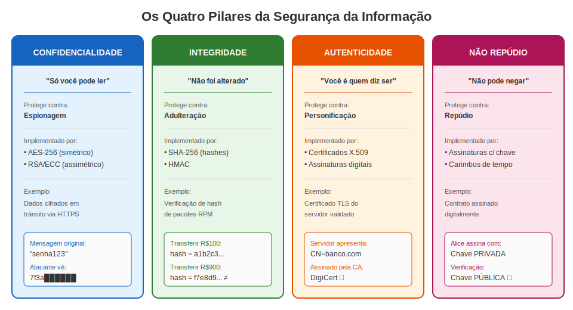
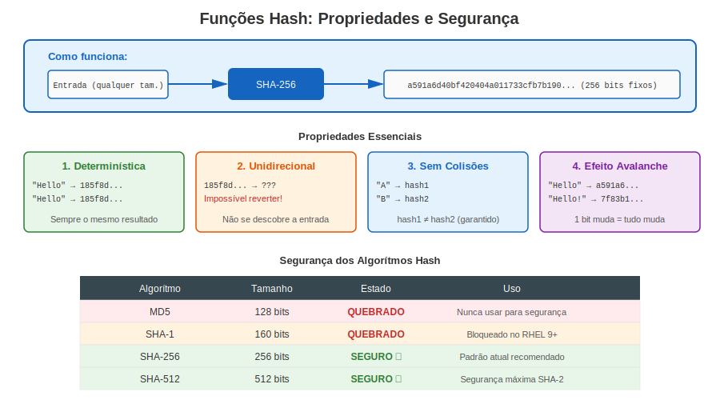
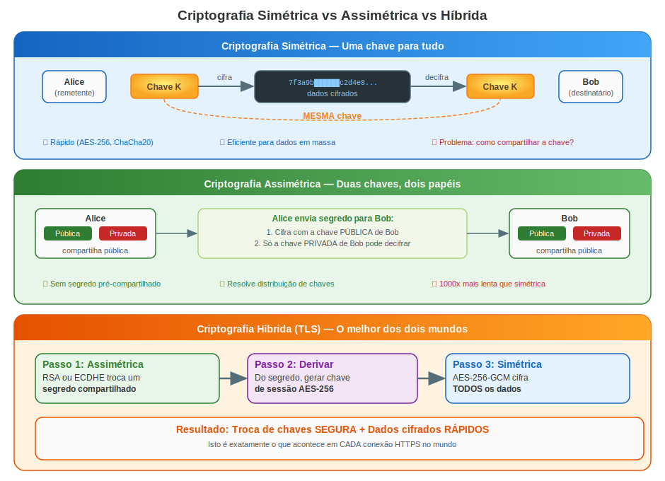
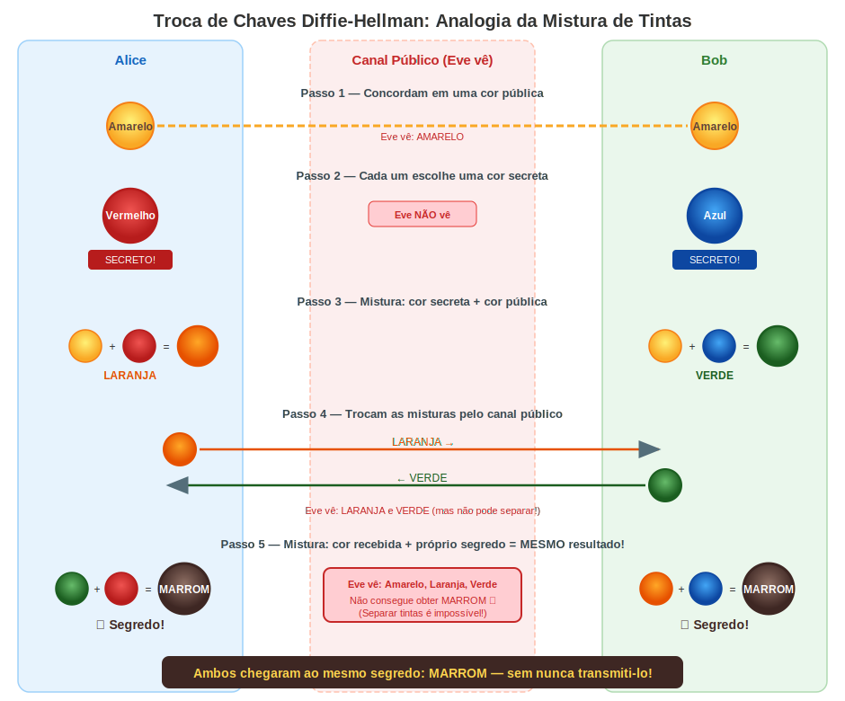
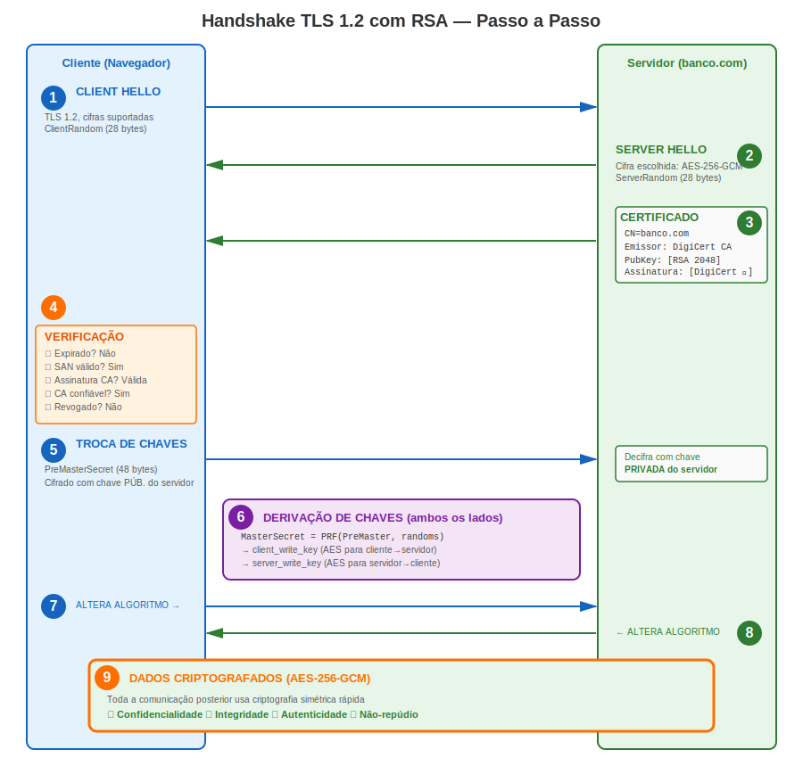
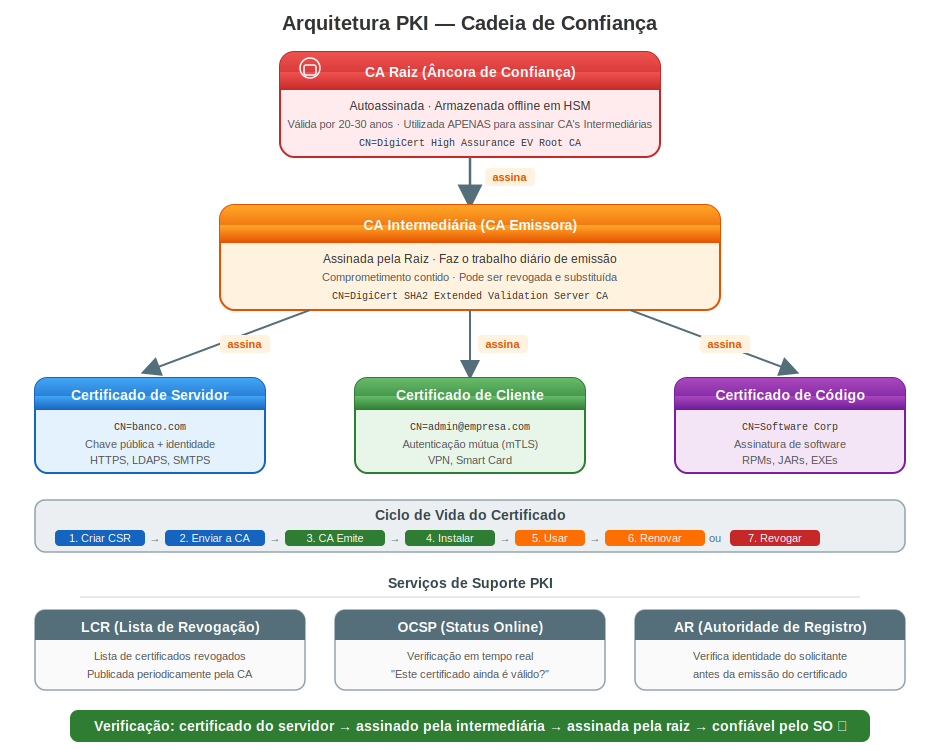
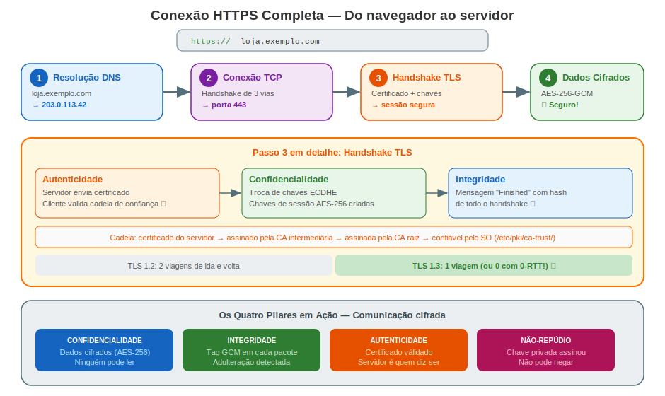

# Capítulo 1: Criptografia, Estrutura PKI e Fundamentos

> **Antes de Começar:** Este capítulo constrói a base conceitual que você precisa antes de tocar em um único certificado. Ao final, você entenderá *por que* a criptografia existe, *como* ela funciona em nível prático, e *o que* acontece nos bastidores quando duas máquinas estabelecem uma conexão segura.

---

## 1.1 Por Que Usar Criptografia?

Imagine enviar um cartão postal. Qualquer pessoa que o manipule—carteiros, vizinhos, desconhecidos—pode lê-lo. Agora imagine que o cartão postal contém sua senha bancária. É assim que o tráfego de rede não criptografado se parece.

Cada pacote que viaja por uma rede pode ser **interceptado**, **lido**, **modificado** ou **forjado**. Sem criptografia:

| Ameaça | O que acontece | Exemplo real |
|--------|---------------|--------------|
| **Espionagem** | Atacante lê seus dados | Captura de senhas em Wi-Fi público |
| **Adulteração** | Atacante modifica dados em trânsito | Injeção de malware em download de software |
| **Personificação** | Atacante finge ser outra pessoa | Site bancário falso coletando credenciais |
| **Repúdio** | Remetente nega ter enviado uma mensagem | Negar uma transação financeira |

A criptografia resolve **todos os quatro** problemas. Ela não é opcional em sistemas modernos—é a base de toda comunicação segura.

---

## 1.2 Os Quatro Pilares da Segurança da Informação

A criptografia fornece quatro garantias fundamentais. Todo sistema seguro depende de uma combinação destas:

### Confidencialidade — "Só você pode ler isto"

A confidencialidade garante que os dados são legíveis **apenas pelo destinatário pretendido**. Mesmo se um atacante interceptar os dados, ele vê apenas ruído sem sentido.

**Como é implementada:**
- **Criptografia simétrica** (AES-256): A mesma chave cifra e decifra. Rápida, usada para dados em massa.
- **Criptografia assimétrica** (RSA, ECC): Chave pública cifra, chave privada decifra. Usada para troca de chaves.

**Contra o que protege:** Espionagem.

### Integridade — "Isto não foi alterado"

A integridade garante que os dados **não foram alterados** entre remetente e destinatário. Se um único bit mudar, a modificação é detectada.

**Como é implementada:**
- **Funções hash** (SHA-256): Produzem uma impressão digital de tamanho fixo dos dados.
- **HMAC**: Hash combinado com uma chave secreta para integridade autenticada.
- **Assinaturas digitais**: Hash assinado com uma chave privada.

```
 Original:  "Transferir R$100 para Bob"  → SHA-256 → a1b2c3d4...
 Adulterado:"Transferir R$900 para Bob"  → SHA-256 → f7e8d9c0...  ← DIFERENTE!
```

**Contra o que protege:** Adulteração.

### Autenticidade — "Você é quem diz ser"

A autenticidade prova a **identidade da parte comunicante**. Quando você se conecta ao site do seu banco, precisa ter certeza de que é realmente seu banco, não um impostor.

**Como é implementada:**
- **Certificados digitais** (X.509): Vinculam uma chave pública a uma identidade.
- **Autoridades Certificadoras (CAs)**: Terceiros confiáveis que verificam identidades.
- **Assinaturas digitais**: Provam que uma mensagem foi criada pelo remetente alegado.

**Contra o que protege:** Personificação.

### Não-Repúdio — "Você não pode negar isto"

O não-repúdio garante que o remetente **não pode negar** ter enviado uma mensagem ou realizado uma ação. É o equivalente digital de uma assinatura manuscrita em um contrato.

**Como é implementado:**
- **Assinaturas digitais com chaves privadas**: Apenas o detentor da chave pode produzir a assinatura.
- **Carimbos de tempo**: Provam quando uma ação ocorreu.
- **Logs de auditoria com integridade criptográfica**: Registros à prova de adulteração.

**Contra o que protege:** Repúdio (negar responsabilidade).



### Resumo: Os Quatro Pilares

| Pilar | Pergunta que responde | Implementado por | Protege contra |
|-------|----------------------|-----------------|----------------|
| **Confidencialidade** | Alguém mais pode ler? | Criptografia (AES, RSA) | Espionagem |
| **Integridade** | Foi modificado? | Hashes (SHA-256), HMAC | Adulteração |
| **Autenticidade** | Quem enviou? | Certificados, assinaturas | Personificação |
| **Não-repúdio** | O remetente pode negar? | Assinaturas digitais | Repúdio |

---

## 1.3 Funções Hash: Impressões Digitais de Dados

Uma função hash recebe uma entrada de **qualquer tamanho** e produz uma saída de **tamanho fixo**. Pense nela como uma impressão digital para dados.



### Propriedades Essenciais

**1. Determinística** — A mesma entrada sempre produz a mesma saída.
```
SHA-256("Hello") → 185f8db32271...  (sempre)
SHA-256("Hello") → 185f8db32271...  (sempre)
```

**2. Unidirecional (Resistência a Pré-imagem)** — Não é possível descobrir a entrada a partir da saída.
```
185f8db32271... → ???  (computacionalmente inviável encontrar a entrada)
```

**3. Resistente a Colisões** — É praticamente impossível encontrar duas entradas diferentes que produzam a mesma saída.
```
SHA-256("entrada A") → hash1
SHA-256("entrada B") → hash2
hash1 ≠ hash2  (com probabilidade esmagadora)
```

**4. Efeito Avalanche** — Uma mudança mínima na entrada produz uma saída completamente diferente.
```
SHA-256("Hello World")  → a591a6d40bf420404a011733cfb7b190...
SHA-256("Hello World!") → 7f83b1657ff1fc53b92dc18148a1d65d...
                                     ↑ completamente diferente!
```

### Hashes São Seguros?

Nem todos os algoritmos hash são iguais. Alguns foram **quebrados**:

| Algoritmo | Tamanho da Saída | Estado | Por quê |
|-----------|-----------------|--------|---------|
| **MD5** | 128 bits | **QUEBRADO** | Colisões encontradas em segundos. Nunca use para segurança. |
| **SHA-1** | 160 bits | **QUEBRADO** | Google demonstrou colisão prática em 2017 (SHAttered). |
| **SHA-256** | 256 bits | **SEGURO** | Sem ataques práticos conhecidos. Padrão atual. |
| **SHA-384** | 384 bits | **SEGURO** | Margem de segurança maior. |
| **SHA-512** | 512 bits | **SEGURO** | Segurança máxima da família SHA-2. |
| **SHA-3** | 256+ bits | **SEGURO** | Design diferente (Keccak). Alternativa à prova de futuro. |
| **BLAKE2** | 256+ bits | **SEGURO** | Muito rápido, usado em aplicações modernas. |

**"Quebrado" significa:** Um atacante pode encontrar duas entradas diferentes que produzem o mesmo hash (colisão). Isso permite forjar documentos, certificados ou assinaturas.

```bash
# Verifique você mesmo — calcule hashes em qualquer sistema RHEL:
echo -n "Hello World" | sha256sum
# a591a6d40bf420404a011733cfb7b190d62c65bf0bcda32b57b277d9ad9f146e

echo -n "Hello World" | md5sum
# b10a8db164e0754105b7a99be72e3fe5  ← NÃO confie nisto para segurança!
```

### Usos Reais de Hashes

| Caso de uso | Como | Exemplo |
|-------------|------|---------|
| **Armazenamento de senhas** | Armazena o hash, não a senha | `/etc/shadow` no Linux |
| **Integridade de arquivos** | Compara hash antes/depois | `sha256sum pacote.rpm` |
| **Assinaturas digitais** | Assina o hash, não os dados | Assinatura de certificados |
| **Deduplicação** | Identifica arquivos idênticos | Sistemas de backup |
| **Blockchain** | Cadeia de hashes | Prova de trabalho do Bitcoin |

---

## 1.4 Criptografia Simétrica vs Assimétrica



### Simétrica: Uma Chave para Tudo

Remetente e destinatário compartilham a **mesma chave secreta**. Como um cadeado onde ambas as partes têm uma cópia da mesma chave.

| Propriedade | Valor |
|-------------|-------|
| **Velocidade** | Muito rápida (AES acelerado por hardware) |
| **Tamanho da chave** | 128 ou 256 bits |
| **Problema** | Como compartilhar a chave de forma segura? |
| **Exemplos** | AES-128, AES-256, ChaCha20 |

### Assimétrica: Duas Chaves, Dois Papéis

Cada parte tem um **par de chaves**: uma chave pública (compartilhe livremente) e uma chave privada (nunca compartilhe).

| Propriedade | Valor |
|-------------|-------|
| **Velocidade** | Lenta (1000x mais lenta que simétrica) |
| **Tamanho da chave** | 2048–4096 bits (RSA) ou 256 bits (ECC) |
| **Vantagem** | Não precisa compartilhar chave secreta previamente |
| **Exemplos** | RSA, ECDSA, Ed25519 |

### Por Que Precisamos de Ambas: Criptografia Híbrida

A criptografia assimétrica resolve o problema de distribuição de chaves, mas é lenta demais para dados em massa. A solução: usar assimétrica para trocar uma chave simétrica, depois usar simétrica para os dados.

Isto é exatamente o que acontece em cada conexão HTTPS.

---

## 1.5 Entendendo a Troca de Chaves: A Analogia da Mistura de Cores

Antes de mergulhar no handshake TLS/RSA real, vamos construir uma intuição com uma analogia visual. Isto explica a **troca de chaves Diffie-Hellman**, o mecanismo usado no TLS moderno para estabelecer um segredo compartilhado.

### O Problema

Alice e Bob querem concordar em uma **cor secreta compartilhada** que Eve (a bisbilhoteira) não consiga descobrir, mesmo que Eve possa ver tudo que eles enviam um ao outro.



### Por Que Eve Não Consegue Trapacear

Misturar tinta é **fácil de fazer** mas **impossível de reverter**. Não se consegue separar tinta misturada de volta em seus componentes. Em matemática, isto é análogo a:

- **Fácil:** Multiplicar dois primos grandes → obter um produto (misturar)
- **Difícil:** Fatorar um produto grande → encontrar os primos (separar)

Esta é a **função unidirecional** que faz a criptografia funcionar.

### De Cores para Números

| Analogia de Cores | Equivalente Criptográfico |
|-------------------|--------------------------|
| Cor pública (Amarelo) | Parâmetros públicos (primo grande, gerador) |
| Segredo de Alice (Vermelho) | Chave privada de Alice |
| Segredo de Bob (Azul) | Chave privada de Bob |
| Cor misturada enviada (Laranja/Verde) | Chave pública (calculada a partir da privada) |
| Segredo final compartilhado (Marrom) | Chave de sessão compartilhada |
| "Não se consegue separar a tinta" | O problema do logaritmo discreto é computacionalmente difícil |

---

## 1.6 O Handshake TLS: Como uma Conexão Segura Realmente Funciona

Agora vamos ver o que realmente acontece quando seu navegador se conecta a `https://banco.com`. Isto combina **tudo** que aprendemos: hashes, criptografia assimétrica, criptografia simétrica, certificados e troca de chaves.



### Passo a Passo Detalhado

**Passos 1-2 (Hello):** Cliente e servidor trocam capacidades e números aleatórios. Esses números aleatórios adicionam frescor — garantem que cada sessão é única, mesmo entre as mesmas partes.

**Passo 3 (Certificate):** O servidor prova sua identidade enviando seu certificado X.509 contendo sua chave pública.

**Passo 4 (Verificação):** Este é o passo crítico de confiança. O cliente percorre a **cadeia de confiança**.

Cada assinatura é verificada usando a **chave pública do emissor**. Se qualquer elo se quebrar, o handshake falha.

**Passo 5 (Troca de Chaves):** O cliente gera 48 bytes aleatórios (PreMasterSecret), cifra com a chave pública RSA do servidor e envia. Apenas a chave privada do servidor pode decifrar — esta é a mágica assimétrica.

**Passo 6 (Derivação de Chaves):** Ambos os lados calculam independentemente as mesmas chaves de sessão usando uma Função Pseudo-Aleatória (PRF). É aqui que transitamos de assimétrica lenta para simétrica rápida.

**Passos 7-9 (Comunicação Criptografada):** A partir daqui, tudo é cifrado com AES-256 — milhares de vezes mais rápido que RSA.

### TLS 1.3 Moderno: Mais Simples e Rápido

O TLS 1.3 simplificou o handshake removendo a troca de chaves RSA (sigilo futuro agora é obrigatório) e reduzindo viagens de ida e volta:

---

## 1.7 Estrutura PKI: A Arquitetura de Confiança

Infraestrutura de Chaves Públicas (PKI) é o sistema que gerencia certificados digitais e chaves públicas. Ela responde à pergunta: **"Como sei que esta chave pública realmente pertence a banco.com?"**



### Por Que uma Cadeia?

CAs Raiz são **extremamente valiosas** — se comprometidas, cada certificado que já assinaram torna-se não confiável. Por isso CAs Raiz são:
- Armazenadas em módulos de segurança de hardware (HSMs) offline, isolados da rede
- Usadas apenas para assinar certificados de CAs Intermediárias
- Válidas por 20-30 anos

CAs Intermediárias fazem o trabalho diário de emitir certificados. Se comprometidas:
- Apenas os certificados daquela Intermediária são afetados
- A Raiz pode revogar a Intermediária e criar uma nova
- O dano é contido

### Revogação: O Que Acontece Quando a Confiança Quebra

Quando uma chave privada é comprometida ou um certificado não deve mais ser confiável:

| Método | Como funciona | Compensação |
|--------|-------------|-------------|
| **LCR** (Lista de Certificados Revogados) | CA publica lista de números de série revogados | Pode estar desatualizada (atualizada periodicamente) |
| **OCSP** (Protocolo de Status de Certificado Online) | Cliente pergunta à CA "este cert ainda é válido?" em tempo real | Requer rede, preocupação de privacidade |
| **OCSP Stapling** | Servidor busca sua própria resposta OCSP e anexa ao handshake | Melhor dos dois mundos |

---

## 1.8 Juntando Tudo: Um Exemplo Completo

Vamos rastrear uma conexão HTTPS completa do início ao fim, vendo cada conceito em ação:



---

## 1.9 Conclusões Principais

Antes de prosseguir para o gerenciamento de certificados específico do RHEL, certifique-se de entender:

| Conceito | Resumo em uma frase |
|----------|---------------------|
| **Hashes** | Impressões digitais unidirecionais que detectam qualquer alteração (use SHA-256+). |
| **Criptografia simétrica** | A mesma chave cifra e decifra — rápida, mas distribuição da chave é difícil. |
| **Criptografia assimétrica** | Pares de chaves pública/privada — resolve distribuição, mas é lenta. |
| **Criptografia híbrida** | Usa assimétrica para trocar chaves, depois simétrica para dados (o TLS faz isto). |
| **Assinaturas digitais** | Hash + chave privada = prova de identidade e integridade. |
| **Certificados** | Vinculam uma chave pública a uma identidade, assinados por uma CA confiável. |
| **PKI** | A arquitetura de confiança: CA Raiz → CA Intermediária → Certificado entidade final. |
| **Handshake TLS** | Autentica servidor, troca chaves, depois cifra tudo. |
| **Sigilo futuro** | Usa chaves efêmeras (ECDHE) para que sessões passadas permaneçam seguras. |

---

**Navegação do Capítulo**

| | [Próximo: Capítulo 2 - Introdução aos Certificados no RHEL →](02-intro.html) |
|:---|---:|
