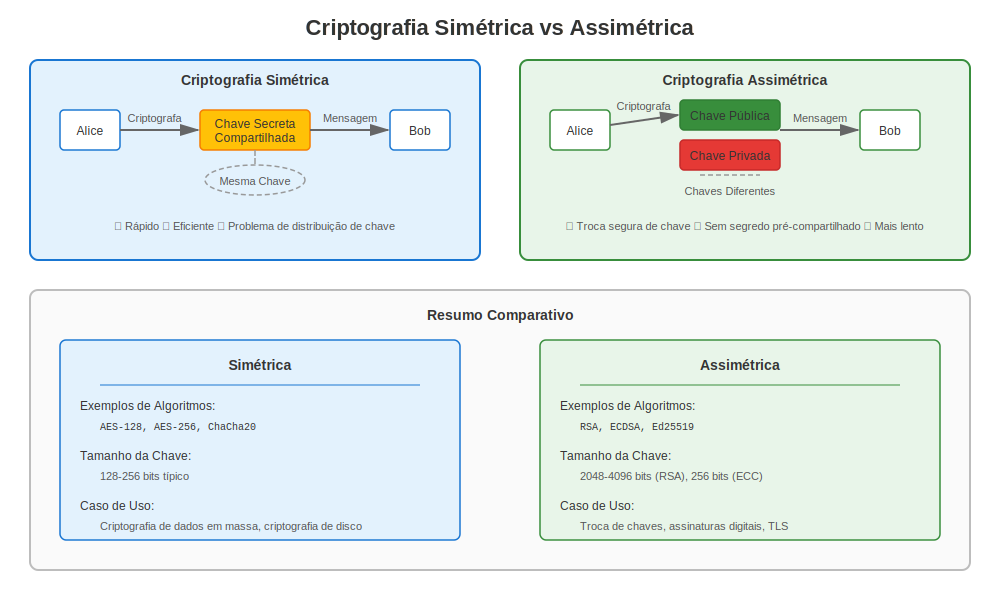
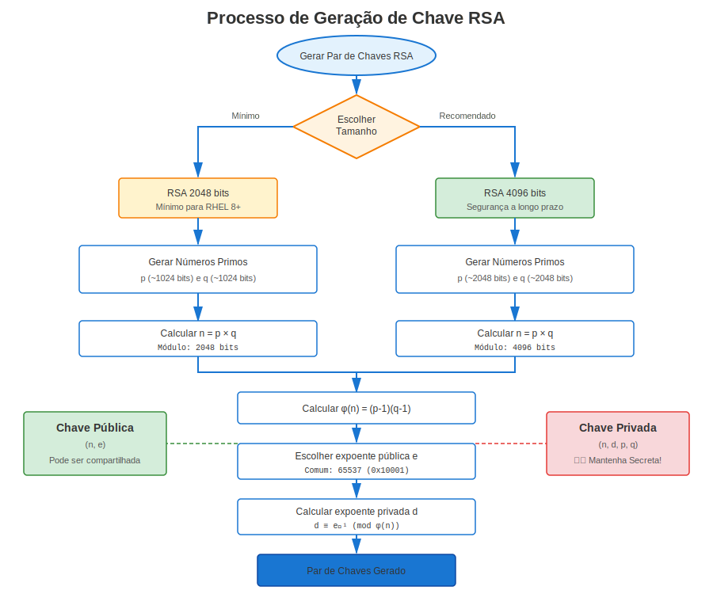
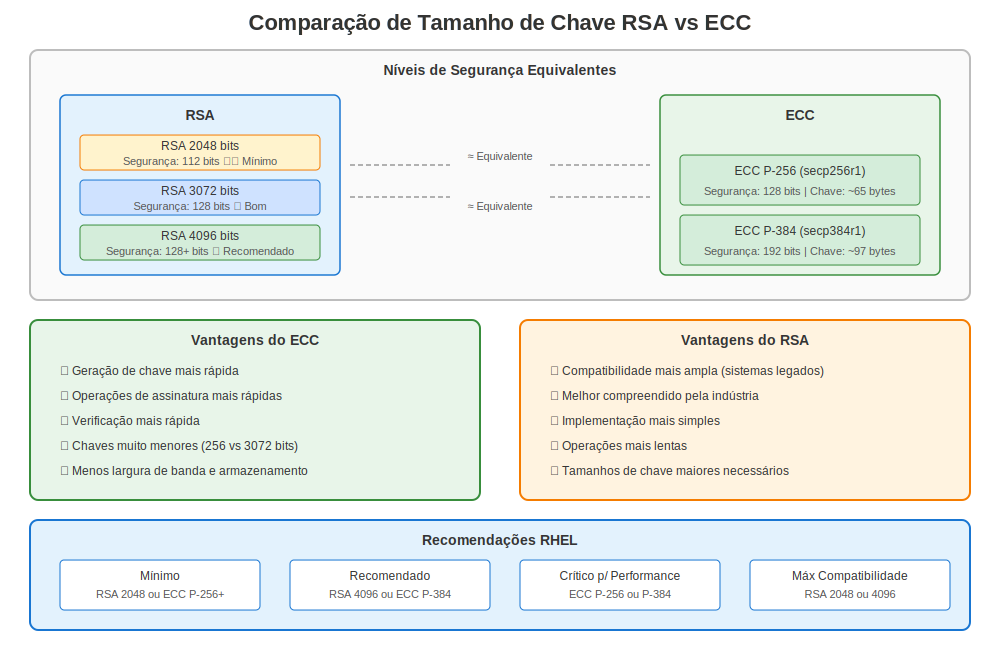

# Capítulo 4: Criptografia Básica para Administradores RHEL

> **Foco Prático:** Aprenda os conceitos de criptografia necessários para gerenciar certificados no RHEL - não é necessário um doutorado!

## 4.1 Simétrica vs Assimétrica



Criptografia simétrica (ex. AES) depende de um *único* segredo compartilhado. Em contraste, criptografia assimétrica fornece duas chaves complementares:

* **Chave pública** — compartilhe livremente, usada para criptografia ou verificação de assinatura.
* **Chave privada** — mantenha secreta, usada para descriptografia ou assinatura.

## 4.2 RSA em Poucas Palavras



1. Selecione dois números primos grandes *p* e *q*.
2. Calcule o módulo `n = p × q`.
3. Derive o expoente público `e` e o expoente privado `d` tal que `e × d ≡ 1 (mod φ(n))`.
4. O par `(n, e)` é público; `(n, d)` é privado.

A força deriva da dificuldade de fatorar *n*.

## 4.3 Criptografia de Curva Elíptica (ECC)



ECC oferece segurança comparável com tamanhos de chave muito menores ao operar sobre pontos em curvas elípticas. Curvas populares incluem `secp256r1` (P-256) e Curve25519.

| Algoritmo | Tamanho de chave para segurança de 128 bits |
|-----------|---------------------------------------------|
| RSA | 3072 bits |
| ECC | 256 bits |

## 4.4 Lab de Geração de Chaves (OpenSSL)

```bash
# Gerar chave privada RSA de 3072 bits
openssl genpkey -algorithm RSA -pkeyopt rsa_keygen_bits:3072 -out rsa.key.pem

# Extrair chave pública
openssl pkey -in rsa.key.pem -pubout -out rsa.pub.pem

# Gerar par de chaves EC P-256
openssl ecparam -genkey -name prime256v1 -out ec.key.pem
openssl pkey -in ec.key.pem -pubout -out ec.pub.pem
```

Reutilizaremos essas chaves em capítulos posteriores para criar certificados.

## 4.5 Criptografia Híbrida

No TLS, uma chave de sessão simétrica é trocada *usando* criptografia assimétrica (RSA ou ECDHE). Isso fornece o melhor dos dois mundos: eficiência e troca segura de chaves.

---

## 4.6 Considerações Específicas do RHEL

### Geração de Chaves no RHEL por Versão

**RHEL 7 (OpenSSL 1.0.2k):**
```bash
# Estilo antigo (ainda funciona em todas as versões)
openssl genrsa -out server.key 2048

# Extrair chave pública
openssl rsa -in server.key -pubout -out server.pub
```

**RHEL 8+ (OpenSSL 1.1.1k / 3.5.5):**
```bash
# Estilo moderno (recomendado)
openssl genpkey -algorithm RSA -out server.key -pkeyopt rsa_keygen_bits:2048

# Extrair chave pública
openssl pkey -in server.key -pubout -out server.pub
```

### Tamanhos Mínimos de Chave por Versão RHEL

| Versão RHEL | RSA Mínimo | ECC Mínimo | Aplicado Por |
|-------------|------------|------------|--------------|
| RHEL 7 | Nenhum (fraco permitido) | Nenhum | Configuração manual |
| RHEL 8 | 2048 bits | P-256 | crypto-policy DEFAULT |
| RHEL 9 | 2048 bits | P-256 | crypto-policy DEFAULT |
| RHEL 10 | 2048 bits | P-256 | crypto-policy DEFAULT |

**Recomendação:** Sempre use RSA 2048+ ou ECC P-256+ para compatibilidade!

### Testes no RHEL

```bash
# Gerar par de chaves de teste (RHEL 8+)
openssl genpkey -algorithm RSA -out test.key -pkeyopt rsa_keygen_bits:2048

# Verificar chave
openssl pkey -in test.key -text -noout

# Criar dados de teste
echo "Olá RHEL" > message.txt

# Assinar com chave privada
openssl dgst -sha256 -sign test.key -out message.sig message.txt

# Verificar com chave pública
openssl dgst -sha256 -verify test.pub -signature message.sig message.txt
# Verified OK
```

---

## Referência Rápida

```
┌─────────────────────────────────────────────────────────────────┐
│ CRIPTOGRAFIA PARA ADMINISTRADORES RHEL                          │
├─────────────────────────────────────────────────────────────────┤
│ Assimétrica:   Chave pública (compartilhar) + Privada (secreta) │
│ Algoritmos:    RSA, ECC (Curva Elíptica)                        │
│                                                                 │
│ Tamanhos RSA:  2048 bits (mínimo no RHEL 8+)                    │
│                4096 bits (recomendado)                          │
│                                                                 │
│ Curvas ECC:    P-256 (secp256r1) - mínimo                       │
│                P-384 (secp384r1) - recomendado                  │
│                                                                 │
│ RHEL 7:        openssl genrsa -out key 2048                     │
│ RHEL 8/9/10:   openssl genpkey -algorithm RSA -out key          │
│                                                                 │
│ Caso de uso:   Certificados TLS/SSL                             │
│ Segurança:     Chave privada DEVE ser protegida (chmod 600)     │
└─────────────────────────────────────────────────────────────────┘
```

---

## 🧪 Laboratório Prático

**Lab 02: Geração de Chaves**

Gere pares de chaves RSA e ECC, extraia chaves públicas e compare algoritmos

- 📁 **Localização:** `labs/pt_BR/02-key-generation/`
- ⏱️ **Tempo:** 20-25 minutos
- 🎯 **Nível:** Iniciante

---

**Navegação do Capítulo**

| [← Anterior: Capítulo 3 - Visão Geral das Ferramentas de Certificados do RHEL](03-rhel-tools-overview.md) | [Próximo: Capítulo 5 - Certificados X.509 no RHEL →](05-x509-on-rhel.md) |
|:---|---:|
