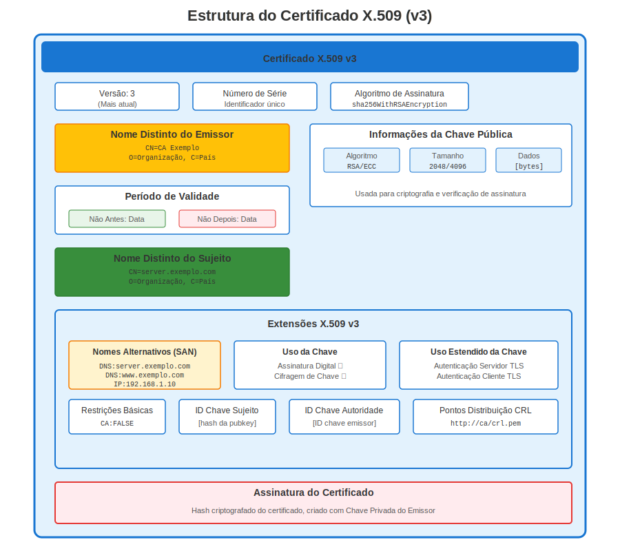
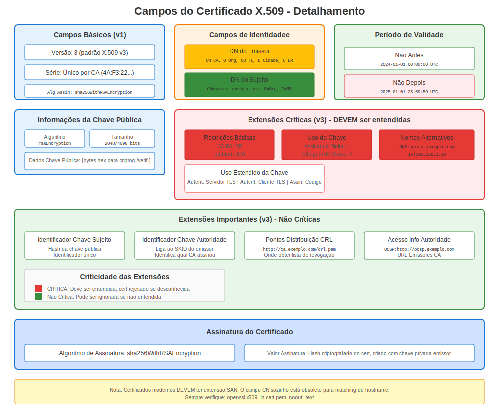
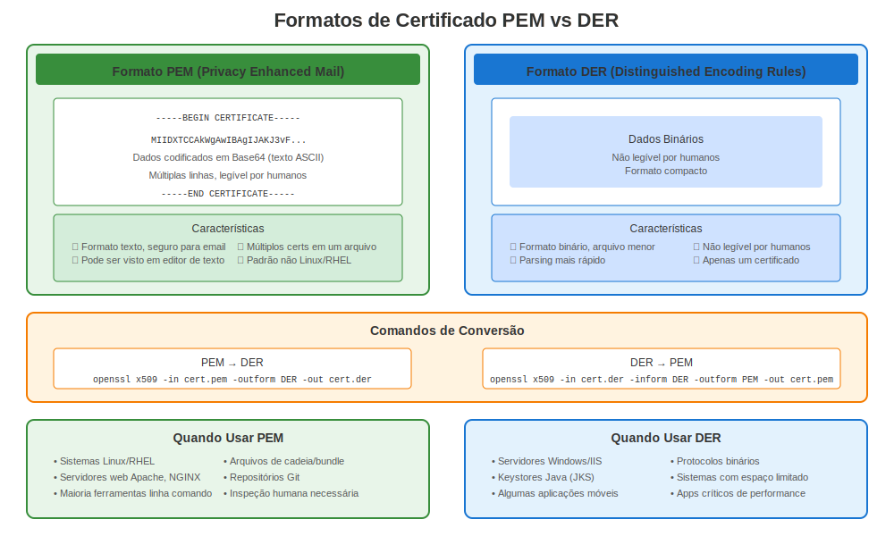

# Capítulo 5: Certificados X.509 no RHEL

> **Formato Padrão:** X.509 é o padrão de certificado usado em todos os lugares no RHEL. Aprenda sua estrutura e como trabalhar com ele em sistemas Red Hat.

## 5.1 Origens do Padrão

X.509 emergiu do projeto de diretório X.500 (ITU-T, 1988) para definir um *certificado de identidade* padrão—um documento que vincula uma chave pública a um nome de assunto, assinado por uma autoridade confiável.

## 5.2 Anatomia do Certificado



| Campo | Propósito |
|-------|-----------|
| Version | Geralmente v3 (adiciona extensões) |
| Serial Number | Único por CA |
| Signature Algorithm | ex. `sha256WithRSAEncryption` |
| Issuer | Nome Distinguido (DN) da CA |
| Validity | Datas `Not Before` e `Not After` |
| Subject | DN da entidade (CN, O, C…) |
| Subject Public Key Info | Algoritmo + Chave |
| Extensions | Key Usage, SAN, CRL DP, etc. |
| Signature | Assinatura digital da CA |



## 5.3 Extensões Comuns

* **Subject Alternative Name (SAN)** — Hosts/IPs vinculados ao cert.
* **Key Usage / Extended Key Usage** — Operações permitidas (servidor TLS, assinatura de código…).
* **Basic Constraints** — Indica se cert pode assinar outros (`CA:TRUE`).

## 5.4 Visualizar um Certificado

```bash
openssl x509 -in server.crt -noout -text
```

Observe que cada seção corresponde à tabela acima.

## 5.5 Codificações PEM vs DER



* **PEM** — Base64 + cabeçalhos `-----BEGIN CERTIFICATE-----` (mais comum no RHEL).
* **DER** — ASN.1 binário, útil para dispositivos embarcados.

---

## 5.6 X.509 em Sistemas RHEL

### Localizações de Certificados no RHEL

```bash
# Localizações padrão de certificados RHEL
/etc/pki/tls/certs/          # Certificados de servidor (públicos)
/etc/pki/tls/private/        # Chaves privadas (modo 600!)
/etc/pki/ca-trust/           # Certificados CA confiáveis
/etc/pki/nssdb/              # Base de dados NSS (Firefox, etc.)

# Localizações específicas de serviço
/etc/httpd/conf/ssl.crt/     # Apache (alternativa)
/etc/nginx/certs/            # NGINX (personalizado)
/var/lib/pgsql/data/         # PostgreSQL
/etc/openldap/certs/         # OpenLDAP
```

### Visualizar Certificados no RHEL

```bash
# Ver detalhes completos do certificado
openssl x509 -in /etc/pki/tls/certs/server.crt -noout -text

# Verificações rápidas (foco sysadmin RHEL)
openssl x509 -in server.crt -noout -subject             # Para quem é?
openssl x509 -in server.crt -noout -issuer              # Quem assinou?
openssl x509 -in server.crt -noout -dates               # Quando é válido?
openssl x509 -in server.crt -noout -ext subjectAltName  # SANs (crítico!)

# Verificar se expirou
openssl x509 -in server.crt -noout -checkend 0
# Saída 0 = válido, Saída 1 = expirado
```

### Diferenças de Versão RHEL para X.509

| Versão RHEL | OpenSSL | Rigor de Validação | Mudanças Chave |
|-------------|---------|-------------------|----------------|
| **RHEL 7** | 1.0.2k | Padrão | SANs recomendados |
| **RHEL 8** | 1.1.1k | Mais rigoroso | SANs fortemente recomendados |
| **RHEL 9** | 3.5.5 | Muito rigoroso | SANs requeridos, SHA-1 bloqueado |
| **RHEL 10** | 3.5.5 | Muito rigoroso | Igual ao RHEL 9 |

**Ponto Chave:** Navegadores modernos e RHEL 9+ **requerem** SANs (Subject Alternative Names)!

### Criar Certificados X.509 no RHEL

```bash
# Fluxo de trabalho completo no RHEL

# Passo 1: Gerar chave privada
openssl genpkey -algorithm RSA -out server.key -pkeyopt rsa_keygen_bits:2048

# Passo 2: Criar CSR (Solicitação de Assinatura de Certificado)
openssl req -new -key server.key -out server.csr \
  -subj "/C=US/ST=State/O=Company/CN=server.example.com" \
  -addext "subjectAltName=DNS:server.example.com,DNS:www.example.com"

# Passo 3: Autoassinado (apenas para testes!)
openssl x509 -req -days 365 -in server.csr -signkey server.key -out server.crt

# Passo 4: Ver seu certificado X.509
openssl x509 -in server.crt -noout -text

# Passo 5: Instalar no RHEL
sudo cp server.crt /etc/pki/tls/certs/
sudo cp server.key /etc/pki/tls/private/
sudo chmod 600 /etc/pki/tls/private/server.key
```

---

## Referência Rápida

```
┌────────────────────────────────────────────────────────────────────┐
│ CERTIFICADOS X.509 NO RHEL                                         │
├────────────────────────────────────────────────────────────────────┤
│ Padrão:       X.509 v3 (com extensões)                             │
│ Codificação:  PEM (Base64, legível por humanos)                    │
│                                                                    │
│ Ver:          openssl x509 -in cert.crt -noout -text               │
│ Assunto:      openssl x509 -in cert.crt -noout -subject            │
│ Expiração:    openssl x509 -in cert.crt -noout -dates              │
│ SANs:         openssl x509 -in cert.crt -noout -ext subjectAltName │
│                                                                    │
│ Localização:  /etc/pki/tls/certs/ (certificados)                   │
│               /etc/pki/tls/private/ (chaves, modo 600!)            │
│                                                                    │
│ Crítico:      SANs são REQUERIDOS no RHEL 9+                       │
│               Assinatura SHA-256+ requerida no RHEL 8+             │
└────────────────────────────────────────────────────────────────────┘
```

---

## 🧪 Laboratório Prático

**Lab 04: Certificados X.509**

Crie certificados autoassinados, gere CSRs, inspecione certificados e converta formatos

- 📁 **Localização:** `labs/pt_BR/04-x509-certificates/`
- ⏱️ **Tempo:** 25-30 minutos
- 🎯 **Nível:** Iniciante

---

**Navegação do Capítulo**

| [← Anterior: Capítulo 4 - Criptografia Básica para Administradores RHEL](04-basic-cryptography.md) | [Próximo: Capítulo 6 - Mergulho Profundo no Repositório de Confiança RHEL →](06-rhel-trust-store.md) |
|:---|---:|
