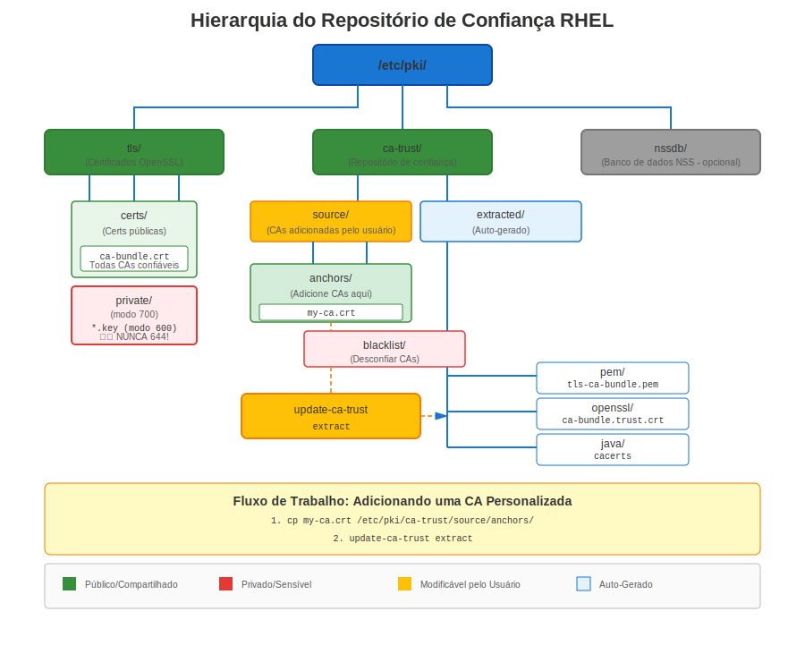
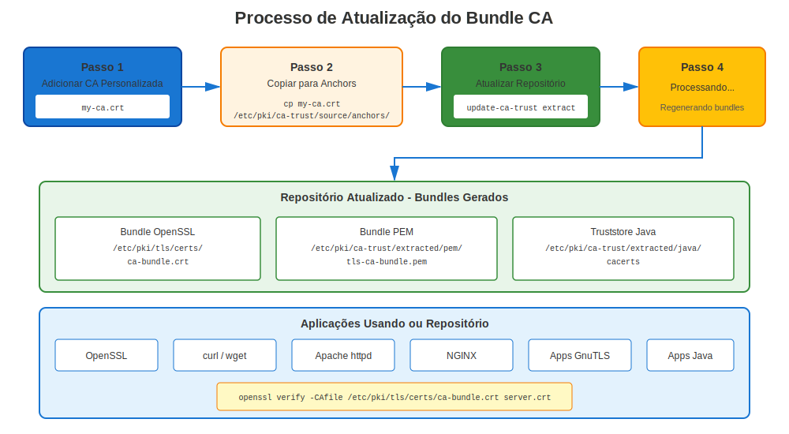

# Capítulo 6: Mergulho Profundo no Repositório de Confiança RHEL

> **Arquitetura de Confiança:** Entender como o RHEL valida certificados e gerencia CAs confiáveis é essencial para solucionar problemas de certificados. Este capítulo vai além do básico: ele cobre os mecanismos internos do `update-ca-trust`, como o p11-kit processa fontes de confiança, o que acontece com certificados duplicados e como depurar problemas de confiança com `trust list`.

## 6.1 Arquitetura do Repositório de Confiança RHEL



### Como o RHEL Valida Certificados

Quando qualquer aplicação no RHEL valida um certificado:

1. **Verificar assinatura do certificado** usando a chave pública do emissor
2. **Encontrar certificado do emissor** no repositório de confiança
3. **Repetir até alcançar a raiz confiável** da CA
4. **Verificar se a CA raiz é confiável** pelo sistema RHEL

**Localização do repositório de confiança:** `/etc/pki/ca-trust/`

### O Papel do p11-kit

O repositório de confiança do RHEL não é um arquivo plano que as aplicações leem diretamente. É um sistema gerenciado construído sobre o **p11-kit**, que fornece um módulo de confiança PKCS#11. Os componentes principais são:

| Componente | Função |
|------------|--------|
| `p11-kit` | Middleware que carrega módulos de confiança e os expõe via PKCS#11 |
| `p11-kit-trust` | O módulo de confiança (`/usr/lib64/pkcs11/p11-kit-trust.so`) que lê os certificados de origem |
| `update-ca-trust` | Script shell que invoca `p11-kit extract` para regenerar os bundles extraídos |
| `trust` | Interface CLI para inspecionar e modificar objetos de confiança gerenciados pelo p11-kit |

Aplicações como `curl`, `wget`, OpenSSL, GnuTLS e NSS consomem os bundles **extraídos**. Elas nunca leem os diretórios de origem diretamente.

---

## 6.2 Estrutura de Diretórios do Repositório de Confiança

**RHEL 7/8:**
```
/etc/pki/ca-trust/
├── source/
│   ├── anchors/                   ← Certificados CA confiáveis adicionados pelo admin
│   ├── blacklist/                 ← Certificados desconfiados adicionados pelo admin
│   └── ca-bundle.legacy.crt       ← Bundle legado (apenas para compatibilidade)
├── extracted/
│   ├── pem/
│   │   ├── tls-ca-bundle.pem      ← Para clientes TLS (curl, wget, Python...)
│   │   ├── email-ca-bundle.pem    ← Para validação de email S/MIME
│   │   └── objsign-ca-bundle.pem  ← Para verificação de assinatura de código
│   ├── openssl/
│   │   └── ca-bundle.trust.crt    ← Formato "certificado confiável" do OpenSSL
│   ├── java/
│   │   └── cacerts                ← Keystore JKS do Java
│   └── edk2/
│       └── cacerts.bin            ← Formato de firmware UEFI
└── README

/usr/share/pki/ca-trust-source/
├── anchors/                       ← Âncoras de confiança fornecidas por pacotes (de RPMs)
├── blacklist/                     ← Certificados desconfiados fornecidos por pacotes
└── ca-bundle.trust.p11-kit        ← Bundle de CAs Mozilla fornecido pelo RPM ca-certificates
```

**RHEL 9/10+:** O diretório `blacklist/` foi renomeado para `blocklist/`:
```
/etc/pki/ca-trust/
├── source/
│   ├── anchors/                   ← Certificados CA confiáveis adicionados pelo admin
│   ├── blocklist/                 ← Certificados desconfiados adicionados pelo admin
│   └── ca-bundle.legacy.crt       ← Bundle legado (apenas para compatibilidade)
├── extracted/
│   └── (mesma estrutura acima)
└── README

/usr/share/pki/ca-trust-source/
├── anchors/                       ← Âncoras de confiança fornecidas por pacotes (de RPMs)
├── blocklist/                     ← Certificados desconfiados fornecidos por pacotes
└── ca-bundle.trust.p11-kit        ← Bundle de CAs Mozilla fornecido pelo RPM ca-certificates
```

> **Convenção de nomenclatura:** Ao longo deste capítulo, `blacklist/` refere-se ao nome de diretório do RHEL 7/8 e `blocklist/` refere-se ao nome de diretório do RHEL 9/10+. Ambos servem o mesmo propósito. Quando você vir um caminho como `source/blacklist/`, substitua por `source/blocklist/` no RHEL 9+.

### Prioridade dos Diretórios de Origem

O pipeline `update-ca-trust` lê certificados de múltiplos diretórios de origem, processados em uma ordem definida:

| Prioridade | Diretório | Gerenciado por |
|------------|-----------|----------------|
| 1 (mais baixa) | `/usr/share/pki/ca-trust-source/` | Pacotes RPM (`ca-certificates`) |
| 2 (mais alta) | `/etc/pki/ca-trust/source/` | Administrador do sistema |

Dentro de cada localização:

- `anchors/` — Certificados colocados aqui são tratados como **CAs confiáveis**
- `blacklist/` (RHEL 7/8) ou `blocklist/` (RHEL 9+) — Certificados colocados aqui são tratados como **explicitamente desconfiados**

Os caminhos `/etc/pki/` sempre sobrescrevem os caminhos `/usr/share/pki/`. Isso segue a convenção padrão do RHEL: `/usr/share/` contém padrões de pacotes, `/etc/` contém personalizações do administrador.

---

## 6.3 O Que Acontece Quando Você Executa `update-ca-trust`

### O Pipeline de Execução

`update-ca-trust` é um script shell (inspecione você mesmo: `cat /usr/bin/update-ca-trust`). Quando você executa `sudo update-ca-trust`, a seguinte sequência ocorre:

**Passo 1: Coletar todas as fontes de confiança**

O p11-kit lê cada arquivo de certificado desses diretórios:

```
/usr/share/pki/ca-trust-source/anchors/
/usr/share/pki/ca-trust-source/blacklist/    ← RHEL 7/8
/usr/share/pki/ca-trust-source/blocklist/    ← RHEL 9+
/usr/share/pki/ca-trust-source/ca-bundle.trust.p11-kit
/etc/pki/ca-trust/source/anchors/
/etc/pki/ca-trust/source/blacklist/          ← RHEL 7/8
/etc/pki/ca-trust/source/blocklist/          ← RHEL 9+
```

Ele aceita os formatos PEM (`.pem`, `.crt`), DER (`.der`) e objetos de confiança p11-kit (`.p11-kit`).

**Passo 2: Analisar atributos de confiança**

Para cada certificado, o p11-kit determina sua disposição de confiança. O formato PEM do arquivo de certificado importa:

- **`-----BEGIN TRUSTED CERTIFICATE-----`** (formato "confiável" do OpenSSL) — Contém o certificado **mais** dados auxiliares de confiança: listas explícitas de OIDs de uso de chave confiáveis e rejeitados. O p11-kit lê esses atributos de confiança/rejeição incorporados diretamente.
- **`-----BEGIN CERTIFICATE-----`** (PEM simples) ou DER — Contém **apenas** o certificado sem metadados de confiança. O p11-kit atribui confiança baseado exclusivamente no diretório onde o arquivo está colocado (`anchors/` = confiável, `blacklist/`/`blocklist/` = desconfiado).
- **Arquivos no formato `.p11-kit`** — Contêm objetos de confiança PKCS#11 com atributos granulares (`trusted`, `x-distrusted`, OIDs de propósito). Usado pelo arquivo `ca-bundle.trust.p11-kit` fornecido com o pacote `ca-certificates`.

> **Crítico:** Os formatos `BEGIN TRUSTED CERTIFICATE` e `BEGIN CERTIFICATE` **não** são intercambiáveis. Um arquivo `BEGIN TRUSTED CERTIFICATE` carrega dados auxiliares de confiança — listas explícitas de OIDs de uso confiável e/ou rejeitado. Quando nenhum uso é listado (atributos de confiança vazios), o p11-kit interpreta como "confiável para nada" — efetivamente desconfiado. Se o mesmo certificado também existe como `BEGIN CERTIFICATE` simples (que implica confiança para todos os propósitos), o p11-kit detecta afirmações de confiança contraditórias e **marca o certificado como desconfiado**. Este conflito ocorre em dois casos: (1) o `BEGIN TRUSTED CERTIFICATE` tem usos rejeitados explícitos, ou (2) tem atributos de confiança **vazios** (nenhum uso confiável, nenhum uso rejeitado). Veja a Seção 6.6 para detalhes.

**Passo 3: Mesclar e resolver conflitos**

Quando o mesmo certificado (correspondido pelo seu conteúdo codificado em DER) aparece em múltiplas localizações de origem, o p11-kit aplica regras de mesclagem:

1. **Desconfiança prevalece sobre confiança.** Se um certificado aparece tanto em `anchors/` quanto em `blacklist/`/`blocklist/`, ele é desconfiado.
2. **Admin sobrescreve pacotes.** Atributos de confiança definidos em `/etc/pki/ca-trust/source/` sobrescrevem aqueles de `/usr/share/pki/ca-trust-source/`.
3. **Atributos explícitos sobrescrevem padrões.** Um arquivo `.p11-kit` com restrições de propósito específicas sobrescreve a confiança genérica dada a um PEM simples em `anchors/`.
4. **Formatos de confiança conflitantes causam desconfiança.** Se o mesmo certificado (impressão digital idêntica) aparece como `BEGIN TRUSTED CERTIFICATE` (ou `.p11-kit`) e como `BEGIN CERTIFICATE`, a desconfiança ocorre em **dois** casos:
   - O `BEGIN TRUSTED CERTIFICATE` tem **usos rejeitados explícitos** — a rejeição contradiz a confiança implícita total do PEM simples.
   - O `BEGIN TRUSTED CERTIFICATE` tem **atributos de confiança vazios** (nenhum uso confiável, nenhum uso rejeitado) — o p11-kit interpreta "nenhum uso listado" como "confiável para nada", o que contradiz o implícito "confiável para todos os propósitos" do PEM simples.

   Em ambos os casos, o p11-kit **marca o certificado como desconfiado**.

> **Esta é a causa mais comum de desconfiança inesperada.** Um administrador copia um arquivo PEM simples em `source/anchors/` sem perceber que o mesmo certificado já existe em `ca-bundle.trust.p11-kit` com atributos de uso rejeitado ou confiança vazia. O resultado: a CA é desconfiada após `update-ca-trust`, e serviços que dependem dela quebram silenciosamente.

**Passo 4: Extrair para bundles específicos de formato**

O p11-kit executa comandos de extração para cada formato de saída:

```bash
# Bundle PEM para TLS (mais comumente consumido)
p11-kit extract --format=pem-bundle \
    --filter=ca-anchors \
    --overwrite \
    --purpose=server-auth \
    /etc/pki/ca-trust/extracted/pem/tls-ca-bundle.pem

# Bundle PEM para email (S/MIME)
p11-kit extract --format=pem-bundle \
    --filter=ca-anchors \
    --overwrite \
    --purpose=email-protection \
    /etc/pki/ca-trust/extracted/pem/email-ca-bundle.pem

# Bundle PEM para assinatura de código
p11-kit extract --format=pem-bundle \
    --filter=ca-anchors \
    --overwrite \
    --purpose=code-signing \
    /etc/pki/ca-trust/extracted/pem/objsign-ca-bundle.pem

# Formato "certificado confiável" do OpenSSL (inclui atributos de confiança/rejeição)
p11-kit extract --format=openssl-bundle \
    --filter=certificates \
    --overwrite \
    /etc/pki/ca-trust/extracted/openssl/ca-bundle.trust.crt

# Keystore Java
p11-kit extract --format=java-cacerts \
    --filter=ca-anchors \
    --overwrite \
    --purpose=server-auth \
    /etc/pki/ca-trust/extracted/java/cacerts

# Formato UEFI EDK2
p11-kit extract --format=edk2-cacerts \
    --filter=ca-anchors \
    --overwrite \
    --purpose=server-auth \
    /etc/pki/ca-trust/extracted/edk2/cacerts.bin
```

**Passo 5: Atualizar symlinks de compatibilidade**

O sistema mantém symlinks para que caminhos legados apontem para os bundles extraídos:

```bash
/etc/pki/tls/certs/ca-bundle.crt → /etc/pki/ca-trust/extracted/pem/tls-ca-bundle.pem
/etc/pki/tls/certs/ca-bundle.trust.crt → /etc/pki/ca-trust/extracted/openssl/ca-bundle.trust.crt
/etc/pki/java/cacerts → /etc/pki/ca-trust/extracted/java/cacerts
```

### `update-ca-trust` vs `update-ca-trust extract`

Estes são **funcionalmente idênticos**. O script `update-ca-trust` aceita `extract` como subcomando, mas executar `update-ca-trust` sem argumentos assume a ação `extract` como padrão. Não há diferença no comportamento.

```bash
# Esses dois comandos produzem resultados idênticos:
sudo update-ca-trust
sudo update-ca-trust extract
```

O subcomando `extract` existe para explicitude em scripts e documentação. Historicamente, `update-ca-trust` também suportava os subcomandos `enable` e `disable` (para alternar entre o novo repositório de confiança gerenciado pelo p11-kit e a abordagem legada de arquivo plano), mas esses não são mais relevantes em sistemas RHEL modernos onde o gerenciamento pelo p11-kit está sempre ativo.

```bash
# Verificar status atual (apenas informativo no RHEL moderno)
update-ca-trust check
```

### Verificando o Que Mudou

Após executar `update-ca-trust`, você pode verificar o resultado:

```bash
# Contar CAs confiáveis no bundle PEM
grep -c '^-----BEGIN CERTIFICATE-----' /etc/pki/ca-trust/extracted/pem/tls-ca-bundle.pem

# Listar todas as CAs confiáveis via p11-kit
trust list --filter=ca-anchors | grep "label:" | wc -l

# Verificar se uma CA específica está presente
trust list | grep -A 4 "My Company CA"
```

---

## 6.4 Adicionando Certificados CA Personalizados



### Passo a Passo

```bash
# Passo 1: Copiar certificado CA (formato PEM ou DER)
sudo cp company-ca.crt /etc/pki/ca-trust/source/anchors/

# Passo 2: Atualizar repositório de confiança
sudo update-ca-trust

# Passo 3: Verificar adição
trust list | grep -i "company"

# Passo 4: Testar
curl https://internal-server.example.com
```

**Funciona de forma idêntica no RHEL 7, 8, 9, 10.**

### Adicionando com Restrições de Propósito

Se uma CA deve ser confiável apenas para autenticação de servidor TLS (não para assinatura de email ou assinatura de código), use o comando `trust` em vez da abordagem simples de cópia de arquivo:

```bash
# Confiar apenas para autenticação de servidor TLS
sudo trust anchor --store /path/to/company-ca.crt

# Ou com restrição explícita de propósito via formato p11-kit
# Criar um arquivo .p11-kit com confiança restrita:
cat > /tmp/company-ca.p11-kit <<'EOF'
[p11-kit-object-v1]
class: x-certificate-extension
label: "My Company CA"
x-public-key-info: <extracted-from-cert>

[p11-kit-object-v1]
class: certificate
label: "My Company CA"
certificate-type: x-509
java-midp-security-domain: 0
trusted: true
x-distrusted: false

[p11-kit-object-v1]
class: x-certificate-extension
label: "My Company CA"
object-id: 2.5.29.37
value: "%06%08%2b%06%01%05%05%07%03%01"
EOF
```

O comando `trust anchor --store` lida com isso automaticamente e é a abordagem recomendada no RHEL 8+.

---

## 6.5 Recursos do Repositório de Confiança por Versão RHEL

### Evolução do Gerenciamento de Confiança

| Versão RHEL | Comando trust | Desconfiança | Diretório de Desconfiança | Notas |
|-------------|---------------|--------------|---------------------------|-------|
| **RHEL 7** | Básico | Limitada | `blacklist/` | Gerenciamento manual |
| **RHEL 8** | Aprimorado | Suporte completo | `blacklist/` | Integração com p11-kit |
| **RHEL 9** | Aprimorado | Suporte completo | **`blocklist/`** | Renomeado de `blacklist/` |
| **RHEL 10** | Aprimorado | Suporte completo | **`blocklist/`** | Igual ao RHEL 9 |

**Aprimoramento RHEL 8+:**
```bash
# Gerenciamento avançado de confiança (RHEL 8+)
trust anchor /path/to/ca.crt --purpose server-auth
trust anchor --remove "pkcs11:id=%CERT_ID%"
trust list --filter=ca-anchors

# Desconfiar de uma CA comprometida
# RHEL 7/8:
sudo cp compromised.crt /etc/pki/ca-trust/source/blacklist/
# RHEL 9+:
sudo cp compromised.crt /etc/pki/ca-trust/source/blocklist/

sudo update-ca-trust
```

---

## 6.6 Certificados Duplicados: O Que Acontece e Como Lidar

### Variantes de Formato PEM e Implicações de Confiança

Antes de discutir duplicatas, é essencial entender os três formatos de cabeçalho PEM que o RHEL usa, pois o formato em si carrega semântica de confiança:

| Cabeçalho PEM | Dados de Confiança | Onde Aparece |
|---------------|-------------------|--------------|
| `-----BEGIN CERTIFICATE-----` | **Nenhum** — apenas certificado X.509 bruto | Arquivos que você baixa, respostas de CSR, exportações manuais |
| `-----BEGIN TRUSTED CERTIFICATE-----` | **Incorporados** — inclui listas auxiliares de OIDs de confiança/rejeição | Bundle extraído do OpenSSL (`ca-bundle.trust.crt`), alguns arquivos fornecidos por vendedores |
| Formato `.p11-kit` (não PEM) | **Estruturados** — objetos de confiança PKCS#11 com atributos granulares | `ca-bundle.trust.p11-kit` fornecido pelo RPM `ca-certificates` |

Você pode inspecionar os atributos de confiança incorporados em um arquivo `BEGIN TRUSTED CERTIFICATE`:

```bash
# Mostrar os dados auxiliares de confiança
openssl x509 -in cert.crt -noout -text -trustout 2>/dev/null | grep -A 5 "Trusted Uses\|Rejected Uses"
```

Um arquivo `BEGIN TRUSTED CERTIFICATE` com "Rejected Uses: TLS Web Server Authentication" e um arquivo `BEGIN CERTIFICATE` para o mesmo cert (que não carrega informação de rejeição) são **contraditórios** da perspectiva do p11-kit.

### Entendendo Certificados "Duplicados"

Dois certificados podem ser duplicados em diferentes níveis:

| Nível de Correspondência | O Que Significa | Como o p11-kit Trata |
|--------------------------|-----------------|----------------------|
| **Codificação DER idêntica, mesmo formato** | Mesmo certificado byte a byte, mesmo encapsulamento de confiança | Deduplicado — aparece uma vez na saída |
| **Codificação DER idêntica, formato de confiança diferente** | Mesmo certificado, mas um tem atributos `BEGIN TRUSTED CERTIFICATE` / `.p11-kit` e o outro tem `BEGIN CERTIFICATE` | **DESCONFIADO se o formato confiável tem usos rejeitados OU atributos de confiança vazios (nenhum uso listado = "confiável para nada")** |
| **Mesmo Subject + Serial + Issuer, DER diferente** | Mesmo certificado lógico, mas recodificado | Tratados como **objetos separados** — ambos são carregados |
| **Mesmo Subject DN, Serial diferente** | Certificados diferentes para a mesma entidade (ex.: CA reemitida) | Ambos válidos, ambos carregados independentemente |

A distinção crítica: **o p11-kit identifica duplicatas pelo conteúdo do certificado codificado em DER**, não por campos de metadados. No entanto, "corresponder" o conteúdo DER é apenas metade da história — o que acontece depois depende inteiramente de se os **formatos de encapsulamento de confiança concordam**:

- Se os bytes DER brutos do certificado são idênticos **e** todas as fontes concordam na disposição de confiança → deduplicado, confiável
- Se os bytes DER brutos do certificado são idênticos **mas** uma fonte tem **OIDs de uso rejeitado** incorporados e a outra não → **afirmações de confiança contraditórias → DESCONFIADO**
- Se os bytes DER brutos do certificado são idênticos **mas** uma fonte tem `BEGIN TRUSTED CERTIFICATE` com **atributos de confiança vazios** (nenhum uso confiável, nenhum uso rejeitado) → p11-kit interpreta como "confiável para nada" → **contradiz confiança implícita total → DESCONFIADO**
- Se os bytes DER brutos do certificado são idênticos e uma fonte tem `BEGIN TRUSTED CERTIFICATE` com **apenas usos confiáveis explícitos** (sem usos rejeitados) → certificado é aceito com os propósitos de confiança especificados
- Se os bytes DER brutos do certificado diferem (mesmo por um único byte) → o p11-kit os trata como **certificados separados** e ambos são incluídos

### Cenário: Formatos de Confiança Conflitantes (Mais Perigoso)

Este é o problema de "duplicata" mais comum e mais prejudicial. Acontece silenciosamente quando um administrador copia um certificado em `source/anchors/` sem perceber que o mesmo certificado já existe no bundle do sistema com **OIDs de uso rejeitado** ou **atributos de confiança vazios** em seus dados de confiança.

**Exemplo:**

```
/usr/share/pki/ca-trust-source/ca-bundle.trust.p11-kit
  → Contém "My Corp CA" como objeto de confiança p11-kit com atributos de confiança específicos
    INCLUINDO usos rejeitados (ex.: "Rejected Uses: TLS Web Server Authentication")
    OU com atributos de confiança vazios (nenhum uso confiável, nenhum uso rejeitado listado)

/etc/pki/ca-trust/source/anchors/my-corp-ca.crt
  → Mesmo "My Corp CA" como PEM simples (-----BEGIN CERTIFICATE-----)
    (sem atributos de confiança — depende do posicionamento no diretório para confiança implícita)
```

**Resultado:** O mesmo conteúdo DER do certificado agora tem **descrições de confiança contraditórias**. O objeto de confiança p11-kit ou rejeita explicitamente certos usos, ou não lista nenhum uso (o que o p11-kit interpreta como "confiável para nada"). O PEM simples não carrega metadados de confiança, implicando confiança para todos os propósitos. O p11-kit não consegue reconciliar estas contradições, e **marca o certificado como desconfiado**. Após executar `update-ca-trust`:

- O certificado desaparece de `tls-ca-bundle.pem`
- `trust list` o mostra com `trust: distrusted`
- Todos os serviços que dependem desta CA começam a falhar com `certificate verify failed`

O mesmo problema ocorre com o formato `BEGIN TRUSTED CERTIFICATE` do OpenSSL quando contém usos rejeitados OU confiança vazia:

```
/etc/pki/ca-trust/extracted/openssl/ca-bundle.trust.crt
  → Contém o certificado como -----BEGIN TRUSTED CERTIFICATE-----
    (com OIDs de "Rejected Uses" incorporados, OU sem nenhum uso confiável/rejeitado listado)

/etc/pki/ca-trust/source/anchors/certificate.crt
  → Mesmo certificado como -----BEGIN CERTIFICATE-----
    (sem dados de confiança incorporados — sem informação de rejeição)
```

**Resultado:** Mesmo resultado — a rejeição ou confiança vazia em uma fonte contradiz a confiança implícita na outra, certificado marcado como **desconfiado**.

> **Informação chave:** Em um `BEGIN TRUSTED CERTIFICATE`, "nenhum uso confiável/rejeitado listado" **NÃO** significa "confiável para todos os propósitos." Significa "confiável para **nada**." Esta é a distinção crítica em relação a um `BEGIN CERTIFICATE` simples em `anchors/`, onde o posicionamento no diretório concede confiança implícita total. Para depurar, procure certificados duplicados em `/etc/pki/ca-trust/source/` e `/usr/share/pki/ca-trust-source/` e verifique se existe algum `BEGIN TRUSTED CERTIFICATE` com nenhum Reject ou confiança vazia que possa conflitar com uma cópia PEM simples.

**Como corrigir:**

```bash
# Opção 1: Remover o PEM simples duplicado de anchors/
sudo rm /etc/pki/ca-trust/source/anchors/my-corp-ca.crt
sudo update-ca-trust

# Opção 2: Se você PRECISA do cert em anchors/, converta-o para o
# formato confiável correspondente aos atributos de confiança existentes:
openssl x509 -in my-corp-ca.crt -addtrust serverAuth \
    -addtrust emailProtection -out my-corp-ca-trusted.crt
sudo cp my-corp-ca-trusted.crt /etc/pki/ca-trust/source/anchors/
sudo update-ca-trust

# Verificar a correção
trust list --filter=ca-anchors | grep -A 3 "My Corp CA"
```

### Cenário: Desconfiança Explícita

```
/usr/share/pki/ca-trust-source/ca-bundle.trust.p11-kit
  → Contém "Legacy Corp CA" com confiança total

/etc/pki/ca-trust/source/blacklist/legacy-corp-ca.crt    ← RHEL 7/8
/etc/pki/ca-trust/source/blocklist/legacy-corp-ca.crt    ← RHEL 9+
  → Mesmo "Legacy Corp CA" como PEM simples, colocado no diretório de desconfiança
```

**Resultado:** A desconfiança prevalece por design. O certificado é excluído de `tls-ca-bundle.pem` e marcado como desconfiado no bundle do OpenSSL. Este é o comportamento esperado quando um admin intencionalmente desconfia de uma CA.

### Cenário: Certificados Quase Idênticos (DER Diferente)

Um problema mais sutil ocorre quando dois certificados parecem iguais, mas não são idênticos byte a byte:

- Um certificado CA foi baixado de duas fontes diferentes com quebra de linha PEM ligeiramente diferente
- Um certificado CA foi recodificado (PEM → DER → PEM) e ganhou metadados de cabeçalho diferentes
- Uma CA foi reemitida com o mesmo Subject DN, mas um novo par de chaves e número serial

Nesses casos, o p11-kit os trata como **certificados distintos**, e ambos acabam nos bundles extraídos. Isso pode causar:

- Saída confusa de `trust list` com aparentes duplicatas
- Tamanho de bundle aumentado (questão cosmética)
- Confusão na construção de cadeia se uma cópia é desconfiada e a outra é confiável, mas elas têm conteúdo DER diferente

### Como Detectar Certificados Duplicados

**Método 1: Comparação de impressão digital + formato**

Extraia impressões digitais de todos os certificados de origem e verifique duplicatas, incluindo qual formato cada arquivo usa:

```bash
# Verificar todos os diretórios de origem para impressões digitais SHA-256 duplicadas
# E relatar o formato PEM de cada arquivo
for dir in /usr/share/pki/ca-trust-source/anchors \
           /etc/pki/ca-trust/source/anchors; do
    for cert in "$dir"/*.crt "$dir"/*.pem 2>/dev/null; do
        [ -f "$cert" ] || continue
        fp=$(openssl x509 -in "$cert" -noout -fingerprint -sha256 2>/dev/null)
        fmt=$(head -1 "$cert" 2>/dev/null)
        [ -n "$fp" ] && echo "$fp  [$fmt]  $cert"
    done
done | sort

# Procurar mesma impressão digital aparecendo com formatos diferentes:
# Se você vê a mesma impressão digital com "BEGIN CERTIFICATE" e
# "BEGIN TRUSTED CERTIFICATE", essa é a origem do conflito de confiança.
```

Se a mesma impressão digital aparece com cabeçalhos PEM diferentes, você encontrou um conflito de formato de confiança que causará desconfiança.

**Método 2: Usando `trust list` para identificar duplicatas**

```bash
# Extrair todos os rótulos e procurar duplicatas
trust list --filter=ca-anchors | grep "^    label:" | sort | uniq -c | sort -rn | head -20
```

Se qualquer rótulo aparece mais de uma vez, investigue mais:

```bash
# Mostrar detalhes completos para uma duplicata suspeita
trust list | grep -B 2 -A 10 "label: DigiCert Global Root G2"
```

**Método 3: Comparar o bundle extraído com arquivos de origem**

```bash
# Contar certificados no bundle PEM
grep -c 'BEGIN CERTIFICATE' /etc/pki/ca-trust/extracted/pem/tls-ca-bundle.pem

# Contar certificados únicos por impressão digital
awk '/BEGIN CERT/,/END CERT/' /etc/pki/ca-trust/extracted/pem/tls-ca-bundle.pem | \
    csplit -z -f /tmp/cert- - '/BEGIN CERTIFICATE/' '{*}' 2>/dev/null
for f in /tmp/cert-*; do
    openssl x509 -in "$f" -noout -fingerprint -sha256 2>/dev/null
done | sort -u | wc -l
rm -f /tmp/cert-*
```

Se a contagem de certificados excede a contagem de impressões digitais únicas, duplicatas existem no bundle extraído.

### Como Identificar Diferenças Entre Duplicatas Suspeitas

Quando você tem dois arquivos de certificado que parecem ser a mesma CA, compare-os em quatro níveis:

**Nível 1: Verificar o formato PEM (causa mais comum de conflitos)**

```bash
# Verificar qual cabeçalho PEM cada arquivo usa
head -1 cert1.crt
head -1 cert2.crt

# "-----BEGIN CERTIFICATE-----"         → PEM simples, sem dados de confiança
# "-----BEGIN TRUSTED CERTIFICATE-----" → Formato confiável do OpenSSL, TEM dados de confiança
```

Se um diz `BEGIN CERTIFICATE` e o outro diz `BEGIN TRUSTED CERTIFICATE`, você encontrou o problema. Eles causarão um conflito de confiança mesmo se o certificado subjacente for idêntico.

**Nível 2: Comparar conteúdo do certificado codificado em DER**

```bash
# Comparar conteúdo codificado em DER (remove cabeçalhos PEM, diferenças de espaço em branco)
openssl x509 -in cert1.crt -outform DER -out /tmp/cert1.der
openssl x509 -in cert2.crt -outform DER -out /tmp/cert2.der
diff /tmp/cert1.der /tmp/cert2.der && echo "DER IDÊNTICO" || echo "DER DIFERENTE"
```

**Nível 3: Comparar campos do certificado**

```bash
# Comparar subject, issuer, serial, validade e chave
for field in subject issuer serial dates fingerprint pubkey; do
    echo "=== $field ==="
    echo "cert1: $(openssl x509 -in cert1.crt -noout -$field 2>/dev/null)"
    echo "cert2: $(openssl x509 -in cert2.crt -noout -$field 2>/dev/null)"
done
```

**Nível 4: Comparar atributos de confiança incorporados (se formato TRUSTED CERTIFICATE)**

```bash
# Mostrar atributos de confiança para cada arquivo
echo "=== atributos de confiança cert1 ==="
openssl x509 -in cert1.crt -noout -text -trustout 2>/dev/null | grep -A 5 "Trusted Uses\|Rejected Uses"
echo "=== atributos de confiança cert2 ==="
openssl x509 -in cert2.crt -noout -text -trustout 2>/dev/null | grep -A 5 "Trusted Uses\|Rejected Uses"
```

**Descobertas comuns:**

| Observação | Explicação Provável | Impacto |
|------------|---------------------|---------|
| Mesma impressão digital, mesmo formato PEM | Duplicata inofensiva — p11-kit deduplica | Nenhum |
| Mesma impressão digital, **formato PEM diferente** (formato confiável com usos rejeitados OU confiança vazia) | Contradição de confiança — usos rejeitados ou "confiável para nada" vs confiança implícita total | **Certificado marcado DESCONFIADO** |
| Mesmo subject + serial, impressão digital diferente | Certificado recodificado ou adulterado | Ambos carregados como objetos separados |
| Mesmo subject, serial diferente | Certificado CA reemitido (novo par de chaves ou renovado) | Ambos carregados independentemente |
| Mesmo subject + serial + impressão digital, saída de `trust list` diferente | Mesmo certificado com atributos de confiança diferentes aplicados | Possível desconfiança |

### Limpando Duplicatas

**Se o certificado já está no bundle do sistema (caso mais comum):**

Um certificado em `anchors/` que já existe em `ca-bundle.trust.p11-kit` **nem sempre é inofensivo** — se a cópia no bundle do sistema tem OIDs de uso rejeitado ou atributos de confiança vazios, a duplicata PEM simples causa desconfiança. Sempre verifique os atributos de confiança antes de assumir que uma duplicata é benigna.

```bash
# 1. Verificar o formato do arquivo em anchors/
head -1 /etc/pki/ca-trust/source/anchors/suspect.crt

# 2. Encontrar a impressão digital
openssl x509 -in /etc/pki/ca-trust/source/anchors/suspect.crt -noout -fingerprint -sha256

# 3. Verificar se esse certificado existe no bundle do sistema
trust list | grep -B5 -A5 "<subject do cert>"

# 4. Se o certificado já existe no bundle do sistema com atributos
#    de confiança adequados, remova a duplicata de anchors/:
sudo rm /etc/pki/ca-trust/source/anchors/suspect.crt
sudo update-ca-trust

# 5. Verificar se o certificado agora está confiável (não desconfiado)
trust list --filter=ca-anchors | grep -A 3 "<subject do cert>"
```

**Se você precisa manter o certificado em anchors/ (CA personalizada que não está no bundle do sistema):**

```bash
# Garantir que o formato do arquivo corresponda ao que o p11-kit espera.
# Para CAs personalizadas que não estão no bundle do sistema, PEM simples está correto:
openssl x509 -in suspect.crt -out /etc/pki/ca-trust/source/anchors/suspect.crt
sudo update-ca-trust
```

---

## 6.7 Usando `trust list` para Identificar Certificados Desconfiados

O comando `trust list` é a ferramenta principal para inspecionar o estado do repositório de confiança após `update-ca-trust` ter sido executado.

### Uso Básico

```bash
# Listar todos os objetos de confiança (confiáveis + desconfiados)
trust list

# Listar apenas âncoras de CA confiáveis
trust list --filter=ca-anchors

# Listar apenas certificados desconfiados
trust list --filter=blacklist     # RHEL 7/8
trust list --filter=blocklist     # RHEL 9+

# Listar todos os certificados (sem filtrar por disposição de confiança)
trust list --filter=certificates
```

### Anatomia da Saída de `trust list`

Cada entrada na saída de `trust list` se parece com isto:

```
pkcs11:id=%DE%28%F4%A4%FF%E5%B9%2F%A3%C5%03%D1%A3%49%A7%F9%96%2A%82%12;type=cert
    type: certificate
    label: DigiCert Global Root G2
    trust: anchor
    category: authority

pkcs11:id=%01%02%03...;type=cert
    type: certificate
    label: Legacy Compromised CA
    trust: distrusted
    category: authority
```

| Campo | Significado |
|-------|-------------|
| `pkcs11:id=...` | URI PKCS#11 identificando unicamente este objeto |
| `type` | Sempre `certificate` para certs de CA |
| `label` | Nome legível por humanos (CN do subject do certificado) |
| `trust: anchor` | Certificado é **confiável** como uma CA |
| `trust: distrusted` | Certificado é **explicitamente desconfiado** |
| `category: authority` | Certificado é uma CA (tem Basic Constraints CA:TRUE) |
| `category: other-entry` | Certificado é uma entidade final ou não classificado |

### Encontrando Certificados Desconfiados

```bash
# Listar todos os certificados desconfiados com seus rótulos
trust list --filter=blacklist     # RHEL 7/8
trust list --filter=blocklist     # RHEL 9+

# Contar certificados desconfiados
trust list --filter=blocklist | grep "^pkcs11:" | wc -l    # RHEL 9+

# Buscar um certificado desconfiado específico
trust list --filter=blocklist | grep -B 1 -A 4 "Symantec"  # RHEL 9+
```

### Rastreando um Certificado Desconfiado até Sua Origem

Quando `trust list --filter=blacklist` (RHEL 7/8) ou `trust list --filter=blocklist` (RHEL 9+) mostra um certificado que você não esperava estar desconfiado, você precisa encontrar de onde a desconfiança se origina:

```bash
# Passo 1: Obter o rótulo do certificado desconfiado
trust list --filter=blacklist     # RHEL 7/8
trust list --filter=blocklist     # RHEL 9+
# Exemplo de saída:
# pkcs11:id=%AB%CD...;type=cert
#     type: certificate
#     label: Suspicious CA
#     trust: distrusted
#     category: authority

# Passo 2: Verificar diretório de desconfiança do admin
# RHEL 7/8: blacklist/  |  RHEL 9+: blocklist/
for distrust_dir in /etc/pki/ca-trust/source/blacklist \
                    /etc/pki/ca-trust/source/blocklist; do
    [ -d "$distrust_dir" ] || continue
    echo "=== $distrust_dir ==="
    ls -la "$distrust_dir"/
    for f in "$distrust_dir"/*; do
        [ -f "$f" ] || continue
        subj=$(openssl x509 -in "$f" -noout -subject 2>/dev/null)
        echo "$f: $subj"
    done
done

# Passo 3: Verificar diretório de desconfiança fornecido por pacotes
for distrust_dir in /usr/share/pki/ca-trust-source/blacklist \
                    /usr/share/pki/ca-trust-source/blocklist; do
    [ -d "$distrust_dir" ] || continue
    echo "=== $distrust_dir ==="
    ls -la "$distrust_dir"/
    for f in "$distrust_dir"/*; do
        [ -f "$f" ] || continue
        subj=$(openssl x509 -in "$f" -noout -subject 2>/dev/null)
        echo "$f: $subj"
    done
done

# Passo 4: Verificar o bundle principal do p11-kit para atributos de desconfiança inline
grep -A 5 "Suspicious CA" /usr/share/pki/ca-trust-source/ca-bundle.trust.p11-kit
# Procurar por "x-distrusted: true" ou "nss-mozilla-ca-policy: false"
```

**Interpretação dos resultados:**

| Encontrado em | Significado | Ação |
|---------------|-------------|------|
| `/etc/pki/ca-trust/source/blacklist/` (RHEL 7/8) ou `blocklist/` (RHEL 9+) | Admin explicitamente desconfiou | Intencional — verifique com a equipe se inesperado |
| `/usr/share/pki/ca-trust-source/blacklist/` (RHEL 7/8) ou `blocklist/` (RHEL 9+) | Pacote RPM desconfiou | Mozilla/Red Hat revogou confiança — verifique avisos de segurança |
| `ca-bundle.trust.p11-kit` com atributos de desconfiança | Mozilla removeu confiança upstream | Normal — CA foi desconfiada pelo programa de raiz Mozilla NSS |
| **Não encontrado em nenhum diretório de desconfiança** | Provavelmente um conflito de formato de confiança — mesmo cert existe como `BEGIN CERTIFICATE` e `BEGIN TRUSTED CERTIFICATE` / `.p11-kit` | Verifique `source/anchors/` para um PEM simples duplicado de um cert já no bundle do sistema (Seção 6.6) |

### Exemplo Prático: Depurando uma CA Desconfiada

Um serviço falha com `certificate verify failed` e você suspeita que a CA foi desconfiada:

```bash
# 1. Identificar a CA a partir do certificado que está falhando
openssl x509 -in /etc/pki/tls/certs/server.crt -noout -issuer
# issuer=CN = Internal Corp CA, O = CorpCo

# 2. Verificar se o emissor é confiável
trust list --filter=ca-anchors | grep -A 3 "Internal Corp CA"
# Nenhuma saída significa que NÃO está nas âncoras confiáveis

# 3. Verificar se está ativamente desconfiado
trust list --filter=blacklist | grep -A 3 "Internal Corp CA"   # RHEL 7/8
trust list --filter=blocklist | grep -A 3 "Internal Corp CA"   # RHEL 9+
# Se encontrado aqui, a CA está explicitamente desconfiada

# 4. Verificar se está presente
trust list | grep -A 3 "Internal Corp CA"
# Se não encontrado em nenhum lugar, nunca foi adicionado ao repositório de confiança

# 5. Se desconfiado, encontrar o arquivo de origem (verifica caminhos RHEL 7/8 e 9+)
find /etc/pki/ca-trust/source/blacklist/ \
     /etc/pki/ca-trust/source/blocklist/ \
     /usr/share/pki/ca-trust-source/blacklist/ \
     /usr/share/pki/ca-trust-source/blocklist/ \
     -type f 2>/dev/null | while read f; do
    if openssl x509 -in "$f" -noout -subject 2>/dev/null | grep -qi "Internal Corp CA"; then
        echo "ENCONTRADO: $f"
    fi
done

# 6. Se NÃO encontrado em nenhum diretório de desconfiança, verificar conflitos de formato de confiança:
#    procurar um PEM simples em anchors/ que duplica um cert no bundle do sistema
for f in /etc/pki/ca-trust/source/anchors/*; do
    [ -f "$f" ] || continue
    if openssl x509 -in "$f" -noout -subject 2>/dev/null | grep -qi "Internal Corp CA"; then
        echo "DUPLICATA EM ANCHORS: $f"
        echo "  Formato: $(head -1 "$f")"
        echo "  Verifique se o mesmo cert existe em ca-bundle.trust.p11-kit com formato de confiança diferente"
    fi
done

# 7. Verificar também o bundle principal do p11-kit
grep -B 2 -A 10 "Internal Corp CA" \
    /usr/share/pki/ca-trust-source/ca-bundle.trust.p11-kit
```

### Restaurando Confiança para um Certificado Desconfiado

Se você determinar que um certificado foi incorretamente desconfiado:

```bash
# Se a entrada de desconfiança está em /etc/pki/ (gerenciada pelo admin)
# RHEL 7/8:
sudo rm /etc/pki/ca-trust/source/blacklist/the-cert.crt
# RHEL 9+:
sudo rm /etc/pki/ca-trust/source/blocklist/the-cert.crt

sudo update-ca-trust

# Se a desconfiança vem do pacote ca-certificates, você precisa
# sobrescrevê-la adicionando o certificado como âncora confiável:
sudo cp the-cert.crt /etc/pki/ca-trust/source/anchors/
sudo update-ca-trust
# Nota: isso funciona porque âncoras do admin sobrescrevem desconfiança
# de nível de pacote para certificados correspondidos por conteúdo DER.

# Verificar se o certificado agora está confiável
trust list --filter=ca-anchors | grep -A 3 "The Cert Label"
```

> **Aviso:** Sobrescrever uma decisão de desconfiança da Mozilla/Red Hat só deve ser feito se você tiver uma razão de negócio específica e entender as implicações de segurança. CAs são desconfiadas por motivo (comprometimento, emissão incorreta, violações de política).

---

## 6.8 Depuração Avançada com `trust` e `p11-kit`

### Inspecionando Objetos de Confiança Individuais

```bash
# Despejar os atributos PKCS#11 completos para um certificado específico
trust dump --filter="pkcs11:id=%DE%28%F4%A4..." 

# Listar todos os atributos de todos os objetos de confiança (verboso, saída grande)
trust dump
```

### Verificando o Pipeline de Extração

Se você suspeita que `update-ca-trust` não está produzindo a saída esperada:

```bash
# Executar a extração manualmente com saída verbosa
p11-kit extract --format=pem-bundle \
    --filter=ca-anchors \
    --purpose=server-auth \
    /tmp/test-tls-bundle.pem

# Comparar com o bundle do sistema
diff <(sort /tmp/test-tls-bundle.pem) \
     <(sort /etc/pki/ca-trust/extracted/pem/tls-ca-bundle.pem)

# Executar com log de depuração do p11-kit
P11_KIT_DEBUG=all update-ca-trust 2>&1 | head -100
```

### Verificando Completude da Cadeia de Certificados

```bash
# Verificar um certificado de servidor contra o repositório de confiança do sistema
openssl verify -CAfile /etc/pki/ca-trust/extracted/pem/tls-ca-bundle.pem server.crt

# Se a cadeia tem intermediários, inclua-os:
openssl verify -CAfile /etc/pki/ca-trust/extracted/pem/tls-ca-bundle.pem \
    -untrusted intermediate.crt server.crt

# Mostrar a cadeia completa que o OpenSSL construiria:
openssl verify -show_chain -CAfile /etc/pki/ca-trust/extracted/pem/tls-ca-bundle.pem server.crt
```

### Verificação Cruzada do Bundle OpenSSL

O formato "certificado confiável" do OpenSSL (`ca-bundle.trust.crt`) inclui atributos de confiança/rejeição incorporados que são distintos do bundle PEM simples. Você pode inspecioná-los:

```bash
# Mostrar atributos de confiança para certificados no bundle OpenSSL
openssl x509 -in /etc/pki/ca-trust/extracted/openssl/ca-bundle.trust.crt \
    -noout -text -trustout 2>/dev/null | grep -A 2 "Trusted Uses\|Rejected Uses"
```

### Verificando a Keystore Java

```bash
# Listar todas as entradas no repositório de confiança Java
keytool -list -cacerts -storepass changeit 2>/dev/null | grep "trustedCertEntry" | wc -l

# Buscar uma CA específica
keytool -list -cacerts -storepass changeit 2>/dev/null | grep -i "company"
```

---

## 6.9 Solução de Problemas de Confiança

### Abordagem Sistemática

**Sintoma:** Verificação de certificado falhou

**Passo 1: Identificar qual certificado está falhando e quem o emitiu**

```bash
# Obter a cadeia de emissores de um servidor remoto
openssl s_client -connect server.example.com:443 -showcerts </dev/null 2>/dev/null | \
    openssl x509 -noout -issuer -subject

# Ou de um arquivo de certificado local
openssl x509 -in server.crt -noout -issuer -subject -serial
```

**Passo 2: Verificar se a CA emissora está no repositório de confiança**

```bash
trust list --filter=ca-anchors | grep -i "ISSUER_CN_HERE"
```

**Passo 3: Verificar se a CA emissora está desconfiada**

```bash
trust list --filter=blacklist | grep -i "ISSUER_CN_HERE"    # RHEL 7/8
trust list --filter=blocklist | grep -i "ISSUER_CN_HERE"    # RHEL 9+
```

**Passo 4: Se ausente, adicione-a**

```bash
sudo cp issuer-ca.crt /etc/pki/ca-trust/source/anchors/
sudo update-ca-trust
```

**Passo 5: Se desconfiada, encontre a origem e decida a ação**

```bash
# Rastrear a origem da desconfiança (veja Seção 6.7)
# Verifica caminhos RHEL 7/8 (blacklist) e RHEL 9+ (blocklist)
find /etc/pki/ca-trust/source/blacklist/ \
     /etc/pki/ca-trust/source/blocklist/ \
     /usr/share/pki/ca-trust-source/blacklist/ \
     /usr/share/pki/ca-trust-source/blocklist/ \
     -name '*.crt' -o -name '*.pem' 2>/dev/null | while read f; do
    openssl x509 -in "$f" -noout -subject 2>/dev/null
done
```

### Problemas Comuns do Repositório de Confiança

| Problema | Causa | Solução |
|----------|-------|---------|
| CA não encontrada após adicionar a anchors/ | Esqueceu de executar `update-ca-trust` | Execute `sudo update-ca-trust` |
| **CA desconfiada após adicionar a anchors/** | **PEM simples conflita com formato `TRUSTED CERTIFICATE` ou `.p11-kit` existente que tem usos rejeitados ou confiança vazia** | **Remova a duplicata de anchors/ — o bundle do sistema já a contém (Seção 6.6)** |
| CA ainda desconfiada após adicionar a anchors/ | Conteúdo DER difere da cópia desconfiada | Compare impressões digitais; garanta certificado idêntico |
| Aplicação Java não confia na CA | Keystore Java não regenerada | Execute `sudo update-ca-trust` (reconstrói `cacerts`) |
| Confiança restaurada após reinício | Admin adicionou cert a `/usr/share/` (sobrescrito por atualizações de RPM) | Sempre use `/etc/pki/ca-trust/source/anchors/` |
| `trust list` mostra entradas duplicadas | Mesma CA de subject de múltiplas fontes com conteúdo DER diferente | Identifique e remova o arquivo de origem redundante |
| `update-ca-trust` falha silenciosamente | Arquivo de certificado corrompido nas origens | Verifique erros de sintaxe: `openssl x509 -in suspect.crt -noout` |

---

## Referência Rápida

```
┌────────────────────────────────────────────────────────────────────────────────┐
│ REFERÊNCIA RÁPIDA DO REPOSITÓRIO DE CONFIANÇA RHEL                             │
├────────────────────────────────────────────────────────────────────────────────┤
│                                                                                │
│  Adicionar CA:  sudo cp ca.crt /etc/pki/ca-trust/source/anchors/               │
│                 sudo update-ca-trust                                           │
│                                                                                │
│  Desconfiar:    sudo cp bad.crt /etc/pki/ca-trust/source/blacklist/            │
│                 (RHEL 7/8) ou .../source/blocklist/ (RHEL 9+)                  │
│                 sudo update-ca-trust                                           │
│                                                                                │
│  Verificar:     trust list --filter=ca-anchors | grep "Nome da CA"             │
│                 openssl verify -CAfile /etc/pki/ca-trust/extracted/            │
│                     pem/tls-ca-bundle.pem cert.crt                             │
│                                                                                │
│  Desconfiados:  trust list --filter=blacklist  (RHEL 7/8)                      │
│                 trust list --filter=blocklist  (RHEL 9+)                       │
│                                                                                │
│  Duplicatas:    trust list --filter=ca-anchors | grep "label:" |               │
│                     sort | uniq -c | sort -rn                                  │
│                                                                                │
│  Comparar:      openssl x509 -in a.crt -outform DER | sha256sum                │
│                 openssl x509 -in b.crt -outform DER | sha256sum                │
│                                                                                │
│  Depurar:       P11_KIT_DEBUG=all update-ca-trust 2>&1                         │
│                                                                                │
│  Dirs origem:   /etc/pki/ca-trust/source/{anchors,blacklist|blocklist}/        │
│                 /usr/share/pki/ca-trust-source/{anchors,blacklist|blocklist}/  │
│                                                                                │
│  Extraídos:     /etc/pki/ca-trust/extracted/pem/tls-ca-bundle.pem              │
│                 /etc/pki/ca-trust/extracted/openssl/ca-bundle.trust.crt        │
│                 /etc/pki/ca-trust/extracted/java/cacerts                       │
│                                                                                │
│  Pipeline:      update-ca-trust = update-ca-trust extract (idênticos)          │
│                                                                                │
│  Prioridade:    blacklist/blocklist > anchors                                  │
│                 /etc/pki/ > /usr/share/pki/                                    │
│                 atributos .p11-kit > padrões PEM simples                       │
│                                                                                │
│  PERIGO:        Nunca adicione um PEM simples "BEGIN CERTIFICATE" em           │
│                 anchors/ se o mesmo cert já existe no bundle do sistema        │
│                 como "BEGIN TRUSTED CERTIFICATE" ou formato .p11-kit.          │
│                 Confiança vazia (sem usos) = "confiável para nada" =           │
│                 DESCONFIADO. Usos rejeitados + PEM simples → também            │
│                 DESCONFIADO.                                                   │
└────────────────────────────────────────────────────────────────────────────────┘
```

---

## 🧪 Laboratório Prático

**Lab 05: Gerenciamento do Repositório de Confiança**

Adicione CAs personalizadas ao repositório de confiança do sistema, gerencie atributos de confiança, detecte duplicatas e depure certificados desconfiados.

- 📁 **Localização:** `labs/pt_BR/05-trust-store/`
- ⏱️ **Tempo:** 45 minutos
- 🎯 **Nível:** Intermediário

---

**Navegação do Capítulo**

| [← Anterior: Capítulo 5 - Certificados X.509 no RHEL](05-x509-on-rhel.md) | [Próximo: Capítulo 7 - Assinaturas Digitais e Verificação no RHEL →](07-signatures-verification.md) |
|:---|---:|
