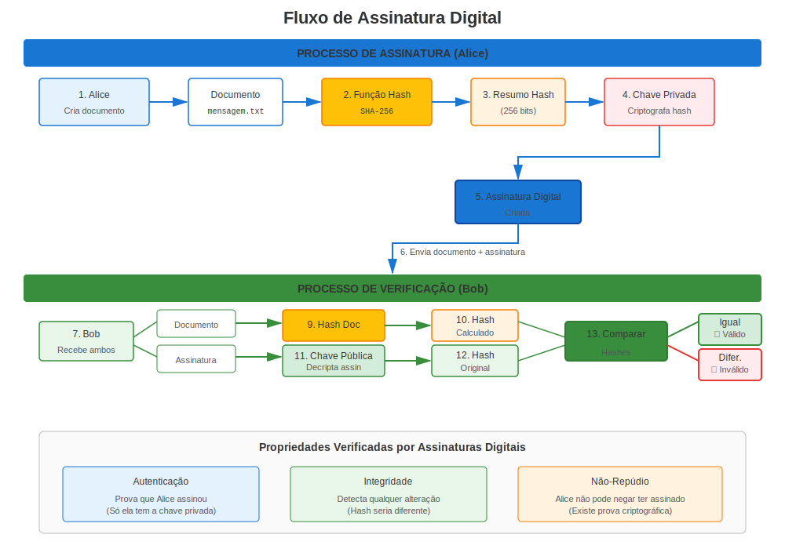
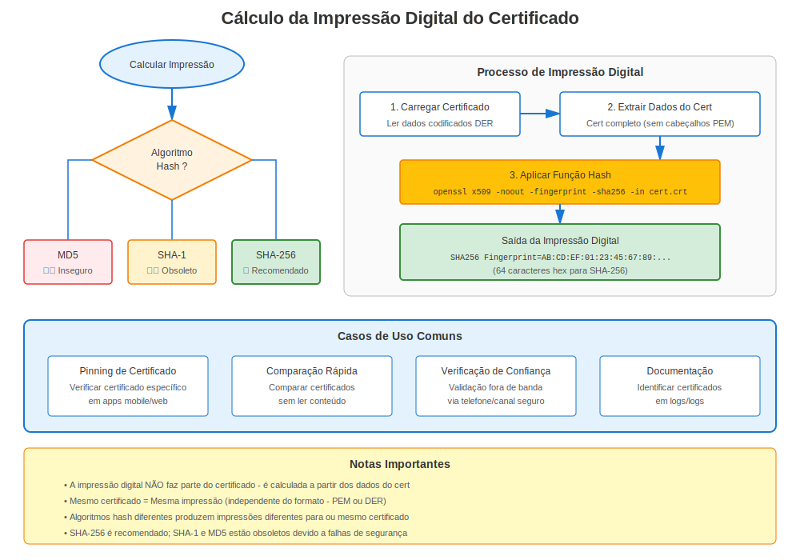

# Capítulo 7: Assinaturas Digitais e Verificação no RHEL

> **Como a Confiança Funciona:** Aprenda como as assinaturas digitais habilitam a validação de certificados em sistemas RHEL.

## 7.1 Funções Hash Criptográficas

Propriedades:
1. Determinísticas
2. Resistência a pré-imagem
3. Resistência a colisões
4. Efeito avalanche

Algoritmos populares: SHA-256, SHA-3, BLAKE2.

## 7.2 Construir Assinaturas



1. Calcular hash da mensagem.
2. Criptografar hash com chave *privada* → assinatura.
3. Receptor descriptografa assinatura com chave *pública* e compara com seu próprio hash.

## 7.3 Impressões Digitais de Certificados



Uma impressão digital é simplesmente o hash do certificado codificado em DER, usado para identificá-lo uniquamente, ex.:

```bash
openssl x509 -in server.crt -noout -fingerprint -sha256
```

## 7.4 Lab: Assinar e Verificar um Arquivo

```bash
# assinar
openssl dgst -sha256 -sign rsa.key.pem -out report.sig report.pdf
# verificar
openssl dgst -sha256 -verify rsa.pub.pem -signature report.sig report.pdf
```

## 7.5 Resumo

Assinaturas vinculam dados a identidades; hashes asseguram integridade. Juntos sustentam a validação de certificados e todas as operações PKI.

---

## 7.6 Algoritmos de Assinatura no RHEL

### Aprovados por Versão RHEL

| Algoritmo | RHEL 7 | RHEL 8 | RHEL 9 | RHEL 10 |
|-----------|--------|--------|--------|---------|
| **SHA-256** | ✅ Sim | ✅ Sim | ✅ Sim | ✅ Sim |
| **SHA-384** | ✅ Sim | ✅ Sim | ✅ Sim | ✅ Sim |
| **SHA-512** | ✅ Sim | ✅ Sim | ✅ Sim | ✅ Sim |
| **SHA-1** | ✅ Sim | ⚠️ Obsoleto | ❌ Bloqueado | ❌ Bloqueado |
| **MD5** | ✅ Sim | ⚠️ Apenas legacy | ❌ Bloqueado | ❌ Bloqueado |

**Crítico:** RHEL 9+ bloqueia SHA-1 e MD5 por segurança!

### Verificar Certificados no RHEL

```bash
# Verificar cadeia de certificado
openssl verify /etc/pki/tls/certs/server.crt

# Verificar contra CA específica
openssl verify -CAfile /etc/pki/tls/certs/ca-bundle.crt server.crt

# Verificar algoritmo de assinatura
openssl x509 -in server.crt -noout -text | grep "Signature Algorithm"
# Deve ser SHA-256+ no RHEL 8+
```

---

## Referência Rápida

```
┌─────────────────────────────────────────────────────────────┐
│ ASSINATURAS DIGITAIS NO RHEL                                │
├─────────────────────────────────────────────────────────────┤
│ Propósito:       Provar autenticidade e integridade         │
│ Como:            Hash + Chave privada = Assinatura          │
│ Verificar:       Assinatura + Chave pública = Hash original │
│                                                             │
│ Aprovados:       SHA-256, SHA-384, SHA-512                  │
│ Obsoleto:        SHA-1 (bloqueado no RHEL 9+)               │
│ Bloqueado:       MD5 (bloqueado no RHEL 9+)                 │
│                                                             │
│ Verificar cert:  openssl verify cert.crt                    │
│ Ver algoritmo:   openssl x509 -noout -text | grep Signature │
│ Impressão:       openssl x509 -noout -fingerprint -sha256   │
└─────────────────────────────────────────────────────────────┘
```

---

## 🧪 Laboratório Prático

**Lab 03: Assinaturas Digitais**

Assine arquivos, verifique assinaturas e detecte adulterações

- 📁 **Localização:** `labs/pt_BR/03-digital-signatures/`
- ⏱️ **Tempo:** 20 minutos
- 🎯 **Nível:** Iniciante

---

**Navegação do Capítulo**

| [← Anterior: Capítulo 6 - Mergulho Profundo no Repositório de Confiança RHEL](06-rhel-trust-store.md) | [Próximo: Capítulo 8 - Versões RHEL e Evolução dos Certificados →](../part-02-version-specific/08-rhel-versions-overview.md) |
|:---|---:|
