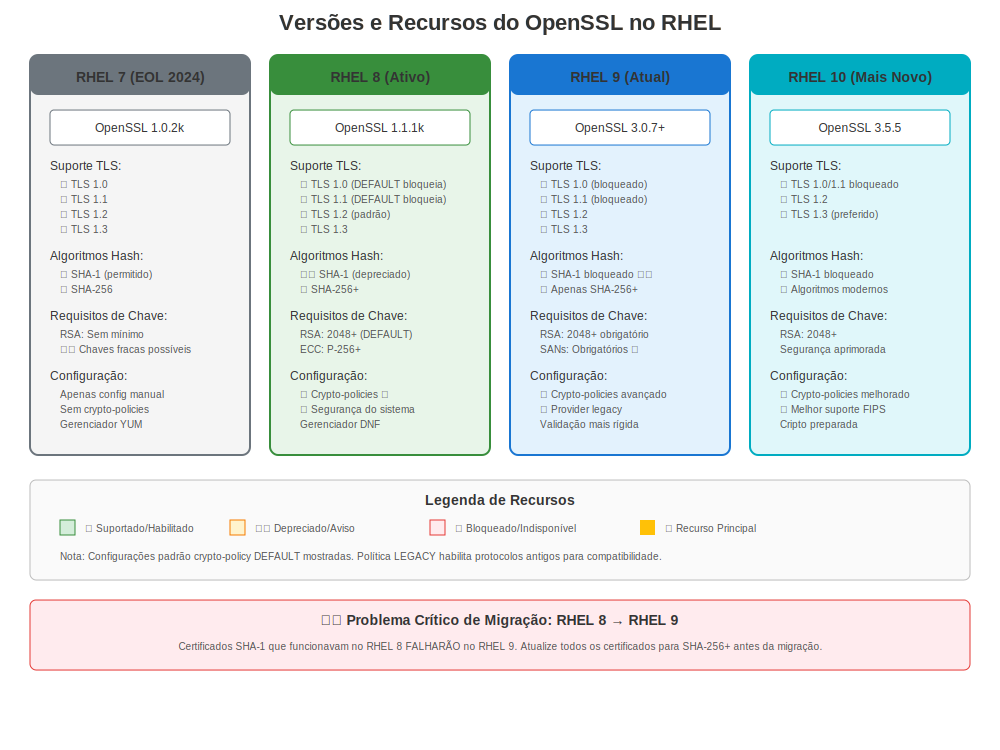

# Capítulo 8: Versões RHEL e Evolução dos Certificados

> **Objetivo de Aprendizagem:** Entender como o gerenciamento de certificados difere entre RHEL 7, 8, 9 e 10 para que você possa identificar rapidamente comportamentos específicos de versão ao resolver problemas.

---

## 8.1 Por Que a Versão RHEL Importa

Ao resolver problemas de certificados no RHEL, a **primeira pergunta** sempre deve ser: "Em qual versão RHEL estou?"

O gerenciamento de certificados evoluiu significativamente entre versões RHEL. O que funciona no RHEL 7 pode falhar no RHEL 9. Entender essas diferenças é crucial para:

- ✅ Escolher a abordagem correta de solução de problemas
- ✅ Identificar erros específicos de versão
- ✅ Planejar migrações
- ✅ Escrever scripts de automatização compatíveis

---

## 8.2 Verificação Rápida de Versão

```bash
# Método 1: Verificar /etc/redhat-release
cat /etc/redhat-release
# Exemplos de saída:
#   Red Hat Enterprise Linux Server release 7.9 (Maipo)
#   Red Hat Enterprise Linux release 8.10 (Ootpa)
#   Red Hat Enterprise Linux release 9.8 (Plow)
#   Red Hat Enterprise Linux release 10.2 (Coughlan)

# Método 2: Usar rpm
rpm -q --queryformat '%{VERSION}\n' redhat-release

# Método 3: Verificar versão OpenSSL (indireto mas útil)
openssl version
# RHEL 7: OpenSSL 1.0.2k
# RHEL 8: OpenSSL 1.1.1k
# RHEL 9: OpenSSL 3.5.5
# RHEL 10: OpenSSL 3.5.5
```

---

## 8.3 Visão Geral de Versões RHEL


| Versão RHEL | Data GA | Suporte Termina | Versão OpenSSL | Característica Chave de Certificado |
|-------------|---------|-----------------|----------------|-------------------------------------|
| **RHEL 7** | Junho 2014 | Junho 2024 | 1.0.2k-26 | Gerenciamento manual tradicional |
| **RHEL 8** | Maio 2019 | Maio 2029 | 1.1.1k-14 | **Crypto-policies introduzidas** |
| **RHEL 9** | Maio 2022 | Maio 2032 | 3.5.5-2 | OpenSSL 3.x, padrões mais rigorosos |
| **RHEL 10** | Maio 2025 | Maio 2035 | 3.5.5-2 | Fortalecimento contínuo, preparação PQC |

> **Fonte:** [Ciclo de Vida de Produtos Red Hat](https://access.redhat.com/support/policy/updates/errata)



---

## 8.4 Resumo de Diferenças Principais

### RHEL 7 (Legado)

**Características:**
- ✅ Estável, bem compreendido
- ✅ Máxima compatibilidade
- ⚠️ TLS 1.0/1.1 habilitado por padrão
- ⚠️ Cifras fracas permitidas
- ⚠️ Gerenciamento manual de certificados

**Pacote:** `openssl-1.0.2k-26.el7_9.x86_64`

**Quando Você Verá:**
- Sistemas legados ainda não migrados
- Aplicações requerendo versões TLS antigas
- Ambientes conservadores

**Comando Chave:**
```bash
# Gerar chave (estilo RHEL 7)
openssl genrsa -out server.key 2048
```

---

### RHEL 8 (Padrão Empresarial Atual)

**Características:**
- ✅ **Crypto-policies em todo o sistema** (mudança de jogo!)
- ✅ TLS 1.2+ por padrão
- ✅ certmonger para renovação automática
- ✅ Suites de cifra modernas
- ⚠️ Mudanças incompatíveis do RHEL 7

**Pacote:** `openssl-1.1.1k-14.el8_6.x86_64`

**Inovação Chave - Crypto-Policies:**
```bash
# Ver política atual
update-crypto-policies --show
# DEFAULT, LEGACY, FUTURE, ou FIPS

# Controle de segurança em todo o sistema!
sudo update-crypto-policies --set FUTURE
```

**Quando Você Verá:**
- Maioria dos deployments empresariais
- Aplicações modernas
- Ambientes FreeIPA

**Comando Chave:**
```bash
# Gerar chave (estilo moderno RHEL 8)
openssl genpkey -algorithm RSA -pkeyopt rsa_keygen_bits:2048 -out server.key
```

---

### RHEL 9 (Padrão Moderno)

**Características:**
- ✅ OpenSSL 3.5.5 com arquitetura de provedores
- ✅ TLS 1.2+ obrigatório
- ✅ Crypto-policies aprimoradas
- ✅ Validação de certificado mais rigorosa
- ⚠️ Mudanças na API OpenSSL 3.x
- ⚠️ Algoritmos legados desabilitados

**Pacote:** `openssl-3.5.5-2.el9_8.x86_64`

**Mudança Maior - Arquitetura de Provedores:**
```bash
# Listar provedores crypto
openssl list -providers
# default, fips, legacy, base

# Algoritmos legados requerem provedor explícito
openssl md5 -provider legacy file.txt
```

**Quando Você Verá:**
- Novos deployments
- Ambientes conscientes de segurança
- Últimas versões de aplicações

**Comando Chave:**
```bash
# Gerar chave EC (RHEL 9)
openssl genpkey -algorithm EC -pkeyopt ec_paramgen_curve:P-256 -out ec.key
```

---

### RHEL 10 (Lançamento Atual)

**Características:**
- ✅ Mesmo OpenSSL 3.5.5 do RHEL 9.8
- ✅ Fortalecimento de segurança contínuo
- ✅ Preparação para criptografia pós-quântica
- ✅ Suporte aprimorado de certificado para contêineres
- ⚠️ Padrões ainda mais rigorosos
- ⚠️ Remoções legadas adicionais

**Pacote:** `openssl-3.5.5-2.el10_2.x86_64`

> **Nota:** RHEL 10.0 GA foi em 20 de maio de 2025. Recursos e capacidades podem evoluir entre versões menores (10.1, 10.2, etc.). Sempre consulte a documentação oficial para seu lançamento específico RHEL 10.x.

**Foco Chave:**
- Base de criptografia resistente a quântica
- Práticas de segurança modernas
- Cargas de trabalho nativas de contêiner e nuvem

**Quando Você Verá:**
- Deployments completamente novos
- Requisitos de segurança de ponta
- Iniciativas de preparação para o futuro

---

## 8.5 Diferenças Críticas de Versão

### Suporte de Versão TLS

| Versão TLS | RHEL 7 | RHEL 8 | RHEL 9 | RHEL 10 |
|------------|--------|--------|--------|---------|
| TLS 1.0 | ✅ Sim | ⚠️ Apenas LEGACY | ❌ Não | ❌ Não |
| TLS 1.1 | ✅ Sim | ⚠️ Apenas LEGACY | ❌ Não | ❌ Não |
| TLS 1.2 | ✅ Sim | ✅ Sim | ✅ Sim | ✅ Sim |
| TLS 1.3 | ❌ Não | ✅ Sim | ✅ Sim (preferido) | ✅ Sim (preferido) |

### Disponibilidade de Ferramentas de Certificados

| Ferramenta | RHEL 7 | RHEL 8 | RHEL 9 | RHEL 10 |
|------------|--------|--------|--------|---------|
| `openssl` | 1.0.2k | 1.1.1k | 3.5.5 | 3.5.5 |
| `certutil` (NSS) | ✅ Sim | ✅ Sim | ✅ Sim | ✅ Sim |
| `update-ca-trust` | ✅ Sim | ✅ Aprimorado | ✅ Aprimorado | ✅ Aprimorado |
| `certmonger` | ✅ Sim | ✅ Aprimorado | ✅ Aprimorado | ✅ Aprimorado |
| `crypto-policies` | ❌ Não | ✅ Sim | ✅ Aprimorado | ✅ Aprimorado |
| `authconfig` | ✅ Sim | ❌ Não (usar authselect) | ❌ Não | ❌ Não |

### Mudanças Chave em Cifra/Algoritmo

| Algoritmo/Característica | RHEL 7 | RHEL 8 | RHEL 9 | RHEL 10 |
|--------------------------|--------|--------|--------|---------|
| 3DES | ✅ Sim | ⚠️ LEGACY | ❌ Não | ❌ Não |
| RC4 | ✅ Sim | ❌ Não | ❌ Não | ❌ Não |
| Assinaturas MD5 | ✅ Sim | ⚠️ LEGACY | ❌ Não | ❌ Não |
| Assinaturas SHA-1 | ✅ Sim | ⚠️ Obsoleto | ❌ Não | ❌ Não |
| RSA < 2048 bits | ✅ Sim | ❌ Não | ❌ Não | ❌ Não |
| Chaves DSA | ✅ Sim | ⚠️ LEGACY | ❌ Não | ❌ Não |

---

## 8.6 Problemas Comuns Específicos de Versão

### Problemas RHEL 7
```bash
# Problema: Suites de cifra antigas aceitas
# Impacto: Vulnerabilidades de segurança
# Solução: Configuração manual de cifras Apache/NGINX
```

### Problemas RHEL 8
```bash
# Problema: Aplicação falha após migração do RHEL 7
# Razão: TLS 1.0/1.1 desabilitado por padrão
# Solução Rápida: Usar temporariamente política LEGACY (não recomendado a longo prazo)
sudo update-crypto-policies --set LEGACY

# Melhor Solução: Atualizar aplicação para suportar TLS 1.2+
```

### Problemas RHEL 9
```bash
# Problema: Comandos OpenSSL falham com erros de provedor
# Razão: Arquitetura de provedores OpenSSL 3.x
# Solução: Especificar provedor explicitamente
openssl md5 -provider legacy file.txt

# Problema: Certificados SHA-1 rejeitados
# Razão: Validação mais rigorosa
# Solução: Reemitir certificados com SHA-256+
```

### Problemas RHEL 10
```bash
# Problema: Padrões ainda mais rigorosos que RHEL 9
# Impacto: Certificados legados podem falhar validação
# Solução: Garantir que todos os certificados usem algoritmos modernos
#          Verificar documentação específica RHEL 10.x para sua versão menor
```

---

## 8.7 Impacto de Migração

### RHEL 7 → RHEL 8
**Impacto em Certificados:** MODERADO
- TLS 1.0/1.1 desabilitado
- Cifras fracas removidas
- Integração certmonger requerida para automatização

**Ação Requerida:**
1. Auditar versões TLS em uso
2. Atualizar configurações de cifra
3. Testar aplicações com TLS 1.2+
4. Considerar crypto-policies

### RHEL 8 → RHEL 9
**Impacto em Certificados:** ALTO
- Mudanças na API OpenSSL 3.x
- Remoção de algoritmos legados
- Validação de certificado mais rigorosa
- Mudanças na arquitetura de provedores

**Ação Requerida:**
1. Testar todas as operações de certificados
2. Atualizar scripts personalizados usando OpenSSL
3. Validar integridade da cadeia de certificados
4. Verificar uso de SHA-1

### RHEL 9 → RHEL 10
**Impacto em Certificados:** BAIXO-MODERADO
- Mesma base OpenSSL (3.5.5)
- Fortalecimento incremental
- Refinamentos de política

**Ação Requerida:**
1. Revisar documentação RHEL 10.x
2. Testar compatibilidade de crypto-policy
3. Validar uso de algoritmos modernos

---

## 8.8 Escolher a Abordagem Certa

### Para Solução de Problemas

```bash
# Sempre começar com verificação de versão
cat /etc/redhat-release

# Depois verificar versão OpenSSL
openssl version

# Para RHEL 8+: Verificar crypto-policy
update-crypto-policies --show 2>/dev/null || echo "Pré-RHEL 8"
```

### Árvore de Decisão de Referência Rápida

```
É RHEL 7?
├─ SIM → Verificar problemas de TLS/cifra legados
│        Configuração manual provavelmente necessária
│        Considerar planejamento de migração
│
└─ NÃO → É RHEL 8?
    ├─ SIM → Verificar crypto-policies primeiro!
    │        Usar certmonger para automatização
    │        Considerar atualização para RHEL 9
    │
    └─ NÃO → É RHEL 9 ou 10?
        └─ SIM → Verificar problemas de provedor OpenSSL 3.x
                 Verificar algoritmos modernos em uso
                 Aproveitar ferramentas aprimoradas
```

---

## 8.9 Conclusões Chave

1. **Sempre verificar versão RHEL primeiro** ao resolver problemas
2. **RHEL 8 introduziu crypto-policies** - mudança de jogo para gerenciamento de certificados
3. **RHEL 9 usa OpenSSL 3.x** - mudanças significativas em API e comportamento
4. **RHEL 10 continua base RHEL 9** - melhorias incrementais
5. **Algoritmos legados removidos progressivamente** entre versões
6. **Testes de migração são críticos** - comportamento de certificados muda significativamente

---

## 8.10 O Que Vem a Seguir?

Agora que você entende as diferenças de versões RHEL, mergulharemos mais fundo em:

- **Capítulo 9:** Gerenciamento de Certificados no RHEL 7 (detalhado)
- **Capítulo 10:** RHEL 8 e Crypto-Policies (detalhado)
- **Capítulo 11:** Segurança Moderna no RHEL 9 (detalhado)
- **Capítulo 12:** Recursos Atuais do RHEL 10 (detalhado)

---

## Cartão de Referência Rápida

```
┌────────────────────────────────────────────────────────────┐
│ REFERÊNCIA RÁPIDA VERSÕES RHEL                             │
├─────────────┬───────────┬──────────────┬───────────────────┤
│ RHEL 7      │ 1.0.2k    │ Manual       │ Amigável legacy   │
│ RHEL 8      │ 1.1.1k    │ Crypto-pols  │ Padrão empresa    │
│ RHEL 9      │ 3.5.5     │ OpenSSL 3.x  │ Moderno seguro    │
│ RHEL 10     │ 3.5.5     │ Fortalecido  │ Preparado futuro  │
└─────────────┴───────────┴──────────────┴───────────────────┘

Verificar versão:    cat /etc/redhat-release
Verificar OpenSSL:   openssl version
Verificar política:  update-crypto-policies --show  (RHEL 8+)
```
---

**Navegação do Capítulo**

| [← Anterior: Capítulo 7 - Assinaturas Digitais e Verificação no RHEL](../part-01-fundamentals/07-signatures-verification.md) | [Próximo: Capítulo 9 - Gerenciamento de Certificados no RHEL 7 →](09-rhel7-management.md) |
|:---|---:|
