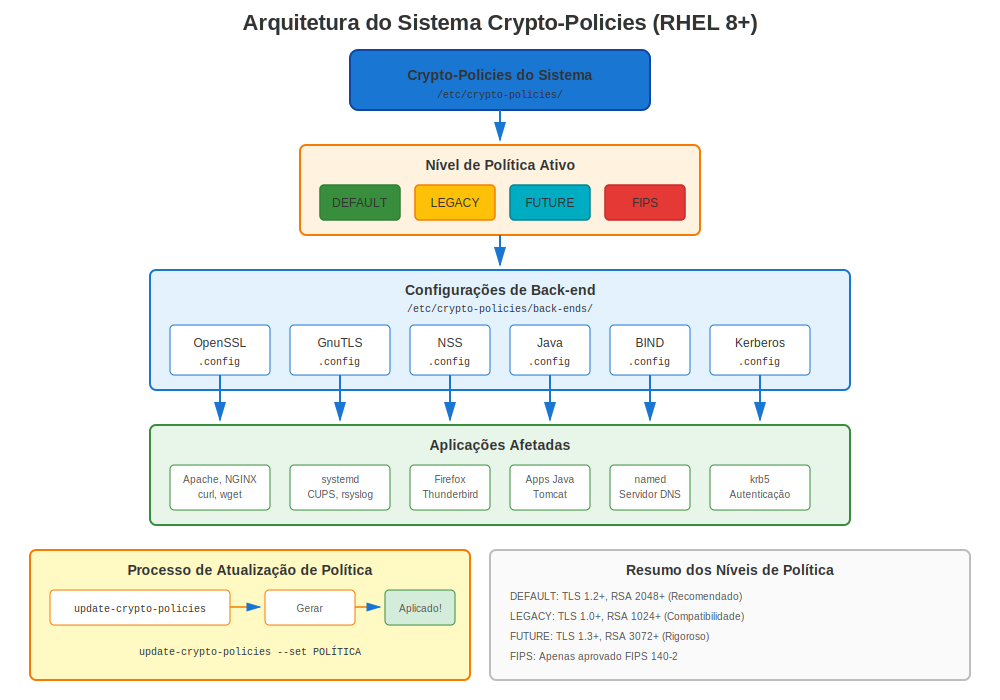
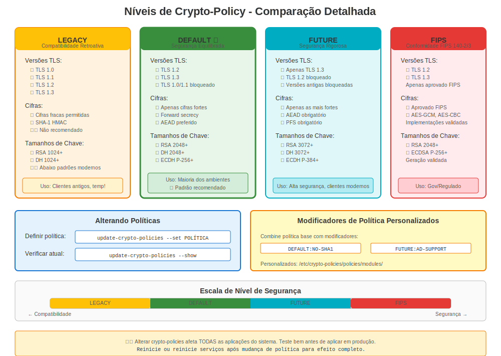

# Capítulo 10: RHEL 8 e Crypto-Policies

> **Mudança Radical:** RHEL 8 introduziu crypto-policies, revolucionando como certificados e criptografia são gerenciados system-wide. Este é o recurso mais importante para entender no RHEL 8.

---

## 10.1 O Que Mudou no RHEL 8?

**Lançamento:** 7 de maio de 2019
**Suporte Até:** 31 de maio de 2029
**Versão Atual:** RHEL 8.10 (em 2024)

**Mudanças Principais Relacionadas a Certificados:**

| Recurso | RHEL 7 | RHEL 8 |
|---------|--------|--------|
| OpenSSL | 1.0.2k | 1.1.1k-14 |
| TLS 1.3 | ❌ Não | ✅ Sim |
| Crypto-Policies | ❌ Não | ✅ **NOVO!** |
| TLS 1.0/1.1 | ✅ Habilitado | ❌ Desabilitado (DEFAULT) |
| certmonger | Básico | Aprimorado |
| Segurança Padrão | Mista | Mais Forte |

**Pacote:** `openssl-1.1.1k-14.el8_6.x86_64`

---

## 10.2 Entendendo Crypto-Policies



### A Ideia Revolucionária

**Problema RHEL 7:**
```
❌ Configurar Apache:     SSLProtocol, SSLCipherSuite
❌ Configurar NGINX:      ssl_protocols, ssl_ciphers
❌ Configurar Postfix:    smtpd_tls_protocols
❌ Configurar OpenLDAP:   olcTLSProtocolMin
❌ Configurar cada aplicação diferentemente!
```

**Solução RHEL 8:**
```
✅ Definir UMA política system-wide
✅ Todas aplicações automaticamente cumprem!
```

### Como Funciona

```
┌────────────────────────────────────────┐
│  update-crypto-policies --set DEFAULT  │  ← Comando único
└──────────────────┬─────────────────────┘
                   │
      ┌────────────┴────────────┐
      │ Sistema Crypto-Policies │
      └────────────┬────────────┘
                   │
    ┌──────────────┼──────────────┐
    ▼              ▼              ▼
 OpenSSL        GnuTLS         NSS
 Postfix        Apache         NGINX
 OpenSSH        Kerberos       BIND
 (todas apps!)  (automático!)  (consistente!)
```

---

## 10.3 Crypto-Policies Disponíveis



### As Quatro Políticas Principais

```bash
# Verificar política atual
update-crypto-policies --show

# Políticas disponíveis no RHEL 8:
```

| Política | Versões TLS | RSA Mín | SHA-1 | 3DES | Caso de Uso |
|----------|-------------|---------|-------|------|-------------|
| **DEFAULT** | 1.2, 1.3 | 2048 | ❌ Não | ❌ Não | Padrão (recomendado) |
| **LEGACY** | 1.0+, todos | 1024 | ⚠️ Sim | ⚠️ Sim | Compatibilidade sistemas antigos |
| **FUTURE** | 1.2, 1.3 | 3072 | ❌ Não | ❌ Não | Segurança mais rigorosa |
| **FIPS** | 1.2, 1.3 | 2048 | ❌ Não | ❌ Não | Conformidade federal |

### Detalhes Política

**Política DEFAULT:**
```yaml
Versões TLS: 1.2, 1.3
RSA/DH Mínimo: 2048 bits
ECC Mínimo: secp256r1 (P-256)
Cifras: AES-GCM, ChaCha20-Poly1305, AES-CBC
Assinaturas: SHA-256, SHA-384, SHA-512
Bloqueados: MD5, assinaturas SHA-1, 3DES, RC4, DSS
```

**Política LEGACY:**
```yaml
Versões TLS: 1.0, 1.1, 1.2, 1.3
RSA/DH Mínimo: 1024 bits
Cifras: Inclui 3DES, cifras fracas
Assinaturas: Permite SHA-1
Uso: Apenas para compatibilidade sistemas antigos (temporário!)
```

**Política FUTURE:**
```yaml
Versões TLS: 1.2, 1.3 (cifras mais rigorosas)
RSA/DH Mínimo: 3072 bits
ECC Mínimo: secp384r1 (P-384)
Assinaturas: SHA-384, SHA-512 preferidas
Bloqueados: Tudo em DEFAULT, e mais
```

**Política FIPS:**
```yaml
Versões TLS: 1.2, 1.3
Algoritmos: Apenas aprovados FIPS 140-2
Requer: Modo FIPS habilitado
Mais Rigoroso: Requisitos conformidade federal
```

---

## 10.4 Mudando Crypto-Policies

### Mudanças Política Básicas

```bash
#============================================#
# VER POLÍTICA ATUAL
#============================================#

update-crypto-policies --show
# DEFAULT


#============================================#
# DEFINIR POLÍTICA
#============================================#

# Definir para FUTURE (mais rigorosa)
sudo update-crypto-policies --set FUTURE

# Definir para LEGACY (menos segura, para compatibilidade)
sudo update-crypto-policies --set LEGACY

# Definir para FIPS (requer modo FIPS habilitado)
sudo fips-mode-setup --enable
sudo reboot
sudo update-crypto-policies --set FIPS

# Retornar para DEFAULT
sudo update-crypto-policies --set DEFAULT


#============================================#
# APLICAR POLÍTICA (reiniciar serviços)
#============================================#

# Crypto-policies atualizam arquivos config, mas serviços devem reiniciar
sudo systemctl restart httpd nginx postfix

# Ou reiniciar (garante que tudo pega nova política)
sudo reboot
```

### O Que Acontece Quando Você Muda Política

```bash
# Exemplo: Mudando para política FUTURE

# Antes:
update-crypto-policies --show
# DEFAULT

# Após:
sudo update-crypto-policies --set FUTURE

# Mudanças acontecem em:
ls -l /etc/crypto-policies/back-ends/
# opensslcnf.config      ← Config OpenSSL atualizada
# gnutls.config          ← Config GnuTLS atualizada
# nss.config             ← Config NSS atualizada
# bind.config            ← Config BIND atualizada
# ... e mais

# Ver política OpenSSL aplicada:
cat /etc/crypto-policies/back-ends/opensslcnf.config
```

---

## 10.5 Impacto Política em Certificados

### Impacto Política DEFAULT

```bash
#============================================#
# O QUE POLÍTICA DEFAULT PERMITE/BLOQUEIA
#============================================#

# ✅ PERMITIDO:
- TLS 1.2, 1.3
- RSA 2048+ bits
- AES-128-GCM, AES-256-GCM
- ChaCha20-Poly1305
- Assinaturas SHA-256, SHA-384, SHA-512

# ❌ BLOQUEADO:
- TLS 1.0, 1.1
- RSA < 2048 bits
- 3DES, RC4, DES
- Assinaturas MD5, SHA-1
- Chaves DSA
- Cifras export
```

### Testando Contra Política Atual

```bash
#============================================#
# TESTAR SE SEU CERTIFICADO FUNCIONA
#============================================#

# Testar TLS 1.2
openssl s_client -connect server.example.com:443 -tls1_2

# Testar TLS 1.3
openssl s_client -connect server.example.com:443 -tls1_3

# Testar cipher específico
openssl s_client -connect server.example.com:443 \
  -cipher 'ECDHE-RSA-AES256-GCM-SHA384'

# Ver quais cifras estão disponíveis sob política atual
openssl ciphers -v | head -20
```

---

## 10.6 Recursos OpenSSL 1.1.1 (RHEL 8)

### Novos Recursos

```bash
#============================================#
# SUPORTE TLS 1.3 (Novo no RHEL 8!)
#============================================#

# Testar TLS 1.3
openssl s_client -connect server.example.com:443 -tls1_3

# Benefícios TLS 1.3:
# - Handshake mais rápido
# - Forward secrecy obrigatório
# - Recursos desatualizados removidos


#============================================#
# GERAÇÃO CHAVE MODERNA
#============================================#

# Estilo antigo (ainda funciona)
openssl genrsa -out server.key 2048

# Novo estilo (preferido no RHEL 8)
openssl genpkey -algorithm RSA -out server.key \
  -pkeyopt rsa_keygen_bits:2048

# Chaves EC (elliptic curve)
openssl genpkey -algorithm EC -out ec.key \
  -pkeyopt ec_paramgen_curve:P-256


#============================================#
# GERAÇÃO CSR MELHORADA
#============================================#

# CSR com SANs (muito mais fácil que RHEL 7!)
openssl req -new -key server.key -out server.csr \
  -subj "/CN=server.example.com" \
  -addext "subjectAltName=DNS:server.example.com,DNS:www.example.com,IP:10.0.0.100"

# Verificar SANs
openssl req -in server.csr -noout -text | grep -A2 "Subject Alternative Name"
```

---

## 10.7 Aprimoramentos certmonger no RHEL 8

### Recursos Melhorados

```bash
#============================================#
# CERTMONGER NO RHEL 8
#============================================#

# Melhor integração IPA
sudo ipa-getcert request \
  -f /etc/pki/tls/certs/web.crt \
  -k /etc/pki/tls/private/web.key \
  -D web.example.com \
  -K host/web.example.com@REALM \
  -C "systemctl reload httpd"  # Comando post-save (melhorado!)

# Saída status aprimorada
sudo getcert list -v

# Melhor relatório erro
sudo getcert list -f /etc/pki/tls/certs/web.crt
# Mostra mensagens erro detalhadas se renovação falha
```

**Melhorias certmonger RHEL 8:**
- ✅ Melhores mensagens erro
- ✅ Suporte comando post-save
- ✅ Integração IPA melhorada
- ✅ Renovação mais confiável

---

## 10.8 Cenários Comuns RHEL 8

### Cenário 1: Migrado do RHEL 7, App TLS 1.0 Quebra

**Problema:**
```bash
# Aplicação funcionava no RHEL 7
# Após migração para RHEL 8: falhas conexão
```

**Diagnóstico:**
```bash
# Verificar crypto-policy
update-crypto-policies --show
# DEFAULT  ← TLS 1.0/1.1 desabilitado!

# Verificar logs aplicação
journalctl -xe | grep -i tls
# "wrong version number" ou "no shared cipher"
```

**Correção Rápida (Temporária):**
```bash
# Usar política LEGACY para permitir TLS 1.0/1.1
sudo update-crypto-policies --set LEGACY
sudo systemctl restart <serviço>
```

**Correção Apropriada:**
```bash
# Atualizar aplicação para suportar TLS 1.2+
# Ou configurar aplicação especificamente (opt-out de política)
```

### Cenário 2: Necessita Suportar Clientes Antigos

**Problema:** Windows Server 2008, clientes Java 7 não conseguem conectar

**Solução:**
```bash
# Opção 1: Política LEGACY (não recomendado longo prazo)
sudo update-crypto-policies --set LEGACY

# Opção 2: Módulo política customizado
# Criar /etc/crypto-policies/policies/modules/COMPAT-OLD-CLIENTS.pmod
sudo update-crypto-policies --set DEFAULT:COMPAT-OLD-CLIENTS

# Opção 3: Opt-out serviço específico
# Configurar aquele serviço para permitir TLS 1.0/1.1
```

### Cenário 3: Testando Antes de Produção

```bash
#============================================#
# TESTAR IMPACTO CRYPTO-POLICY
#============================================#

# Política atual
CURRENT=$(update-crypto-policies --show)

# Testar com política FUTURE
sudo update-crypto-policies --set FUTURE
sudo systemctl restart httpd

# Executar testes
curl https://localhost/
# Suite teste aplicação

# Se problemas:
sudo update-crypto-policies --set $CURRENT  # Reverter
sudo systemctl restart httpd
```

---

## 10.9 Overrides Por Aplicação

### Quando Sobrescrever

Às vezes você necessita UMA aplicação optar por fora da política sistema:

**Exemplo:** App legado necessita TLS 1.0, mas você quer DEFAULT para todo resto

```bash
#============================================#
# OVERRIDE APACHE (Opt-Out)
#============================================#

# /etc/httpd/conf.d/ssl.conf
# Adicionar isto para re-habilitar TLS 1.0 apenas para Apache:
SSLProtocol all

# Ou usar Include para carregar crypto-policy
Include /etc/crypto-policies/back-ends/httpd.config
# Então sobrescrever configurações específicas após

# ⚠️ Nota: Isto opta FORA de crypto-policies para Apache
# Você agora gerencia TLS Apache manualmente novamente
```

**Melhor:** Usar módulos política (ver Capítulo 23 para detalhes)

---

## 10.10 Solução de Problemas de Crypto-Policy

### Problemas Comuns

**Problema 1: "no shared cipher"**

```bash
# Diagnóstico
update-crypto-policies --show
# DEFAULT

# Testar quais cifras estão disponíveis
openssl ciphers -v

# Verificar requisição cliente
openssl s_client -connect localhost:443 -cipher 'ALL'

# Solução: Temporariamente usar LEGACY para identificar problema
sudo update-crypto-policies --set LEGACY
# Se funciona → problema compatibilidade cipher
# Correção apropriada: Atualizar cliente ou criar política customizada
```

**Problema 2: Serviço falha após mudança política**

```bash
# Sintoma
sudo systemctl status httpd
# Falhou ao iniciar

# Verificar logs
sudo journalctl -xe -u httpd | grep -i tls

# Reverter política
sudo update-crypto-policies --set DEFAULT
sudo systemctl restart httpd
```

---

## 10.11 Melhores Práticas para RHEL 8

### Recomendação: Usar Política DEFAULT

```bash
# Para maioria ambientes:
sudo update-crypto-policies --set DEFAULT

# Razões:
✅ Segurança/compatibilidade balanceadas
✅ Testada pela Red Hat
✅ Cumpre padrões modernos
✅ Bloqueia algoritmos fracos conhecidos
✅ Funciona com maioria clientes
```

### Quando Usar Outras Políticas

**Usar LEGACY quando:**
- Temporariamente suportando clientes muito antigos
- Período migração do RHEL 7
- Testando compatibilidade
- **Mas:** Planejar voltar para DEFAULT ASAP!

**Usar FUTURE quando:**
- Requisitos alta segurança
- Todos clientes são modernos
- Quer configurações mais rigorosas
- Planejando para frente

**Usar FIPS quando:**
- Conformidade federal requerida
- Contratos governo
- Indústrias regulamentadas
- Certificações segurança necessárias

---

## 10.12 Conclusões Chave (RHEL 8)

1. **Crypto-policies são O recurso** - Aprenda bem
2. **Política DEFAULT é boa** - Não mude sem razão
3. **TLS 1.3 agora disponível** - Mais rápido e mais seguro
4. **OpenSSL 1.1.1** - Recursos modernos, melhor sintaxe
5. **certmonger aprimorado** - Melhor automatização
6. **Migração do RHEL 7** - Testar completamente
7. **Planejar para RHEL 9** - OpenSSL 3.x chegando

---

## Referência Rápida

```
┌──────────────────────────────────────────────────────────────┐
│ REFERÊNCIA RÁPIDA CRYPTO-POLICIES RHEL 8                     │
├──────────────────────────────────────────────────────────────┤
│ OpenSSL:      1.1.1k-14                                      │
│ TLS:          1.2, 1.3 (política DEFAULT)                    │
│ Recurso:      Crypto-policies system-wide                    │
│                                                              │
│ Ver política: update-crypto-policies --show                  │
│ Def política: sudo update-crypto-policies --set <POLÍTICA>   │
│ Políticas:    DEFAULT, LEGACY, FUTURE, FIPS                  │
│                                                              │
│ Arq config:   /etc/crypto-policies/back-ends/                │
│ Reiniciar:    systemctl restart <serviços>                   │
│                                                              │
│ Gerar chave:  openssl genpkey -algorithm RSA -out key.pem    │
│ CSR com SANs: openssl req -new -addext "subjectAltName=..."  │
└──────────────────────────────────────────────────────────────┘
```
---

**Navegação do Capítulo**

| [← Anterior: Capítulo 9 - Gerenciamento de Certificados no RHEL 7](09-rhel7-management.md) | [Próximo: Capítulo 11 - Segurança Moderna no RHEL 9 →](11-rhel9-modern-security.md) |
|:---|---:|
