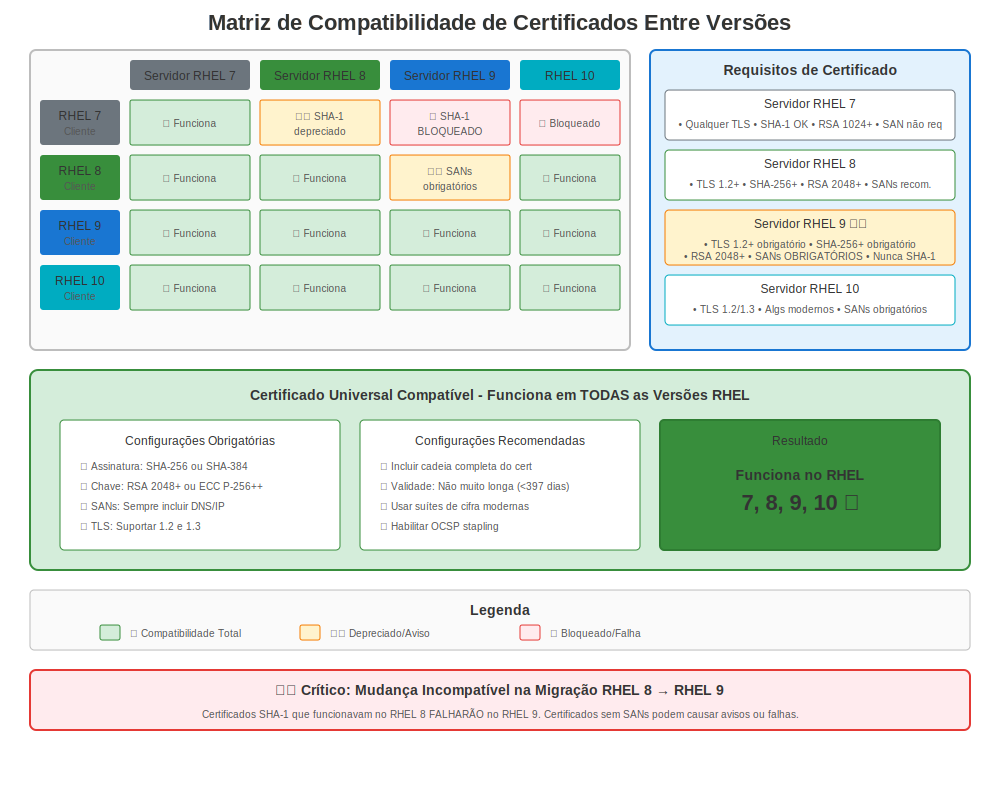

# Capítulo 13: Compatibilidade Entre Versões

> **Desafio Mundo Real:** Seu ambiente provavelmente tem sistemas RHEL 7, 8 e 9 todos conversando entre si. Como você faz certificados funcionarem em todas versões?

---

## 13.1 A Realidade do Ambiente Misto



Maioria empresas não atualizam tudo de uma vez. Você encontrará:

```
Ambiente Produção (Típico):
├── Servidor App Legado (RHEL 7)
├── Servidor Banco Dados (RHEL 8)
├── Camada Web (RHEL 9)
├── Nó Gerenciamento (RHEL 10)
└── Clientes: Windows, Mac, Linux, Mobile
```

**Desafio:** Estes sistemas têm diferentes:
- Suporte versão TLS
- Suites cifra
- Regras validação certificado
- Versões OpenSSL
- Crypto-policies (ou falta delas)

---

## 13.2 Problemas Comuns de Compatibilidade

### Problema 1: Desajustes Versão TLS

**Cenário:** Servidor RHEL 9 (apenas TLS 1.2+) ← Cliente RHEL 7 (TLS 1.0/1.1 padrão)

```bash
# Cliente RHEL 7 tentando conectar servidor RHEL 9
curl https://rhel9-server.example.com/
# Erro: SSL routines:ssl3_get_record:wrong version number

# Por quê: RHEL 7 tenta TLS 1.0 primeiro, RHEL 9 rejeita
```

**Solução:**
```bash
# Opção 1: Atualizar cliente RHEL 7 para usar TLS 1.2
# Editar /etc/httpd/conf.d/ssl.conf (se cliente Apache)
SSLProtocol all -SSLv3 -TLSv1 -TLSv1.1

# Opção 2: Política LEGACY temporária no RHEL 9 (NÃO recomendado)
# sudo update-crypto-policies --set LEGACY  # No servidor RHEL 9

# Opção 3: Melhor - Atualizar sistemas RHEL 7!
```

### Problema 2: Desajustes Suite Cifra

**Cenário:** Servidor moderno não suporta cifras cliente antigo

```bash
# Cliente RHEL 7 → Servidor RHEL 9
openssl s_client -connect rhel9-server:443 -cipher '3DES'
# Erro: no shared cipher
```

**Por quê:** 3DES é bloqueado em política DEFAULT RHEL 8+

**Solução:**
```bash
# Verificar quais cifras estão disponíveis
openssl ciphers -v 'HIGH:!aNULL:!MD5' | head

# Testar cipher específico no cliente
openssl s_client -connect server:443 -cipher 'AES256-GCM-SHA384'

# No servidor RHEL 9, se você DEVE suportar clientes antigos:
sudo update-crypto-policies --set LEGACY  # Temporário!
```

### Problema 3: Diferenças Validação Certificado

**Cenário:** Certificado assinado SHA-1

```
Certificado com assinatura SHA-1:
├── ✅ Funciona no RHEL 7
├── ❌ Rejeitado por RHEL 8 DEFAULT
├── ❌ Rejeitado por RHEL 9
└── ❌ Rejeitado por RHEL 10
```

**Solução:**
```bash
# Reemitir certificado com SHA-256 ou melhor
openssl req -new -key server.key -out server.csr -sha256

# Verificar algoritmo assinatura
openssl x509 -in cert.crt -noout -text | grep "Signature Algorithm"
# Deveria mostrar: sha256WithRSAEncryption (ou melhor)
```

---

## 13.3 Matriz Compatibilidade

### Compatibilidade Cliente → Servidor

| Cliente ↓ Servidor → | Servidor RHEL 7 | Servidor RHEL 8 (DEFAULT) | Servidor RHEL 9 (DEFAULT) | Servidor RHEL 10 |
|-------------------|-----------------|---------------------------|---------------------------|------------------|
| **Cliente RHEL 7** | ✅ Completo | ⚠️ Problema TLS 1.0/1.1 | ⚠️ Problema TLS 1.0/1.1 | ⚠️ Problema TLS 1.0/1.1 |
| **Cliente RHEL 8** | ✅ Completo | ✅ Completo | ✅ Completo | ✅ Completo |
| **Cliente RHEL 9** | ⚠️ Aviso cipher fraco | ✅ Completo | ✅ Completo | ✅ Completo |
| **Cliente RHEL 10** | ⚠️ Aviso cipher fraco | ✅ Completo | ✅ Completo | ✅ Completo |
| **Windows 10** | ✅ Completo | ✅ Completo | ✅ Completo | ✅ Completo |
| **Windows Server 2012** | ✅ Completo | ⚠️ Pode precisar TLS 1.0/1.1 | ⚠️ Pode precisar TLS 1.0/1.1 | ⚠️ Pode precisar TLS 1.0/1.1 |
| **Java 7 antigo** | ✅ Completo | ❌ Sem TLS 1.2 | ❌ Sem TLS 1.2 | ❌ Sem TLS 1.2 |

**Legenda:**
- ✅ Funciona sem mudanças
- ⚠️ Funciona com mudanças configuração
- ❌ Incompatível sem atualizações principais

---

## 13.4 Requisitos de Certificado para Máxima Compatibilidade

### O Perfil Certificado "Universal"

Para funcionar em todas versões RHEL (7-10) e clientes externos:

```bash
# Requisitos Certificado:
✅ Chave RSA: 2048 bits mínimo (4096 para preparação futura)
✅ Assinatura: SHA-256 ou melhor (não SHA-1!)
✅ Subject Alternative Names (SANs) requeridos
✅ Validade: ≤ 365 dias (requisito navegador)
✅ Key Usage: Extensões apropriadas definidas

❌ Evitar: Assinaturas SHA-1
❌ Evitar: RSA < 2048 bits
❌ Evitar: SANs faltando
❌ Evitar: Certificados apenas-CN
```

### Gerar Certificado Compatível

```bash
#============================================#
# PASSO 1: Gerar Chave (funciona em todas versões RHEL)
#============================================#

# RSA 2048 (mínimo, compatível)
openssl genpkey -algorithm RSA -out universal.key -pkeyopt rsa_keygen_bits:2048

# Ou RSA 4096 (melhor, ainda compatível)
openssl genpkey -algorithm RSA -out universal.key -pkeyopt rsa_keygen_bits:4096


#============================================#
# PASSO 2: Criar CSR com SANs
#============================================#

openssl req -new -key universal.key -out universal.csr \
  -subj "/C=US/ST=State/L=City/O=Company/CN=server.example.com" \
  -addext "subjectAltName=DNS:server.example.com,DNS:www.example.com,IP:10.0.0.100" \
  -addext "keyUsage=digitalSignature,keyEncipherment" \
  -addext "extendedKeyUsage=serverAuth,clientAuth"


#============================================#
# PASSO 3: Verificar CSR
#============================================#

openssl req -in universal.csr -noout -text | grep -A2 "Subject Alternative Name"
# Deveria mostrar seus SANs

openssl req -in universal.csr -noout -text | grep "Public-Key"
# Deveria mostrar: Public-Key: (2048 bit) ou maior
```

---

## 13.5 Testando Compatibilidade Entre Versões

### Script Suite Teste

```bash
#!/bin/bash
# test-cert-compatibility.sh
# Testa se certificado funciona de várias versões RHEL

SERVER_HOST="server.example.com"
SERVER_PORT="443"
CERT_FILE="/etc/pki/tls/certs/server.crt"

echo "=== Suite Teste Compatibilidade Certificado ==="
echo ""

#============================================#
# TESTE 1: Propriedades Certificado
#============================================#

echo "1. Propriedades Certificado:"
echo "   Algoritmo Assinatura:"
openssl x509 -in "$CERT_FILE" -noout -text | grep "Signature Algorithm" | head -1

echo "   Tamanho Chave:"
openssl x509 -in "$CERT_FILE" -noout -text | grep "Public-Key"

echo "   SANs:"
openssl x509 -in "$CERT_FILE" -noout -ext subjectAltName 2>/dev/null || echo "   Nenhum SAN encontrado!"

echo ""


#============================================#
# TESTE 2: Suporte Versão TLS
#============================================#

echo "2. Suporte Versão TLS:"

for version in tls1 tls1_1 tls1_2 tls1_3; do
  if openssl s_client -connect "$SERVER_HOST:$SERVER_PORT" -"$version" </dev/null 2>&1 | grep -q "Cipher"; then
    echo "   ${version//_/.}: ✅ Suportado"
  else
    echo "   ${version//_/.}: ❌ Não suportado"
  fi
done

echo ""


#============================================#
# TESTE 3: Compatibilidade Suite Cifra
#============================================#

echo "3. Testes Cipher Comuns:"

# Cipher moderno (RHEL 8+)
if openssl s_client -connect "$SERVER_HOST:$SERVER_PORT" -cipher 'ECDHE-RSA-AES256-GCM-SHA384' </dev/null 2>&1 | grep -q "Cipher"; then
  echo "   Cipher moderno (ECDHE-RSA-AES256-GCM-SHA384): ✅"
else
  echo "   Cipher moderno: ❌"
fi

# Cipher legado (RHEL 7)
if openssl s_client -connect "$SERVER_HOST:$SERVER_PORT" -cipher 'AES256-SHA' </dev/null 2>&1 | grep -q "Cipher"; then
  echo "   Cipher legado (AES256-SHA): ✅ (pode indicar política LEGACY)"
else
  echo "   Cipher legado: ❌ (bom para segurança)"
fi


#============================================#
# TESTE 4: Validação Certificado
#============================================#

echo ""
echo "4. Validação Certificado:"

if openssl verify -CAfile /etc/pki/tls/certs/ca-bundle.crt "$CERT_FILE" | grep -q "OK"; then
  echo "   Cadeia trust: ✅ Válida"
else
  echo "   Cadeia trust: ❌ Inválida"
fi

echo ""
echo "=== Teste Completo ==="
```

Uso:
```bash
chmod +x test-cert-compatibility.sh
sudo ./test-cert-compatibility.sh
```

---

## 13.6 Lidando com Cenários Compatibilidade Específicos

### Cenário 1: Cliente RHEL 7 → Servidor RHEL 9

**Problema:** Conexão falha com erro versão TLS

**Correção Lado Cliente (RHEL 7):**
```bash
# Para curl
curl --tlsv1.2 https://rhel9-server/

# Para wget
wget --secure-protocol=TLSv1_2 https://rhel9-server/

# Para aplicações usando OpenSSL, definir variável ambiente
export OPENSSL_CONF=/etc/pki/tls/openssl-tls12.cnf

# Criar config customizada
cat > /etc/pki/tls/openssl-tls12.cnf << 'EOF'
openssl_conf = default_conf

[default_conf]
ssl_conf = ssl_sect

[ssl_sect]
system_default = system_default_sect

[system_default_sect]
MinProtocol = TLSv1.2
CipherString = DEFAULT@SECLEVEL=1
EOF
```

**Correção Lado Servidor (RHEL 9) - NÃO RECOMENDADO:**
```bash
# Apenas se absolutamente necessário e temporariamente!
sudo update-crypto-policies --set LEGACY
sudo systemctl restart httpd  # Ou seu serviço
```

### Cenário 2: Trust CA Mista

**Problema:** CA corporativa confiável em alguns sistemas mas não outros

**Solução:** Repositório de confiança consistente em todas versões

```bash
#============================================#
# SCRIPT IMPLANTAÇÃO (executar em todas versões RHEL)
#============================================#

#!/bin/bash
# deploy-corporate-ca.sh

CA_CERT_URL="http://pki.example.com/ca-chain.crt"
CA_CERT_FILE="/etc/pki/ca-trust/source/anchors/corporate-ca-chain.crt"

# Baixar certificado CA
curl -o "$CA_CERT_FILE" "$CA_CERT_URL"

# Atualizar repositório de confiança (funciona em todas versões RHEL)
update-ca-trust extract

# Verificar
if trust list | grep -q "Corporate Root CA"; then
  echo "✅ CA Corporativa instalada com sucesso"
else
  echo "❌ Instalação CA Corporativa falhou"
  exit 1
fi
```

### Cenário 3: Aplicação Usando Biblioteca TLS Antiga

**Problema:** Aplicação Java 7 não consegue conectar a servidores modernos

**Verificar Suporte TLS Java:**
```bash
# Verificar versão Java
java -version

# Testar suporte TLS
java -Djavax.net.debug=ssl:handshake -jar app.jar 2>&1 | grep "TLS"
```

**Opções:**
```bash
# Opção 1: Atualizar Java (melhor)
sudo dnf install java-11-openjdk

# Opção 2: Habilitar TLS 1.2 no Java 7 (se atualização impossível)
# Adicionar ao startup Java:
-Dhttps.protocols=TLSv1.2

# Opção 3: Usar script wrapper
#!/bin/bash
export JAVA_OPTS="-Dhttps.protocols=TLSv1.2 -Djavax.net.ssl.trustStore=/etc/pki/java/cacerts"
java $JAVA_OPTS -jar /path/to/app.jar
```

---

## 13.7 Compatibilidade Crypto-Policy

### Entendendo Impacto Política Entre Versões

```bash
#============================================#
# RHEL 7 (Sem crypto-policies)
#============================================#

# Configuração manual em cada app
# Apache: /etc/httpd/conf.d/ssl.conf
# NGINX: /etc/nginx/nginx.conf
# Postfix: /etc/postfix/main.cf


#============================================#
# RHEL 8/9/10 (crypto-policies)
#============================================#

# Controle system-wide
update-crypto-policies --set DEFAULT

# Para suportar clientes RHEL 7, pode necessitar:
update-crypto-policies --set LEGACY  # Temporariamente!
```

### Equivalentes Política para Ambientes Mistos

Se você necessita manter compatibilidade:

**Opção A: Usar LEGACY em sistemas modernos (não recomendado longo prazo)**
```bash
# Em servidores RHEL 8/9/10
sudo update-crypto-policies --set LEGACY
```

**Opção B: Configurar RHEL 7 para coincidir DEFAULT (recomendado)**
```bash
# No RHEL 7, configurar manualmente para coincidir DEFAULT RHEL 8+
# Exemplo Apache:
SSLProtocol all -SSLv3 -TLSv1 -TLSv1.1
SSLCipherSuite HIGH:!aNULL:!MD5:!3DES:!CAMELLIA
SSLHonorCipherOrder on
```

---

## 13.8 Caminho Migração: Atualização Gradual

### Fase 1: Preparar RHEL 7 (Pré-Migração)

```bash
# 1. Reemitir todos certificados com SHA-256+
# 2. Testar compatibilidade TLS 1.2
# 3. Atualizar configurações cipher
# 4. Documentar inventário certificado atual
```

### Fase 2: Implantar RHEL 8 (Transição)

```bash
# 1. Começar com política LEGACY
sudo update-crypto-policies --set LEGACY

# 2. Implantar serviços
# 3. Testar completamente
# 4. Gradualmente mudar para DEFAULT
sudo update-crypto-policies --set DEFAULT
```

### Fase 3: Atualizar para RHEL 9 (Modernização)

```bash
# 1. Todos clientes deveriam ser RHEL 8+ ou TLS 1.2 capazes
# 2. Usar política DEFAULT
# 3. Monitorar por problemas compatibilidade
# 4. Considerar política FUTURE após estabilização
```

---

## 13.9 Solução de Problemas Entre Versões

### Comandos Diagnóstico

```bash
#============================================#
# NO CLIENTE
#============================================#

# Testar versão TLS específica
openssl s_client -connect server:443 -tls1_2

# Testar com saída verbose
curl -v --tlsv1.2 https://server/

# Verificar OpenSSL cliente
openssl version
openssl ciphers -v


#============================================#
# NO SERVIDOR
#============================================#

# Verificar crypto-policy (RHEL 8+)
update-crypto-policies --show

# Verificar config OpenSSL
openssl version
cat /etc/crypto-policies/back-ends/opensslcnf.config

# Testar certificado servidor
openssl s_client -connect localhost:443 -servername $(hostname)

# Verificar logs serviço
sudo journalctl -xe | grep -i tls
sudo tail -f /var/log/httpd/ssl_error_log
```

### Mensagens Erro Comuns

| Erro | Causa | Solução |
|------|-------|---------|
| "wrong version number" | Desajuste versão TLS | Atualizar cliente para TLS 1.2+ |
| "no shared cipher" | Incompatibilidade cipher | Verificar crypto-policy ou config cipher |
| "certificate verify failed" | Problema trust ou validação | Verificar trust CA, validade certificado |
| "sslv3 alert handshake failure" | Incompatibilidade protocolo | Atualizar versões TLS |
| "unsafe legacy renegotiation" | OpenSSL antigo no cliente | Atualizar OpenSSL cliente |

---

## 13.10 Melhores Práticas para Ambientes Mistos

### 1. Padronizar Emissão Certificado

```yaml
# Padrão Certificado (exemplo)
Algorithm: RSA
Key Size: 2048 bits mínimo (4096 preferido)
Signature: SHA-256 ou melhor
Validity: 365 dias máximo
SANs: Sempre incluir
Extensions: Key usage apropriado definido
```

### 2. Manter Repositórios de Confiança Consistentes

```bash
# Script implantação para todos sistemas
for host in rhel7-hosts rhel8-hosts rhel9-hosts; do
  ssh "$host" 'sudo cp /path/to/ca.crt /etc/pki/ca-trust/source/anchors/ && sudo update-ca-trust'
done
```

### 3. Testar Antes de Implantar

```bash
# Matriz teste
Cliente RHEL 7 → Servidor RHEL 7 ✓
Cliente RHEL 7 → Servidor RHEL 8 ✓
Cliente RHEL 7 → Servidor RHEL 9 ✓
Cliente RHEL 8 → Servidor RHEL 7 ✓
Cliente RHEL 8 → Servidor RHEL 9 ✓
Cliente RHEL 9 → Servidor RHEL 8 ✓
```

### 4. Documentar Seu Ambiente

```markdown
## Matriz Compatibilidade Certificado

### Servidores:
- App Server 1: RHEL 7.9, TLS 1.0-1.2, RSA 2048
- Banco Dados: RHEL 8.10, política DEFAULT, RSA 2048
- Camada Web: RHEL 9.8, política DEFAULT, RSA 4096

### Limitações Conhecidas:
- Sistemas RHEL 7 requerem TLS 1.0/1.1 para app legado X
- Banco dados requer cipher específico: AES256-GCM-SHA384

### Plano Atualização:
- T1 2025: Migrar App Server 1 para RHEL 8
- T2 2025: Atualizar todos certificados para RSA 4096
```

---

## 13.11 Conclusões Chave

1. **Ambientes mistos são normais** - Planejar para compatibilidade
2. **TLS 1.2+ é o mínimo** para sistemas modernos
3. **Assinaturas SHA-256+ requeridas** para RHEL 8+
4. **Crypto-policies mudaram tudo** (RHEL 8+)
5. **Testar em todas versões** antes de implantar
6. **Documentar tudo** - especialmente exceções
7. **Caminho atualização é gradual** - não apressar, testar completamente

---

## Referência Rápida

```
┌──────────────────────────────────────────────────────────────┐
│ CHECKLIST COMPATIBILIDADE ENTRE VERSÕES                      │
├──────────────────────────────────────────────────────────────┤
│ ✅ RSA 2048+ bits                                            │
│ ✅ Assinatura SHA-256+                                       │
│ ✅ SANs incluídos                                            │
│ ✅ Suporte TLS 1.2+                                          │
│ ✅ Cifras modernas                                           │
│ ✅ Trust CA consistente                                      │
│ ✅ Testado em todas versões                                  │
└──────────────────────────────────────────────────────────────┘

Comando teste:
openssl s_client -connect server:443 -tls1_2 -servername server

Verificar política (RHEL 8+):
update-crypto-policies --show
```
---

**Navegação do Capítulo**

| [← Anterior: Capítulo 12 - Recursos Atuais do RHEL 10](12-rhel10-current.md) | [Próximo: Capítulo 14 - Apache httpd no RHEL →](../part-03-services/14-apache-httpd.md) |
|:---|---:|
