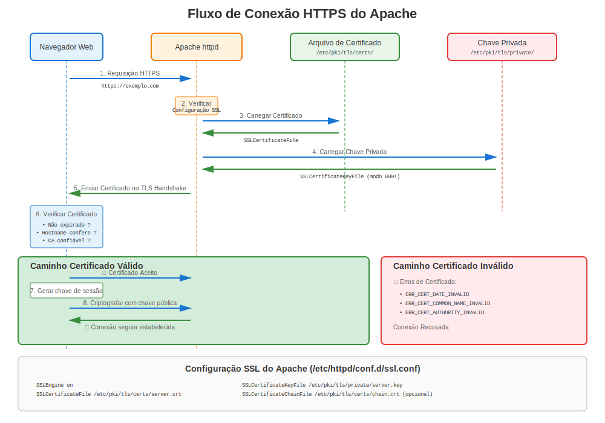
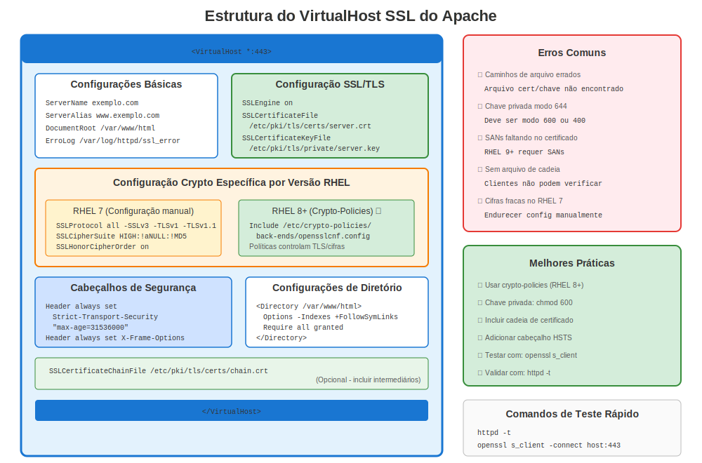

# Capítulo 14: Apache httpd no RHEL

> **Mais Comum:** Apache (httpd) é o servidor web mais amplamente implantado no RHEL. Domine a configuração HTTPS do Apache em todas as versões RHEL.

---

## 14.1 Visão Geral Apache no RHEL



**Nome do Pacote:** `httpd`
**Módulo SSL/TLS:** `mod_ssl`
**Localização Config:** `/etc/httpd/conf.d/ssl.conf`
**Caminho Certificados:** `/etc/pki/tls/certs/`
**Caminho Chaves:** `/etc/pki/tls/private/`

### Comparação de Versões

| Versão RHEL | Versão Apache | OpenSSL | Abordagem Config |
|-------------|---------------|---------|------------------|
| RHEL 7 | 2.4.6 | 1.0.2k | Configuração SSL manual |
| RHEL 8 | 2.4.37+ | 1.1.1k | Manual + crypto-policies |
| RHEL 9 | 2.4.53+ | 3.5.5 | Crypto-policies preferido |
| RHEL 10 | 2.4.62+ | 3.5.5 | Crypto-policies ótimo |

---

## 14.2 Instalação

### RHEL 7

```bash
#============================================#
# INSTALAR APACHE COM SSL (RHEL 7)
#============================================#

sudo yum install httpd mod_ssl -y
sudo systemctl enable httpd
sudo systemctl start httpd

# Abrir firewall
sudo firewall-cmd --permanent --add-service=http
sudo firewall-cmd --permanent --add-service=https
sudo firewall-cmd --reload

# Verificar
systemctl status httpd
```

### RHEL 8/9/10

```bash
#============================================#
# INSTALAR APACHE COM SSL (RHEL 8/9/10)
#============================================#

sudo dnf install httpd mod_ssl -y
sudo systemctl enable httpd
sudo systemctl start httpd

# Abrir firewall
sudo firewall-cmd --permanent --add-service=http
sudo firewall-cmd --permanent --add-service=https
sudo firewall-cmd --reload

# Verificar
systemctl status httpd
ss -tlnp | grep :443  # Verificar se escutando na 443
```

---

## 14.3 Configuração Básica SSL



### Configuração SSL Padrão

```bash
# Arquivo principal de configuração SSL
/etc/httpd/conf.d/ssl.conf

# Diretivas chave:
SSLEngine on
SSLCertificateFile /etc/pki/tls/certs/localhost.crt
SSLCertificateKeyFile /etc/pki/tls/private/localhost.key
```

### Exemplo Completo de Virtual Host

```apache
#============================================#
# /etc/httpd/conf.d/ssl.conf
# Ou /etc/httpd/conf.d/mysite-ssl.conf
#============================================#

<VirtualHost *:443>
    ServerName www.example.com
    ServerAlias example.com
    DocumentRoot /var/www/html

    # Habilitar SSL/TLS
    SSLEngine on

    # Arquivos de certificado
    SSLCertificateFile      /etc/pki/tls/certs/www.example.com.crt
    SSLCertificateKeyFile   /etc/pki/tls/private/www.example.com.key
    SSLCertificateChainFile /etc/pki/tls/certs/chain.crt

    # Protocolos TLS (RHEL 7 - config manual)
    SSLProtocol             all -SSLv3 -TLSv1 -TLSv1.1

    # Suite de cifra (RHEL 7 - manual)
    SSLCipherSuite          HIGH:!aNULL:!MD5:!3DES:!RC4
    SSLHonorCipherOrder     on

    # HSTS (recomendado)
    Header always set Strict-Transport-Security "max-age=31536000; includeSubDomains"

    # Logging
    ErrorLog  /var/log/httpd/ssl_error_log
    CustomLog /var/log/httpd/ssl_access_log combined
</VirtualHost>
```

---


## 14.4 Configuração Específica por Versão

### RHEL 7: Configuração SSL Manual

```apache
#============================================#
# APACHE SSL - MELHORES PRÁTICAS RHEL 7
#============================================#

<VirtualHost *:443>
    ServerName www.example.com
    SSLEngine on

    # Certificados
    SSLCertificateFile      /etc/pki/tls/certs/www.crt
    SSLCertificateKeyFile   /etc/pki/tls/private/www.key
    SSLCertificateChainFile /etc/pki/tls/certs/chain.crt

    # REQUERIDO: Desabilitar versões TLS antigas manualmente
    SSLProtocol all -SSLv2 -SSLv3 -TLSv1 -TLSv1.1

    # REQUERIDO: Apenas cifras fortes
    SSLCipherSuite ECDHE-ECDSA-AES256-GCM-SHA384:ECDHE-RSA-AES256-GCM-SHA384:ECDHE-ECDSA-CHACHA20-POLY1305:ECDHE-RSA-CHACHA20-POLY1305:ECDHE-ECDSA-AES128-GCM-SHA256:ECDHE-RSA-AES128-GCM-SHA256
    SSLHonorCipherOrder on

    # Headers segurança
    Header always set Strict-Transport-Security "max-age=31536000"
    Header always set X-Frame-Options DENY
    Header always set X-Content-Type-Options nosniff
</VirtualHost>
```

### RHEL 8/9/10: Crypto-Policies Integradas

```apache
#============================================#
# APACHE SSL - RHEL 8/9/10 COM CRYPTO-POLICIES
#============================================#

<VirtualHost *:443>
    ServerName www.example.com
    SSLEngine on

    # Certificados
    SSLCertificateFile      /etc/pki/tls/certs/www.crt
    SSLCertificateKeyFile   /etc/pki/tls/private/www.key
    SSLCertificateChainFile /etc/pki/tls/certs/chain.crt

    # NÃO PRECISA definir SSLProtocol ou SSLCipherSuite!
    # Crypto-policies lida com isso automaticamente
    # (a menos que você tenha requisitos específicos)

    # Headers segurança (ainda manual)
    Header always set Strict-Transport-Security "max-age=31536000"
    Header always set X-Frame-Options DENY
    Header always set X-Content-Type-Options nosniff
</VirtualHost>
```

**Diferença Chave:** No RHEL 8+, crypto-policies configuram automaticamente versões TLS e cifras!

### Verificando Integração Crypto-Policy

```bash
#============================================#
# VERIFICAR CRYPTO-POLICY (RHEL 8/9/10)
#============================================#

# Verificar política atual
update-crypto-policies --show

# Ver política específica Apache
cat /etc/crypto-policies/back-ends/httpd.config

# Apache automaticamente inclui isto
grep -r "crypto-policies" /etc/httpd/
```

---

## 14.5 Geração de Certificado para Apache

### Fluxo de Trabalho Completo

```bash
#============================================#
# GERAR CERTIFICADO PARA APACHE (TODAS VERSÕES)
#============================================#

# Passo 1: Gerar chave privada
sudo openssl genpkey -algorithm RSA \
  -out /etc/pki/tls/private/www.example.com.key \
  -pkeyopt rsa_keygen_bits:2048

# Passo 2: Definir permissões
sudo chmod 600 /etc/pki/tls/private/www.example.com.key
sudo chown root:root /etc/pki/tls/private/www.example.com.key

# Passo 3: Gerar CSR com SANs
sudo openssl req -new \
  -key /etc/pki/tls/private/www.example.com.key \
  -out /tmp/www.example.com.csr \
  -subj "/C=US/ST=State/L=City/O=Company/CN=www.example.com" \
  -addext "subjectAltName=DNS:www.example.com,DNS:example.com"

# Passo 4: Submeter CSR para CA, receber certificado

# Passo 5: Instalar certificado
sudo cp www.example.com.crt /etc/pki/tls/certs/
sudo chmod 644 /etc/pki/tls/certs/www.example.com.crt

# Passo 6: Se usando certificados intermediários, instalar cadeia
sudo cp chain.crt /etc/pki/tls/certs/www.example.com-chain.crt

# Passo 7: Atualizar config Apache (ver seção 13.3)

# Passo 8: Testar configuração
sudo apachectl configtest

# Passo 9: Recarregar Apache
sudo systemctl reload httpd

# Passo 10: Testar HTTPS
curl -v https://www.example.com/
openssl s_client -connect www.example.com:443 -servername www.example.com
```

---

## 14.6 Integração certmonger (Automatização!)

### Usando certmonger com Apache

```bash
#============================================#
# AUTOMATIZAR CERTIFICADOS APACHE COM CERTMONGER
#============================================#

# Instalar certmonger
sudo dnf install certmonger
sudo systemctl enable --now certmonger

# Opção 1: FreeIPA (CA Interna)
sudo ipa-getcert request \
  -f /etc/pki/tls/certs/www.example.com.crt \
  -k /etc/pki/tls/private/www.example.com.key \
  -D www.example.com \
  -K host/www.example.com@REALM \
  -C "systemctl reload httpd"  # Auto-recarregar Apache após renovação!

# Opção 2: Let's Encrypt (RHEL 9+)
sudo getcert request \
  -c lets-encrypt \
  -f /etc/pki/tls/certs/www.example.com.crt \
  -k /etc/pki/tls/private/www.example.com.key \
  -D www.example.com \
  -C "systemctl reload httpd"

# Verificar status
sudo getcert list

# Aguardar status MONITORING
# Certificado automaticamente renova ~30 dias antes expiração!
```

**Benefícios:**
- ✅ Renovação automática
- ✅ Sem downtime (reload, não restart)
- ✅ Rastreia expiração
- ✅ Alertas email em falha

---

## 14.7 Let's Encrypt com certbot

> **⚠️ IMPORTANTE: EPEL Requerido**
>
> certbot **NÃO** está disponível nos repositórios oficiais RHEL. Requer EPEL (Extra Packages for Enterprise Linux), um repositório **mantido pela comunidade**.
>
> Para ambientes RHEL produção, considere:
> - FreeIPA com certmonger (recomendado para RHEL)
> - Gerenciamento certificado manual
> - CA comercial com certmonger

```bash
#============================================#
# CONFIGURAÇÃO CERTBOT (REQUER EPEL!)
#============================================#

# Passo 1: Habilitar EPEL (TODAS versões RHEL)
sudo dnf install https://dl.fedoraproject.org/pub/epel/epel-release-latest-$(rpm -E %rhel).noarch.rpm

# Ou no RHEL 8/9/10:
sudo dnf install epel-release

# Passo 2: Instalar certbot
sudo dnf install certbot python3-certbot-apache

# Passo 3: Obter certificado (automatizado!)
sudo certbot --apache -d www.example.com -d example.com

# Passo 4: Certbot automaticamente:
#  - Gera certificado
#  - Configura Apache
#  - Configura timer renovação
#  - Habilita redirect HTTPS

# Passo 5: Testar renovação automática
sudo certbot renew --dry-run

# Verificar timer renovação
systemctl list-timers | grep certbot
```

**Prós:**
- ✅ Totalmente automatizado
- ✅ Certificados gratuitos
- ✅ Config Apache lidada automaticamente

**Contras:**
- ❌ Requer EPEL (não oficialmente suportado por Red Hat)
- ❌ Dependência externa (Let's Encrypt)
- ⚠️ Domínio deve ser publicamente acessível

---

## 14.8 Solução de Problemas Apache HTTPS

### Lista de Verificação Problemas Comuns

```bash
#============================================#
# CHECKLIST SOLUÇÃO DE PROBLEMAS SSL APACHE
#============================================#

# 1. Verificar se mod_ssl está carregado
sudo httpd -M | grep ssl_module
# Deveria mostrar: ssl_module (shared)

# 2. Verificar sintaxe configuração
sudo apachectl configtest
# Deveria mostrar: Syntax OK

# 3. Verificar se arquivos certificado existem
ls -l /etc/pki/tls/certs/www.crt
ls -l /etc/pki/tls/private/www.key

# 4. Verificar permissões
ls -l /etc/pki/tls/private/www.key
# Deveria ser: -rw------- (600)

# 5. Verificar contexto SELinux
ls -Z /etc/pki/tls/certs/www.crt
ls -Z /etc/pki/tls/private/www.key
# Deveria mostrar: cert_t

# 6. Testar coincidência par certificado/chave
CERT_MOD=$(openssl x509 -noout -modulus -in /etc/pki/tls/certs/www.crt | openssl md5)
KEY_MOD=$(openssl rsa -noout -modulus -in /etc/pki/tls/private/www.key | openssl md5)
[ "$CERT_MOD" = "$KEY_MOD" ] && echo "✅ Coincide" || echo "❌ Não coincide!"

# 7. Verificar se porta 443 está escutando
ss -tlnp | grep :443

# 8. Verificar firewall
sudo firewall-cmd --list-services | grep https

# 9. Testar localmente
curl -vk https://localhost/

# 10. Verificar logs
sudo tail -f /var/log/httpd/ssl_error_log
```

### Erros Comuns e Soluções

| Mensagem Erro | Causa | Solução |
|---------------|-------|---------|
| "SSLCertificateFile: file does not exist" | Caminho errado | Corrigir caminho em ssl.conf |
| "Permission denied" em arquivo chave | Permissões erradas | `chmod 600` na chave |
| "certificate verify failed" | Problema cadeia | Instalar certs intermediários |
| "SSLCertificateKeyFile: file does not exist" | Chave faltando | Gerar ou restaurar chave |
| "Private key does not match certificate" | Desajuste cert/chave | Regenerar CSR com chave correta |
| "SSL Library Error" | mod_ssl não carregado | Instalar pacote mod_ssl |
| "ca md too weak" (RHEL 9+) | Assinatura SHA-1 | Reemitir com SHA-256+ |
| "name mismatch" | Hostname não coincide CN/SAN | Corrigir SANs certificado |

---

## 14.9 Solução de Problemas Específico por Versão

### Específico RHEL 7

```bash
#============================================#
# PROBLEMAS APACHE RHEL 7
#============================================#

# Problema: Navegadores modernos rejeitam TLS 1.0/1.1
# Solução: Desabilitar TLS antigo em ssl.conf
SSLProtocol all -SSLv2 -SSLv3 -TLSv1 -TLSv1.1

# Problema: Cifras fracas marcadas por scan
# Solução: Usar cifras fortes
SSLCipherSuite ECDHE-RSA-AES256-GCM-SHA384:ECDHE-RSA-AES128-GCM-SHA256:HIGH:!aNULL:!MD5
SSLHonorCipherOrder on

# Problema: Sem SANs no certificado
# Solução: Reemitir com SANs (ver 13.5)

# Testar
openssl s_client -connect localhost:443 -tls1_2
```

### Específico RHEL 8/9/10

```bash
#============================================#
# PROBLEMAS APACHE RHEL 8/9/10
#============================================#

# Problema: Serviço falha após mudança crypto-policy
# Diagnóstico:
update-crypto-policies --show
sudo journalctl -xe -u httpd | grep -i tls

# Solução 1: Verificar se política está correta
sudo update-crypto-policies --set DEFAULT

# Solução 2: Verificar se você manualmente sobrescreve política
grep -E "SSLProtocol|SSLCipherSuite" /etc/httpd/conf.d/*.conf
# Se encontrado, remover (deixar crypto-policy lidar com isso)

# Problema: Erro "no shared cipher"
# Diagnóstico: Cliente muito antigo ou política muito restritiva
# Solução temporária:
sudo update-crypto-policies --set LEGACY
sudo systemctl restart httpd

# Solução apropriada: Atualizar cliente ou criar módulo política customizado
```

---

## 14.10 Melhores Práticas de Segurança

### Configuração SSL Apache Fortalecida

```apache
#============================================#
# CONFIG SSL FORTALECIDA (TODAS VERSÕES)
#============================================#

<VirtualHost *:443>
    ServerName secure.example.com

    SSLEngine on
    SSLCertificateFile      /etc/pki/tls/certs/secure.crt
    SSLCertificateKeyFile   /etc/pki/tls/private/secure.key

    # RHEL 7: Config TLS manual
    # SSLProtocol TLSv1.2 TLSv1.3
    # SSLCipherSuite ECDHE-RSA-AES256-GCM-SHA384:ECDHE-RSA-AES128-GCM-SHA256
    # SSLHonorCipherOrder on

    # RHEL 8/9/10: Crypto-policies lidam com acima automaticamente

    # HSTS (forçar HTTPS por 1 ano)
    Header always set Strict-Transport-Security "max-age=31536000; includeSubDomains; preload"

    # Prevenir clickjacking
    Header always set X-Frame-Options "DENY"

    # Prevenir MIME-type sniffing
    Header always set X-Content-Type-Options "nosniff"

    # Desabilitar assinatura servidor
    ServerSignature Off
    ServerTokens Prod

    # OCSP Stapling (RHEL 8/9/10)
    SSLUseStapling on
    SSLStaplingCache "shmcb:/var/run/ocsp(128000)"

    # Auth certificado cliente (opcional)
    # SSLVerifyClient require
    # SSLVerifyDepth 3
    # SSLCACertificateFile /etc/pki/tls/certs/client-ca.crt
</VirtualHost>

# Fora VirtualHost (configurações SSL globais)
SSLStaplingCache "shmcb:/var/run/ocsp(128000)"
```

---

## 14.11 Redirect HTTP para HTTPS

### Forçar HTTPS

```apache
#============================================#
# REDIRECT HTTP → HTTPS
#============================================#

# Método 1: VirtualHost Separado
<VirtualHost *:80>
    ServerName www.example.com
    Redirect permanent / https://www.example.com/
</VirtualHost>

<VirtualHost *:443>
    ServerName www.example.com
    # ... config SSL ...
</VirtualHost>

# Método 2: mod_rewrite
<VirtualHost *:80>
    ServerName www.example.com

    RewriteEngine On
    RewriteCond %{HTTPS} off
    RewriteRule ^(.*)$ https://%{HTTP_HOST}$1 [R=301,L]
</VirtualHost>
```

---

## 14.12 Testando Apache HTTPS

### Teste Abrangente

```bash
#============================================#
# SUITE TESTE APACHE HTTPS
#============================================#

# Teste 1: Sintaxe configuração
sudo apachectl configtest

# Teste 2: Módulo SSL carregado
sudo httpd -M | grep ssl

# Teste 3: Porta escutando
ss -tlnp | grep :443

# Teste 4: Conexão local
curl -vk https://localhost/

# Teste 5: Hostname real
curl -v https://www.example.com/

# Teste 6: Validação certificado
openssl s_client -connect www.example.com:443 -servername www.example.com

# Teste 7: TLS 1.2
openssl s_client -connect www.example.com:443 -tls1_2

# Teste 8: TLS 1.3 (RHEL 8+)
openssl s_client -connect www.example.com:443 -tls1_3

# Teste 9: Verificar detalhes certificado do servidor
echo | openssl s_client -connect www.example.com:443 -servername www.example.com 2>&1 | \
  openssl x509 -noout -text | head -30

# Teste 10: Teste online (externo)
# Usar: https://www.ssllabs.com/ssltest/
```

---

## 14.13 Otimização de Desempenho

### Ajuste Desempenho SSL/TLS

```apache
#============================================#
# AJUSTE DESEMPENHO
#============================================#

<VirtualHost *:443>
    # ... config básica ...

    # Cache de sessão (melhora desempenho)
    SSLSessionCache         "shmcb:/var/cache/httpd/ssl_scache(512000)"
    SSLSessionCacheTimeout  300

    # OCSP Stapling (reduz lookup lado cliente)
    SSLUseStapling on
    SSLStaplingCache "shmcb:/var/run/ocsp(128000)"

    # Keep-Alive (reusar conexões)
    KeepAlive On
    MaxKeepAliveRequests 100
    KeepAliveTimeout 5

    # HTTP/2 (RHEL 8/9/10)
    Protocols h2 h2c http/1.1
</VirtualHost>
```

---

## 14.14 Monitorando Apache HTTPS

### O Que Monitorar

```bash
#============================================#
# MONITORAMENTO APACHE HTTPS
#============================================#

# Expiração certificado
openssl s_client -connect localhost:443 -servername $(hostname -f) 2>/dev/null | \
  openssl x509 -noout -dates

# Status serviço
systemctl status httpd

# Contagem conexões
ss -tn | grep :443 | wc -l

# Monitoramento log erro
sudo tail -f /var/log/httpd/ssl_error_log

# Status certmonger (se usado)
sudo getcert list -f /etc/pki/tls/certs/www.crt

# Análise log acesso
sudo tail -f /var/log/httpd/ssl_access_log | grep -E "HTTP/[12]"
```

---

## 14.15 Guia Rápido de Solução de Problemas

```
Apache HTTPS Não Funcionando?

├─ Apache não inicia?
│  ├─ Verificar: apachectl configtest
│  ├─ Verificar: journalctl -xe -u httpd
│  └─ Corrigir: Erros configuração
│
├─ Não consegue conectar à porta 443?
│  ├─ Verificar: ss -tlnp | grep :443
│  ├─ Verificar: firewall-cmd --list-services
│  └─ Corrigir: Abrir firewall, iniciar httpd
│
├─ Avisos certificado no navegador?
│  ├─ Verificar: Expiração certificado
│  ├─ Verificar: Coincidência hostname (CN/SANs)
│  ├─ Verificar: Cadeia confiança
│  └─ Corrigir: Renovar cert, corrigir SANs, instalar CA
│
├─ Erro "No shared cipher"?
│  ├─ Verificar: update-crypto-policies --show
│  ├─ Verificar: Versão TLS cliente
│  └─ Corrigir: Atualizar política ou cliente
│
└─ Erros permissão?
   ├─ Verificar: ls -lZ /etc/pki/tls/private/*.key
   ├─ Verificar: Negações SELinux
   └─ Corrigir: chmod 600, restorecon
```

---

## 14.16 Conclusões Chave

1. **Apache + mod_ssl** é o servidor web padrão RHEL
2. **RHEL 7:** Configuração TLS manual requerida
3. **RHEL 8/9/10:** Crypto-policies simplificam configuração
4. **Integração certmonger** habilita automatização
5. **certbot requer EPEL** (não oficialmente suportado)
6. **Sempre usar SANs** em certificados
7. **Testar completamente** antes de implantação em produção

---

## Cartão de Referência Rápida

```
┌─────────────────────────────────────────────────────────────────────┐
│ REFERÊNCIA RÁPIDA APACHE HTTPD HTTPS                                │
├─────────────────────────────────────────────────────────────────────┤
│ Instalar:       dnf install httpd mod_ssl                           │
│ Config:         /etc/httpd/conf.d/ssl.conf                          │
│ Certs:          /etc/pki/tls/certs/                                 │
│ Chaves:         /etc/pki/tls/private/ (modo 600!)                   │
│                                                                     │
│ Testar config:  apachectl configtest                                │
│ Recarregar:     systemctl reload httpd                              │
│ Logs:           /var/log/httpd/ssl_error_log                        │
│                                                                     │
│ certmonger:     ipa-getcert request ... -C "systemctl reload httpd" │
│ certbot:        certbot --apache (requer EPEL!)                     │
│                                                                     │
│ Testar:         curl -v https://localhost/                          │
│                 openssl s_client -connect host:443                  │
└─────────────────────────────────────────────────────────────────────┘

⚠️ RHEL 8/9/10: Deixar crypto-policies lidar com config TLS/cifra
⚠️ certbot requer EPEL (não oficialmente suportado)
```

---

## 🧪 Laboratório Prático

**Lab 06: Configuração HTTPS do Apache**

Configure Apache com SSL/TLS em diferentes versões RHEL

- 📁 **Localização:** `labs/pt_BR/06-apache-https/`
- ⏱️ **Tempo:** 30-40 minutos
- 🎯 **Nível:** Intermediário

---

**Navegação do Capítulo**

| [← Anterior: Capítulo 13 - Compatibilidade Entre Versões](../part-02-version-specific/13-cross-version-compatibility.md) | [Próximo: Capítulo 15 - NGINX no RHEL →](15-nginx.md) |
|:---|---:|
