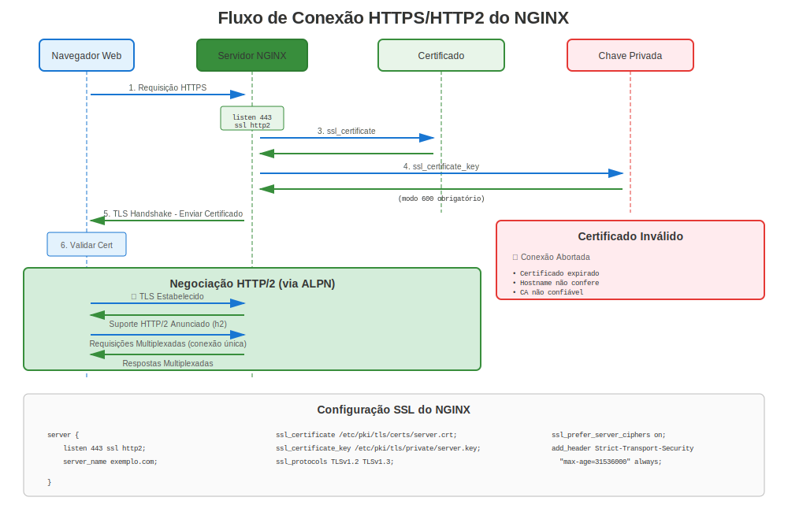

# Capítulo 15: NGINX no RHEL

> **Alto Desempenho:** NGINX é um servidor web e proxy reverso de alto desempenho popular. Aprenda como configurar NGINX com certificados TLS no RHEL.

---

## 15.1 Visão Geral NGINX no RHEL



**Nome do Pacote:** `nginx`
**Localização Config:** `/etc/nginx/nginx.conf`
**Caminho Certificados:** `/etc/pki/tls/certs/` ou `/etc/nginx/certs/`
**Caminho Chaves:** `/etc/pki/tls/private/` ou `/etc/nginx/certs/`

### Fontes de Instalação por Versão RHEL

| Versão RHEL | Fonte NGINX | Como Instalar |
|-------------|-------------|---------------|
| RHEL 7 | **EPEL** (comunidade) | Habilitar EPEL, então `yum install nginx` |
| RHEL 8 | **AppStream** (oficial) | `dnf module install nginx:1.20` |
| RHEL 9 | **AppStream** (oficial) | `dnf install nginx` |
| RHEL 10 | **AppStream** (oficial) | `dnf install nginx` |

> **Nota:** RHEL 7 requer EPEL para NGINX. RHEL 8+ inclui NGINX em repos oficiais.

---

## 15.2 Instalação

### RHEL 7

```bash
#============================================#
# INSTALAR NGINX (RHEL 7 - REQUER EPEL)
#============================================#

# Passo 1: Habilitar EPEL
sudo yum install epel-release -y

# Passo 2: Instalar NGINX
sudo yum install nginx -y

# Passo 3: Habilitar e iniciar
sudo systemctl enable nginx
sudo systemctl start nginx

# Passo 4: Abrir firewall
sudo firewall-cmd --permanent --add-service=http
sudo firewall-cmd --permanent --add-service=https
sudo firewall-cmd --reload

# Verificar
systemctl status nginx
curl http://localhost/
```

### RHEL 8

```bash
#============================================#
# INSTALAR NGINX (RHEL 8 - DO APPSTREAM)
#============================================#

# Listar módulos NGINX disponíveis
dnf module list nginx

# Instalar versão específica
sudo dnf module install nginx:1.20 -y

# Ou instalar padrão
sudo dnf install nginx -y

# Habilitar e iniciar
sudo systemctl enable nginx
sudo systemctl start nginx

# Abrir firewall
sudo firewall-cmd --permanent --add-service=http
sudo firewall-cmd --permanent --add-service=https
sudo firewall-cmd --reload
```

### RHEL 9/10

```bash
#============================================#
# INSTALAR NGINX (RHEL 9/10)
#============================================#

sudo dnf install nginx -y

sudo systemctl enable nginx
sudo systemctl start nginx

# Abrir firewall
sudo firewall-cmd --permanent --add-service=http
sudo firewall-cmd --permanent --add-service=https
sudo firewall-cmd --reload

# Verificar
systemctl status nginx
ss -tlnp | grep :443
```

---

## 15.3 Configuração Básica HTTPS

### Configuração TLS Mínimo

```nginx
#============================================#
# /etc/nginx/nginx.conf ou /etc/nginx/conf.d/default.conf
#============================================#

server {
    listen 80;
    server_name www.example.com;

    # Redirecionar HTTP para HTTPS
    return 301 https://$server_name$request_uri;
}

server {
    listen 443 ssl http2;
    server_name www.example.com;

    # Arquivos de certificado
    ssl_certificate     /etc/pki/tls/certs/www.example.com.crt;
    ssl_certificate_key /etc/pki/tls/private/www.example.com.key;

    # Protocolos TLS
    ssl_protocols TLSv1.2 TLSv1.3;

    # Cifras
    ssl_ciphers HIGH:!aNULL:!MD5;
    ssl_prefer_server_ciphers on;

    # Diretório raiz
    root /usr/share/nginx/html;
    index index.html;

    location / {
        try_files $uri $uri/ =404;
    }
}
```

### Configuração Produção Fortalecida

```nginx
#============================================#
# CONFIG HTTPS NGINX NÍVEL PRODUÇÃO
#============================================#

server {
    listen 443 ssl http2;
    server_name api.example.com;

    # Certificados
    ssl_certificate     /etc/pki/tls/certs/api.example.com.crt;
    ssl_certificate_key /etc/pki/tls/private/api.example.com.key;

    # Versões TLS
    ssl_protocols TLSv1.2 TLSv1.3;

    # Cifras fortes
    ssl_ciphers 'ECDHE-ECDSA-AES256-GCM-SHA384:ECDHE-RSA-AES256-GCM-SHA384:ECDHE-ECDSA-CHACHA20-POLY1305:ECDHE-RSA-CHACHA20-POLY1305:ECDHE-ECDSA-AES128-GCM-SHA256:ECDHE-RSA-AES128-GCM-SHA256';
    ssl_prefer_server_ciphers on;

    # Parâmetros DH (opcional, para perfect forward secrecy)
    ssl_dhparam /etc/nginx/dhparam.pem;

    # Otimização sessão SSL
    ssl_session_cache shared:SSL:10m;
    ssl_session_timeout 10m;
    ssl_session_tickets off;

    # OCSP Stapling
    ssl_stapling on;
    ssl_stapling_verify on;
    ssl_trusted_certificate /etc/pki/tls/certs/chain.crt;
    resolver 8.8.8.8 8.8.4.4 valid=300s;
    resolver_timeout 5s;

    # HSTS
    add_header Strict-Transport-Security "max-age=31536000; includeSubDomains; preload" always;

    # Headers segurança
    add_header X-Frame-Options DENY always;
    add_header X-Content-Type-Options nosniff always;
    add_header X-XSS-Protection "1; mode=block" always;

    # Logging
    access_log /var/log/nginx/api_access.log;
    error_log /var/log/nginx/api_error.log;

    location / {
        proxy_pass http://backend_servers;
        proxy_set_header Host $host;
        proxy_set_header X-Real-IP $remote_addr;
        proxy_set_header X-Forwarded-For $proxy_add_x_forwarded_for;
        proxy_set_header X-Forwarded-Proto $scheme;
    }
}
```

---

## 15.4 Configuração de Certificado

### Gerar Certificados para NGINX

```bash
#============================================#
# GERAÇÃO CERTIFICADO PARA NGINX
#============================================#

# Passo 1: Criar diretório certs (opcional)
sudo mkdir -p /etc/nginx/certs
sudo chmod 755 /etc/nginx/certs

# Passo 2: Gerar chave privada
sudo openssl genpkey -algorithm RSA \
  -out /etc/pki/tls/private/api.example.com.key \
  -pkeyopt rsa_keygen_bits:2048

# Passo 3: Definir permissões
sudo chmod 600 /etc/pki/tls/private/api.example.com.key
sudo chown root:nginx /etc/pki/tls/private/api.example.com.key

# Passo 4: Gerar CSR
sudo openssl req -new \
  -key /etc/pki/tls/private/api.example.com.key \
  -out /tmp/api.example.com.csr \
  -subj "/CN=api.example.com" \
  -addext "subjectAltName=DNS:api.example.com,DNS:www.api.example.com"

# Passo 5: Submeter para CA, receber certificado

# Passo 6: Instalar certificado
sudo cp api.example.com.crt /etc/pki/tls/certs/
sudo chmod 644 /etc/pki/tls/certs/api.example.com.crt
```

---

## 15.5 Integração certmonger

### Renovação Automatizada com certmonger

```bash
#============================================#
# CERTMONGER + NGINX
#============================================#

# Instalar certmonger
sudo dnf install certmonger
sudo systemctl enable --now certmonger

# Solicitar certificado do FreeIPA
sudo ipa-getcert request \
  -f /etc/pki/tls/certs/nginx.example.com.crt \
  -k /etc/pki/tls/private/nginx.example.com.key \
  -D nginx.example.com \
  -K host/nginx.example.com@REALM \
  -C "systemctl reload nginx"  # Auto-recarregar na renovação!

# Ou do Let's Encrypt (RHEL 9+)
sudo getcert request \
  -c lets-encrypt \
  -f /etc/pki/tls/certs/nginx.example.com.crt \
  -k /etc/pki/tls/private/nginx.example.com.key \
  -D nginx.example.com \
  -C "systemctl reload nginx"

# Monitorar status
sudo getcert list
```

---

## 15.6 Let's Encrypt com certbot

> **⚠️ IMPORTANTE: EPEL Requerido**
>
> certbot **NÃO** está disponível nos repositórios oficiais RHEL. Requer EPEL, um repositório **mantido pela comunidade**.
>
> **Instalação:** Todas as versões RHEL requerem EPEL, mas o comando de habilitação varia conforme a versão. Consulte o [Capítulo 24](../part-04-automation/24-letsencrypt-certbot.md) para o fluxo completo do certbot.

### RHEL 7

```bash
# Passo 1: Habilitar EPEL
sudo yum install https://dl.fedoraproject.org/pub/epel/epel-release-latest-7.noarch.rpm -y

# Passo 2: Instalar certbot com plugin NGINX
sudo yum install certbot python2-certbot-nginx -y
```

### RHEL 8

```bash
# Passo 1: Habilitar EPEL
sudo dnf install https://dl.fedoraproject.org/pub/epel/epel-release-latest-8.noarch.rpm -y
# Ou, com assinatura ativa:
# sudo dnf install epel-release -y

# Passo 2: Instalar certbot com plugin NGINX
sudo dnf install certbot python3-certbot-nginx -y
```

### RHEL 9/10

```bash
# Passo 1: Habilitar EPEL
sudo dnf install epel-release -y

# Passo 2: Instalar certbot com plugin NGINX
sudo dnf install certbot python3-certbot-nginx -y
```

### Obter e configurar o certificado (todas as versões)

```bash
# Passo 3: Obter e instalar certificado (automatizado!)
sudo certbot --nginx -d www.example.com -d example.com

# Certbot vai:
#  ✅ Gerar certificado do Let's Encrypt
#  ✅ Atualizar configuração NGINX automaticamente
#  ✅ Configurar redirect HTTP para HTTPS
#  ✅ Configurar auto-renovação

# Passo 4: Verificar timer auto-renovação
systemctl list-timers | grep certbot

# Passo 5: Testar renovação (dry run)
sudo certbot renew --dry-run

# Certificado renova automaticamente a cada 60 dias!
```

**Lembrar:** EPEL é suportado pela comunidade, não Red Hat. Para produção empresarial, considere FreeIPA + certmonger.

---

## 15.7 Proxy Reverso com TLS

### NGINX como Proxy Terminação TLS

```nginx
#============================================#
# NGINX PROXY REVERSO COM TLS
#============================================#

upstream backend_servers {
    server 10.0.1.10:8080;
    server 10.0.1.11:8080;
    server 10.0.1.12:8080;
}

server {
    listen 443 ssl http2;
    server_name proxy.example.com;

    # Terminação TLS aqui
    ssl_certificate     /etc/pki/tls/certs/proxy.crt;
    ssl_certificate_key /etc/pki/tls/private/proxy.key;

    ssl_protocols TLSv1.2 TLSv1.3;
    ssl_ciphers HIGH:!aNULL:!MD5;

    # Proxy para backends (HTTP)
    location / {
        proxy_pass http://backend_servers;
        proxy_set_header Host $host;
        proxy_set_header X-Real-IP $remote_addr;
        proxy_set_header X-Forwarded-For $proxy_add_x_forwarded_for;
        proxy_set_header X-Forwarded-Proto https;
    }
}
```

---

## 15.8 Solução de Problemas NGINX HTTPS

### Comandos de Diagnóstico

```bash
#============================================#
# SOLUÇÃO DE PROBLEMAS NGINX HTTPS
#============================================#

# Testar sintaxe configuração
sudo nginx -t

# Mostrar configuração completa (com includes)
sudo nginx -T

# Verificar caminhos certificado SSL
sudo nginx -T | grep ssl_certificate

# Verificar arquivo certificado
sudo openssl x509 -in /etc/pki/tls/certs/nginx.crt -noout -text

# Verificar arquivo chave
sudo openssl rsa -in /etc/pki/tls/private/nginx.key -check

# Verificar coincidência par cert/chave
CERT=$(openssl x509 -noout -modulus -in /etc/pki/tls/certs/nginx.crt | openssl md5)
KEY=$(openssl rsa -noout -modulus -in /etc/pki/tls/private/nginx.key | openssl md5)
[ "$CERT" = "$KEY" ] && echo "✅ Coincide" || echo "❌ Desajuste!"

# Verificar se NGINX está escutando na 443
ss -tlnp | grep :443

# Verificar contexto SELinux
ls -Z /etc/pki/tls/certs/nginx.crt
ls -Z /etc/pki/tls/private/nginx.key

# Testar HTTPS localmente
curl -vk https://localhost/

# Verificar logs
sudo tail -f /var/log/nginx/error.log
```

### Erros HTTPS Comuns do NGINX

| Erro | Causa | Solução |
|------|-------|---------|
| "SSL: error:0200100D..." | Permissão negada na chave | `chmod 600` no arquivo chave |
| "no ssl configured for the server" | Faltando `ssl` em listen | Adicionar `listen 443 ssl;` |
| "cannot load certificate" | Arquivo não encontrado ou inválido | Verificar caminho e formato cert |
| "PEM_read_bio:no start line" | Formato errado | Garantir que cert está em formato PEM |
| "key values mismatch" | Cert/chave não coincidem | Regenerar com chave correta |
| "nginx: [emerg] bind() failed" | Porta já em uso | Verificar `ss -tlnp \| grep :443` |

---

## 15.9 Configuração Específica por Versão

### RHEL 7: Configuração TLS Manual

```nginx
#============================================#
# NGINX RHEL 7 - CONFIG SSL MANUAL
#============================================#

server {
    listen 443 ssl;
    server_name www.example.com;

    ssl_certificate     /etc/pki/tls/certs/www.crt;
    ssl_certificate_key /etc/pki/tls/private/www.key;

    # REQUERIDO: Desabilitar manualmente TLS fraco
    ssl_protocols TLSv1.2;  # Sem TLS 1.0/1.1!

    # REQUERIDO: Definir manualmente cifras fortes
    ssl_ciphers 'ECDHE-RSA-AES256-GCM-SHA384:ECDHE-RSA-AES128-GCM-SHA256:HIGH:!aNULL:!MD5';
    ssl_prefer_server_ciphers on;

    # Headers segurança
    add_header Strict-Transport-Security "max-age=31536000" always;

    root /usr/share/nginx/html;
}
```

### RHEL 8/9/10: Consciente de Crypto-Policies

```nginx
#============================================#
# NGINX RHEL 8/9/10 - COM CRYPTO-POLICIES
#============================================#

server {
    listen 443 ssl http2;
    server_name www.example.com;

    ssl_certificate     /etc/pki/tls/certs/www.crt;
    ssl_certificate_key /etc/pki/tls/private/www.key;

    # Config TLS mínima - crypto-policies lidam com resto!
    ssl_protocols TLSv1.2 TLSv1.3;
    ssl_ciphers HIGH:!aNULL:!MD5;
    ssl_prefer_server_ciphers on;

    # Ou confiar completamente em crypto-policies:
    # (remover ssl_protocols e ssl_ciphers)
    # NGINX usará crypto-policy do sistema

    # Otimização sessão
    ssl_session_cache shared:SSL:10m;
    ssl_session_timeout 10m;

    # OCSP Stapling
    ssl_stapling on;
    ssl_stapling_verify on;
    ssl_trusted_certificate /etc/pki/tls/certs/chain.crt;

    # HSTS
    add_header Strict-Transport-Security "max-age=31536000; includeSubDomains" always;

    root /usr/share/nginx/html;
}
```

---

## 15.10 Otimização de Desempenho

### Ajuste Desempenho SSL/TLS

```nginx
#============================================#
# OTIMIZAÇÃO DESEMPENHO SSL NGINX
#============================================#

http {
    # Cache sessão SSL (reduz overhead handshake)
    ssl_session_cache shared:SSL:50m;
    ssl_session_timeout 1d;
    ssl_session_tickets off;

    # Tamanhos buffer
    ssl_buffer_size 4k;  # Menor = menor latência, maior = melhor throughput

    server {
        listen 443 ssl http2;
        server_name fast.example.com;

        ssl_certificate     /etc/pki/tls/certs/fast.crt;
        ssl_certificate_key /etc/pki/tls/private/fast.key;

        # Usar HTTP/2 para multiplexing
        # (já habilitado na diretiva listen)

        # Habilitar OCSP Stapling (reduz tempo lookup cliente)
        ssl_stapling on;
        ssl_stapling_verify on;

        # Keep-alive
        keepalive_timeout 70;
        keepalive_requests 100;

        location / {
            proxy_pass http://backend;
            proxy_http_version 1.1;
            proxy_set_header Connection "";
        }
    }
}
```

---

## 15.11 Múltiplos Certificados (SNI)

### Server Name Indication (SNI)

```nginx
#============================================#
# MÚLTIPLOS DOMÍNIOS COM CERTIFICADOS DIFERENTES
#============================================#

# Site 1
server {
    listen 443 ssl http2;
    server_name site1.example.com;

    ssl_certificate     /etc/pki/tls/certs/site1.crt;
    ssl_certificate_key /etc/pki/tls/private/site1.key;

    root /var/www/site1;
}

# Site 2
server {
    listen 443 ssl http2;
    server_name site2.example.com;

    ssl_certificate     /etc/pki/tls/certs/site2.crt;
    ssl_certificate_key /etc/pki/tls/private/site2.key;

    root /var/www/site2;
}

# Site 3 (wildcard)
server {
    listen 443 ssl http2;
    server_name *.apps.example.com;

    ssl_certificate     /etc/pki/tls/certs/wildcard.apps.crt;
    ssl_certificate_key /etc/pki/tls/private/wildcard.apps.key;

    root /var/www/apps;
}
```

---

## 15.12 Autenticação Certificado Cliente

### Mutual TLS (mTLS) com NGINX

```nginx
#============================================#
# NGINX COM AUTH CERTIFICADO CLIENTE
#============================================#

server {
    listen 443 ssl http2;
    server_name secure.example.com;

    # Certificados servidor
    ssl_certificate     /etc/pki/tls/certs/secure.crt;
    ssl_certificate_key /etc/pki/tls/private/secure.key;

    # Verificação certificado cliente
    ssl_client_certificate /etc/pki/tls/certs/client-ca.crt;
    ssl_verify_client on;  # ou 'optional'
    ssl_verify_depth 3;

    # Passar info cert cliente para backend
    location / {
        proxy_pass http://backend;
        proxy_set_header X-SSL-Client-Cert $ssl_client_cert;
        proxy_set_header X-SSL-Client-DN $ssl_client_s_dn;
        proxy_set_header X-SSL-Client-Verify $ssl_client_verify;
    }
}
```

---

## 15.13 Testando NGINX HTTPS

### Suite de Teste Abrangente

```bash
#============================================#
# TESTE NGINX HTTPS
#============================================#

# Teste 1: Sintaxe configuração
sudo nginx -t
# nginx: configuration file /etc/nginx/nginx.conf test is successful

# Teste 2: Mostrar configuração efetiva
sudo nginx -T | grep -A10 "server_name www.example.com"

# Teste 3: Porta escutando
ss -tlnp | grep nginx

# Teste 4: HTTPS local
curl -vk https://localhost/

# Teste 5: Baseado em hostname
curl -v https://www.example.com/

# Teste 6: Verificar certificado do servidor
echo | openssl s_client -connect www.example.com:443 -servername www.example.com 2>&1 | \
  openssl x509 -noout -subject -dates

# Teste 7: TLS 1.2
openssl s_client -connect www.example.com:443 -tls1_2

# Teste 8: TLS 1.3 (RHEL 8+)
openssl s_client -connect www.example.com:443 -tls1_3

# Teste 9: Suporte HTTP/2
curl -I --http2 https://www.example.com/

# Teste 10: Headers segurança
curl -I https://www.example.com/ | grep -i "strict-transport"
```

---

## 15.14 Problemas e Soluções Comuns

### Problema 1: "Permission denied" na Chave Privada

```bash
# Sintoma
sudo nginx -t
# nginx: [emerg] SSL_CTX_use_PrivateKey_file() failed (SSL: error:0200100D:system library:fopen:Permission denied)

# Verificar permissões
ls -l /etc/pki/tls/private/nginx.key

# Corrigir
sudo chmod 600 /etc/pki/tls/private/nginx.key
sudo chown root:nginx /etc/pki/tls/private/nginx.key

# Se problema SELinux:
sudo restorecon -v /etc/pki/tls/private/nginx.key
```

### Problema 2: Cadeia Certificado Não Enviada

```bash
# Testar do cliente
openssl s_client -connect www.example.com:443 -showcerts

# Se mostra apenas cert servidor (não intermediários):
# Criar bundle certificado
cat server.crt intermediate.crt > /etc/pki/tls/certs/bundle.crt

# Atualizar config NGINX
ssl_certificate /etc/pki/tls/certs/bundle.crt;

# Recarregar
sudo systemctl reload nginx
```

### Problema 3: OCSP Stapling Não Funcionando

```bash
# Testar OCSP stapling
openssl s_client -connect www.example.com:443 -status -tlsextdebug 2>&1 | grep -A17 "OCSP"

# Causas comuns:
# 1. Sem resolver configurado
# Corrigir: Adicionar a nginx.conf:
resolver 8.8.8.8 8.8.4.4 valid=300s;

# 2. Cadeia certificado confiável faltando
# Corrigir:
ssl_trusted_certificate /etc/pki/tls/certs/chain.crt;

# 3. Firewall bloqueia requisições OCSP
# Corrigir: Permitir HTTPS saída
```

---

## 15.15 Melhores Práticas de Segurança

### Lista de Verificação

```markdown
✅ Usar apenas TLS 1.2+ (desabilitar 1.0/1.1)
✅ Cifras fortes com forward secrecy (ECDHE)
✅ Habilitar HSTS com max-age longo
✅ Habilitar OCSP Stapling
✅ Usar HTTP/2
✅ Permissões arquivo apropriadas (600 para chaves)
✅ Contextos SELinux corretos
✅ Validade certificado ≤ 90 dias com auto-renovação
✅ Incluir SANs abrangentes
✅ Headers segurança habilitados
```

---

## 15.16 Conclusões Chave

1. **NGINX disponível no AppStream** (RHEL 8+) ou EPEL (RHEL 7)
2. **Crypto-policies simplificam config** no RHEL 8/9/10
3. **certmonger integra bem** com reload automático
4. **certbot requer EPEL** em todas versões RHEL
5. **SNI habilita múltiplos certs** no mesmo IP
6. **mTLS possível** para autenticação cliente
7. **Testar completamente** - sintaxe, conectividade, segurança

---

## Cartão de Referência Rápida

```
┌──────────────────────────────────────────────────────────────┐
│ REFERÊNCIA RÁPIDA NGINX HTTPS                                │
├──────────────────────────────────────────────────────────────┤
│ Instalar:     dnf install nginx (RHEL 8/9/10)                │
│               yum install epel-release nginx (RHEL 7)        │
│                                                              │
│ Config:       /etc/nginx/nginx.conf                          │
│               /etc/nginx/conf.d/*.conf                       │
│                                                              │
│ SSL Básico:   listen 443 ssl http2;                          │
│               ssl_certificate /path/to/cert.crt;             │
│               ssl_certificate_key /path/to/key.key;          │
│                                                              │
│ Testar:       nginx -t                                       │
│ Recarregar:   systemctl reload nginx                         │
│ Logs:         /var/log/nginx/error.log                       │
│                                                              │
│ certbot:      certbot --nginx (requer EPEL!)                 │
│ certmonger:   ipa-getcert ... -C "systemctl reload nginx"    │
└──────────────────────────────────────────────────────────────┘

⚠️ certbot requer EPEL em todas versões RHEL
✅ Usar certmonger para ambientes empresariais
```

---

## 🧪 Laboratório Prático

**Lab 07: Configuração HTTPS do NGINX**

Configure NGINX com SSL/TLS e melhores práticas de segurança

- 📁 **Localização:** `labs/pt_BR/07-nginx-https/`
- ⏱️ **Tempo:** 30-35 minutos
- 🎯 **Nível:** Intermediário

---

**Navegação do Capítulo**

| [← Anterior: Capítulo 14 - Apache httpd no RHEL](14-apache-httpd.md) | [Próximo: Capítulo 16 - TLS no Servidor de E-mail Postfix →](16-postfix-mail.md) |
|:---|---:|
