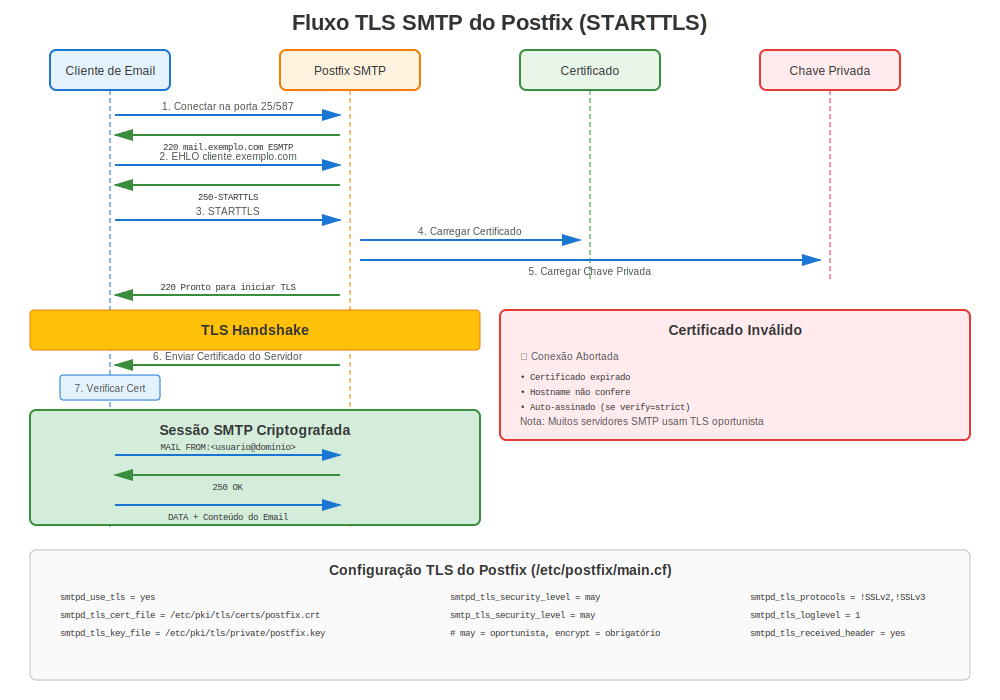

# Capítulo 16: TLS no Servidor de E-mail Postfix

> **Segurança de Email:** Aprenda como configurar criptografia TLS para servidores de email Postfix no RHEL, protegendo comunicações de email com certificados.

---

## 16.1 Visão Geral Postfix no RHEL



**Nome do Pacote:** `postfix`
**Localização Config:** `/etc/postfix/main.cf`
**Caminho Certificados:** `/etc/pki/tls/certs/`
**Caminho Chaves:** `/etc/pki/tls/private/`
**Portas:** 25 (SMTP), 465 (SMTPS), 587 (Submission com STARTTLS)

### Por Que TLS para Email?

- ✅ **Criptografar email em trânsito** (prevenir escuta clandestina)
- ✅ **Autenticar servidores de email** (prevenir personificação)
- ✅ **Cumprir requisitos de conformidade** (HIPAA, PCI-DSS)
- ✅ **Prevenir spam/phishing** (SPF, DKIM, DMARC funcionam melhor com TLS)

---

## 16.2 Instalação

### Todas Versões RHEL

```bash
#============================================#
# INSTALAR POSTFIX
#============================================#

# Instalar Postfix
sudo dnf install postfix -y

# Parar e desabilitar Sendmail (se presente)
sudo systemctl stop sendmail 2>/dev/null
sudo systemctl disable sendmail 2>/dev/null

# Habilitar Postfix
sudo systemctl enable postfix
sudo systemctl start postfix

# Abrir firewall
sudo firewall-cmd --permanent --add-service=smtp
sudo firewall-cmd --permanent --add-service=smtps
sudo firewall-cmd --permanent --add-service=smtp-submission
sudo firewall-cmd --reload

# Verificar
systemctl status postfix
ss -tlnp | grep -E ':(25|465|587)'
```

---

## 16.3 Configuração TLS Lado Servidor

### Receber Email com TLS (SMTPD)

```bash
#============================================#
# /etc/postfix/main.cf - TLS SERVIDOR (RECEBENDO)
#============================================#

# Arquivos de certificado
smtpd_tls_cert_file = /etc/pki/tls/certs/mail.example.com.crt
smtpd_tls_key_file = /etc/pki/tls/private/mail.example.com.key
smtpd_tls_CAfile = /etc/pki/tls/certs/ca-bundle.crt

# Nível de segurança TLS
smtpd_tls_security_level = may  # ou 'encrypt' para requerer TLS

# Logging
smtpd_tls_loglevel = 1
smtpd_tls_received_header = yes

# Cache de sessão (desempenho)
smtpd_tls_session_cache_database = btree:${data_directory}/smtpd_scache

# Autenticação - apenas sobre TLS
smtpd_tls_auth_only = yes

# RHEL 7: Especificar protocolos manualmente
# smtpd_tls_protocols = !SSLv2, !SSLv3, !TLSv1, !TLSv1.1
# smtpd_tls_mandatory_protocols = !SSLv2, !SSLv3, !TLSv1, !TLSv1.1

# RHEL 8/9/10: Crypto-policies lidam com protocolos automaticamente
# (não precisa especificar smtpd_tls_protocols)
```

**Níveis de Segurança Explicados:**

| Nível | Comportamento | Caso de Uso |
|-------|---------------|-------------|
| `none` | TLS desabilitado | Não recomendado |
| `may` | TLS opcional (oportunista) | Padrão (compatível) |
| `encrypt` | TLS requerido | Ambientes alta segurança |
| `dane` | Validação baseada em DNSSEC | Configurações avançadas |

---

## 16.4 Configuração TLS Lado Cliente

### Enviar Email com TLS (SMTP)

```bash
#============================================#
# /etc/postfix/main.cf - TLS CLIENTE (ENVIANDO)
#============================================#

# Arquivos certificado (opcional para cliente)
smtp_tls_cert_file = /etc/pki/tls/certs/mail.example.com.crt
smtp_tls_key_file = /etc/pki/tls/private/mail.example.com.key
smtp_tls_CAfile = /etc/pki/tls/certs/ca-bundle.crt

# Nível segurança TLS para saída
smtp_tls_security_level = may  # ou 'encrypt' para requerer

# Logging
smtp_tls_loglevel = 1

# Cache sessão
smtp_tls_session_cache_database = btree:${data_directory}/smtp_scache

# RHEL 7: Especificar protocolos
# smtp_tls_protocols = !SSLv2, !SSLv3, !TLSv1, !TLSv1.1
# smtp_tls_mandatory_protocols = !SSLv2, !SSLv3, !TLSv1, !TLSv1.1

# RHEL 8/9/10: Crypto-policies lidam com isso
```

---

## 16.5 Configuração Postfix TLS Completo

### Exemplo Configuração Completa

```bash
#============================================#
# CONFIGURAÇÃO POSTFIX TLS COMPLETA
#============================================#

# 1. Gerar certificado e chave
sudo openssl genpkey -algorithm RSA \
  -out /etc/pki/tls/private/mail.example.com.key \
  -pkeyopt rsa_keygen_bits:2048

sudo chmod 600 /etc/pki/tls/private/mail.example.com.key

# 2. Gerar CSR
sudo openssl req -new \
  -key /etc/pki/tls/private/mail.example.com.key \
  -out /tmp/mail.example.com.csr \
  -subj "/CN=mail.example.com" \
  -addext "subjectAltName=DNS:mail.example.com,DNS:smtp.example.com"

# 3. Obter certificado da CA, instalá-lo
sudo cp mail.example.com.crt /etc/pki/tls/certs/
sudo chmod 644 /etc/pki/tls/certs/mail.example.com.crt

# 4. Editar /etc/postfix/main.cf
sudo vi /etc/postfix/main.cf

# Adicionar configuração TLS (ver seções 16.3 e 16.4)

# 5. Testar configuração
sudo postfix check

# 6. Recarregar Postfix
sudo systemctl reload postfix

# 7. Testar SMTP TLS
openssl s_client -starttls smtp -connect mail.example.com:25
```

---

## 16.6 Configuração SMTPS (Porta 465)

### Habilitar Serviço SMTPS

```bash
#============================================#
# /etc/postfix/master.cf - HABILITAR SMTPS
#============================================#

# Descomentar ou adicionar serviço SMTPS (porta 465)
smtps     inet  n       -       n       -       -       smtpd
  -o syslog_name=postfix/smtps
  -o smtpd_tls_wrappermode=yes
  -o smtpd_sasl_auth_enable=yes
  -o smtpd_recipient_restrictions=permit_sasl_authenticated,reject
  -o milter_macro_daemon_name=ORIGINATING

# Recarregar
sudo systemctl reload postfix

# Verificar
ss -tlnp | grep :465
```

### Testar SMTPS

```bash
# Conectar a SMTPS (TLS imediato, sem STARTTLS)
openssl s_client -connect mail.example.com:465

# Deveria mostrar handshake TLS imediatamente
```

---

## 16.7 Porta Submission (587) com STARTTLS

### Habilitar Serviço Submission

```bash
#============================================#
# /etc/postfix/master.cf - HABILITAR SUBMISSION
#============================================#

# Descomentar ou adicionar serviço submission (porta 587)
submission inet n       -       n       -       -       smtpd
  -o syslog_name=postfix/submission
  -o smtpd_tls_security_level=encrypt
  -o smtpd_sasl_auth_enable=yes
  -o smtpd_recipient_restrictions=permit_sasl_authenticated,reject
  -o milter_macro_daemon_name=ORIGINATING

# Recarregar
sudo systemctl reload postfix

# Verificar
ss -tlnp | grep :587
```

### Testar Porta Submission

```bash
# Testar STARTTLS na porta 587
openssl s_client -starttls smtp -connect mail.example.com:587

# Deveria mostrar:
# STARTTLS
# 220 2.0.0 Ready to start TLS
```

---

## 16.8 Integração certmonger

### Gerenciamento Automatizado Certificados para Postfix

```bash
#============================================#
# CERTMONGER + POSTFIX
#============================================#

# Instalar certmonger
sudo dnf install certmonger
sudo systemctl enable --now certmonger

# Solicitar certificado do FreeIPA
sudo ipa-getcert request \
  -f /etc/pki/tls/certs/mail.example.com.crt \
  -k /etc/pki/tls/private/mail.example.com.key \
  -D mail.example.com \
  -K host/mail.example.com@REALM \
  -C "postfix reload"  # Auto-recarregar Postfix após renovação

# Verificar status
sudo getcert list

# Postfix automaticamente usa certificado renovado!
```

---

## 16.9 Autenticação Certificado Cliente

### Requerer Certificados Cliente (mTLS para SMTP)

```bash
#============================================#
# /etc/postfix/main.cf - AUTH CERT CLIENTE
#============================================#

# Certificados servidor (como antes)
smtpd_tls_cert_file = /etc/pki/tls/certs/mail.crt
smtpd_tls_key_file = /etc/pki/tls/private/mail.key

# Verificação certificado cliente
smtpd_tls_CAfile = /etc/pki/tls/certs/client-ca.crt
smtpd_tls_ask_ccert = yes
smtpd_tls_req_ccert = yes  # Requerer cert cliente

# Mapear certificado para usuário
smtpd_recipient_restrictions =
  permit_tls_clientcerts,
  reject

# Recarregar
sudo postfix reload
```

**Testar com certificado cliente:**
```bash
openssl s_client -starttls smtp \
  -connect mail.example.com:25 \
  -cert client.crt \
  -key client.key \
  -CAfile ca.crt
```

---

## 16.10 Solução de Problemas Postfix TLS

### Comandos de Diagnóstico

```bash
#============================================#
# SOLUÇÃO DE PROBLEMAS TLS POSTFIX
#============================================#

# Verificar configuração Postfix
sudo postconf | grep -i tls

# Testar sintaxe configuração
sudo postfix check

# Ver configurações TLS específicas
sudo postconf smtpd_tls_cert_file smtpd_tls_key_file

# Verificar se arquivos certificado existem
ls -l /etc/pki/tls/certs/mail.crt
ls -l /etc/pki/tls/private/mail.key

# Verificar coincidência par cert/chave
CERT_MOD=$(openssl x509 -noout -modulus -in /etc/pki/tls/certs/mail.crt | openssl md5)
KEY_MOD=$(openssl rsa -noout -modulus -in /etc/pki/tls/private/mail.key | openssl md5)
[ "$CERT_MOD" = "$KEY_MOD" ] && echo "✅ Coincide" || echo "❌ Desajuste!"

# Testar SMTP STARTTLS
openssl s_client -starttls smtp -connect mail.example.com:25

# Testar SMTPS (porta 465)
openssl s_client -connect mail.example.com:465

# Verificar logs
sudo tail -f /var/log/maillog | grep -i tls

# Verificar fila Postfix
mailq

# Logging verbose (para solução de problemas)
sudo postconf smtpd_tls_loglevel=2
sudo postfix reload
# Verificar /var/log/maillog para info TLS detalhada
```

### Problemas TLS Comuns do Postfix

| Erro | Causa | Solução |
|------|-------|---------|
| "SSL_accept error" | Problema certificado/chave | Verificar coincidência par cert/chave |
| "No shared cipher" | Incompatibilidade cipher | Verificar crypto-policy ou cliente |
| "certificate verify failed" | Cadeia confiança quebrada | Instalar certs intermediários |
| "Permission denied" na chave | Permissões erradas | `chmod 600` no arquivo chave |
| "TLS is required but not available" | TLS não habilitado | Definir `smtpd_tls_security_level = may` |
| "STARTTLS failed" | Problema TLS cliente | Verificar suporte TLS cliente |

---

## 16.11 Considerações Específicas por Versão

### RHEL 7

```bash
#============================================#
# POSTFIX TLS - ESPECÍFICO RHEL 7
#============================================#

# /etc/postfix/main.cf

# DEVE especificar manualmente protocolos TLS
smtpd_tls_protocols = !SSLv2, !SSLv3, !TLSv1, !TLSv1.1
smtpd_tls_mandatory_protocols = !SSLv2, !SSLv3, !TLSv1, !TLSv1.1

smtp_tls_protocols = !SSLv2, !SSLv3, !TLSv1, !TLSv1.1
smtp_tls_mandatory_protocols = !SSLv2, !SSLv3, !TLSv1, !TLSv1.1

# DEVE especificar manualmente cifras
smtpd_tls_mandatory_ciphers = high
smtpd_tls_ciphers = high

smtp_tls_mandatory_ciphers = high
smtp_tls_ciphers = high

# Excluir cifras fracas
smtpd_tls_mandatory_exclude_ciphers = aNULL, eNULL, EXPORT, DES, RC4, MD5, PSK, aECDH, EDH-DSS-DES-CBC3-SHA, EDH-RSA-DES-CBC3-SHA, KRB5-DES, CBC3-SHA
```

### RHEL 8/9/10

```bash
#============================================#
# POSTFIX TLS - RHEL 8/9/10 COM CRYPTO-POLICIES
#============================================#

# /etc/postfix/main.cf

# Arquivos certificado
smtpd_tls_cert_file = /etc/pki/tls/certs/mail.crt
smtpd_tls_key_file = /etc/pki/tls/private/mail.key
smtpd_tls_CAfile = /etc/pki/tls/certs/ca-bundle.crt

# Configurações TLS (crypto-policies lidam com protocolos/cifras!)
smtpd_tls_security_level = may
smtpd_tls_auth_only = yes
smtpd_tls_loglevel = 1

# TLS Cliente
smtp_tls_cert_file = /etc/pki/tls/certs/mail.crt
smtp_tls_key_file = /etc/pki/tls/private/mail.key
smtp_tls_security_level = may
smtp_tls_loglevel = 1

# Isso é tudo! Muito mais simples que RHEL 7
# crypto-policies configuram automaticamente versões TLS e cifras
```

**Diferença Chave:** RHEL 8+ confia em crypto-policies, tornando configuração muito mais simples!

---

## 16.12 Testando Postfix TLS

### Suite de Teste Abrangente

```bash
#============================================#
# TESTE POSTFIX TLS
#============================================#

# Teste 1: STARTTLS na porta 25
openssl s_client -starttls smtp -connect mail.example.com:25

# Procurar por:
# - "250-STARTTLS" nas capacidades servidor
# - Handshake TLS bem-sucedido
# - Detalhes certificado

# Teste 2: SMTPS na porta 465 (TLS direto)
openssl s_client -connect mail.example.com:465

# Teste 3: Porta submission 587 com STARTTLS
openssl s_client -starttls smtp -connect mail.example.com:587

# Teste 4: Verificar certificado do servidor
echo "QUIT" | openssl s_client -starttls smtp -connect mail.example.com:25 2>&1 | \
  openssl x509 -noout -subject -dates

# Teste 5: Enviar email teste
echo "Test email" | mail -s "TLS Test" test@example.com

# Teste 6: Verificar TLS em logs
sudo tail -f /var/log/maillog | grep TLS

# Teste 7: Verificar se TLS está sendo usado
sudo postconf | grep -i tls | grep -i level
```

---

## 16.13 Melhores Práticas de Segurança

### Configuração Postfix TLS Fortalecida

```bash
#============================================#
# CONFIG POSTFIX TLS FORTALECIDA
#============================================#

# /etc/postfix/main.cf

# TLS Servidor (receber email)
smtpd_tls_cert_file = /etc/pki/tls/certs/mail.crt
smtpd_tls_key_file = /etc/pki/tls/private/mail.key
smtpd_tls_CAfile = /etc/pki/tls/certs/ca-bundle.crt

# REQUERER TLS para autenticação
smtpd_tls_security_level = may
smtpd_tls_auth_only = yes

# TLS Cliente (enviar email)
smtp_tls_cert_file = /etc/pki/tls/certs/mail.crt
smtp_tls_key_file = /etc/pki/tls/private/mail.key
smtp_tls_security_level = may

# RHEL 7: Desabilitar manualmente protocolos fracos
smtpd_tls_protocols = !SSLv2, !SSLv3, !TLSv1, !TLSv1.1
smtp_tls_protocols = !SSLv2, !SSLv3, !TLSv1, !TLSv1.1

# Obrigatório para conexões autenticadas
smtpd_tls_mandatory_protocols = !SSLv2, !SSLv3, !TLSv1, !TLSv1.1

# Configurações cifra (RHEL 7)
smtpd_tls_mandatory_ciphers = high
smtpd_tls_exclude_ciphers = aNULL, eNULL, EXPORT, DES, RC4, MD5, PSK, aECDH, EDH-DSS-DES-CBC3-SHA, EDH-RSA-DES-CBC3-SHA, KRB5-DES, CBC3-SHA

# Caching sessão
smtpd_tls_session_cache_database = btree:${data_directory}/smtpd_scache
smtp_tls_session_cache_database = btree:${data_directory}/smtp_scache

# Logging aprimorado (temporário para solução de problemas)
smtpd_tls_loglevel = 1
smtp_tls_loglevel = 1

# Desempenho
smtpd_tls_session_cache_timeout = 3600s
tls_random_source = dev:/dev/urandom
```

---

## 16.14 Dovecot IMAP/POP3 com TLS

### Configuração Dovecot

Enquanto este capítulo foca em Postfix (SMTP), Dovecot frequentemente roda junto para IMAP/POP3:

```bash
#============================================#
# DOVECOT TLS (/etc/dovecot/conf.d/10-ssl.conf)
#============================================#

# Habilitar SSL
ssl = required

# Arquivos certificado
ssl_cert = </etc/pki/tls/certs/mail.example.com.crt
ssl_key = </etc/pki/tls/private/mail.example.com.key

# CA para verificação cert cliente (opcional)
#ssl_ca = </etc/pki/tls/certs/ca-bundle.crt

# RHEL 8/9/10: crypto-policies lidam com isso

# Protocolos TLS (RHEL 7)
#ssl_min_protocol = TLSv1.2

# Preferências suite cifra
#ssl_cipher_list = HIGH:!aNULL:!MD5

# Recarregar
sudo systemctl reload dovecot
```

**Testar IMAPS:**
```bash
openssl s_client -connect mail.example.com:993

# Testar POP3S
openssl s_client -connect mail.example.com:995
```

---

## 16.15 Cenários Comuns

### Cenário 1: TLS Oportunista (Padrão)

**Objetivo:** Aceitar conexões criptografadas e não-criptografadas

```bash
# /etc/postfix/main.cf
smtpd_tls_security_level = may  # TLS opcional
smtp_tls_security_level = may   # TLS opcional

# Por quê: Compatibilidade máxima
# Desvantagem: Algumas conexões podem não ser criptografadas
```

### Cenário 2: TLS Obrigatório (Alta Segurança)

**Objetivo:** Rejeitar conexões não-criptografadas

```bash
# /etc/postfix/main.cf
smtpd_tls_security_level = encrypt  # REQUERER TLS
smtp_tls_security_level = encrypt   # REQUERER TLS

# Por quê: Segurança máxima
# Desvantagem: Sistemas antigos podem falhar ao conectar
```

### Cenário 3: Certificado Cliente para Relay

**Objetivo:** Permitir relay apenas com certificado cliente válido

```bash
# /etc/postfix/main.cf
smtpd_tls_cert_file = /etc/pki/tls/certs/mail.crt
smtpd_tls_key_file = /etc/pki/tls/private/mail.key
smtpd_tls_CAfile = /etc/pki/tls/certs/client-ca.crt

smtpd_tls_ask_ccert = yes
smtpd_tls_req_ccert = yes

smtpd_recipient_restrictions =
  permit_tls_clientcerts,
  reject_unauth_destination

# Apenas clientes com cert válido de client-ca.crt podem fazer relay
```

---

## 16.16 Monitorando Postfix TLS

### O Que Monitorar

```bash
#============================================#
# MONITORAMENTO POSTFIX TLS
#============================================#

# Verificar uso TLS em logs
sudo grep "TLS connection established" /var/log/maillog | tail -20

# Contar conexões TLS vs não-TLS
sudo grep "connect from" /var/log/maillog | grep -c "TLS"

# Verificar por erros TLS
sudo grep "TLS" /var/log/maillog | grep -i error

# Monitorar expiração certificado
openssl x509 -in /etc/pki/tls/certs/mail.crt -noout -checkend $((86400*30))

# Status certmonger (se usado)
sudo getcert list -f /etc/pki/tls/certs/mail.crt

# Verificar fila por falhas TLS
mailq
```

### Script de Monitoramento

```bash
#!/bin/bash
# monitor-postfix-tls.sh

echo "=== Monitoramento Postfix TLS ==="

# Expiração certificado
echo "1. Expiração Certificado:"
openssl x509 -in /etc/pki/tls/certs/mail.crt -noout -enddate

# Conexões TLS hoje
echo ""
echo "2. Conexões TLS Hoje:"
sudo grep "$(date '+%b %e')" /var/log/maillog | grep "TLS connection" | wc -l

# Erros TLS hoje
echo ""
echo "3. Erros TLS Hoje:"
sudo grep "$(date '+%b %e')" /var/log/maillog | grep -i "tls.*error" | tail -5

# Status serviço
echo ""
echo "4. Status Postfix:"
systemctl is-active postfix

# Portas escutando
echo ""
echo "5. Escutando em:"
ss -tlnp | grep master | grep -E ':(25|465|587)'
```

---

## 16.17 Problemas e Soluções Comuns

### Problema 1: Certificado Não Confiável por Clientes

**Sintoma:** Clientes recebem avisos "untrusted certificate"

**Diagnóstico:**
```bash
# Testar cadeia certificado
openssl s_client -starttls smtp -connect mail.example.com:25 -showcerts

# Verificar se certificados intermediários incluídos
sudo postconf smtpd_tls_cert_file
# Deveria incluir cadeia completa ou usar smtpd_tls_chain_files
```

**Solução:**
```bash
# Opção 1: Incluir cadeia no arquivo certificado
cat server.crt intermediate.crt > /etc/pki/tls/certs/mail-chain.crt

# Atualizar config
sudo postconf -e 'smtpd_tls_cert_file = /etc/pki/tls/certs/mail-chain.crt'
sudo postfix reload

# Opção 2: Usar arquivo cadeia separado (Postfix 3.4+)
sudo postconf -e 'smtpd_tls_chain_files = /etc/pki/tls/certs/chain.crt'
```

### Problema 2: "Permission denied" na Chave Privada

**Sintoma:** Postfix não inicia, logs mostram erro permissão

**Corrigir:**
```bash
# Definir permissões corretas
sudo chmod 600 /etc/pki/tls/private/mail.key
sudo chown root:postfix /etc/pki/tls/private/mail.key

# Corrigir contexto SELinux
sudo restorecon -v /etc/pki/tls/private/mail.key

# Reiniciar Postfix
sudo systemctl restart postfix
```

### Problema 3: TLS Não Oferecido aos Clientes

**Sintoma:** STARTTLS não mostrado em resposta EHLO

**Diagnóstico:**
```bash
# Telnet para servidor
telnet mail.example.com 25
# Digitar: EHLO test
# Deveria mostrar: 250-STARTTLS

# Se não mostrado, verificar config
sudo postconf smtpd_tls_security_level
# Deveria ser 'may' ou 'encrypt', não 'none'
```

**Solução:**
```bash
sudo postconf -e 'smtpd_tls_security_level = may'
sudo postfix reload
```

---

## 16.18 Tabela Comparação Versões

| Recurso | RHEL 7 | RHEL 8 | RHEL 9 | RHEL 10 |
|---------|--------|--------|--------|---------|
| **Versão Postfix** | 2.10.x | 3.3.x+ | 3.5.x+ | 3.8.x+ |
| **OpenSSL** | 1.0.2k | 1.1.1k | 3.5.5 | 3.5.5 |
| **Config TLS** | Manual | Crypto-policies | Crypto-policies | Crypto-policies |
| **TLS Padrão** | Pode incluir 1.0/1.1 | TLS 1.2+ | TLS 1.2+ | TLS 1.3 preferido |
| **certmonger** | Básico | Aprimorado | Suporte ACME | Suporte ACME |

---

## 16.19 Script Configuração Rápido

```bash
#!/bin/bash
# setup-postfix-tls.sh - Setup Postfix TLS completo

DOMAIN="example.com"
HOSTNAME="mail.$DOMAIN"

echo "=== Setup Postfix TLS para $HOSTNAME ==="

# 1. Instalar Postfix
sudo dnf install -y postfix

# 2. Gerar certificado (ou usar certmonger)
sudo openssl genpkey -algorithm RSA \
  -out /etc/pki/tls/private/$HOSTNAME.key \
  -pkeyopt rsa_keygen_bits:2048

sudo chmod 600 /etc/pki/tls/private/$HOSTNAME.key

# 3. Gerar autoassinado para teste (substituir com cert apropriado!)
sudo openssl req -new -x509 -days 365 \
  -key /etc/pki/tls/private/$HOSTNAME.key \
  -out /etc/pki/tls/certs/$HOSTNAME.crt \
  -subj "/CN=$HOSTNAME" \
  -addext "subjectAltName=DNS:$HOSTNAME,DNS:smtp.$DOMAIN"

# 4. Configurar Postfix
sudo postconf -e "smtpd_tls_cert_file = /etc/pki/tls/certs/$HOSTNAME.crt"
sudo postconf -e "smtpd_tls_key_file = /etc/pki/tls/private/$HOSTNAME.key"
sudo postconf -e "smtpd_tls_security_level = may"
sudo postconf -e "smtpd_tls_auth_only = yes"
sudo postconf -e "smtpd_tls_loglevel = 1"

sudo postconf -e "smtp_tls_cert_file = /etc/pki/tls/certs/$HOSTNAME.crt"
sudo postconf -e "smtp_tls_key_file = /etc/pki/tls/private/$HOSTNAME.key"
sudo postconf -e "smtp_tls_security_level = may"

# 5. Abrir firewall
sudo firewall-cmd --permanent --add-service=smtp
sudo firewall-cmd --permanent --add-service=smtps
sudo firewall-cmd --permanent --add-service=smtp-submission
sudo firewall-cmd --reload

# 6. Iniciar Postfix
sudo systemctl enable postfix
sudo systemctl restart postfix

# 7. Testar
echo "Testando SMTP STARTTLS..."
echo "QUIT" | openssl s_client -starttls smtp -connect localhost:25 2>&1 | grep -E "(CONNECTED|subject=)"

echo "✅ Setup Postfix TLS completo!"
echo "⚠️ Substituir cert autoassinado com certificado apropriado da CA"
```

---

## 16.20 Conclusões Chave

1. **Postfix suporta TLS** nas portas 25 (STARTTLS), 465 (SMTPS), 587 (Submission)
2. **RHEL 7 requer config TLS manual** (protocolos, cifras)
3. **RHEL 8+ usa crypto-policies** (muito mais simples!)
4. **Níveis de segurança:** `none`, `may`, `encrypt`, `dane`
5. **certmonger funciona ótimo** com Postfix
6. **Sempre testar** com `openssl s_client -starttls smtp`
7. **Monitorar logs** para erros TLS

---

## Cartão de Referência Rápida

```
┌──────────────────────────────────────────────────────────────┐
│ REFERÊNCIA RÁPIDA POSTFIX TLS                                │
├──────────────────────────────────────────────────────────────┤
│ Config:       /etc/postfix/main.cf                           │
│ Certs:        smtpd_tls_cert_file = /path/to/cert.crt        │
│ Chaves:       smtpd_tls_key_file = /path/to/key.key          │
│ Segurança:    smtpd_tls_security_level = may|encrypt         │
│                                                              │
│ Testar:       openssl s_client -starttls smtp -connect :25   │
│ Recarregar:   postfix reload                                 │
│ Verificar:    postfix check                                  │
│ Logs:         tail -f /var/log/maillog | grep TLS            │
│                                                              │
│ Portas:       25 (SMTP+STARTTLS)                             │
│               465 (SMTPS - TLS direto)                       │
│               587 (Submission com STARTTLS)                  │
│                                                              │
│ certmonger:   ipa-getcert ... -C "postfix reload"            │
└──────────────────────────────────────────────────────────────┘

⚠️ RHEL 7: Config manual protocolo/cifra necessária
✅ RHEL 8/9/10: Crypto-policies lidam com ajustes TLS
```

---

## 🧪 Laboratório Prático

**Lab 08: TLS do Postfix**

Configure TLS para servidor de email Postfix

- 📁 **Localização:** `labs/pt_BR/08-postfix-tls/`
- ⏱️ **Tempo:** 30 minutos
- 🎯 **Nível:** Intermediário

---

**Navegação do Capítulo**

| [← Anterior: Capítulo 15 - NGINX no RHEL](15-nginx.md) | [Próximo: Capítulo 17 - OpenLDAP e Serviços de Diretório →](17-openldap-ldaps.md) |
|:---|---:|
