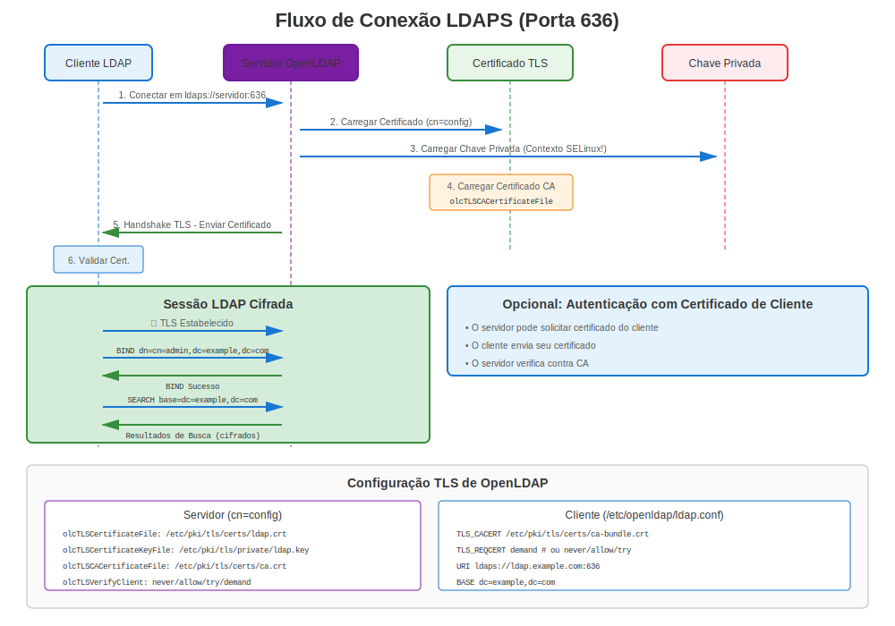

# Capítulo 17: OpenLDAP e Serviços de Diretório

> **Diretório Empresarial:** Aprenda como proteger serviços de diretório OpenLDAP com TLS/SSL no RHEL, protegendo autenticação de usuário e consultas de diretório.

---

## 17.1 LDAP vs LDAPS vs STARTTLS



### Três Formas de Proteger LDAP

| Método | Porta | Criptografia | Caso de Uso |
|--------|-------|--------------|-------------|
| **LDAP** | 389 | ❌ Nenhuma | Legado, não recomendado |
| **LDAPS** | 636 | ✅ TLS desde início | Preferido, criptografado |
| **LDAP+STARTTLS** | 389 | ✅ Atualizar para TLS | Alternativa ao LDAPS |

**Recomendação:** Usar LDAPS (porta 636) para simplicidade e segurança.

---

## 17.2 Instalação OpenLDAP

### Todas Versões RHEL

```bash
#============================================#
# INSTALAR SERVIDOR OPENLDAP
#============================================#

# Instalar servidor OpenLDAP
sudo dnf install openldap-servers openldap-clients -y

# Iniciar e habilitar
sudo systemctl enable slapd
sudo systemctl start slapd

# Abrir firewall
sudo firewall-cmd --permanent --add-service=ldap
sudo firewall-cmd --permanent --add-service=ldaps
sudo firewall-cmd --reload

# Verificar
systemctl status slapd
ss -tlnp | grep -E ':(389|636)'
```

---

## 17.3 Gerando Certificados para LDAP

### Requisitos Certificado

Certificados LDAP devem incluir:
- ✅ **CN** coincidindo com hostname servidor LDAP
- ✅ **SANs** com FQDN servidor LDAP
- ✅ **Server Authentication** key usage
- ✅ **Cadeia confiança válida**

```bash
#============================================#
# GERAR CERTIFICADO SERVIDOR LDAP
#============================================#

# Passo 1: Gerar chave privada
sudo openssl genpkey -algorithm RSA \
  -out /etc/openldap/certs/ldap.key \
  -pkeyopt rsa_keygen_bits:2048

# Passo 2: Definir permissões (importante!)
sudo chmod 600 /etc/openldap/certs/ldap.key
sudo chown ldap:ldap /etc/openldap/certs/ldap.key

# Passo 3: Gerar CSR
sudo openssl req -new \
  -key /etc/openldap/certs/ldap.key \
  -out /tmp/ldap.csr \
  -subj "/CN=ldap.example.com" \
  -addext "subjectAltName=DNS:ldap.example.com,DNS:dir.example.com"

# Passo 4: Obter certificado da CA

# Passo 5: Instalar certificado
sudo cp ldap.crt /etc/openldap/certs/
sudo chmod 644 /etc/openldap/certs/ldap.crt
sudo chown ldap:ldap /etc/openldap/certs/ldap.crt

# Passo 6: Instalar certificado CA
sudo cp ca.crt /etc/openldap/certs/
sudo chmod 644 /etc/openldap/certs/ca.crt
```

---

## 17.4 Configuração TLS OpenLDAP

### Método 1: cn=config (Configuração Dinâmica)

```bash
#============================================#
# CONFIGURAR TLS COM cn=config (PREFERIDO)
#============================================#

# Criar arquivo LDIF
cat > /tmp/tls-config.ldif << EOF
dn: cn=config
changetype: modify
add: olcTLSCertificateFile
olcTLSCertificateFile: /etc/openldap/certs/ldap.crt
-
add: olcTLSCertificateKeyFile
olcTLSCertificateKeyFile: /etc/openldap/certs/ldap.key
-
add: olcTLSCACertificateFile
olcTLSCACertificateFile: /etc/openldap/certs/ca.crt
-
replace: olcTLSProtocolMin
olcTLSProtocolMin: 3.2
EOF

# Aplicar configuração
sudo ldapmodify -Y EXTERNAL -H ldapi:/// -f /tmp/tls-config.ldif

# Reiniciar slapd
sudo systemctl restart slapd

# Verificar
sudo slapcat -b "cn=config" | grep -i tls
```

### Método 2: slapd.conf (Legado)

```bash
#============================================#
# CONFIGURAR TLS COM slapd.conf (LEGADO)
#============================================#

# Editar /etc/openldap/slapd.conf

TLSCertificateFile      /etc/openldap/certs/ldap.crt
TLSCertificateKeyFile   /etc/openldap/certs/ldap.key
TLSCACertificateFile    /etc/openldap/certs/ca.crt

# RHEL 7: Especificar manualmente versão TLS
TLSProtocolMin          1.2

# Reiniciar
sudo systemctl restart slapd
```

---

## 17.5 Configuração Cliente

### Configurar Cliente LDAP para TLS

```bash
#============================================#
# /etc/openldap/ldap.conf - CONFIG CLIENTE
#============================================#

# URI servidor (usar ldaps:// para porta 636)
URI ldaps://ldap.example.com

# Certificado CA para validação
TLS_CACERT /etc/pki/tls/certs/ca-bundle.crt

# Verificação certificado
TLS_REQCERT demand  # requerer certificado válido

# RHEL 7: Especificar versão TLS mínima
# TLS_PROTOCOL_MIN 1.2
```

### Testar Conexão Cliente LDAP

```bash
#============================================#
# TESTAR CONEXÃO CLIENTE LDAPS
#============================================#

# Testar LDAPS (porta 636)
ldapsearch -H ldaps://ldap.example.com:636 \
  -D "cn=admin,dc=example,dc=com" \
  -W \
  -b "dc=example,dc=com" \
  "(objectClass=*)"

# Testar LDAP com STARTTLS (porta 389)
ldapsearch -H ldap://ldap.example.com:389 -ZZ \
  -D "cn=admin,dc=example,dc=com" \
  -W \
  -b "dc=example,dc=com"

# -ZZ força STARTTLS (falha se indisponível)
# -Z tenta STARTTLS (continua sem se indisponível)
```

---

## 17.6 Integração FreeIPA

**Nota:** FreeIPA é coberto em detalhes no Capítulo 19. Esta é uma visão geral rápida.

### FreeIPA Lida Automaticamente com LDAPS

```bash
#============================================#
# LDAPS FREEIPA (AUTOMÁTICO!)
#============================================#

# FreeIPA configura automaticamente LDAPS
# Sem config certificado manual necessária!

# Testar LDAPS FreeIPA
ldapsearch -H ldaps://ipa.example.com:636 \
  -D "uid=admin,cn=users,cn=accounts,dc=example,dc=com" \
  -W \
  -b "dc=example,dc=com"

# Certificados FreeIPA gerenciados por certmonger automaticamente
sudo getcert list | grep -A10 "Directory Server"
```

---

## 17.7 Testando OpenLDAP TLS

### Teste Abrangente

```bash
#============================================#
# TESTE OPENLDAP TLS
#============================================#

# Teste 1: Verificar se slapd está escutando
ss -tlnp | grep slapd
# Deveria mostrar portas 389 e/ou 636

# Teste 2: Testar conexão LDAPS com OpenSSL
openssl s_client -connect ldap.example.com:636

# Procurar por:
# - Handshake TLS bem-sucedido
# - Detalhes certificado
# - Verify return code: 0 (ok)

# Teste 3: Testar com ldapsearch (anônimo)
ldapsearch -H ldaps://ldap.example.com:636 \
  -x -b "" -s base "(objectClass=*)" namingContexts

# Teste 4: Testar consulta autenticada
ldapsearch -H ldaps://ldap.example.com:636 \
  -D "cn=admin,dc=example,dc=com" \
  -W \
  -b "dc=example,dc=com" \
  "(uid=*)"

# Teste 5: Testar STARTTLS
ldapsearch -H ldap://ldap.example.com:389 -ZZ \
  -x -b "" -s base

# Teste 6: Verificar certificado do servidor
echo | openssl s_client -connect ldap.example.com:636 2>&1 | \
  openssl x509 -noout -subject -issuer -dates
```

---

## 17.8 Solução de Problemas OpenLDAP TLS

### Comandos de Diagnóstico

```bash
#============================================#
# DIAGNÓSTICO OPENLDAP TLS
#============================================#

# Verificar configuração slapd
sudo slapcat -b "cn=config" | grep -i tls

# Verificar arquivos certificado
sudo ls -lZ /etc/openldap/certs/

# Verificar permissões
# Chave deve ser legível pelo usuário 'ldap'
sudo -u ldap cat /etc/openldap/certs/ldap.key >/dev/null && \
  echo "✅ Chave legível" || echo "❌ Permissão negada"

# Verificar contexto SELinux
ls -Z /etc/openldap/certs/*.{crt,key}

# Verificar logs slapd
sudo journalctl -u slapd -f

# Testar com OpenSSL verbose
openssl s_client -connect ldap.example.com:636 -showcerts -debug

# Testar STARTTLS
ldapsearch -H ldap://ldap.example.com:389 -ZZ -d 1
```

### Problemas TLS Comuns do OpenLDAP

| Erro | Causa | Solução |
|------|-------|---------|
| "TLS: can't connect" | Certificado/chave não legível | Verificar propriedade: `chown ldap:ldap` |
| "TLS: hostname does not match" | Desajuste CN/SAN | Regenerar cert com hostname correto |
| "Certificate verification failed" | CA não confiável | Adicionar CA ao repositório de confiança cliente |
| "Permission denied" na chave | Propriedade/permissões erradas | `chmod 600`, `chown ldap:ldap` |
| "TLS engine not initialized" | TLS não configurado | Adicionar diretivas TLS à config |
| "error:14094410:SSL routines" | Desajuste protocolo/cifra | Verificar crypto-policy (RHEL 8+) |

---

## 17.9 Autenticação Certificado Cliente

### Requerer Certificados Cliente

```bash
#============================================#
# OPENLDAP COM AUTH CERT CLIENTE
#============================================#

# Configuração servidor (cn=config)
cat > /tmp/client-cert.ldif << EOF
dn: cn=config
changetype: modify
add: olcTLSVerifyClient
olcTLSVerifyClient: demand
-
add: olcTLSCACertificateFile
olcTLSCACertificateFile: /etc/openldap/certs/client-ca.crt
EOF

sudo ldapmodify -Y EXTERNAL -H ldapi:/// -f /tmp/client-cert.ldif

# Reiniciar
sudo systemctl restart slapd
```

**Conexão cliente com certificado:**
```bash
# Cliente deve fornecer certificado
ldapsearch -H ldaps://ldap.example.com:636 \
  -x -b "dc=example,dc=com" \
  -ZZ

# Configurar cert cliente em /etc/openldap/ldap.conf:
TLS_CERT /etc/openldap/certs/client.crt
TLS_KEY /etc/openldap/certs/client.key
```

---

## 17.10 Considerações Específicas por Versão

### RHEL 7

```bash
#============================================#
# OPENLDAP TLS - RHEL 7
#============================================#

# Especificação protocolo TLS manual
# Em slapd.conf ou cn=config:
TLSProtocolMin 1.2

# Ou com cn=config:
olcTLSProtocolMin: 3.2  # 3.1=TLS1.0, 3.2=TLS1.1, 3.3=TLS1.2

# Configuração cipher manual
TLSCipherSuite HIGH:!aNULL:!MD5:!3DES

# Testar
openssl s_client -connect ldap.example.com:636 -tls1_2
```

### RHEL 8/9/10

```bash
#============================================#
# OPENLDAP TLS - RHEL 8/9/10
#============================================#

# Crypto-policies configuram automaticamente TLS
# Sem necessidade especificar TLSProtocolMin ou cifras!

# Apenas configurar certificados:
olcTLSCertificateFile: /etc/openldap/certs/ldap.crt
olcTLSCertificateKeyFile: /etc/openldap/certs/ldap.key
olcTLSCACertificateFile: /etc/openldap/certs/ca.crt

# Crypto-policy lida com resto
update-crypto-policies --show
```

---

## 17.11 certmonger com OpenLDAP

### Gerenciamento Certificado Automatizado

```bash
#============================================#
# CERTMONGER + OPENLDAP
#============================================#

# Instalar certmonger
sudo dnf install certmonger
sudo systemctl enable --now certmonger

# Solicitar certificado do FreeIPA
sudo ipa-getcert request \
  -f /etc/openldap/certs/ldap.crt \
  -k /etc/openldap/certs/ldap.key \
  -D ldap.example.com \
  -K ldap/ldap.example.com@REALM \
  -C "systemctl restart slapd"  # Reiniciar slapd após renovação

# Definir propriedade apropriada
sudo chown ldap:ldap /etc/openldap/certs/ldap.{crt,key}
sudo chmod 600 /etc/openldap/certs/ldap.key

# Monitorar
sudo getcert list
```

---

## 17.12 Solução de Problemas LDAPS

### Passos de Diagnóstico

```bash
#============================================#
# SOLUÇÃO DE PROBLEMAS LDAPS
#============================================#

# Passo 1: Verificar se slapd está escutando na 636
ss -tlnp | grep 636

# Passo 2: Verificar configuração certificado
sudo slapcat -b "cn=config" | grep olcTLS

# Passo 3: Testar arquivo certificado
sudo openssl x509 -in /etc/openldap/certs/ldap.crt -noout -text

# Passo 4: Testar arquivo chave
sudo openssl rsa -in /etc/openldap/certs/ldap.key -check

# Passo 5: Verificar coincidência cert/chave
CERT_MOD=$(openssl x509 -noout -modulus -in /etc/openldap/certs/ldap.crt | openssl md5)
KEY_MOD=$(openssl rsa -noout -modulus -in /etc/openldap/certs/ldap.key | openssl md5)
[ "$CERT_MOD" = "$KEY_MOD" ] && echo "✅ Coincide" || echo "❌ Desajuste!"

# Passo 6: Verificar permissões
ls -l /etc/openldap/certs/
# Chave deve ser de propriedade ldap:ldap com modo 600

# Passo 7: Testar conexão
openssl s_client -connect ldap.example.com:636

# Passo 8: Verificar logs
sudo journalctl -u slapd | grep -i tls

# Passo 9: Testar do cliente
ldapsearch -H ldaps://ldap.example.com:636 -x -b "" -s base

# Passo 10: Verificar SELinux
sudo ausearch -m avc -ts recent | grep ldap
```

---

## 17.13 Problemas e Soluções Comuns

### Problema 1: Erro "TLS: can't accept"

**Sintoma:** Conexão LDAPS recusada

**Diagnóstico:**
```bash
sudo journalctl -u slapd | grep "TLS: can't accept"
```

**Causas e Soluções:**
```bash
# Causa 1: Chave não legível pelo usuário ldap
sudo chown ldap:ldap /etc/openldap/certs/ldap.key
sudo chmod 600 /etc/openldap/certs/ldap.key

# Causa 2: SELinux bloqueando
sudo restorecon -Rv /etc/openldap/certs/
# Ou verificar negações:
sudo ausearch -m avc -ts recent | grep ldap

# Causa 3: Desajuste certificado/chave
# Regenerar CSR com chave correta
```

### Problema 2: "TLS: hostname does not match"

**Sintoma:** Cliente recebe erro hostname mismatch

**Diagnóstico:**
```bash
# Verificar CN e SANs certificado
openssl x509 -in /etc/openldap/certs/ldap.crt -noout -subject -ext subjectAltName
```

**Solução:**
```bash
# Reemitir certificado com hostname correto nos SANs
openssl req -new -key /etc/openldap/certs/ldap.key -out /tmp/ldap.csr \
  -subj "/CN=ldap.example.com" \
  -addext "subjectAltName=DNS:ldap.example.com,DNS:ldap,IP:10.0.0.10"

# Ou no lado cliente: permitir verificação mais frouxa (NÃO recomendado para produção)
# Em /etc/openldap/ldap.conf:
TLS_REQCERT allow  # em vez de 'demand'
```

### Problema 3: Certificado Não Confiável

**Sintoma:** "Certificate verification failed"

**Solução:**
```bash
# Adicionar CA ao repositório de confiança sistema
sudo cp ldap-ca.crt /etc/pki/ca-trust/source/anchors/
sudo update-ca-trust

# Ou especificar CA na config cliente
# /etc/openldap/ldap.conf:
TLS_CACERT /etc/openldap/certs/ca.crt
```

---

## 17.14 Melhores Práticas de Segurança

### Configuração TLS OpenLDAP Fortalecida

```ldif
#============================================#
# CONFIG TLS LDAP FORTALECIDA (cn=config)
#============================================#

dn: cn=config
changetype: modify
replace: olcTLSCertificateFile
olcTLSCertificateFile: /etc/openldap/certs/ldap.crt
-
replace: olcTLSCertificateKeyFile
olcTLSCertificateKeyFile: /etc/openldap/certs/ldap.key
-
replace: olcTLSCACertificateFile
olcTLSCACertificateFile: /etc/openldap/certs/ca.crt
-
replace: olcTLSProtocolMin
olcTLSProtocolMin: 3.3
-
replace: olcTLSCipherSuite
olcTLSCipherSuite: HIGH:!aNULL:!MD5:!RC4
-
add: olcTLSVerifyClient
olcTLSVerifyClient: never
```

**Aplicar:**
```bash
sudo ldapmodify -Y EXTERNAL -H ldapi:/// -f hardened-tls.ldif
sudo systemctl restart slapd
```

---

## 17.15 Integração com Serviços Sistema

### SSSD com LDAPS (Autenticação Sistema)

```bash
#============================================#
# CONFIGURAR SSSD PARA USAR LDAPS
#============================================#

# /etc/sssd/sssd.conf

[domain/example.com]
id_provider = ldap
auth_provider = ldap
ldap_uri = ldaps://ldap.example.com:636
ldap_search_base = dc=example,dc=com
ldap_tls_cacert = /etc/pki/tls/certs/ca-bundle.crt
ldap_tls_reqcert = demand

# Reiniciar SSSD
sudo systemctl restart sssd

# Testar
id ldapuser@example.com
```

---

## 17.16 Monitorando LDAP TLS

### Comandos de Monitoramento

```bash
#============================================#
# MONITORAR LDAP TLS
#============================================#

# Verificar expiração certificado
openssl s_client -connect ldap.example.com:636 2>/dev/null | \
  openssl x509 -noout -dates

# Verificar conexões TLS
sudo journalctl -u slapd | grep "TLS established"

# Contar conexões LDAPS vs LDAP
sudo journalctl -u slapd --since today | grep -c "conn=.*LDAPS"
sudo journalctl -u slapd --since today | grep -c "conn=.*LDAP"

# Verificar por erros TLS
sudo journalctl -u slapd | grep -i "tls.*error"

# Status certmonger (se usado)
sudo getcert list -d /etc/openldap/certs
```

---

## 17.17 Conclusões Chave

1. **LDAPS (porta 636)** é mais simples que STARTTLS
2. **Propriedade certificado crítica** - Deve ser legível pelo usuário `ldap`
3. **cn=config preferido** sobre slapd.conf (RHEL moderno)
4. **FreeIPA lida com LDAPS automaticamente** - Muito mais fácil!
5. **Configuração cliente importa** - Definir TLS_CACERT corretamente
6. **Testar completamente** - Usar `openssl s_client` e `ldapsearch -ZZ`
7. **certmonger automatiza** renovação certificado

---

## Cartão de Referência Rápida

```
┌──────────────────────────────────────────────────────────────┐
│ REFERÊNCIA RÁPIDA OPENLDAP TLS                               │
├──────────────────────────────────────────────────────────────┤
│ Config:        cn=config (dinâmica) ou slapd.conf (legado)   │
│ Certs:         /etc/openldap/certs/                          │
│ Propriedade:   chown ldap:ldap *.{crt,key}                   │
│ Permissões:    chmod 600 ldap.key                            │
│                                                              │
│ LDAPS:         Porta 636 (TLS desde início)                  │
│ STARTTLS:      Porta 389 (atualizar para TLS)                │
│                                                              │
│ Testar LDAPS:  openssl s_client -connect host:636            │
│ Testar STLS:   ldapsearch -H ldap://host:389 -ZZ             │
│                                                              │
│ Cliente:       /etc/openldap/ldap.conf                       │
│                TLS_CACERT /path/to/ca.crt                    │
│                TLS_REQCERT demand                            │
│                                                              │
│ Logs:          journalctl -u slapd | grep TLS                │
└──────────────────────────────────────────────────────────────┘

⚠️ Chave deve ser de propriedade do usuário 'ldap'!
✅ Usar FreeIPA para gerenciamento LDAP+TLS mais fácil
```

---

## 🧪 Laboratório Prático

**Lab 09: LDAPS do OpenLDAP**

Configure LDAPS para serviços de diretório seguros

- 📁 **Localização:** `labs/pt_BR/09-openldap-ldaps/`
- ⏱️ **Tempo:** 35-40 minutos
- 🎯 **Nível:** Intermediário

---

**Navegação do Capítulo**

| [← Anterior: Capítulo 16 - TLS no Servidor de E-mail Postfix](16-postfix-mail.md) | [Próximo: Capítulo 18 - TLS em Bancos de Dados (PostgreSQL, MySQL) →](18-database-tls.md) |
|:---|---:|
