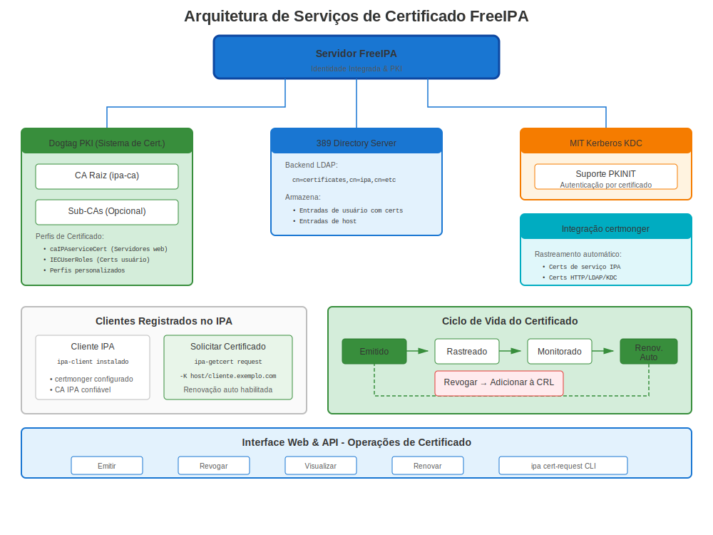
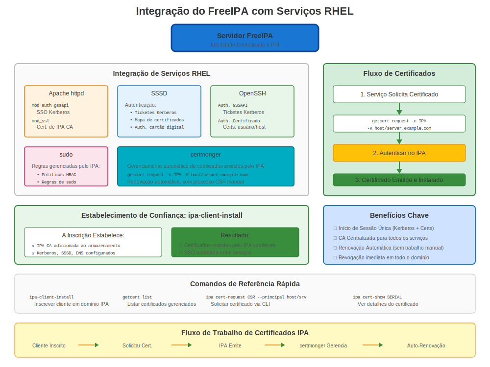

# Capítulo 19: Serviços de Certificados do FreeIPA

> **CA Empresarial:** FreeIPA é a solução integrada de gerenciamento de identidade e certificados da Red Hat. É a forma recomendada de executar uma CA interna no RHEL.

---

## 19.1 O Que é FreeIPA?



**FreeIPA** (Identity, Policy, Audit) é uma solução integrada de gerenciamento de informações de segurança que combina:
- 🔐 **Gerenciamento de Identidade** (diretório LDAP)
- 🎫 **Autenticação** (Kerberos)
- 🔏 **Autoridade Certificadora (CA)** (Dogtag PKI)
- 📋 **Gerenciamento de Política** (sudo, HBAC)
- 🔍 **DNS** (integração BIND)

### Por Que FreeIPA para Certificados?

**Em vez de:**
- ❌ Gerenciar manualmente certificados por servidor
- ❌ Custos CA externa
- ❌ Infraestrutura PKI complexa

**FreeIPA Fornece:**
- ✅ CA interna (gratuita!)
- ✅ Registro automático de certificados
- ✅ Auto-renovação via certmonger
- ✅ Perfis de certificados
- ✅ Interface Web e gerenciamento CLI
- ✅ Integração com serviços RHEL

---

## 19.2 Instalação FreeIPA (Servidor)

### Pré-requisitos

```bash
#============================================#
# PRÉ-REQUISITOS PARA SERVIDOR FREEIPA
#============================================#

# Requisitos:
# - RHEL 7/8/9/10
# - Mínimo 2 GB RAM (4 GB recomendado)
# - Hostname fully qualified
# - Resolução DNS apropriada
# - Endereço IP estático

# Verificar hostname
hostnamectl
# Deve mostrar FQDN: ipa.example.com

# Verificar DNS
nslookup $(hostname -f)

# Definir hostname se necessário
sudo hostnamectl set-hostname ipa.example.com
```

### Instalar Servidor FreeIPA

```bash
#============================================#
# INSTALAR SERVIDOR FREEIPA
#============================================#

# Instalar pacotes
sudo dnf install ipa-server ipa-server-dns -y

# Executar wizard instalação
sudo ipa-server-install \
  --realm EXAMPLE.COM \
  --domain example.com \
  --ds-password 'DirectoryPassword123!' \
  --admin-password 'AdminPassword123!' \
  --hostname ipa.example.com \
  --setup-dns \
  --forwarder 8.8.8.8 \
  --forwarder 8.8.4.4 \
  --unattended

# Instalação leva 5-15 minutos

# Abrir firewall
sudo firewall-cmd --add-service={http,https,dns,ntp,freeipa-ldap,freeipa-ldaps,freeipa-replication} --permanent
sudo firewall-cmd --reload

# Verificar
sudo ipactl status

# Deveria mostrar múltiplos serviços rodando:
# - Directory Service (389-ds)
# - Certificate Authority (pki-tomcatd)
# - Kerberos KDC
# - Apache Web Server
# - DNS (named)
```

### Acessar Interface Web FreeIPA

```bash
# Obter ticket Kerberos
kinit admin
# Senha: AdminPassword123!

# Acessar Interface Web
# https://ipa.example.com/
# Username: admin
# Senha: AdminPassword123!
```

---

## 19.3 Registrando Clientes

### Instalação Cliente

```bash
#============================================#
# REGISTRAR CLIENTE NO FREEIPA
#============================================#

# No sistema cliente (web01.example.com)

# Instalar cliente IPA
sudo dnf install ipa-client -y

# Registrar
sudo ipa-client-install \
  --domain example.com \
  --realm EXAMPLE.COM \
  --server ipa.example.com \
  --principal admin \
  --password 'AdminPassword123!' \
  --mkhomedir \
  --unattended

# Verificar registro
ipa ping
# Pong!

# Verificar rastreamento certificado
sudo getcert list
# Mostra certmonger rastreando certificado host
```

---

## 19.4 Solicitando Certificados do FreeIPA

### Método 1: Interface Web

1. Navegar para https://ipa.example.com/
2. Identity → Hosts → Selecionar host → Actions → New Certificate
3. Ou: Identity → Services → Add service → Request certificate

### Método 2: CLI (Recomendado)

```bash
#============================================#
# SOLICITAR CERTIFICADO DO FREEIPA
#============================================#

# Para serviço HTTP em web01
sudo ipa-getcert request \
  -f /etc/pki/tls/certs/web01.crt \
  -k /etc/pki/tls/private/web01.key \
  -K HTTP/web01.example.com@EXAMPLE.COM \
  -D web01.example.com \
  -C "systemctl reload httpd"

# Para serviço customizado
sudo ipa-getcert request \
  -f /etc/pki/tls/certs/myapp.crt \
  -k /etc/pki/tls/private/myapp.key \
  -K myapp/web01.example.com@EXAMPLE.COM \
  -D myapp.example.com

# Verificar status
sudo getcert list

# Aguardar status MONITORING (cert emitido)
```

### Método 3: ipa cert-request (Avançado)

```bash
#============================================#
# AVANÇADO: IPA CERT-REQUEST
#============================================#

# Gerar CSR
openssl req -new -key server.key -out server.csr \
  -subj "/CN=server.example.com"

# Solicitar certificado via IPA
ipa cert-request server.csr \
  --principal HTTP/server.example.com@EXAMPLE.COM

# Obter ID certificado da saída
# Certificate: MIIDXTCCAkWgAwIBAgI...
# Request ID: 12345

# Recuperar certificado
ipa cert-show 12345 --out server.crt
```

---

## 19.5 Perfis de Certificado

### Perfis Disponíveis

```bash
#============================================#
# PERFIS CERTIFICADO FREEIPA
#============================================#

# Listar perfis disponíveis
ipa certprofile-find

# Perfis comuns:
# - caIPAserviceCert: Certificados serviço (HTTP, LDAP, etc.)
# - IECUserRoles: Certificados usuário
# - smimeUserCert: Certificados email S/MIME
# - caSelfSignedCert: CA autoassinada

# Ver detalhes perfil
ipa certprofile-show caIPAserviceCert

# Criar perfil customizado
ipa certprofile-import MyCustomProfile \
  --file custom-profile.cfg \
  --store TRUE
```

### Usando Perfil Específico

```bash
# Solicitar com perfil específico
sudo ipa-getcert request \
  -f /etc/pki/tls/certs/custom.crt \
  -k /etc/pki/tls/private/custom.key \
  -K HTTP/web01.example.com@EXAMPLE.COM \
  -T caIPAserviceCert  # Especificar perfil
```

---

## 19.6 Renovação Automática

### Como Funciona

**FreeIPA + certmonger = Ciclo de Vida Certificado Automático!**

```bash
#============================================#
# RENOVAÇÃO AUTOMÁTICA COM FREEIPA
#============================================#

# certmonger automaticamente:
# 1. Rastreia expiração certificado
# 2. Submete requisição renovação para IPA
# 3. Obtém certificado renovado
# 4. Salva em arquivo
# 5. Executa comando post-save (ex: reload httpd)

# Verificar status renovação
sudo getcert list

# Exemplo saída:
# Request ID '20240101000000':
#   status: MONITORING
#   stuck: no
#   key pair storage: type=FILE,location='/etc/pki/tls/private/web.key'
#   certificate: type=FILE,location='/etc/pki/tls/certs/web.crt'
#   CA: IPA
#   issuer: CN=Certificate Authority,O=EXAMPLE.COM
#   subject: CN=web01.example.com,O=EXAMPLE.COM
#   expires: 2025-01-01 00:00:00 UTC
#   pre-save command:
#   post-save command: systemctl reload httpd
#   track: yes
#   auto-renew: yes

# Renovação acontece automaticamente ~28 dias antes expiração!
```

### Renovação Manual (Se Necessário)

```bash
# Forçar renovação agora
sudo ipa-getcert resubmit -f /etc/pki/tls/certs/web.crt

# Ou por ID requisição
sudo ipa-getcert resubmit -i 20240101000000

# Verificar se bem-sucedida
sudo getcert list -f /etc/pki/tls/certs/web.crt
```

---

## 19.7 FreeIPA como CA Empresarial

### Gerenciamento Certificado CA

```bash
#============================================#
# GERENCIAMENTO CA FREEIPA
#============================================#

# Ver certificado CA
ipa ca-show ipa

# Exportar certificado CA
ipa ca-show ipa --certificate --out /tmp/ipa-ca.crt

# Instalar em clientes (automático durante ipa-client-install)
# Manual: Copiar para repositório de confiança
sudo cp /tmp/ipa-ca.crt /etc/pki/ca-trust/source/anchors/
sudo update-ca-trust

# Renovar certificado CA (quando necessário)
sudo ipa-cacert-manage renew

# Verificar expiração CA
sudo getcert list -d /var/lib/ipa | grep "CA:"
```

### Sub-CAs (Avançado)

```bash
#============================================#
# SUB-CA FREEIPA (RHEL 8+)
#============================================#

# Criar sub-CA
ipa ca-add subca \
  --subject "CN=SubCA,O=EXAMPLE.COM" \
  --desc "Department Sub-CA"

# Emitir certificado da sub-CA
sudo ipa-getcert request \
  -f /etc/pki/tls/certs/dept.crt \
  -k /etc/pki/tls/private/dept.key \
  -X subca \
  -K HTTP/dept.example.com@EXAMPLE.COM
```

---

## 19.8 Exemplos Integração Serviço



### Apache com Certificados FreeIPA

```bash
#============================================#
# APACHE + FREEIPA SETUP COMPLETO
#============================================#

# 1. Registrar sistema no IPA (se ainda não)
sudo ipa-client-install

# 2. Solicitar certificado para Apache
sudo ipa-getcert request \
  -f /etc/pki/tls/certs/$(hostname -f).crt \
  -k /etc/pki/tls/private/$(hostname -f).key \
  -K HTTP/$(hostname -f)@EXAMPLE.COM \
  -D $(hostname -f) \
  -C "systemctl reload httpd"

# 3. Aguardar certificado
until sudo getcert list -f /etc/pki/tls/certs/$(hostname -f).crt | grep -q "MONITORING"; do
  sleep 5
  echo "Aguardando certificado..."
done

# 4. Configurar Apache para usá-lo
# /etc/httpd/conf.d/ssl.conf:
# SSLCertificateFile /etc/pki/tls/certs/$(hostname -f).crt
# SSLCertificateKeyFile /etc/pki/tls/private/$(hostname -f).key

# 5. Recarregar Apache
sudo systemctl reload httpd

# Certificado auto-renova!
```

### LDAP com Certificados FreeIPA

```bash
# Próprio serviço LDAP do FreeIPA automaticamente usa certificados IPA
# Nenhuma configuração manual necessária!

# Testar
ldapsearch -H ldaps://ipa.example.com:636 -x -b "dc=example,dc=com"
```

---

## 19.9 Solução de Problemas Certificados FreeIPA

### Problemas Comuns

**Problema 1: CA_UNREACHABLE**

```bash
# Sintoma
sudo getcert list
# status: CA_UNREACHABLE

# Diagnóstico
# 1. Verificar conectividade servidor IPA
ipa ping

# 2. Verificar ticket Kerberos
klist

# 3. Renovar ticket se expirado
kinit -k host/$(hostname -f)@EXAMPLE.COM

# 4. Verificar serviços IPA
ssh ipa.example.com "sudo ipactl status"

# 5. Retentar
sudo ipa-getcert resubmit -i <request-id>
```

**Problema 2: Requisição Certificado Negada**

```bash
# Verificar status requisição
sudo getcert list -v

# Causas comuns:
# 1. Principal serviço não existe
ipa service-find HTTP/$(hostname -f)

# Se não encontrado, adicionar:
ipa service-add HTTP/$(hostname -f)

# 2. Host não registrado
ipa host-show $(hostname -f)

# 3. Permissões insuficientes
# Deve solicitar como principal host registrado
```

**Problema 3: Certificado Não Renovado**

```bash
# Verificar logs certmonger
sudo journalctl -u certmonger | tail -50

# Verificar status CA IPA
sudo ipactl status | grep "CA"

# Forçar renovação
sudo ipa-getcert resubmit -f /etc/pki/tls/certs/web.crt

# Verificar expiração certificado CA
sudo openssl x509 -in /etc/ipa/ca.crt -noout -dates
```

---

## 19.10 Recursos Avançados

### Suporte ACME (RHEL 9+)

**FreeIPA pode atuar como servidor ACME!**

```bash
#============================================#
# HABILITAR ACME NO FREEIPA (RHEL 9+)
#============================================#

# No servidor IPA (RHEL 9+)
sudo ipa-acme-manage enable

# Verificar que ACME está disponível
curl https://ipa.example.com/acme/directory

# No cliente: Usar certbot ou certmonger com ACME
sudo certbot register --server https://ipa.example.com/acme/directory
sudo certbot certonly --server https://ipa.example.com/acme/directory \
  -d web01.example.com
```

### Hold/Revogação Certificado

```bash
#============================================#
# REVOGAR CERTIFICADOS
#============================================#

# Colocar certificado em hold (temporário)
ipa cert-revoke 12345 --revocation-reason 6

# Revogar permanentemente
ipa cert-revoke 12345 --revocation-reason 1

# Razões:
# 0: não especificado
# 1: keyCompromise
# 2: cACompromise
# 4: superseded
# 6: certificateHold (pode ser removido)

# Remover de hold
ipa cert-remove-hold 12345

# Verificar status revogação
ipa cert-show 12345
```

---

## 19.11 Monitorando PKI FreeIPA

### Verificações Saúde

```bash
#============================================#
# MONITORAMENTO SAÚDE PKI FREEIPA
#============================================#

# Verificar status geral IPA
sudo ipactl status

# Verificar subsistema CA
sudo systemctl status pki-tomcatd@pki-tomcat

# Verificar expirações certificado
ipa-healthcheck --source ipahealthcheck.ipa.certs

# Verificar rastreamento certificado
sudo getcert list | grep -E "(Request|status|expires)"

# Monitorar certificado CA
openssl x509 -in /etc/ipa/ca.crt -noout -dates

# Verificar por certificados expirando
ipa cert-find --validnotafter-from=$(date -d '+60 days' +%Y-%m-%d)
```

---

## 19.12 Backup e Recuperação

### Backup Servidor IPA

```bash
#============================================#
# BACKUP FREEIPA (INCLUINDO CA)
#============================================#

# Backup completo
sudo ipa-backup --data --online

# Localização backup
ls -lh /var/lib/ipa/backup/

# Incluir chaves CA (apenas backup offline!)
sudo ipactl stop
sudo ipa-backup --data --gpg
# Entrar passphrase GPG
sudo ipactl start
```

### Restaurar Servidor IPA

```bash
# Restaurar do backup
sudo ipactl stop
sudo ipa-restore /var/lib/ipa/backup/ipa-full-YYYY-MM-DD-HH-MM-SS/
sudo ipactl start
```

---

## 19.13 Melhores Práticas

### Melhores Práticas Certificado FreeIPA

```markdown
✅ Usar FreeIPA para todos certificados internos
✅ Deixar certmonger lidar com renovação (não renovar manualmente)
✅ Usar principals serviço (HTTP/host, ldap/host, etc.)
✅ Adicionar SANs ao solicitar certificados
✅ Definir comandos post-save (flag -C) para reload serviço
✅ Monitorar saúde servidor IPA regularmente
✅ Backup servidor IPA semanalmente (incluindo chaves CA)
✅ Ter pelo menos 2 réplicas IPA (HA)
✅ Monitorar expiração certificado CA
✅ Testar renovação certificado antes expiração
✅ Usar perfis certificado para padronização
```

---

## 19.14 Exemplos Integração

### Configuração Serviço Completo com FreeIPA

```bash
#!/bin/bash
# setup-service-with-ipa.sh
# Workflow completo para certificado serviço do FreeIPA

SERVICE_NAME="HTTP"  # Ou LDAP, postgresql, etc.
HOST=$(hostname -f)
PRINCIPAL="${SERVICE_NAME}/${HOST}@EXAMPLE.COM"
CERT_FILE="/etc/pki/tls/certs/${HOST}.crt"
KEY_FILE="/etc/pki/tls/private/${HOST}.key"
POST_COMMAND="systemctl reload httpd"

echo "=== Solicitando Certificado do FreeIPA ==="

# 1. Garantir que principal serviço existe
if ! ipa service-show "${SERVICE_NAME}/${HOST}" &>/dev/null; then
  echo "Criando principal serviço..."
  ipa service-add "${SERVICE_NAME}/${HOST}"
fi

# 2. Solicitar certificado
sudo ipa-getcert request \
  -f "$CERT_FILE" \
  -k "$KEY_FILE" \
  -K "$PRINCIPAL" \
  -D "$HOST" \
  -C "$POST_COMMAND"

# 3. Aguardar certificado
echo "Aguardando emissão certificado..."
until sudo getcert list -f "$CERT_FILE" | grep -q "MONITORING"; do
  sleep 5
done

# 4. Verificar
echo "✅ Certificado emitido!"
sudo openssl x509 -in "$CERT_FILE" -noout -subject -issuer -dates

# 5. Certificado vai auto-renovar!
echo "✅ Rastreamento certificado habilitado - auto-renovação ativa"
```

---

## 19.15 Conclusões Chave

1. **FreeIPA é a CA interna recomendada pela Red Hat**
2. **Combina identidade + certificados + autenticação**
3. **Integração certmonger é automática**
4. **Certificados auto-renovam** (sem trabalho manual!)
5. **Usar principals serviço** (HTTP/host, ldap/host)
6. **Suporte ACME** no RHEL 9+ (pode substituir Let's Encrypt para interno)
7. **Interface Web e CLI** ambas disponíveis
8. **Escala para empresarial** - Suporta réplicas, sub-CAs

---

## Cartão de Referência Rápida

```
┌──────────────────────────────────────────────────────────────┐
│ REFERÊNCIA RÁPIDA SERVIÇOS CERTIFICADO FREEIPA               │
├──────────────────────────────────────────────────────────────┤
│ Instalar:       dnf install ipa-server                       │
│ Setup:          ipa-server-install                           │
│ Status:         ipactl status                                │
│ Interface Web:  https://ipa.example.com/                     │
│                                                              │
│ Registrar:      ipa-client-install                           │
│ Solicitar:      ipa-getcert request -K service/host@REALM    │
│ Listar:         getcert list                                 │
│ Reenviar:       ipa-getcert resubmit -f /path/to/cert.crt    │
│                                                              │
│ Principal:      HTTP/host.example.com@REALM                  │
│                 ldap/host.example.com@REALM                  │
│                 postgresql/host.example.com@REALM            │
│                                                              │
│ Auto-renov:     Automática via certmonger                    │
│ ACME:           ipa-acme-manage enable (RHEL 9+)             │
└──────────────────────────────────────────────────────────────┘

✅ Melhor para gerenciamento certificado empresarial interno
✅ Totalmente integrado com RHEL
✅ Sem renovação manual necessária!
```
---

**Navegação do Capítulo**

| [← Anterior: Capítulo 18 - TLS em Bancos de Dados (PostgreSQL, MySQL)](18-database-tls.md) | [Próximo: Capítulo 20 - Outros Serviços RHEL com Certificados →](20-other-rhel-services.md) |
|:---|---:|
