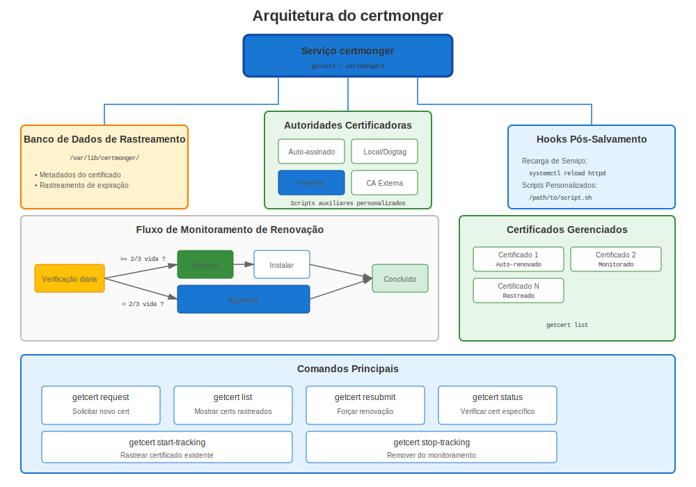
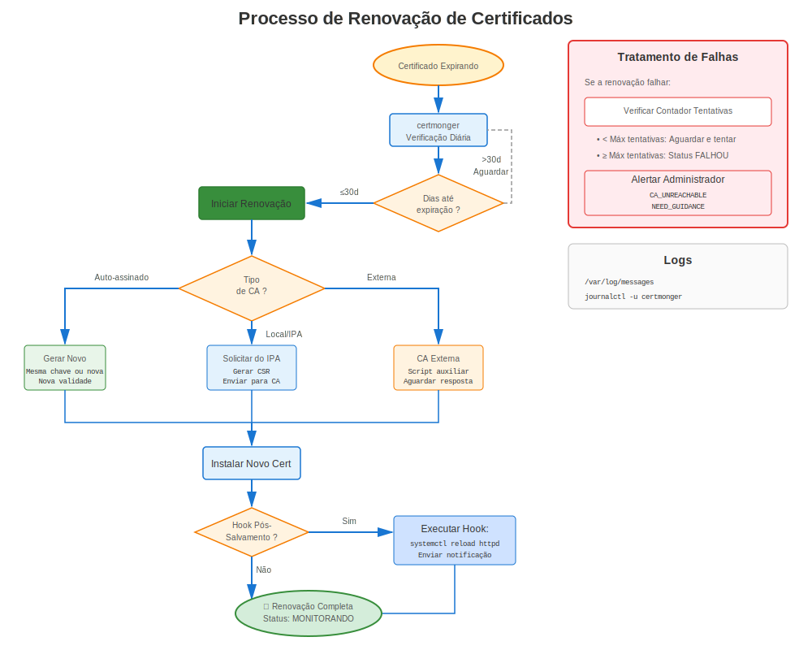
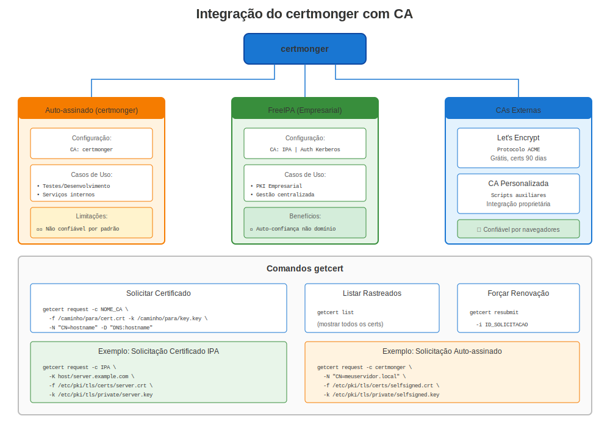

# Capítulo 22: Domínio do certmonger

> **Configure e Esqueça:** certmonger é a ferramenta de automatização de certificados integrada do RHEL. Domine-a e você nunca renovará um certificado manualmente novamente.

---

## 22.1 O Que é certmonger?



**certmonger** é um daemon de rastreamento de certificados e renovação automática para RHEL.

**Pense nisso como:**
- 📋 **Rastreador de certificados** - Monitora datas de expiração
- 🔄 **Renovador automático** - Renova antes de expirar
- 🔗 **Integrador de CA** - Funciona com FreeIPA, CAs locais/internas e helpers de CA externa
- ⚙️ **Integração de serviços** - Executa comandos após renovação

### Por Que certmonger?

**Sem certmonger:**
```
❌ Rastreamento manual de datas de expiração
❌ Lembretes de calendário para renovar
❌ Geração manual de CSR
❌ Reinício manual de serviço após renovação
❌ Risco de perder renovações → interrupções
```

**Com certmonger:**
```
✅ Rastreamento automático
✅ Renovação automática
✅ Recarga automática de serviço
✅ Monitoramento centralizado
✅ Sem intervenção manual!
```

---

## 22.2 Instalação e Configuração



### Todas Versões RHEL

```bash
#============================================#
# INSTALAR CERTMONGER
#============================================#

# Instalar
sudo dnf install certmonger -y

# Habilitar e iniciar
sudo systemctl enable certmonger
sudo systemctl start certmonger

# Verificar
systemctl status certmonger
sudo getcert list  # Deveria mostrar lista vazia inicialmente
```

---

## 22.3 Uso Básico



### Solicitando um Certificado

```bash
#============================================#
# REQUISIÇÃO CERTIFICADO BÁSICA
#============================================#

# Autoassinado (para teste)
sudo getcert request \
  -f /etc/pki/tls/certs/test.crt \
  -k /etc/pki/tls/private/test.key

# Do FreeIPA
sudo ipa-getcert request \
  -f /etc/pki/tls/certs/web.crt \
  -k /etc/pki/tls/private/web.key \
  -K HTTP/$(hostname -f)@REALM \
  -D $(hostname -f)

# Para certificados públicos do Let's Encrypt, use certbot (Capítulo 24).
# certmonger é a escolha nativa para IPA, CA local e fluxos baseados em helpers.
```

### Verificando Status

```bash
#============================================#
# VERIFICAR STATUS CERTIFICADO
#============================================#

# Listar todos certificados rastreados
sudo getcert list

# Verificar certificado específico por arquivo
sudo getcert list -f /etc/pki/tls/certs/web.crt

# Verificar por ID requisição
sudo getcert list -i 20240101000000

# Saída verbose
sudo getcert list -v
```

**Valores Status:**
- `MONITORING`: ✅ Certificado emitido, rastreando expiração
- `SUBMITTING`: 🔄 Submetendo requisição para CA
- `CA_UNREACHABLE`: ❌ Não consegue alcançar servidor CA
- `CA_REJECTED`: ❌ CA rejeitou requisição
- `NEED_KEY_GEN_PIN`: ⏸️ Aguardando PIN (HSM/token)
- `PRE_SAVE_COMMAND`: 🔄 Executando script pre-save
- `POST_SAVE_COMMAND`: 🔄 Executando script post-save

---

## 22.4 Opções Avançadas

### Requisição Completa com Todas Opções

```bash
#============================================#
# REQUISIÇÃO CERTMONGER COMPLETA
#============================================#

sudo ipa-getcert request \
  -f /etc/pki/tls/certs/web.example.com.crt \              # Arquivo certificado
  -k /etc/pki/tls/private/web.example.com.key \            # Arquivo chave privada
  -K HTTP/web.example.com@EXAMPLE.COM \                    # Principal Kerberos
  -D web.example.com \                                     # Nome DNS (SAN)
  -D www.example.com \                                     # SAN adicional
  -D api.example.com \                                     # Outro SAN
  -U id-kp-serverAuth \                                    # Extended key usage
  -N CN=web.example.com,O=Example,C=US \                   # Subject DN
  -g 2048 \                                                # Tamanho chave
  -G rsa \                                                 # Tipo chave
  -T caIPAserviceCert \                                    # Perfil IPA
  -C "systemctl reload httpd" \                            # Comando post-save
  -B "systemctl stop httpd" \                              # Comando pre-save
  -v \                                                     # Verbose
  -w                                                       # Aguardar conclusão

# Verificar status
sudo getcert list -f /etc/pki/tls/certs/web.example.com.crt
```

**Opções Chave Explicadas:**

| Opção | Propósito | Exemplo |
|-------|-----------|---------|
| `-f` | Caminho arquivo certificado | `/etc/pki/tls/certs/web.crt` |
| `-k` | Caminho arquivo chave privada | `/etc/pki/tls/private/web.key` |
| `-K` | Principal Kerberos | `HTTP/web.example.com@REALM` |
| `-D` | DNS SAN | `web.example.com` |
| `-N` | Subject DN | `CN=web,O=Example` |
| `-C` | Comando post-save | `systemctl reload httpd` |
| `-B` | Comando pre-save | `systemctl stop httpd` |
| `-c` | Nome CA | `IPA` ou `external-ca` |
| `-T` | Perfil certificado | `caIPAserviceCert` |
| `-g` | Tamanho chave | `2048` ou `4096` |
| `-G` | Tipo chave | `rsa` ou `ec` |

---

## 22.5 Trabalhando com CAs Diferentes

### FreeIPA (Recomendado para Interno)

```bash
#============================================#
# CERTMONGER + FREEIPA
#============================================#

# Pré-requisitos: Sistema registrado no IPA
ipa-client-install

# Solicitar certificado
sudo ipa-getcert request \
  -f /etc/pki/tls/certs/internal.crt \
  -k /etc/pki/tls/private/internal.key \
  -K HTTP/$(hostname -f)@REALM \
  -D $(hostname -f) \
  -C "systemctl reload httpd"

# certmonger automaticamente:
# ✅ Submete requisição para CA IPA
# ✅ Obtém certificado
# ✅ Salva em arquivo
# ✅ Executa comando reload
# ✅ Rastreia expiração
# ✅ Renova ~28 dias antes expiração
```

### ACME público requer certbot

```bash
#============================================#
# ACME PÚBLICO VS FLUXOS NATIVOS DO CERTMONGER
#============================================#

# Certificado público do Let's Encrypt:
# Use certbot, não um perfil de CA falso no certmonger.
sudo certbot certonly --apache -d public.example.com

# Certificado nativo do FreeIPA / IdM:
sudo ipa-getcert request \
  -f /etc/pki/tls/certs/internal.crt \
  -k /etc/pki/tls/private/internal.key \
  -K HTTP/$(hostname -f)@REALM \
  -D $(hostname -f) \
  -C "systemctl reload httpd"
```

### CA Externa (Submissão Manual)

```bash
#============================================#
# CERTMONGER COM CA EXTERNA
#============================================#

# Configurar helper CA externa
sudo getcert add-ca -c external-ca \
  -e '/usr/local/bin/external-ca-submit.sh'

# Solicitar certificado
sudo getcert request \
  -c external-ca \
  -f /etc/pki/tls/certs/external.crt \
  -k /etc/pki/tls/private/external.key

# Script helper deve:
# 1. Ler CSR de stdin
# 2. Submeter para CA externa
# 3. Retornar certificado em stdout
```

---

## 22.6 Gerenciando Certificados Rastreados

### Modificar Rastreamento

```bash
#============================================#
# MODIFICAR RASTREAMENTO CERTIFICADO EXISTENTE
#============================================#

# Atualizar comando post-save sem rekey
sudo getcert stop-tracking -f /etc/pki/tls/certs/web.crt
sudo getcert start-tracking \
  -f /etc/pki/tls/certs/web.crt \
  -k /etc/pki/tls/private/web.key \
  -C "systemctl reload httpd"
# Re-adicione -c, -K, -D, etc. se a entrada original os usava

# Adicionar SAN adicional
sudo getcert resubmit -f /etc/pki/tls/certs/web.crt \
  -D additional.example.com

# Parar rastreamento (manter certificado)
sudo getcert stop-tracking -f /etc/pki/tls/certs/web.crt

# Remover completamente
sudo getcert stop-tracking -f /etc/pki/tls/certs/web.crt -r

# Iniciar rastreamento certificado existente
sudo getcert start-tracking \
  -f /etc/pki/tls/certs/existing.crt \
  -k /etc/pki/tls/private/existing.key
```

### Forçar Renovação

```bash
#============================================#
# FORÇAR RENOVAÇÃO IMEDIATA
#============================================#

# Por caminho arquivo
sudo ipa-getcert resubmit -f /etc/pki/tls/certs/web.crt

# Por ID requisição
sudo getcert resubmit -i 20240101000000

# Aguardar renovação
sudo getcert list -f /etc/pki/tls/certs/web.crt
# Aguardar status: MONITORING
```

---

## 22.7 Timing Renovação

### Entendendo Janelas Renovação

```
Ciclo de Vida Certificado (365 dias):

Dia   0: Certificado emitido
      │
      │ [Operação normal]
      │
Dia 243: Janela renovação inicia (certmonger tenta renovação)
      │ (2/3 do tempo vida cert: 365 × 2/3 ≈ 243 dias)
      │
      │ [Tentativas renovação a cada 8 horas se CA disponível]
      │
Dia 335: Aviso se ainda não renovado (30 dias restantes)
      │
Dia 350: Crítico se ainda não renovado (15 dias restantes)
      │
Dia 365: Certificado expira → INTERRUPÇÃO SERVIÇO se não renovado!
```

**Comportamento Padrão:**
- Renovação inicia em 2/3 do tempo vida certificado
- cert 365 dias → Renova no dia 243 (122 dias restantes)
- cert 90 dias → Renova no dia 60 (30 dias restantes)

---

## 22.8 Comandos Post-Save

### Reload vs Restart

```bash
#============================================#
# ESTRATÉGIAS COMANDO POST-SAVE
#============================================#

# PREFERIR: reload (sem downtime)
-C "systemctl reload httpd"
-C "systemctl reload nginx"
-C "postfix reload"

# ÀS VEZES NECESSÁRIO: restart
-C "systemctl restart slapd"  # OpenLDAP requer restart
-C "systemctl restart postgresql"  # PostgreSQL requer restart

# MÚLTIPLOS COMANDOS: Usar script
-C "/usr/local/bin/after-cert-renewal.sh"

# Exemplo script:
#!/bin/bash
# /usr/local/bin/after-cert-renewal.sh
systemctl reload httpd
systemctl reload nginx
systemctl reload postfix
logger "Certificados renovados via certmonger"
```

---

## 22.9 Solução de Problemas certmonger

### Problemas Comuns

**Problema 1: CA_UNREACHABLE**

```bash
# Sintoma
sudo getcert list
# status: CA_UNREACHABLE

# Diagnóstico
# Para FreeIPA:
ipa ping  # Verificar conectividade IPA
klist  # Verificar ticket Kerberos

# Corrigir
kinit -k host/$(hostname -f)@REALM  # Renovar ticket host
sudo ipa-getcert resubmit -f /etc/pki/tls/certs/web.crt

# Verificar servidor IPA
ssh ipa-server "sudo ipactl status"
```

**Problema 2: CA_REJECTED**

```bash
# Sintoma
sudo getcert list
# status: CA_REJECTED
# ca-error: Server at https://ipa.example.com/ipa/xml unwilling to issue certificate

# Causas comuns:
# 1. Principal serviço não existe
ipa service-show HTTP/$(hostname -f)
# Se não encontrado:
ipa service-add HTTP/$(hostname -f)

# 2. Host não registrado
ipa host-show $(hostname -f)

# 3. Problema permissão
# Verificar permissões IPA

# Retentar
sudo ipa-getcert resubmit -f /etc/pki/tls/certs/web.crt
```

**Problema 3: Renovação Não Acontecendo**

```bash
# Verificar certmonger está rodando
systemctl status certmonger

# Verificar status certificado
sudo getcert list -f /etc/pki/tls/certs/web.crt

# Verificar logs certmonger
sudo journalctl -u certmonger -f

# Forçar renovação
sudo ipa-getcert resubmit -f /etc/pki/tls/certs/web.crt

# Verificar janela renovação
# Certificado renova em 2/3 do tempo vida
# Verificar data "expires" na saída getcert list
```

---

## 22.10 IdM ACME vs Let's Encrypt público

### Mantenha os fluxos separados

```bash
#============================================#
# ESCOLHA A FERRAMENTA CERTA PARA A CA CERTA
#============================================#

# Certificado público do Let's Encrypt:
# Use certbot (veja o Capítulo 24).
sudo certbot certonly --apache -d public.example.com -d www.public.example.com

# Certificado nativo do FreeIPA / IdM:
# Use certmonger + ipa-getcert.
sudo ipa-getcert request \
  -f /etc/pki/tls/certs/internal.example.com.crt \
  -k /etc/pki/tls/private/internal.example.com.key \
  -K HTTP/internal.example.com@REALM \
  -D internal.example.com \
  -C "systemctl reload httpd"

# Se o IdM ACME estiver habilitado, o diretório ACME dele é o seu servidor IPA,
# não o Let's Encrypt:
sudo certbot certonly \
  --server https://ipa.example.com/acme/directory \
  -d host.example.com
```

**Distinção importante:**
- **Let's Encrypt** = CA ACME pública da internet
- **IdM/FreeIPA ACME** = sua CA IPA interna expondo um endpoint ACME
- **certmonger** = rastreador/renovador nativo do RHEL para IPA e fluxos baseados em helpers

---

## 22.11 Monitorando certmonger

### Monitoramento Status

```bash
#============================================#
# MONITORAR CERTMONGER
#============================================#

# Visão geral de todos certificados
sudo getcert list

# Contar certificados por status
sudo getcert list | grep "status:" | sort | uniq -c

# Encontrar certificados expirando em breve (30 dias)
for cert in $(sudo getcert list | grep "certificate:" | sed -n "s/.*location='\\([^']*\\)'.*/\\1/p"); do
  if ! openssl x509 -in "$cert" -noout -checkend $((86400*30)) 2>/dev/null; then
    echo "⚠️ Expira em breve: $cert"
  fi
done

# Verificar logs certmonger
sudo journalctl -u certmonger --since today

# Observar por atividade renovação
sudo journalctl -u certmonger -f

# Verificar próximo tempo renovação
sudo getcert list | grep -A15 "Request ID" | grep "expires"
```

### Script Verificação Saúde

```bash
#!/bin/bash
# certmonger-health-check.sh

echo "=== Verificação Saúde certmonger ==="

# certmonger rodando?
if systemctl is-active --quiet certmonger; then
  echo "✅ certmonger está rodando"
else
  echo "❌ certmonger NÃO está rodando!"
  exit 1
fi

# Contar certificados rastreados
TOTAL=$(sudo getcert list | grep -c "Request ID")
echo "📋 Rastreando $TOTAL certificados"

# Verificar breakdown status
echo ""
echo "Breakdown status:"
sudo getcert list | grep "status:" | sort | uniq -c

# Verificar por problemas
PROBLEMS=$(sudo getcert list | grep "status:" | grep -v "MONITORING" | wc -l)
if [ $PROBLEMS -gt 0 ]; then
  echo ""
  echo "⚠️ $PROBLEMS certificados necessitam atenção:"
  sudo getcert list | grep -B5 "status:" | grep -E "(Request ID|status:)" | grep -v "MONITORING"
fi

# Verificar avisos expiração
echo ""
echo "Certificados expirando em 30 dias:"
sudo getcert list | grep -A10 "Request ID" | grep "expires:" | \
  while read line; do
    # Analisar e verificar expiração
    # (simplificado - script produção analisaria datas apropriadamente)
    echo "$line"
  done
```

---

## 22.12 Configuração certmonger

### Arquivo Configuração Principal

```bash
#============================================#
# CONFIGURAÇÃO CERTMONGER
#============================================#

# Localização config
/etc/certmonger/certmonger.conf

# Localização banco dados (certificados rastreados)
/var/lib/certmonger/

# Listar CAs configuradas
sudo getcert list-cas

# Adicionar CA customizada
sudo getcert add-ca -c my-ca \
  -e '/usr/local/bin/my-ca-submit.sh'

# Remover CA
sudo getcert remove-ca -c my-ca
```

---

## 22.13 Melhores Práticas

### Melhores Práticas certmonger

```markdown
✅ **Sempre usar comandos post-save** (flag -C) para recarregar serviços
✅ **Rastrear todos certificados produção** com certmonger
✅ **Monitorar status semanalmente** com `getcert list`
✅ **Testar renovação** antes expiração com `resubmit`
✅ **Usar modo verbose** (-v) ao fazer solução de problemas
✅ **Configurar monitoramento** para status CA_UNREACHABLE
✅ **Documentar IDs requisição** em seu inventário certificados
✅ **Usar IPA/certmonger para certificados internos** e certbot para Let's Encrypt público
✅ **Manter logs certmonger** para trilha auditoria
✅ **Testar comandos post-save** independentemente antes uso
```

### O Que Rastrear com certmonger

```bash
# ✅ RASTREAR com certmonger:
- Certificados servidor web (Apache, NGINX)
- Certificados servidor email (Postfix, Dovecot)
- Certificados servidor LDAP (OpenLDAP)
- Certificados aplicação (APIs, microserviços)
- Certificados serviço (qualquer serviço TLS-habilitado)

# ❌ NÃO rastrear com certmonger:
- Certificados raiz CA (gerenciados separadamente)
- Certificados cliente para usuários (ciclo vida diferente)
- Certificados teste/temporários
- Certificados que você gerencia com outras ferramentas (certbot)
```

---

## 22.14 certmonger vs certbot

### Quando Usar Qual?

| Recurso | certmonger | certbot |
|---------|------------|---------|
| **RHEL Nativo** | ✅ Sim (incluído) | ❌ Não (EPEL requerido) |
| **Suporte FreeIPA** | ✅ Nativo | ❌ Não |
| **Let's Encrypt ACME público** | ❌ Use certbot em vez disso | ✅ Sim (todas as versões) |
| **CA Interna** | ✅ Excelente | ❌ Não |
| **Config Apache/NGINX** | ⏸️ Manual | ✅ Automática |
| **Integração Serviço** | ✅ Comandos post-save | ⏸️ Limitada |
| **Timing Renovação** | 2/3 do tempo vida | 30 dias antes |
| **Suporte Red Hat** | ✅ Sim | ❌ Não (EPEL) |

**Recomendação:**
- **Interno/Empresarial:** Usar certmonger + FreeIPA
- **Público/Simples:** Usar certbot (mas saber que requer EPEL)
- **Certificados públicos em qualquer versão do RHEL:** use certbot para Let's Encrypt

---

## 22.15 Cenários Avançados

### Cenário 1: Renovação Certificado Alta Disponibilidade

```bash
# Múltiplos servidores com mesmo serviço

# Servidor 1:
sudo ipa-getcert request \
  -f /etc/pki/tls/certs/shared-service.crt \
  -k /etc/pki/tls/private/shared-service.key \
  -K HTTP/service.example.com@REALM \
  -D service.example.com \
  -C "systemctl reload httpd"

# Servidor 2: Mesma configuração
# Resultado: Cada servidor gerencia seu próprio cert independentemente
# Ou: Usar cert compartilhado (copiar arquivos, não recomendado)
```

### Cenário 2: Certificado Wildcard

```bash
# Solicitar wildcard do FreeIPA
sudo ipa-getcert request \
  -f /etc/pki/tls/certs/wildcard.crt \
  -k /etc/pki/tls/private/wildcard.key \
  -K HTTP/*.example.com@REALM \
  -D *.example.com \
  -D example.com \
  -C "/usr/local/bin/reload-all-services.sh"
```

### Cenário 3: Chaves EC (Elliptic Curve)

```bash
# Solicitar com chave EC
sudo ipa-getcert request \
  -f /etc/pki/tls/certs/ec-cert.crt \
  -k /etc/pki/tls/private/ec-cert.key \
  -K HTTP/$(hostname -f)@REALM \
  -G ec \
  -g nistp256  # ou nistp384, nistp521
```

---

## 22.16 Conclusões Chave

1. **certmonger é a automatização de certificados do RHEL**
2. **Configure e esqueça** - Renovação automática
3. **Funciona melhor com FreeIPA, CAs internas e renovações baseadas em helpers**
4. **Comandos pós-salvamento** recarregam serviços automaticamente
5. **Rastreia expiração** e renova a 2/3 do tempo de vida
6. **Status MONITORING** significa que tudo está bem
7. **getcert list** é sua principal ferramenta de monitoramento

---

## Cartão de Referência Rápida

```
┌──────────────────────────────────────────────────────────────────┐
│ REFERÊNCIA RÁPIDA DO CERTMONGER                                  │
├──────────────────────────────────────────────────────────────────┤
│ Instalar:        dnf install certmonger                          │
│ Iniciar:         systemctl enable --now certmonger               │
│                                                                  │
│ Solicitar:       getcert request -f cert -k key -c <CA>          │
│ Solicitar (IPA): ipa-getcert request -f cert -k key -K principal │
│ Listar:          getcert list                                    │
│ Status:          getcert list -f /path/to/cert.crt               │
│ Reenviar:        getcert resubmit -f /path/to/cert.crt           │
│ Parar rastreio:  getcert stop-tracking -f /path/to/cert.crt      │
│                                                                  │
│ Status:          MONITORING = ✅ Bom                             │
│                  CA_UNREACHABLE = ❌ Verificar IPA/CA            │
│                  CA_REJECTED = ❌ Verificar principal/permissões │
│                                                                  │
│ Logs:            journalctl -u certmonger -f                     │
│ Renovação:       Automática a 2/3 do tempo de vida do cert       │
│ Pós-save:        -C "systemctl reload <serviço>"                 │
└──────────────────────────────────────────────────────────────────┘

✅ Ferramenta nativa RHEL (suportada Red Hat)
✅ Perfeita para integração FreeIPA
✅ Melhor encaixe para FreeIPA e fluxos de renovação com rastreamento
```

---

## 🧪 Laboratório Prático

**Lab 11: Fundamentos do certmonger**

Automatize renovação de certificados com certmonger

- 📁 **Localização:** `labs/pt_BR/11-certmonger-basics/`
- ⏱️ **Tempo:** 30-35 minutos
- 🎯 **Nível:** Intermediário

---

**Navegação do Capítulo**

| [← Anterior: Capítulo 21 - Melhores Práticas de Certificados de Serviço](../part-03-services/21-service-best-practices.md) | [Próximo: Capítulo 23 - Mergulho Profundo em Crypto-Policies →](23-crypto-policies-deep-dive.md) |
|:---|---:|
