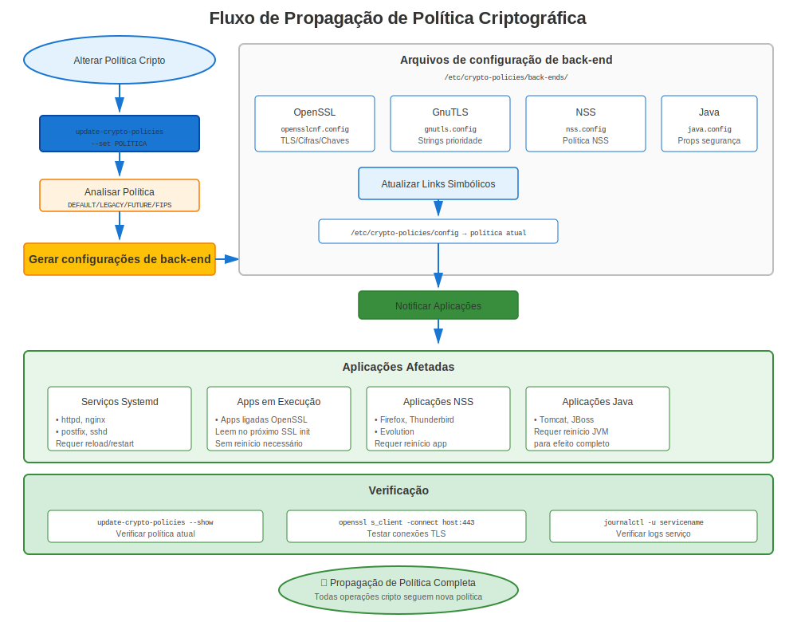

# Capítulo 23: Mergulho Profundo em Crypto-Policies

> **Recurso Revolucionário:** Crypto-policies RHEL 8+ fornecem configuração criptográfica system-wide. Domine isto e você controlará segurança em todas aplicações com um comando.

---

## 23.1 O Problema que crypto-policies Resolvem

### Antes das Crypto-Policies (RHEL 7)

```
Configurar segurança individualmente para CADA aplicação:

Apache:      /etc/httpd/conf.d/ssl.conf
             SSLProtocol, SSLCipherSuite

NGINX:       /etc/nginx/nginx.conf
             ssl_protocols, ssl_ciphers

Postfix:     /etc/postfix/main.cf
             smtpd_tls_protocols, smtpd_tls_mandatory_ciphers

OpenLDAP:    olcTLSProtocolMin, olcTLSCipherSuite

PostgreSQL:  ssl_min_protocol_version

OpenSSH:     /etc/ssh/sshd_config
             Ciphers, MACs, KexAlgorithms

... e mais de 20 aplicações!

Resultado: Segurança inconsistente, pesadelo de configuração
```

### Após Crypto-Policies (RHEL 8/9/10)

```
✅ Definir UMA política system-wide
✅ Todas aplicações automaticamente cumprem
✅ Segurança consistente em todo sistema
✅ Mudar política em segundos, não horas
```

**Mudança radical para gerenciamento empresarial!**

---

## 23.2 Como Crypto-Policies Funcionam



### Arquitetura

```
┌──────────────────────────────────────────────────┐
│       update-crypto-policies --set DEFAULT       │
│              (Comando administrador)             │
└───────────────────────┬──────────────────────────┘
                        │
                        ▼
┌──────────────────────────────────────────────────┐
│  /etc/crypto-policies/back-ends/                 │
│  (Arquivos config gerados para cada biblioteca)  │
│  ├─ opensslcnf.config                            │
│  ├─ gnutls.config                                │
│  ├─ nss.config                                   │
│  ├─ bind.config                                  │
│  └─ ... mais ...                                 │
└───────────────────────┬──────────────────────────┘
                        │
            ┌───────────┼───────────┐
            ▼           ▼           ▼
         OpenSSL     GnuTLS        NSS
            ↓           ↓           ↓
         Apache      NGINX       Firefox
         Postfix     vsftpd      Thunderbird
         OpenSSH     wget        Java apps
```

**Insight Chave:** Aplicações leem de arquivos back-end, não diretamente da política!

---

## 23.3 As Quatro Políticas Principais

### Comparação Políticas

| Política | Versões TLS | RSA Mín | SHA-1 | 3DES | DH Mín | Caso de Uso |
|----------|-------------|---------|-------|------|--------|-------------|
| **DEFAULT** | 1.2, 1.3 | 2048 | ❌ | ❌ | 2048 | ✅ Recomendado |
| **LEGACY** | 1.0+ | 1024 | ⚠️ | ⚠️ | 1024 | Apenas compatibilidade |
| **FUTURE** | 1.2, 1.3 | 3072 | ❌ | ❌ | 3072 | Alta segurança |
| **FIPS** | 1.2, 1.3 | 2048 | ❌ | ❌ | 2048 | Conformidade federal |

### Detalhes Política DEFAULT

```yaml
# Segurança e compatibilidade balanceadas
Protocolos:
  - TLS 1.2
  - TLS 1.3

Tamanhos Chave Mínimos:
  - RSA: 2048 bits
  - DH: 2048 bits
  - ECC: secp256r1 (P-256)

Cifras Permitidas:
  - AES-128-GCM
  - AES-256-GCM
  - ChaCha20-Poly1305
  - AES-128-CBC
  - AES-256-CBC

Algoritmos Assinatura:
  - SHA-256
  - SHA-384
  - SHA-512

Bloqueados:
  - TLS 1.0, 1.1
  - MD5
  - Assinaturas SHA-1
  - 3DES, RC4, DES
  - RSA < 2048 bits
  - Cifras export
```

---

## 23.4 Visualizando e Mudando Políticas

### Comandos Básicos

```bash
#============================================#
# OPERAÇÕES BÁSICAS CRYPTO-POLICY
#============================================#

# Ver política atual
update-crypto-policies --show
# Saída: DEFAULT

# Listar políticas disponíveis
ls /usr/share/crypto-policies/policies/
# DEFAULT.pol  FUTURE.pol  LEGACY.pol  FIPS.pol

# Definir política
sudo update-crypto-policies --set FUTURE

# Você DEVE reiniciar serviços para mudanças surtirem efeito!
sudo systemctl restart httpd nginx postfix slapd

# Ou reiniciar (garante que tudo pega as mudanças)
sudo reboot
```

### O Que Acontece Quando Você Muda Política

```bash
#============================================#
# POR TRÁS DAS CENAS
#============================================#

# Antes
update-crypto-policies --show
# DEFAULT

# Mudar
sudo update-crypto-policies --set FUTURE

# Atualizações geradas:
ls -l /etc/crypto-policies/back-ends/
# -rw-r--r--. opensslcnf.config    ← Atualizado!
# -rw-r--r--. gnutls.config        ← Atualizado!
# -rw-r--r--. nss.config           ← Atualizado!
# -rw-r--r--. bind.config          ← Atualizado!
# ... todos back-ends atualizados ...

# Ver config OpenSSL
cat /etc/crypto-policies/back-ends/opensslcnf.config
# Mostra configuração OpenSSL real aplicada
```

---

## 23.5 Subpolíticas (RHEL 9+)

### Modificadores Política

**RHEL 9 introduziu subpolíticas** - ajuste fino políticas existentes!

```bash
#============================================#
# SUBPOLÍTICAS CRYPTO-POLICY (RHEL 9+)
#============================================#

# Política base com modificador
sudo update-crypto-policies --set DEFAULT:NO-SHA1

# Múltiplos modificadores
sudo update-crypto-policies --set DEFAULT:NO-SHA1:GOST

# Módulos subpolítica disponíveis
ls /usr/share/crypto-policies/policies/modules/
# AD-SUPPORT.pmod
# GOST.pmod
# NO-CAMELLIA.pmod
# NO-SHA1.pmod
# NO-ENFORCE-EMS.pmod
# ...e mais

# Ver detalhes módulo
cat /usr/share/crypto-policies/policies/modules/NO-SHA1.pmod
```

**Subpolíticas Comuns:**

| Subpolítica | Efeito | Caso de Uso |
|-------------|--------|-------------|
| `NO-SHA1` | Desabilitar completamente SHA-1 | Segurança extra |
| `AD-SUPPORT` | Habilitar compatibilidade AD | Windows/Linux misto |
| `GOST` | Habilitar algoritmos GOST | Requisitos russos |
| `NO-CAMELLIA` | Desabilitar cifra Camellia | Conformidade específica |
| `NO-ENFORCE-EMS` | Desabilitar Extended Master Secret | Compatibilidade |

---

## 23.6 Criando Módulos Política Customizados

### Exemplo Módulo Customizado

```bash
#============================================#
# CRIAR MÓDULO POLÍTICA CUSTOMIZADO
#============================================#

# Criar módulo customizado
sudo vi /etc/crypto-policies/policies/modules/CUSTOM-SECURITY.pmod

# Conteúdo exemplo:
min_rsa_size = 4096
min_dh_size = 3072
min_dsa_size = 3072
sha1_in_certs = 0
arbitrary_dh_groups = 0
ssh_certs = 0

# Aplicar
sudo update-crypto-policies --set DEFAULT:CUSTOM-SECURITY

# Reiniciar serviços
sudo systemctl restart httpd nginx postfix

# Verificar
openssl ciphers -v | grep -E "RSA|DH"
```

---

## 23.7 Overrides Por Aplicação

### Quando Sobrescrever

Às vezes UMA aplicação necessita configurações diferentes da política sistema:

**Exemplo:** Aplicação legada necessita TLS 1.1, mas sistema usa DEFAULT

### Override Apache

```apache
#============================================#
# OVERRIDE CRYPTO-POLICY APACHE
#============================================#

# /etc/httpd/conf.d/ssl.conf

# Opção 1: Incluir crypto-policy, então sobrescrever
Include /etc/crypto-policies/back-ends/httpd.config

# Então adicionar overrides:
SSLProtocol all -SSLv3  # Re-habilitar TLS 1.0/1.1

# Opção 2: Optar completamente por fora
# Não incluir arquivo crypto-policy
# Configurar manualmente tudo:
SSLProtocol TLSv1.1 TLSv1.2 TLSv1.3
SSLCipherSuite HIGH:!aNULL:!MD5

# ⚠️ Aviso: Você agora gerencia TLS Apache manualmente
# Mudanças crypto-policy sistema não afetarão Apache
```

**Melhor Abordagem:** Criar módulo política customizado em vez de overrides por app!

---

## 23.8 Testando Impacto Política

### Antes de Mudar Política

```bash
#============================================#
# TESTAR IMPACTO MUDANÇA POLÍTICA
#============================================#

# 1. Documentar estado atual
update-crypto-policies --show > /tmp/current-policy.txt
systemctl list-units --type=service --state=running > /tmp/running-services.txt

# 2. Testar aplicações
curl https://localhost/
psql -h localhost  # etc.

# 3. Mudar política em sistema teste primeiro
sudo update-crypto-policies --set FUTURE

# 4. Reiniciar serviços
sudo systemctl restart httpd nginx postfix

# 5. Testar completamente
./test-all-services.sh

# 6. Se problemas: Reverter
sudo update-crypto-policies --set DEFAULT

# 7. Se bem-sucedido: Documentar e implantar em produção
```

---

## 23.9 Impacto Política em Certificados

### O Que Políticas Controlam

**Crypto-policies afetam:**
- ✅ Versões protocolo TLS permitidas
- ✅ Suites cifra disponíveis
- ✅ Tamanhos chave mínimos aceitos
- ✅ Algoritmos assinatura permitidos
- ✅ Parâmetros Diffie-Hellman
- ✅ Rigor validação certificado

**Crypto-policies NÃO afetam:**
- ❌ Quais certificados usar (ainda configurado por serviço)
- ❌ Localizações arquivo certificado
- ❌ CA repositório de confiança (isso é update-ca-trust)
- ❌ Emissão certificado

### Matriz Compatibilidade Certificado

| Tipo Certificado | DEFAULT | LEGACY | FUTURE | FIPS |
|------------------|---------|--------|--------|------|
| RSA 1024 bit | ❌ | ⚠️ | ❌ | ❌ |
| RSA 2048 bit | ✅ | ✅ | ❌ | ✅ |
| RSA 3072 bit | ✅ | ✅ | ✅ | ✅ |
| RSA 4096 bit | ✅ | ✅ | ✅ | ✅ |
| EC P-256 | ✅ | ✅ | ❌ | ✅ |
| EC P-384 | ✅ | ✅ | ✅ | ✅ |
| Assinatura SHA-1 | ❌ | ⚠️ | ❌ | ❌ |
| Assinatura SHA-256 | ✅ | ✅ | ✅ | ✅ |

---

## 23.10 Solução de Problemas Crypto-Policies

### Problemas Comuns

**Problema 1: Aplicação Falha Após Mudança Política**

```bash
# Sintoma
sudo update-crypto-policies --set FUTURE
sudo systemctl restart httpd
# httpd falha ao iniciar

# Diagnóstico
sudo journalctl -xe -u httpd | grep -i cipher

# Causa comum: Aplicação tem cifras fracas codificadas

# Solução 1: Reverter política
sudo update-crypto-policies --set DEFAULT

# Solução 2: Atualizar config aplicação
# Remover especificações cipher codificadas

# Solução 3: Criar módulo política customizado
```

**Problema 2: "No Shared Cipher"**

```bash
# Sintoma: Clientes não conseguem conectar

# Testar
openssl s_client -connect server:443

# Se mostra "no shared cipher":

# Verificar política
update-crypto-policies --show

# Testar capacidades cliente
openssl s_client -connect server:443 -cipher 'ALL' -tls1_2

# Correção temporária (não recomendado longo prazo):
sudo update-crypto-policies --set LEGACY

# Correção apropriada: Atualizar cliente para suportar TLS 1.2+ e cifras modernas
```

**Problema 3: Política Não Parece Aplicar**

```bash
# Verificar se aplicação está sobrescrevendo política

# Apache
grep -r "SSLProtocol\|SSLCipherSuite" /etc/httpd/
# Se encontrado: App está sobrescrevendo política

# NGINX
grep -r "ssl_protocols\|ssl_ciphers" /etc/nginx/
# Se encontrado: App está sobrescrevendo política

# Solução: Remover overrides, deixar crypto-policy lidar com isso
# Ou: Documentar por que override é necessário
```

---

## 23.11 Melhores Práticas

### Recomendações

```markdown
✅ **Usar política DEFAULT** para maioria ambientes
✅ **Testar antes de implantar** novas políticas
✅ **Documentar escolhas política** e razões
✅ **Reiniciar serviços** após mudanças política
✅ **Evitar overrides por app** quando possível
✅ **Usar subpolíticas** (RHEL 9+) para ajuste fino
✅ **Monitorar por compatibilidade** problemas
✅ **Manter LEGACY temporária** se usada
✅ **Planejar migrações** ao mudar políticas
✅ **Atualizar clientes** em vez de enfraquecer política
```

### Quando Usar Cada Política

**DEFAULT:**
- ✅ Maioria ambientes produção
- ✅ Segurança/compatibilidade balanceadas
- ✅ Ponto inicial recomendado
- ✅ Testada e mantida pela Red Hat

**LEGACY:**
- ⚠️ Temporária apenas durante migrações!
- ⚠️ Suportando clientes muito antigos
- ⚠️ Testando problemas compatibilidade
- ❌ Nunca longo prazo!

**FUTURE:**
- ✅ Ambientes alta segurança
- ✅ Todos clientes são modernos
- ✅ Quer configurações mais fortes
- ✅ Planejando para padrões futuros

**FIPS:**
- ✅ Conformidade federal requerida
- ✅ Contratos governo
- ✅ Indústrias regulamentadas
- ✅ Requisitos certificação

---

## 23.12 Mergulho Profundo Política FIPS

### Habilitando Modo FIPS

```bash
#============================================#
# HABILITAR MODO FIPS
#============================================#

# Verificar status atual
fips-mode-setup --check
# FIPS mode is disabled.

# Habilitar modo FIPS
sudo fips-mode-setup --enable

# DEVE reiniciar
sudo reboot

# Verificar após reboot
fips-mode-setup --check
# FIPS mode is enabled.

# Crypto-policy automaticamente definida para FIPS
update-crypto-policies --show
# FIPS
```

**Requisitos Modo FIPS:**
- Deve ser habilitado na instalação OU com fips-mode-setup
- Requer reboot
- Afeta sistema inteiro
- Apenas algoritmos aprovados FIPS disponíveis
- Impacto desempenho (~10-20% mais lento)

### Especificações Política FIPS

```bash
# O que política FIPS permite:
✅ TLS 1.2, 1.3
✅ RSA 2048+ bits
✅ AES-128, AES-256 (modo GCM)
✅ SHA-256, SHA-384, SHA-512
✅ Troca chave ECDHE

# O que FIPS bloqueia:
❌ TLS 1.0, 1.1
❌ RSA < 2048 bits
❌ 3DES, RC4, DES
❌ MD5, SHA-1
❌ Algoritmos não aprovados
❌ Cifras modo CBC (em alguns casos)
```

---

## 23.13 Monitoramento e Auditoria

### Verificar Conformidade Política

```bash
#============================================#
# VERIFICAR CONFORMIDADE CRYPTO-POLICY
#============================================#

# Política atual
update-crypto-policies --show

# Quais aplicações usam crypto-policies?
ls -l /etc/crypto-policies/back-ends/

# Verificar OpenSSL segue política
openssl ciphers -v | head -20

# Verificar config aplicação específica
# Apache
cat /etc/crypto-policies/back-ends/httpd.config

# Testar conexão real
openssl s_client -connect localhost:443 -tls1_3

# Verificar sem overrides
grep -r "SSLProtocol\|SSLCipherSuite" /etc/httpd/ | grep -v crypto-policies
# Deveria estar vazio ou comentado
```

---

## 23.14 Fluxo Trabalho Solução de Problemas

### Abordagem Sistemática

```
Aplicação falha após mudança política?
    │
    ├─ Passo 1: Identificar erro
    │   └─ Verificar logs: journalctl -xe
    │
    ├─ Passo 2: Verificar política ativa
    │   └─ update-crypto-policies --show
    │
    ├─ Passo 3: Testar com LEGACY
    │   └─ sudo update-crypto-policies --set LEGACY
    │   └─ Se funciona → problema cipher/protocolo
    │
    ├─ Passo 4: Identificar incompatibilidade
    │   └─ openssl s_client -cipher 'ALL' -tls1
    │   └─ Descobrir o que cliente/servidor necessita
    │
    ├─ Passo 5: Escolher solução
    │   ├─ A) Atualizar cliente (melhor)
    │   ├─ B) Criar módulo customizado (bom)
    │   └─ C) Override por app (último recurso)
    │
    └─ Passo 6: Documentar e implantar
        └─ Por que override necessário, plano para remover
```

---

## 23.15 Conclusões Chave

1. **Crypto-policies são apenas RHEL 8+** (não no RHEL 7)
2. **Política DEFAULT é recomendada** para maioria casos
3. **Mudanças requerem restarts serviço** para surtir efeito
4. **Afeta TODAS aplicações crypto** system-wide
5. **Subpolíticas fornecem ajuste fino** (RHEL 9+)
6. **Evitar overrides por app** quando possível
7. **Testar antes de implantar** novas políticas
8. **LEGACY é apenas temporária!**

---

## Cartão de Referência Rápida

```
┌──────────────────────────────────────────────────────────────┐
│ REFERÊNCIA RÁPIDA CRYPTO-POLICIES                            │
├──────────────────────────────────────────────────────────────┤
│ Disponível:   Apenas RHEL 8, 9, 10 (não RHEL 7)              │
│                                                              │
│ Ver:          update-crypto-policies --show                  │
│ Definir:      sudo update-crypto-policies --set <POLÍTICA>   │
│ Políticas:    DEFAULT, LEGACY, FUTURE, FIPS                  │
│                                                              │
│ Subpolítica:  update-crypto-policies --set DEFAULT:NO-SHA1   │
│               (apenas RHEL 9+)                               │
│                                                              │
│ Back-ends:    /etc/crypto-policies/back-ends/                │
│ Módulos:      /usr/share/crypto-policies/policies/modules/   │
│                                                              │
│ Após mudança: systemctl restart <serviços>                   │
│               OU reboot                                      │
│                                                              │
│ DEFAULT:      TLS 1.2+, RSA 2048+, Sem SHA-1                 │
│ LEGACY:       TLS 1.0+, permite fracos (apenas temporário!)  │
│ FUTURE:       TLS 1.2+, RSA 3072+, mais restritiva           │
│ FIPS:         Conformidade federal (requer modo FIPS)        │
└──────────────────────────────────────────────────────────────┘

⚠️ RHEL 7 não tem crypto-policies (apenas config manual)
✅ DEFAULT funciona para 95% dos ambientes
```

---

## 🧪 Laboratório Prático

**Lab 12: Crypto-Policies**

Entenda e configure crypto-policies em todo o sistema

- 📁 **Localização:** `labs/pt_BR/12-crypto-policies/`
- ⏱️ **Tempo:** 25-30 minutos
- 🎯 **Nível:** Intermediário

---

**Navegação do Capítulo**

| [← Anterior: Capítulo 22 - Domínio do certmonger](22-certmonger-mastery.md) | [Próximo: Capítulo 24 - Let's Encrypt e certbot →](24-letsencrypt-certbot.md) |
|:---|---:|
