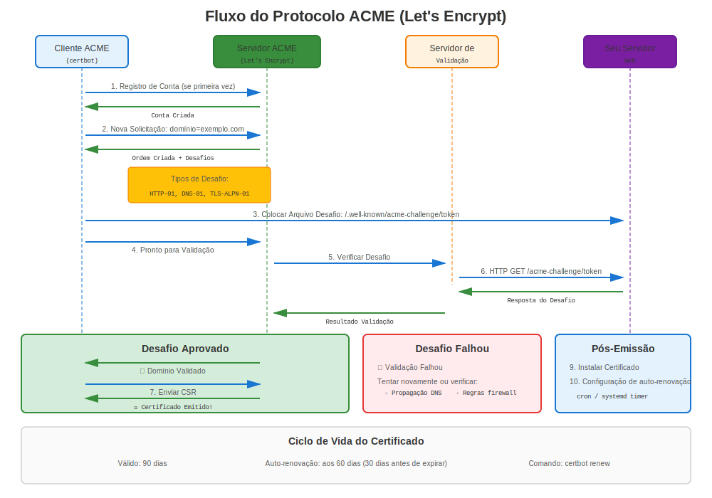
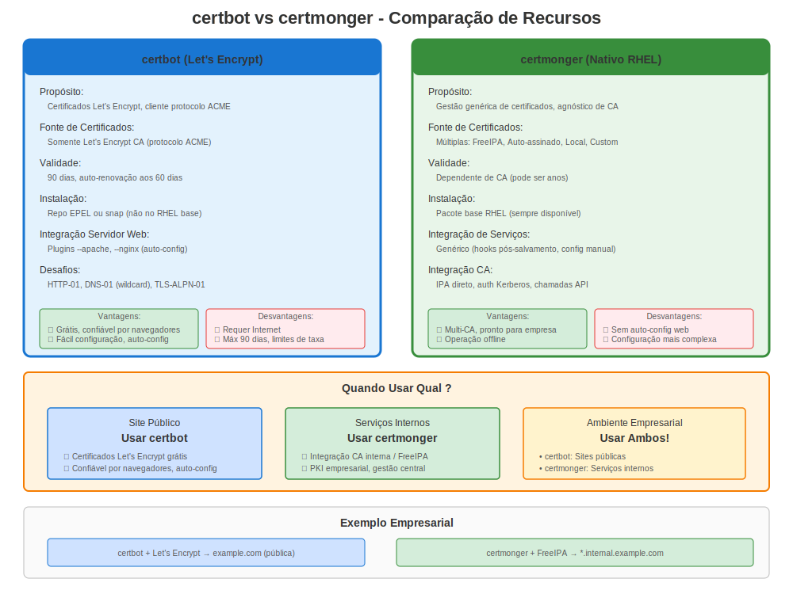

# Capítulo 24: Let's Encrypt e certbot

> **Certificados Públicos Gratuitos:** Let's Encrypt fornece certificados gratuitos e automatizados para websites públicos. Aprenda como usá-lo no RHEL com certbot.

---

## 24.1 O Que é Let's Encrypt?



**Let's Encrypt** é uma autoridade certificadora (CA) gratuita, automatizada e aberta.

**Recursos Chave:**
- ✅ **Certificados gratuitos** (sem custo)
- ✅ **Emissão automatizada** (via protocolo ACME)
- ✅ **Auto-renovação** (a cada 60-90 dias)
- ✅ **Amplamente confiável** (em todos navegadores principais)
- ✅ **Validação domínio** (certificados DV)

**Limitações:**
- ❌ **Apenas domínios públicos** (deve ser acessível pela internet para validação)
- ❌ **Validade 90 dias** (curta vida, requer automatização)
- ❌ **Apenas Domain Validation** (sem Organization ou Extended Validation)
- ❌ **Sem wildcard com HTTP-01** (requer desafio DNS-01)

---

## 24.2 Let's Encrypt no RHEL: ACME público e alternativas nativas



### Método 1: certbot (Tradicional)

> **⚠️ CRÍTICO: EPEL Requerido**
>
> **certbot NÃO está disponível nos repositórios oficiais RHEL.**
>
> Requer **EPEL** (Extra Packages for Enterprise Linux), um repositório **mantido pela comunidade** que **NÃO é oficialmente suportado pela Red Hat**.
>
> **Para Ambientes Produção Empresarial:**
> - Considere FreeIPA com certmonger (Capítulo 19)
> - Ou CA comercial com certmonger (Capítulo 22)
> - Ou gerenciamento certificado manual
>
> **EPEL é adequado para:**
> - Ambientes desenvolvimento/teste
> - Implantações pequenas onde risco EPEL é aceitável
> - Situações onde certificados gratuitos superam preocupações suporte

**Ferramenta certbot:**
- Automatização completa
- Plugins Apache/NGINX
- Configuração automática
- Timers renovação
- ⚠️ Requer EPEL

### Método 2: certmonger para CAs internas/privadas

**Solução RHEL Nativa:**
- ✅ Sem necessidade EPEL
- ✅ Suportado Red Hat
- ✅ Melhor encaixe para fluxos de FreeIPA / IdM e CA local
- ⏸️ Configuração manual do servidor web (sem plugins Apache/NGINX)
- ❌ Não é substituto direto do certbot para o Let's Encrypt público

**Usaremos certbot para o Let's Encrypt público e certmonger para fluxos internos nativos.**

---

## 24.3 Instalação certbot

### RHEL 7

```bash
#============================================#
# INSTALAR CERTBOT NO RHEL 7 (REQUER EPEL!)
#============================================#

# ⚠️ AVISO: Habilitando repositório terceiros

# Passo 1: Habilitar EPEL
sudo yum install https://dl.fedoraproject.org/pub/epel/epel-release-latest-7.noarch.rpm -y

# Verificar EPEL habilitado
yum repolist | grep epel

# Passo 2: Instalar certbot
sudo yum install certbot python2-certbot-apache python2-certbot-nginx -y

# Verificar
certbot --version
```

### RHEL 8

```bash
#============================================#
# INSTALAR CERTBOT NO RHEL 8 (REQUER EPEL!)
#============================================#

# ⚠️ AVISO: Habilitando repositório terceiros

# Passo 1: Habilitar EPEL
sudo dnf install https://dl.fedoraproject.org/pub/epel/epel-release-latest-8.noarch.rpm -y

# Ou se você tem subscription:
sudo dnf install epel-release -y

# Passo 2: Instalar certbot
sudo dnf install certbot python3-certbot-apache python3-certbot-nginx -y

# Verificar
certbot --version
```

### RHEL 9/10

```bash
#============================================#
# INSTALAR CERTBOT NO RHEL 9/10 (REQUER EPEL!)
#============================================#

# ⚠️ AVISO: Habilitando repositório terceiros

# Passo 1: Habilitar EPEL
sudo dnf install epel-release -y

# Passo 2: Instalar certbot
sudo dnf install certbot python3-certbot-apache python3-certbot-nginx -y

# Verificar
certbot --version
```

> **Lembrar:** EPEL é suportado pela comunidade. Para produção empresarial, considere FreeIPA + certmonger (solução RHEL nativa).

---

## 24.4 Uso certbot - Apache

### Configuração Apache Automática

```bash
#============================================#
# CERTBOT COM APACHE (AUTOMATIZADO!)
#============================================#

# Pré-requisitos:
# - Apache instalado e rodando
# - Porta 80 acessível da internet
# - Domínio resolve para este servidor
# - Repositório EPEL habilitado

# Obter certificado e auto-configurar Apache
sudo certbot --apache -d www.example.com -d example.com

# certbot vai:
# 1. Gerar certificado do Let's Encrypt
# 2. Configurar automaticamente SSL Apache
# 3. Configurar redirect HTTP→HTTPS
# 4. Configurar auto-renovação

# Prompts interativos:
# - Endereço email (para avisos renovação)
# - Concordar com ToS
# - Redirecionar HTTP para HTTPS? (escolher yes)

# Não-interativo (automatização):
sudo certbot --apache \
  -d www.example.com \
  -d example.com \
  --non-interactive \
  --agree-tos \
  --email admin@example.com \
  --redirect

# Localização certificado:
# /etc/letsencrypt/live/www.example.com/fullchain.pem
# /etc/letsencrypt/live/www.example.com/privkey.pem
```

---

## 24.5 Uso certbot - NGINX

### Configuração NGINX Automática

```bash
#============================================#
# CERTBOT COM NGINX (AUTOMATIZADO!)
#============================================#

# Pré-requisitos:
# - NGINX instalado e rodando
# - Porta 80 acessível
# - Domínio resolve para servidor

# Obter e configurar
sudo certbot --nginx -d api.example.com

# Não-interativo
sudo certbot --nginx \
  -d api.example.com \
  --non-interactive \
  --agree-tos \
  --email admin@example.com \
  --redirect

# certbot atualiza config NGINX automaticamente!
# Nenhuma configuração SSL manual necessária
```

---

## 24.6 Modo Manual certbot (Standalone)

### Sem Plugin Servidor Web

```bash
#============================================#
# CERTBOT STANDALONE (SEM PLUGIN)
#============================================#

# Usar quando:
# - Servidor web não é Apache/NGINX
# - Quer controle manual sobre config
# - Usando servidor web customizado

# Obter apenas certificado (não configura servidor)
sudo certbot certonly --standalone \
  -d app.example.com \
  --non-interactive \
  --agree-tos \
  --email admin@example.com

# Certificado salvo em:
# /etc/letsencrypt/live/app.example.com/fullchain.pem
# /etc/letsencrypt/live/app.example.com/privkey.pem

# Configurar manualmente seu serviço para usá-lo
# Exemplo Apache:
# SSLCertificateFile /etc/letsencrypt/live/app.example.com/fullchain.pem
# SSLCertificateKeyFile /etc/letsencrypt/live/app.example.com/privkey.pem
```

---

## 24.7 Renovação

### Renovação Automática

```bash
#============================================#
# AUTO-RENOVAÇÃO CERTBOT
#============================================#

# certbot automaticamente configura timer renovação
systemctl list-timers | grep certbot
# Deveria mostrar: certbot-renew.timer

# Ver detalhes timer
systemctl status certbot-renew.timer

# Testar renovação (dry run - não renova realmente)
sudo certbot renew --dry-run

# Forçar renovação real (se necessário)
sudo certbot renew --force-renewal

# Verificar expiração certificado
sudo certbot certificates

# Renovação executa duas vezes diariamente
# Renova certificados expirando dentro de 30 dias
```

### Hooks Renovação

```bash
#============================================#
# HOOKS RENOVAÇÃO (COMANDOS DEPLOY)
#============================================#

# Adicionar hook para recarregar serviço após renovação
sudo certbot renew --deploy-hook "systemctl reload nginx"

# Ou criar script hook
sudo vi /etc/letsencrypt/renewal-hooks/deploy/reload-services.sh

#!/bin/bash
systemctl reload httpd
systemctl reload nginx
systemctl reload postfix

sudo chmod +x /etc/letsencrypt/renewal-hooks/deploy/reload-services.sh

# Hooks em /etc/letsencrypt/renewal-hooks/:
# - pre/: Executar antes renovação
# - post/: Executar após renovação (mesmo se falhou)
# - deploy/: Executar apenas após renovação bem-sucedida
```

---

## 24.8 Certificados Wildcard

### Desafio DNS-01 Requerido

```bash
#============================================#
# CERTIFICADO WILDCARD (DESAFIO DNS)
#============================================#

# Wildcard requer desafio DNS-01
# (não pode usar HTTP-01 para *.example.com)

# Desafio DNS manual
sudo certbot certonly --manual \
  --preferred-challenges dns \
  -d "*.example.com" \
  -d "example.com"

# certbot vai pedir para:
# 1. Criar registro TXT no DNS
# 2. Aguardar propagação
# 3. Pressionar Enter para continuar

# Automatização DNS com plugins (se disponível)
# sudo certbot certonly --dns-route53 -d "*.example.com"
# (requer plugin provedor DNS)
```

---

## 24.9 Onde o certmonger se encaixa

### Use certmonger para fluxos de CA interna ou privada

```bash
#============================================#
# CERTMONGER PARA FLUXOS IPA / CA INTERNA
#============================================#

# Instalar certmonger (incluído no RHEL)
sudo dnf install certmonger -y
sudo systemctl enable --now certmonger

# Solicitar um certificado interno do FreeIPA / IdM
sudo ipa-getcert request \
  -f /etc/pki/tls/certs/internal.example.com.crt \
  -k /etc/pki/tls/private/internal.example.com.key \
  -K HTTP/internal.example.com@REALM \
  -D internal.example.com \
  -C "systemctl reload httpd"

# Verificar status
sudo getcert list

# certmonger faz o rastreamento e a renovação do certificado interno
```

**Mantenha estes fluxos separados:**

| Caso de uso | Ferramenta recomendada |
|----------|------------------|
| Certificado público de internet do Let's Encrypt | `certbot` |
| Certificado interno do FreeIPA / IdM | `certmonger` com `ipa-getcert` |
| ACME contra seu próprio endpoint IdM ACME | `certbot` ou outro cliente ACME |

> **Importante:** IdM ACME, quando habilitado, é a sua própria CA FreeIPA / IdM expondo um endpoint ACME. Não é o Let's Encrypt.

---

## 24.10 Solução de Problemas certbot

### Problemas Comuns

**Problema 1: Validação Desafio Falhou**

```bash
# Sintoma
sudo certbot --apache -d example.com
# Erro: Challenge validation failed

# Causas comuns:
# 1. Porta 80 não acessível
curl http://example.com/.well-known/acme-challenge/test
# Deve estar acessível da internet

# 2. Firewall bloqueando
sudo firewall-cmd --list-services | grep http

# 3. DNS não resolvendo
nslookup example.com

# 4. Outro serviço na porta 80
ss -tlnp | grep :80
```

**Problema 2: Renovação Falhou**

```bash
# Verificar logs renovação
sudo cat /var/log/letsencrypt/letsencrypt.log

# Causas comuns:
# - Porta 80 bloqueada
# - DNS mudou
# - Limite taxa atingido

# Testar renovação manualmente
sudo certbot renew --dry-run
```

**Problema 3: Erros Permissão**

```bash
# Corrigir permissões certbot
sudo chmod 0755 /etc/letsencrypt/{live,archive}
sudo chmod 0644 /etc/letsencrypt/live/*/fullchain.pem
sudo chmod 0600 /etc/letsencrypt/live/*/privkey.pem
```

---

## 24.11 Melhores Práticas

### Melhores Práticas certbot

```markdown
✅ **Usar certbot apenas para sites públicos**
✅ **Garantir porta 80 acessível** (desafio HTTP-01)
✅ **Testar renovação regularmente** (certbot renew --dry-run)
✅ **Monitorar timer renovação** (systemctl status certbot-renew.timer)
✅ **Configurar notificações email** para falhas
✅ **Usar hooks renovação** para recarregar serviços
✅ **Backup diretório /etc/letsencrypt/**
✅ **Documentar dependência EPEL** em runbooks
✅ **Ter plano fallback** se EPEL indisponível
✅ **Para serviços internos, usar certmonger + FreeIPA/CA local**
```

### Quando Usar certbot

**✅ Casos de Uso Bons:**
- Sites públicos
- Ambientes desenvolvimento/staging
- Implantações pequenas
- Projetos sensíveis a custo
- Setup HTTPS rápido

**❌ Considerar Alternativas:**
- Produção empresarial (usar FreeIPA)
- Serviços apenas internos (usar FreeIPA)
- Suporte vendor estrito requerido (sem EPEL)
- Ambientes air-gapped (sem internet)
- Conformidade requerendo CA comercial

---

## 24.12 Alternativa: FreeIPA para Interno

### Comparação

**Para serviços INTERNOS:**

```bash
# Em vez de Let's Encrypt (CA pública)
# Usar FreeIPA (CA interna)

# Vantagens FreeIPA para interno:
✅ Sem dependência internet
✅ Suportado Red Hat
✅ Funciona offline
✅ Sem necessidade EPEL
✅ Integrado com RHEL
✅ Perfis de certificados
✅ Gerenciamento centralizado

# Setup:
sudo ipa-getcert request \
  -f /etc/pki/tls/certs/internal.crt \
  -k /etc/pki/tls/private/internal.key \
  -K HTTP/$(hostname -f)@REALM \
  -C "systemctl reload httpd"

# Ver Capítulo 19 para detalhes FreeIPA
```

---

## 24.13 Migração de certbot para certmonger

### Ao mover serviços internos para FreeIPA / IdM

Se você vai substituir certificados públicos do Let's Encrypt por PKI interna para serviços não públicos, mova o serviço para FreeIPA / IdM em vez de tentar fazer o `certmonger` falar diretamente com o Let's Encrypt.

```bash
#============================================#
# MIGRAR CERTBOT → CERTMONGER PARA PKI INTERNA
#============================================#

# Passo 1: Inventariar os certificados gerenciados pelo certbot
sudo certbot certificates

# Passo 2: Solicitar o certificado interno de substituição a partir do IPA
sudo ipa-getcert request \
  -f /etc/pki/tls/certs/internal.example.com.crt \
  -k /etc/pki/tls/private/internal.example.com.key \
  -K HTTP/internal.example.com@REALM \
  -D internal.example.com \
  -C "systemctl reload httpd"

# Passo 3: Atualizar a configuração do Apache/NGINX
# Mudar de /etc/letsencrypt/live/... para /etc/pki/tls/...

# Passo 4: Recarregar e verificar
sudo systemctl reload httpd
sudo getcert list

# Passo 5: Desabilitar renovações do certbot apenas depois que todos os certificados públicos forem removidos
sudo systemctl disable --now certbot-renew.timer
```

---

## 24.14 Limites Taxa

### Limites Let's Encrypt

**Estar ciente de limites taxa:**

| Tipo Limite | Valor | Período |
|-------------|-------|---------|
| Certificados por domínio | 50 | por semana |
| Certificados duplicados | 5 | por semana |
| Validações falhadas | 5 | por hora |
| Novas contas | 10 | por IP por 3 horas |

**Evitar atingir limites:**
- ✅ Usar --dry-run para teste
- ✅ Usar ambiente staging primeiro
- ✅ Não solicitar mesmo cert repetidamente
- ✅ Planejar implantações cuidadosamente

**Ambiente Staging:**
```bash
# Testar contra staging (não conta contra limites)
sudo certbot --apache \
  -d test.example.com \
  --test-cert  # Usa ambiente staging

# Quando pronto, obter cert produção:
sudo certbot --apache -d test.example.com
```

---

## 24.15 Exemplos Completos

### Exemplo 1: Apache com certbot

```bash
#!/bin/bash
# setup-apache-letsencrypt.sh

DOMAIN="www.example.com"
EMAIL="admin@example.com"

echo "=== Setup Apache + Let's Encrypt ==="
echo "⚠️ Requer repositório EPEL"

# 1. Instalar Apache
sudo dnf install -y httpd

# 2. Habilitar EPEL
sudo dnf install -y epel-release

# 3. Instalar certbot
sudo dnf install -y certbot python3-certbot-apache

# 4. Garantir porta 80 aberta
sudo firewall-cmd --add-service=http --permanent
sudo firewall-cmd --add-service=https --permanent
sudo firewall-cmd --reload

# 5. Iniciar Apache
sudo systemctl enable --now httpd

# 6. Obter certificado
sudo certbot --apache \
  -d "$DOMAIN" \
  --non-interactive \
  --agree-tos \
  --email "$EMAIL" \
  --redirect

# 7. Verificar
sudo certbot certificates

# 8. Testar
curl -I https://$DOMAIN/

echo "✅ Apache + Let's Encrypt configurado!"
echo "⚠️ Lembrar: certbot requer EPEL (suportado comunidade)"
```

### Exemplo 2: NGINX com certbot

```bash
#!/bin/bash
# setup-nginx-letsencrypt.sh

DOMAIN="api.example.com"
EMAIL="admin@example.com"

echo "=== Setup NGINX + Let's Encrypt ==="

# 1. Instalar NGINX
sudo dnf install -y nginx

# 2. Instalar certbot
sudo dnf install -y epel-release
sudo dnf install -y certbot python3-certbot-nginx

# 3. Criar config NGINX básica
sudo tee /etc/nginx/conf.d/$DOMAIN.conf << EOF
server {
    listen 80;
    server_name $DOMAIN;
    root /usr/share/nginx/html;
}
EOF

# 4. Iniciar NGINX
sudo systemctl enable --now nginx

# 5. Obter certificado
sudo certbot --nginx \
  -d "$DOMAIN" \
  --non-interactive \
  --agree-tos \
  --email "$EMAIL"

# 6. certbot automaticamente atualiza config NGINX!

# 7. Verificar
curl -I https://$DOMAIN/

echo "✅ NGINX + Let's Encrypt configurado!"
```

---

## 24.16 Backup e Restore

### Backup Certificados Let's Encrypt

```bash
#============================================#
# BACKUP CERTBOT/LETSENCRYPT
#============================================#

# Backup diretório letsencrypt inteiro
sudo tar czf letsencrypt-backup-$(date +%Y%m%d).tar.gz \
  /etc/letsencrypt/

# Armazenar backup com segurança (contém chaves privadas!)

# Restore
sudo tar xzf letsencrypt-backup-YYYYMMDD.tar.gz -C /

# Verificar
sudo certbot certificates
```

---

## 24.17 Conclusões Chave

1. **Let's Encrypt fornece certificados gratuitos** para domínios públicos
2. **certbot requer EPEL** em TODAS versões RHEL (não oficialmente suportado)
3. **certbot automatiza** configuração Apache/NGINX
4. **Validade 90 dias** requer renovação automática
5. **certmonger continua sendo a opção nativa** para fluxos de FreeIPA e CA interna
6. **Para serviços internos:** Usar FreeIPA ao invés
7. **Testar com --dry-run** para evitar limites taxa
8. **Monitorar timer renovação** - verificar que está rodando

---

## Cartão de Referência Rápida

```
┌──────────────────────────────────────────────────────────────┐
│ REFERÊNCIA RÁPIDA LET'S ENCRYPT & CERTBOT                    │
├──────────────────────────────────────────────────────────────┤
│ ⚠️ REQUER EPEL (repositório comunidade, não Red Hat!)        │
│                                                              │
│ Instalar:     dnf install epel-release                       │
│               dnf install certbot python3-certbot-apache     │
│                                                              │
│ Apache:       certbot --apache -d example.com                │
│ NGINX:        certbot --nginx -d example.com                 │
│ Standalone:   certbot certonly --standalone -d example.com   │
│                                                              │
│ Testar:       certbot renew --dry-run                        │
│ Renovar:      certbot renew (automático via timer)           │
│ Listar:       certbot certificates                           │
│                                                              │
│ Certs:        /etc/letsencrypt/live/<domínio>/               │
│               fullchain.pem, privkey.pem                     │
│                                                              │
│ Timer:        systemctl status certbot-renew.timer           │
│ Logs:         /var/log/letsencrypt/letsencrypt.log           │
│                                                              │
│ Alternativa:  certmonger + FreeIPA / CA interna              │
│               ipa-getcert request ...                        │
└──────────────────────────────────────────────────────────────┘

⚠️ certbot NÃO disponível em repos oficiais RHEL
⚠️ EPEL é suportado comunidade, não Red Hat
✅ Para empresarial: Considere FreeIPA + certmonger (Capítulo 19)
✅ Use certmonger para renovações de FreeIPA / CA interna
```

---

## 🧪 Laboratório Prático

**Lab 13: Let's Encrypt e Certbot**

Obtenha e renove automaticamente certificados Let's Encrypt

- 📁 **Localização:** `labs/pt_BR/13-letsencrypt-certbot/`
- ⏱️ **Tempo:** 30-40 minutos
- 🎯 **Nível:** Intermediário

---

**Navegação do Capítulo**

| [← Anterior: Capítulo 23 - Mergulho Profundo em Crypto-Policies](23-crypto-policies-deep-dive.md) | [Próximo: Capítulo 25 - Automatização Ansible para Certificados →](25-ansible-automation.md) |
|:---|---:|
