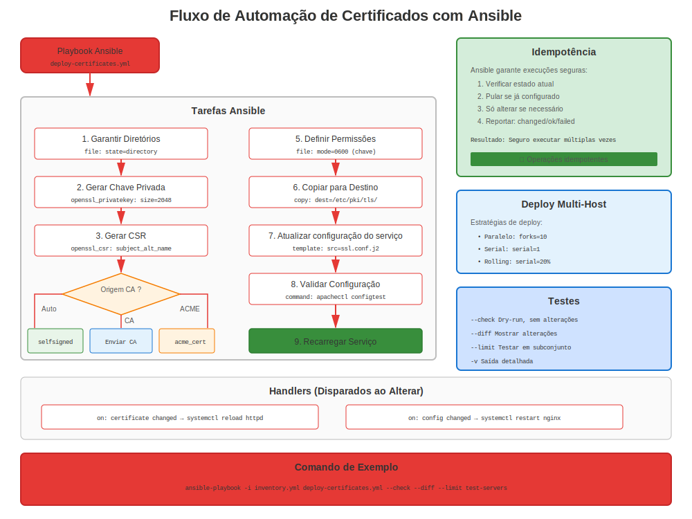

# Capítulo 25: Automatização Ansible para Certificados

> **Escalar:** Gerencie certificados através centenas de sistemas RHEL com Ansible. Automatize implantação, renovação e monitoramento em escala empresarial.

---

## 25.1 Por Que Ansible para Certificados?



**Gerenciamento Manual:**
```
❌ SSH para 100 servidores individualmente
❌ Copiar certificados um por um
❌ Configurar serviços manualmente
❌ Rastrear renovações por servidor
❌ Esperar não ter perdido nenhum
```

**Automatização Ansible:**
```
✅ Implantar certificados em 100 servidores em minutos
✅ Configuração consistente
✅ Idempotente (seguro executar repetidamente)
✅ Controlado versão (Git)
✅ Auditável (quem mudou o que quando)
✅ Capacidade rollback
```

---

## 25.2 Pré-requisitos

### Instalar Ansible no RHEL

```bash
#============================================#
# INSTALAR ANSIBLE
#============================================#

# RHEL 8/9/10
sudo dnf install ansible-core -y

# Ou de repositório Ansible para último
sudo dnf install epel-release  # Se usando EPEL
sudo dnf install ansible -y

# Verificar
ansible --version

# Instalar coleção community.crypto (ESSENCIAL!)
ansible-galaxy collection install community.crypto
```

---

## 25.3 Inventário Ansible para Gerenciamento Certificado

### Exemplo Inventário

```ini
#============================================#
# inventory/hosts.ini
#============================================#

[webservers]
web01.example.com
web02.example.com
web03.example.com

[mailservers]
mail01.example.com

[databases]
db01.example.com
db02.example.com

[all:vars]
ansible_user=ansible
ansible_become=yes
ansible_python_interpreter=/usr/bin/python3
```

---

## 25.4 Gerar Certificados com Ansible

### Playbook: Gerar Chaves Privadas

```yaml
#============================================#
# playbooks/generate-keys.yml
#============================================#

---
- name: Gerar chaves privadas para servidores RHEL
  hosts: webservers
  become: yes

  tasks:
    - name: Instalar OpenSSL
      dnf:
        name: openssl
        state: present

    - name: Gerar chave privada
      community.crypto.openssl_privatekey:
        path: "/etc/pki/tls/private/{{ inventory_hostname }}.key"
        size: 2048
        type: RSA
        mode: '0600'
        owner: root
        group: root

    - name: Verificar chave gerada
      stat:
        path: "/etc/pki/tls/private/{{ inventory_hostname }}.key"
      register: key_file

    - name: Mostrar resultado
      debug:
        msg: "Chave gerada: {{ key_file.stat.exists }}"
```

### Playbook: Gerar CSRs

```yaml
#============================================#
# playbooks/generate-csrs.yml
#============================================#

---
- name: Gerar solicitações de assinatura de certificado
  hosts: webservers
  become: yes

  tasks:
    - name: Criar CSR
      community.crypto.openssl_csr:
        path: "/tmp/{{ inventory_hostname }}.csr"
        privatekey_path: "/etc/pki/tls/private/{{ inventory_hostname }}.key"
        common_name: "{{ inventory_hostname }}"
        subject_alt_name:
          - "DNS:{{ inventory_hostname }}"
          - "DNS:{{ inventory_hostname_short }}"
        key_usage:
          - digitalSignature
          - keyEncipherment
        extended_key_usage:
          - serverAuth
        organization_name: "Example Company"
        country_name: "US"

    - name: Buscar CSR para o nó de controle
      fetch:
        src: "/tmp/{{ inventory_hostname }}.csr"
        dest: "csrs/{{ inventory_hostname }}.csr"
        flat: yes
```

---

## 25.5 Implantar Certificados com Ansible

### Playbook: Implantar Certificados para Apache

```yaml
#============================================#
# playbooks/deploy-apache-certs.yml
#============================================#

---
- name: Implantar certificados em servidores Apache
  hosts: webservers
  become: yes

  vars:
    cert_source_dir: "/path/to/certificates"

  tasks:
    - name: Instalar Apache e mod_ssl
      dnf:
        name:
          - httpd
          - mod_ssl
        state: present

    - name: Copiar certificado
      copy:
        src: "{{ cert_source_dir }}/{{ inventory_hostname }}.crt"
        dest: "/etc/pki/tls/certs/{{ inventory_hostname }}.crt"
        mode: '0644'
        owner: root
        group: root
      notify: recarregar apache

    - name: Implantar chave privada
      copy:
        src: "{{ cert_source_dir }}/{{ inventory_hostname }}.key"
        dest: "/etc/pki/tls/private/{{ inventory_hostname }}.key"
        mode: '0600'
        owner: root
        group: root
        no_log: yes  # Não registrar chave privada
      notify: recarregar apache

    - name: Configurar SSL do Apache
      template:
        src: templates/ssl.conf.j2
        dest: /etc/httpd/conf.d/ssl.conf
        mode: '0644'
      notify: recarregar apache

    - name: Garantir que o Apache está em execução
      service:
        name: httpd
        state: started
        enabled: yes

  handlers:
    - name: recarregar apache
      service:
        name: httpd
        state: reloaded
```

---

## 25.6 Validação Certificado com Ansible

### Playbook: Validar Certificados

```yaml
#============================================#
# playbooks/validate-certificates.yml
#============================================#

---
- name: Validar certificados em servidores RHEL
  hosts: all
  become: yes

  tasks:
    - name: Encontrar todos os certificados
      find:
        paths: /etc/pki/tls/certs/
        patterns: '*.crt'
      register: certificates

    - name: Verificar expiração do certificado
      community.crypto.x509_certificate_info:
        path: "{{ item.path }}"
      register: cert_info
      loop: "{{ certificates.files }}"
      loop_control:
        label: "{{ item.path }}"

    - name: Identificar certificados expirando (30 dias)
      set_fact:
        expiring_certs: "{{ expiring_certs | default([]) + [item.item.path] }}"
      when:
        - (item.not_after | to_datetime('%Y%m%d%H%M%SZ')) - (ansible_date_time.iso8601 | to_datetime) < '30 days'
      loop: "{{ cert_info.results }}"
      loop_control:
        label: "{{ item.item.path }}"

    - name: Reportar certificados expirando
      debug:
        msg: "⚠️ Certificado expirando em breve: {{ item }}"
      loop: "{{ expiring_certs | default([]) }}"
      when: expiring_certs is defined
```

---

## 25.7 Gerenciamento certmonger com Ansible

### Playbook: Configuração Rastreamento certmonger

```yaml
#============================================#
# playbooks/setup-certmonger.yml
#============================================#

---
- name: Configurar rastreamento certmonger
  hosts: webservers
  become: yes

  tasks:
    - name: Instalar certmonger
      dnf:
        name: certmonger
        state: present

    - name: Garantir que certmonger está em execução
      service:
        name: certmonger
        state: started
        enabled: yes

    - name: Solicitar certificado do FreeIPA
      command: >
        ipa-getcert request
        -f /etc/pki/tls/certs/{{ inventory_hostname }}.crt
        -k /etc/pki/tls/private/{{ inventory_hostname }}.key
        -K HTTP/{{ inventory_hostname }}@EXAMPLE.COM
        -D {{ inventory_hostname }}
        -C "systemctl reload httpd"
      args:
        creates: /etc/pki/tls/certs/{{ inventory_hostname }}.crt

    - name: Verificar status do certmonger
      command: getcert list
      register: cert_status
      changed_when: false

    - name: Exibir status
      debug:
        var: cert_status.stdout_lines
```

---

## 25.8 Monitoramento Certificado com Ansible

### Playbook: Relatório Expiração Certificado

```yaml
#============================================#
# playbooks/cert-expiration-report.yml
#============================================#

---
- name: Gerar relatório de expiração de certificados
  hosts: all
  become: yes
  gather_facts: yes

  tasks:
    - name: Obter expiração do certificado para Apache
      shell: |
        if [ -f /etc/pki/tls/certs/{{ inventory_hostname }}.crt ]; then
          openssl x509 -in /etc/pki/tls/certs/{{ inventory_hostname }}.crt -noout -enddate | cut -d= -f2
        else
          echo "Nenhum certificado encontrado"
        fi
      register: cert_expiry
      changed_when: false

    - name: Calcular dias até a expiração
      set_fact:
        days_left: "{{ ((cert_expiry.stdout | to_datetime('%b %d %H:%M:%S %Y %Z')) - (ansible_date_time.iso8601 | to_datetime)).days }}"
      when: cert_expiry.stdout != "Nenhum certificado encontrado"

    - name: Adicionar ao relatório
      set_fact:
        cert_report: |
          {{ inventory_hostname }},{{ cert_expiry.stdout }},{{ days_left | default('N/A') }}
      delegate_to: localhost
      delegate_facts: yes

    - name: Salvar relatório
      copy:
        content: "{{ hostvars | dict2items | map(attribute='value.cert_report') | join('\n') }}"
        dest: "/tmp/cert-expiration-report.csv"
      delegate_to: localhost
      run_once: yes
```

---

## 25.9 Fluxo de Trabalho Implantação Certificado Completo

### Automatização End-to-End

```yaml
#============================================#
# playbooks/full-cert-deployment.yml
#============================================#

---
- name: Implantação completa de certificados
  hosts: webservers
  become: yes

  vars:
    cert_domain: "example.com"
    cert_base_path: "/etc/pki/tls"

  pre_tasks:
    - name: Coletar facts
      setup:

  tasks:
    # 1. Garantir diretórios existem
    - name: Garantir que os diretórios de certificados existem
      file:
        path: "{{ item }}"
        state: directory
        mode: '0755'
      loop:
        - "{{ cert_base_path }}/certs"
        - "{{ cert_base_path }}/private"

    # 2. Gerar chave privada (se não existe)
    - name: Gerar chave privada
      community.crypto.openssl_privatekey:
        path: "{{ cert_base_path }}/private/{{ inventory_hostname }}.key"
        size: 2048
        mode: '0600'

    # 3. Implantar certificado (do controller)
    - name: Implantar certificado
      copy:
        src: "files/certs/{{ inventory_hostname }}.crt"
        dest: "{{ cert_base_path }}/certs/{{ inventory_hostname }}.crt"
        mode: '0644'
      notify: recarregar httpd

    # 4. Implantar bundle CA
    - name: Implantar bundle CA
      copy:
        src: "files/ca-bundle.crt"
        dest: "{{ cert_base_path }}/certs/ca-bundle.crt"
        mode: '0644'

    # 5. Configurar Apache
    - name: Implantar configuração SSL do Apache
      template:
        src: templates/apache-ssl.conf.j2
        dest: /etc/httpd/conf.d/ssl.conf
        mode: '0644'
      notify: recarregar httpd

    # 6. Validar configuração
    - name: Testar configuração do Apache
      command: apachectl configtest
      changed_when: false

    # 7. Garantir firewall aberto
    - name: Abrir HTTPS no firewall
      firewalld:
        service: https
        permanent: yes
        state: enabled
        immediate: yes

    # 8. Garantir Apache rodando
    - name: Garantir que o Apache está em execução
      service:
        name: httpd
        state: started
        enabled: yes

  handlers:
    - name: recarregar httpd
      service:
        name: httpd
        state: reloaded
```

---

## 25.10 Roles Ansible para Certificados

### Criar Role Reutilizável

```bash
#============================================#
# CRIAR ROLE ANSIBLE PARA CERTIFICADOS
#============================================#

# Criar estrutura role
ansible-galaxy role init certificates

# Estrutura diretório:
certificates/
├── defaults/
│   └── main.yml          # Variáveis padrão
├── files/
│   └── ca-bundle.crt     # Certificados CA
├── handlers/
│   └── main.yml          # Handlers reload serviço
├── tasks/
│   └── main.yml          # Tarefas principais
├── templates/
│   └── ssl.conf.j2       # Templates config
└── vars/
    └── main.yml          # Variáveis
```

### Exemplo Tarefas Role

```yaml
#============================================#
# roles/certificates/tasks/main.yml
#============================================#

---
- name: Instalar ferramentas de gerenciamento de certificados
  dnf:
    name:
      - openssl
      - certmonger
    state: present

- name: Garantir diretórios de certificados
  file:
    path: "{{ item }}"
    state: directory
    mode: '0755'
  loop:
    - /etc/pki/tls/certs
    - /etc/pki/tls/private

- name: Implantar certificados
  include_tasks: deploy-cert.yml
  loop: "{{ certificates }}"
  loop_control:
    loop_var: cert

- name: Configurar rastreamento certmonger
  include_tasks: setup-certmonger.yml
  when: use_certmonger | default(false)
```

### Usar a Role

```yaml
#============================================#
# playbook.yml
#============================================#

---
- name: Implantar certificados
  hosts: webservers
  become: yes

  roles:
    - role: certificates
      vars:
        certificates:
          - name: "{{ inventory_hostname }}"
            service: httpd
            principal: "HTTP/{{ inventory_hostname }}@REALM"
```

---

## 25.11 Melhores Práticas

### Melhores Práticas Gerenciamento Certificado Ansible

```markdown
✅ **Usar coleção community.crypto** para tarefas certificado
✅ **Criptografar chaves privadas com vault** (ansible-vault)
✅ **Usar no_log para dados sensíveis** (chaves, senhas)
✅ **Testar em staging primeiro** antes produção
✅ **Usar handlers** para reloads serviço (evitar restarts desnecessários)
✅ **Tornar playbooks idempotentes** (seguro executar múltiplas vezes)
✅ **Controle versão** playbooks no Git
✅ **Documentar variáveis** e requisitos
✅ **Tag tasks** para execução seletiva
✅ **Usar roles** para reutilização
```

### Considerações Segurança

```yaml
# Criptografar chaves privadas com ansible-vault
ansible-vault encrypt files/private-keys/*.key

# Usar no_log para tarefas sensíveis
- name: Implantar chave privada
  copy:
    src: "{{ key_file }}"
    dest: "/etc/pki/tls/private/server.key"
  no_log: yes

# Usar vault para senhas
# group_vars/all/vault.yml (criptografado)
admin_password: !vault |
          $ANSIBLE_VAULT;1.1;AES256
          ...
```

---

## 25.12 Exemplos Completos

### Exemplo 1: Implantar CA para Todos Servidores

```yaml
---
- name: Implantar CA corporativa em todos os servidores RHEL
  hosts: all
  become: yes

  tasks:
    - name: Copiar certificado CA
      copy:
        src: files/corporate-ca.crt
        dest: /etc/pki/ca-trust/source/anchors/corporate-ca.crt
        mode: '0644'

    - name: Atualizar repositório de confiança CA
      command: update-ca-trust extract
      changed_when: true

    - name: Verificar CA instalada
      command: trust list
      register: trust_list
      changed_when: false

    - name: Confirmar presença da CA
      assert:
        that:
          - "'Corporate CA' in trust_list.stdout"
        fail_msg: "CA corporativa não está no repositório de confiança!"
```

### Exemplo 2: Verificação Renovação Certificado em Massa

```yaml
---
- name: Verificar expiração de certificados em toda a frota
  hosts: all
  become: yes

  tasks:
    - name: Verificar status do certmonger
      command: getcert list
      register: certmonger_status
      changed_when: false
      failed_when: false

    - name: Verificar CA_UNREACHABLE
      set_fact:
        has_issue: true
      when: "'CA_UNREACHABLE' in certmonger_status.stdout"

    - name: Reportar problemas
      debug:
        msg: "⚠️ {{ inventory_hostname }} possui certificados CA_UNREACHABLE!"
      when: has_issue | default(false)

    - name: Criar relatório de problemas
      lineinfile:
        path: "/tmp/cert-problems.txt"
        line: "{{ inventory_hostname }}: CA_UNREACHABLE"
        create: yes
      delegate_to: localhost
      when: has_issue | default(false)
```

---

## 25.13 Conclusões Chave

1. **Ansible habilita implantação certificado em massa**
2. **Coleção community.crypto essencial** para tarefas certificado
3. **Usar ansible-vault** para chaves privadas
4. **Playbooks idempotentes** são críticos
5. **Testar em staging** antes produção
6. **Combinar com certmonger** para melhores resultados
7. **Controle versão** tudo no Git

---

## Cartão de Referência Rápida

```
┌──────────────────────────────────────────────────────────────────┐
│ REFERÊNCIA RÁPIDA AUTOMATIZAÇÃO CERTIFICADO ANSIBLE              │
├──────────────────────────────────────────────────────────────────┤
│ Instalar:     dnf install ansible-core                           │
│ Coleção:      ansible-galaxy collection install community.crypto │
│                                                                  │
│ Gerar chave:  community.crypto.openssl_privatekey                │
│ Gerar CSR:    community.crypto.openssl_csr                       │
│ Info cert:    community.crypto.x509_certificate_info             │
│                                                                  │
│ Deploy cert:  copy module (com mode: '0644')                     │
│ Deploy key:   copy module (com mode: '0600', no_log: yes)        │
│                                                                  │
│ Vault:        ansible-vault encrypt <file>                       │
│               ansible-vault decrypt <file>                       │
│                                                                  │
│ Executar:     ansible-playbook playbook.yml                      │
│ Dry run:      ansible-playbook playbook.yml --check              │
│ Específico:   ansible-playbook playbook.yml --tags certs         │
└──────────────────────────────────────────────────────────────────┘

✅ Usar coleção community.crypto
✅ Criptografar chaves privadas com ansible-vault
✅ Usar no_log para dados sensíveis
```

---

## 🧪 Laboratório Prático

**Lab 14: Automatização Ansible para Certificados**

Automatize a implantação de certificados com Ansible

- 📁 **Localização:** `labs/pt_BR/14-ansible-automation/`
- ⏱️ **Tempo:** 40-50 minutos
- 🎯 **Nível:** Avançado

---

**Navegação do Capítulo**

| [← Anterior: Capítulo 24 - Let's Encrypt e certbot](24-letsencrypt-certbot.md) | [Próximo: Capítulo 26 - Monitoramento e Alertas no RHEL →](26-monitoring-alerting.md) |
|:---|---:|
