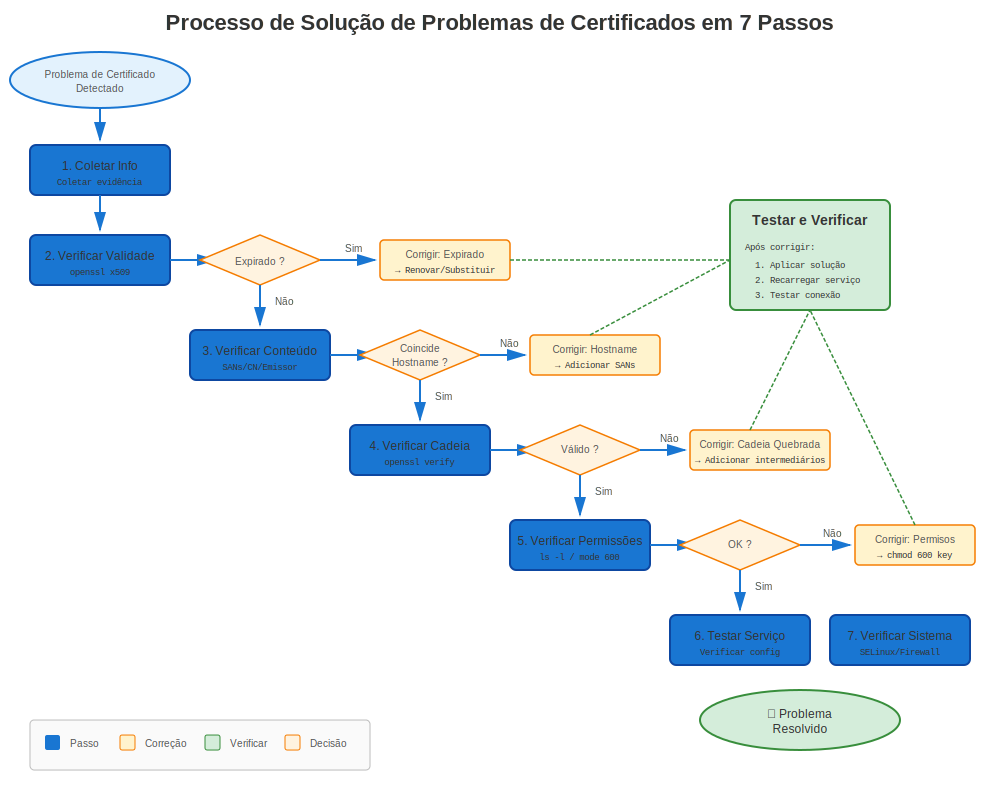
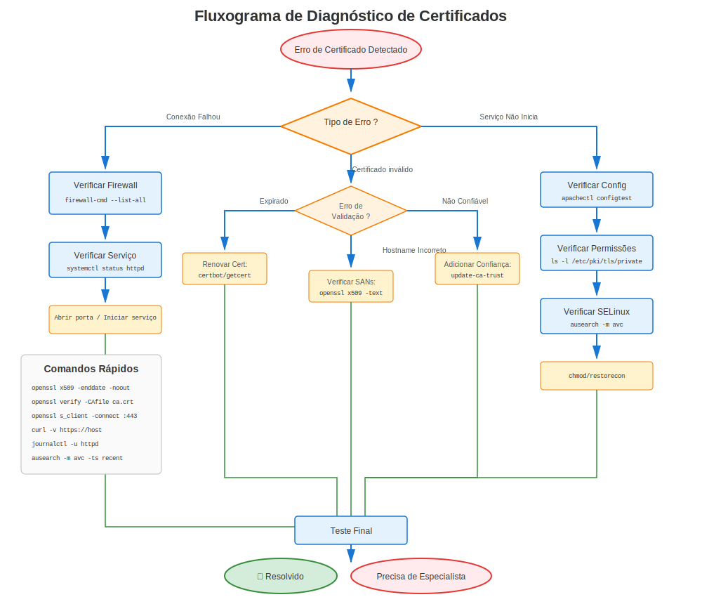

# Capítulo 27: Metodologia de Solução de Problemas de Certificados RHEL

> **Habilidade Crítica:** Este capítulo ensina uma abordagem sistemática para resolver QUALQUER problema de certificado em sistemas RHEL. Domine esta metodologia e você resolverá problemas em minutos em vez de horas.

---

## 27.1 O Problema





Problemas de certificados são frustrantes:
- Mensagens de erro são crípticas
- Causas raiz estão ocultas
- Múltiplas camadas envolvidas (OpenSSL, config serviço, SELinux, crypto-policies)
- Varia por versão RHEL

**A solução de problemas aleatória não funciona.** Você precisa de um sistema.

---

## 27.2 A Abordagem Sistemática

Siga esta metodologia de 7 passos para CADA problema de certificado:

```
Passo 1: Identificar Versão RHEL e Ambiente
Passo 2: Verificar Propriedades Básicas do Certificado
Passo 3: Verificar Cadeia de Confiança e Validação CA
Passo 4: Verificar Configuração do Serviço
Passo 5: Verificar Ajustes em Nível de Sistema
Passo 6: Testar Funcionalidade do Certificado
Passo 7: Revisar Logs e Detalhes de Erros
```

**Regra:** Nunca pular passos. Cada um fornece informação de diagnóstico crítica.

---

## 27.3 Passo 1: Identificar Versão RHEL e Ambiente

### Por Que Isso Importa
Comportamento de certificados difere significativamente entre versões RHEL.

### Verificações Rápidas

```bash
#============================================#
# VERIFICAÇÃO DE VERSÃO RHEL
#============================================#

# 1. Verificar versão RHEL
cat /etc/redhat-release
# Exemplo saída: Red Hat Enterprise Linux release 9.8 (Plow)

# 2. Verificar versão OpenSSL
openssl version
# RHEL 7: OpenSSL 1.0.2k
# RHEL 8: OpenSSL 1.1.1k
# RHEL 9/10: OpenSSL 3.5.5

# 3. Verificar crypto-policy (RHEL 8+)
update-crypto-policies --show 2>/dev/null
# DEFAULT, LEGACY, FUTURE, ou FIPS

# 4. Verificar modo FIPS
fips-mode-setup --check 2>/dev/null
# FIPS mode is enabled/disabled

# 5. Verificar status SELinux
getenforce
# Enforcing, Permissive, ou Disabled
```

### O Que Documentar

Criar uma nota de solução de problemas com:
```
Versão RHEL: _______
Versão OpenSSL: _______
Crypto-Policy: _______ (se RHEL 8+)
Modo FIPS: _______
SELinux: _______
Serviço: _______ (Apache, NGINX, Postfix, etc.)
```

---

## 27.4 Passo 2: Verificar Propriedades Básicas do Certificado

### As Cinco Verificações Essenciais

```bash
#============================================#
# VERIFICAÇÃO 1: Expiração do Certificado
#============================================#

# Ver datas do certificado
openssl x509 -in /path/to/cert.crt -noout -dates

# Saída:
# notBefore=Jan 1 00:00:00 2024 GMT
# notAfter=Jan 1 23:59:59 2025 GMT   ← Deve estar no futuro!

# Verificação rápida se expirado
openssl x509 -in /path/to/cert.crt -noout -checkend 0
# Saída 0 = válido, Saída 1 = expirado

# Verificar expiração em X dias
openssl x509 -in /path/to/cert.crt -noout -checkend $((86400*30))
# Verificar se expira nos próximos 30 dias


#============================================#
# VERIFICAÇÃO 2: Subject/Hostname do Certificado
#============================================#

# Ver subject (para quem é o certificado)
openssl x509 -in /path/to/cert.crt -noout -subject
# subject=CN=server.example.com

# Ver Subject Alternative Names (SANs) - CRÍTICO!
openssl x509 -in /path/to/cert.crt -noout -ext subjectAltName
# X509v3 Subject Alternative Name:
#     DNS:server.example.com, DNS:www.example.com

# ⚠️ Navegadores modernos REQUEREM SANs (CN sozinho é insuficiente)


#============================================#
# VERIFICAÇÃO 3: Coincidência Par Certificado/Chave
#============================================#

# Obter módulo do certificado
openssl x509 -noout -modulus -in /path/to/cert.crt | openssl md5

# Obter módulo da chave
openssl rsa -noout -modulus -in /path/to/cert.key | openssl md5

# ✅ Se hashes MD5 coincidem → cert e chave estão pareados
# ❌ Se diferentes → CHAVE ERRADA!


#============================================#
# VERIFICAÇÃO 4: Emissor do Certificado
#============================================#

# Ver quem assinou este certificado
openssl x509 -in /path/to/cert.crt -noout -issuer
# issuer=C=US, O=Let's Encrypt, CN=R3

# Autoassinado? (subject == issuer)
openssl x509 -in /path/to/cert.crt -noout -subject -issuer | sort | uniq -d
# Se saída não está vazia → autoassinado


#============================================#
# VERIFICAÇÃO 5: Algoritmo e Tamanho da Chave do Certificado
#============================================#

# Ver algoritmo de assinatura
openssl x509 -in /path/to/cert.crt -noout -text | grep "Signature Algorithm"
# Signature Algorithm: sha256WithRSAEncryption   ← Bom
# Signature Algorithm: sha1WithRSAEncryption     ← Ruim (deprecated)

# Ver tamanho da chave pública
openssl x509 -in /path/to/cert.crt -noout -text | grep "Public-Key"
# Public-Key: (2048 bit)   ← Mínimo
# Public-Key: (4096 bit)   ← Melhor

# ⚠️ RHEL 8+ rejeita chaves < 2048 bit por padrão
# ⚠️ RHEL 9+ rejeita assinaturas SHA-1 por padrão
```

### Script de Validação Rápida

```bash
#!/bin/bash
# quick-cert-check.sh
CERT=$1

echo "=== Verificação Rápida de Certificado ==="
echo ""
echo "Arquivo: $CERT"
echo ""

echo "1. Expiração:"
openssl x509 -in "$CERT" -noout -dates

echo ""
echo "2. Subject:"
openssl x509 -in "$CERT" -noout -subject

echo ""
echo "3. SANs:"
openssl x509 -in "$CERT" -noout -ext subjectAltName 2>/dev/null || echo "Nenhum SAN encontrado"

echo ""
echo "4. Emissor:"
openssl x509 -in "$CERT" -noout -issuer

echo ""
echo "5. Algoritmo e Chave:"
openssl x509 -in "$CERT" -noout -text | grep -E "(Signature Algorithm|Public-Key)"

echo ""
echo "6. Ainda válido?"
if openssl x509 -in "$CERT" -noout -checkend 0 >/dev/null 2>&1; then
    echo "✅ Certificado é válido"
else
    echo "❌ Certificado expirou!"
fi
```

Uso:
```bash
bash quick-cert-check.sh /etc/pki/tls/certs/server.crt
```

---

## 27.5 Passo 3: Verificar Cadeia de Confiança e Validação CA

### Entendendo a Cadeia

```
Root CA (deve ser confiável pelo sistema)
  └─ CA(s) Intermediária(s)
      └─ Certificado do Servidor (seu certificado)
```

### Verificar Cadeia de Confiança

```bash
#============================================#
# VERIFICAR CADEIA COMPLETA DE CERTIFICADOS
#============================================#

# Método 1: Verificar contra bundle CA do sistema
openssl verify /path/to/cert.crt
# /path/to/cert.crt: OK   ← Bom!
# error 20: unable to get local issuer certificate   ← CA faltando!

# Método 2: Verificar com arquivo CA específico
openssl verify -CAfile /etc/pki/tls/certs/ca-bundle.crt /path/to/cert.crt

# Método 3: Mostrar cadeia completa
openssl s_client -connect server.example.com:443 -showcerts


#============================================#
# VERIFICAR SE CA É CONFIÁVEL PELO RHEL
#============================================#

# Listar todas CAs confiáveis
trust list | grep -i "certificate-authority"

# Buscar por CA específica
trust list | grep -i "Let's Encrypt"

# Verificar se arquivo CA específico é confiável
trust list --filter=ca-anchors | grep -A5 "pkcs11"


#============================================#
# VER CADEIA DE CERTIFICADOS
#============================================#

# Extrair e ver cadeia completa do servidor
openssl s_client -connect server.example.com:443 -showcerts 2>/dev/null | \
  awk '/BEGIN CERT/,/END CERT/ {print}'

# Ver cadeia de arquivo (se empacotado)
openssl crl2pkcs7 -nocrl -certfile /path/to/chain.crt | \
  openssl pkcs7 -print_certs -text -noout


#============================================#
# VERIFICAR CERTIFICADOS INTERMEDIÁRIOS
#============================================#

# Problema comum: Certificado intermediário faltando!
# Servidor deveria enviar: [Cert Servidor] → [Intermediário] → [Root]
# Mas envia apenas: [Cert Servidor]
# Resultado: Cliente não pode validar cadeia!

# Testar de outra máquina
echo | openssl s_client -connect server.example.com:443 -servername server.example.com 2>&1 | \
  grep -E "(verify return code|Verify return code)"
# Verify return code: 0 (ok)   ← Bom
# Verify return code: 21 (unable to verify the first certificate)   ← Intermediário faltando!
```

### Problemas Comuns de Confiança

| Código Erro | Significado | Solução |
|------------|---------|----------|
| 0 | OK | ✅ Sem problemas |
| 19 | Certificado autoassinado na cadeia | Adicionar CA ao repositório de confiança |
| 20 | Impossível obter cert emissor local | CA ou intermediário faltando |
| 21 | Impossível verificar primeiro certificado | Cert intermediário faltando |
| 27 | Certificado não confiável | CA não está no repositório de confiança sistema |

---

## 27.6 Passo 4: Verificar Configuração do Serviço

### Verificações Específicas por Serviço

```bash
#============================================#
# APACHE (httpd)
#============================================#

# Verificar configuração SSL
sudo apachectl -t -D DUMP_VHOSTS | grep -A5 ":443"

# Ver caminhos de cert SSL
sudo grep -r "SSLCertificateFile\|SSLCertificateKeyFile" /etc/httpd/

# Testar sintaxe de configuração
sudo apachectl configtest

# Verificar módulos SSL carregados
sudo httpd -M | grep ssl


#============================================#
# NGINX
#============================================#

# Testar configuração
sudo nginx -t

# Ver caminhos SSL
sudo grep -r "ssl_certificate\|ssl_certificate_key" /etc/nginx/

# Verificar arquivos de certificado referenciados
sudo nginx -T | grep "ssl_certificate"


#============================================#
# POSTFIX (Mail)
#============================================#

# Ver configurações TLS
sudo postconf | grep -i tls

# Verificar caminhos cert/chave
sudo postconf smtpd_tls_cert_file smtpd_tls_key_file

# Testar TLS
openssl s_client -connect localhost:25 -starttls smtp


#============================================#
# OPENLDAP
#============================================#

# Verificar configurações TLS
sudo grep -i "TLSCert\|TLSKey" /etc/openldap/slapd.conf /etc/openldap/slapd.d/* 2>/dev/null

# Testar LDAPS
openssl s_client -connect localhost:636


#============================================#
# POSTGRESQL
#============================================#

# Verificar configurações SSL
sudo -u postgres psql -c "SHOW ssl_cert_file; SHOW ssl_key_file;"

# Testar conexão SSL
psql "host=localhost sslmode=require"
```

### Verificação de Permissões de Arquivo

```bash
#============================================#
# VERIFICAR PERMISSÕES (CRÍTICO!)
#============================================#

# Arquivos de certificado (públicos) devem ser legíveis
ls -l /etc/pki/tls/certs/*.crt
# -rw-r--r-- (644)   ← Bom

# Arquivos de chave (privados) devem ser protegidos
ls -l /etc/pki/tls/private/*.key
# -rw------- (600) ou -rw-r----- (640)   ← Bom
# -rw-r--r-- (644)   ← RUIM! Muito permissivo!

# Verificar propriedade
ls -l /etc/pki/tls/private/*.key
# Deve ser de propriedade do usuário do serviço ou root

# Corrigir permissões se necessário
sudo chmod 600 /etc/pki/tls/private/server.key
sudo chown root:root /etc/pki/tls/private/server.key
```

---

## 27.7 Passo 5: Verificar Ajustes em Nível de Sistema

### Específico por Versão RHEL

```bash
#============================================#
# RHEL 8/9/10: VERIFICAR CRYPTO-POLICIES
#============================================#

# Política atual
update-crypto-policies --show
# DEFAULT, LEGACY, FUTURE, ou FIPS

# Se serviço falha com "no shared cipher" ou similar:
# Testar temporariamente com política LEGACY
sudo update-crypto-policies --set LEGACY
sudo systemctl restart <serviço>

# Testar se funciona agora
# Se SIM → incompatibilidade de cipher/versão TLS
# Se NÃO → problema diferente

# Reverter para DEFAULT
sudo update-crypto-policies --set DEFAULT


#============================================#
# VERIFICAR MODO FIPS (Todas Versões)
#============================================#

fips-mode-setup --check
# FIPS mode is enabled.

# No modo FIPS, restrições adicionais se aplicam:
# - Apenas algoritmos aprovados
# - Requisitos de chave mais rigorosos
# - Alguns ciphers desabilitados


#============================================#
# VERIFICAR SELINUX (Crítico!)
#============================================#

# Status SELinux
getenforce
# Enforcing, Permissive, ou Disabled

# Verificar negações relacionadas a certificados
sudo ausearch -m avc -ts recent | grep -i cert

# Verificar contexto SELinux de arquivos cert
ls -Z /etc/pki/tls/certs/server.crt
# system_u:object_r:cert_t:s0   ← Correto

# Se errado, relabeling
sudo restorecon -v /etc/pki/tls/certs/server.crt
sudo restorecon -v /etc/pki/tls/private/server.key


#============================================#
# VERIFICAR FIREWALL
#============================================#

# Verificar se porta do serviço está aberta
sudo firewall-cmd --list-all | grep -E "(https|443|ldaps|636)"

# Se não aberta
sudo firewall-cmd --add-service=https --permanent
sudo firewall-cmd --reload
```

---

## 27.8 Passo 6: Testar Funcionalidade do Certificado

### Testes de Conexão ao Vivo

```bash
#============================================#
# TESTAR CONEXÃO HTTPS/TLS
#============================================#

# Método 1: openssl s_client (mais detalhado)
openssl s_client -connect server.example.com:443 -servername server.example.com

# Procurar por:
# - "Verify return code: 0 (ok)"   ← Bom
# - Exibição da cadeia de certificados
# - Cipher negociado
# - Versão do protocolo (TLS 1.2/1.3)

# Método 2: curl (teste rápido)
curl -v https://server.example.com/
# Procurar por:
# * SSL connection using TLSv1.3
# * Server certificate:
# *  subject: CN=server.example.com
# *  issuer: CN=Let's Encrypt Authority

# Método 3: Testar com versão TLS específica
openssl s_client -connect server.example.com:443 -tls1_2
openssl s_client -connect server.example.com:443 -tls1_3


#============================================#
# TESTAR DA PERSPECTIVA DO CLIENTE
#============================================#

# Testar resolução DNS
nslookup server.example.com
# Deve resolver para IP correto

# Testar conectividade de rede
telnet server.example.com 443
nc -zv server.example.com 443

# Testar com clientes diferentes
curl --insecure https://server.example.com/   # Ignorar verificação cert
wget --no-check-certificate https://server.example.com/
```

### Testes de Validação de Certificado

```bash
#============================================#
# VALIDAR ASPECTOS ESPECÍFICOS
#============================================#

# Testar correspondência de hostname
openssl s_client -connect server.example.com:443 -servername server.example.com 2>&1 | \
  grep "verify return"

# Testar com hostname errado (deveria falhar)
openssl s_client -connect server.example.com:443 -servername wrong.example.com 2>&1 | \
  grep "verify return"

# Testar expiração
openssl s_client -connect server.example.com:443 2>&1 | openssl x509 -noout -dates

# Testar força do cipher
openssl s_client -connect server.example.com:443 -cipher 'HIGH:!aNULL:!MD5'
```

---

## 27.9 Passo 7: Revisar Logs e Detalhes de Erros

### Onde Procurar

```bash
#============================================#
# LOGS DE SERVIÇO
#============================================#

# Apache
sudo tail -f /var/log/httpd/error_log
sudo tail -f /var/log/httpd/ssl_error_log

# NGINX
sudo tail -f /var/log/nginx/error.log

# Postfix
sudo tail -f /var/log/maillog

# Journal do sistema (todos serviços)
sudo journalctl -u httpd.service -f
sudo journalctl -u nginx.service -f
sudo journalctl -xe | grep -i cert


#============================================#
# LOGS CERTMONGER (Auto-Renovação)
#============================================#

# Status certmonger
sudo getcert list

# Logs certmonger
sudo journalctl -u certmonger.service -f

# Status detalhado para cert específico
sudo getcert list -i <request-id>


#============================================#
# NEGAÇÕES SELINUX
#============================================#

# Negações AVC recentes
sudo ausearch -m avc -ts recent

# Negações relacionadas a certificados
sudo ausearch -m avc -ts today | grep -i cert


#============================================#
# ERROS OPENSSL/TLS
#============================================#

# Comum em logs:
# - "SSL_CTX_use_certificate:ca md too weak" → Algoritmo assinatura fraco
# - "unable to get local issuer certificate" → CA faltando
# - "certificate has expired" → Cert expirado
# - "certificate verify failed" → Falha validação cadeia
# - "no shared cipher" → Incompatibilidade cipher
# - "wrong version number" → Incompatibilidade protocolo
```

---

## 27.10 Árvores de Decisão

### Fluxograma de Diagnóstico Rápido

```
Problema de Certificado
    │
    ├─ Serviço não inicia?
    │   ├─ Verificar caminhos de arquivo na config
    │   ├─ Verificar permissões de arquivo (600 para chaves)
    │   ├─ Verificar coincidência par cert/chave
    │   └─ Verificar contexto SELinux
    │
    ├─ Conexão falha com "certificate verify failed"?
    │   ├─ Verificar confiança CA (Passo 3)
    │   ├─ Verificar certificados intermediários
    │   └─ Verificar crypto-policy (RHEL 8+)
    │
    ├─ "Certificate has expired"?
    │   ├─ Verificar com: openssl x509 -noout -dates
    │   ├─ Verificar status certmonger
    │   └─ Renovar certificado
    │
    ├─ "Hostname does not match"?
    │   ├─ Verificar SANs: openssl x509 -noout -ext subjectAltName
    │   ├─ Verificar resolução DNS
    │   └─ Verificar diretiva server_name/ServerName
    │
    └─ "No shared cipher" / "wrong version number"?
        ├─ Verificar crypto-policy (RHEL 8+)
        ├─ Verificar compatibilidade versão TLS
        └─ Testar com: openssl s_client -tls1_2
```

---

## 27.11 Kit de Ferramentas de Solução de Problemas

### Comandos Essenciais

```bash
# Cartão de referência rápida para solução de problemas

# 1. IDENTIFICAR
cat /etc/redhat-release
openssl version
update-crypto-policies --show

# 2. VERIFICAR CERTIFICADO
openssl x509 -in cert.crt -noout -text
openssl x509 -in cert.crt -noout -dates
openssl x509 -in cert.crt -noout -subject

# 3. VERIFICAR CONFIANÇA
openssl verify cert.crt
trust list | grep -i "authority"

# 4. TESTAR CONEXÃO
openssl s_client -connect host:443 -servername host
curl -v https://host/

# 5. VERIFICAR PERMISSÕES
ls -lZ /etc/pki/tls/certs/cert.crt
ls -lZ /etc/pki/tls/private/key.key

# 6. VERIFICAR LOGS
sudo journalctl -xe | grep -i cert
sudo tail -f /var/log/httpd/ssl_error_log
```

### Criar Sua Lista de Verificação de Solução de Problemas

```markdown
## Lista de verificação para solução de problemas de certificados

### Ambiente
- [ ] Versão RHEL: _______
- [ ] Versão OpenSSL: _______
- [ ] Crypto-Policy (RHEL 8+): _______
- [ ] Modo FIPS: _______
- [ ] SELinux: _______
- [ ] Serviço: _______

### Verificações Certificado
- [ ] Data expiração certificado
- [ ] Subject/hostname coincide
- [ ] SANs presentes e corretos
- [ ] Par certificado/chave coincide
- [ ] Algoritmo assinatura (SHA-256 ou superior; sem SHA-1 nem MD5)
- [ ] Tamanho chave (>= 2048 bits)

### Cadeia Confiança
- [ ] Certificado valida com bundle CA sistema
- [ ] Certificados intermediários presentes
- [ ] Root CA confiável pelo sistema

### Configuração Serviço
- [ ] Caminhos arquivo corretos na config
- [ ] Permissões arquivo corretas (600 para chaves)
- [ ] Contextos SELinux corretos
- [ ] Sintaxe config serviço válida

### Ajustes Sistema
- [ ] Crypto-policy compatível (RHEL 8+)
- [ ] Requisitos FIPS atendidos (se aplicável)
- [ ] Firewall permite conexões
- [ ] Sem negações SELinux

### Teste
- [ ] Teste conexão com openssl s_client
- [ ] Teste conexão com curl
- [ ] Verificação hostname passa

### Logs
- [ ] Logs serviço revisados
- [ ] Journal sistema verificado
- [ ] Log auditoria SELinux verificado
```

---

## 27.12 Conclusões Chave

1. **Sempre seguir metodologia de 7 passos** - não pular passos
2. **Verificar versão RHEL primeiro** - comportamento varia significativamente
3. **Verificar propriedades básicas certificado** antes de solução de problemas complexa
4. **Problemas de cadeia de confiança** são o problema mais comum
5. **Permissões de arquivo** causam muitas falhas "misteriosas"
6. **Crypto-policies** (RHEL 8+) afetam tudo
7. **SELinux** pode bloquear acesso a certificados
8. **Logs contam a história** - sempre verificá-los

---

## 27.13 Cenários Práticos

Ver capítulos próximos para solução de problemas detalhada de:
- **Capítulo 28:** Erros Comuns de Certificados no RHEL
- **Capítulo 29:** Solução de Problemas Específica por Serviço
- **Capítulo 30:** Solução de Problemas do certmonger
- **Capítulo 31:** Solução de Problemas Crypto-Policy
- **Capítulo 32:** Análise Relatórios SOS
- **Capítulo 33:** Procedimentos de Emergência

---

## Referência Rápida

```
┌──────────────────────────────────────────────────────────────────┐
│ MÉTODO SOLUÇÃO DE PROBLEMAS DE 7 PASSOS                          │
├──────────────────────────────────────────────────────────────────┤
│ 1. Identificar: Versão RHEL, OpenSSL, crypto-policy              │
│ 2. Verificar: Expiração, hostname, coincidência chave, algoritmo │
│ 3. Confiança: Validação CA, cadeia, intermediários               │
│ 4. Config: Arquivos serviço, caminhos, permissões                │
│ 5. Sistema: Crypto-policy, FIPS, SELinux, firewall               │
│ 6. Testar: Conexões ao vivo, curl, openssl s_client              │
│ 7. Logs: Logs serviço, journal, auditoria SELinux                │
└──────────────────────────────────────────────────────────────────┘
```

---

## 🧪 Laboratório Prático

**Lab 15: Cenários de Solução de Problemas**

Pratique diagnosticar e corrigir um problema de certificado expirado (um cenário implementado)

- 📁 **Localização:** `labs/pt_BR/15-troubleshooting-scenarios/`
- ⏱️ **Tempo:** 15-20 minutos
- 🎯 **Nível:** Avançado

---

**Navegação do Capítulo**

| [← Anterior: Capítulo 26 - Monitoramento e Alertas no RHEL](../part-04-automation/26-monitoring-alerting.md) | [Próximo: Capítulo 28 - Erros Comuns de Certificados no RHEL →](28-common-errors.md) |
|:---|---:|
