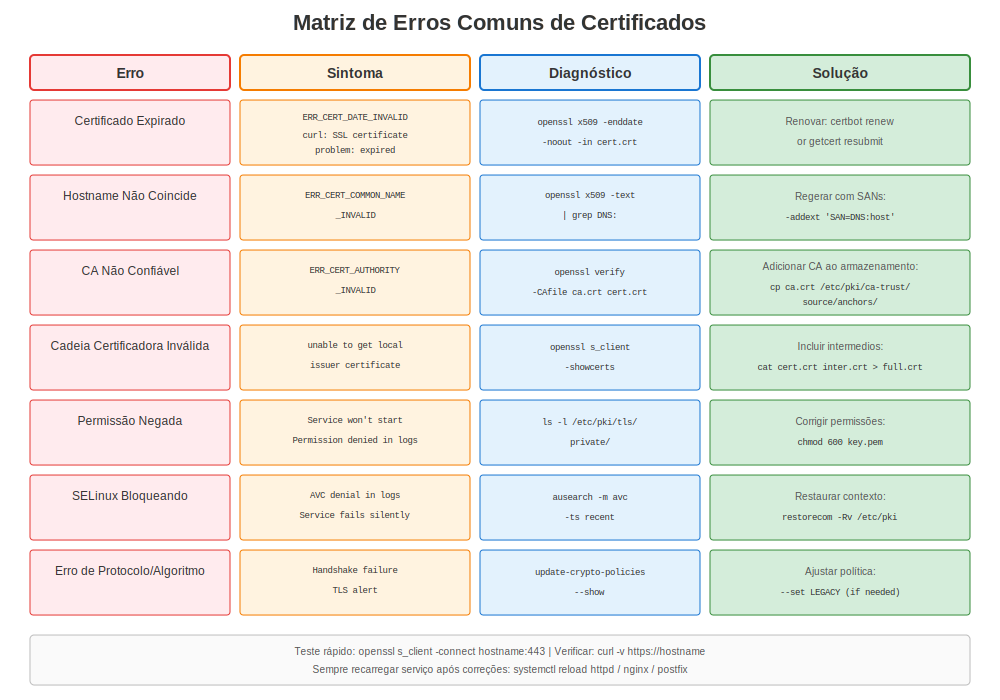
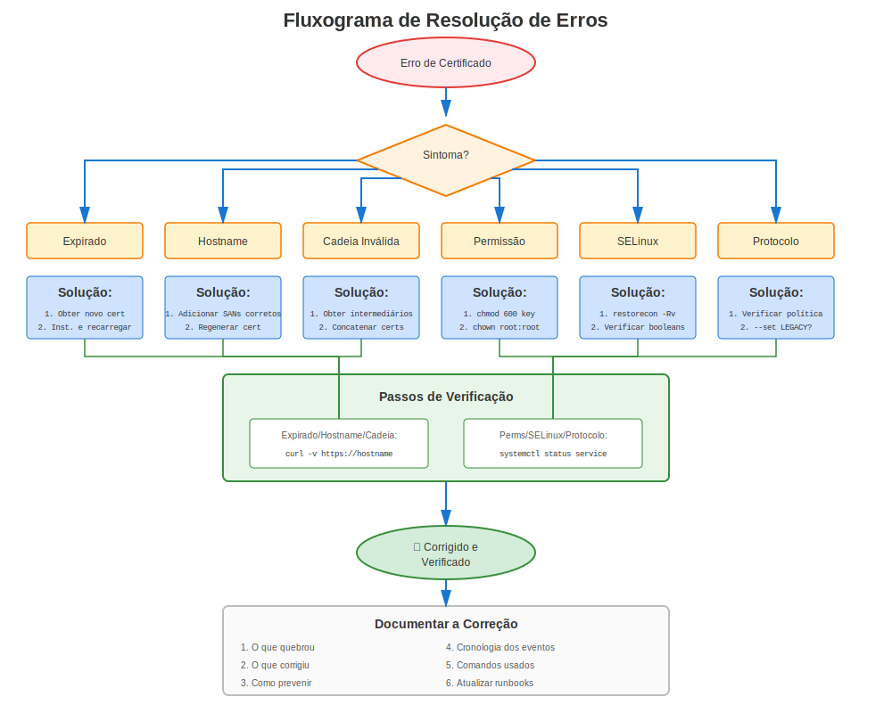

# Capítulo 28: Erros Comuns de Certificados no RHEL

> **Aprenda da Dor dos Outros:** Este capítulo cataloga os erros de certificados mais comuns no RHEL, organizados por tipo e versão. Quando encontrar um erro, procure aqui primeiro!

---

## 28.1 Usando Este Capítulo





**Como usar este guia de solução de problemas:**

1. **Viu um erro?** Busque neste capítulo pela mensagem de erro
2. **Serviço não inicia?** Verifique Seção 28.3 (Erros de Configuração)
3. **Conexão falha?** Verifique Seção 28.4 (Erros de Validação)
4. **Após atualização RHEL?** Verifique Seção 28.7 (Específico por Versão)
5. **Não tem certeza?** Use a metodologia do Capítulo 27

---

## 28.2 Erros Mais Comuns (Top 10)

### Tabela de Referência Rápida

| #  | Erro | Causa Comum | Solução Rápida |
|----|------|-------------|----------------|
| 1 | Certificado expirado | Esqueceu renovar | Renovar certificado |
| 2 | unable to get local issuer | CA faltando no repositório de confiança | Adicionar CA a `/etc/pki/ca-trust/source/anchors/` |
| 3 | certificate verify failed | Cadeia incompleta | Instalar certs intermediários |
| 4 | Permission denied | Permissões de arquivo erradas | `chmod 600` em arquivo de chave |
| 5 | hostname does not match | Desajuste de CN/SAN | Reemitir com SANs corretos |
| 6 | no shared cipher | Incompatibilidade de cifra | Verificar crypto-policy (RHEL 8+) |
| 7 | ca md too weak | Assinatura SHA-1 (RHEL 9+) | Reemitir com SHA-256+ |
| 8 | wrong version number | Desajuste de versão TLS | Verificar suporte TLS cliente |
| 9 | CA_UNREACHABLE | certmonger não alcança IPA | Verificar conectividade IPA |
| 10 | SELinux denying access | Contexto SELinux errado | `restorecon` em arquivos cert |

---

## 28.3 Erros de Configuração

### Erro: "SSLCertificateFile: file does not exist or is empty"

**Serviços:** Apache

**Sintoma:**
```
AH00526: Syntax error on line 100 of /etc/httpd/conf.d/ssl.conf:
SSLCertificateFile: file '/etc/pki/tls/certs/server.crt' does not exist or is empty
```

**Diagnóstico:**
```bash
ls -l /etc/pki/tls/certs/server.crt
# ls: cannot access '/etc/pki/tls/certs/server.crt': No such file or directory
```

**Soluções:**
```bash
# Solução 1: Corrigir caminho na config
sudo vi /etc/httpd/conf.d/ssl.conf
# Corrigir o caminho SSLCertificateFile

# Solução 2: Instalar certificado no local esperado
sudo cp server.crt /etc/pki/tls/certs/

# Solução 3: Restaurar do backup
sudo cp /var/backups/certificates/latest/server.crt /etc/pki/tls/certs/
```

### Erro: "Private key does not match this certificate"

**Serviços:** Apache, NGINX, Postfix

**Sintoma:**
```
SSL Library Error: error:0B080074:x509 certificate routines:
X509_check_private_key:key values mismatch
```

**Diagnóstico:**
```bash
# Verificar se cert e chave coincidem
CERT_MOD=$(openssl x509 -noout -modulus -in /etc/pki/tls/certs/server.crt | openssl md5)
KEY_MOD=$(openssl rsa -noout -modulus -in /etc/pki/tls/private/server.key | openssl md5)

echo "Cert: $CERT_MOD"
echo "Key:  $KEY_MOD"
# Se diferentes → desajuste!
```

**Causa:** Certificado foi emitido para uma chave privada diferente

**Solução:**
```bash
# Regenerar CSR com a chave CORRETA
openssl req -new -key /etc/pki/tls/private/server.key -out server.csr \
  -subj "/CN=server.example.com"

# Submeter CSR para CA, obter novo certificado
# Instalar novo certificado
```

### Erro: "Permission denied" na Chave Privada

**Serviços:** Todos

**Sintoma:**
```
Permission denied: Can't open PEM file '/etc/pki/tls/private/server.key'
```

**Diagnóstico:**
```bash
ls -l /etc/pki/tls/private/server.key
# -rw-r--r--. 1 root root  ← Muito permissivo!

# Verificar se usuário do serviço pode ler
sudo -u apache cat /etc/pki/tls/private/server.key >/dev/null
# Permission denied
```

**Solução:**
```bash
# Definir permissões corretas
sudo chmod 600 /etc/pki/tls/private/server.key
sudo chown apache:apache /etc/pki/tls/private/server.key

# Para serviços que necessitam propriedade específica:
# OpenLDAP:
sudo chown ldap:ldap /etc/openldap/certs/ldap.key

# PostgreSQL:
sudo chown postgres:postgres /var/lib/pgsql/data/server.key

# MySQL:
sudo chown mysql:mysql /etc/mysql/certs/server.key
```

---

## 28.4 Erros de Validação

### Erro: "certificate verify failed"

**Serviços:** Todos

**Erro Completo:**
```
SSL_connect: error:14090086:SSL routines:ssl3_get_server_certificate:certificate verify failed
```

**Causas Comuns:**

**Causa 1: Certificado autoassinado não confiável**
```bash
# Diagnóstico
openssl verify /etc/pki/tls/certs/server.crt
# error 18: self signed certificate

# Solução: Adicionar ao repositório de confiança
sudo cp server.crt /etc/pki/ca-trust/source/anchors/
sudo update-ca-trust
```

**Causa 2: Certificado CA faltando**
```bash
# Diagnóstico
openssl verify /etc/pki/tls/certs/server.crt
# error 20: unable to get local issuer certificate

# Solução: Adicionar certificado CA
sudo cp ca.crt /etc/pki/ca-trust/source/anchors/
sudo update-ca-trust
```

**Causa 3: Certificado intermediário faltando**
```bash
# Diagnóstico
openssl s_client -connect server.example.com:443 -showcerts
# Verify return code: 21 (unable to verify the first certificate)

# Solução: Incluir intermediário no arquivo cert
cat server.crt intermediate.crt > /etc/pki/tls/certs/server-chain.crt
# Atualizar config do serviço para usar server-chain.crt
```

### Erro: "certificate has expired"

**Serviços:** Todos

**Sintoma:**
```
SSL_connect: error:14090086:SSL routines:ssl3_get_server_certificate:certificate has expired
```

**Diagnóstico:**
```bash
# Verificar expiração
openssl x509 -in /etc/pki/tls/certs/server.crt -noout -dates
# notAfter=Jan 15 23:59:59 2024 GMT  ← No passado!
```

**Soluções:**
```bash
# Solução 1: Se certmonger rastreando
sudo ipa-getcert resubmit -f /etc/pki/tls/certs/server.crt

# Solução 2: Renovação manual
# Gerar novo CSR, submeter para CA, instalar novo cert

# Solução 3: Emergência - autoassinado temporário
sudo /usr/local/bin/emergency-self-signed-cert.sh $(hostname -f)
# Veja Capítulo 33 para procedimentos de emergência
```

### Erro: "hostname (or IP address) does not match certificate"

**Serviços:** Todos (especialmente navegadores)

**Erro Completo:**
```
SSL: certificate subject name 'server.example.com' does not match target host name 'www.example.com'
```

**Diagnóstico:**
```bash
# Verificar CN e SANs do certificado
openssl x509 -in /etc/pki/tls/certs/server.crt -noout -subject -ext subjectAltName

# Saída:
# subject=CN=server.example.com
# X509v3 Subject Alternative Name:
#     DNS:server.example.com
#
# Problema: Acessando www.example.com mas cert tem apenas server.example.com
```

**Solução:**
```bash
# Reemitir certificado com SANs corretos
openssl req -new -key server.key -out server.csr \
  -subj "/CN=www.example.com" \
  -addext "subjectAltName=DNS:www.example.com,DNS:server.example.com,DNS:example.com"

# Ou usar wildcard: *.example.com
```

---

## 28.5 Erros de Cadeia de Confiança

### Erro: "unable to get local issuer certificate"

**Código Erro:** 20

**Sintoma:**
```bash
openssl verify /etc/pki/tls/certs/server.crt
# error 20 at 0 depth lookup: unable to get local issuer certificate
```

**Causa:** A CA que assinou o certificado não está no repositório de confiança do sistema

**Solução:**
```bash
# Obter certificado CA (da CA ou extrair da cadeia)
# Adicionar ao repositório de confiança
sudo cp issuing-ca.crt /etc/pki/ca-trust/source/anchors/
sudo update-ca-trust

# Verificar
openssl verify /etc/pki/tls/certs/server.crt
# /etc/pki/tls/certs/server.crt: OK
```

### Erro: "unable to verify the first certificate"

**Código Erro:** 21

**Sintoma:**
```bash
openssl s_client -connect server.example.com:443
# Verify return code: 21 (unable to verify the first certificate)
```

**Causa:** Servidor enviando certificado sem intermediário(s)

**Diagnóstico:**
```bash
# Contar certificados na cadeia
openssl s_client -connect server.example.com:443 -showcerts 2>&1 | \
  grep -c "BEGIN CERTIFICATE"
# Se mostra 1: Apenas cert servidor (intermediário faltando!)
# Deveria mostrar 2+: Servidor + intermediário(s)
```

**Solução:**
```bash
# Criar bundle de certificado com intermediário
cat server.crt intermediate.crt > /etc/pki/tls/certs/server-bundle.crt

# Atualizar config do serviço
# Apache:
SSLCertificateFile /etc/pki/tls/certs/server-bundle.crt

# Ou usar SSLCertificateChainFile (Apache):
SSLCertificateChainFile /etc/pki/tls/certs/intermediate.crt

# NGINX:
ssl_certificate /etc/pki/tls/certs/server-bundle.crt;

# Recarregar serviço
```

---

## 28.6 Erros de Crypto-Policy (RHEL 8/9/10)

### Erro: "no shared cipher"

**Serviços:** Todos (RHEL 8/9/10)

**Sintoma:**
```
SSL routines:SSL23_GET_SERVER_HELLO:sslv3 alert handshake failure
```

**Diagnóstico:**
```bash
# Verificar política atual
update-crypto-policies --show
# DEFAULT

# Testar conexão mostrando ciphers
openssl s_client -connect server:443 -cipher 'ALL'

# Verificar quais ciphers estão disponíveis sob política atual
openssl ciphers -v | head -20
```

**Causas Comuns e Soluções:**

**Causa 1: Cliente muito antigo (necessita TLS 1.0)**
```bash
# Teste temporário com LEGACY
sudo update-crypto-policies --set LEGACY
sudo systemctl restart httpd

# Se funciona → problema compatibilidade cliente
# Correção apropriada: Atualizar cliente ou criar módulo política customizado
```

**Causa 2: Crypto-policy do servidor muito restritiva**
```bash
# Se usando política FUTURE com clientes antigos
update-crypto-policies --show
# FUTURE

# Temporário: Usar DEFAULT
sudo update-crypto-policies --set DEFAULT
sudo systemctl restart services
```

### Erro: "SSL routines:tls_post_process_client_hello:no shared cipher"

**Serviços:** Todos (RHEL 9+)

**Sintoma:** Cliente não consegue negociar cipher com servidor

**Solução:**
```bash
# RHEL 9: Verificar se cliente usando ciphers muito antigos
# Pode necessitar política LEGACY temporariamente

# Verificar configuração do servidor para overrides
grep -r "SSLCipherSuite\|ssl_ciphers" /etc/httpd/ /etc/nginx/

# Se ciphers codificados encontrados, removê-los
# Deixar crypto-policy lidar com isso
```

---

## 28.7 Erros Específicos por Versão RHEL

### Erros Específicos RHEL 7

**Erro: "dh key too small"**
```
SSL routines:ssl3_check_cert_and_algorithm:dh key too small
```

**Causa:** Parâmetros DH padrão muito pequenos para clientes modernos

**Solução:**
```bash
# Gerar parâmetros DH mais fortes
openssl dhparam -out /etc/pki/tls/dhparams.pem 2048

# Apache: Adicionar a ssl.conf
SSLOpenSSLConfCmd DHParameters "/etc/pki/tls/dhparams.pem"

# NGINX: Adicionar à config
ssl_dhparam /etc/pki/tls/dhparams.pem;
```

### Erros Específicos RHEL 8/9/10

**Erro: "ca md too weak" (RHEL 9+)**
```
error 3 at 0 depth lookup: CA md too weak
```

**Causa:** Certificado tem assinatura SHA-1 (bloqueado no RHEL 9+)

**Diagnóstico:**
```bash
openssl x509 -in server.crt -noout -text | grep "Signature Algorithm"
# Signature Algorithm: sha1WithRSAEncryption  ← Problema!
```

**Solução:**
```bash
# Reemitir certificado com SHA-256 ou melhor
# Sem workaround - SHA-1 é bloqueado por segurança

# Solicitar novo certificado
openssl req -new -key server.key -out server.csr -sha256 \
  -subj "/CN=server.example.com"
```

**Erro: "Provider 'legacy' could not be loaded" (RHEL 9+)**
```
openssl: error while loading shared libraries: Provider 'legacy' could not be loaded
```

**Causa:** Tentando usar algoritmo legado sem provider

**Solução:**
```bash
# Usar provider legado explicitamente
openssl md5 -provider legacy file.txt

# Ou atualizar para usar algoritmo moderno
openssl sha256 file.txt
```

---

## 28.8 Erros SELinux

### Erro: SELinux Prevenindo Acesso ao Certificado

**Sintoma:**
```
audit: type=1400 audit(timestamp): avc: denied { read } for pid=1234 comm="httpd"
name="server.key" dev="sda1" ino=12345 scontext=system_u:system_r:httpd_t:s0
tcontext=unconfined_u:object_r:admin_home_t:s0 tclass=file permissive=0
```

**Diagnóstico:**
```bash
# Verificar negações AVC
sudo ausearch -m avc -ts recent | grep cert

# Verificar contexto SELinux
ls -Z /etc/pki/tls/certs/server.crt
ls -Z /etc/pki/tls/private/server.key
```

**Solução:**
```bash
# Corrigir contexto SELinux
sudo restorecon -Rv /etc/pki/tls/

# Verificar
ls -Z /etc/pki/tls/certs/server.crt
# system_u:object_r:cert_t:s0  ← Correto

# Se ainda houver problemas, verificar se SELinux está bloqueando
sudo ausearch -m avc -ts recent

# Gerar política se necessário
sudo ausearch -m avc -ts recent | audit2allow -M mycert
sudo semodule -i mycert.pp
```

---

## 28.9 Erros certmonger

### Erro: CA_UNREACHABLE

**Sintoma:**
```bash
sudo getcert list
# status: CA_UNREACHABLE
```

**Diagnóstico:**
```bash
# Verificar conectividade IPA
ipa ping

# Verificar ticket Kerberos
klist

# Verificar serviços IPA
ssh ipa-server "sudo ipactl status"
```

**Soluções:**
```bash
# Solução 1: Renovar ticket Kerberos
kinit -k host/$(hostname -f)@REALM

# Solução 2: Verificar conectividade de rede
ping ipa.example.com

# Solução 3: Reiniciar certmonger
sudo systemctl restart certmonger

# Solução 4: Reenviar requisição
sudo ipa-getcert resubmit -f /etc/pki/tls/certs/server.crt
```

### Erro: CA_REJECTED

**Sintoma:**
```bash
sudo getcert list
# status: CA_REJECTED
# ca-error: Server unwilling to issue certificate
```

**Causas Comuns:**

**Causa 1: Principal de serviço não existe**
```bash
# Verificar se principal existe
ipa service-show HTTP/$(hostname -f)

# Se não encontrado, adicioná-lo
ipa service-add HTTP/$(hostname -f)

# Reenviar
sudo ipa-getcert resubmit -f /etc/pki/tls/certs/server.crt
```

**Causa 2: Host não registrado no IPA**
```bash
# Verificar registro
ipa host-show $(hostname -f)

# Se não registrado
sudo ipa-client-install
```

---

## 28.10 Erros de Chaves GPG/PGP Legadas

### Erro: "skipped PGP-2 keys" ao Importar

**Ferramenta:** GnuPG (gpg)

**Sintoma:**
```
$ gpg --allow-old-cipher-algos --import keyfile.asc
gpg: Total number processed: 2
gpg:     skipped PGP-2 keys: 2
```

A chave é rejeitada silenciosamente — mesmo com `--allow-old-cipher-algos`.

**Causa:** O arquivo de chave contém chaves **OpenPGP versão 3** (era PGP 2.x). GnuPG moderno (2.2+) recusa completamente a importação de pacotes de chave v3. Essas chaves tipicamente usam RSA com assinaturas MD5, ambos criptograficamente obsoletos.

**Diagnóstico — Inspecionar os pacotes da chave:**
```bash
gpg --list-packets keyfile.asc
```

Saída de exemplo:
```
# off=0 ctb=95 tag=5 hlen=3 plen=930
:key packet: [obsolete version 3]
# off=933 ctb=b4 tag=13 hlen=2 plen=27
:user ID packet: "User Name <user@example.org>"
# off=962 ctb=89 tag=2 hlen=3 plen=277
:signature packet: algo 1, keyid A1B2C3D4E5F60789
        version 3, created 1034280585, md5len 5, sigclass 0x10
        digest algo 1, begin of digest a1 26
        data: [2047 bits]
```

Os indicadores críticos são:
- `:key packet: [obsolete version 3]` — formato v3, rejeitado pelo GnuPG moderno
- `algo 1` — RSA (criptografar ou assinar)
- `digest algo 1` — MD5 (criptograficamente quebrado)
- `version 3` na assinatura — formato de assinatura antigo
- `sigclass 0x10` — certificação genérica de um ID de usuário

**Solução:** Não há como "atualizar" uma chave v3. Você deve gerar uma chave moderna nova e aposentar a antiga:

```bash
# 1. Gerar uma chave moderna (Ed25519 + Curve25519)
gpg --full-generate-key
#    Escolher: (9) ECC (assinar e criptografar)
#    Curva:    ed25519 (assinatura), cv25519 (criptografia)

# 2. Verificar a nova chave
gpg --list-keys --keyid-format long

# 3. Se ainda controla a chave antiga, assinar cruzado para continuidade de confiança
gpg --default-key OLDKEYID --sign-key NEWKEYID

# 4. Gerar um certificado de revogação para a chave antiga
gpg --output revoke-old.asc --gen-revoke OLDKEYID

# 5. Publicar a nova chave
gpg --send-keys NEWKEYID

# 6. Revogar a chave antiga
gpg --import revoke-old.asc
gpg --send-keys OLDKEYID
```

Após a migração, atualize todos os sistemas que referenciam a chave antiga (CI/CD, assinatura de pacotes, criptografia de e-mail).

---

### Entendendo a Saída de `gpg --list-packets`

Ao depurar problemas de chaves GPG, `gpg --list-packets` mostra a estrutura de pacotes OpenPGP em bruto. Aqui está uma referência completa para interpretar a saída.

#### Campos do Cabeçalho do Pacote

Cada linha de pacote começa com:
```
# off=0 ctb=95 tag=5 hlen=3 plen=930
```

| Campo | Significado |
|-------|-------------|
| `off` | Deslocamento em bytes no arquivo (posição inicial deste pacote) |
| `ctb` | Cipher Type Byte (byte de cabeçalho em hex, codifica formato + tag) |
| `tag` | Tipo de pacote (decodificado — ver tabela abaixo) |
| `hlen` | Comprimento do cabeçalho em bytes |
| `plen` | Comprimento do conteúdo em bytes |

#### Tags de Pacote (tag=)

| Tag | Tipo de Pacote |
|-----|----------------|
| 1 | Chave de Sessão Criptografada com Chave Pública |
| 2 | Assinatura |
| 3 | Chave de Sessão Criptografada com Chave Simétrica |
| 4 | Assinatura One-Pass |
| 5 | Chave Pública |
| 6 | Chave Secreta |
| 7 | Subchave Secreta |
| 8 | Dados Compactados |
| 9 | Dados Criptografados Simetricamente |
| 10 | Marcador |
| 11 | Dados Literais |
| 12 | Confiança |
| 13 | ID de Usuário |
| 14 | Subchave Pública |
| 17 | Atributo de Usuário |
| 18 | Dados Criptografados + Proteção de Integridade |
| 19 | Código de Detecção de Modificação |

#### IDs de Algoritmo de Chave Pública (algo)

| ID | Algoritmo |
|----|-----------|
| 1 | RSA (criptografar ou assinar) |
| 2 | RSA (somente criptografar) |
| 3 | RSA (somente assinar) |
| 16 | Elgamal (somente criptografar) |
| 17 | DSA |
| 18 | ECDH |
| 19 | ECDSA |
| 21 | Diffie-Hellman |
| 22 | EdDSA (Ed25519, etc.) |

#### IDs de Algoritmo de Digest (Hash) (digest algo)

| ID | Algoritmo | Status |
|----|-----------|--------|
| 1 | MD5 | **Quebrado** — não usar |
| 2 | SHA-1 | **Descontinuado** — bloqueado no RHEL 9+ |
| 3 | RIPEMD-160 | Legado |
| 8 | SHA-256 | **Recomendado** |
| 9 | SHA-384 | Forte |
| 10 | SHA-512 | Forte |
| 11 | SHA-224 | Aceitável |

#### Classes de Assinatura (sigclass)

| Código | Significado |
|--------|-------------|
| 0x00 | Assinatura de documento binário |
| 0x01 | Assinatura de texto canônico |
| 0x02 | Assinatura independente |
| 0x10 | Certificação genérica de chave |
| 0x11 | Certificação de persona |
| 0x12 | Certificação casual |
| 0x13 | Certificação positiva |
| 0x18 | Vinculação de subchave |
| 0x19 | Vinculação de chave primária |
| 0x1F | Assinatura direta de chave |
| 0x20 | Revogação de chave |
| 0x28 | Revogação de subchave |
| 0x30 | Revogação de certificação |
| 0x40 | Marca temporal |
| 0x50 | Confirmação de terceiros |

#### Versões de Pacote de Chave

| Versão | Era | Status |
|--------|-----|--------|
| 3 | PGP 2.x (1990s) | **Obsoleto** — usa MD5 internamente, rejeitado pelo GnuPG moderno |
| 4 | OpenPGP RFC 4880 (2007) | Padrão atual |
| 5 | Rascunho (crypto-refresh) | Emergente |

#### Campos do Pacote de Assinatura

Para uma assinatura como:
```
:signature packet: algo 1, keyid A1B2C3D4E5F60789
        version 3, created 1034280585, md5len 5, sigclass 0x10
        digest algo 1, begin of digest a1 26
        data: [2047 bits]
```

| Campo | Significado |
|-------|-------------|
| `algo 1` | Algoritmo de chave pública utilizado (RSA) |
| `keyid` | Identificador curto da chave assinante |
| `version 3` | Versão do formato de assinatura (v3 = legado) |
| `created` | Timestamp Unix da criação da assinatura |
| `md5len` | Comprimento do prefixo MD5 (artefato legado v3) |
| `sigclass 0x10` | Tipo de assinatura (certificação genérica de chave) |
| `digest algo 1` | Algoritmo de hash (MD5) |
| `begin of digest` | Primeiros 2 bytes do hash (para verificação rápida) |
| `data: [2047 bits]` | Dados de assinatura RSA (~chave de 2048 bits) |

---

## 28.11 Erros de Assinatura RPM Após Atualização RHEL

### Erro: "Certificate invalid: policy violation — SHA1 is not considered secure"

**Ferramentas:** RPM, DNF

**Sintoma:**

Após atualizar para o RHEL 9+ ou o RHEL 10, comandos RPM geram erros de verificação de assinatura para pacotes de terceiros:

```
$ rpm -qa
error: Verifying a signature using certificate
  D4E7A923F10B82C6459831AE5F6C0D9BA47E31D2
  (Third-Party Vendor (Release signing) <security@vendor.example.com>):
  1. Certificate 5F6C0D9BA47E31D2 invalid: policy violation
      because: No binding signature at time 2024-08-12T10:44:42Z
      because: Policy rejected non-revocation signature
               (PositiveCertification) requiring second pre-image resistance
      because: SHA1 is not considered secure
  2. Certificate 5F6C0D9BA47E31D2 invalid: policy violation
      because: No binding signature at time 2026-04-16T19:46:38Z
      because: Policy rejected non-revocation signature
               (PositiveCertification) requiring second pre-image resistance
      because: SHA1 is not considered secure
```

Os comandos RPM ainda funcionam, mas produzem saída de erro excessiva para cada pacote assinado com a chave afetada.

**Causa:** Chaves GPG de assinatura de terceiros que usam SHA-1 para as assinaturas vinculantes (certificações autoassinadas) são rejeitadas pelas crypto-policies do RHEL 9+ (SHA-1 bloqueado por padrão) e pelo RHEL 10 (suporte a SHA-1 removido por completo). Pacotes instalados antes da atualização retêm assinaturas SHA-1 antigas no banco de dados do RPM.

**Diagnóstico:**

```bash
# Listar todas as chaves GPG importadas no banco de dados do RPM
rpm -q gpg-pubkey --qf '%{NAME}-%{VERSION}-%{RELEASE}\t%{SUMMARY}\n'
```

**Solução:**

```bash
# 1. Remover a chave de assinatura antiga do terceiro
#    O ID do certificado 5F6C0D9BA47E31D2 mapeia para a versão a47e31d2 no RPM
rpm -e --allmatches gpg-pubkey-a47e31d2-6142699d

# 2. Importar a chave atualizada do fornecedor
rpm --import https://vendor.example.com/keys/signing.asc

# 3. Verificar se os erros desapareceram
rpm -qa > /dev/null
```

> **Mapeamento do Key ID:** O ID do certificado no erro (por exemplo, `5F6C0D9BA47E31D2`) corresponde à versão `gpg-pubkey` do RPM em hexadecimal minúsculo (`a47e31d2`). Se `rpm -e` reportar "not installed", liste todas as chaves com `rpm -q gpg-pubkey --qf '...'` para localizar a string exata de version-release.

---

## 28.12 Corrupção do Banco de Dados RPM Após Atualização RHEL

### Erro: "Malformed MPI" / "non-conformant OpenPGP implementation"

**Ferramentas:** RPM

**Sintoma:**

Após atualizar para o RHEL 9+ ou o RHEL 10, o RPM reporta assinatura corrompida em toda consulta ao banco de dados:

```
error: rpmdbNextIterator: skipping h#       9
Header RSA signature: BAD (header tag 268: invalid OpenPGP signature:
  Parsing an OpenPGP packet:
  Failed to parse Signature Packet
      because: Signature appears to be created by a non-conformant
               OpenPGP implementation, see
               <https://github.com/rpm-software-management/rpm/issues/2351>.
      because: Malformed MPI: leading bit is not set: expected bit 8 to
               be set in   110010 (32))
Header SHA256 digest: OK
Header SHA1 digest: OK
```

**Causa:** Alguns pacotes de terceiros foram assinados com implementações OpenPGP não padrão que produzem valores MPI (inteiro de múltipla precisão) malformados nas assinaturas RSA. O RPM mais antigo no RHEL 7/8 tolerava isso, mas o analisador baseado em Sequoia-PGP no RHEL 9+/10 rejeita.

**Diagnóstico:**

```bash
# Identificar o pacote corrompido usando o número do cabeçalho do erro (h# 9)
rpm -q --nosignature --querybynumber 9
```

**Solução:**

```bash
# 1. Fazer backup do banco de dados do RPM
tar zcvf /var/preserve/rpmdb-$(date +"%d%m%Y").tar.gz /usr/lib/sysimage/rpm/
# Nota: no RHEL 8/9, o banco de dados fica em /var/lib/rpm/

# 2. Identificar o pacote danificado
rpm -q --nosignature --querybynumber <NUMERO_DO_ERRO>

# 3. Remover o pacote com a assinatura corrompida
rpm -e --nosignature --nodigest <nome-do-pacote>
# Se a remoção falhar, remova apenas a entrada do banco de dados:
rpm -e --justdb --nodeps <nome-do-pacote>

# 4. Reconstruir o banco de dados do RPM
rpm --rebuilddb

# 5. Verificar se os erros foram resolvidos
rpm -qa > /dev/null

# 6. Reinstalar a partir de um repositório atualizado
dnf install <nome-do-pacote>
```

> **Nota:** No RHEL 10, o banco de dados do RPM fica em `/usr/lib/sysimage/rpm/`. No RHEL 8/9, fica em `/var/lib/rpm/`.

> **Referência:** A [issue #2351 do RPM](https://github.com/rpm-software-management/rpm/issues/2351) documenta a análise MPI mais rigorosa introduzida com o backend Sequoia-PGP.

---

### Cenário combinado: ambos os erros após a atualização

Ao atualizar do RHEL 7/8 para o RHEL 9+/10, ambos os erros costumam aparecer ao mesmo tempo. Resolva nesta ordem:

1. **Remova chaves de assinatura SHA-1 antigas** e importe chaves atualizadas do fornecedor
2. **Reconstrua o banco de dados do RPM** com `rpm --rebuilddb`
3. **Se erros de MPI malformado persistirem**, identifique os pacotes afetados pelo número do header (`rpm -q --nosignature --querybynumber <N>`), remova-os e reinstale a partir de repositórios atualizados

---

## 28.13 Erros Navegador/Cliente

### Erro: "NET::ERR_CERT_COMMON_NAME_INVALID"

**Sintoma:** Navegador mostra "Your connection is not private"

**Causa:** Hostname não coincide com CN ou SANs do certificado

**Diagnóstico:**
```bash
# Verificar o que você está acessando
echo "Acessando: www.example.com"

# Verificar SANs do certificado
openssl s_client -connect www.example.com:443 2>&1 | \
  openssl x509 -noout -ext subjectAltName
# X509v3 Subject Alternative Name:
#     DNS:server.example.com  ← Não inclui www.example.com!
```

**Solução:**
```bash
# Reemitir certificado com SANs corretos
openssl req -new -key server.key -out server.csr \
  -subj "/CN=www.example.com" \
  -addext "subjectAltName=DNS:www.example.com,DNS:server.example.com,DNS:example.com"
```

### Erro: "NET::ERR_CERT_AUTHORITY_INVALID"

**Sintoma:** Navegador não confia no certificado

**Causa:** CA não está no repositório de confiança do navegador (autoassinado ou CA interna)

**Para CA Interna:**
```bash
# Distribuir certificado CA para clientes
# Usuários precisam instalar CA no seu navegador

# Ou adicionar ao repositório de confiança do sistema (clientes Linux)
sudo cp corporate-ca.crt /etc/pki/ca-trust/source/anchors/
sudo update-ca-trust
```

**Para Autoassinado (Apenas Teste):**
```bash
# Não usar autoassinado em produção!
# Obter certificado apropriado da CA
```

---

## 28.14 Erros Firewall/Rede

### Erro: Timeout de Conexão

**Sintoma:** Não consegue conectar à porta HTTPS

**Diagnóstico:**
```bash
# Verificar se serviço está escutando
ss -tlnp | grep :443

# Verificar firewall
sudo firewall-cmd --list-services | grep https

# Testar localmente
curl -vk https://localhost/

# Testar remotamente
telnet server.example.com 443
```

**Solução:**
```bash
# Abrir firewall
sudo firewall-cmd --add-service=https --permanent
sudo firewall-cmd --reload

# Verificar
sudo firewall-cmd --list-all
```

---

## 28.15 Dicionário de Mensagens de Erro

### Tabela de Consulta Rápida

| Mensagem Erro | Código Erro | Causa | Capítulo |
|---------------|-------------|-------|----------|
| "certificate has expired" | - | Cert expirado | 28.4 |
| "unable to get local issuer" | 20 | CA faltando | 28.4 |
| "unable to verify first cert" | 21 | Intermediário faltando | 28.4 |
| "autoassinado certificate" | 18 | Autoassinado não confiável | 28.4 |
| "certificate verify failed" | - | Validação geral | 28.4 |
| "ca md too weak" | 3 | Assinatura SHA-1 | 28.7 |
| "no shared cipher" | - | Desajuste de cifra | 28.6 |
| "wrong version number" | - | Desajuste de versão TLS | 28.6 |
| "Permission denied" | - | Permissões de arquivo | 28.3 |
| "key values mismatch" | - | Cert/chave não coincidem | 28.3 |
| "hostname does not match" | - | Desajuste de CN/SAN | 28.4 |
| "CA_UNREACHABLE" | - | certmonger não alcança IPA | 28.9 |
| "CA_REJECTED" | - | IPA rejeitou requisição | 28.9 |
| "skipped PGP-2 keys" | - | Importação chave GPG v3 rejeitada | 28.10 |
| "SHA1 is not considered secure" | - | Chave GPG de terceiros usa SHA-1 | 28.11 |
| "Malformed MPI" | - | Assinatura OpenPGP não conforme | 28.12 |

---

## 28.16 Comandos de Diagnóstico Rápido

### Comandos Universais de Solução de Problemas

```bash
#============================================#
# EXECUTAR ESTES PARA QUALQUER ERRO DE CERTIFICADO
#============================================#

# 1. Verificar versão RHEL
cat /etc/redhat-release

# 2. Verificar arquivo certificado
openssl x509 -in /path/to/cert.crt -noout -text

# 3. Verificar expiração
openssl x509 -in /path/to/cert.crt -noout -dates

# 4. Verificar confiança
openssl verify /path/to/cert.crt

# 5. Verificar permissões
ls -lZ /path/to/cert.crt
ls -lZ /path/to/key.key

# 6. Verificar coincidência cert/chave
openssl x509 -noout -modulus -in cert.crt | openssl md5
openssl rsa -noout -modulus -in key.key | openssl md5

# 7. Testar conexão
openssl s_client -connect server:443

# 8. Verificar logs
sudo journalctl -xe | grep -i cert
sudo tail -f /var/log/httpd/ssl_error_log

# 9. Verificar SELinux
sudo ausearch -m avc -ts recent | grep cert

# 10. Verificar crypto-policy (RHEL 8+)
update-crypto-policies --show
```

---

## 28.17 Fluxograma de Resolução de Erros

```
Erro de Certificado Ocorreu
    │
    ├─ Serviço não inicia?
    │   ├─ Verificar sintaxe config
    │   ├─ Verificar caminhos arquivo
    │   ├─ Verificar permissões (600 para chaves)
    │   └─ Verificar contexto SELinux
    │
    ├─ Conexão falha?
    │   ├─ Verificar firewall
    │   ├─ Verificar serviço escutando
    │   ├─ Testar com openssl s_client
    │   └─ Verificar roteamento rede
    │
    ├─ Erro validação certificado?
    │   ├─ Verificar expiração
    │   ├─ Verificar cadeia confiança
    │   ├─ Verificar coincidência hostname
    │   └─ Verificar certs intermediários
    │
    ├─ Erro cipher/protocolo?
    │   ├─ Verificar crypto-policy (RHEL 8+)
    │   ├─ Verificar versões TLS
    │   └─ Testar com versão TLS diferente
    │
    └─ Erro certmonger?
        ├─ CA_UNREACHABLE → Verificar conectividade IPA
        ├─ CA_REJECTED → Verificar se principal existe
        └─ Ver Capítulo 30
```

---

## 28.18 Principais Conclusões

1. **Maioria dos erros são previsíveis** - Padrões comuns
2. **Sempre verificar expiração primeiro** - Causa #1 de problemas
3. **Permissões importam** - 600 para chaves, 644 para certs
4. **Cadeia de confiança crítica** - CA ou intermediário faltando
5. **Versão RHEL importa** - Erros diferentes por versão
6. **crypto-policies afetam tudo** (RHEL 8+)
7. **SELinux pode bloquear** - Verificar contextos
8. **Consulte o Capítulo 27** para abordagem sistemática

---

## Cartão de Referência Rápida

```
┌──────────────────────────────────────────────────────────────────┐
│ REFERÊNCIA RÁPIDA ERROS COMUNS CERTIFICADOS                      │
├──────────────────────────────────────────────────────────────────┤
│ Expirado:          Ver: openssl x509 -noout -dates               │
│                    Solução: Renovar certificado                  │
│                                                                  │
│ Confiança:         Ver: openssl verify cert.crt                  │
│                    Solução: Adicionar CA a /etc/pki/ca-trust/... │
│                                                                  │
│ Hostname:          Ver: openssl x509 -noout -ext subjectAltName  │
│                    Solução: Reemitir com SANs corretos           │
│                                                                  │
│ Permissões:        Ver: ls -lZ cert.crt key.key                  │
│                    Solução: chmod 600 key.key                    │
│                                                                  │
│ Coincidência:      Ver: Comparar MD5 de módulo                   │
│                    Solução: Regenerar CSR com chave correta      │
│                                                                  │
│ No shared cipher:  Ver: update-crypto-policies --show            │
│                    Solução: Atualizar política ou cliente        │
│                                                                  │
│ SELinux:           Ver: ausearch -m avc | grep cert              │
│                    Solução: restorecon -Rv /etc/pki/tls/         │
└──────────────────────────────────────────────────────────────────┘

Sempre começar com: Capítulo 27 (metodologia de 7 passos)
```

---

**Navegação do Capítulo**

| [← Anterior: Capítulo 27 - Metodologia de Solução de Problemas de Certificados RHEL](27-troubleshooting-methodology.md) | [Próximo: Capítulo 29 - Solução de Problemas Específica por Serviço →](29-service-troubleshooting.md) |
|:---|---:|
