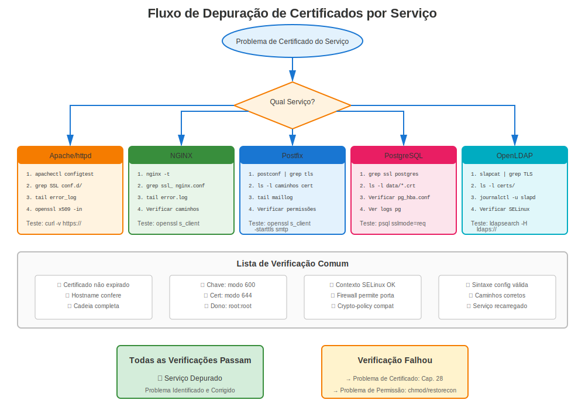

# Capítulo 29: Solução de Problemas Específica por Serviço

> **Serviço por Serviço:** Cada serviço RHEL tem requisitos únicos de certificado e modos de falha. Este capítulo fornece solução de problemas direcionada para cada serviço principal.

---

## 29.1 Solução de Problemas Apache httpd



### Apache Não Inicia

**Passos de Diagnóstico:**
```bash
#============================================#
# SOLUÇÃO DE PROBLEMAS CERTIFICADO APACHE
#============================================#

# Passo 1: Verificar status Apache
systemctl status httpd
sudo journalctl -xe -u httpd

# Passo 2: Testar configuração
sudo apachectl configtest
# Procurar por erros relacionados a SSL

# Passo 3: Verificar se mod_ssl carregado
sudo httpd -M | grep ssl
# Deveria mostrar: ssl_module (shared)

# Passo 4: Verificar arquivos de certificado
ls -l /etc/pki/tls/certs/*.crt
ls -l /etc/pki/tls/private/*.key

# Passo 5: Verificar permissões
ls -l /etc/pki/tls/private/server.key
# Deveria ser: -rw------- (600)

# Passo 6: Verificar coincidência cert/chave
CERT_MOD=$(openssl x509 -noout -modulus -in /etc/pki/tls/certs/server.crt | openssl md5)
KEY_MOD=$(openssl rsa -noout -modulus -in /etc/pki/tls/private/server.key | openssl md5)
[ "$CERT_MOD" = "$KEY_MOD" ] && echo "✅ Coincide" || echo "❌ Desajuste!"

# Passo 7: Verificar SELinux
sudo ausearch -m avc -ts recent | grep httpd | grep cert
```

### Erros SSL Comuns do Apache

| Erro | Causa | Solução |
|------|-------|---------|
| "SSLCertificateFile: file does not exist" | Caminho errado | Corrigir caminho em ssl.conf |
| "key values mismatch" | Cert/chave não pareiam | Regenerar com chave correta |
| "unable to load certificate" | Problema formato arquivo | Garantir formato PEM |
| "Syntax error" em ssl.conf | Erro de digitação config | Executar `apachectl configtest` |
| "unable to verify certificate" | Problema cadeia | Adicionar cert intermediário |

---

## 29.2 Solução de Problemas NGINX

### Problemas SSL/TLS do NGINX

**Passos de Diagnóstico:**
```bash
#============================================#
# SOLUÇÃO DE PROBLEMAS CERTIFICADO NGINX
#============================================#

# Passo 1: Testar configuração
sudo nginx -t

# Passo 2: Mostrar config completa
sudo nginx -T | grep ssl_certificate

# Passo 3: Verificar arquivos de certificado
ls -l /etc/pki/tls/certs/nginx.crt
ls -l /etc/pki/tls/private/nginx.key

# Passo 4: Verificar par cert/chave
openssl x509 -noout -modulus -in /etc/pki/tls/certs/nginx.crt | openssl md5
openssl rsa -noout -modulus -in /etc/pki/tls/private/nginx.key | openssl md5

# Passo 5: Verificar log de erro NGINX
sudo tail -50 /var/log/nginx/error.log | grep -i ssl

# Passo 6: Verificar se NGINX rodando
systemctl status nginx
ss -tlnp | grep nginx
```

### Erros SSL Comuns do NGINX

| Erro | Causa | Solução |
|------|-------|---------|
| "SSL: error:0200100D" | Permissão negada na chave | `chmod 600` na chave |
| "no \"ssl\" is defined" | Faltando ssl em listen | Adicionar `listen 443 ssl;` |
| "cannot load certificate" | Arquivo não encontrado | Verificar caminho |
| "PEM_read_bio:no start line" | Formato errado | Garantir formato PEM |
| "nginx: [emerg] bind() failed" | Porta em uso | Verificar o que está na porta 443 |

---

## 29.3 Solução de Problemas Postfix

### Problemas TLS do Postfix

**Passos de Diagnóstico:**
```bash
#============================================#
# SOLUÇÃO DE PROBLEMAS TLS POSTFIX
#============================================#

# Passo 1: Verificar config TLS Postfix
sudo postconf | grep -i tls

# Passo 2: Ver configurações específicas
sudo postconf smtpd_tls_cert_file smtpd_tls_key_file

# Passo 3: Testar configuração
sudo postfix check

# Passo 4: Verificar arquivos de certificado
ls -l $(sudo postconf -h smtpd_tls_cert_file)
ls -l $(sudo postconf -h smtpd_tls_key_file)

# Passo 5: Testar SMTP TLS
openssl s_client -starttls smtp -connect localhost:25

# Passo 6: Verificar logs de email
sudo tail -f /var/log/maillog | grep -i tls

# Passo 7: Verificar se STARTTLS oferecido
telnet localhost 25
# Digitar: EHLO test
# Deveria mostrar: 250-STARTTLS
```

### Erros TLS Comuns do Postfix

| Erro | Causa | Solução |
|------|-------|---------|
| "SSL_accept error" | Problema cert/chave | Verificar par cert/chave |
| "TLS is required but not available" | TLS não habilitado | Definir security_level = may |
| "no shared cipher" | Desajuste cipher | Verificar crypto-policy |
| "certificate verify failed" | Problema cadeia | Instalar intermediário |
| "Permission denied" | Permissões chave | `chmod 600` na chave |

---

## 29.4 Solução de Problemas OpenLDAP

### Problemas LDAPS

**Passos de Diagnóstico:**
```bash
#============================================#
# SOLUÇÃO DE PROBLEMAS TLS OPENLDAP
#============================================#

# Passo 1: Verificar se slapd escutando na porta 636
ss -tlnp | grep 636

# Passo 2: Verificar configuração TLS
sudo slapcat -b "cn=config" | grep -i tls

# Passo 3: Verificar arquivos de certificado
ls -l /etc/openldap/certs/ldap.{crt,key}

# Passo 4: Verificar propriedade
# CRÍTICO: Deve ser de propriedade do usuário ldap!
ls -l /etc/openldap/certs/
# Deveria mostrar: ldap:ldap

# Passo 5: Testar conexão LDAPS
openssl s_client -connect localhost:636

# Passo 6: Testar com ldapsearch
ldapsearch -H ldaps://localhost:636 -x -b "" -s base

# Passo 7: Verificar logs slapd
sudo journalctl -u slapd | grep -i tls
```

### Erros TLS Comuns do OpenLDAP

| Erro | Causa | Solução |
|------|-------|---------|
| "TLS: can't accept" | Chave não legível | `chown ldap:ldap` na chave |
| "TLS: hostname does not match" | Desajuste CN/SAN | Reemitir com hostname correto |
| "certificate verify failed" | CA não confiável | Adicionar CA ao repositório de confiança |
| "Permission denied" | Propriedade errada | `chown ldap:ldap` |
| "TLS engine not initialized" | TLS não configurado | Adicionar diretivas TLS |

---

## 29.5 Solução de Problemas PostgreSQL

### Problemas SSL do PostgreSQL

**Passos de Diagnóstico:**
```bash
#============================================#
# SOLUÇÃO DE PROBLEMAS SSL POSTGRESQL
#============================================#

# Passo 1: Verificar se SSL habilitado
sudo -u postgres psql -c "SHOW ssl;"

# Passo 2: Ver configurações SSL
sudo -u postgres psql -c "SHOW ssl_cert_file; SHOW ssl_key_file;"

# Passo 3: Verificar arquivos de certificado
ls -l /var/lib/pgsql/data/server.{crt,key}

# Passo 4: Verificar propriedade
# Deve ser de propriedade do usuário postgres
ls -l /var/lib/pgsql/data/server.key
# -rw------- postgres postgres

# Passo 5: Testar conexão SSL
psql "host=localhost sslmode=require"

# Passo 6: Verificar logs PostgreSQL
sudo tail -f /var/lib/pgsql/data/log/postgresql-*.log | grep -i ssl

# Passo 7: Verificar permissões
sudo -u postgres stat /var/lib/pgsql/data/server.key
```

### Erros SSL Comuns do PostgreSQL

| Erro | Causa | Solução |
|------|-------|---------|
| "could not load server certificate" | Permissão negada | `chown postgres:postgres`, `chmod 600` |
| "private key file has wrong permissions" | Muito permissivo | `chmod 600` na chave |
| "SSL connection has been closed unexpectedly" | Problema confiança | Verificar confiança CA do cliente |
| "SSL is not enabled" | SSL desligado na config | Definir `ssl = on` |

---

## 29.6 Solução de Problemas MySQL/MariaDB

### Problemas SSL do Banco de Dados

**Passos de Diagnóstico:**
```bash
#============================================#
# SOLUÇÃO DE PROBLEMAS SSL MYSQL/MARIADB
#============================================#

# Passo 1: Verificar se SSL disponível
mysql -u root -p -e "SHOW VARIABLES LIKE 'have_ssl';"
# Deveria mostrar: YES

# Passo 2: Ver variáveis SSL
mysql -u root -p -e "SHOW VARIABLES LIKE '%ssl%';"

# Passo 3: Verificar arquivos de certificado
ls -l /etc/mysql/certs/{ca,server}.{crt,key}

# Passo 4: Verificar propriedade
# Deve ser legível pelo usuário mysql
ls -l /etc/mysql/certs/
# mysql:mysql

# Passo 5: Testar conexão SSL
mysql --ssl-mode=REQUIRED -h localhost -u root -p

# Passo 6: Verificar status da conexão
mysql -u root -p -e "STATUS" | grep SSL

# Passo 7: Verificar log de erro
sudo tail -f /var/log/mariadb/mariadb.log | grep -i ssl
```

---

## 29.7 Problemas Entre Serviços

### Certificado Funciona em Um Serviço, Falha em Outro

**Cenário:** Mesmo certificado funciona no Apache mas falha no Postfix

**Diagnóstico:**
```bash
# Apache funciona
curl -v https://localhost/
# ✅ OK

# Postfix falha
openssl s_client -starttls smtp -connect localhost:25
# ❌ Erro

# Por quê? Requisitos diferentes!
```

**Causas Comuns:**

**Causa 1: Propriedade de arquivo**
- Apache: Roda como root (pode ler chaves de propriedade root)
- Postfix: Roda como postfix (necessita chave legível)
- OpenLDAP: Roda como ldap (necessita chave de propriedade ldap)

**Causa 2: Localizações de arquivo**
- Apache: /etc/pki/tls/
- PostgreSQL: /var/lib/pgsql/data/
- OpenLDAP: /etc/openldap/certs/

**Causa 3: Requisitos de formato**
- Maioria dos serviços: Arquivos cert e chave separados
- HAProxy: Arquivo PEM combinado
- Cockpit: Cert+chave combinados

---

## 29.8 Kit de Ferramentas de Solução de Problemas

### Comandos de Teste Específicos por Serviço

```bash
#============================================#
# TESTAR CADA SERVIÇO
#============================================#

# Apache HTTPS
curl -v https://localhost/
openssl s_client -connect localhost:443

# NGINX HTTPS
curl -v https://localhost:8443/  # Se porta customizada
openssl s_client -connect localhost:443

# Postfix SMTP
openssl s_client -starttls smtp -connect localhost:25
openssl s_client -connect localhost:465  # SMTPS

# Dovecot IMAP
openssl s_client -connect localhost:993  # IMAPS
openssl s_client -connect localhost:995  # POP3S

# OpenLDAP
openssl s_client -connect localhost:636  # LDAPS
ldapsearch -H ldaps://localhost:636 -x -b ""

# PostgreSQL
psql "host=localhost sslmode=require"

# MySQL/MariaDB
mysql --ssl-mode=REQUIRED -h localhost -u root -p

# Cockpit
openssl s_client -connect localhost:9090
```

---

## 29.9 Conclusões Chave

1. **Cada serviço tem requisitos únicos** - Propriedade, localização, formato
2. **Sempre verificar logs específicos do serviço** primeiro
3. **Testar com comandos específicos do serviço** (não apenas openssl)
4. **Permissões críticas** - Usuários diferentes para serviços diferentes
5. **Localizações de arquivo importam** - Caminhos dependentes do serviço
6. **Sintaxe de configuração** varia por serviço
7. **Referência capítulos de serviços** (Cap 14-21) para config detalhada

---

## Cartão de Referência Rápida

```
┌──────────────────────────────────────────────────────┐
│ SOLUÇÃO DE PROBLEMAS ESPECÍFICO POR SERVIÇO          │
├──────────────────────────────────────────────────────┤
│ Apache:      apachectl configtest                    │
│              tail -f /var/log/httpd/ssl_error_log    │
│                                                      │
│ NGINX:       nginx -t                                │
│              tail -f /var/log/nginx/error.log        │
│                                                      │
│ Postfix:     postfix check                           │
│              tail -f /var/log/maillog | grep TLS     │
│                                                      │
│ OpenLDAP:    slapcat -b "cn=config" | grep TLS       │
│              journalctl -u slapd | grep TLS          │
│              chown ldap:ldap (CRÍTICO!)              │
│                                                      │
│ PostgreSQL:  psql -c "SHOW ssl;"                     │
│              chown postgres:postgres (CRÍTICO!)      │
│                                                      │
│ MySQL:       mysql -e "SHOW VARIABLES LIKE '%ssl%';" │
│              chown mysql:mysql (CRÍTICO!)            │
└──────────────────────────────────────────────────────┘

⚠️ Propriedade de arquivo é específica do serviço!
✅ Sempre verificar logs para cada serviço
```
---

**Navegação do Capítulo**

| [← Anterior: Capítulo 28 - Erros Comuns de Certificados no RHEL](28-common-errors.md) | [Próximo: Capítulo 30 - Solução de Problemas do certmonger →](30-certmonger-issues.md) |
|:---|---:|
