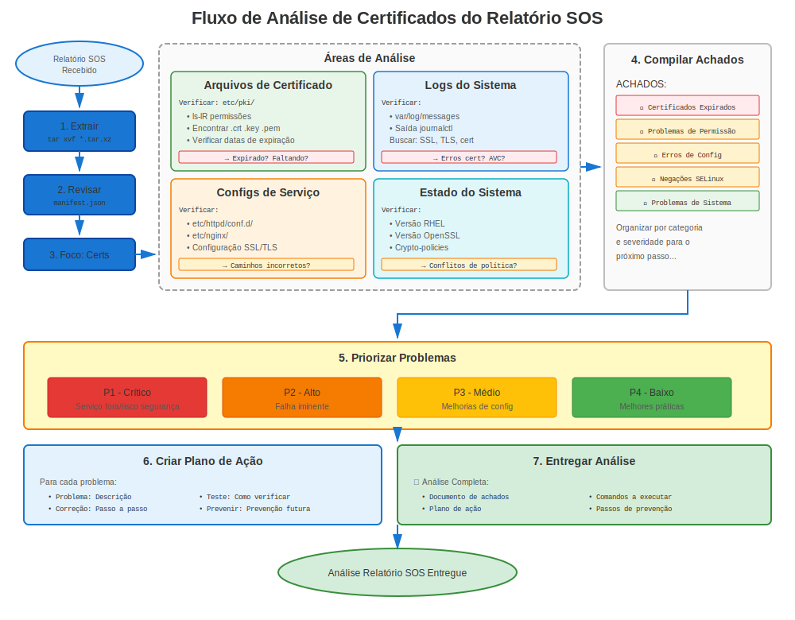

# Capítulo 32: Análise de Relatórios SOS

> **Essencial para Suporte:** Relatórios SOS são a ferramenta de diagnóstico de sistema do RHEL. Aprenda como extrair informações de certificado de relatórios SOS para solução de problemas.

---

## 32.1 O Que é um Relatório SOS?



**sosreport** é a ferramenta de coleta de dados diagnósticos da Red Hat.

**Contém:**
- ✅ Arquivos de configuração do sistema
- ✅ Arquivos de log
- ✅ Saídas de comandos
- ✅ Listas de pacotes
- ✅ Informações de certificado
- ✅ Configurações de segurança
- ❌ Chaves privadas (excluídas por segurança!)

**Casos de Uso:**
- Abrir casos de suporte Red Hat
- Análise pós-incidente
- Auditorias pré-migração
- Verificações de conformidade segurança

---

## 32.2 Gerando um Relatório SOS

### Geração Básica de Relatório SOS

```bash
#============================================#
# GERAR RELATÓRIO SOS
#============================================#

# Instalar sos (usualmente pré-instalado)
sudo dnf install sos -y

# Gerar relatório
sudo sos report

# Prompts interativos:
# - ID do Caso (opcional)
# - Descrição
# - Confirmar

# Saída:
# /var/tmp/sosreport-hostname-YYYYMMDDHHMMSS.tar.xz

# Extrair
tar xf /var/tmp/sosreport-*.tar.xz
cd sosreport-*/
```

### Relatório SOS com Foco em Certificados

```bash
#============================================#
# RELATÓRIO SOS COM FOCO EM CERTIFICADOS
#============================================#

# Gerar com plugins específicos
sudo sos report \
  --batch \
  --enable-plugins crypto,openssl,certmonger,freeipa \
  --case-id "CASE12345"

# Ou especificar o que incluir
sudo sos report \
  --batch \
  -o crypto \
  -o openssl \
  -o certmonger \
  -o pki
```

---

## 32.3 Encontrando Informações de Certificado no SOS

### Localizações Chave no Relatório SOS

```bash
#============================================#
# ARQUIVOS RELACIONADOS A CERTIFICADOS NO RELATÓRIO SOS
#============================================#

# Após extrair sosreport-*.tar.xz:
cd sosreport-*/

# Arquivos de certificado (apenas públicos, sem chaves privadas!)
ls -la etc/pki/tls/certs/
ls -la etc/pki/ca-trust/source/anchors/

# Rastreamento certmonger
cat sos_commands/certmonger/getcert_list

# Versão OpenSSL
cat sos_commands/crypto/openssl_version

# Crypto-policy (RHEL 8+)
cat sos_commands/crypto/update-crypto-policies_--show

# Repositório de confiança
ls -la etc/pki/ca-trust/extracted/

# Configurações de serviços
cat etc/httpd/conf.d/ssl.conf
cat etc/nginx/nginx.conf
cat etc/postfix/main.cf | grep tls

# Verificação expiração certificado
cat sos_commands/crypto/openssl_x509_-in_*

# Info sistema
cat etc/redhat-release
cat sos_commands/kernel/uname_-a
```

---

## 32.4 Analisando Problemas de Certificado do SOS

### Análise de Expiração de Certificado

```bash
#============================================#
# VERIFICAR EXPIRAÇÃO CERTIFICADO NO SOS
#============================================#

# Navegar para diretório relatório SOS
cd sosreport-hostname-*/

# Encontrar todas saídas de inspeção certificado
find sos_commands/crypto/ -name "*x509*" -type f

# Verificar cada certificado
for cert_output in sos_commands/crypto/openssl_x509_*.txt; do
  echo "=== $cert_output ==="
  grep -E "(Subject:|Not After)" "$cert_output"
  echo ""
done

# Ou extrair datas de expiração
grep -r "Not After" sos_commands/crypto/ | sort
```

### Análise de Status certmonger

```bash
#============================================#
# ANALISAR CERTMONGER DO SOS
#============================================#

# Saída lista certmonger
cat sos_commands/certmonger/getcert_list

# Procurar por:
# - status: CA_UNREACHABLE  ← Problema!
# - status: CA_REJECTED     ← Problema!
# - expires: <data>         ← Verificar se em breve

# Contar certificados por status
grep "status:" sos_commands/certmonger/getcert_list | sort | uniq -c

# Encontrar certificados problemáticos
grep -B10 "CA_UNREACHABLE\|CA_REJECTED" sos_commands/certmonger/getcert_list
```

### Análise Crypto-Policy (RHEL 8+)

```bash
#============================================#
# VERIFICAR CRYPTO-POLICY NO SOS
#============================================#

# Política atual
cat sos_commands/crypto/update-crypto-policies_--show

# Verificar por overrides
grep -r "SSLProtocol\|SSLCipherSuite" etc/httpd/
grep -r "ssl_protocols\|ssl_ciphers" etc/nginx/
grep -r "tls_protocols" etc/postfix/main.cf

# Se overrides encontrados: Documentar que serviço opta por sair de crypto-policy
```

---

## 32.5 Descobertas Comuns em Relatórios SOS

### Descoberta 1: Certificados Expirados

**No Relatório SOS:**
```bash
# Verificar expirações de certificados
grep "Not After" sos_commands/crypto/* | \
  while read line; do
    # Analisar e verificar se expirado
    echo "$line"
  done
```

**Sinais de Alerta:**
- Certificados expirados antes de geração relatório SOS
- Certificados expirando dentro de 30 dias
- Múltiplos certificados expirados

### Descoberta 2: Problemas certmonger

**No Relatório SOS:**
```bash
# Verificar status certmonger
cat sos_commands/certmonger/getcert_list | grep -A15 "Request ID"

# Problemas comuns:
# - Múltiplos CA_UNREACHABLE (problema conectividade IPA)
# - CA_REJECTED (problema permissões/principal)
# - Datas expiração antigas sem renovação (certmonger não funcionando)
```

### Descoberta 3: Certificados Intermediários Faltando

**No Relatório SOS:**
```bash
# Verificar cadeia certificado
# Se config serviço aponta para cert sem intermediário:
grep "SSLCertificateFile" etc/httpd/conf.d/ssl.conf
# /etc/pki/tls/certs/server.crt  ← Verificar se isto inclui cadeia

# Verificar certificado real
openssl x509 -in etc/pki/tls/certs/server.crt -noout -text
# Procurar por: Issuer (se não bem conhecido, necessita intermediário)
```

---

## 32.6 Lista de verificação de certificados em relatórios SOS

### Análise Sistemática

```markdown
## Lista de verificação de análise de certificados em relatórios SOS

### Informação Sistema
- [ ] Versão RHEL (`cat etc/redhat-release`)
- [ ] Versão OpenSSL (`cat sos_commands/crypto/openssl_version`)
- [ ] Crypto-policy (`cat sos_commands/crypto/update-crypto-policies*`)
- [ ] Modo FIPS (`grep FIPS sos_commands/crypto/*`)

### Arquivos Certificado
- [ ] Listar certificados (`ls etc/pki/tls/certs/`)
- [ ] Verificar permissões (`ls -la etc/pki/tls/private/`)
- [ ] Verificar propriedade
- [ ] Verificar contextos SELinux (`ls -Z etc/pki/tls/`)

### Validade Certificado
- [ ] Verificar expirações (`grep "Not After" sos_commands/crypto/*`)
- [ ] Identificar certificados expirados
- [ ] Identificar certificados expirando em breve (< 30 dias)
- [ ] Verificar algoritmos assinatura (SHA-1 = problema no RHEL 9+)

### Status certmonger (se usado)
- [ ] certmonger rodando? (`cat sos_commands/systemd/systemctl_list-units`)
- [ ] Certificados rastreados (`cat sos_commands/certmonger/getcert_list`)
- [ ] Algum CA_UNREACHABLE ou CA_REJECTED?
- [ ] Cronograma renovação apropriado?

### Configurações Serviço
- [ ] Config SSL Apache (`cat etc/httpd/conf.d/ssl.conf`)
- [ ] Config SSL NGINX (`cat etc/nginx/nginx.conf`)
- [ ] Config TLS Postfix (`grep tls etc/postfix/main.cf`)
- [ ] Config TLS OpenLDAP
- [ ] Caminhos certificado corretos?

### Repositório de Confiança
- [ ] CAs customizadas (`ls etc/pki/ca-trust/source/anchors/`)
- [ ] Bundle trust atualizado
- [ ] Certs na lista negra (RHEL 8+)

### Logs
- [ ] Erros certificado recentes (`grep -i cert var/log/messages`)
- [ ] Erros SSL/TLS em logs serviço
- [ ] Negações SELinux (`grep AVC var/log/audit/audit.log | grep cert`)

### Recomendações
- [ ] Listar problemas certificado encontrados
- [ ] Priorizar por severidade
- [ ] Sugerir passos de remediação
```

---

## 32.7 Script Análise SOS Automatizada

### Localizador de Problemas de Certificado

```bash
#!/bin/bash
# analyze-sos-certificates.sh
# Detecção automatizada de problemas certificado em relatórios SOS

SOS_DIR=$1

if [ -z "$SOS_DIR" ] || [ ! -d "$SOS_DIR" ]; then
  echo "Uso: $0 /path/to/sosreport-directory"
  exit 1
fi

cd "$SOS_DIR"

echo "=== Análise Certificado Relatório SOS ==="
echo "Relatório: $(basename $SOS_DIR)"
echo ""

# Info sistema
echo "Informação Sistema:"
echo "  Versão RHEL: $(cat etc/redhat-release 2>/dev/null)"
echo "  OpenSSL: $(cat sos_commands/crypto/openssl_version 2>/dev/null | head -2)"
if [ -f sos_commands/crypto/update-crypto-policies_--show ]; then
  echo "  Crypto-Policy: $(cat sos_commands/crypto/update-crypto-policies_--show)"
fi
echo ""

# Expiração certificado
echo "Expiração Certificado:"
if [ -d sos_commands/crypto ]; then
  grep -h "Not After" sos_commands/crypto/openssl_x509_* 2>/dev/null | \
    while read line; do
      echo "  $line"
    done
else
  echo "  Nenhum dado certificado encontrado"
fi
echo ""

# Status certmonger
echo "Status certmonger:"
if [ -f sos_commands/certmonger/getcert_list ]; then
  STATUS_COUNT=$(grep "status:" sos_commands/certmonger/getcert_list | sort | uniq -c)
  echo "$STATUS_COUNT"

  # Destacar problemas
  if grep -q "CA_UNREACHABLE\|CA_REJECTED" sos_commands/certmonger/getcert_list; then
    echo "  ⚠️ Problemas encontrados:"
    grep -B5 "CA_UNREACHABLE\|CA_REJECTED" sos_commands/certmonger/getcert_list | \
      grep -E "(Request ID|status:)" | head -20
  fi
else
  echo "  certmonger não instalado ou sem dados"
fi
echo ""

# Verificar por problemas comuns
echo "Problemas Potenciais:"
ISSUES=0

# Certs expirados (verificação básica)
if grep -q "Not After.*202[0-3]" sos_commands/crypto/* 2>/dev/null; then
  echo "  ⚠️ Certificados potencialmente expirados encontrados"
  ((ISSUES++))
fi

# Problemas certmonger
if grep -q "CA_UNREACHABLE" sos_commands/certmonger/getcert_list 2>/dev/null; then
  echo "  ⚠️ Status CA_UNREACHABLE certmonger encontrado"
  ((ISSUES++))
fi

# Negações SELinux
if grep -q "avc.*denied.*cert" var/log/audit/audit.log 2>/dev/null; then
  echo "  ⚠️ Negações SELinux relacionadas a certificados"
  ((ISSUES++))
fi

if [ $ISSUES -eq 0 ]; then
  echo "  ✅ Nenhum problema óbvio detectado"
fi

echo ""
echo "=== Análise Completa ==="
```

---

## 32.8 Arquivos Chave para Verificar no SOS

### Arquivos Críticos de Certificado

```
sosreport-hostname-YYYYMMDDHHMMSS/
├── etc/
│   ├── pki/
│   │   ├── tls/certs/                     ← Certificados (públicos)
│   │   ├── ca-trust/                      ← Repositório de confiança
│   │   └── nssdb/                         ← Bancos dados NSS
│   ├── httpd/conf.d/ssl.conf              ← Config Apache
│   ├── nginx/nginx.conf                   ← Config NGINX
│   └── postfix/main.cf                    ← Config Postfix
│
├── sos_commands/
│   ├── crypto/
│   │   ├── openssl_version                ← Versão OpenSSL
│   │   ├── openssl_x509_*                 ← Inspeções certificado
│   │   └── update-crypto-policies_--show  ← Política
│   │
│   ├── certmonger/
│   │   └── getcert_list                   ← Status certmonger
│   │
│   ├── systemd/
│   │   └── systemctl_list-units           ← Status serviço
│   │
│   └── networking/
│       └── ss_-tulpn                      ← Portas escutando
│
└── var/log/
    ├── messages                           ← Log sistema
    ├── httpd/ssl_error_log                ← Erros SSL Apache
    └── audit/audit.log                    ← Negações SELinux
```

---

## 32.9 Cenários Comuns de Relatório SOS

### Cenário 1: Website Fora - Problema de Certificado?

**Passos de Análise:**
```bash
# 1. Verificar se httpd estava rodando
grep "httpd.service" sos_commands/systemd/systemctl_list-units
# active (running) ← Serviço estava ligado

# 2. Verificar log erro SSL
tail var/log/httpd/ssl_error_log
# Procurar por erros relacionados a certificados

# 3. Verificar expiração certificado
cat sos_commands/crypto/openssl_x509_*server.crt* | grep "Not After"

# 4. Verificar config Apache
cat etc/httpd/conf.d/ssl.conf | grep -E "SSLCertificate"

# 5. Verificar se arquivos existiam
ls -l etc/pki/tls/certs/ | grep server
```

### Cenário 2: Falhas de Renovação certmonger

**Passos de Análise:**
```bash
# 1. Verificar status certmonger
cat sos_commands/certmonger/getcert_list

# 2. Procurar por CA_UNREACHABLE
grep "CA_UNREACHABLE" sos_commands/certmonger/getcert_list

# 3. Verificar conectividade IPA (se usando FreeIPA)
grep "ipa" var/log/messages | tail -50

# 4. Verificar tickets Kerberos
cat sos_commands/kerberos/klist* 2>/dev/null

# 5. Identificar quando renovação deveria ter acontecido
# Procurar por datas expiração, calcular 2/3 do tempo de vida
```

---

## 32.10 Conclusões Chave

1. **Relatórios SOS são inestimáveis** para solução de problemas remota
2. **Sem chaves privadas incluídas** (segurança!)
3. **Informações certificado SÃO incluídas** (certs públicos, config, logs)
4. **Status certmonger preservado** na saída getcert_list
5. **Crypto-policy registrada** (RHEL 8+)
6. **Usar para análise pós-incidente** e auditorias
7. **Automatizar análise** com scripts

---

## Cartão de Referência Rápida

```
┌──────────────────────────────────────────────────────────────┐
│ ANÁLISE CERTIFICADO RELATÓRIO SOS                            │
├──────────────────────────────────────────────────────────────┤
│ Gerar:           sudo sos report                             │
│ Extrair:         tar xf sosreport-*.tar.xz                   │
│                                                              │
│ Arquivos Chave:  etc/pki/tls/certs/                          │
│                  etc/httpd/conf.d/ssl.conf                   │
│                  sos_commands/certmonger/getcert_list        │
│                  sos_commands/crypto/openssl_version         │
│                  sos_commands/crypto/update-crypto-policies* │
│                  var/log/httpd/ssl_error_log                 │
│                                                              │
│ Verificações comuns:                                         │
│   - Datas expiração certificado                              │
│   - Status certmonger                                        │
│   - Configurações serviço                                    │
│   - Configuração crypto-policy                               │
│   - Negações SELinux                                         │
└──────────────────────────────────────────────────────────────┘

⚠️ Chaves privadas NÃO incluídas (segurança)
✅ Perfeito para solução de problemas remota
```
---

**Navegação do Capítulo**

| [← Anterior: Capítulo 31 - Solução de Problemas Crypto-Policy](31-crypto-policy-issues.md) | [Próximo: Capítulo 33 - Procedimentos de Emergência →](33-emergency-procedures.md) |
|:---|---:|
