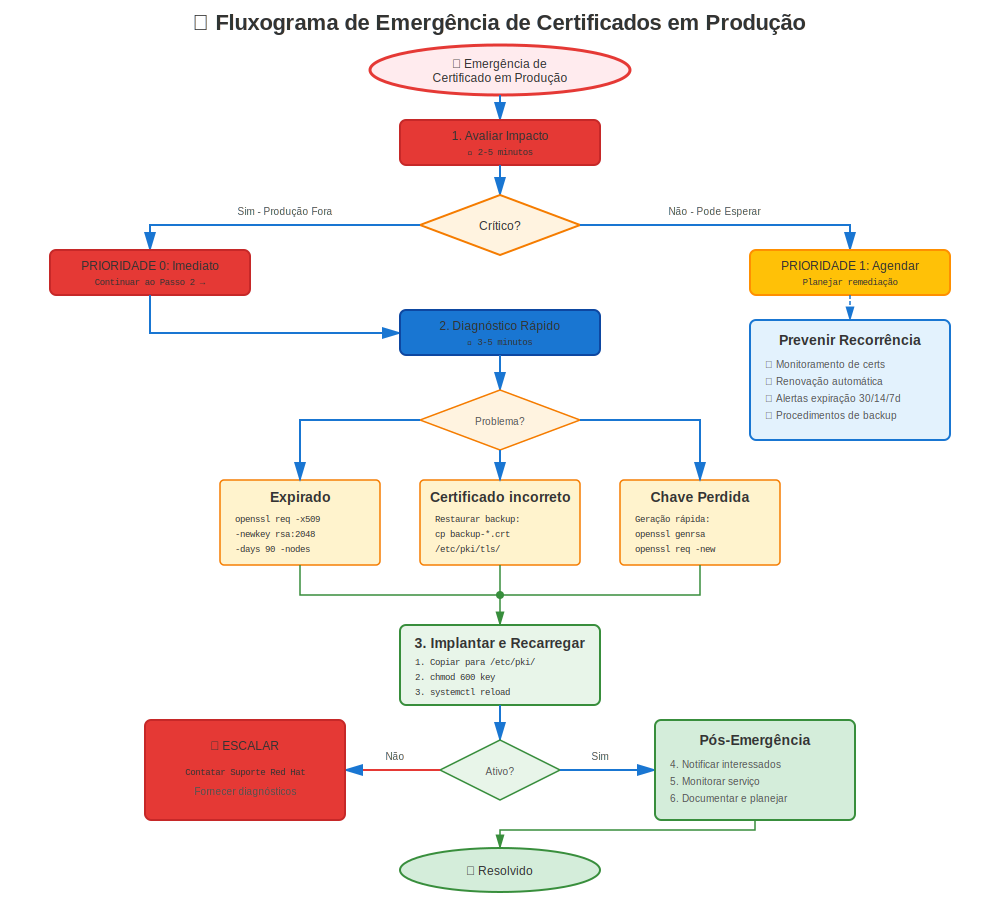

# Capítulo 33: Procedimentos de Emergência

> **Produção Fora do Ar:** Quando certificados quebram e serviços estão offline, você precisa de procedimentos rápidos e confiáveis. Este capítulo é seu manual de emergência.

---

## 33.1 Filosofia de Resposta a Emergências



**Quando produção está fora:**
- ⏰ **Velocidade importa** - Cada minuto conta
- 🎯 **Corrigir primeiro, investigar depois** - Colocar serviços funcionando
- 📝 **Documentar tudo** - Para post-mortem
- 🔄 **Temporário é OK** - Correção apropriada vem após recuperação

**Este capítulo fornece:**
- Procedimentos de diagnóstico rápido
- Soluções alternativas de emergência
- Certificados temporários
- Procedimentos de rollback
- Templates de comunicação

---

## 33.2 Diagnóstico Rápido (Primeiros 60 Segundos)

### Perguntas de Triagem

```bash
#============================================#
# TRIAGEM DE EMERGÊNCIA - 60 SEGUNDOS
#============================================#

# P1: O que está quebrado?
systemctl status httpd nginx postfix

# P2: Quando quebrou?
journalctl -xe --since "10 minutos ago" | grep -i cert

# P3: Certificado expirado?
openssl x509 -in /etc/pki/tls/certs/server.crt -noout -dates

# P4: Mudanças recentes?
rpm -qa --last | head -20        # Atualizações de pacotes recentes
ausearch -m SYSCALL --start recent | grep cert  # Acesso recente a arquivo cert

# P5: Disco cheio?
df -h /etc/pki

# P6: SELinux bloqueando?
ausearch -m avc -ts recent | grep cert
```

### Árvore de Decisão (Primeira Resposta)

```
Problema de Certificado Detectado
    │
    ├─ Serviço não inicia?
    │   ├─ Arquivo não encontrado → Correção Rápida #1: Restaurar do backup
    │   ├─ Permissão negada → Correção Rápida #2: Corrigir permissões
    │   └─ Cert inválido → Correção Rápida #3: Usar cert temporário
    │
    ├─ Certificado expirado?
    │   └─ Correção Rápida #4: Gerar temp autoassinado OU restaurar backup
    │
    ├─ Falha validação de cadeia?
    │   └─ Correção Rápida #5: Adicionar CA faltando OU usar política LEGACY
    │
    └─ Desconhecido/Complexo?
        └─ Escalonar + Aplicar Correção Rápida #6: Rollback para última config boa
```

---

## 33.3 Correção Rápida #1: Restaurar do Backup

**Cenário:** Arquivo de certificado/chave faltando ou corrompido

**Tempo:** 2-5 minutos

```bash
#!/bin/bash
# emergency-restore-cert.sh

SERVICE=$1  # apache, nginx, postfix, etc.
BACKUP_DIR="/var/backups/certificates"

echo "=== EMERGÊNCIA: Restaurando Certificado $SERVICE ==="

# Parar serviço
systemctl stop $SERVICE

# Encontrar backup mais recente
LATEST=$(ls -dt $BACKUP_DIR/*/ | head -2)
echo "Usando backup de: $LATEST"

# Restaurar certificado
if [ -f "$LATEST/${SERVICE}.crt" ]; then
  cp "$LATEST/${SERVICE}.crt" /etc/pki/tls/certs/
  chmod 644 /etc/pki/tls/certs/${SERVICE}.crt
  echo "✅ Certificado restaurado"
else
  echo "❌ Nenhum backup encontrado para $SERVICE"
  exit 1
fi

# Restaurar chave
if [ -f "$LATEST/${SERVICE}.key" ]; then
  cp "$LATEST/${SERVICE}.key" /etc/pki/tls/private/
  chmod 600 /etc/pki/tls/private/${SERVICE}.key
  echo "✅ Chave privada restaurada"
fi

# Iniciar serviço
systemctl start $SERVICE

# Testar
sleep 2
systemctl status $SERVICE

if systemctl is-active --quiet $SERVICE; then
  echo "✅ SUCESSO: $SERVICE está rodando"
  exit 0
else
  echo "❌ FALHOU: $SERVICE não iniciou"
  journalctl -xe -u $SERVICE | tail -20
  exit 1
fi
```

---

## 33.4 Correção Rápida #2: Corrigir Permissões de Emergência

**Cenário:** Serviço falha com "permissão negada" em arquivos de certificado

**Tempo:** 30 segundos

```bash
#!/bin/bash
# emergency-fix-permissions.sh

echo "=== EMERGÊNCIA: Corrigindo Permissões de Certificado ==="

# Corrigir diretório de certificados
chmod 755 /etc/pki/tls/certs/
chmod 644 /etc/pki/tls/certs/*.crt 2>/dev/null

# Corrigir diretório de chaves privadas
chmod 711 /etc/pki/tls/private/
chmod 600 /etc/pki/tls/private/*.key 2>/dev/null

# Corrigir propriedade (ajustar para seu serviço)
chown root:root /etc/pki/tls/certs/*.crt 2>/dev/null
chown root:root /etc/pki/tls/private/*.key 2>/dev/null

# Corrigir contextos SELinux
restorecon -Rv /etc/pki/tls/

echo "✅ Permissões corrigidas"

# Mostrar resultados
echo ""
echo "Permissões de certificados:"
ls -lZ /etc/pki/tls/certs/*.crt 2>/dev/null | head -5

echo ""
echo "Permissões de chaves:"
ls -lZ /etc/pki/tls/private/*.key 2>/dev/null | head -5
```

---

## 33.5 Correção Rápida #3: Gerar Certificado Autoassinado Temporário

**Cenário:** Certificado expirado ou inválido, necessita correção imediata

**Tempo:** 1-2 minutos

**⚠️ AVISO:** Certificados autoassinados causam avisos no navegador! Apenas para uso interno emergencial!

```bash
#!/bin/bash
# emergency-self-signed-cert.sh

HOSTNAME=${1:-$(hostname -f)}
DAYS=${2:-30}
CERT_PATH="/etc/pki/tls/certs/${HOSTNAME}-temp.crt"
KEY_PATH="/etc/pki/tls/private/${HOSTNAME}-temp.key"

echo "=== EMERGÊNCIA: Gerando Certificado Autoassinado Temporário ==="
echo "Hostname: $HOSTNAME"
echo "Válido por: $DAYS dias"

# Gerar certificado autoassinado
openssl req -x509 -nodes -days $DAYS \
  -newkey rsa:2048 \
  -keyout "$KEY_PATH" \
  -out "$CERT_PATH" \
  -subj "/C=US/ST=Emergency/L=Emergency/O=Emergency/CN=$HOSTNAME" \
  -addext "subjectAltName=DNS:$HOSTNAME,DNS:$(hostname -s)"

if [ $? -eq 0 ]; then
  # Definir permissões
  chmod 600 "$KEY_PATH"
  chmod 644 "$CERT_PATH"

  echo "✅ Certificado temporário gerado"
  echo "   Certificado: $CERT_PATH"
  echo "   Chave: $KEY_PATH"
  echo ""
  echo "⚠️ CRÍTICO: Esta é uma correção TEMPORÁRIA!"
  echo "   - Solicite certificado apropriado imediatamente"
  echo "   - Documente esta ação emergencial"
  echo "   - Planeje substituição apropriada dentro de $DAYS dias"
  echo ""
  echo "Para usar com Apache:"
  echo "  SSLCertificateFile $CERT_PATH"
  echo "  SSLCertificateKeyFile $KEY_PATH"

  # Mostrar certificado
  openssl x509 -in "$CERT_PATH" -noout -text | grep -E "(Subject:|Not After)"
else
  echo "❌ FALHOU ao gerar certificado"
  exit 1
fi
```

---

## 33.6 Correção Rápida #4: Renovação de Certificado de Emergência

**Cenário:** Certificado expirado, necessita renovação apropriada ASAP

**Tempo:** 5-15 minutos (depende da CA)

```bash
#!/bin/bash
# emergency-renew-cert.sh

CERT_PATH=$1
KEY_PATH=$2
HOSTNAME=$3

echo "=== EMERGÊNCIA: Renovando Certificado Expirado ==="

# Gerar novo CSR
CSR_PATH="/tmp/emergency-$(date +%s).csr"

openssl req -new -key "$KEY_PATH" -out "$CSR_PATH" \
  -subj "/CN=$HOSTNAME" \
  -addext "subjectAltName=DNS:$HOSTNAME"

if [ $? -eq 0 ]; then
  echo "✅ CSR gerado: $CSR_PATH"
  echo ""
  echo "PRÓXIMOS PASSOS:"
  echo "1. Submeta CSR para CA imediatamente:"
  echo "   cat $CSR_PATH"
  echo ""
  echo "2. Enquanto aguarda CA:"
  echo "   - Use cert autoassinado temporário (veja Correção Rápida #3)"
  echo "   - Ou restaure do backup (veja Correção Rápida #1)"
  echo ""
  echo "3. Quando CA retornar certificado:"
  echo "   cp new-cert.crt $CERT_PATH"
  echo "   systemctl reload <serviço>"

  # Se usando FreeIPA
  if command -v ipa-getcert &>/dev/null; then
    echo ""
    echo "4. Se usando FreeIPA, tente renovação automática:"
    echo "   sudo ipa-getcert resubmit -f $CERT_PATH"
  fi
else
  echo "❌ FALHOU ao gerar CSR"
  exit 1
fi
```

---

## 33.7 Correção Rápida #5: Emergência de Cadeia de Confiança

**Cenário:** Erro "Unable to get local issuer certificate"

**Tempo:** 1-2 minutos

```bash
#!/bin/bash
# emergency-fix-trust.sh

CA_CERT=$1  # Caminho para certificado CA

if [ -z "$CA_CERT" ] || [ ! -f "$CA_CERT" ]; then
  echo "❌ Uso: $0 /path/to/ca-cert.crt"
  exit 1
fi

echo "=== EMERGÊNCIA: Adicionando CA ao Repositório de Confiança ==="

# Copiar CA para trust anchors
cp "$CA_CERT" /etc/pki/ca-trust/source/anchors/

# Atualizar repositório de confiança
update-ca-trust extract

echo "✅ CA adicionada ao repositório de confiança do sistema"

# Verificar
if trust list | grep -q "$(basename "$CA_CERT" .crt)"; then
  echo "✅ VERIFICADO: CA agora é confiável"
else
  echo "⚠️ Aviso: Não foi possível verificar que CA foi adicionada"
fi

# Testar validação de certificado
echo ""
echo "Teste seu certificado agora:"
echo "  openssl verify /path/to/your/cert.crt"
```

**Alternativa: Política LEGACY Temporária (RHEL 8+)**

```bash
# Se problema de confiança é devido a algoritmos fracos
# TEMPORÁRIO - reverter após correção apropriada!

echo "=== EMERGÊNCIA: Definindo Política de Crypto LEGACY ==="
update-crypto-policies --show  # Salvar atual
sudo update-crypto-policies --set LEGACY
systemctl restart <serviço>

echo "⚠️ CRÍTICO: Isto é temporário!"
echo "Correção apropriada requerida dentro de 24 horas"
```

---

## 33.8 Correção Rápida #6: Rollback para Última Configuração Boa

**Cenário:** Mudança recente quebrou tudo, necessita reverter

**Tempo:** 2-5 minutos

```bash
#!/bin/bash
# emergency-rollback.sh

echo "=== EMERGÊNCIA: Fazendo Rollback para Última Configuração Boa ==="

# Parar serviço
systemctl stop httpd

# Backup do estado atual (quebrado)
TIMESTAMP=$(date +%Y%m%d-%H%M%S)
mkdir -p /var/backups/emergency/$TIMESTAMP
cp -a /etc/pki/tls/certs/*.crt /var/backups/emergency/$TIMESTAMP/ 2>/dev/null
cp -a /etc/pki/tls/private/*.key /var/backups/emergency/$TIMESTAMP/ 2>/dev/null
cp -a /etc/httpd/conf.d/ssl.conf /var/backups/emergency/$TIMESTAMP/ 2>/dev/null

# Restaurar do último backup
LAST_GOOD="/var/backups/certificates/last-known-good"
if [ -d "$LAST_GOOD" ]; then
  cp -a "$LAST_GOOD"/*.crt /etc/pki/tls/certs/
  cp -a "$LAST_GOOD"/*.key /etc/pki/tls/private/
  cp -a "$LAST_GOOD"/ssl.conf /etc/httpd/conf.d/ 2>/dev/null

  # Corrigir permissões
  chmod 644 /etc/pki/tls/certs/*.crt
  chmod 600 /etc/pki/tls/private/*.key

  echo "✅ Rollback para última configuração boa feito"
else
  echo "❌ Nenhum backup last-known-good encontrado!"
  echo "Procurando por qualquer backup recente..."
  ls -ldt /var/backups/certificates/*/ | head -5
  exit 1
fi

# Iniciar serviço
systemctl start httpd

# Verificar
sleep 2
if systemctl is-active --quiet httpd; then
  echo "✅ SUCESSO: Serviço restaurado"
else
  echo "❌ Serviço ainda não está iniciando"
  journalctl -xe -u httpd | tail -20
  exit 1
fi
```

---

## 33.9 Procedimentos de Emergência Específicos por Serviço

### Recuperação de Emergência Apache (httpd)

```bash
#============================================#
# RECUPERAÇÃO DE EMERGÊNCIA APACHE
#============================================#

# 1. Parar Apache
systemctl stop httpd

# 2. Verificar sintaxe de configuração
apachectl configtest
# Se falhar, corrigir ou restaurar ssl.conf do backup

# 3. Verificar se arquivos de certificado existem
ls -l /etc/pki/tls/certs/server.crt
ls -l /etc/pki/tls/private/server.key

# 4. Emergência: Desabilitar SSL temporariamente
mv /etc/httpd/conf.d/ssl.conf /etc/httpd/conf.d/ssl.conf.disabled
systemctl start httpd
# Serviço agora roda apenas em HTTP (porta 80)

# 5. Corrigir certificados, então re-habilitar SSL
mv /etc/httpd/conf.d/ssl.conf.disabled /etc/httpd/conf.d/ssl.conf
systemctl reload httpd
```

### Recuperação de Emergência NGINX

```bash
#============================================#
# RECUPERAÇÃO DE EMERGÊNCIA NGINX
#============================================#

# 1. Parar NGINX
systemctl stop nginx

# 2. Testar configuração
nginx -t
# Se falhar, verificar qual linha/arquivo tem problema

# 3. Emergência: Comentar config SSL
sed -i 's/^\(\s*ssl_certificate\)/# \1/' /etc/nginx/nginx.conf
sed -i 's/^\(\s*listen.*443\)/# \1/' /etc/nginx/nginx.conf
sed -i 's/^\(\s*listen.*ssl\)/# \1/' /etc/nginx/nginx.conf

# 4. Iniciar apenas em HTTP
systemctl start nginx

# 5. Corrigir certificados, restaurar config SSL
# Descomentar linhas ou restaurar do backup
systemctl reload nginx
```

### Emergência certmonger

```bash
#============================================#
# RECUPERAÇÃO DE EMERGÊNCIA CERTMONGER
#============================================#

# 1. Verificar status certmonger
systemctl status certmonger
getcert list

# 2. Se cert mostra CA_UNREACHABLE
# Verificar conectividade IPA
ipa ping

# 3. Emergência: Parar rastreamento, renovação manual
REQUEST_ID=$(getcert list | grep "Request ID" | head -1 | awk -F"'" '{print $2}')
getcert stop-tracking -i $REQUEST_ID

# 4. Renovação manual com IPA
ipa-getcert request -f /etc/pki/tls/certs/server.crt \
  -k /etc/pki/tls/private/server.key \
  -D $(hostname -f) \
  -K host/$(hostname -f)@REALM

# 5. Se IPA indisponível, usar autoassinado temporário
./emergency-self-signed-cert.sh
```

---

## 33.10 Templates de Comunicação

### Notificação de Incidente (Interno)

```
Assunto: [URGENTE] Problema de Certificado - <Serviço> Fora do Ar

RESUMO DO INCIDENTE:
- Serviço: <Apache/NGINX/etc>
- Impacto: Site <Produção/Staging> fora do ar
- Iniciado: <Horário>
- Status: Investigando / Aplicando correção / Resolvido

CAUSA RAIZ:
- Certificado expirou em <Data>
- OU: Permissões de arquivo de certificado incorretas
- OU: Cadeia de confiança CA faltando

AÇÃO IMEDIATA TOMADA:
- Certificado autoassinado temporário aplicado
- Serviço restaurado em <Horário>

PRÓXIMOS PASSOS:
- Solicitar certificado apropriado da CA
- Substituir cert temporário até <Data/Horário>
- Post-mortem agendado para <Data>

WORKAROUND:
- Usuários podem ver avisos de segurança (esperado)
- Serviço está funcional apesar dos avisos
```

### Comunicação com Cliente (Externo)

```
Assunto: Restauração de Serviço - Breve Interrupção

Prezados Clientes,

Experimentamos uma breve interrupção de serviço entre <Horário Início> e
<Horário Fim> devido a um problema de configuração de certificado. O serviço foi
totalmente restaurado.

Você pode notar um aviso de segurança temporário. Isto é esperado e
seguro para prosseguir. Estamos trabalhando para substituir o certificado temporário
por um permanente dentro das próximas horas.

Pedimos desculpas por qualquer inconveniente.

Atualizações de status: <URL>
Suporte: <Email/Telefone>
```

---

## 33.11 Lista de verificação pós-emergência

Após recuperação de emergência:

```markdown
## Lista de verificação pós-emergência

### Imediato (Dentro de 1 Hora)
- [ ] Serviço confirmado rodando
- [ ] Monitoramento restaurado
- [ ] Stakeholders notificados
- [ ] Correção temporária documentada

### Curto-Prazo (Dentro de 24 Horas)
- [ ] Certificado apropriado obtido
- [ ] Cert temporário substituído
- [ ] Configuração validada
- [ ] Backups verificados funcionando

### Follow-Up (Dentro de 1 Semana)
- [ ] Análise de causa raiz completada
- [ ] Documento de post-mortem criado
- [ ] Medidas de prevenção identificadas
- [ ] Monitoramento/alertas melhorados
- [ ] Documentação atualizada
- [ ] Time debriefed

### Prevenção
- [ ] Adicionar monitoramento para este cenário
- [ ] Atualizar runbooks
- [ ] Agendar renovações mais cedo
- [ ] Automatizar se possível
- [ ] Testar procedimentos de recuperação
```

---

## 33.12 Contatos e Recursos de Emergência

### Mantenha Isto à Mão

```markdown
## Cartão de Resposta a Emergência de Certificado

### Comandos Rápidos
openssl x509 -in cert.crt -noout -dates      # Verificar expiração
systemctl status <serviço>                    # Status do serviço
journalctl -xe -u <serviço>                   # Logs recentes
getcert list                                  # Status certmonger

### Localização Scripts Emergência
/usr/local/bin/emergency-*.sh

### Localização Backup
/var/backups/certificates/

### Última Configuração Boa
/var/backups/certificates/last-known-good/

### Informações CA
URL CA: <URL>
Contato CA: <Email/Telefone>
Servidor FreeIPA: <Hostname>

### Escalação
Líder de Time: <Nome> <Telefone>
Gerente: <Nome> <Telefone>
Plantão: <Pager/Telefone>

### Documentação
Runbooks: <URL Wiki>
Incidentes Anteriores: <Sistema de Tickets>
```

---

## 33.13 Playbook de Cenários de Emergência

### Cenário 1: Certificado Expirado (Produção Fora do Ar)

**Impacto:** ALTO - Serviço indisponível
**Pressão de Tempo:** Crítica
**Resposta:**

1. **Avaliar (30 segundos)**
   ```bash
   openssl x509 -in /etc/pki/tls/certs/server.crt -noout -dates
   ```

2. **Correção Rápida (2 minutos)**
   ```bash
   ./emergency-autoassinado-cert.sh $(hostname -f) 30
   # Atualizar config do serviço para usar cert temp
   systemctl restart <serviço>
   ```

3. **Comunicar (5 minutos)**
   - Notificar stakeholders
   - Atualizar página de status

4. **Correção Apropriada (15-60 minutos)**
   ```bash
   # Solicitar novo cert da CA
   # OU usar certmonger
   ipa-getcert resubmit -f /etc/pki/tls/certs/server.crt
   ```

5. **Substituir cert temp, verificar, documentar**

### Cenário 2: Certificado Errado Implantado

**Impacto:** MÉDIO - Serviço funcionando mas com erros
**Pressão de Tempo:** Moderada
**Resposta:**

1. **Parar sangria** - Rollback
   ```bash
   ./emergency-rollback.sh
   ```

2. **Verificar serviço restaurado**

3. **Identificar certificado correto**

4. **Implantar cert correto com validação**

5. **Documentar o que deu errado**

### Cenário 3: Servidor CA Fora do Ar (Não Pode Renovar)

**Impacto:** MÉDIO - Renovações futuras bloqueadas
**Pressão de Tempo:** Depende da expiração do cert
**Resposta:**

1. **Verificar timeline de expiração do cert**
   ```bash
   openssl x509 -in cert.crt -noout -checkend $((86400*7))
   ```

2. **Se > 7 dias:** Aguardar recuperação da CA, monitorar

3. **Se < 7 dias:**
   - Gerar autoassinado temporário
   - Contatar suporte CA
   - Escalonar para gerência

4. **Alternativa:** Usar CA diferente temporariamente

### Cenário 4: SELinux Bloqueando Certificados

**Impacto:** BAIXO-MÉDIO - Serviço não inicia
**Pressão de Tempo:** Moderada
**Resposta:**

1. **Verificar negações**
   ```bash
   ausearch -m avc -ts recent | grep cert
   ```

2. **Correção rápida - Relabeling**
   ```bash
   restorecon -Rv /etc/pki/tls/
   ```

3. **Se persistir - Permissive temporário**
   ```bash
   setenforce 0  # TEMPORÁRIO!
   systemctl restart <serviço>
   ```

4. **Correção apropriada - Gerar política**
   ```bash
   audit2allow -a -M mycert
   semodule -i mycert.pp
   setenforce 1
   ```

---

## 33.14 Kit de Ferramentas de Emergência

### Criar Kit de Resposta a Emergência

```bash
#!/bin/bash
# create-emergency-kit.sh
# Cria um kit portátil de resposta a emergências

KIT_DIR="/root/cert-emergency-kit"
mkdir -p "$KIT_DIR"

# Copiar scripts de emergência
cp emergency-*.sh "$KIT_DIR/"

# Criar referência rápida
cat > "$KIT_DIR/QUICK_REFERENCE.txt" << 'EOF'
=== REFERÊNCIA RÁPIDA EMERGÊNCIA CERTIFICADO ===

1. VERIFICAR STATUS
   systemctl status <serviço>
   openssl x509 -in cert.crt -noout -dates

2. CERT EXPIRADO
   ./emergency-self-signed-cert.sh $(hostname -f)

3. ARQUIVOS FALTANDO
   ./emergency-restore-cert.sh <serviço>

4. PERMISSÕES
   ./emergency-fix-permissions.sh

5. ROLLBACK
   ./emergency-rollback.sh

6. LOGS
   journalctl -xe -u <serviço>
   tail -f /var/log/httpd/ssl_error_log

===========================
Última Atualização: $(date)
EOF

# Definir permissões
chmod 700 "$KIT_DIR"
chmod 755 "$KIT_DIR"/*.sh

echo "✅ Kit de emergência criado: $KIT_DIR"
ls -lh "$KIT_DIR"
```

---

## 33.15 Conclusões Chave

1. **Velocidade sobre perfeição** em emergências
2. **Correções temporárias são OK** - Corrigir apropriadamente depois
3. **Comunicação é crítica** - Manter stakeholders informados
4. **Documentar tudo** - Para post-mortem
5. **Praticar procedimentos emergência** - Não esperar incidente real
6. **Ter backups prontos** - Testá-los regularmente
7. **Conhecer sua rota de escalação** - Quando pedir ajuda
8. **Post-mortem é obrigatório** - Aprender e melhorar

---

## Cartão de Referência Rápida

```
┌───────────────────────────────────────────────────────────────┐
│ RESPOSTA A EMERGÊNCIA DE CERTIFICADO                          │
├───────────────────────────────────────────────────────────────┤
│ CERT EXPIRADO:    ./emergency-self-signed-cert.sh $(hostname) │
│ ARQUIVO FALTA:    ./emergency-restore-cert.sh <serviço>       │
│ PERMISSÕES:       ./emergency-fix-permissions.sh              │
│ PROB CONFIANÇA:   ./emergency-fix-trust.sh /path/to/ca.crt    │
│ ROLLBACK:         ./emergency-rollback.sh                     │
│                                                               │
│ DESABILITAR SSL:  mv ssl.conf ssl.conf.disabled               │
│                   systemctl restart <serviço>                 │
│                                                               │
│ VER EXPIRAÇÃO:    openssl x509 -in cert.crt -noout -dates     │
│ LOGS SERVIÇO:     journalctl -xe -u <serviço>                 │
└───────────────────────────────────────────────────────────────┘

⚠️ LEMBRAR: Corrigir primeiro, investigar depois!
```

---

## 🧪 Laboratório Prático

**Lab 16: Procedimentos de Emergência**

Aprenda técnicas rápidas de recuperação de certificados para emergências em produção

- 📁 **Localização:** `labs/pt_BR/16-emergency-procedures/`
- ⏱️ **Tempo:** 30-40 minutos
- 🎯 **Nível:** Avançado

---

**Navegação do Capítulo**

| [← Anterior: Capítulo 32 - Análise de Relatórios SOS](32-sos-report-analysis.md) | [Próximo: Capítulo 34 - Planejamento e Preparação de Migração RHEL →](../part-06-migration/34-migration-planning.md) |
|:---|---:|
