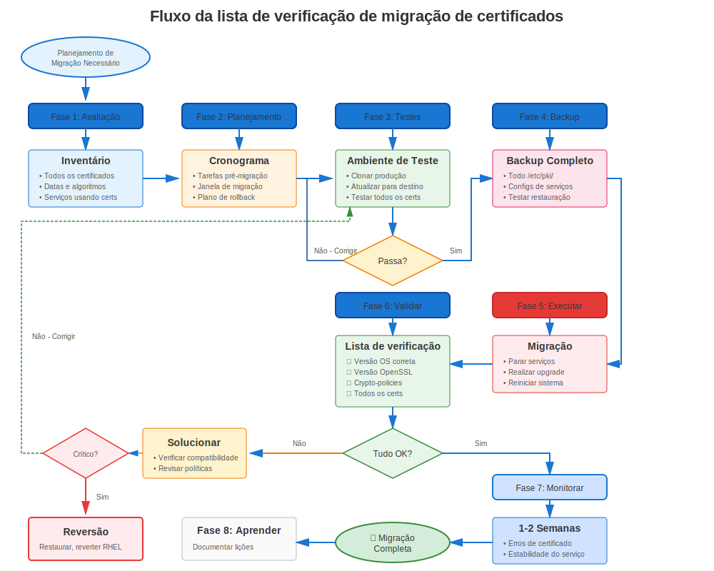

# Capítulo 34: Planejamento e Preparação de Migração RHEL

> **Planejar para Sucesso:** Migrações RHEL requerem planejamento certificado cuidadoso. Aprenda como auditar, preparar e planejar migração certificado para evitar interrupções.

---

## 34.1 Por que o planejamento de certificados importa



**Sem Planejamento:**
```
❌ Atualizar RHEL → Certificados falham validação
❌ Serviços não iniciam
❌ Interrupção produção
❌ Rollback requerido
❌ Migração falhada
```

**Com Planejamento:**
```
✅ Pré-auditoria identifica problemas
✅ Certificados preparados com antecedência
✅ Migração teste bem-sucedida
✅ Migração produção suave
✅ Sem interrupções relacionadas certificado
```

---

## 34.2 Auditoria de certificados pré-migração

### Inventário Certificado Completo

```bash
#!/bin/bash
# pre-migration-cert-audit.sh
# Auditoria certificado completa antes migração RHEL

echo "=== Auditoria de certificados pré-migração ==="
echo "Sistema: $(hostname)"
echo "RHEL Atual: $(cat /etc/redhat-release)"
echo "Data: $(date)"
echo ""

# Encontrar todos certificados
echo "=== Inventário Certificados ==="
find /etc/pki/tls/certs/ /etc/httpd/ /etc/nginx/ /etc/postfix/ /etc/openldap/ \
  -name "*.crt" -o -name "*.pem" 2>/dev/null | \
  while read cert; do
    if openssl x509 -in "$cert" -noout 2>/dev/null; then
      echo "Certificado: $cert"
      echo "  Subject: $(openssl x509 -in "$cert" -noout -subject)"
      echo "  Emissor: $(openssl x509 -in "$cert" -noout -issuer)"
      echo "  Expira: $(openssl x509 -in "$cert" -noout -enddate | cut -d= -f2)"

      # Verificar algoritmo assinatura
      SIG_ALG=$(openssl x509 -in "$cert" -noout -text | grep "Signature Algorithm" | head -2)
      echo "  Assinatura: $SIG_ALG"

      # Verificar tamanho chave
      KEY_SIZE=$(openssl x509 -in "$cert" -noout -text | grep "Public-Key" | grep -oP '\d+')
      echo "  Tamanho Chave: $KEY_SIZE bits"

      # Marcar problemas
      if echo "$SIG_ALG" | grep -qi "sha1"; then
        echo "  ⚠️ AVISO: Assinatura SHA-1 (falhará no RHEL 9+)"
      fi

      if [ "$KEY_SIZE" -lt 2048 ]; then
        echo "  ⚠️ AVISO: Chave < 2048 bits (pode falhar no RHEL 8+)"
      fi

      if ! openssl x509 -in "$cert" -noout -ext subjectAltName 2>/dev/null | grep -q "DNS:"; then
        echo "  ⚠️ AVISO: Certificato não possui SAN"
      fi

      # Verificar expiração
      if ! openssl x509 -in "$cert" -noout -checkend $((86400*90)); then
        echo "  ⚠️ AVISO: Expira dentro de 90 dias"
      fi

      echo ""
    fi
  done

# Rastreamento certmonger
echo "=== Certificados Rastreados certmonger ==="
if command -v getcert &>/dev/null; then
  sudo getcert list | grep -E "(Request ID|certificate:|status:)"
else
  echo "certmonger não instalado"
fi

# CAs customizadas
echo ""
echo "=== CAs Customizadas em Repositório de Confiança ==="
ls -la /etc/pki/ca-trust/source/anchors/

# Configurações serviço
echo ""
echo "=== Configurações Certificado Serviço ==="
echo "Apache:"
grep -h "SSLCertificate" /etc/httpd/conf.d/*.conf 2>/dev/null | grep -v "^#"

echo ""
echo "NGINX:"
grep -rh "ssl_certificate" /etc/nginx/ 2>/dev/null | grep -v "^#"

echo ""
echo "Postfix:"
sudo postconf | grep -E "smtpd_tls_cert|smtp_tls_cert"

echo ""
echo "=== Auditoria Completa ==="
echo "Salve esta saída para referência migração!"
```

---

## 34.3 Problemas de certificados a corrigir antes da migração

### Correções Pré-Migração Críticas

**Correção 1: Assinaturas SHA-1 (RHEL 8→9)**
```bash
# Encontrar certificados assinados SHA-1
for cert in /etc/pki/tls/certs/*.crt; do
  if openssl x509 -in "$cert" -noout -text 2>/dev/null | \
     grep -qi "Signature Algorithm.*sha1"; then
    echo "⚠️ SHA-1: $cert"
  fi
done

# Ação: Reemitir TODOS certificados SHA-1 antes migrar para RHEL 9
```

**Correção 2: Chaves Pequenas (< 2048 bits)**
```bash
# Encontrar chaves pequenas
for cert in /etc/pki/tls/certs/*.crt; do
  SIZE=$(openssl x509 -in "$cert" -noout -text 2>/dev/null | \
         grep "Public-Key" | grep -oP '\d+')
  if [ "$SIZE" -lt 2048 ] 2>/dev/null; then
    echo "⚠️ Chave pequena ($SIZE): $cert"
  fi
done

# Ação: Reemitir com chaves 2048+ bits
```

**Correção 3: SANs Faltando**
```bash
# Encontrar certificados sem SANs
for cert in /etc/pki/tls/certs/*.crt; do
  if ! openssl x509 -in "$cert" -noout -ext subjectAltName 2>/dev/null | grep -q "DNS:"; then
    echo "⚠️ Sem SANs: $cert"
  fi
done

# Ação: Reemitir com SANs apropriados (requerido para navegadores modernos)
```

**Correção 4: Expirando Em Breve**
```bash
# Encontrar certificados expirando dentro janela migração
for cert in /etc/pki/tls/certs/*.crt; do
  if ! openssl x509 -in "$cert" -noout -checkend $((86400*90)) 2>/dev/null; then
    echo "⚠️ Expirando em breve: $cert"
    openssl x509 -in "$cert" -noout -enddate
  fi
done

# Ação: Renovar antes migração para evitar expiração meio-migração
```

---

## 34.4 Estratégia Backup

### O Que Fazer Backup

```bash
#============================================#
# BACKUP CERTIFICADO PRÉ-MIGRAÇÃO
#============================================#

BACKUP_DIR="/var/backups/pre-migration-$(date +%Y%m%d)"
mkdir -p "$BACKUP_DIR"

# Backup certificados e chaves
sudo tar czf "$BACKUP_DIR/certificates.tar.gz" \
  /etc/pki/tls/ \
  /etc/pki/ca-trust/source/anchors/ \
  /etc/pki/nssdb/

# Backup configurações serviço
sudo tar czf "$BACKUP_DIR/service-configs.tar.gz" \
  /etc/httpd/conf.d/*.conf \
  /etc/nginx/nginx.conf \
  /etc/nginx/conf.d/ \
  /etc/postfix/main.cf \
  /etc/openldap/ \
  /var/lib/pgsql/data/postgresql.conf \
  /var/lib/pgsql/data/pg_hba.conf \
  2>/dev/null

# Backup banco dados certmonger
sudo tar czf "$BACKUP_DIR/certmonger.tar.gz" \
  /var/lib/certmonger/

# Salvar lista certmonger
sudo getcert list > "$BACKUP_DIR/certmonger-list.txt" 2>/dev/null

# Salvar crypto-policy (RHEL 8+)
update-crypto-policies --show > "$BACKUP_DIR/crypto-policy.txt" 2>/dev/null

# Criar inventário CSV
./pre-migration-cert-audit.sh > "$BACKUP_DIR/certificate-inventory.txt"

# Definir permissões
sudo chmod 700 "$BACKUP_DIR"

echo "✅ Backup completo: $BACKUP_DIR"
ls -lh "$BACKUP_DIR"
```

---

## 34.5 Plano Teste

### Configuração Ambiente Teste

```markdown
## Lista de verificação de teste de migração

### Ambiente Teste
- [ ] Clonar produção para VM/container teste
- [ ] Mesma versão RHEL que produção
- [ ] Mesmos certificados (cópias, não originais!)
- [ ] Mesmas configurações serviço
- [ ] Rede isolada de produção

### Teste Migração
- [ ] Executar migração em sistema teste
- [ ] Verificar todos serviços iniciam
- [ ] Testar validação certificado
- [ ] Verificar crypto-policy (RHEL 7→8/9)
- [ ] Testar conexões cliente
- [ ] Verificar rastreamento certmonger (se usado)
- [ ] Documentar quaisquer problemas

### Solução de Problemas
- [ ] Corrigir problemas encontrados em teste
- [ ] Atualizar plano migração
- [ ] Re-testar
- [ ] Documentar workarounds

### Prontidão Produção
- [ ] Migração teste bem-sucedida
- [ ] Problemas documentados e resolvidos
- [ ] Plano rollback pronto
- [ ] Time treinado
- [ ] Janela manutenção agendada
```

---

## 34.6 Timeline Migração

### Cronograma Migração Exemplo

```
Semana 1-2: Planejamento e Auditoria
├─ Completar inventário certificados
├─ Identificar problemas (SHA-1, chaves pequenas, etc.)
├─ Planejar remediação
└─ Configurar ambiente teste

Semana 3-4: Remediação
├─ Reemitir certificados problemáticos
├─ Atualizar configurações
├─ Testar em ambiente atual
└─ Verificar automatização funciona

Semana 5-6: Teste
├─ Clonar produção para teste
├─ Executar migração teste
├─ Validar certificados pós-migração
├─ Documentar problemas e correções
└─ Atualizar runbook migração

Semana 7: Preparação Pré-Migração
├─ Auditoria certificado final
├─ Renovar certificados expirando
├─ Completar backups
├─ Briefar time
└─ Verificar plano rollback

Semana 8: Migração
├─ Janela manutenção
├─ Executar migração
├─ Validar certificados
├─ Monitorar por 24-48 horas
└─ Documentar lições aprendidas
```

---

## 34.7 Planejamento Rollback

### Procedimento Rollback Certificado

```bash
#============================================#
# PLANO ROLLBACK CERTIFICADO
#============================================#

# Se migração falhar devido problemas certificado:

# Passo 1: Rollback RHEL (usando leapp ou snapshots)
# Ver documentação migração RHEL

# Passo 2: Restaurar certificados (se necessário)
sudo tar xzf /var/backups/pre-migration-YYYYMMDD/certificates.tar.gz -C /

# Passo 3: Restaurar configs serviço
sudo tar xzf /var/backups/pre-migration-YYYYMMDD/service-configs.tar.gz -C /

# Passo 4: Restaurar certmonger
sudo tar xzf /var/backups/pre-migration-YYYYMMDD/certmonger.tar.gz -C /

# Passo 5: Reiniciar serviços
sudo systemctl restart httpd nginx postfix slapd

# Passo 6: Verificar
curl -v https://localhost/
sudo getcert list
```

---

## 34.8 Plano Comunicação

### Template Comunicação Stakeholder

```markdown
## Migração RHEL - Avaliação Impacto Certificado

### Detalhes Migração
- **De:** RHEL X.Y
- **Para:** RHEL X.Y
- **Data:** YYYY-MM-DD
- **Janela:** XX:00 - XX:00 UTC

### Análise Impacto Certificado
- **Total Certificados:** XX
- **Certificados Requerendo Ação:** XX
- **Serviços Afetados:** Apache, NGINX, Postfix, LDAP, etc.

### Ações Pré-Migração Requeridas
- [ ] Reemitir XX certificados SHA-1
- [ ] Renovar XX certificados expirando
- [ ] Atualizar XX configurações serviço
- [ ] Testar compatibilidade crypto-policy (RHEL 8+)

### Durante Migração
- **Downtime Esperado:** X horas
- **Validação Certificado:** Pós-migração
- **Plano Rollback:** Disponível se necessário

### Validação Pós-Migração
- [ ] Todos serviços iniciam com sucesso
- [ ] Validação certificado funcionando
- [ ] crypto-policy aplicada (RHEL 8+)
- [ ] Rastreamento certmonger mantido
- [ ] Conexões cliente bem-sucedidas

### Mitigação Risco
- Backups completos completados
- Migração teste bem-sucedida
- Procedimento rollback documentado
- Time em standby

### Contato
- **Líder Migração:** Nome <email>
- **Escalação:** Gerente <email>
```

---

## 34.9 Lista de verificação de migração

### Lista de verificação pré-migração completa

```markdown
## Lista de verificação de prontidão para migração de certificados

### Auditoria e Inventário (Semana 1-3)
- [ ] Completar inventário certificados
- [ ] Documentar todas localizações certificado
- [ ] Identificar todos serviços usando certificados
- [ ] Mapear certificado para dependências serviço
- [ ] Documentar CAs customizadas em uso

### Identificação Problemas (Semana 2-4)
- [ ] Identificar certificados assinados SHA-1
- [ ] Identificar chaves pequenas (< 2048 bits)
- [ ] Identificar certificados sem SANs
- [ ] Identificar certificados expirando (< 180 dias)
- [ ] Identificar configs TLS codificadas (vs crypto-policy)

### Remediação (Semana 3-6)
- [ ] Reemitir todos certificados SHA-1
- [ ] Reemitir certificados chave pequena
- [ ] Adicionar SANs a todos certificados
- [ ] Renovar certificados expirando
- [ ] Remover configs TLS codificadas (preparar para crypto-policy)

### Teste (Semana 5-7)
- [ ] Configurar ambiente teste
- [ ] Clonar certificados produção para teste
- [ ] Executar migração teste
- [ ] Validar todos serviços iniciam
- [ ] Testar conexões cliente
- [ ] Testar crypto-policy (RHEL 7→8/9)
- [ ] Documentar problemas encontrados
- [ ] Resolver problemas em teste
- [ ] Re-testar até limpo

### Backup (Semana 7)
- [ ] Backup sistema completo
- [ ] Backup específico certificado
- [ ] Backup configuração serviço
- [ ] Backup banco dados certmonger
- [ ] Testar procedimento restore

### Documentação (Semana 7)
- [ ] Runbook migração completo
- [ ] Procedimento rollback documentado
- [ ] Workarounds problemas documentados
- [ ] Time briefado
- [ ] Stakeholders notificados

### Preparação Final (Dia antes)
- [ ] Verificar backups
- [ ] Verificar ambiente teste
- [ ] Revisar runbook
- [ ] Confirmar janela manutenção
- [ ] Papéis time atribuídos
```

---

## 34.10 Conclusões Chave

1. **Planejar com antecedência** - Começar 6-8 semanas antes migração
2. **Auditar completamente** - Conhecer cada certificado
3. **Corrigir problemas cedo** - Não aguardar até dia migração
4. **Testar extensivamente** - Múltiplas execuções teste
5. **Backup de tudo** - Certificados, configs, BD certmonger
6. **Documentar claramente** - Runbook, rollback, problemas
7. **Comunicar proativamente** - Manter stakeholders informados

---

## Cartão de Referência Rápida

```
┌──────────────────────────────────────────────────────────────┐
│ REFERÊNCIA RÁPIDA PLANEJAMENTO MIGRAÇÃO                      │
├──────────────────────────────────────────────────────────────┤
│ Timeline:     6-8 semanas antes migração                     │
│                                                              │
│ Pré-audit:    Encontrar todos certificados                   │
│               Verificar assinaturas (SHA-1 → SHA-256)        │
│               Verificar tamanhos chave (< 2048 → 2048+)      │
│               Verificar SANs (faltando → adicionar)          │
│               Verificar expiração (< 180 dias → renovar)     │
│                                                              │
│ Backup:       tar czf certs.tar.gz /etc/pki/tls/             │
│               getcert list > certmonger-list.txt             │
│               update-crypto-policies --show > policy.txt     │
│                                                              │
│ Testar:       Clonar para ambiente teste                     │
│               Executar migração teste                        │
│               Validar certificados funcionam                 │
│               Documentar e corrigir problemas                │
└──────────────────────────────────────────────────────────────┘

⚠️ Certificados SHA-1 FALHARÃO no RHEL 9+
⚠️ crypto-policies introduzidas no RHEL 8
✅ Testar múltiplas vezes antes produção
```
---

**Navegação do Capítulo**

| [← Anterior: Capítulo 33 - Procedimentos de Emergência](../part-05-troubleshooting/33-emergency-procedures.md) | [Próximo: Capítulo 35 - Migração RHEL 7→8 →](35-rhel7-to-8.md) |
|:---|---:|
