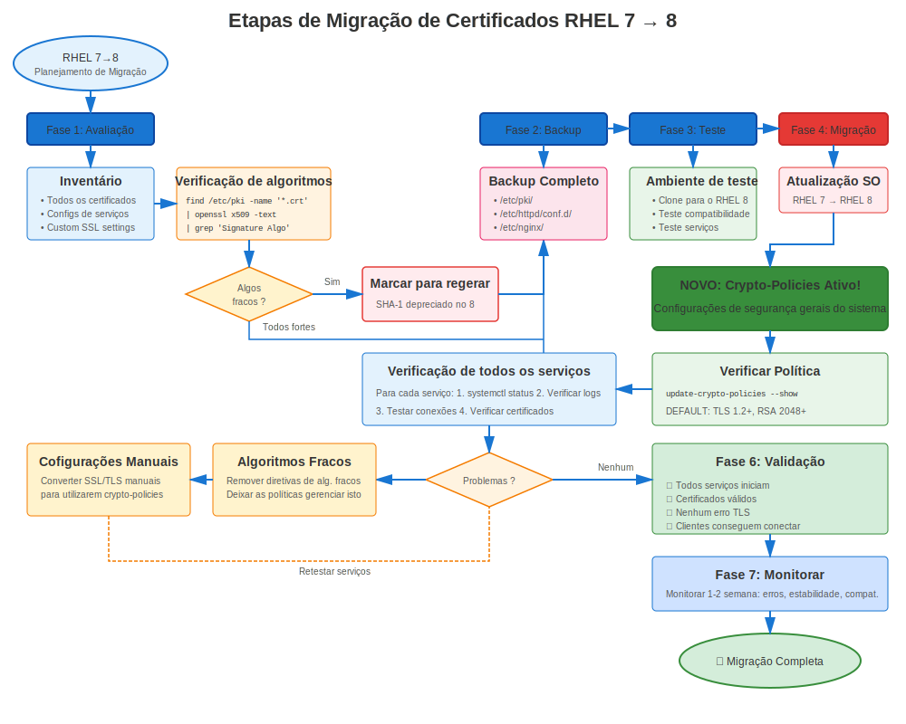

# Capítulo 35: Migração RHEL 7→8

> **Grande Salto:** Migrar do RHEL 7 para RHEL 8 introduz crypto-policies - mudança revolucionária em gerenciamento de certificados. Planejar cuidadosamente!

---

## 35.1 Impacto Certificado: MODERADO-ALTO



### O Que Muda

| Recurso | RHEL 7 | RHEL 8 | Impacto |
|---------|--------|--------|---------|
| **OpenSSL** | 1.0.2k | 1.1.1k | Moderado |
| **Versões TLS** | 1.0/1.1/1.2 | 1.2/1.3 (DEFAULT) | **ALTO** |
| **Crypto-Policies** | Nenhuma | **NOVA!** | **ALTO** |
| **Cifras Padrão** | Mistas | Mais Rigorosas | Moderado |
| **certmonger** | Básico | Aprimorado | Baixo |
| **Gerenciamento** | Manual | Automatizado (crypto-policies) | **ALTO** |

**Mudança Chave:** **crypto-policies** revolucionam gerenciamento TLS!

---

## 35.2 Preparação Pré-Migração

### Tarefas Pré-Migração Específicas Certificado

```bash
#============================================#
# PREPARAÇÃO CERTIFICADO RHEL 7→8
#============================================#

# Tarefa 1: Auditar todos certificados (ver Cap 34)
./pre-migration-cert-audit.sh > rhel7-cert-audit.txt

# Tarefa 2: Verificar por dependências TLS 1.0/1.1
# Revisar configs serviço
grep -r "TLSv1\|TLSv1.1" /etc/httpd/ /etc/nginx/ /etc/postfix/

# Tarefa 3: Identificar configurações cipher manuais
# Estas serão sobrescritas por crypto-policies!
grep -r "SSLCipherSuite\|ssl_ciphers\|smtp.*ciphers" /etc/httpd/ /etc/nginx/ /etc/postfix/

# Tarefa 4: Testar compatibilidade TLS 1.2
# Garantir todos clientes suportam TLS 1.2+

# Tarefa 5: Backup de tudo
sudo tar czf rhel7-complete-backup-$(date +%Y%m%d).tar.gz \
  /etc/pki/ \
  /etc/httpd/ \
  /etc/nginx/ \
  /etc/postfix/ \
  /var/lib/certmonger/
```

---

## 35.3 Migração Usando leapp

### O Utilitário leapp

**IMPORTANTE:** Use `leapp` para migração RHEL 7→8 (NÃO `redhat-upgrade-tool`!)

**leapp** é o utilitário atualização suportado Red Hat para RHEL 7→8 e 8→9.

```bash
#============================================#
# MIGRAÇÃO RHEL 7→8 COM LEAPP
#============================================#

# Pré-requisitos
# - RHEL 7.9 (último)
# - Subscription Red Hat válida
# - Todas atualizações aplicadas
# - Backups completos

# Passo 1: Atualizar RHEL 7 para último
sudo yum update -y
sudo reboot

# Passo 2: Instalar leapp
sudo yum install leapp-upgrade -y

# Passo 3: Executar verificação pré-atualização
sudo leapp preupgrade

# Revisar relatório:
cat /var/log/leapp/leapp-report.txt

# Inibidores comuns relacionados certificado:
# - Certificados SHA-1
# - Configurações cipher fracas
# - Pacotes não suportados

# Passo 4: Corrigir problemas identificados
# Reemitir certificados SHA-1
# Atualizar configurações

# Passo 5: Executar atualização
sudo leapp upgrade

# Sistema baixa RHEL 8, prepara atualização
# Reinicia automaticamente

# Passo 6: Após reboot, sistema é RHEL 8!
cat /etc/redhat-release
# Red Hat Enterprise Linux release 8.X (Ootpa)
```

---

## 35.4 Validação Certificado Pós-Migração

### Verificações Pós-Migração Imediatas

```bash
#============================================#
# VALIDAÇÃO CERTIFICADO PÓS-MIGRAÇÃO
#============================================#

# Verificação 1: Verificar RHEL 8
cat /etc/redhat-release
openssl version
# Deveria mostrar: OpenSSL 1.1.1k

# Verificação 2: Verificar crypto-policy
update-crypto-policies --show
# DEFAULT (deveria ser definida automaticamente)

# Verificação 3: Verificar arquivos certificado ainda presentes
ls -la /etc/pki/tls/certs/
ls -la /etc/pki/tls/private/

# Verificação 4: Verificar permissões inalteradas
ls -l /etc/pki/tls/private/*.key
# Deveriam ainda ser 600

# Verificação 5: Verificar CAs customizadas
ls -la /etc/pki/ca-trust/source/anchors/

# Verificação 6: Atualizar repositório de confiança (só por garantia)
sudo update-ca-trust

# Verificação 7: Verificar rastreamento certmonger
sudo getcert list
# Todos certificados deveriam ainda estar rastreados

# Verificação 8: Verificar configurações serviço
# crypto-policies podem tê-las atualizado
cat /etc/crypto-policies/back-ends/httpd.config
```

---

## 35.5 Restart e Teste Serviço

### Reiniciar Todos Serviços

```bash
#============================================#
# REINICIAR SERVIÇOS APÓS MIGRAÇÃO
#============================================#

# Reiniciar serviços usando certificados
sudo systemctl restart httpd
sudo systemctl restart nginx
sudo systemctl restart postfix
sudo systemctl restart slapd
sudo systemctl restart postgresql
sudo systemctl restart mariadb

# Verificar status serviço
systemctl status httpd nginx postfix | grep "Active:"

# Testar cada serviço
curl -v https://localhost/                             # Apache/NGINX
openssl s_client -connect localhost:443                # HTTPS
openssl s_client -starttls smtp -connect localhost:25  # Postfix
openssl s_client -connect localhost:636                # LDAPS
```

---

## 35.6 Problemas Comuns Certificado RHEL 7→8

### Problema 1: Clientes TLS 1.0/1.1 Não Conseguem Conectar

**Sintoma:** Clientes antigos falham após migração

**Causa:** Política DEFAULT crypto bloqueia TLS 1.0/1.1

**Correção Rápida (Temporária):**
```bash
sudo update-crypto-policies --set LEGACY
sudo systemctl restart httpd nginx postfix
```

**Correção Apropriada:**
```bash
# Atualizar clientes para suportar TLS 1.2+
# Ou criar módulo política customizado
```

### Problema 2: Cifras Codificadas Conflitam com crypto-policy

**Sintoma:** Serviço não inicia ou comporta inesperadamente

**Causa:** Config antiga tem SSLCipherSuite que conflita

**Correção:**
```bash
# Remover configs cipher codificadas
# Deixar crypto-policy lidar com isso

# Apache: Remover de ssl.conf
# SSLProtocol ...
# SSLCipherSuite ...

# NGINX: Remover de nginx.conf
# ssl_protocols ...
# ssl_ciphers ...

# Postfix: Remover de main.cf
# smtpd_tls_protocols ...
# smtpd_tls_mandatory_ciphers ...
```

### Problema 3: Rastreamento certmonger Perdido

**Sintoma:** `getcert list` mostra vazio ou certificados faltando

**Raro mas possível se migração teve problemas**

**Correção:**
```bash
# Restaurar banco dados certmonger de backup
sudo systemctl stop certmonger
sudo tar xzf /var/backups/pre-migration-*/certmonger.tar.gz -C /
sudo systemctl start certmonger

# Verificar
sudo getcert list
```

---

## 35.7 Transição Crypto-Policy

### Adotando Crypto-Policies

**RHEL 7:** Sem crypto-policies, config manual por serviço
**RHEL 8:** crypto-policies gerenciam TLS system-wide

```bash
#============================================#
# TRANSIÇÃO PARA CRYPTO-POLICIES
#============================================#

# Após migração para RHEL 8:

# Passo 1: Verificar política atual
update-crypto-policies --show
# DEFAULT

# Passo 2: Remover configs TLS manuais de serviços
# (Deixar crypto-policy lidar com isso)

# Passo 3: Testar com política DEFAULT
sudo systemctl restart httpd nginx postfix

# Passo 4: Se clientes antigos necessitam TLS 1.0/1.1 (temporário!)
sudo update-crypto-policies --set LEGACY

# Passo 5: Planejar voltar para DEFAULT
# Atualizar clientes, então:
sudo update-crypto-policies --set DEFAULT
```

---

## 35.8 Exemplo Runbook Migração

### Execução Passo-a-Passo

```markdown
## Runbook Migração RHEL 7→8 - Seção Certificado

### Pré-Migração (T-24 horas)
- [ ] Verificar backups completos e testados
- [ ] Verificar todos certificados válidos > 90 dias
- [ ] Sem certificados SHA-1 restantes
- [ ] Migração ambiente teste bem-sucedida

### Início Janela Migração (T=0)
- [ ] Anunciar janela manutenção
- [ ] Fazer backup final
- [ ] Executar: `sudo leapp upgrade`
- [ ] Sistema reinicia automaticamente

### Pós-Reboot (T+30 min)
- [ ] Verificar RHEL 8: `cat /etc/redhat-release`
- [ ] Verificar crypto-policy: `update-crypto-policies --show`
- [ ] Verificar certificados presentes: `ls /etc/pki/tls/certs/`
- [ ] Verificar certmonger: `sudo getcert list`

### Validação Serviço (T+45 min)
- [ ] Reiniciar todos serviços
- [ ] Testar Apache: `curl -v https://localhost/`
- [ ] Testar NGINX: `curl -v https://localhost:8443/`
- [ ] Testar Postfix: `openssl s_client -starttls smtp -connect localhost:25`
- [ ] Testar LDAP: `ldapsearch -H ldaps://localhost:636 -x -b ""`
- [ ] Testar bancos dados (se aplicável)

### Teste Cliente (T+60 min)
- [ ] Testar de clientes Windows
- [ ] Testar de clientes Linux
- [ ] Testar de clientes aplicação
- [ ] Verificar sem erros TLS

### Monitoramento (T+2 horas a T+48 horas)
- [ ] Monitorar logs por erros certificado
- [ ] Monitorar saúde serviço
- [ ] Verificar renovações certmonger
- [ ] Verificar sem problemas crypto-policy

### Conclusão
- [ ] Documentar quaisquer problemas encontrados
- [ ] Atualizar runbook com lições aprendidas
- [ ] Fechar janela manutenção
- [ ] Notificar stakeholders de migração bem-sucedida
```

---

## 35.9 Conclusões Chave

1. **Usar utilitário leapp** para migração RHEL 7→8 (método suportado)
2. **crypto-policies são NOVAS** no RHEL 8 - Mudança principal!
3. **TLS 1.0/1.1 desabilitados por padrão** - Testar compatibilidade cliente
4. **Remover configs TLS manuais** - Deixar crypto-policy gerenciar
5. **Testar extensivamente** antes migração produção
6. **Política LEGACY disponível** para compatibilidade (temporária!)
7. **Rastreamento certmonger deveria sobreviver** migração

---

## Cartão de Referência Rápida

```
┌──────────────────────────────────────────────────────────────┐
│ CHECKLIST CERTIFICADO MIGRAÇÃO RHEL 7→8                      │
├──────────────────────────────────────────────────────────────┤
│ Antes:         Auditar todos certificados                    │
│                Reemitir certificados SHA-1                   │
│                Testar compatibilidade TLS 1.2                │
│                Backup de tudo                                │
│                                                              │
│ Migração:      Usar leapp upgrade (NÃO redhat-upgrade-tool!) │
│                Sistema reinicia automaticamente              │
│                                                              │
│ Após:          Verificar RHEL 8                              │
│                Verificar crypto-policy (DEFAULT)             │
│                Reiniciar todos serviços                      │
│                Testar conexões cliente                       │
│                Monitorar por 48 horas                        │
│                                                              │
│ Novo Recurso:  crypto-policies (controle TLS system-wide)    │
│ Bloqueado:     TLS 1.0/1.1 (em política DEFAULT)             │
│ Fallback:      Política LEGACY (se necessário, temporário!)  │
└──────────────────────────────────────────────────────────────┘

✅ Usar leapp (oficialmente suportado)
⚠️ Mudança principal: crypto-policies introduzidas
⚠️ Testar suporte TLS 1.2 cliente antes migração
```

---

## 🧪 Laboratório Prático

**Lab 17: Migração RHEL 7→8**

Migre certificados durante atualização do SO para RHEL 8

- 📁 **Localização:** `labs/pt_BR/17-rhel7to8-migration/`
- ⏱️ **Tempo:** 40-50 minutos
- 🎯 **Nível:** Avançado

---

**Navegação do Capítulo**

| [← Anterior: Capítulo 34 - Planejamento e Preparação de Migração RHEL](34-migration-planning.md) | [Próximo: Capítulo 36 - Migração RHEL 8→9 →](36-rhel8-to-9.md) |
|:---|---:|
