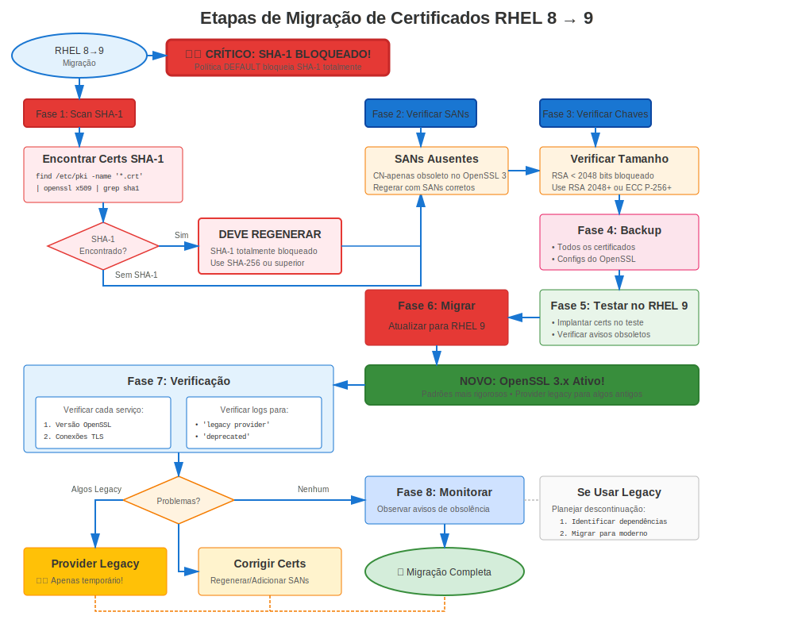

# Capítulo 36: Migração RHEL 8→9

> **Transição OpenSSL 3.x:** RHEL 8→9 traz OpenSSL 3.x com arquitetura provider e validação mais rigorosa. Planejar cuidadosamente para esta mudança significativa.

---

## 36.1 Impacto Certificado: ALTO



### O Que Muda

| Recurso | RHEL 8 | RHEL 9 | Impacto |
|---------|--------|--------|---------|
| **OpenSSL** | 1.1.1k | **3.5.5** | **ALTO** |
| **Arquitetura** | Tradicional | **Baseada Provider** | **ALTO** |
| **TLS 1.0/1.1** | Política LEGACY | **Completamente removido** | **ALTO** |
| **SHA-1** | Depreciado | **Bloqueado** | **ALTO** |
| **Validação** | Padrão | **Mais Rigorosa** | Moderado |
| **Crypto-Policies** | Básica | **Subpolíticas** | Baixo |
| **certmonger** | Aprimorado | **Suporte ACME** | Baixo |

**Mudança Chave:** **OpenSSL 3.x** é mudança arquitetural principal!

---

## 36.2 Requisitos Pré-Migração

### Correções Certificado Críticas

**Requisito 1: SEM Assinaturas SHA-1**
```bash
#============================================#
# VERIFICAR POR SHA-1 (FALHARÁ NO RHEL 9!)
#============================================#

# Encontrar certificados assinados SHA-1
for cert in /etc/pki/tls/certs/*.crt; do
  SIG=$(openssl x509 -in "$cert" -noout -text 2>/dev/null | \
        grep "Signature Algorithm" | head -2)
  if echo "$SIG" | grep -qi "sha1"; then
    echo "🚨 CRÍTICO: Assinatura SHA-1: $cert"
    echo "   $SIG"
    echo "   ⚠️ DEVE reemitir antes migração RHEL 9!"
  fi
done

# Ação: Reemitir TODOS certificados SHA-1 antes migração
# Sem exceções - eles FALHARÃO no RHEL 9
```

**Requisito 2: Todos Certificados Válidos**
```bash
# Garantir sem certificados expirados
for cert in /etc/pki/tls/certs/*.crt; do
  if ! openssl x509 -in "$cert" -noout -checkend 0 2>/dev/null; then
    echo "❌ Expirado: $cert"
  fi
done
```

**Requisito 3: Testar Aplicações Customizadas**
```bash
# Se você tem aplicações customizadas usando OpenSSL
# Elas podem necessitar atualizações para API OpenSSL 3.x
rpm -qa | grep -E "custom|local"

# Testar estas aplicações em ambiente RHEL 9 antes migração
```

---

## 36.3 Migração Usando leapp

### Processo Atualização RHEL 8→9

```bash
#============================================#
# MIGRAÇÃO RHEL 8→9 COM LEAPP
#============================================#

# Pré-requisitos
# - RHEL 8.10 (último recomendado)
# - Subscription válida
# - Todas atualizações aplicadas
# - Backups completos
# - Certificados SHA-1 reemitidos!

# Passo 1: Atualizar RHEL 8 completamente
sudo dnf update -y
sudo reboot

# Passo 2: Instalar leapp
sudo dnf install leapp-upgrade -y

# Passo 3: Executar verificação pré-atualização
sudo leapp preupgrade

# Revisar relatório
cat /var/log/leapp/leapp-report.txt

# Verificações relacionadas certificado:
# - Avisos certificado SHA-1
# - Compatibilidade OpenSSL
# - Compatibilidade app customizada

# Passo 4: Abordar inibidores
# Corrigir quaisquer problemas bloqueantes

# Passo 5: Executar atualização
sudo leapp upgrade

# Baixa RHEL 9, prepara atualização
# Reinicia para executar atualização
# Reinicia novamente para RHEL 9

# Passo 6: Verificar RHEL 9
cat /etc/redhat-release
# Red Hat Enterprise Linux release 9.X (Plow)

openssl version
# OpenSSL 3.5.5
```

---

## 36.4 Validação Pós-Migração

### Validação Específica Certificado

```bash
#============================================#
# VALIDAÇÃO CERTIFICADO PÓS-MIGRAÇÃO (RHEL 9)
#============================================#

# Verificação 1: Versão OpenSSL
openssl version
# OpenSSL 3.5.5  ← Confirmar

# Verificação 2: Verificar providers
openssl list -providers
# Deveria mostrar: default, fips, legacy, base

# Verificação 3: Verificar certificados ainda presentes
ls -la /etc/pki/tls/certs/
ls -la /etc/pki/tls/private/

# Verificação 4: Testar validação certificado
for cert in /etc/pki/tls/certs/*.crt; do
  openssl verify "$cert" 2>&1 | grep -v "OK" && echo "Problema: $cert"
done

# Verificação 5: Verificar crypto-policy
update-crypto-policies --show
# DEFAULT (deveria ser mantida)

# Verificação 6: Testar operações certificado
openssl x509 -in /etc/pki/tls/certs/server.crt -noout -text

# Verificação 7: Verificar rastreamento certmonger
sudo getcert list
# Todos certificados deveriam ainda estar rastreados

# Verificação 8: Verificar repositório de confiança
trust list | head -20
```

---

## 36.5 Validação Serviço

### Testar Todos Serviços

```bash
#============================================#
# VALIDAÇÃO SERVIÇO PÓS-MIGRAÇÃO
#============================================#

# Reiniciar serviços
sudo systemctl restart httpd nginx postfix slapd postgresql mariadb 2>/dev/null

# Testar cada serviço
echo "Testando Apache..."
curl -v https://localhost/ 2>&1 | grep -E "(SSL connection|subject:)"

echo "Testando com OpenSSL 3.x..."
openssl s_client -connect localhost:443 -tls1_3

echo "Testando Postfix..."
openssl s_client -starttls smtp -connect localhost:25 </dev/null

echo "Testando LDAPS..."
openssl s_client -connect localhost:636 </dev/null

# Verificar por erros provider
sudo journalctl --since "1 hour ago" | grep -i "provider\|unsupported"
```

---

## 36.6 Problemas Comuns RHEL 8→9

### Problema 1: Certificados SHA-1 Rejeitados

**Sintoma:**
```
openssl verify server.crt
# error 3 at 0 depth lookup: CA md too weak
```

**Causa:** Certificado tem assinatura SHA-1 (bloqueado no RHEL 9)

**Solução:**
```bash
# SEM WORKAROUND - Deve reemitir
# Isto deveria ter sido feito pré-migração!

# Emergência: Reemitir imediatamente
openssl req -new -key server.key -out server.csr -sha256
# Submeter para CA, instalar novo certificado
```

### Problema 2: Erros Algoritmo Legado

**Sintoma:**
```
openssl md5 file.txt
# Erro: unsupported
```

**Causa:** MD5 e outros algoritmos legados requerem provider explícito

**Solução:**
```bash
# Usar provider legado
openssl md5 -provider legacy file.txt

# Melhor: Atualizar para usar SHA-256
openssl sha256 file.txt
```

### Problema 3: Incompatibilidade OpenSSL 3.x Aplicação Customizada

**Sintoma:** Aplicação customizada falha com erros OpenSSL

**Causa:** Aplicação compilada contra OpenSSL 1.1.1, API mudou no 3.x

**Solução:**
```bash
# Recompilar aplicação contra OpenSSL 3.x
# Ou atualizar código aplicação para nova API

# Workaround temporário (se disponível):
# Usar biblioteca compat (se fornecida)
```

---

## 36.7 Considerações crypto-policy

### Crypto-Policy Após Migração

```bash
#============================================#
# CRYPTO-POLICY PÓS-MIGRAÇÃO
#============================================#

# Verificar política atual (deveria ser mantida)
update-crypto-policies --show

# RHEL 9 suporta subpolíticas!
# Exemplo: Desabilitar completamente SHA-1
sudo update-crypto-policies --set DEFAULT:NO-SHA1

# Listar módulos disponíveis
ls /usr/share/crypto-policies/policies/modules/

# Testar política
sudo systemctl restart httpd
curl -v https://localhost/
```

---

## 36.8 certmonger Após Migração

### Verificar Funcionalidade certmonger

```bash
#============================================#
# CERTMONGER PÓS-MIGRAÇÃO
#============================================#

# Verificar status certmonger
systemctl status certmonger

# Listar certificados rastreados
sudo getcert list

# Verificar por problemas
sudo getcert list | grep "status:" | grep -v "MONITORING"

# Se usando FreeIPA, testar conectividade
ipa ping

# Forçar teste renovação
sudo ipa-getcert resubmit -f /etc/pki/tls/certs/test.crt

# RHEL 9 NOVO: Suporte ACME disponível
# Pode agora usar certmonger com Let's Encrypt nativamente!
```

---

## 36.9 Runbook Migração

### Runbook Focado Certificado

```markdown
## Migração RHEL 8→9 - Seção Certificado

### Pré-Migração (T-24 horas)
- [ ] Verificar SEM certificados SHA-1 (crítico!)
- [ ] Todos certificados válidos > 90 dias
- [ ] Backups completos e testados
- [ ] Migração teste bem-sucedida
- [ ] Apps customizadas testadas no RHEL 9

### Início Janela Migração (T=0)
- [ ] Backup final
- [ ] Executar: `sudo leapp upgrade`
- [ ] Sistema reinicia (duas vezes)

### Validação Pós-Reboot (T+45 min)
- [ ] Verificar RHEL 9: `cat /etc/redhat-release`
- [ ] Verificar OpenSSL 3.5.5: `openssl version`
- [ ] Verificar providers: `openssl list -providers`
- [ ] Verificar certificados: `ls /etc/pki/tls/certs/`
- [ ] Verificar crypto-policy: `update-crypto-policies --show`
- [ ] Verificar certmonger: `sudo getcert list`

### Restart Serviço (T+60 min)
- [ ] Reiniciar todos serviços usando certificados
- [ ] Testar Apache/NGINX
- [ ] Testar Postfix
- [ ] Testar LDAP
- [ ] Testar bancos dados

### Validação Certificado (T+90 min)
- [ ] Sem rejeições SHA-1
- [ ] Todos certificados validam: `openssl verify`
- [ ] TLS 1.3 funcionando: `openssl s_client -tls1_3`
- [ ] Sem erros provider em logs
- [ ] Status certmonger tudo MONITORING

### Teste Cliente (T+2 horas)
- [ ] Testar de todos tipos cliente
- [ ] Verificar sem problemas compatibilidade
- [ ] Verificar funcionalidade aplicação

### Pós-Migração (24-48 horas)
- [ ] Monitorar por problemas OpenSSL 3.x
- [ ] Verificar renovações certmonger
- [ ] Monitorar logs serviço
- [ ] Documentar quaisquer problemas
```

---

## 36.10 Conclusões Chave

1. **OpenSSL 3.x é mudança principal** - Arquitetura provider é nova
2. **SHA-1 DEVE ser eliminado** antes migração - Sem exceções!
3. **Usar leapp para migração** (oficialmente suportado)
4. **Testar aplicações customizadas** no RHEL 9 primeiro
5. **Validação mais rigorosa** captura mais problemas (bom para segurança!)
6. **certmonger ganha suporte ACME** no RHEL 9
7. **Subpolíticas disponíveis** para ajuste fino

---

## Cartão de Referência Rápida

```
┌──────────────────────────────────────────────────────────────────┐
│ CHECKLIST CERTIFICADO MIGRAÇÃO RHEL 8→9                          │
├──────────────────────────────────────────────────────────────────┤
│ CRÍTICO:   SEM certificados SHA-1! (serão rejeitados)            │
│            Reemitir todos certs SHA-1 antes migração             │
│                                                                  │
│ Antes:     Verificar SEM assinaturas SHA-1                       │
│            Testar apps customizadas no RHEL 9                    │
│            Backup de tudo                                        │
│                                                                  │
│ Migração:  Usar leapp upgrade                                    │
│            Sistema reinicia duas vezes                           │
│                                                                  │
│ Após:      Verificar OpenSSL 3.5.5                               │
│            Verificar providers: openssl list -providers          │
│            Testar algoritmos legados necessitam -provider legacy │
│            Reiniciar todos serviços                              │
│            Verificar rastreamento certmonger mantido             │
│                                                                  │
│ Novo:      Arquitetura provider                                  │
│            Subpolíticas (DEFAULT:NO-SHA1)                        │
│            Suporte ACME certmonger                               │
└──────────────────────────────────────────────────────────────────┘

🚨 SHA-1 está BLOQUEADO - reemitir antes migração!
✅ OpenSSL 3.x traz segurança mais rigorosa
✅ certmonger funciona com Let's Encrypt nativamente
```

---

## 🧪 Laboratório Prático

**Lab 18: Migração RHEL 8→9**

Lide com OpenSSL 3.x e segurança mais rígida no RHEL 9

- 📁 **Localização:** `labs/pt_BR/18-rhel8to9-migration/`
- ⏱️ **Tempo:** 40-50 minutos
- 🎯 **Nível:** Avançado

---

**Navegação do Capítulo**

| [← Anterior: Capítulo 35 - Migração RHEL 7→8](35-rhel7-to-8.md) | [Próximo: Capítulo 37 - Solução de Problemas e Recuperação de Migração →](37-migration-troubleshooting.md) |
|:---|---:|
