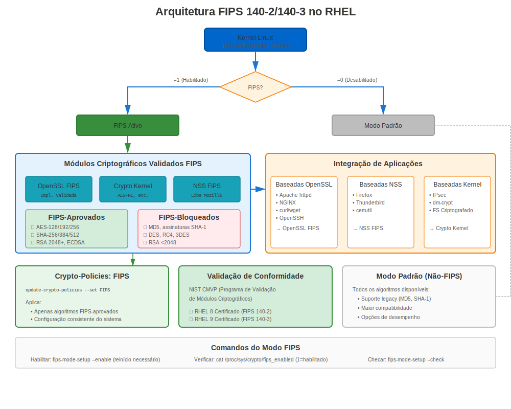
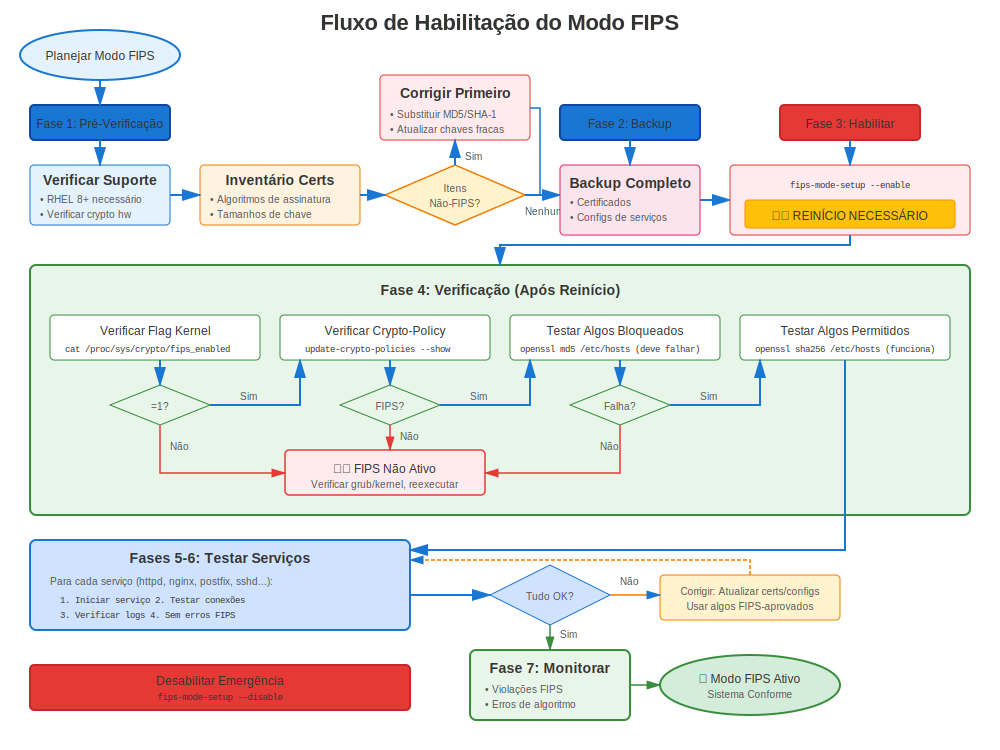

# Capítulo 38: Guia Completo do Modo FIPS

> **Conformidade Federal:** Conformidade FIPS 140-2/140-3 é requerida para sistemas federais EUA e muitas indústrias regulamentadas. Aprenda como habilitar e gerenciar modo FIPS no RHEL.

---

## 38.1 O Que é FIPS?





**FIPS** = Federal Information Processing Standards

**FIPS 140-2/140-3** = Programa Validação Módulo Criptográfico

**Propósito:**
- ✅ Validar módulos criptográficos cumprem requisitos segurança
- ✅ Garantir implementação apropriada de algoritmos aprovados
- ✅ Requerido para sistemas governo federal EUA
- ✅ Frequentemente requerido para: Bancário, planos de saúde, contratados defesa

### Estado da Validação FIPS por Versão RHEL

| Versão RHEL | Estado FIPS | Padrão | Notas |
|-------------|-------------|--------|-------|
| **RHEL 7** | Validado | **FIPS 140-2** | Módulos OpenSSL 1.0.2 validados |
| **RHEL 8** | Validado | **FIPS 140-2** | OpenSSL 1.1.1, NSS, libgcrypt validados |
| **RHEL 9** | Validado | **FIPS 140-2** | Provider OpenSSL 3.x, transição para 140-3 em progresso |
| **RHEL 10** | Em processo | **FIPS 140-2/140-3** | Transição contínua, verificar estado atual |

> **Importante:** Em 2025, RHEL 9 usa módulos validados FIPS 140-2. Transição para FIPS 140-3 está em progresso mas ainda não completa. Sempre verificar estado validação atual em https://csrc.nist.gov/projects/cryptographic-module-validation-program

---

## 38.2 Habilitando Modo FIPS

### FIPS Tempo-Instalação (Recomendado)

**Melhor Prática:** Habilitar FIPS durante instalação RHEL

```bash
# No prompt boot instalação, adicionar:
fips=1

# Sistema instala em modo FIPS desde início
# Todas operações criptográficas são conformes FIPS desde boot
```

**Por Que Tempo-Instalação é Melhor:**
- Kernel apropriadamente configurado
- Todos pacotes instalados em modo FIPS
- Sem necessidade migração pós-instalação
- Estado FIPS mais limpo

### FIPS Pós-Instalação (RHEL 8/9/10)

```bash
#============================================#
# HABILITAR MODO FIPS PÓS-INSTALAÇÃO
#============================================#

# Verificar estado FIPS atual
fips-mode-setup --check
# FIPS mode is disabled.

# Habilitar modo FIPS
sudo fips-mode-setup --enable

# Saída mostra o que mudará:
# - Parâmetros boot kernel
# - Crypto policy
# - Reconfiguração sistema

# DEVE REINICIAR!
sudo reboot

# Após reboot, verificar
fips-mode-setup --check
# FIPS mode is enabled.

# Verificar crypto-policy
update-crypto-policies --show
# FIPS

# Verificar provider FIPS carregado (RHEL 9+)
openssl list -providers | grep fips
#   fips
#     name: OpenSSL FIPS Provider
#     version: 3.5.5
#     status: active
```

---

## 38.3 Requisitos FIPS para Certificados

### Algoritmos Aprovados

**Aprovados FIPS para Certificados:**
```
✅ RSA: 2048, 3072, 4096 bits
✅ ECC: P-256 (secp256r1), P-384 (secp384r1), P-521 (secp521r1)
✅ Assinaturas: SHA-256, SHA-384, SHA-512
✅ TLS: Apenas 1.2, 1.3
```

**Bloqueados em Modo FIPS:**
```
❌ RSA < 2048 bits
❌ MD5, SHA-1
❌ TLS 1.0, 1.1
❌ 3DES, RC4, DES
❌ Chaves DSA
❌ Curvas elípticas não aprovadas
```

---

## 38.4 Gerando Certificados Conformes FIPS

### Geração Chave Conforme FIPS

```bash
#============================================#
# GERAR CHAVES CONFORMES FIPS
#============================================#

# Verificar modo FIPS habilitado
fips-mode-setup --check

# Gerar chave RSA 2048 (conforme FIPS)
openssl genpkey -algorithm RSA -out fips-server.key \
  -pkeyopt rsa_keygen_bits:2048

# RSA 3072 (mais forte, ainda conforme FIPS)
openssl genpkey -algorithm RSA -out fips-server.key \
  -pkeyopt rsa_keygen_bits:3072

# EC P-256 (curva aprovada FIPS)
openssl genpkey -algorithm EC -out fips-ec.key \
  -pkeyopt ec_paramgen_curve:P-256

# EC P-384 (mais forte, aprovada FIPS)
openssl genpkey -algorithm EC -out fips-ec.key \
  -pkeyopt ec_paramgen_curve:P-384

# Verificar chave gerada em modo FIPS
openssl pkey -in fips-server.key -check
```

### CSR Conforme FIPS

```bash
#============================================#
# GERAR CSR CONFORME FIPS
#============================================#

# CSR com SHA-256 (aprovado FIPS)
openssl req -new -key fips-server.key -out fips-server.csr \
  -sha256 \
  -subj "/C=US/O=Federal Agency/CN=secure.example.gov" \
  -addext "subjectAltName=DNS:secure.example.gov"

# SHA-384 (mais forte, aprovado FIPS)
openssl req -new -key fips-server.key -out fips-server.csr \
  -sha384 \
  -subj "/C=US/O=Federal Agency/CN=secure.example.gov"

# ❌ NUNCA usar SHA-1 ou MD5 em modo FIPS
# Eles serão rejeitados!
```

---

## 38.5 Verificação Modo FIPS

### Verificação FIPS Completa

```bash
#============================================#
# VERIFICAR MODO FIPS ESTÁ ATIVO
#============================================#

# Verificação 1: fips-mode-setup
fips-mode-setup --check
# FIPS mode is enabled.

# Verificação 2: Parâmetro kernel
cat /proc/cmdline | grep fips
# Deveria mostrar: fips=1

# Verificação 3: Crypto-policy
update-crypto-policies --show
# FIPS

# Verificação 4: Provider FIPS OpenSSL (RHEL 9+)
openssl list -providers
# Deveria mostrar provider fips como ativo

# Verificação 5: Testar operação apenas-FIPS
# Tentar algoritmo não-FIPS (deveria falhar)
echo "test" | openssl md5
# Erro: disabled for FIPS  ← Bom!

# Verificação 6: Verificar operações certificado usam FIPS
openssl version -a | grep FIPS
```

---

## 38.6 Crypto-Policy FIPS

### Entendendo Política FIPS

```bash
#============================================#
# DETALHES CRYPTO-POLICY FIPS
#============================================#

# Política é automaticamente definida para FIPS quando modo FIPS habilitado
update-crypto-policies --show
# FIPS

# O que política FIPS força:
cat /etc/crypto-policies/back-ends/opensslcnf.config

# Configurações chave:
# - TLS 1.2 mínimo
# - Apenas cifras aprovadas FIPS
# - Apenas algoritmos assinatura aprovados FIPS
# - Chaves mínimo 2048 bits
```

**Não pode mudar de política FIPS enquanto em modo FIPS!**

---

## 38.7 Serviços em Modo FIPS

### Apache em Modo FIPS

```bash
#============================================#
# APACHE EM MODO FIPS
#============================================#

# Apache automaticamente usa política FIPS
# Sem configuração manual necessária!

# Verificar
sudo systemctl restart httpd

# Testar
openssl s_client -connect localhost:443

# Deveria mostrar:
# - TLS 1.2 ou 1.3
# - Cipher aprovado FIPS
# - Sem algoritmos fracos

# Ver config FIPS Apache real
cat /etc/crypto-policies/back-ends/httpd.config
```

### Outros Serviços

**Todos serviços automaticamente cumprem política FIPS:**
- NGINX → Usa cifras/protocolos FIPS
- Postfix → TLS conforme FIPS
- OpenSSH → Apenas algoritmos FIPS
- Bancos dados → SSL aprovado FIPS

---

## 38.8 Problemas FIPS Comuns

### Problema 1: Tentativa Algoritmo Não-FIPS

**Sintoma:**
```
Error: disabled for FIPS
```

**Exemplos:**
```bash
# MD5 (não aprovado FIPS)
openssl md5 file.txt
# Erro: digital envelope routines:EVP_DigestInit_ex:disabled for fips

# Assinatura SHA-1 (não aprovada FIPS para assinar)
openssl dgst -sha1 -sign key.pem file.txt
# Erro: disabled for fips
```

**Solução:**
```bash
# Usar algoritmos aprovados FIPS
openssl sha256 file.txt  # Usar SHA-256 em vez de MD5
openssl dgst -sha256 -sign key.pem file.txt  # Usar SHA-256 para assinar
```

### Problema 2: Aplicação Legada Incompatível

**Sintoma:** Aplicação falha em modo FIPS

**Causa:** Aplicação usa algoritmos não-FIPS (MD5, SHA-1, cifras fracas)

**Soluções:**
```bash
# Solução 1: Atualizar aplicação para usar algoritmos FIPS

# Solução 2: Se aplicação não pode ser atualizada:
# Pode não conseguir executar em modo FIPS
# Considerar se FIPS é realmente requerido

# Solução 3: Isolamento container (avançado)
# Executar app não-FIPS em container sem FIPS
```

---

## 38.9 Desabilitando Modo FIPS

### Quando e Como Desabilitar

```bash
#============================================#
# DESABILITAR MODO FIPS (se necessário)
#============================================#

# Verificar estado atual
fips-mode-setup --check

# Desabilitar FIPS
sudo fips-mode-setup --disable

# DEVE REINICIAR
sudo reboot

# Após reboot
fips-mode-setup --check
# FIPS mode is disabled.

# Crypto-policy reverte para DEFAULT
update-crypto-policies --show
# DEFAULT
```

**Nota:** Desabilitar FIPS pode ter implicações conformidade!

---

## 38.10 Conclusões Chave

1. **FIPS 140-2 é padrão atual** no RHEL (transição 140-3 em progresso)
2. **Habilitar na instalação** para estado FIPS mais limpo
3. **Habilitação pós-instalação requer reboot**
4. **Apenas algoritmos aprovados FIPS** permitidos
5. **Crypto-policy automaticamente definida para FIPS**
6. **Serviços automaticamente cumprem**
7. **Testar aplicações** antes habilitar FIPS em produção

---

## Cartão de Referência Rápida

```
┌──────────────────────────────────────────────────────────────┐
│ REFERÊNCIA RÁPIDA MODO FIPS                                  │
├──────────────────────────────────────────────────────────────┤
│ Estado:       fips-mode-setup --check                        │
│ Habilitar:    sudo fips-mode-setup --enable && reboot        │
│ Desabilitar:  sudo fips-mode-setup --disable && reboot       │
│                                                              │
│ Padrão:       FIPS 140-2 (validado)                          │
│               FIPS 140-3 (transição em progresso)            │
│                                                              │
│ Aprovado:     RSA 2048+, ECC P-256/384/521                   │
│               SHA-256/384/512                                │
│               TLS 1.2/1.3                                    │
│                                                              │
│ Bloqueado:    MD5, SHA-1, TLS 1.0/1.1                        │
│               RSA < 2048, 3DES, RC4                          │
│                                                              │
│ Política:     Automaticamente definida para FIPS             │
│ Verificar:    openssl list -providers | grep fips            │
└──────────────────────────────────────────────────────────────┘

⚠️ FIPS 140-2 é atual (transição 140-3 contínua)
⚠️ Requer reboot para habilitar/desabilitar
✅ Todos serviços RHEL automaticamente cumprem
```

---

## 🧪 Laboratório Prático

**Lab 19: Configuração do Modo FIPS**

Habilite e configure modo de conformidade FIPS 140-2

- 📁 **Localização:** `labs/pt_BR/19-fips-mode/`
- ⏱️ **Tempo:** 40-50 minutos
- 🎯 **Nível:** Avançado

---

**Navegação do Capítulo**

| [← Anterior: Capítulo 37 - Solução de Problemas e Recuperação de Migração](../part-06-migration/37-migration-troubleshooting.md) | [Próximo: Capítulo 39 - Certificados Conformes FIPS →](39-fips-certificates.md) |
|:---|---:|
